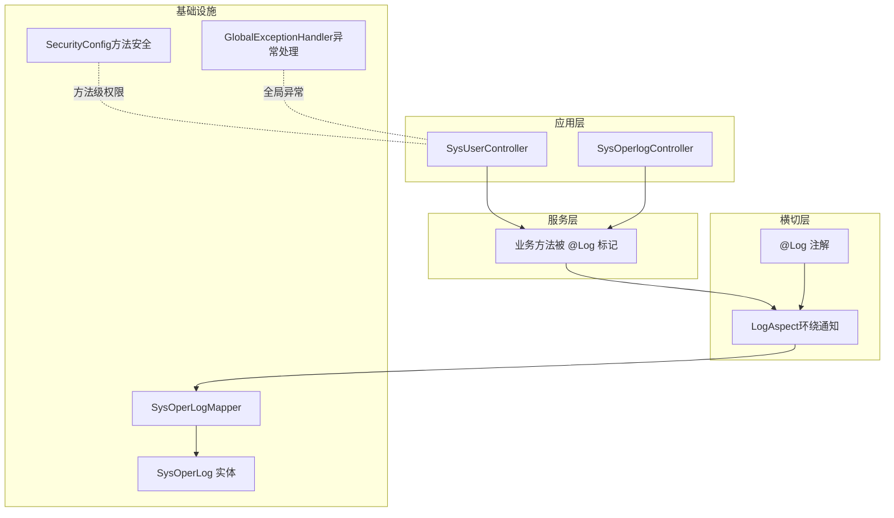
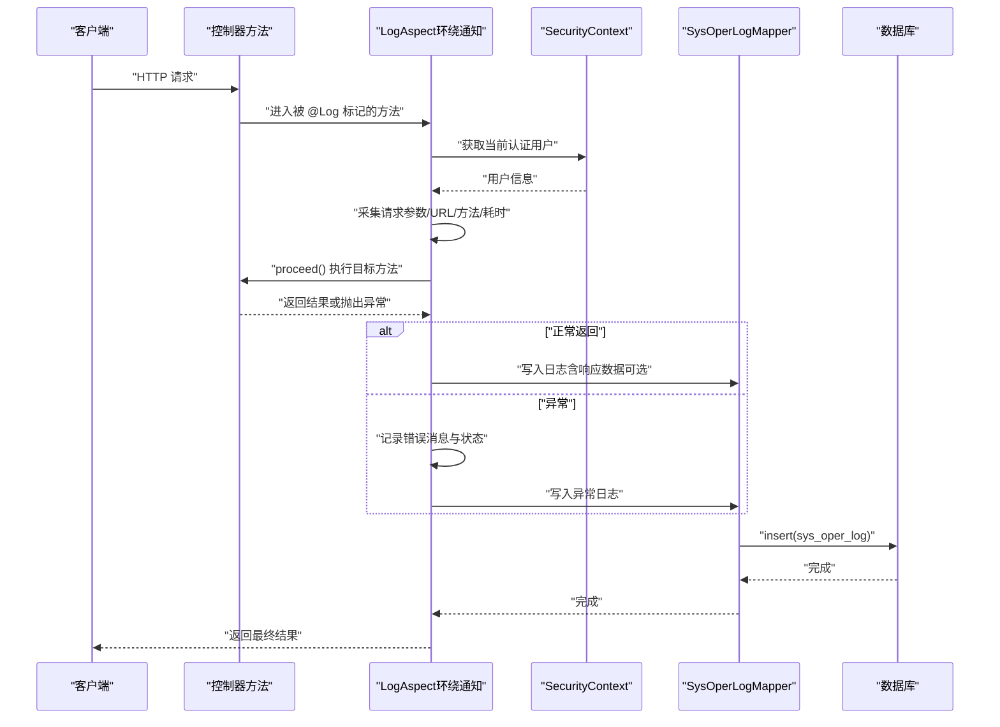
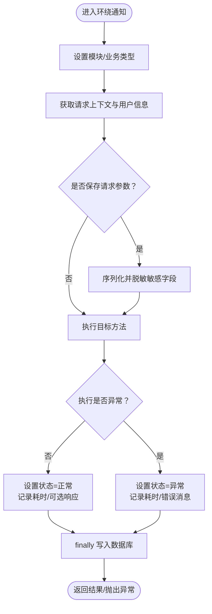
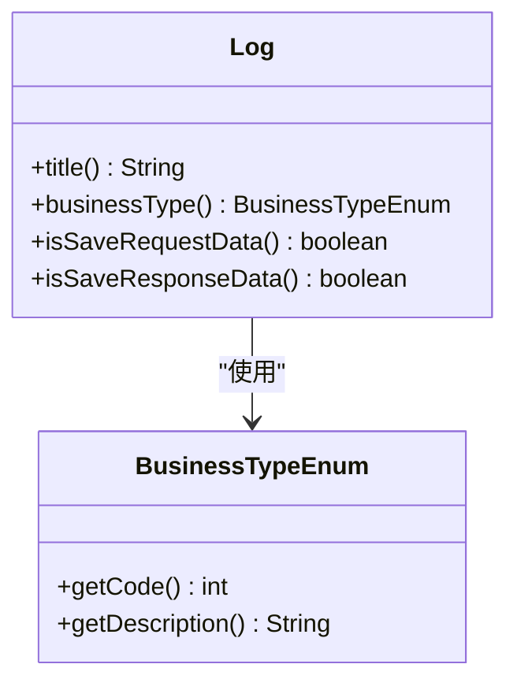
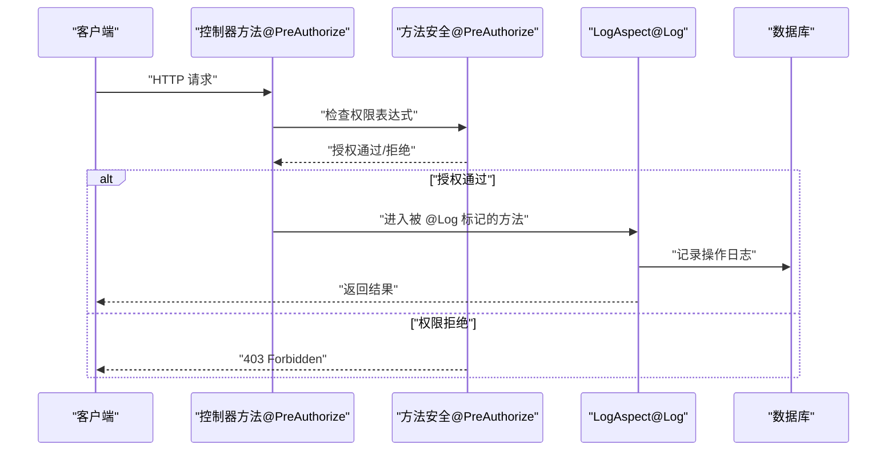
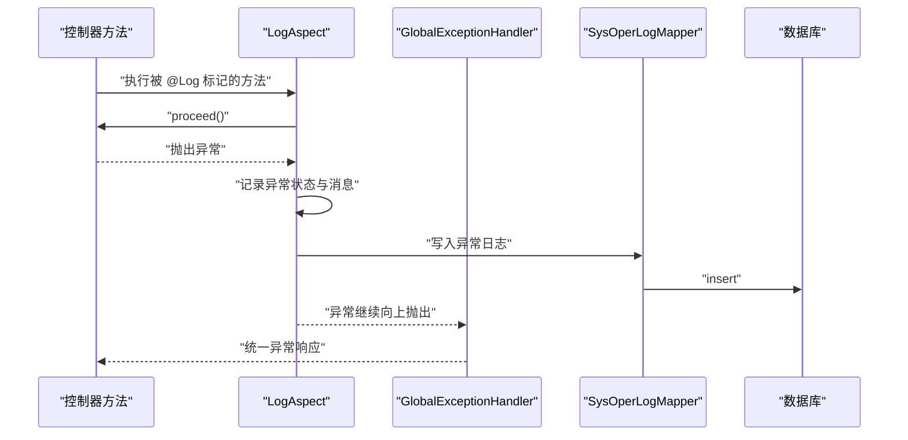
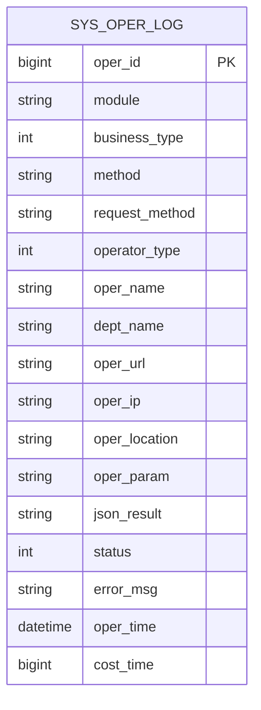
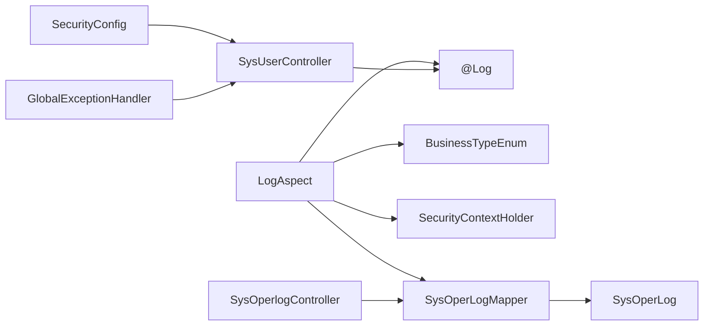

# 面向切面编程

<cite>
**本文引用的文件**
- [LogAspect.java](file://task-manager-backend/src/main/java/com/taskmanager/aspect/LogAspect.java)
- [Log.java](file://task-manager-backend/src/main/java/com/taskmanager/common/annotation/Log.java)
- [BusinessTypeEnum.java](file://task-manager-backend/src/main/java/com/taskmanager/common/enums/BusinessTypeEnum.java)
- [SysOperLog.java](file://task-manager-backend/src/main/java/com/taskmanager/domain/SysOperLog.java)
- [SysOperLogMapper.java](file://task-manager-backend/src/main/java/com/taskmanager/mapper/SysOperLogMapper.java)
- [SysUserController.java](file://task-manager-backend/src/main/java/com/taskmanager/controller/SysUserController.java)
- [SysOperlogController.java](file://task-manager-backend/src/main/java/com/taskmanager/controller/SysOperlogController.java)
- [SecurityConfig.java](file://task-manager-backend/src/main/java/com/taskmanager/config/SecurityConfig.java)
- [GlobalExceptionHandler.java](file://task-manager-backend/src/main/java/com/taskmanager/common/exception/GlobalExceptionHandler.java)
- [TaskManagerApplication.java](file://task-manager-backend/src/main/java/com/taskmanager/TaskManagerApplication.java)
- [pom.xml](file://task-manager-backend/pom.xml)
</cite>

## 目录
1. [简介](#简介)
2. [项目结构](#项目结构)
3. [核心组件](#核心组件)
4. [架构总览](#架构总览)
5. [详细组件分析](#详细组件分析)
6. [依赖分析](#依赖分析)
7. [性能考量](#性能考量)
8. [故障排查指南](#故障排查指南)
9. [结论](#结论)
10. [附录](#附录)

## 简介
本文件围绕 CodeBuddy 任务管理系统的面向切面编程（AOP）实践展开，重点阐述日志记录、权限验证、异常处理等横切关注点的实现与价值。系统通过自定义注解与切面实现“操作日志”自动化采集，并结合 Spring Security 的方法级权限控制与全局异常处理，形成完整的横切能力体系。同时对 @Log 注解设计、LogAspect 切面实现、代理机制与最佳实践进行深入剖析。

## 项目结构
后端采用 Spring Boot 架构，AOP 相关代码主要分布在以下包：
- aspect：切面定义（LogAspect）
- common/annotation：横切关注点的声明（@Log）
- common/enums：业务类型枚举（BusinessTypeEnum）
- domain/mapper：持久化模型与 Mapper（SysOperLog、SysOperLogMapper）
- controller：业务控制器（SysUserController、SysOperlogController）
- config：安全配置（SecurityConfig）
- common/exception：全局异常处理（GlobalExceptionHandler）

图表来源
- [LogAspect.java:1-137](file://task-manager-backend/src/main/java/com/taskmanager/aspect/LogAspect.java#L1-L137)
- [Log.java:1-38](file://task-manager-backend/src/main/java/com/taskmanager/common/annotation/Log.java#L1-L38)
- [SysOperLog.java:1-74](file://task-manager-backend/src/main/java/com/taskmanager/domain/SysOperLog.java#L1-L74)
- [SysOperLogMapper.java:1-13](file://task-manager-backend/src/main/java/com/taskmanager/mapper/SysOperLogMapper.java#L1-L13)
- [SysUserController.java:1-132](file://task-manager-backend/src/main/java/com/taskmanager/controller/SysUserController.java#L1-L132)
- [SysOperlogController.java:1-80](file://task-manager-backend/src/main/java/com/taskmanager/controller/SysOperlogController.java#L1-L80)
- [SecurityConfig.java:1-116](file://task-manager-backend/src/main/java/com/taskmanager/config/SecurityConfig.java#L1-L116)
- [GlobalExceptionHandler.java:1-109](file://task-manager-backend/src/main/java/com/taskmanager/common/exception/GlobalExceptionHandler.java#L1-L109)

章节来源
- [TaskManagerApplication.java:1-18](file://task-manager-backend/src/main/java/com/taskmanager/TaskManagerApplication.java#L1-L18)
- [SecurityConfig.java:31-34](file://task-manager-backend/src/main/java/com/taskmanager/config/SecurityConfig.java#L31-L34)

## 核心组件
- 自定义注解 @Log：用于声明式标记需要记录操作日志的方法，支持设置模块名、业务类型、是否保存请求/响应数据。
- LogAspect 切面：基于环绕通知在目标方法执行前后采集请求上下文、用户信息、耗时、结果或异常，并持久化到 sys_oper_log。
- 业务类型枚举 BusinessTypeEnum：统一业务操作类型的语义化编码。
- 数据模型与持久化：SysOperLog 实体与 SysOperLogMapper 提供日志表的读写能力。
- 控制器示例：SysUserController 与 SysOperlogController 展示 @Log 的典型使用场景与权限控制。

章节来源
- [Log.java:13-37](file://task-manager-backend/src/main/java/com/taskmanager/common/annotation/Log.java#L13-L37)
- [LogAspect.java:27-97](file://task-manager-backend/src/main/java/com/taskmanager/aspect/LogAspect.java#L27-L97)
- [BusinessTypeEnum.java:8-55](file://task-manager-backend/src/main/java/com/taskmanager/common/enums/BusinessTypeEnum.java#L8-L55)
- [SysOperLog.java:16-73](file://task-manager-backend/src/main/java/com/taskmanager/domain/SysOperLog.java#L16-L73)
- [SysOperLogMapper.java:11-12](file://task-manager-backend/src/main/java/com/taskmanager/mapper/SysOperLogMapper.java#L11-L12)
- [SysUserController.java:59-120](file://task-manager-backend/src/main/java/com/taskmanager/controller/SysUserController.java#L59-L120)
- [SysOperlogController.java:28-78](file://task-manager-backend/src/main/java/com/taskmanager/controller/SysOperlogController.java#L28-L78)

## 架构总览
下图展示一次带 @Log 注解的控制器调用如何贯穿 AOP、安全与持久化层：

图表来源
- [LogAspect.java:44-97](file://task-manager-backend/src/main/java/com/taskmanager/aspect/LogAspect.java#L44-L97)
- [SysUserController.java:59-120](file://task-manager-backend/src/main/java/com/taskmanager/controller/SysUserController.java#L59-L120)
- [SysOperLogMapper.java:11-12](file://task-manager-backend/src/main/java/com/taskmanager/mapper/SysOperLogMapper.java#L11-L12)

## 详细组件分析

### LogAspect 切面实现
- 切入点与通知
  - 切入点：通过注解匹配拦截标注了 @Log 的方法。
  - 通知类型：环绕通知，在目标方法前/后执行横切逻辑。
- 关键职责
  - 采集请求上下文：URL、方法、IP、用户昵称等。
  - 采集业务元信息：模块名、业务类型编码。
  - 参数与结果处理：可选保存请求参数（敏感字段脱敏）、可选保存响应结果。
  - 性能与异常：记录耗时、区分正常/异常状态、限制错误消息长度。
  - 持久化：最终在 finally 中写入数据库，异常时也保证日志落库。
- 执行时机控制
  - 在 proceed() 前后分别设置状态、耗时与结果，确保覆盖成功与异常分支。

图表来源
- [LogAspect.java:44-97](file://task-manager-backend/src/main/java/com/taskmanager/aspect/LogAspect.java#L44-L97)

章节来源
- [LogAspect.java:27-97](file://task-manager-backend/src/main/java/com/taskmanager/aspect/LogAspect.java#L27-L97)

### @Log 自定义注解
- 设计要点
  - 作用目标：仅允许标注在方法上。
  - 参数：
    - title：模块标题，便于日志分类检索。
    - businessType：业务类型，对应枚举编码。
    - isSaveRequestData：是否保存请求参数（默认保存）。
    - isSaveResponseData：是否保存响应结果（默认保存）。
- 使用方式
  - 在控制器方法上直接标注 @Log，即可触发 LogAspect 自动采集与落库。
  - 示例：用户新增/修改/删除等关键操作均通过 @Log 标注。

图表来源
- [Log.java:13-37](file://task-manager-backend/src/main/java/com/taskmanager/common/annotation/Log.java#L13-L37)
- [BusinessTypeEnum.java:40-54](file://task-manager-backend/src/main/java/com/taskmanager/common/enums/BusinessTypeEnum.java#L40-L54)

章节来源
- [Log.java:13-37](file://task-manager-backend/src/main/java/com/taskmanager/common/annotation/Log.java#L13-L37)
- [SysUserController.java:59-120](file://task-manager-backend/src/main/java/com/taskmanager/controller/SysUserController.java#L59-L120)

### 权限验证与方法级安全
- 方法级权限控制
  - 通过 @PreAuthorize 在控制器方法上声明权限表达式，结合自定义权限服务进行细粒度授权。
  - 安全配置启用方法级安全，使 @PreAuthorize 生效。
- 与 AOP 的关系
  - @PreAuthorize 由 Spring Security 的方法安全子系统处理，属于另一种横切维度（权限），与 LogAspect（日志）互补。

图表来源
- [SysUserController.java:33-120](file://task-manager-backend/src/main/java/com/taskmanager/controller/SysUserController.java#L33-L120)
- [SecurityConfig.java:33](file://task-manager-backend/src/main/java/com/taskmanager/config/SecurityConfig.java#L33)

章节来源
- [SysUserController.java:33-120](file://task-manager-backend/src/main/java/com/taskmanager/controller/SysUserController.java#L33-L120)
- [SecurityConfig.java:33](file://task-manager-backend/src/main/java/com/taskmanager/config/SecurityConfig.java#L33)

### 异常处理与审计联动
- 全局异常处理
  - 通过 @RestControllerAdvice 统一捕获各类异常，返回标准化响应。
  - 与 LogAspect 协同：异常发生时，LogAspect 仍会在 finally 中写入异常日志，保障审计完整性。
- 审计日志查询
  - SysOperlogController 提供分页查询、详情、批量删除与清空功能，支撑审计追溯。

图表来源
- [LogAspect.java:80-96](file://task-manager-backend/src/main/java/com/taskmanager/aspect/LogAspect.java#L80-L96)
- [GlobalExceptionHandler.java:25-108](file://task-manager-backend/src/main/java/com/taskmanager/common/exception/GlobalExceptionHandler.java#L25-L108)
- [SysOperlogController.java:28-78](file://task-manager-backend/src/main/java/com/taskmanager/controller/SysOperlogController.java#L28-L78)

章节来源
- [GlobalExceptionHandler.java:25-108](file://task-manager-backend/src/main/java/com/taskmanager/common/exception/GlobalExceptionHandler.java#L25-L108)
- [SysOperlogController.java:28-78](file://task-manager-backend/src/main/java/com/taskmanager/controller/SysOperlogController.java#L28-L78)

### 数据模型与持久化
- SysOperLog 实体
  - 字段覆盖模块、业务类型、请求/响应、用户、IP、耗时、状态、错误信息等。
- SysOperLogMapper
  - 基于 MyBatis-Plus 的 BaseMapper，提供插入与分页查询能力。

图表来源
- [SysOperLog.java:16-73](file://task-manager-backend/src/main/java/com/taskmanager/domain/SysOperLog.java#L16-L73)
- [SysOperLogMapper.java:11-12](file://task-manager-backend/src/main/java/com/taskmanager/mapper/SysOperLogMapper.java#L11-L12)

章节来源
- [SysOperLog.java:16-73](file://task-manager-backend/src/main/java/com/taskmanager/domain/SysOperLog.java#L16-L73)
- [SysOperLogMapper.java:11-12](file://task-manager-backend/src/main/java/com/taskmanager/mapper/SysOperLogMapper.java#L11-L12)

## 依赖分析
- 切面与注解
  - LogAspect 依赖 @Log 注解与 BusinessTypeEnum 枚举，以获取模块与业务类型信息。
- 安全与上下文
  - 通过 SecurityContextHolder 获取当前用户，结合 SecurityConfig 的方法级安全配置。
- 持久化
  - SysOperLogMapper 负责写入日志，SysOperLog 实体映射 sys_oper_log 表。
- 异常处理
  - GlobalExceptionHandler 与 LogAspect 在异常路径上互补，前者负责统一响应，后者负责审计落库。

图表来源
- [LogAspect.java:3-19](file://task-manager-backend/src/main/java/com/taskmanager/aspect/LogAspect.java#L3-L19)
- [Log.java:13-37](file://task-manager-backend/src/main/java/com/taskmanager/common/annotation/Log.java#L13-L37)
- [BusinessTypeEnum.java:8-55](file://task-manager-backend/src/main/java/com/taskmanager/common/enums/BusinessTypeEnum.java#L8-L55)
- [SysOperLogMapper.java:11-12](file://task-manager-backend/src/main/java/com/taskmanager/mapper/SysOperLogMapper.java#L11-L12)
- [SysOperLog.java:16-73](file://task-manager-backend/src/main/java/com/taskmanager/domain/SysOperLog.java#L16-L73)
- [SysUserController.java:59-120](file://task-manager-backend/src/main/java/com/taskmanager/controller/SysUserController.java#L59-L120)
- [SysOperlogController.java:28-78](file://task-manager-backend/src/main/java/com/taskmanager/controller/SysOperlogController.java#L28-L78)
- [SecurityConfig.java:33](file://task-manager-backend/src/main/java/com/taskmanager/config/SecurityConfig.java#L33)
- [GlobalExceptionHandler.java:25-108](file://task-manager-backend/src/main/java/com/taskmanager/common/exception/GlobalExceptionHandler.java#L25-L108)

章节来源
- [LogAspect.java:3-19](file://task-manager-backend/src/main/java/com/taskmanager/aspect/LogAspect.java#L3-L19)
- [SysOperLogMapper.java:11-12](file://task-manager-backend/src/main/java/com/taskmanager/mapper/SysOperLogMapper.java#L11-L12)
- [GlobalExceptionHandler.java:25-108](file://task-manager-backend/src/main/java/com/taskmanager/common/exception/GlobalExceptionHandler.java#L25-L108)

## 性能考量
- 切入点表达式优化
  - 使用注解匹配（@annotation）精准拦截，避免过宽的包或方法匹配导致额外开销。
- 通知顺序控制
  - 当存在多个切面时，可通过 @Order 或 @Priority 控制执行顺序，确保日志切面在权限/事务之后运行，避免重复计算。
- 异常处理策略
  - 将日志写入放在 finally 中，保证异常场景也能落库；对错误消息做长度截断，避免超长文本影响存储与查询。
- 参数处理
  - 请求参数序列化与敏感字段脱敏在 IO 与正则替换上存在成本，建议按需开启（isSaveRequestData/isSaveResponseData）。
- 代理机制
  - Spring 默认使用 JDK/CGLIB 动态代理，内部调用不会触发外部切面（如 @Log）。应避免在同类内部调用目标方法，必要时通过注入自身 Bean 解决。

章节来源
- [LogAspect.java:44-97](file://task-manager-backend/src/main/java/com/taskmanager/aspect/LogAspect.java#L44-L97)
- [Log.java:21-37](file://task-manager-backend/src/main/java/com/taskmanager/common/annotation/Log.java#L21-L37)

## 故障排查指南
- 日志未入库
  - 检查是否正确标注 @Log 且方法可见性为 public。
  - 确认 SysOperLogMapper 可正常连接数据库，表结构与实体一致。
- 用户信息为空
  - 确保请求已携带有效认证信息，SecurityContextHolder 中有用户上下文。
- 参数脱敏未生效
  - 确认 isSaveRequestData 开启，且请求体为对象结构。
- 异常未被捕获
  - 若使用 @ExceptionHandler 处理异常，注意与 @Log 的执行顺序；异常仍会写入日志，但响应由全局异常处理器统一返回。
- 权限拒绝
  - 检查 @PreAuthorize 表达式与用户权限，确认 SecurityConfig 已启用方法级安全。

章节来源
- [LogAspect.java:52-64](file://task-manager-backend/src/main/java/com/taskmanager/aspect/LogAspect.java#L52-L64)
- [SysOperLogMapper.java:11-12](file://task-manager-backend/src/main/java/com/taskmanager/mapper/SysOperLogMapper.java#L11-L12)
- [GlobalExceptionHandler.java:49-65](file://task-manager-backend/src/main/java/com/taskmanager/common/exception/GlobalExceptionHandler.java#L49-L65)
- [SecurityConfig.java:33](file://task-manager-backend/src/main/java/com/taskmanager/config/SecurityConfig.java#L33)

## 结论
本系统通过 @Log 注解与 LogAspect 切面实现了“操作日志”的自动化采集，结合方法级权限控制与全局异常处理，构建了完善的横切能力矩阵。该方案具备低侵入、可配置、可扩展的优势，适用于权限审计、操作追踪与异常溯源等场景。在实际落地中，应重视切入点表达式优化、通知顺序与代理行为，以获得更佳的性能与稳定性。

## 附录
- AOP 与传统继承/组合的区别与优势
  - 继承：静态绑定，难以跨模块复用；组合：需要在每个目标类显式注入横切逻辑，易遗漏。
  - AOP：运行时动态织入，横切逻辑集中管理，降低重复与分散风险，提升可维护性与可测试性。
- AOP 在权限控制、审计日志、操作追踪中的应用建议
  - 权限控制：使用 @PreAuthorize 实现方法级授权，与切面日志共同形成“可审计”的权限边界。
  - 审计日志：对关键业务方法统一标注 @Log，按需保存请求/响应，建立统一的审计视图。
  - 操作追踪：结合前端埋点与后端日志，形成端到端的操作轨迹，便于问题定位与合规审计。