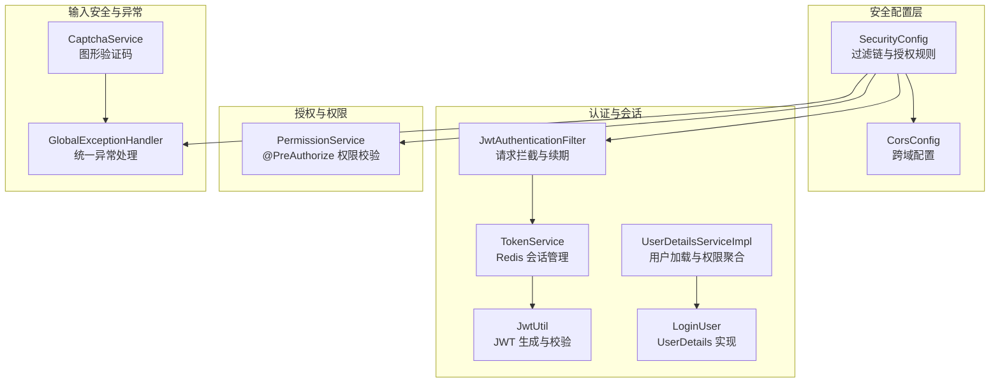
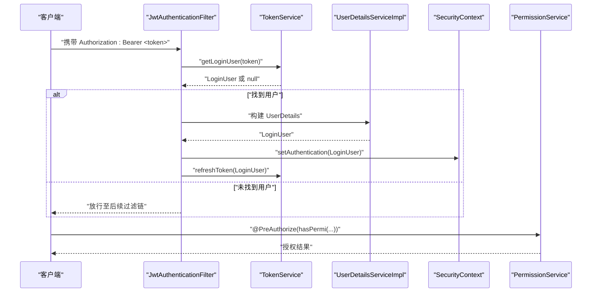
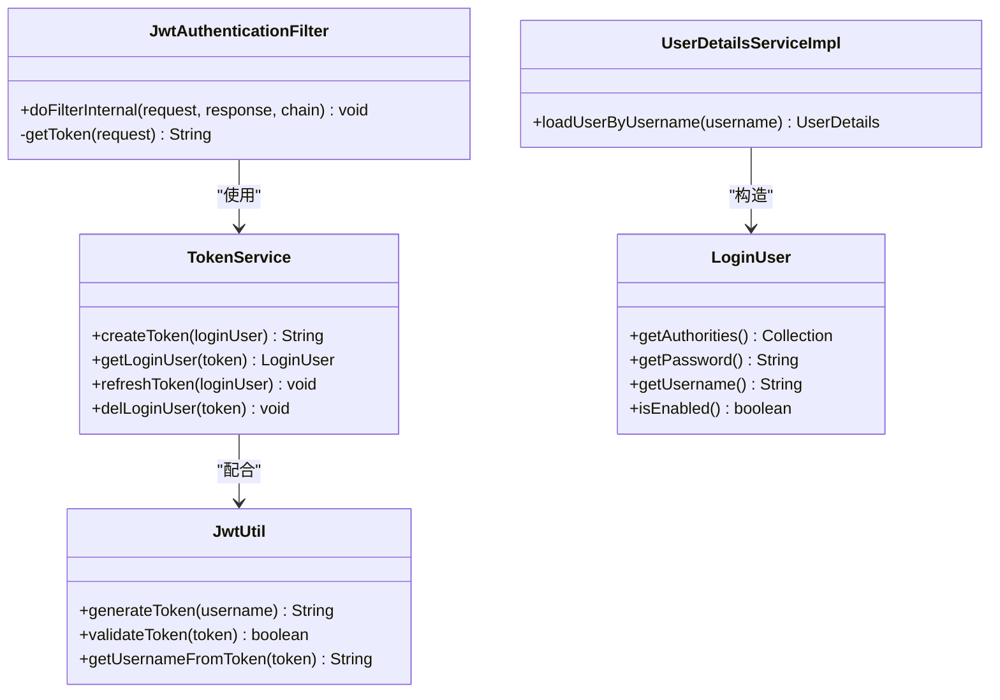
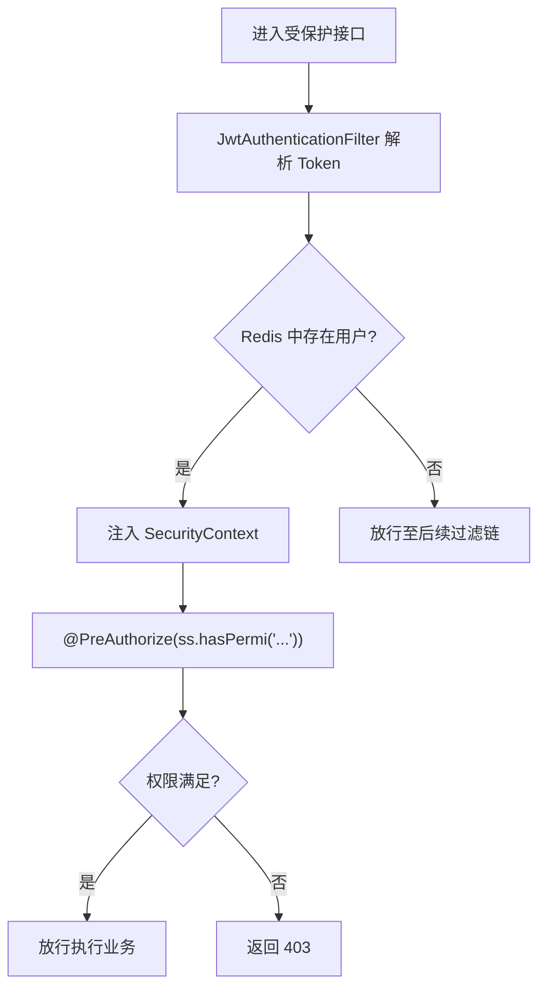
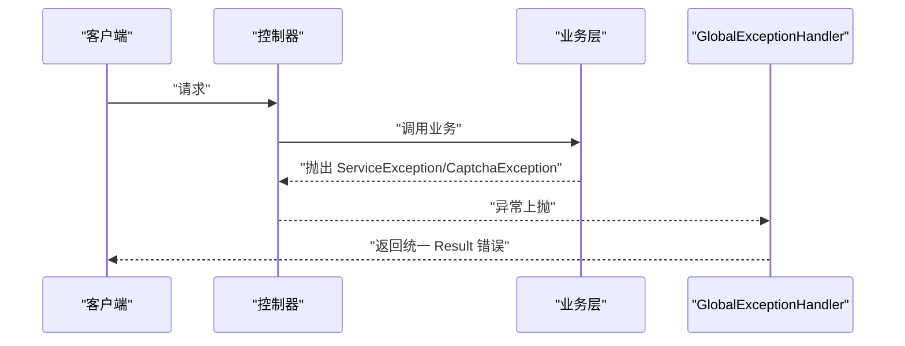
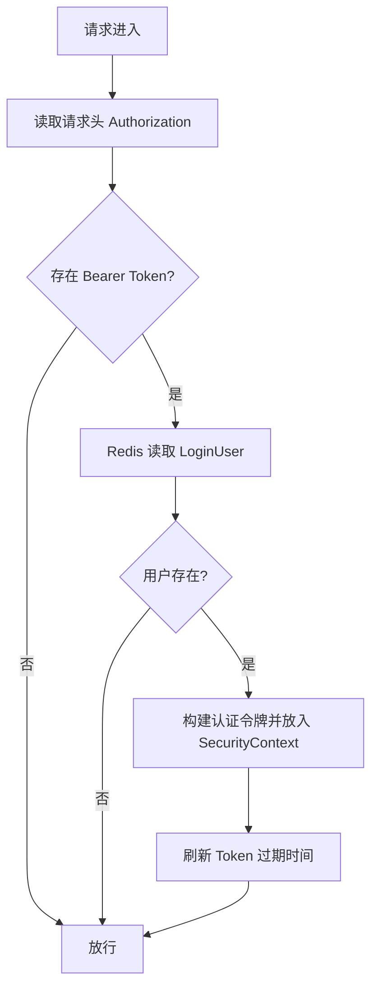
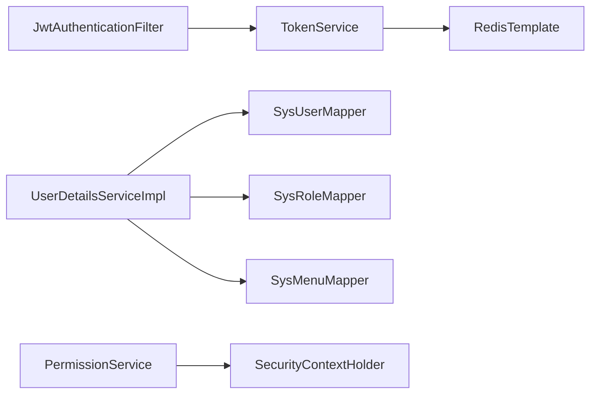

# 安全设计

<cite>
**本文引用的文件**
- [JwtAuthenticationFilter.java](file://task-manager-backend/src/main/java/com/taskmanager/security/JwtAuthenticationFilter.java)
- [TokenService.java](file://task-manager-backend/src/main/java/com/taskmanager/security/TokenService.java)
- [UserDetailsServiceImpl.java](file://task-manager-backend/src/main/java/com/taskmanager/security/UserDetailsServiceImpl.java)
- [PermissionService.java](file://task-manager-backend/src/main/java/com/taskmanager/security/PermissionService.java)
- [JwtUtil.java](file://task-manager-backend/src/main/java/com/taskmanager/utils/JwtUtil.java)
- [LoginUser.java](file://task-manager-backend/src/main/java/com/taskmanager/security/LoginUser.java)
- [SecurityConfig.java](file://task-manager-backend/src/main/java/com/taskmanager/config/SecurityConfig.java)
- [CorsConfig.java](file://task-manager-backend/src/main/java/com/taskmanager/config/CorsConfig.java)
- [GlobalExceptionHandler.java](file://task-manager-backend/src/main/java/com/taskmanager/common/exception/GlobalExceptionHandler.java)
- [ServiceException.java](file://task-manager-backend/src/main/java/com/taskmanager/common/exception/ServiceException.java)
- [CaptchaException.java](file://task-manager-backend/src/main/java/com/taskmanager/common/exception/CaptchaException.java)
- [application.yml](file://task-manager-backend/src/main/resources/application.yml)
- [CaptchaService.java](file://task-manager-backend/src/main/java/com/taskmanager/security/CaptchaService.java)
- [SysUser.java](file://task-manager-backend/src/main/java/com/taskmanager/domain/SysUser.java)
- [SysUserMapper.java](file://task-manager-backend/src/main/java/com/taskmanager/mapper/SysUserMapper.java)
</cite>

## 目录
1. [简介](#简介)
2. [项目结构](#项目结构)
3. [核心组件](#核心组件)
4. [架构总览](#架构总览)
5. [详细组件分析](#详细组件分析)
6. [依赖分析](#依赖分析)
7. [性能考虑](#性能考虑)
8. [故障排查指南](#故障排查指南)
9. [结论](#结论)
10. [附录](#附录)

## 简介
本文件为 CodeBuddy 任务管理系统（后端）的安全设计文档，聚焦认证与会话、授权与权限控制、输入安全与异常处理、安全过滤器与配置最佳实践，并给出漏洞预防与应急响应建议及安全测试方法与工具推荐。文档以代码库中的实际实现为依据，避免臆测，确保可追溯性。

## 项目结构
后端采用 Spring Boot + Spring Security + JWT + Redis 的典型无状态认证架构。安全相关的关键模块分布如下：
- 安全配置与过滤链：SecurityConfig、JwtAuthenticationFilter
- 认证与会话：TokenService、JwtUtil、LoginUser、UserDetailsServiceImpl
- 授权与权限：PermissionService、@PreAuthorize 方法级权限
- 输入安全与异常：全局异常处理器 GlobalExceptionHandler、验证码 CaptchaService
- 跨域与配置：CorsConfig、application.yml

图表来源
- [SecurityConfig.java:47-97](file://task-manager-backend/src/main/java/com/taskmanager/config/SecurityConfig.java#L47-L97)
- [JwtAuthenticationFilter.java:37-57](file://task-manager-backend/src/main/java/com/taskmanager/security/JwtAuthenticationFilter.java#L37-L57)
- [TokenService.java:34-80](file://task-manager-backend/src/main/java/com/taskmanager/security/TokenService.java#L34-L80)
- [JwtUtil.java:39-86](file://task-manager-backend/src/main/java/com/taskmanager/utils/JwtUtil.java#L39-L86)
- [UserDetailsServiceImpl.java:40-57](file://task-manager-backend/src/main/java/com/taskmanager/security/UserDetailsServiceImpl.java#L40-L57)
- [LoginUser.java:58-108](file://task-manager-backend/src/main/java/com/taskmanager/security/LoginUser.java#L58-L108)
- [PermissionService.java:25-38](file://task-manager-backend/src/main/java/com/taskmanager/security/PermissionService.java#L25-L38)
- [GlobalExceptionHandler.java:30-107](file://task-manager-backend/src/main/java/com/taskmanager/common/exception/GlobalExceptionHandler.java#L30-L107)
- [CaptchaService.java:39-112](file://task-manager-backend/src/main/java/com/taskmanager/security/CaptchaService.java#L39-L112)
- [CorsConfig.java:21-45](file://task-manager-backend/src/main/java/com/taskmanager/config/CorsConfig.java#L21-L45)

章节来源
- [SecurityConfig.java:47-97](file://task-manager-backend/src/main/java/com/taskmanager/config/SecurityConfig.java#L47-L97)
- [application.yml:51-57](file://task-manager-backend/src/main/resources/application.yml#L51-L57)

## 核心组件
- 认证与会话
  - 无状态 JWT + Redis：TokenService 负责生成、续期与删除；JwtUtil 提供签名与解析；JwtAuthenticationFilter 从请求头提取 Token 并注入 Security 上下文。
  - 登录用户载体 LoginUser 实现 UserDetails，承载用户、权限与角色信息。
  - UserDetailsServiceImpl 从数据库加载用户、角色与权限集合，构造 LoginUser。
- 授权与权限
  - 方法级权限：PermissionService 提供 hasPermi/lacksPermi，支持通配符“*:*:*”超级管理员。
  - Web 层授权：SecurityConfig 配置放行与认证路径，基于 AntPathRequestMatcher。
- 输入安全与异常
  - 全局异常：统一返回 Result 结构，区分业务、认证、权限、参数校验等异常。
  - 验证码：CaptchaService 生成图形验证码并校验，使用 Redis 存储与过期控制。
- 配置与最佳实践
  - CORS：允许前端开发端口与凭证，暴露必要响应头。
  - 密码策略：BCrypt 编码器，配合数据库字段存储加密密码。
  - JWT 配置：密钥、过期时间、请求头与前缀由 application.yml 配置。

章节来源
- [JwtAuthenticationFilter.java:37-68](file://task-manager-backend/src/main/java/com/taskmanager/security/JwtAuthenticationFilter.java#L37-L68)
- [TokenService.java:34-80](file://task-manager-backend/src/main/java/com/taskmanager/security/TokenService.java#L34-L80)
- [JwtUtil.java:39-86](file://task-manager-backend/src/main/java/com/taskmanager/utils/JwtUtil.java#L39-L86)
- [UserDetailsServiceImpl.java:40-57](file://task-manager-backend/src/main/java/com/taskmanager/security/UserDetailsServiceImpl.java#L40-L57)
- [LoginUser.java:58-108](file://task-manager-backend/src/main/java/com/taskmanager/security/LoginUser.java#L58-L108)
- [PermissionService.java:25-38](file://task-manager-backend/src/main/java/com/taskmanager/security/PermissionService.java#L25-L38)
- [GlobalExceptionHandler.java:30-107](file://task-manager-backend/src/main/java/com/taskmanager/common/exception/GlobalExceptionHandler.java#L30-L107)
- [CaptchaService.java:39-112](file://task-manager-backend/src/main/java/com/taskmanager/security/CaptchaService.java#L39-L112)
- [SecurityConfig.java:47-97](file://task-manager-backend/src/main/java/com/taskmanager/config/SecurityConfig.java#L47-L97)
- [CorsConfig.java:21-45](file://task-manager-backend/src/main/java/com/taskmanager/config/CorsConfig.java#L21-L45)
- [application.yml:51-57](file://task-manager-backend/src/main/resources/application.yml#L51-L57)

## 架构总览
下图展示认证与授权在请求生命周期中的交互：

图表来源
- [JwtAuthenticationFilter.java:37-57](file://task-manager-backend/src/main/java/com/taskmanager/security/JwtAuthenticationFilter.java#L37-L57)
- [TokenService.java:49-71](file://task-manager-backend/src/main/java/com/taskmanager/security/TokenService.java#L49-L71)
- [UserDetailsServiceImpl.java:40-57](file://task-manager-backend/src/main/java/com/taskmanager/security/UserDetailsServiceImpl.java#L40-L57)
- [PermissionService.java:25-38](file://task-manager-backend/src/main/java/com/taskmanager/security/PermissionService.java#L25-L38)

## 详细组件分析

### 认证与会话（JWT + Redis）
- Token 生成与存储
  - TokenService.createToken 生成 UUID 形式的 Token，并将 LoginUser 写入 Redis，键带前缀，过期时间来自配置。
- Token 解析与续期
  - JwtAuthenticationFilter 从请求头提取 Bearer Token，调用 TokenService.getLoginUser 解析用户；成功后构建 UsernamePasswordAuthenticationToken 注入 SecurityContext，并调用 refreshToken 自动续期。
- JWT 工具
  - JwtUtil 使用对称密钥（application.yml 中的 secret）生成与验证签名，支持从 Token 提取用户名。
- 登录用户载体
  - LoginUser 实现 UserDetails，将权限集合转换为 GrantedAuthority，按 SysUser.status 控制启用状态。

图表来源
- [TokenService.java:34-80](file://task-manager-backend/src/main/java/com/taskmanager/security/TokenService.java#L34-L80)
- [JwtUtil.java:39-86](file://task-manager-backend/src/main/java/com/taskmanager/utils/JwtUtil.java#L39-L86)
- [JwtAuthenticationFilter.java:37-68](file://task-manager-backend/src/main/java/com/taskmanager/security/JwtAuthenticationFilter.java#L37-L68)
- [UserDetailsServiceImpl.java:40-57](file://task-manager-backend/src/main/java/com/taskmanager/security/UserDetailsServiceImpl.java#L40-L57)
- [LoginUser.java:58-108](file://task-manager-backend/src/main/java/com/taskmanager/security/LoginUser.java#L58-L108)

章节来源
- [TokenService.java:34-80](file://task-manager-backend/src/main/java/com/taskmanager/security/TokenService.java#L34-L80)
- [JwtUtil.java:39-86](file://task-manager-backend/src/main/java/com/taskmanager/utils/JwtUtil.java#L39-L86)
- [JwtAuthenticationFilter.java:37-68](file://task-manager-backend/src/main/java/com/taskmanager/security/JwtAuthenticationFilter.java#L37-L68)
- [LoginUser.java:58-108](file://task-manager-backend/src/main/java/com/taskmanager/security/LoginUser.java#L58-L108)
- [UserDetailsServiceImpl.java:40-57](file://task-manager-backend/src/main/java/com/taskmanager/security/UserDetailsServiceImpl.java#L40-L57)

### 授权与权限控制（RBAC + 方法级校验）
- 数据权限与菜单权限
  - UserDetailsServiceImpl 通过 SysUserMapper、SysRoleMapper、SysMenuMapper 聚合用户的角色与权限集合，LoginUser 将权限映射为 GrantedAuthority。
- 方法级权限
  - PermissionService.hasPermi 支持“*:*:*”通配符超级管理员；@PreAuthorize 可直接调用 ss.hasPermi(...)。
- Web 层授权
  - SecurityConfig.authorizeHttpRequests 使用 AntPathRequestMatcher 明确放行与需认证路径，其余全部 authenticated。

图表来源
- [JwtAuthenticationFilter.java:37-57](file://task-manager-backend/src/main/java/com/taskmanager/security/JwtAuthenticationFilter.java#L37-L57)
- [PermissionService.java:25-38](file://task-manager-backend/src/main/java/com/taskmanager/security/PermissionService.java#L25-L38)
- [SecurityConfig.java:76-92](file://task-manager-backend/src/main/java/com/taskmanager/config/SecurityConfig.java#L76-L92)

章节来源
- [PermissionService.java:25-38](file://task-manager-backend/src/main/java/com/taskmanager/security/PermissionService.java#L25-L38)
- [UserDetailsServiceImpl.java:40-57](file://task-manager-backend/src/main/java/com/taskmanager/security/UserDetailsServiceImpl.java#L40-L57)
- [SecurityConfig.java:76-92](file://task-manager-backend/src/main/java/com/taskmanager/config/SecurityConfig.java#L76-L92)

### 输入安全与异常处理
- 全局异常处理
  - GlobalExceptionHandler 统一封装业务异常（ServiceException）、验证码异常（CaptchaException）、认证/权限异常、参数校验异常等，返回标准 Result 结构。
- 参数校验与输入约束
  - 使用 @Valid/@Validated 对请求体与路径参数进行校验；结合 DTO 与字段注解实现输入约束。
- SQL 注入防护
  - 使用 MyBatis-Plus 与参数化查询，避免拼接 SQL；分页与条件查询通过注解参数传递。
- XSS 与 CSRF 防护
  - 前端负责输出转义与表单隐藏字段；后端禁用 CSRF（前后端分离场景），通过 Token 认证替代。

图表来源
- [GlobalExceptionHandler.java:30-107](file://task-manager-backend/src/main/java/com/taskmanager/common/exception/GlobalExceptionHandler.java#L30-L107)
- [ServiceException.java:20-28](file://task-manager-backend/src/main/java/com/taskmanager/common/exception/ServiceException.java#L20-L28)
- [CaptchaException.java:12-14](file://task-manager-backend/src/main/java/com/taskmanager/common/exception/CaptchaException.java#L12-L14)

章节来源
- [GlobalExceptionHandler.java:30-107](file://task-manager-backend/src/main/java/com/taskmanager/common/exception/GlobalExceptionHandler.java#L30-L107)
- [ServiceException.java:20-28](file://task-manager-backend/src/main/java/com/taskmanager/common/exception/ServiceException.java#L20-L28)
- [CaptchaException.java:12-14](file://task-manager-backend/src/main/java/com/taskmanager/common/exception/CaptchaException.java#L12-L14)

### 安全过滤器与 Token 续期机制
- JwtAuthenticationFilter 工作原理
  - 从请求头读取 Authorization: Bearer <token>，去除前缀后交给 TokenService。
  - 若 Redis 中存在用户信息，则构建认证令牌并放入 SecurityContext，随后调用 refreshToken 续期。
- Token 续期策略
  - 每次有效请求均刷新 Redis 中的过期时间，降低长期暴露风险；登出时调用 delLoginUser 清除。

图表来源
- [JwtAuthenticationFilter.java:37-68](file://task-manager-backend/src/main/java/com/taskmanager/security/JwtAuthenticationFilter.java#L37-L68)
- [TokenService.java:49-71](file://task-manager-backend/src/main/java/com/taskmanager/security/TokenService.java#L49-L71)

章节来源
- [JwtAuthenticationFilter.java:37-68](file://task-manager-backend/src/main/java/com/taskmanager/security/JwtAuthenticationFilter.java#L37-L68)
- [TokenService.java:49-71](file://task-manager-backend/src/main/java/com/taskmanager/security/TokenService.java#L49-L71)

### 安全配置最佳实践
- CORS 配置
  - 允许前端开发服务器域名与凭证，暴露必要响应头，预检缓存 1 小时。
- 安全头与 HTTPS
  - 建议在网关或反向代理层开启 HSTS、X-Frame-Options、X-Content-Type-Options、Referrer-Policy 等；生产环境强制 HTTPS。
- CSRF 禁用
  - 前后端分离项目禁用 CSRF，使用 Token 认证；若引入传统表单，需额外 CSRF 保护。
- 密码策略
  - 使用 BCryptPasswordEncoder；SysUser.password 字段存储加密后的哈希值。

章节来源
- [CorsConfig.java:21-45](file://task-manager-backend/src/main/java/com/taskmanager/config/CorsConfig.java#L21-L45)
- [SecurityConfig.java:102-105](file://task-manager-backend/src/main/java/com/taskmanager/config/SecurityConfig.java#L102-L105)
- [SysUser.java:50-51](file://task-manager-backend/src/main/java/com/taskmanager/domain/SysUser.java#L50-L51)

## 依赖分析
- 组件耦合
  - JwtAuthenticationFilter 依赖 TokenService；TokenService 依赖 RedisTemplate；UserDetailsServiceImpl 依赖多个 Mapper；PermissionService 依赖 SecurityContextHolder。
- 外部依赖
  - Spring Security、MyBatis-Plus、Redis、JWT 库。
- 潜在风险
  - Redis 连接异常导致认证失败；Token 过期策略与续期频率需平衡安全与体验。

图表来源
- [JwtAuthenticationFilter.java:31-35](file://task-manager-backend/src/main/java/com/taskmanager/security/JwtAuthenticationFilter.java#L31-L35)
- [TokenService.java:25-26](file://task-manager-backend/src/main/java/com/taskmanager/security/TokenService.java#L25-L26)
- [UserDetailsServiceImpl.java:24-33](file://task-manager-backend/src/main/java/com/taskmanager/security/UserDetailsServiceImpl.java#L24-L33)
- [PermissionService.java:53-62](file://task-manager-backend/src/main/java/com/taskmanager/security/PermissionService.java#L53-L62)

章节来源
- [JwtAuthenticationFilter.java:31-35](file://task-manager-backend/src/main/java/com/taskmanager/security/JwtAuthenticationFilter.java#L31-L35)
- [TokenService.java:25-26](file://task-manager-backend/src/main/java/com/taskmanager/security/TokenService.java#L25-L26)
- [UserDetailsServiceImpl.java:24-33](file://task-manager-backend/src/main/java/com/taskmanager/security/UserDetailsServiceImpl.java#L24-L33)
- [PermissionService.java:53-62](file://task-manager-backend/src/main/java/com/taskmanager/security/PermissionService.java#L53-L62)

## 性能考虑
- 会话存储与网络开销
  - Redis 读写带来网络延迟，建议合理设置过期时间与连接池参数；批量请求时注意 Token 续期频率。
- 认证链路优化
  - 放行静态资源与公开接口，减少不必要的鉴权开销；使用精确的 AntPathRequestMatcher。
- 密码加密成本
  - BCrypt 默认强度较高，建议在高并发场景评估认证耗时并监控认证接口 P95/P99。

## 故障排查指南
- 401 未认证
  - 检查请求头 Authorization 是否正确携带 Bearer Token；确认 Token 未过期且 Redis 中存在对应用户。
- 403 权限不足
  - 检查用户权限集合与目标接口所需权限；确认通配符“*:*:*”是否授予超级管理员。
- 验证码错误/过期
  - 检查 CaptchaService 生成与校验逻辑；确认 Redis 中验证码键是否存在且未过期。
- 全局异常
  - 查看 GlobalExceptionHandler 日志，定位 ServiceException/CaptchaException 抛出处，核对业务分支与参数校验。

章节来源
- [GlobalExceptionHandler.java:30-107](file://task-manager-backend/src/main/java/com/taskmanager/common/exception/GlobalExceptionHandler.java#L30-L107)
- [CaptchaService.java:99-112](file://task-manager-backend/src/main/java/com/taskmanager/security/CaptchaService.java#L99-L112)
- [JwtAuthenticationFilter.java:37-57](file://task-manager-backend/src/main/java/com/taskmanager/security/JwtAuthenticationFilter.java#L37-L57)

## 结论
本项目采用无状态 JWT + Redis 的认证模型，结合 Spring Security 的方法级权限控制与全局异常处理，形成完整的安全闭环。建议在生产环境中进一步强化 HTTPS、安全头、日志审计与渗透测试，持续完善安全基线。

## 附录

### 安全漏洞预防与应急响应
- 预防措施
  - 强制 HTTPS 与安全头；最小权限原则；定期轮换 JWT 密钥；限制 Token 过期时间与续期频率。
- 应急响应
  - 发生泄露事件时立即撤销受影响用户的 Token（清空 Redis），修改密钥并通知所有用户重新登录；记录日志并追踪攻击路径。

### 安全测试方法与工具推荐
- 单元与集成测试
  - 使用 JUnit 与 MockMvc 测试受保护接口的认证与授权行为；模拟不同权限用户访问。
- 渗透测试
  - 使用 OWASP ZAP 或 Burp Suite 扫描常见漏洞（SQL 注入、XSS、CSRF、暴力破解）。
- 静态分析
  - 使用 SpotBugs、SonarQube 检测潜在安全缺陷与代码异味。
- 性能与压测
  - 使用 JMeter 或 Gatling 对认证与授权链路进行压测，观察 P95/P99 延迟与错误率。