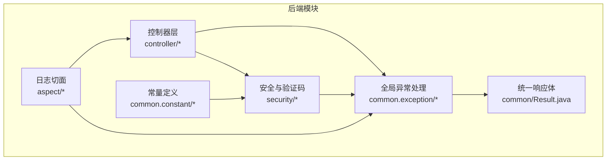
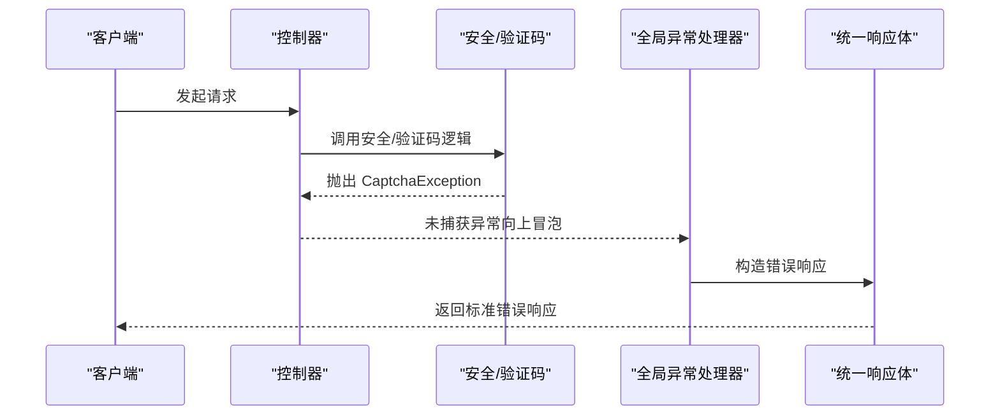
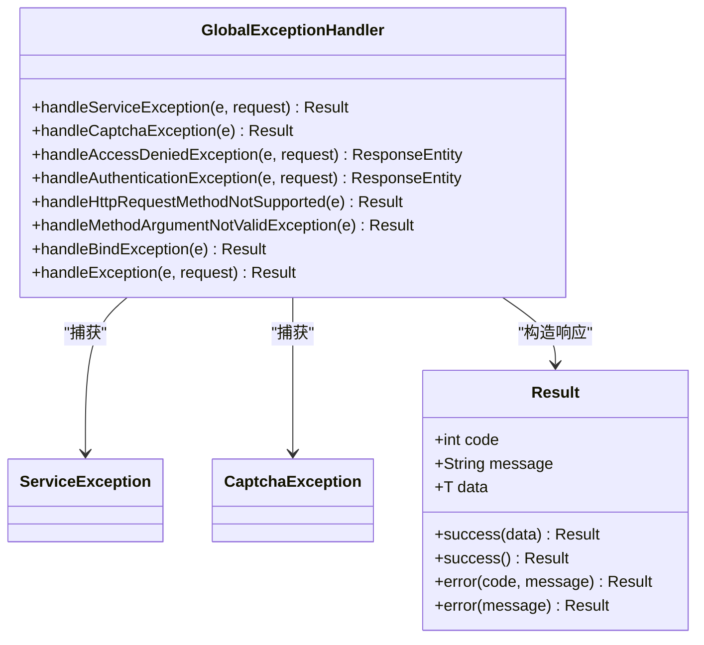
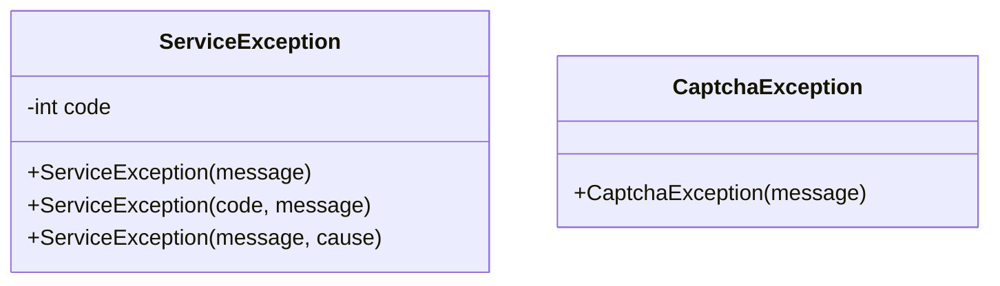
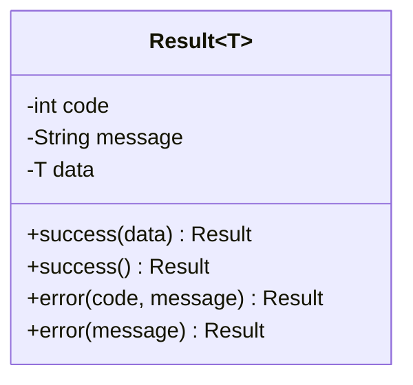
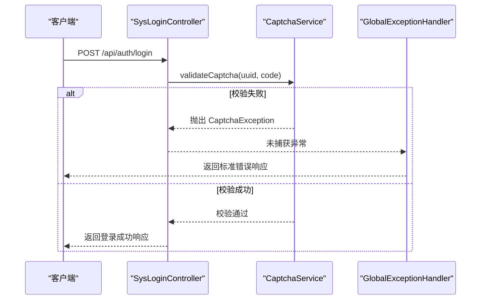
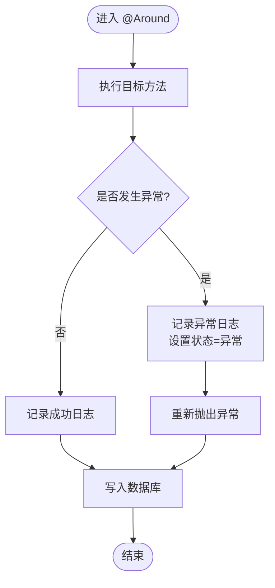
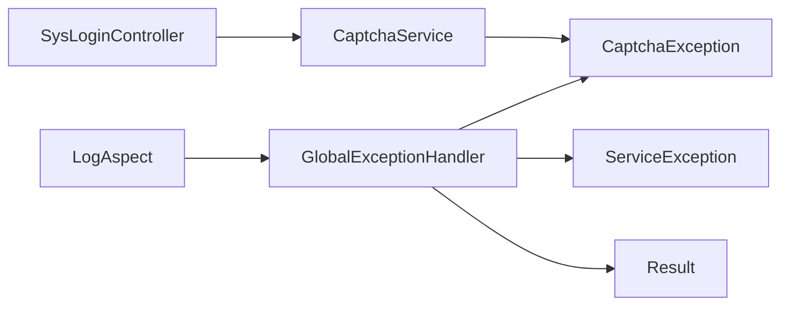

# 异常处理机制

<cite>
**本文引用的文件**
- [GlobalExceptionHandler.java](file://task-manager-backend/src/main/java/com/taskmanager/common/exception/GlobalExceptionHandler.java)
- [ServiceException.java](file://task-manager-backend/src/main/java/com/taskmanager/common/exception/ServiceException.java)
- [CaptchaException.java](file://task-manager-backend/src/main/java/com/taskmanager/common/exception/CaptchaException.java)
- [Result.java](file://task-manager-backend/src/main/java/com/taskmanager/common/Result.java)
- [Constants.java](file://task-manager-backend/src/main/java/com/taskmanager/common/constant/Constants.java)
- [CaptchaService.java](file://task-manager-backend/src/main/java/com/taskmanager/security/CaptchaService.java)
- [SysLoginController.java](file://task-manager-backend/src/main/java/com/taskmanager/controller/SysLoginController.java)
- [application.yml](file://task-manager-backend/src/main/resources/application.yml)
- [LogAspect.java](file://task-manager-backend/src/main/java/com/taskmanager/aspect/LogAspect.java)
- [BaseControllerTest.java](file://task-manager-backend/src/test/java/com/taskmanager/controller/BaseControllerTest.java)
</cite>

## 目录
1. [简介](#简介)
2. [项目结构与定位](#项目结构与定位)
3. [核心组件](#核心组件)
4. [架构总览](#架构总览)
5. [详细组件分析](#详细组件分析)
6. [依赖关系分析](#依赖关系分析)
7. [性能考量](#性能考量)
8. [故障排查指南](#故障排查指南)
9. [结论](#结论)
10. [附录](#附录)

## 简介
本文件系统性梳理 CodeBuddy 任务管理系统的异常处理机制，围绕全局异常处理器、自定义异常类、统一响应格式、安全与日志策略、性能优化与监控告警等方面展开，帮助开发者在不直接阅读源码的情况下理解整体设计，并提供可操作的实践建议与扩展指南。

## 项目结构与定位
- 异常处理相关代码集中在后端模块的通用包中：
  - 全局异常处理器位于 common.exception 包
  - 自定义异常类位于 common.exception 包
  - 统一响应体位于 common 包
  - 常量定义位于 common.constant 包
- 安全与验证码相关逻辑位于 security 包，与异常处理紧密配合
- 日志切面位于 aspect 包，负责操作日志记录与异常捕获
- 控制器层在 controller 包，部分业务场景会抛出自定义异常

**图表来源**
- [GlobalExceptionHandler.java:1-109](file://task-manager-backend/src/main/java/com/taskmanager/common/exception/GlobalExceptionHandler.java#L1-L109)
- [CaptchaService.java:1-129](file://task-manager-backend/src/main/java/com/taskmanager/security/CaptchaService.java#L1-L129)
- [Result.java:1-76](file://task-manager-backend/src/main/java/com/taskmanager/common/Result.java#L1-L76)
- [Constants.java:1-40](file://task-manager-backend/src/main/java/com/taskmanager/common/constant/Constants.java#L1-L40)
- [LogAspect.java:1-137](file://task-manager-backend/src/main/java/com/taskmanager/aspect/LogAspect.java#L1-L137)

**章节来源**
- [GlobalExceptionHandler.java:1-109](file://task-manager-backend/src/main/java/com/taskmanager/common/exception/GlobalExceptionHandler.java#L1-L109)
- [application.yml:1-79](file://task-manager-backend/src/main/resources/application.yml#L1-L79)

## 核心组件
- 全局异常处理器：统一拦截各类异常，输出标准化响应
- 自定义异常类：业务异常 ServiceException、验证码异常 CaptchaException
- 统一响应体 Result：封装 code、message、data
- 常量 Constants：定义状态码与键前缀
- 日志切面 LogAspect：记录操作日志并捕获异常
- 安全与验证码 CaptchaService：生成与校验验证码，触发 CaptchaException

**章节来源**
- [GlobalExceptionHandler.java:17-109](file://task-manager-backend/src/main/java/com/taskmanager/common/exception/GlobalExceptionHandler.java#L17-L109)
- [ServiceException.java:1-35](file://task-manager-backend/src/main/java/com/taskmanager/common/exception/ServiceException.java#L1-L35)
- [CaptchaException.java:1-16](file://task-manager-backend/src/main/java/com/taskmanager/common/exception/CaptchaException.java#L1-L16)
- [Result.java:1-76](file://task-manager-backend/src/main/java/com/taskmanager/common/Result.java#L1-L76)
- [Constants.java:1-40](file://task-manager-backend/src/main/java/com/taskmanager/common/constant/Constants.java#L1-L40)
- [CaptchaService.java:1-129](file://task-manager-backend/src/main/java/com/taskmanager/security/CaptchaService.java#L1-L129)
- [LogAspect.java:1-137](file://task-manager-backend/src/main/java/com/taskmanager/aspect/LogAspect.java#L1-L137)

## 架构总览
全局异常处理器通过 Spring 的 @RestControllerAdvice 对控制器层抛出的异常进行集中处理，结合统一响应体 Result 输出标准化错误信息；同时，安全与验证码模块在运行时可能抛出 CaptchaException，由全局处理器统一捕获并返回标准格式。

**图表来源**
- [GlobalExceptionHandler.java:39-43](file://task-manager-backend/src/main/java/com/taskmanager/common/exception/GlobalExceptionHandler.java#L39-L43)
- [CaptchaService.java:99-112](file://task-manager-backend/src/main/java/com/taskmanager/security/CaptchaService.java#L99-L112)
- [Result.java:61-74](file://task-manager-backend/src/main/java/com/taskmanager/common/Result.java#L61-L74)

## 详细组件分析

### 全局异常处理器 GlobalExceptionHandler
- 设计要点
  - 使用 @RestControllerAdvice 对整个应用生效
  - 通过 @ExceptionHandler 方法按异常类型分发处理
  - 对不同异常返回不同的 HTTP 状态码与错误信息
  - 对未覆盖的异常做兜底处理
- 异常类型与处理策略
  - 业务异常 ServiceException：返回自定义 code 与 message
  - 验证码异常 CaptchaException：返回固定错误码与提示
  - 权限拒绝 AccessDeniedException：返回 403
  - 认证异常 AuthenticationException：返回 401
  - 请求方式不支持 HttpRequestMethodNotSupportedException：返回 405
  - 参数校验 MethodArgumentNotValidException：返回 400
  - 参数绑定 BindException：返回 400
  - 兜底 Exception：返回系统繁忙提示
- 日志与安全
  - 对关键异常记录请求 URI 与异常信息
  - 对认证/权限异常采用 warn 级别日志
  - 对业务异常采用 error 级别日志

**图表来源**
- [GlobalExceptionHandler.java:23-109](file://task-manager-backend/src/main/java/com/taskmanager/common/exception/GlobalExceptionHandler.java#L23-L109)
- [ServiceException.java:10-35](file://task-manager-backend/src/main/java/com/taskmanager/common/exception/ServiceException.java#L10-L35)
- [CaptchaException.java:8-16](file://task-manager-backend/src/main/java/com/taskmanager/common/exception/CaptchaException.java#L8-L16)
- [Result.java:12-76](file://task-manager-backend/src/main/java/com/taskmanager/common/Result.java#L12-L76)

**章节来源**
- [GlobalExceptionHandler.java:17-109](file://task-manager-backend/src/main/java/com/taskmanager/common/exception/GlobalExceptionHandler.java#L17-L109)

### 自定义异常类
- ServiceException
  - 支持自定义错误码与消息，默认 500
  - 适配业务层抛出的受控异常
- CaptchaException
  - 验证码相关错误专用异常
  - 由 CaptchaService 在校验失败时抛出

**图表来源**
- [ServiceException.java:10-35](file://task-manager-backend/src/main/java/com/taskmanager/common/exception/ServiceException.java#L10-L35)
- [CaptchaException.java:8-16](file://task-manager-backend/src/main/java/com/taskmanager/common/exception/CaptchaException.java#L8-L16)

**章节来源**
- [ServiceException.java:1-35](file://task-manager-backend/src/main/java/com/taskmanager/common/exception/ServiceException.java#L1-L35)
- [CaptchaException.java:1-16](file://task-manager-backend/src/main/java/com/taskmanager/common/exception/CaptchaException.java#L1-L16)

### 统一响应体 Result
- 结构
  - code：状态码
  - message：消息
  - data：数据
- 工具方法
  - success(data)/success()：成功响应
  - error(code, message)/error(message)：错误响应
- 与全局异常处理器配合
  - 全局处理器通过 Result.error(...) 构造错误响应

**图表来源**
- [Result.java:12-76](file://task-manager-backend/src/main/java/com/taskmanager/common/Result.java#L12-L76)

**章节来源**
- [Result.java:1-76](file://task-manager-backend/src/main/java/com/taskmanager/common/Result.java#L1-L76)

### 常量 Constants
- 定义常用状态码与键前缀
  - SUCCESS/FAIL/UNAUTHORIZED/FORBIDDEN
  - 验证码 Redis Key 前缀与过期时间
  - 登录用户 Redis Key 前缀
  - 防重提交 Redis Key 前缀
- 与验证码服务协作
  - CaptchaService 使用 CAPTCHA_CODE_KEY 与 CAPTCHA_EXPIRATION

**章节来源**
- [Constants.java:1-40](file://task-manager-backend/src/main/java/com/taskmanager/common/constant/Constants.java#L1-L40)
- [CaptchaService.java:43-48](file://task-manager-backend/src/main/java/com/taskmanager/security/CaptchaService.java#L43-L48)

### 安全与验证码 CaptchaService
- 功能
  - 生成验证码并存储至 Redis
  - 校验验证码（忽略大小写），过期或错误时抛出 CaptchaException
- 与控制器集成
  - SysLoginController 在登录流程中调用 CaptchaService.validateCaptcha
  - 若校验异常，控制器返回 Result.error(...)，交由全局处理器统一处理

**图表来源**
- [SysLoginController.java:103-135](file://task-manager-backend/src/main/java/com/taskmanager/controller/SysLoginController.java#L103-L135)
- [CaptchaService.java:99-112](file://task-manager-backend/src/main/java/com/taskmanager/security/CaptchaService.java#L99-L112)
- [GlobalExceptionHandler.java:39-43](file://task-manager-backend/src/main/java/com/taskmanager/common/exception/GlobalExceptionHandler.java#L39-L43)

**章节来源**
- [CaptchaService.java:1-129](file://task-manager-backend/src/main/java/com/taskmanager/security/CaptchaService.java#L1-L129)
- [SysLoginController.java:103-135](file://task-manager-backend/src/main/java/com/taskmanager/controller/SysLoginController.java#L103-L135)

### 日志切面 LogAspect
- 功能
  - 拦截标注 @Log 的方法，记录操作日志
  - 捕获异常并设置状态为异常，记录错误信息
  - 对请求参数进行敏感字段脱敏（如 password）
- 与异常处理的关系
  - 切面内部捕获异常并重新抛出，使异常最终被全局处理器接管
  - 通过操作日志记录异常上下文，便于排查

**图表来源**
- [LogAspect.java:44-97](file://task-manager-backend/src/main/java/com/taskmanager/aspect/LogAspect.java#L44-L97)

**章节来源**
- [LogAspect.java:1-137](file://task-manager-backend/src/main/java/com/taskmanager/aspect/LogAspect.java#L1-L137)

## 依赖关系分析
- 全局异常处理器依赖统一响应体 Result，以及若干 Spring Security 异常类型
- 自定义异常类被全局处理器按类型匹配捕获
- CaptchaService 与控制器协同，异常通过全局处理器统一处理
- 日志切面在业务执行过程中捕获异常，确保异常最终被全局处理器接管

**图表来源**
- [GlobalExceptionHandler.java:1-109](file://task-manager-backend/src/main/java/com/taskmanager/common/exception/GlobalExceptionHandler.java#L1-L109)
- [Result.java:1-76](file://task-manager-backend/src/main/java/com/taskmanager/common/Result.java#L1-L76)
- [ServiceException.java:1-35](file://task-manager-backend/src/main/java/com/taskmanager/common/exception/ServiceException.java#L1-L35)
- [CaptchaException.java:1-16](file://task-manager-backend/src/main/java/com/taskmanager/common/exception/CaptchaException.java#L1-L16)
- [CaptchaService.java:1-129](file://task-manager-backend/src/main/java/com/taskmanager/security/CaptchaService.java#L1-L129)
- [SysLoginController.java:1-327](file://task-manager-backend/src/main/java/com/taskmanager/controller/SysLoginController.java#L1-L327)
- [LogAspect.java:1-137](file://task-manager-backend/src/main/java/com/taskmanager/aspect/LogAspect.java#L1-L137)

**章节来源**
- [GlobalExceptionHandler.java:1-109](file://task-manager-backend/src/main/java/com/taskmanager/common/exception/GlobalExceptionHandler.java#L1-L109)
- [CaptchaService.java:1-129](file://task-manager-backend/src/main/java/com/taskmanager/security/CaptchaService.java#L1-L129)
- [SysLoginController.java:1-327](file://task-manager-backend/src/main/java/com/taskmanager/controller/SysLoginController.java#L1-L327)
- [LogAspect.java:1-137](file://task-manager-backend/src/main/java/com/taskmanager/aspect/LogAspect.java#L1-L137)

## 性能考量
- 异常缓存与快速失败
  - 对验证码等高频校验场景，利用 Redis 缓存与过期控制，避免重复计算与数据库压力
  - 在控制器层对空参数进行快速校验，减少后续处理开销
- 异常传播控制
  - 全局处理器仅做“最后防线”，业务层尽量在可控范围内处理异常
  - 切面层对异常进行统一记录，避免重复处理
- 日志与监控
  - 对高频异常进行采样或聚合，避免日志风暴
  - 结合操作日志表记录异常上下文，便于定位问题

[本节为通用性能建议，无需特定文件引用]

## 故障排查指南
- 常见问题与解决思路
  - 验证码异常：检查 CaptchaService 校验逻辑与 Redis 存储键前缀是否一致
  - 权限/认证异常：确认 Spring Security 配置与 Token 有效性
  - 参数校验异常：检查 DTO 字段注解与请求体格式
  - 未捕获异常：确认是否在控制器层被 try-catch 捕获，否则将由全局处理器兜底
- 调试技巧
  - 在控制器层增加必要日志，记录请求参数与关键分支
  - 使用切面日志记录异常上下文，关注耗时与错误信息
  - 单元测试中模拟异常场景，验证全局处理器行为
- 测试方法
  - 基于 BaseControllerTest 构造 Mock 环境，模拟验证码校验失败、认证失败等场景
  - 验证全局异常处理器对不同异常类型的响应一致性

**章节来源**
- [BaseControllerTest.java:1-89](file://task-manager-backend/src/test/java/com/taskmanager/controller/BaseControllerTest.java#L1-L89)
- [CaptchaService.java:99-112](file://task-manager-backend/src/main/java/com/taskmanager/security/CaptchaService.java#L99-L112)
- [GlobalExceptionHandler.java:79-107](file://task-manager-backend/src/main/java/com/taskmanager/common/exception/GlobalExceptionHandler.java#L79-L107)

## 结论
该异常处理体系通过全局异常处理器实现了“统一入口、统一响应”的设计，结合自定义异常类与统一响应体，保证了错误信息的一致性与可读性。验证码与安全模块与全局处理器无缝衔接，日志切面提供了完善的异常上下文记录能力。建议在生产环境中进一步完善异常监控与告警策略，持续优化异常日志与性能指标。

[本节为总结性内容，无需特定文件引用]

## 附录

### 异常响应标准化格式
- 结构
  - code：HTTP 状态码或业务错误码
  - message：错误描述
  - data：错误时通常为空
- 示例
  - 成功：code=200，message="success"
  - 失败：code=500，message="系统繁忙，请稍后再试"

**章节来源**
- [Result.java:12-76](file://task-manager-backend/src/main/java/com/taskmanager/common/Result.java#L12-L76)
- [GlobalExceptionHandler.java:30-107](file://task-manager-backend/src/main/java/com/taskmanager/common/exception/GlobalExceptionHandler.java#L30-L107)

### 异常类型与状态码映射
- ServiceException：自定义 code + message
- CaptchaException：固定错误码 + message
- AccessDeniedException：403
- AuthenticationException：401
- HttpRequestMethodNotSupportedException：405
- MethodArgumentNotValidException：400
- BindException：400
- Exception（兜底）：500

**章节来源**
- [GlobalExceptionHandler.java:27-107](file://task-manager-backend/src/main/java/com/taskmanager/common/exception/GlobalExceptionHandler.java#L27-L107)

### 国际化支持现状与建议
- 当前实现
  - 全局异常处理器返回 message 字符串，未显式使用 Spring MessageSource
- 建议
  - 在全局处理器中注入 MessageSource，根据 Locale 解析本地化消息
  - 对业务异常 ServiceException 增加 code->message 的映射表

[本节为扩展建议，无需特定文件引用]

### 安全性与敏感信息脱敏
- 日志脱敏
  - 切面层对请求参数中的 password 等敏感字段进行替换
- 异常信息
  - 全局处理器记录异常信息但不泄露堆栈细节
- 建议
  - 对认证失败与权限拒绝等敏感场景，避免在日志中记录用户输入

**章节来源**
- [LogAspect.java:99-111](file://task-manager-backend/src/main/java/com/taskmanager/aspect/LogAspect.java#L99-L111)
- [GlobalExceptionHandler.java:31-107](file://task-manager-backend/src/main/java/com/taskmanager/common/exception/GlobalExceptionHandler.java#L31-L107)

### 异常监控与告警
- 指标建议
  - 异常总量、异常类型分布、Top N 异常、异常趋势
- 告警策略
  - 异常量突增、特定类型异常占比超阈值、认证/权限异常激增
- 集成建议
  - 结合操作日志表与外部监控平台，建立可视化看板

[本节为通用建议，无需特定文件引用]

### 配置示例与扩展指南
- Redis 配置
  - 验证码与登录 Token 的键前缀与过期时间由 Constants 定义
- YAML 配置
  - application.yml 中包含 Redis、MyBatis-Plus、Jackson 等基础配置
- 扩展建议
  - 新增业务异常类型时，同步在全局处理器中添加对应 @ExceptionHandler
  - 对高频异常引入缓存与降级策略

**章节来源**
- [Constants.java:22-34](file://task-manager-backend/src/main/java/com/taskmanager/common/constant/Constants.java#L22-L34)
- [application.yml:1-79](file://task-manager-backend/src/main/resources/application.yml#L1-L79)