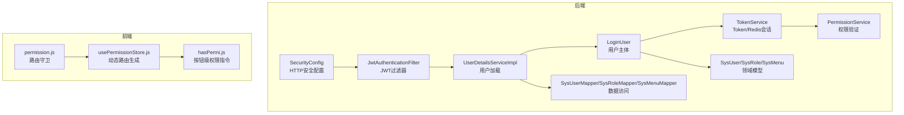
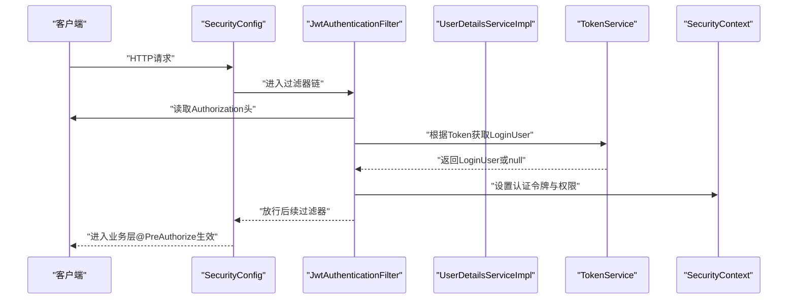
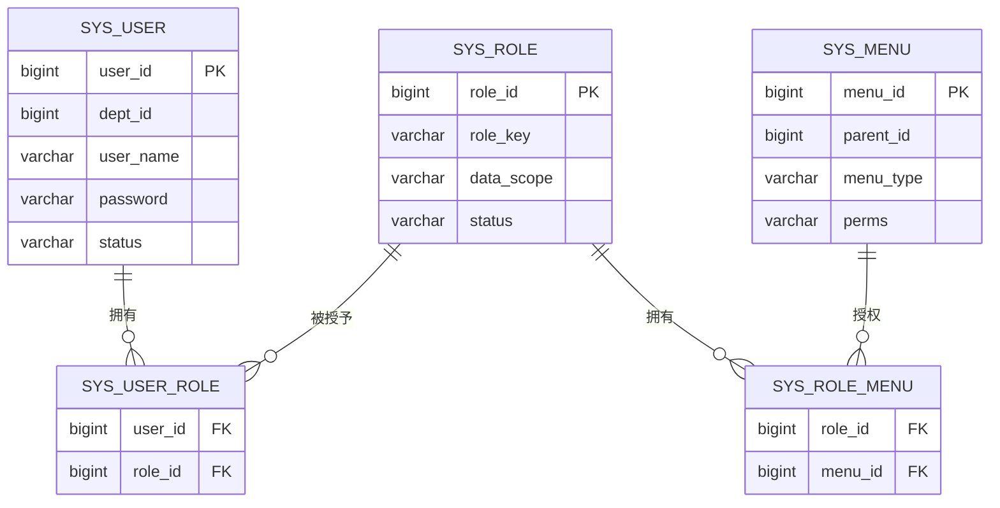
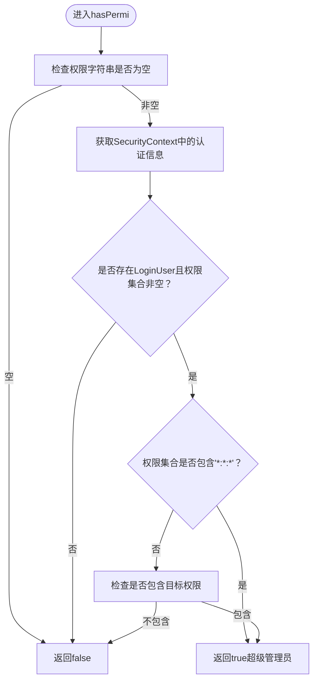
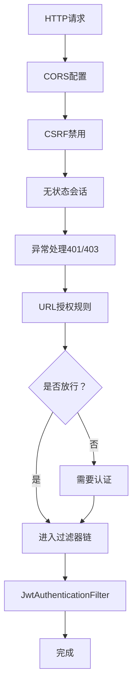
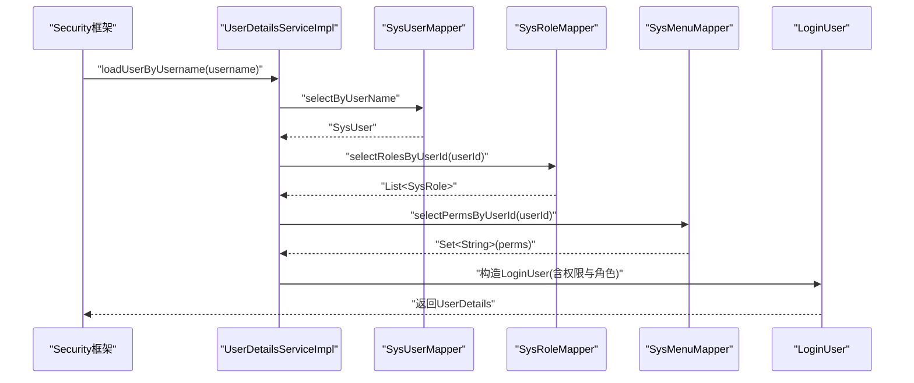
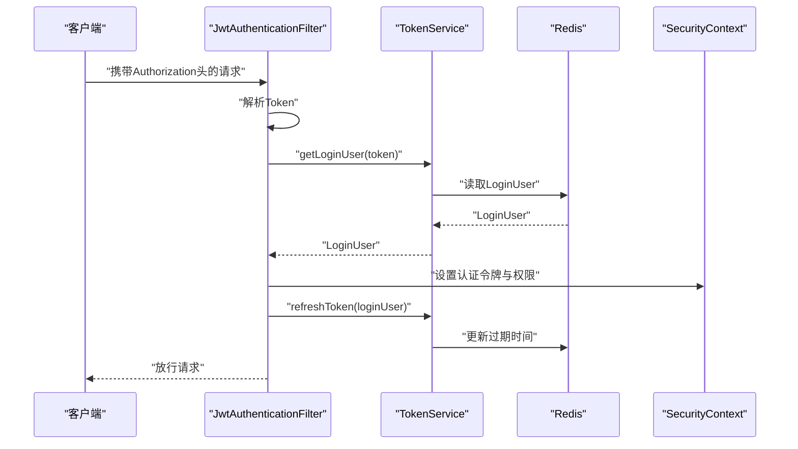
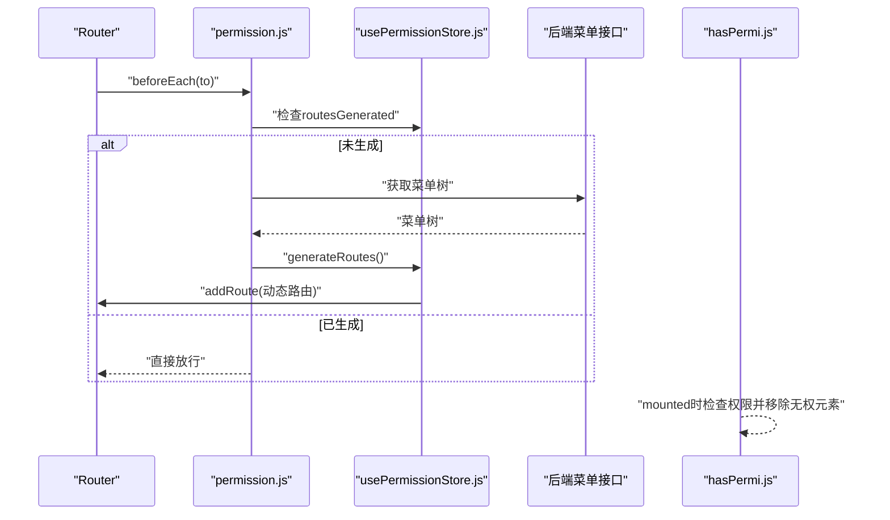
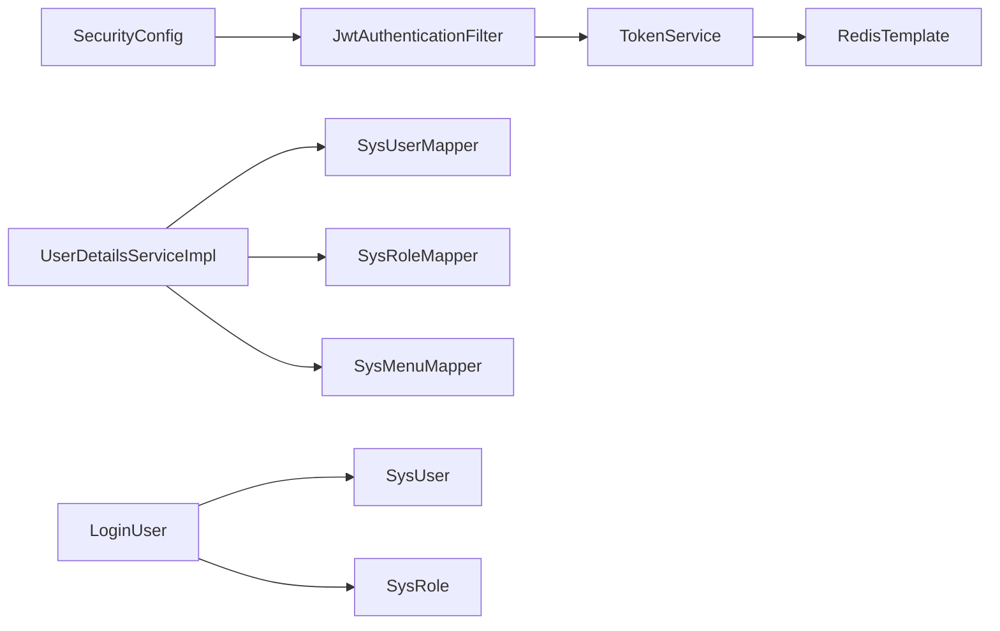

# 授权安全

<cite>
**本文引用的文件**
- [PermissionService.java](file://task-manager-backend/src/main/java/com/taskmanager/security/PermissionService.java)
- [SecurityConfig.java](file://task-manager-backend/src/main/java/com/taskmanager/config/SecurityConfig.java)
- [JwtAuthenticationFilter.java](file://task-manager-backend/src/main/java/com/taskmanager/security/JwtAuthenticationFilter.java)
- [UserDetailsServiceImpl.java](file://task-manager-backend/src/main/java/com/taskmanager/security/UserDetailsServiceImpl.java)
- [LoginUser.java](file://task-manager-backend/src/main/java/com/taskmanager/security/LoginUser.java)
- [TokenService.java](file://task-manager-backend/src/main/java/com/taskmanager/security/TokenService.java)
- [SysMenu.java](file://task-manager-backend/src/main/java/com/taskmanager/domain/SysMenu.java)
- [SysRole.java](file://task-manager-backend/src/main/java/com/taskmanager/domain/SysRole.java)
- [SysUser.java](file://task-manager-backend/src/main/java/com/taskmanager/domain/SysUser.java)
- [SysMenuMapper.java](file://task-manager-backend/src/main/java/com/taskmanager/mapper/SysMenuMapper.java)
- [SysRoleMapper.java](file://task-manager-backend/src/main/java/com/taskmanager/mapper/SysRoleMapper.java)
- [SysUserMapper.java](file://task-manager-backend/src/main/java/com/taskmanager/mapper/SysUserMapper.java)
- [application.yml](file://task-manager-backend/src/main/resources/application.yml)
- [hasPermi.js](file://task-manager-frontend/src/directive/permission/hasPermi.js)
- [usePermissionStore.js](file://task-manager-frontend/src/store/modules/usePermissionStore.js)
- [permission.js](file://task-manager-frontend/src/permission.js)
</cite>

## 目录
1. [引言](#引言)
2. [项目结构](#项目结构)
3. [核心组件](#核心组件)
4. [架构总览](#架构总览)
5. [详细组件分析](#详细组件分析)
6. [依赖分析](#依赖分析)
7. [性能考虑](#性能考虑)
8. [故障排查指南](#故障排查指南)
9. [结论](#结论)
10. [附录](#附录)

## 引言
本文件面向CodeBuddy任务管理系统，系统性梳理其授权与安全体系，重点覆盖：
- RBAC权限模型：用户、角色、权限、菜单的关系设计与数据模型
- 权限服务：PermissionService的权限验证、动态判断与缓存机制
- 安全配置：SecurityConfig的HTTP安全策略、URL授权规则、匿名访问与跨域
- 注解权限：@PreAuthorize等Spring Security注解的使用场景
- 动态菜单：基于用户权限的动态路由与菜单生成
- 数据权限：部门/个人等多维数据访问控制策略
- 高级特性：权限继承、组合与撤销
- 最佳实践与测试方法

## 项目结构
后端采用Spring Boot + Spring Security + MyBatis-Plus + Redis实现无状态认证与权限控制；前端使用Vue 3 + Element Plus + Pinia，结合指令与路由守卫实现前端侧权限控制与动态菜单。

图表来源
- [SecurityConfig.java:47-97](file://task-manager-backend/src/main/java/com/taskmanager/config/SecurityConfig.java#L47-L97)
- [JwtAuthenticationFilter.java:37-57](file://task-manager-backend/src/main/java/com/taskmanager/security/JwtAuthenticationFilter.java#L37-L57)
- [UserDetailsServiceImpl.java:39-57](file://task-manager-backend/src/main/java/com/taskmanager/security/UserDetailsServiceImpl.java#L39-L57)
- [LoginUser.java:58-67](file://task-manager-backend/src/main/java/com/taskmanager/security/LoginUser.java#L58-L67)
- [TokenService.java:34-80](file://task-manager-backend/src/main/java/com/taskmanager/security/TokenService.java#L34-L80)
- [PermissionService.java:25-48](file://task-manager-backend/src/main/java/com/taskmanager/security/PermissionService.java#L25-L48)
- [SysUser.java:17-79](file://task-manager-backend/src/main/java/com/taskmanager/domain/SysUser.java#L17-L79)
- [SysRole.java:17-64](file://task-manager-backend/src/main/java/com/taskmanager/domain/SysRole.java#L17-L64)
- [SysMenu.java:21-91](file://task-manager-backend/src/main/java/com/taskmanager/domain/SysMenu.java#L21-L91)
- [SysUserMapper.java:21](file://task-manager-backend/src/main/java/com/taskmanager/mapper/SysUserMapper.java#L21)
- [SysRoleMapper.java:20](file://task-manager-backend/src/main/java/com/taskmanager/mapper/SysRoleMapper.java#L20)
- [SysMenuMapper.java:24](file://task-manager-backend/src/main/java/com/taskmanager/mapper/SysMenuMapper.java#L24)
- [permission.js:10-48](file://task-manager-frontend/src/permission.js#L10-L48)
- [usePermissionStore.js:37-93](file://task-manager-frontend/src/store/modules/usePermissionStore.js#L37-L93)
- [hasPermi.js:9-26](file://task-manager-frontend/src/directive/permission/hasPermi.js#L9-L26)

章节来源
- [SecurityConfig.java:47-97](file://task-manager-backend/src/main/java/com/taskmanager/config/SecurityConfig.java#L47-L97)
- [JwtAuthenticationFilter.java:37-57](file://task-manager-backend/src/main/java/com/taskmanager/security/JwtAuthenticationFilter.java#L37-L57)
- [UserDetailsServiceImpl.java:39-57](file://task-manager-backend/src/main/java/com/taskmanager/security/UserDetailsServiceImpl.java#L39-L57)
- [LoginUser.java:58-67](file://task-manager-backend/src/main/java/com/taskmanager/security/LoginUser.java#L58-L67)
- [TokenService.java:34-80](file://task-manager-backend/src/main/java/com/taskmanager/security/TokenService.java#L34-L80)
- [PermissionService.java:25-48](file://task-manager-backend/src/main/java/com/taskmanager/security/PermissionService.java#L25-L48)
- [SysUser.java:17-79](file://task-manager-backend/src/main/java/com/taskmanager/domain/SysUser.java#L17-L79)
- [SysRole.java:17-64](file://task-manager-backend/src/main/java/com/taskmanager/domain/SysRole.java#L17-L64)
- [SysMenu.java:21-91](file://task-manager-backend/src/main/java/com/taskmanager/domain/SysMenu.java#L21-L91)
- [SysUserMapper.java:21](file://task-manager-backend/src/main/java/com/taskmanager/mapper/SysUserMapper.java#L21)
- [SysRoleMapper.java:20](file://task-manager-backend/src/main/java/com/taskmanager/mapper/SysRoleMapper.java#L20)
- [SysMenuMapper.java:24](file://task-manager-backend/src/main/java/com/taskmanager/mapper/SysMenuMapper.java#L24)
- [permission.js:10-48](file://task-manager-frontend/src/permission.js#L10-L48)
- [usePermissionStore.js:37-93](file://task-manager-frontend/src/store/modules/usePermissionStore.js#L37-L93)
- [hasPermi.js:9-26](file://task-manager-frontend/src/directive/permission/hasPermi.js#L9-L26)

## 核心组件
- 权限服务：PermissionService提供hasPermi/lacksPermi能力，支持通配符“*:*:*”超级管理员权限，并从Security上下文获取当前LoginUser进行权限判断。
- 安全配置：SecurityConfig启用方法级注解，配置无状态会话、CORS、CSRF禁用、异常处理、URL放行规则与JWT过滤器链。
- 认证过滤：JwtAuthenticationFilter从请求头提取Token，从Redis解析LoginUser，构建认证令牌并写入Security上下文，同时刷新Token过期时间。
- 用户加载：UserDetailsServiceImpl按用户名加载用户，查询角色与权限集合，封装为LoginUser。
- 用户主体：LoginUser实现UserDetails，将权限字符串转为GrantedAuthority集合，暴露用户信息、权限与角色。
- Token服务：TokenService负责Token生成、Redis存储、续期与删除。
- 数据模型：SysUser/SysRole/SysMenu承载用户、角色、菜单与权限标识；Mapper提供权限查询与菜单树构建。
- 前端指令：hasPermi.js实现按钮级权限指令；permission.js与usePermissionStore.js实现动态路由与菜单生成。

章节来源
- [PermissionService.java:13-64](file://task-manager-backend/src/main/java/com/taskmanager/security/PermissionService.java#L13-L64)
- [SecurityConfig.java:31-115](file://task-manager-backend/src/main/java/com/taskmanager/config/SecurityConfig.java#L31-L115)
- [JwtAuthenticationFilter.java:22-70](file://task-manager-backend/src/main/java/com/taskmanager/security/JwtAuthenticationFilter.java#L22-L70)
- [UserDetailsServiceImpl.java:21-59](file://task-manager-backend/src/main/java/com/taskmanager/security/UserDetailsServiceImpl.java#L21-L59)
- [LoginUser.java:23-110](file://task-manager-backend/src/main/java/com/taskmanager/security/LoginUser.java#L23-L110)
- [TokenService.java:18-89](file://task-manager-backend/src/main/java/com/taskmanager/security/TokenService.java#L18-L89)
- [SysUser.java:17-79](file://task-manager-backend/src/main/java/com/taskmanager/domain/SysUser.java#L17-L79)
- [SysRole.java:17-64](file://task-manager-backend/src/main/java/com/taskmanager/domain/SysRole.java#L17-L64)
- [SysMenu.java:21-91](file://task-manager-backend/src/main/java/com/taskmanager/domain/SysMenu.java#L21-L91)
- [SysUserMapper.java:21](file://task-manager-backend/src/main/java/com/taskmanager/mapper/SysUserMapper.java#L21)
- [SysRoleMapper.java:20](file://task-manager-backend/src/main/java/com/taskmanager/mapper/SysRoleMapper.java#L20)
- [SysMenuMapper.java:24](file://task-manager-backend/src/main/java/com/taskmanager/mapper/SysMenuMapper.java#L24)
- [hasPermi.js:1-27](file://task-manager-frontend/src/directive/permission/hasPermi.js#L1-L27)
- [usePermissionStore.js:1-105](file://task-manager-frontend/src/store/modules/usePermissionStore.js#L1-L105)
- [permission.js:1-53](file://task-manager-frontend/src/permission.js#L1-L53)

## 架构总览
后端以无状态JWT为核心，通过过滤器链完成认证与授权；前端通过路由守卫与动态路由生成实现菜单与页面级权限控制；按钮级权限通过指令实现。

图表来源
- [SecurityConfig.java:47-97](file://task-manager-backend/src/main/java/com/taskmanager/config/SecurityConfig.java#L47-L97)
- [JwtAuthenticationFilter.java:37-57](file://task-manager-backend/src/main/java/com/taskmanager/security/JwtAuthenticationFilter.java#L37-L57)
- [TokenService.java:49-62](file://task-manager-backend/src/main/java/com/taskmanager/security/TokenService.java#L49-L62)
- [UserDetailsServiceImpl.java:39-57](file://task-manager-backend/src/main/java/com/taskmanager/security/UserDetailsServiceImpl.java#L39-L57)

## 详细组件分析

### RBAC数据模型与关系
- 用户（SysUser）：包含用户基本信息与状态
- 角色（SysRole）：包含角色键、显示顺序、数据范围（全部/自定义/本部门/本部门及以下/仅本人）
- 菜单（SysMenu）：包含菜单名称、类型（目录/菜单/按钮）、权限标识perms
- 关系：
  - 用户-角色：多对多（SysUserRole）
  - 角色-菜单：多对多（SysRoleMenu）
  - 权限来源：菜单perms集合，经UserDetailsServiceImpl聚合为用户权限集

图表来源
- [SysUser.java:23-57](file://task-manager-backend/src/main/java/com/taskmanager/domain/SysUser.java#L23-L57)
- [SysRole.java:22-42](file://task-manager-backend/src/main/java/com/taskmanager/domain/SysRole.java#L22-L42)
- [SysMenu.java:26-68](file://task-manager-backend/src/main/java/com/taskmanager/domain/SysMenu.java#L26-L68)

章节来源
- [SysUser.java:17-79](file://task-manager-backend/src/main/java/com/taskmanager/domain/SysUser.java#L17-L79)
- [SysRole.java:17-64](file://task-manager-backend/src/main/java/com/taskmanager/domain/SysRole.java#L17-L64)
- [SysMenu.java:21-91](file://task-manager-backend/src/main/java/com/taskmanager/domain/SysMenu.java#L21-L91)

### 权限服务与注解使用
- PermissionService提供hasPermi与lacksPermi，支持通配符“*:*:*”超级管理员；从SecurityContext获取LoginUser，读取其权限集合进行判断。
- SecurityConfig启用@EnableMethodSecurity，使@PreAuthorize、@PostAuthorize等注解生效。
- 典型用法：
  - 控制器方法上使用@PreAuthorize("@ss.hasPermi('system:user:list')")进行权限校验
  - 对于敏感操作可使用@PostAuthorize进行后置判断

图表来源
- [PermissionService.java:25-48](file://task-manager-backend/src/main/java/com/taskmanager/security/PermissionService.java#L25-L48)

章节来源
- [PermissionService.java:13-64](file://task-manager-backend/src/main/java/com/taskmanager/security/PermissionService.java#L13-L64)
- [SecurityConfig.java:33](file://task-manager-backend/src/main/java/com/taskmanager/config/SecurityConfig.java#L33)

### 安全配置与HTTP安全策略
- 无状态会话：SessionCreationPolicy.STATELESS
- CSRF禁用：前后端分离场景无需CSRF
- CORS：通过@EnableWebSecurity启用，具体跨域配置位于独立配置类
- 异常处理：认证失败返回401，权限不足返回403
- URL放行：登录、注册、验证码、公开字典、Knife4j文档等接口无需认证
- JWT过滤器链：在UsernamePasswordAuthenticationFilter之前加入JwtAuthenticationFilter

图表来源
- [SecurityConfig.java:47-97](file://task-manager-backend/src/main/java/com/taskmanager/config/SecurityConfig.java#L47-L97)

章节来源
- [SecurityConfig.java:31-115](file://task-manager-backend/src/main/java/com/taskmanager/config/SecurityConfig.java#L31-L115)

### 认证与用户加载
- UserDetailsServiceImpl.loadUserByUsername：
  - 查询用户基本信息
  - 查询用户角色列表
  - 通过菜单Mapper查询权限标识集合（基于角色关联的菜单perms）
  - 返回LoginUser，其中包含用户、权限集合与角色列表
- LoginUser实现UserDetails：
  - 将权限字符串集合转换为GrantedAuthority集合
  - isEnabled根据用户状态字段判断
  - 提供username/password等基础信息

图表来源
- [UserDetailsServiceImpl.java:39-57](file://task-manager-backend/src/main/java/com/taskmanager/security/UserDetailsServiceImpl.java#L39-L57)
- [SysUserMapper.java:21](file://task-manager-backend/src/main/java/com/taskmanager/mapper/SysUserMapper.java#L21)
- [SysRoleMapper.java:20](file://task-manager-backend/src/main/java/com/taskmanager/mapper/SysRoleMapper.java#L20)
- [SysMenuMapper.java:24](file://task-manager-backend/src/main/java/com/taskmanager/mapper/SysMenuMapper.java#L24)
- [LoginUser.java:58-67](file://task-manager-backend/src/main/java/com/taskmanager/security/LoginUser.java#L58-L67)

章节来源
- [UserDetailsServiceImpl.java:21-59](file://task-manager-backend/src/main/java/com/taskmanager/security/UserDetailsServiceImpl.java#L21-L59)
- [LoginUser.java:23-110](file://task-manager-backend/src/main/java/com/taskmanager/security/LoginUser.java#L23-L110)

### JWT与Token服务
- JwtAuthenticationFilter：
  - 从请求头读取Token（前缀与Header名称来自配置）
  - 通过TokenService从Redis获取LoginUser
  - 构建UsernamePasswordAuthenticationToken并写入SecurityContext
  - 自动续期Token过期时间
- TokenService：
  - createToken：生成UUID作为Token，写入Redis并设置过期时间
  - getLoginUser：从Redis读取LoginUser
  - refreshToken：延长Redis中Token的过期时间
  - delLoginUser：登出时删除Redis中的用户信息

图表来源
- [JwtAuthenticationFilter.java:37-57](file://task-manager-backend/src/main/java/com/taskmanager/security/JwtAuthenticationFilter.java#L37-L57)
- [TokenService.java:34-80](file://task-manager-backend/src/main/java/com/taskmanager/security/TokenService.java#L34-L80)
- [application.yml:52-56](file://task-manager-backend/src/main/resources/application.yml#L52-L56)

章节来源
- [JwtAuthenticationFilter.java:22-70](file://task-manager-backend/src/main/java/com/taskmanager/security/JwtAuthenticationFilter.java#L22-L70)
- [TokenService.java:18-89](file://task-manager-backend/src/main/java/com/taskmanager/security/TokenService.java#L18-L89)
- [application.yml:51-56](file://task-manager-backend/src/main/resources/application.yml#L51-L56)

### 动态菜单与路由生成
- 前端路由守卫permission.js：
  - 若已存在Token且访问受保护路由，则拉取用户信息与菜单树
  - 生成动态路由并替换当前路由
- 动态路由生成usePermissionStore.js：
  - 调用getRouters获取菜单树
  - 遍历菜单树，将子路由拼接为完整路径并注册到router
  - 支持组件懒加载映射
- 按钮级权限指令hasPermi.js：
  - 读取Pinia中的permissions
  - 支持通配符“*:*:*”，若无权限则移除DOM元素

图表来源
- [permission.js:10-48](file://task-manager-frontend/src/permission.js#L10-L48)
- [usePermissionStore.js:37-93](file://task-manager-frontend/src/store/modules/usePermissionStore.js#L37-L93)
- [hasPermi.js:9-26](file://task-manager-frontend/src/directive/permission/hasPermi.js#L9-L26)

章节来源
- [permission.js:1-53](file://task-manager-frontend/src/permission.js#L1-L53)
- [usePermissionStore.js:1-105](file://task-manager-frontend/src/store/modules/usePermissionStore.js#L1-L105)
- [hasPermi.js:1-27](file://task-manager-frontend/src/directive/permission/hasPermi.js#L1-L27)

### 数据权限过滤策略
- 角色表包含dataScope字段，支持以下范围：
  - 1全部
  - 2自定义
  - 3本部门
  - 4本部门及以下
  - 5仅本人
- 实现建议（概念性说明）：
  - 在数据查询层（MyBatis-Plus拦截器或自定义SQL）根据LoginUser的角色dataScope与当前用户deptId组装过滤条件
  - 对于“本部门及以下”需递归计算部门树
  - 对于“仅本人”直接绑定创建人字段
- 该策略与业务表（如订单、商品）结合，在Service层或SQL层面应用

章节来源
- [SysRole.java:35-42](file://task-manager-backend/src/main/java/com/taskmanager/domain/SysRole.java#L35-L42)

### 高级权限特性
- 权限继承：通过角色-菜单关联实现，角色继承其关联菜单的所有权限标识
- 权限组合：用户权限集合为所有角色对应菜单权限的并集
- 权限撤销：通过调整角色-菜单关联或角色状态实现；超级管理员权限（通配符）不可被普通权限撤销

章节来源
- [SysRoleMapper.java:20](file://task-manager-backend/src/main/java/com/taskmanager/mapper/SysRoleMapper.java#L20)
- [SysMenuMapper.java:24](file://task-manager-backend/src/main/java/com/taskmanager/mapper/SysMenuMapper.java#L24)
- [PermissionService.java:17](file://task-manager-backend/src/main/java/com/taskmanager/security/PermissionService.java#L17)

## 依赖分析
- 后端模块耦合：
  - SecurityConfig依赖JwtAuthenticationFilter与ObjectMapper
  - JwtAuthenticationFilter依赖TokenService
  - UserDetailsServiceImpl依赖SysUserMapper、SysRoleMapper、SysMenuMapper
  - LoginUser依赖SysUser、SysRole与权限集合
  - TokenService依赖RedisTemplate与配置项
- 前端模块耦合：
  - permission.js依赖useUserStore与usePermissionStore
  - usePermissionStore.js依赖router与API
  - hasPermi.js依赖Pinia store与DOM操作

图表来源
- [SecurityConfig.java:39-42](file://task-manager-backend/src/main/java/com/taskmanager/config/SecurityConfig.java#L39-L42)
- [JwtAuthenticationFilter.java:33-35](file://task-manager-backend/src/main/java/com/taskmanager/security/JwtAuthenticationFilter.java#L33-L35)
- [UserDetailsServiceImpl.java:24-34](file://task-manager-backend/src/main/java/com/taskmanager/security/UserDetailsServiceImpl.java#L24-L34)
- [LoginUser.java:35-42](file://task-manager-backend/src/main/java/com/taskmanager/security/LoginUser.java#L35-L42)
- [TokenService.java:25-26](file://task-manager-backend/src/main/java/com/taskmanager/security/TokenService.java#L25-L26)

章节来源
- [SecurityConfig.java:31-115](file://task-manager-backend/src/main/java/com/taskmanager/config/SecurityConfig.java#L31-L115)
- [JwtAuthenticationFilter.java:22-70](file://task-manager-backend/src/main/java/com/taskmanager/security/JwtAuthenticationFilter.java#L22-L70)
- [UserDetailsServiceImpl.java:21-59](file://task-manager-backend/src/main/java/com/taskmanager/security/UserDetailsServiceImpl.java#L21-L59)
- [LoginUser.java:23-110](file://task-manager-backend/src/main/java/com/taskmanager/security/LoginUser.java#L23-L110)
- [TokenService.java:18-89](file://task-manager-backend/src/main/java/com/taskmanager/security/TokenService.java#L18-L89)

## 性能考虑
- Token存储与续期：Redis存储LoginUser，请求期间自动续期，降低重复鉴权成本
- 权限判断：内存中Set<String>权限集合O(1)查找，注解权限在方法级生效
- 菜单树构建：后端一次性查询并缓存菜单树，前端按需渲染
- SQL优化：权限查询通过角色-菜单关联一次性获取，避免N+1查询

## 故障排查指南
- 认证失败（401）：
  - 检查请求头Authorization是否正确携带Token（前缀与Header名称）
  - 检查Redis中Token对应的LoginUser是否存在
  - 检查UserDetailsServiceImpl是否成功加载用户与权限
- 权限不足（403）：
  - 检查用户是否具备目标权限标识
  - 检查角色-菜单关联是否正确
  - 检查注解使用是否正确（@PreAuthorize表达式）
- 前端权限无效：
  - 检查hasPermi指令使用是否正确
  - 检查Pinia store中的permissions是否与后端一致
  - 检查动态路由是否已生成

章节来源
- [SecurityConfig.java:59-74](file://task-manager-backend/src/main/java/com/taskmanager/config/SecurityConfig.java#L59-L74)
- [JwtAuthenticationFilter.java:62-68](file://task-manager-backend/src/main/java/com/taskmanager/security/JwtAuthenticationFilter.java#L62-L68)
- [TokenService.java:49-62](file://task-manager-backend/src/main/java/com/taskmanager/security/TokenService.java#L49-L62)
- [UserDetailsServiceImpl.java:39-57](file://task-manager-backend/src/main/java/com/taskmanager/security/UserDetailsServiceImpl.java#L39-L57)
- [hasPermi.js:15-24](file://task-manager-frontend/src/directive/permission/hasPermi.js#L15-L24)

## 结论
本系统采用成熟的RBAC模型与无状态JWT认证，结合Spring Security的方法级注解与前端动态路由/指令，实现了从HTTP层到UI层的全栈权限控制。通过角色数据范围与菜单权限标识的组合，可灵活实现多维数据权限；通过通配符权限与注解权限，兼顾了灵活性与安全性。建议在生产环境中进一步完善数据权限拦截器与审计日志，持续提升安全与可观测性。

## 附录
- 配置要点
  - JWT配置：secret、expiration、header、prefix
  - Redis连接：host/port/password/database/timeout
  - MyBatis-Plus：驼峰映射、逻辑删除字段
- 测试建议
  - 单元测试：PermissionService的hasPermi/lacksPermi边界条件
  - 集成测试：SecurityConfig的URL放行与鉴权链路
  - 端到端测试：前端hasPermi指令与动态路由生成

章节来源
- [application.yml:51-79](file://task-manager-backend/src/main/resources/application.yml#L51-L79)