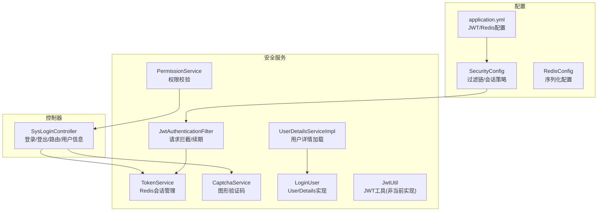
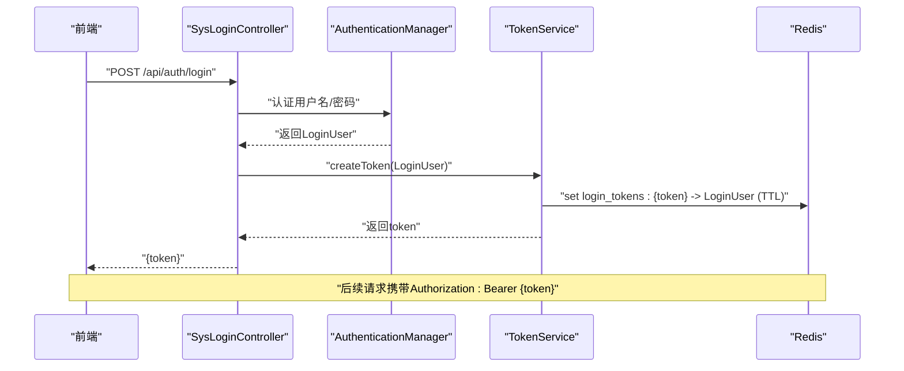
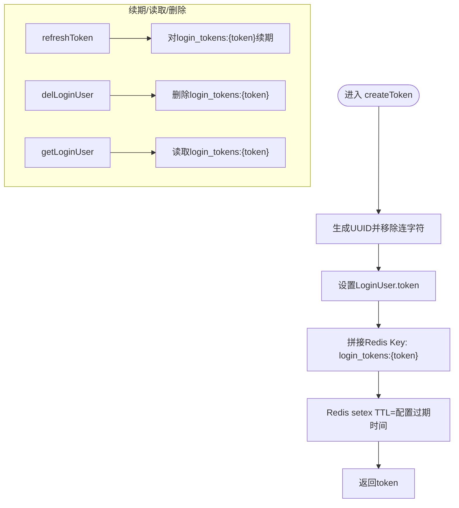
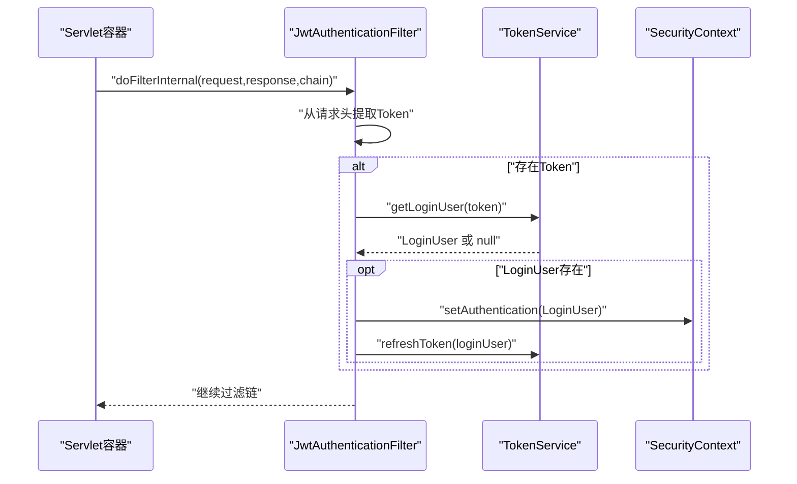
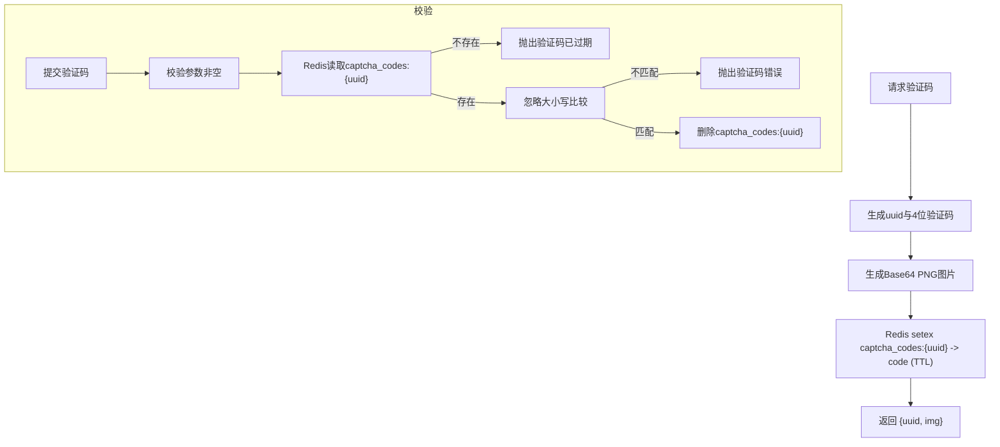
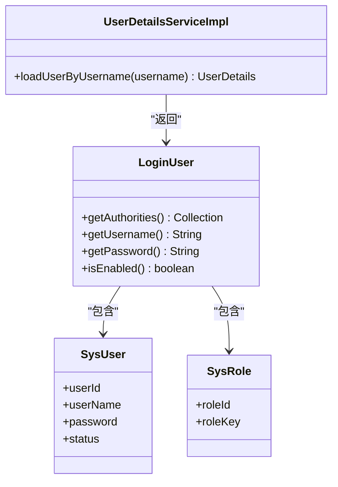
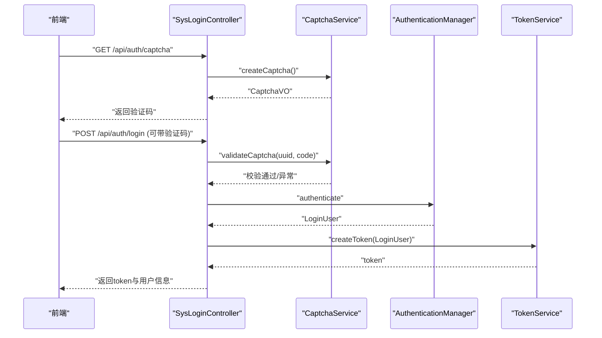
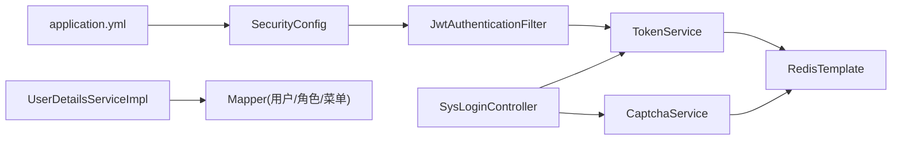

# 认证安全

<cite>
**本文引用的文件**
- [application.yml](file://task-manager-backend/src/main/resources/application.yml)
- [Constants.java](file://task-manager-backend/src/main/java/com/taskmanager/common/constant/Constants.java)
- [SecurityConfig.java](file://task-manager-backend/src/main/java/com/taskmanager/config/SecurityConfig.java)
- [RedisConfig.java](file://task-manager-backend/src/main/java/com/taskmanager/config/RedisConfig.java)
- [SysLoginController.java](file://task-manager-backend/src/main/java/com/taskmanager/controller/SysLoginController.java)
- [TokenService.java](file://task-manager-backend/src/main/java/com/taskmanager/security/TokenService.java)
- [JwtAuthenticationFilter.java](file://task-manager-backend/src/main/java/com/taskmanager/security/JwtAuthenticationFilter.java)
- [CaptchaService.java](file://task-manager-backend/src/main/java/com/taskmanager/security/CaptchaService.java)
- [UserDetailsServiceImpl.java](file://task-manager-backend/src/main/java/com/taskmanager/security/UserDetailsServiceImpl.java)
- [LoginUser.java](file://task-manager-backend/src/main/java/com/taskmanager/security/LoginUser.java)
- [PermissionService.java](file://task-manager-backend/src/main/java/com/taskmanager/security/PermissionService.java)
- [JwtUtil.java](file://task-manager-backend/src/main/java/com/taskmanager/utils/JwtUtil.java)
- [GlobalExceptionHandler.java](file://task-manager-backend/src/main/java/com/taskmanager/common/exception/GlobalExceptionHandler.java)
- [SysUser.java](file://task-manager-backend/src/main/java/com/taskmanager/domain/SysUser.java)
</cite>

## 目录
1. [简介](#简介)
2. [项目结构](#项目结构)
3. [核心组件](#核心组件)
4. [架构总览](#架构总览)
5. [详细组件分析](#详细组件分析)
6. [依赖分析](#依赖分析)
7. [性能考虑](#性能考虑)
8. [故障排查指南](#故障排查指南)
9. [结论](#结论)
10. [附录](#附录)

## 简介
本文件面向CodeBuddy任务管理系统中的认证与安全模块，围绕基于Token的无状态认证体系，系统性阐述以下主题：
- Token生命周期管理：生成、存储、过期与续期策略
- TokenService核心方法的工作原理
- JwtAuthenticationFilter的认证拦截与续期机制
- CaptchaService验证码生成与校验、防暴力破解
- UserDetailsServiceImpl用户详情加载与权限装配
- 异常处理与安全最佳实践

## 项目结构
认证安全相关代码主要分布在以下包与文件中：
- 配置层：SecurityConfig、RedisConfig、application.yml
- 控制器：SysLoginController（登录、登出、获取用户信息、路由）
- 安全服务：TokenService、JwtAuthenticationFilter、CaptchaService、UserDetailsServiceImpl、PermissionService、LoginUser、JwtUtil
- 常量与异常：Constants、GlobalExceptionHandler

**图表来源**
- [application.yml:51-56](file://task-manager-backend/src/main/resources/application.yml#L51-L56)
- [SecurityConfig.java:47-97](file://task-manager-backend/src/main/java/com/taskmanager/config/SecurityConfig.java#L47-L97)
- [RedisConfig.java:18-31](file://task-manager-backend/src/main/java/com/taskmanager/config/RedisConfig.java#L18-L31)
- [SysLoginController.java:31-327](file://task-manager-backend/src/main/java/com/taskmanager/controller/SysLoginController.java#L31-L327)
- [TokenService.java:18-88](file://task-manager-backend/src/main/java/com/taskmanager/security/TokenService.java#L18-L88)
- [JwtAuthenticationFilter.java:22-70](file://task-manager-backend/src/main/java/com/taskmanager/security/JwtAuthenticationFilter.java#L22-L70)
- [CaptchaService.java:25-129](file://task-manager-backend/src/main/java/com/taskmanager/security/CaptchaService.java#L25-L129)
- [UserDetailsServiceImpl.java:21-59](file://task-manager-backend/src/main/java/com/taskmanager/security/UserDetailsServiceImpl.java#L21-L59)
- [PermissionService.java:13-64](file://task-manager-backend/src/main/java/com/taskmanager/security/PermissionService.java#L13-L64)
- [LoginUser.java:23-110](file://task-manager-backend/src/main/java/com/taskmanager/security/LoginUser.java#L23-L110)
- [JwtUtil.java:18-96](file://task-manager-backend/src/main/java/com/taskmanager/utils/JwtUtil.java#L18-L96)

**章节来源**
- [application.yml:51-56](file://task-manager-backend/src/main/resources/application.yml#L51-L56)
- [SecurityConfig.java:47-97](file://task-manager-backend/src/main/java/com/taskmanager/config/SecurityConfig.java#L47-L97)
- [RedisConfig.java:18-31](file://task-manager-backend/src/main/java/com/taskmanager/config/RedisConfig.java#L18-L31)
- [SysLoginController.java:31-327](file://task-manager-backend/src/main/java/com/taskmanager/controller/SysLoginController.java#L31-L327)

## 核心组件
- TokenService：负责Token生成、Redis存储、续期与删除；使用UUID生成Token，以固定前缀键存入Redis，并按配置的过期时间设置TTL。
- JwtAuthenticationFilter：拦截请求，从请求头提取Token，查询Redis获取LoginUser，构建Spring Security认证上下文，并自动续期。
- CaptchaService：生成图形验证码（Base64 PNG），将正确答案存入Redis并设置过期时间；提供校验逻辑并一次性消费。
- UserDetailsServiceImpl：根据用户名加载用户、角色与权限，封装为LoginUser并交由Spring Security使用。
- PermissionService：在方法级权限控制中提供hasPermi/lacksPermi能力，支持通配符权限。
- LoginUser：实现UserDetails，承载用户、权限与角色信息，并提供权限集合转换。
- SysLoginController：登录/登出/获取用户信息/动态路由接口，集成验证码与Token创建。

**章节来源**
- [TokenService.java:18-88](file://task-manager-backend/src/main/java/com/taskmanager/security/TokenService.java#L18-L88)
- [JwtAuthenticationFilter.java:22-70](file://task-manager-backend/src/main/java/com/taskmanager/security/JwtAuthenticationFilter.java#L22-L70)
- [CaptchaService.java:25-129](file://task-manager-backend/src/main/java/com/taskmanager/security/CaptchaService.java#L25-L129)
- [UserDetailsServiceImpl.java:21-59](file://task-manager-backend/src/main/java/com/taskmanager/security/UserDetailsServiceImpl.java#L21-L59)
- [PermissionService.java:13-64](file://task-manager-backend/src/main/java/com/taskmanager/security/PermissionService.java#L13-L64)
- [LoginUser.java:23-110](file://task-manager-backend/src/main/java/com/taskmanager/security/LoginUser.java#L23-L110)
- [SysLoginController.java:31-327](file://task-manager-backend/src/main/java/com/taskmanager/controller/SysLoginController.java#L31-L327)

## 架构总览
系统采用“无状态Token + 分布式缓存”的认证模型：
- 前端在登录成功后持有Token，后续请求在请求头中携带Token
- 后端通过JwtAuthenticationFilter拦截请求，从Redis读取用户会话并注入Security上下文
- Token过期时间由配置决定，每次有效请求都会自动续期
- 登出时删除Redis中的会话记录，使Token失效

**图表来源**
- [SysLoginController.java:103-135](file://task-manager-backend/src/main/java/com/taskmanager/controller/SysLoginController.java#L103-L135)
- [TokenService.java:34-41](file://task-manager-backend/src/main/java/com/taskmanager/security/TokenService.java#L34-L41)
- [Constants.java:28-29](file://task-manager-backend/src/main/java/com/taskmanager/common/constant/Constants.java#L28-L29)

## 详细组件分析

### TokenService：Token生命周期与Redis存储
- 生成算法：使用UUID生成随机Token，去除连字符，作为会话标识
- 存储机制：以固定前缀拼接Redis Key，将LoginUser对象整体存入，设置TTL为配置的过期时间
- 过期与续期：refreshToken根据当前Token对Redis Key进行续期；getLoginUser在空值或异常时返回null；delLoginUser在登出时删除
- 关键点：LoginUser中包含token字段，便于续期与删除；Redis序列化采用JSON，可持久化复杂对象

**图表来源**
- [TokenService.java:34-41](file://task-manager-backend/src/main/java/com/taskmanager/security/TokenService.java#L34-L41)
- [TokenService.java:67-71](file://task-manager-backend/src/main/java/com/taskmanager/security/TokenService.java#L67-L71)
- [TokenService.java:49-62](file://task-manager-backend/src/main/java/com/taskmanager/security/TokenService.java#L49-L62)
- [TokenService.java:76-80](file://task-manager-backend/src/main/java/com/taskmanager/security/TokenService.java#L76-L80)
- [Constants.java:28-29](file://task-manager-backend/src/main/java/com/taskmanager/common/constant/Constants.java#L28-L29)

**章节来源**
- [TokenService.java:18-88](file://task-manager-backend/src/main/java/com/taskmanager/security/TokenService.java#L18-L88)
- [Constants.java:28-29](file://task-manager-backend/src/main/java/com/taskmanager/common/constant/Constants.java#L28-L29)

### JwtAuthenticationFilter：请求拦截与认证上下文注入
- 请求拦截：从请求头读取配置的header与prefix，提取纯Token
- 用户解析：调用TokenService从Redis读取LoginUser
- 认证注入：若存在用户信息，构造UsernamePasswordAuthenticationToken并放入SecurityContextHolder
- 续期策略：每次有效请求均调用refreshToken续期
- 失败处理：无Token或解析失败不影响后续过滤链执行，由后续授权规则判定

**图表来源**
- [JwtAuthenticationFilter.java:37-57](file://task-manager-backend/src/main/java/com/taskmanager/security/JwtAuthenticationFilter.java#L37-L57)
- [TokenService.java:49-62](file://task-manager-backend/src/main/java/com/taskmanager/security/TokenService.java#L49-L62)
- [TokenService.java:67-71](file://task-manager-backend/src/main/java/com/taskmanager/security/TokenService.java#L67-L71)

**章节来源**
- [JwtAuthenticationFilter.java:22-70](file://task-manager-backend/src/main/java/com/taskmanager/security/JwtAuthenticationFilter.java#L22-L70)
- [TokenService.java:49-71](file://task-manager-backend/src/main/java/com/taskmanager/security/TokenService.java#L49-L71)

### CaptchaService：图形验证码与防暴力破解
- 生成流程：生成唯一key与4位验证码（排除易混淆字符），绘制Base64 PNG图片；将验证码存入Redis，设置过期时间
- 校验流程：校验输入，从Redis读取并对比（忽略大小写），命中即删除该key，避免重复使用
- 防暴力破解：验证码过期时间短、一次性消费、输入错误不暴露具体原因

**图表来源**
- [CaptchaService.java:39-50](file://task-manager-backend/src/main/java/com/taskmanager/security/CaptchaService.java#L39-L50)
- [CaptchaService.java:99-112](file://task-manager-backend/src/main/java/com/taskmanager/security/CaptchaService.java#L99-L112)
- [Constants.java:22-26](file://task-manager-backend/src/main/java/com/taskmanager/common/constant/Constants.java#L22-L26)

**章节来源**
- [CaptchaService.java:25-129](file://task-manager-backend/src/main/java/com/taskmanager/security/CaptchaService.java#L25-L129)
- [Constants.java:22-26](file://task-manager-backend/src/main/java/com/taskmanager/common/constant/Constants.java#L22-L26)

### UserDetailsServiceImpl：用户详情加载与权限装配
- 加载流程：根据用户名查询用户，查询用户角色，查询用户权限集合（通过角色菜单）
- 返回LoginUser：封装用户、权限与角色，供认证与授权使用
- 账户状态：LoginUser的isEnabled依据用户状态字段判断

**图表来源**
- [UserDetailsServiceImpl.java:39-57](file://task-manager-backend/src/main/java/com/taskmanager/security/UserDetailsServiceImpl.java#L39-L57)
- [LoginUser.java:25-110](file://task-manager-backend/src/main/java/com/taskmanager/security/LoginUser.java#L25-L110)
- [SysUser.java:16-80](file://task-manager-backend/src/main/java/com/taskmanager/domain/SysUser.java#L16-L80)

**章节来源**
- [UserDetailsServiceImpl.java:21-59](file://task-manager-backend/src/main/java/com/taskmanager/security/UserDetailsServiceImpl.java#L21-L59)
- [LoginUser.java:23-110](file://task-manager-backend/src/main/java/com/taskmanager/security/LoginUser.java#L23-L110)
- [SysUser.java:16-80](file://task-manager-backend/src/main/java/com/taskmanager/domain/SysUser.java#L16-L80)

### SysLoginController：登录、登出、用户信息与路由
- 登录：可选验证码校验，认证通过后调用TokenService创建Token并返回
- 登出：删除Redis中的会话并清空Security上下文
- 获取用户信息：返回用户、角色、权限
- 动态路由：根据管理员与否返回不同菜单树

**图表来源**
- [SysLoginController.java:95-135](file://task-manager-backend/src/main/java/com/taskmanager/controller/SysLoginController.java#L95-L135)
- [CaptchaService.java:39-50](file://task-manager-backend/src/main/java/com/taskmanager/security/CaptchaService.java#L39-L50)
- [CaptchaService.java:99-112](file://task-manager-backend/src/main/java/com/taskmanager/security/CaptchaService.java#L99-L112)
- [TokenService.java:34-41](file://task-manager-backend/src/main/java/com/taskmanager/security/TokenService.java#L34-L41)

**章节来源**
- [SysLoginController.java:31-327](file://task-manager-backend/src/main/java/com/taskmanager/controller/SysLoginController.java#L31-L327)

### PermissionService：方法级权限校验
- hasPermi：支持通配符权限（超级管理员），用于@PreAuthorize
- lacksPermi：与hasPermi相反，用于限制操作
- 依赖SecurityContextHolder获取当前LoginUser

**章节来源**
- [PermissionService.java:13-64](file://task-manager-backend/src/main/java/com/taskmanager/security/PermissionService.java#L13-L64)

### LoginUser：认证主体与权限载体
- 实现UserDetails，提供用户名、密码、权限集合与账户状态
- 权限集合转换：将权限字符串集合映射为GrantedAuthority集合
- 账户状态：根据用户状态字段判断是否启用

**章节来源**
- [LoginUser.java:23-110](file://task-manager-backend/src/main/java/com/taskmanager/security/LoginUser.java#L23-L110)

### JwtUtil：JWT工具（与当前实现的关系说明）
- 当前项目使用Redis存储会话，而非直接解析JWT载荷
- JwtUtil提供JWT生成、校验与解析用户名的能力，可用于传统JWT方案

**章节来源**
- [JwtUtil.java:18-96](file://task-manager-backend/src/main/java/com/taskmanager/utils/JwtUtil.java#L18-L96)

## 依赖分析
- 配置依赖：application.yml提供JWT密钥、过期时间、请求头与前缀；Redis连接与序列化配置
- 过滤链依赖：SecurityConfig禁用CSRF与Session，设置STATELESS，将JwtAuthenticationFilter置于认证过滤器之前
- 服务依赖：SysLoginController依赖TokenService与CaptchaService；JwtAuthenticationFilter依赖TokenService；UserDetailsServiceImpl依赖Mapper查询用户、角色与权限

**图表来源**
- [application.yml:51-56](file://task-manager-backend/src/main/resources/application.yml#L51-L56)
- [SecurityConfig.java:47-97](file://task-manager-backend/src/main/java/com/taskmanager/config/SecurityConfig.java#L47-L97)
- [JwtAuthenticationFilter.java:31-35](file://task-manager-backend/src/main/java/com/taskmanager/security/JwtAuthenticationFilter.java#L31-L35)
- [TokenService.java:25-26](file://task-manager-backend/src/main/java/com/taskmanager/security/TokenService.java#L25-L26)
- [CaptchaService.java:33-34](file://task-manager-backend/src/main/java/com/taskmanager/security/CaptchaService.java#L33-L34)
- [SysLoginController.java:35-57](file://task-manager-backend/src/main/java/com/taskmanager/controller/SysLoginController.java#L35-L57)

**章节来源**
- [application.yml:51-56](file://task-manager-backend/src/main/resources/application.yml#L51-L56)
- [SecurityConfig.java:47-97](file://task-manager-backend/src/main/java/com/taskmanager/config/SecurityConfig.java#L47-L97)
- [SysLoginController.java:35-57](file://task-manager-backend/src/main/java/com/taskmanager/controller/SysLoginController.java#L35-L57)

## 性能考虑
- Redis序列化：RedisConfig采用JSON序列化，便于存储LoginUser对象，但需关注对象体积与网络传输开销
- 续期策略：每次有效请求都会调用expire续期，建议合理设置过期时间，避免频繁续期带来的Redis压力
- 过滤链：禁用Session与CSRF，减少状态维护成本，提升并发性能
- 验证码：Redis过期时间短，降低长期占用；一次性消费避免重复校验

[本节为通用指导，无需特定文件引用]

## 故障排查指南
- 认证失败（401）：检查请求头Authorization格式是否为Bearer {token}；确认Token未过期；查看全局异常处理器对AuthenticationException的统一返回
- 权限不足（403）：确认用户权限集合是否包含所需权限；超级管理员需具备通配符权限
- 验证码错误/过期：确认uuid与code是否传入；检查Redis中验证码是否已过期或被消费
- 登出后仍可访问：确认登出接口调用与TokenService.delLoginUser执行；检查SecurityContextHolder是否清空
- 会话超时：确认application.yml中jwt.expiration配置；检查Redis中login_tokens:{token}是否存在

**章节来源**
- [GlobalExceptionHandler.java:56-65](file://task-manager-backend/src/main/java/com/taskmanager/common/exception/GlobalExceptionHandler.java#L56-L65)
- [GlobalExceptionHandler.java:48-54](file://task-manager-backend/src/main/java/com/taskmanager/common/exception/GlobalExceptionHandler.java#L48-L54)
- [SysLoginController.java:140-148](file://task-manager-backend/src/main/java/com/taskmanager/controller/SysLoginController.java#L140-L148)
- [TokenService.java:76-80](file://task-manager-backend/src/main/java/com/taskmanager/security/TokenService.java#L76-L80)
- [application.yml:52-56](file://task-manager-backend/src/main/resources/application.yml#L52-L56)

## 结论
本项目采用“无状态Token + Redis会话”的认证方案，结合请求拦截续期与方法级权限控制，实现了简洁高效的认证与授权机制。通过合理的配置与异常处理，系统在安全性与可用性之间取得平衡。建议持续关注Redis容量与过期策略，确保高并发场景下的稳定性。

[本节为总结性内容，无需特定文件引用]

## 附录

### 配置要点速查
- JWT配置项：jwt.secret、jwt.expiration、jwt.header、jwt.prefix
- Redis配置：host、port、database、timeout、连接池参数
- 安全策略：禁用CSRF、禁用Session、开启方法级权限控制

**章节来源**
- [application.yml:51-56](file://task-manager-backend/src/main/resources/application.yml#L51-L56)
- [application.yml:18-32](file://task-manager-backend/src/main/resources/application.yml#L18-L32)
- [SecurityConfig.java:54-57](file://task-manager-backend/src/main/java/com/taskmanager/config/SecurityConfig.java#L54-L57)
- [SecurityConfig.java:33-34](file://task-manager-backend/src/main/java/com/taskmanager/config/SecurityConfig.java#L33-L34)