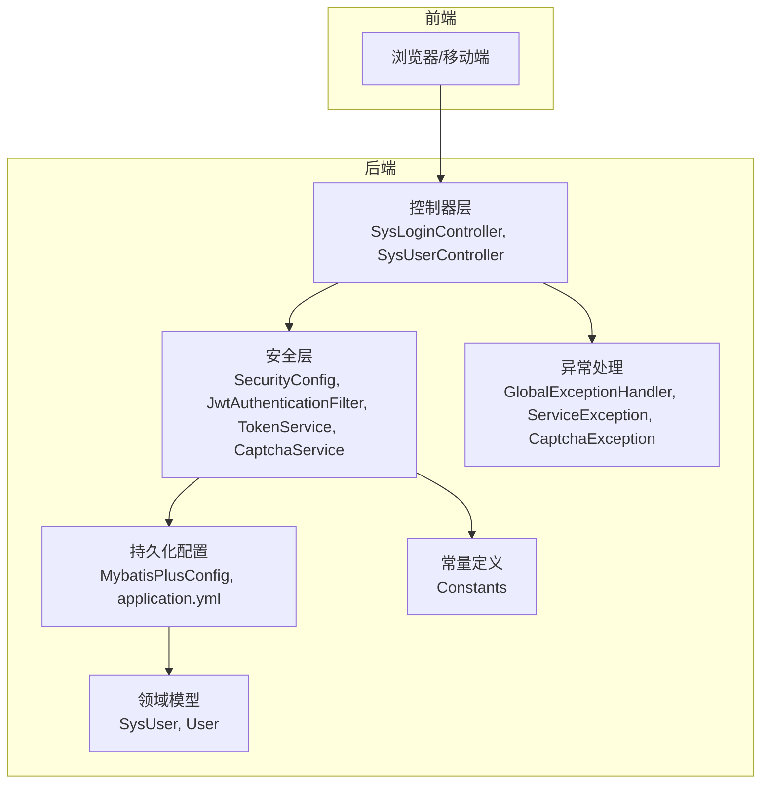
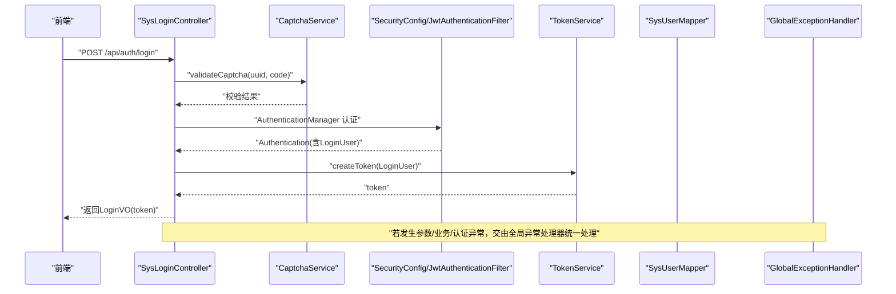
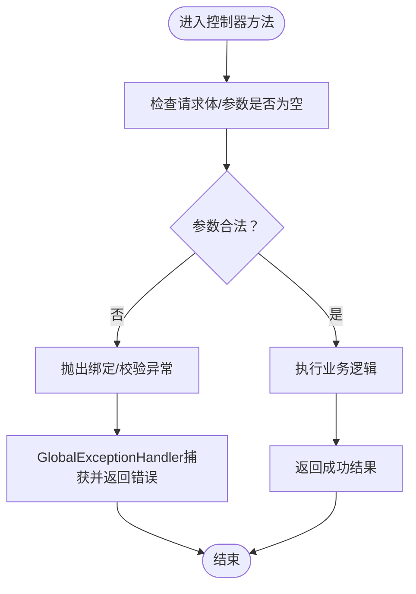
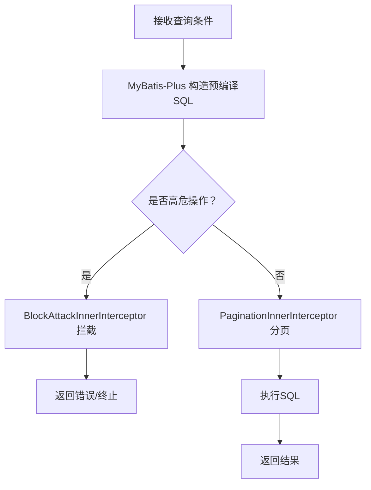
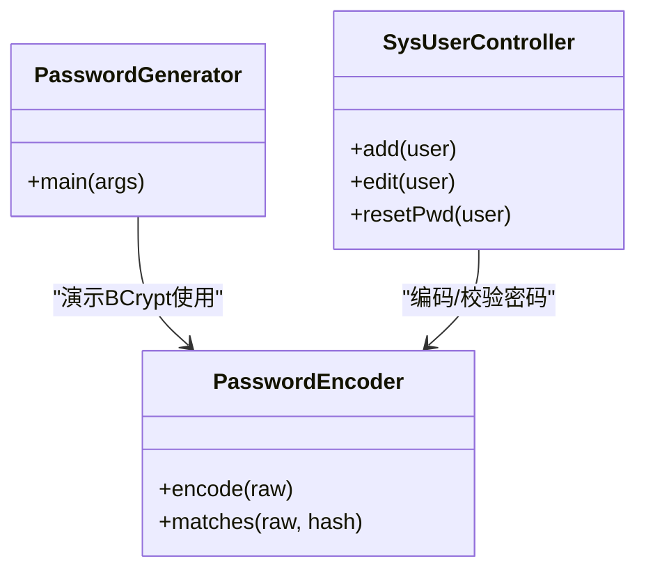
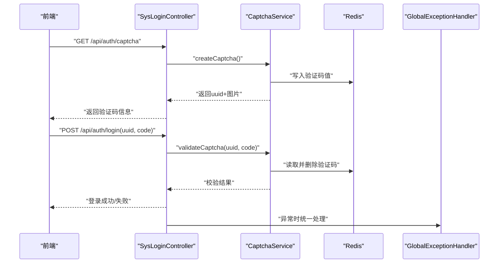
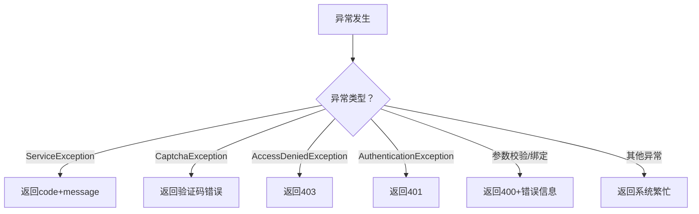

# 输入安全

<cite>
**本文引用的文件**
- [GlobalExceptionHandler.java](file://task-manager-backend/src/main/java/com/taskmanager/common/exception/GlobalExceptionHandler.java)
- [ServiceException.java](file://task-manager-backend/src/main/java/com/taskmanager/common/exception/ServiceException.java)
- [CaptchaException.java](file://task-manager-backend/src/main/java/com/taskmanager/common/exception/CaptchaException.java)
- [SysLoginController.java](file://task-manager-backend/src/main/java/com/taskmanager/controller/SysLoginController.java)
- [SysUserController.java](file://task-manager-backend/src/main/java/com/taskmanager/controller/SysUserController.java)
- [SecurityConfig.java](file://task-manager-backend/src/main/java/com/taskmanager/config/SecurityConfig.java)
- [JwtAuthenticationFilter.java](file://task-manager-backend/src/main/java/com/taskmanager/security/JwtAuthenticationFilter.java)
- [TokenService.java](file://task-manager-backend/src/main/java/com/taskmanager/security/TokenService.java)
- [CaptchaService.java](file://task-manager-backend/src/main/java/com/taskmanager/security/CaptchaService.java)
- [MybatisPlusConfig.java](file://task-manager-backend/src/main/java/com/taskmanager/config/MybatisPlusConfig.java)
- [application.yml](file://task-manager-backend/src/main/resources/application.yml)
- [Constants.java](file://task-manager-backend/src/main/java/com/taskmanager/common/constant/Constants.java)
- [SysUser.java](file://task-manager-backend/src/main/java/com/taskmanager/domain/SysUser.java)
- [User.java](file://task-manager-backend/src/main/java/com/taskmanager/entity/User.java)
- [PasswordGenerator.java](file://task-manager-backend/src/main/java/com/taskmanager/util/PasswordGenerator.java)
</cite>

## 目录
1. [引言](#引言)
2. [项目结构](#项目结构)
3. [核心组件](#核心组件)
4. [架构总览](#架构总览)
5. [详细组件分析](#详细组件分析)
6. [依赖分析](#依赖分析)
7. [性能考量](#性能考量)
8. [故障排查指南](#故障排查指南)
9. [结论](#结论)
10. [附录](#附录)

## 引言
本文件聚焦于CodeBuddy任务管理系统的输入安全防护，围绕参数验证、SQL注入、XSS、CSRF、密码安全、全局异常处理等维度进行系统性梳理，并结合实际代码实现给出可操作的最佳实践与风险缓解建议。

## 项目结构
后端采用Spring Boot + MyBatis-Plus架构，安全层基于Spring Security + JWT，数据库访问通过MyBatis-Plus实现。前端为独立工程，后端提供REST API并通过CORS允许本地开发环境跨域访问。

图表来源
- [SysLoginController.java:31-327](file://task-manager-backend/src/main/java/com/taskmanager/controller/SysLoginController.java#L31-L327)
- [SysUserController.java:20-132](file://task-manager-backend/src/main/java/com/taskmanager/controller/SysUserController.java#L20-L132)
- [SecurityConfig.java:31-116](file://task-manager-backend/src/main/java/com/taskmanager/config/SecurityConfig.java#L31-L116)
- [JwtAuthenticationFilter.java:22-70](file://task-manager-backend/src/main/java/com/taskmanager/security/JwtAuthenticationFilter.java#L22-L70)
- [TokenService.java:18-89](file://task-manager-backend/src/main/java/com/taskmanager/security/TokenService.java#L18-L89)
- [CaptchaService.java:25-129](file://task-manager-backend/src/main/java/com/taskmanager/security/CaptchaService.java#L25-L129)
- [GlobalExceptionHandler.java:23-109](file://task-manager-backend/src/main/java/com/taskmanager/common/exception/GlobalExceptionHandler.java#L23-L109)
- [MybatisPlusConfig.java:16-32](file://task-manager-backend/src/main/java/com/taskmanager/config/MybatisPlusConfig.java#L16-L32)
- [application.yml:1-79](file://task-manager-backend/src/main/resources/application.yml#L1-L79)
- [Constants.java:8-40](file://task-manager-backend/src/main/java/com/taskmanager/common/constant/Constants.java#L8-L40)
- [SysUser.java:16-80](file://task-manager-backend/src/main/java/com/taskmanager/domain/SysUser.java#L16-L80)
- [User.java:11-31](file://task-manager-backend/src/main/java/com/taskmanager/entity/User.java#L11-L31)

章节来源
- [application.yml:1-79](file://task-manager-backend/src/main/resources/application.yml#L1-L79)

## 核心组件
- 全局异常处理：统一拦截业务异常、参数校验异常、认证/权限异常、验证码异常等，返回标准化结果。
- 安全配置与JWT：禁用CSRF（前后端分离），基于Token无状态会话，认证入口点与权限拒绝处理。
- 参数验证与绑定：控制器层对关键入参进行显式校验，结合全局异常处理统一反馈。
- MyBatis-Plus安全：分页与防全表更新/删除插件，避免高危SQL风险。
- 密码安全：BCrypt编码器、密码强度提示、默认密码重置策略。
- 验证码：图形验证码生成与Redis存储校验，防止暴力破解。

章节来源
- [GlobalExceptionHandler.java:23-109](file://task-manager-backend/src/main/java/com/taskmanager/common/exception/GlobalExceptionHandler.java#L23-L109)
- [SecurityConfig.java:31-116](file://task-manager-backend/src/main/java/com/taskmanager/config/SecurityConfig.java#L31-L116)
- [JwtAuthenticationFilter.java:22-70](file://task-manager-backend/src/main/java/com/taskmanager/security/JwtAuthenticationFilter.java#L22-L70)
- [TokenService.java:18-89](file://task-manager-backend/src/main/java/com/taskmanager/security/TokenService.java#L18-L89)
- [CaptchaService.java:25-129](file://task-manager-backend/src/main/java/com/taskmanager/security/CaptchaService.java#L25-L129)
- [MybatisPlusConfig.java:16-32](file://task-manager-backend/src/main/java/com/taskmanager/config/MybatisPlusConfig.java#L16-L32)
- [SysLoginController.java:62-90](file://task-manager-backend/src/main/java/com/taskmanager/controller/SysLoginController.java#L62-L90)
- [SysUserController.java:62-89](file://task-manager-backend/src/main/java/com/taskmanager/controller/SysUserController.java#L62-L89)

## 架构总览
下图展示登录与认证流程中的输入安全要点：参数校验、验证码校验、JWT签发与续期、异常统一处理。

图表来源
- [SysLoginController.java:103-135](file://task-manager-backend/src/main/java/com/taskmanager/controller/SysLoginController.java#L103-L135)
- [CaptchaService.java:96-112](file://task-manager-backend/src/main/java/com/taskmanager/security/CaptchaService.java#L96-L112)
- [SecurityConfig.java:47-97](file://task-manager-backend/src/main/java/com/taskmanager/config/SecurityConfig.java#L47-L97)
- [JwtAuthenticationFilter.java:37-57](file://task-manager-backend/src/main/java/com/taskmanager/security/JwtAuthenticationFilter.java#L37-L57)
- [TokenService.java:34-41](file://task-manager-backend/src/main/java/com/taskmanager/security/TokenService.java#L34-L41)
- [GlobalExceptionHandler.java:27-65](file://task-manager-backend/src/main/java/com/taskmanager/common/exception/GlobalExceptionHandler.java#L27-L65)

## 详细组件分析

### 参数验证与绑定安全
- 控制器层显式校验：注册接口对用户名、密码进行非空校验；登录接口在生产环境启用验证码校验。
- 全局异常处理：捕获参数校验与绑定异常，统一返回标准化错误信息。
- 安全建议：优先使用Spring Validation注解（如@NotBlank、@Pattern）配合@Valid/@Validated；对敏感字段（如密码）避免在日志中输出明文。

图表来源
- [SysLoginController.java:62-90](file://task-manager-backend/src/main/java/com/taskmanager/controller/SysLoginController.java#L62-L90)
- [SysLoginController.java:103-135](file://task-manager-backend/src/main/java/com/taskmanager/controller/SysLoginController.java#L103-L135)
- [GlobalExceptionHandler.java:76-98](file://task-manager-backend/src/main/java/com/taskmanager/common/exception/GlobalExceptionHandler.java#L76-L98)

章节来源
- [SysLoginController.java:62-90](file://task-manager-backend/src/main/java/com/taskmanager/controller/SysLoginController.java#L62-L90)
- [SysLoginController.java:103-135](file://task-manager-backend/src/main/java/com/taskmanager/controller/SysLoginController.java#L103-L135)
- [GlobalExceptionHandler.java:76-98](file://task-manager-backend/src/main/java/com/taskmanager/common/exception/GlobalExceptionHandler.java#L76-L98)

### SQL注入防护
- 预编译与ORM：MyBatis-Plus默认使用预编译Statement，避免拼接SQL导致注入。
- 分页与防全表攻击：启用分页插件与防全表更新/删除插件，限制高危操作。
- 动态SQL参数化：Mapper XML中的动态片段均通过参数传入，未见直接拼接字符串的实现。
- 安全建议：避免原生SQL与字符串拼接；对用户可控的排序/筛选字段进行白名单校验。

图表来源
- [MybatisPlusConfig.java:22-30](file://task-manager-backend/src/main/java/com/taskmanager/config/MybatisPlusConfig.java#L22-L30)
- [SysUserController.java:33-45](file://task-manager-backend/src/main/java/com/taskmanager/controller/SysUserController.java#L33-L45)

章节来源
- [MybatisPlusConfig.java:16-32](file://task-manager-backend/src/main/java/com/taskmanager/config/MybatisPlusConfig.java#L16-L32)
- [SysUserController.java:33-45](file://task-manager-backend/src/main/java/com/taskmanager/controller/SysUserController.java#L33-L45)

### XSS防护
- 输出层面：后端返回JSON，未见直接拼接HTML；前端负责渲染，建议在前端对不可信内容进行HTML转义或使用安全渲染框架。
- 内容安全策略（CSP）：当前未在后端配置CSP响应头；可在网关或反向代理层统一添加。
- 富文本编辑器：如需富文本，建议在前端引入白名单过滤库（如DOMPurify），后端仅接收清洗后的HTML片段。

章节来源
- [SysUserController.java:62-89](file://task-manager-backend/src/main/java/com/taskmanager/controller/SysUserController.java#L62-L89)

### CSRF防护
- CSRF禁用：前后端分离场景下禁用CSRF，使用Token认证替代。
- Token安全：JWT通过配置项控制头部与前缀，建议配合HTTPS与HttpOnly策略（当前未见HttpOnly设置）。
- 建议：在Cookie层设置SameSite=Strict/Lax，限制跨站携带；确保仅通过HTTPS传输。

章节来源
- [SecurityConfig.java:52-53](file://task-manager-backend/src/main/java/com/taskmanager/config/SecurityConfig.java#L52-L53)
- [application.yml:51-57](file://task-manager-backend/src/main/resources/application.yml#L51-L57)

### 密码安全处理
- 编码器：使用BCryptPasswordEncoder进行密码编码，强度参数默认。
- 生成器工具：提供PasswordGenerator示例，便于测试与运维生成哈希。
- 重置策略：提供默认重置密码接口，建议配合“首次登录强制修改”策略。
- 安全建议：禁止明文存储；对密码强度进行前端提示与后端校验；定期轮换密钥。

图表来源
- [PasswordGenerator.java:1-15](file://task-manager-backend/src/main/java/com/taskmanager/util/PasswordGenerator.java#L1-L15)
- [SysUserController.java:62-89](file://task-manager-backend/src/main/java/com/taskmanager/controller/SysUserController.java#L62-L89)

章节来源
- [PasswordGenerator.java:1-15](file://task-manager-backend/src/main/java/com/taskmanager/util/PasswordGenerator.java#L1-L15)
- [SysUserController.java:62-89](file://task-manager-backend/src/main/java/com/taskmanager/controller/SysUserController.java#L62-L89)

### 验证码与暴力破解防护
- 图形验证码：生成随机码并以Base64形式返回，验证码值存入Redis并设置过期时间。
- 校验流程：严格区分大小写，校验失败抛出CaptchaException，统一由全局异常处理。
- 登录策略：生产环境强制开启验证码，降低暴力破解风险。

图表来源
- [SysLoginController.java:95-113](file://task-manager-backend/src/main/java/com/taskmanager/controller/SysLoginController.java#L95-L113)
- [CaptchaService.java:39-50](file://task-manager-backend/src/main/java/com/taskmanager/security/CaptchaService.java#L39-L50)
- [CaptchaService.java:96-112](file://task-manager-backend/src/main/java/com/taskmanager/security/CaptchaService.java#L96-L112)
- [Constants.java:22-29](file://task-manager-backend/src/main/java/com/taskmanager/common/constant/Constants.java#L22-L29)
- [GlobalExceptionHandler.java:36-43](file://task-manager-backend/src/main/java/com/taskmanager/common/exception/GlobalExceptionHandler.java#L36-L43)

章节来源
- [SysLoginController.java:95-113](file://task-manager-backend/src/main/java/com/taskmanager/controller/SysLoginController.java#L95-L113)
- [CaptchaService.java:39-50](file://task-manager-backend/src/main/java/com/taskmanager/security/CaptchaService.java#L39-L50)
- [CaptchaService.java:96-112](file://task-manager-backend/src/main/java/com/taskmanager/security/CaptchaService.java#L96-L112)
- [Constants.java:22-29](file://task-manager-backend/src/main/java/com/taskmanager/common/constant/Constants.java#L22-L29)
- [GlobalExceptionHandler.java:36-43](file://task-manager-backend/src/main/java/com/taskmanager/common/exception/GlobalExceptionHandler.java#L36-L43)

### 全局异常处理机制
- 业务异常：ServiceException携带自定义code与message，统一返回。
- 验证码异常：CaptchaException专门处理验证码相关错误。
- 认证/权限异常：分别返回401/403并输出标准结果。
- 参数异常：MethodArgumentNotValidException与BindException统一处理。
- 兜底异常：未捕获异常统一返回系统繁忙提示。

图表来源
- [GlobalExceptionHandler.java:27-107](file://task-manager-backend/src/main/java/com/taskmanager/common/exception/GlobalExceptionHandler.java#L27-L107)
- [ServiceException.java:10-35](file://task-manager-backend/src/main/java/com/taskmanager/common/exception/ServiceException.java#L10-L35)
- [CaptchaException.java:8-16](file://task-manager-backend/src/main/java/com/taskmanager/common/exception/CaptchaException.java#L8-L16)

章节来源
- [GlobalExceptionHandler.java:27-107](file://task-manager-backend/src/main/java/com/taskmanager/common/exception/GlobalExceptionHandler.java#L27-L107)
- [ServiceException.java:10-35](file://task-manager-backend/src/main/java/com/taskmanager/common/exception/ServiceException.java#L10-L35)
- [CaptchaException.java:8-16](file://task-manager-backend/src/main/java/com/taskmanager/common/exception/CaptchaException.java#L8-L16)

## 依赖分析
- 控制器依赖安全组件：SysLoginController依赖CaptchaService、TokenService与SecurityConfig提供的认证管理器。
- 安全组件依赖配置：JwtAuthenticationFilter依赖TokenService与配置项；SecurityConfig依赖ObjectMapper与JwtAuthenticationFilter。
- 持久化依赖：MyBatis-Plus配置依赖数据库连接与逻辑删除字段；SysUserController依赖SysUserMapper。
- 常量与配置：Constants集中管理Redis键前缀与过期时间；application.yml集中管理JWT、数据源与MyBatis-Plus配置。

```mermaid
graph LR
CTRL["SysLoginController"] --> CAP["CaptchaService"]
CTRL --> TOK["TokenService"]
CTRL --> SEC["SecurityConfig"]
SEC --> JAF["JwtAuthenticationFilter"]
TOK --> REDIS["RedisTemplate"]
CTRL --> MAP["SysUserMapper"]
MAP --> MP["MyBatis-Plus"]
CTRL --> EX["GlobalExceptionHandler"]
CONST["Constants"] --> CAP
CONST --> TOK
CFG["application.yml"] --> SEC
CFG --> TOK
CFG --> MP
```

图表来源
- [SysLoginController.java:35-57](file://task-manager-backend/src/main/java/com/taskmanager/controller/SysLoginController.java#L35-L57)
- [SecurityConfig.java:36-42](file://task-manager-backend/src/main/java/com/taskmanager/config/SecurityConfig.java#L36-L42)
- [JwtAuthenticationFilter.java:31-35](file://task-manager-backend/src/main/java/com/taskmanager/security/JwtAuthenticationFilter.java#L31-L35)
- [TokenService.java:25-26](file://task-manager-backend/src/main/java/com/taskmanager/security/TokenService.java#L25-L26)
- [CaptchaService.java:33-34](file://task-manager-backend/src/main/java/com/taskmanager/security/CaptchaService.java#L33-L34)
- [MybatisPlusConfig.java:22-30](file://task-manager-backend/src/main/java/com/taskmanager/config/MybatisPlusConfig.java#L22-L30)
- [Constants.java:22-34](file://task-manager-backend/src/main/java/com/taskmanager/common/constant/Constants.java#L22-L34)
- [application.yml:51-57](file://task-manager-backend/src/main/resources/application.yml#L51-L57)

章节来源
- [SysLoginController.java:35-57](file://task-manager-backend/src/main/java/com/taskmanager/controller/SysLoginController.java#L35-L57)
- [SecurityConfig.java:36-42](file://task-manager-backend/src/main/java/com/taskmanager/config/SecurityConfig.java#L36-L42)
- [TokenService.java:25-26](file://task-manager-backend/src/main/java/com/taskmanager/security/TokenService.java#L25-L26)
- [CaptchaService.java:33-34](file://task-manager-backend/src/main/java/com/taskmanager/security/CaptchaService.java#L33-L34)
- [MybatisPlusConfig.java:22-30](file://task-manager-backend/src/main/java/com/taskmanager/config/MybatisPlusConfig.java#L22-L30)
- [Constants.java:22-34](file://task-manager-backend/src/main/java/com/taskmanager/common/constant/Constants.java#L22-L34)
- [application.yml:51-57](file://task-manager-backend/src/main/resources/application.yml#L51-L57)

## 性能考量
- Redis热点：验证码与登录Token频繁读写，建议优化键命名与过期策略，避免内存膨胀。
- 分页与高并发：MyBatis-Plus分页插件与防全表攻击插件在高并发下表现稳定，注意数据库索引设计。
- 日志与调试：登录调试日志可能暴露敏感信息，建议在生产关闭或脱敏。

## 故障排查指南
- 登录失败/401：检查JWT头部与前缀配置、Token是否过期、Redis是否可用。
- 验证码错误/过期：确认uuid正确、Redis中验证码是否存在且未过期。
- 参数校验失败/400：检查请求体字段是否符合预期，关注全局异常返回的具体字段提示。
- 权限不足/403：确认用户角色与权限集合，检查@PreAuthorize注解配置。
- 系统繁忙：查看全局异常兜底日志，定位未捕获异常来源。

章节来源
- [GlobalExceptionHandler.java:27-107](file://task-manager-backend/src/main/java/com/taskmanager/common/exception/GlobalExceptionHandler.java#L27-L107)
- [CaptchaService.java:96-112](file://task-manager-backend/src/main/java/com/taskmanager/security/CaptchaService.java#L96-L112)
- [TokenService.java:49-62](file://task-manager-backend/src/main/java/com/taskmanager/security/TokenService.java#L49-L62)
- [application.yml:51-57](file://task-manager-backend/src/main/resources/application.yml#L51-L57)

## 结论
本项目在输入安全方面采取了较为完善的措施：参数显式校验与全局异常统一处理、基于JWT的无状态认证、MyBatis-Plus的预编译与安全插件、Redis存储验证码与Token、以及BCrypt密码编码。建议在现有基础上补充CSP、Cookie SameSite与HttpOnly策略、前端HTML转义与富文本白名单过滤，进一步提升整体安全性。

## 附录
- 最佳实践清单
  - 参数验证：优先使用Spring Validation注解，控制器层做边界校验。
  - SQL安全：坚持ORM与参数化查询，避免原生SQL拼接；启用分页与防全表攻击插件。
  - XSS：前端渲染时进行HTML转义；富文本使用白名单过滤。
  - CSRF：前后端分离场景禁用CSRF，使用Token认证；建议设置Cookie SameSite与HttpOnly。
  - 密码：统一BCrypt编码；默认密码重置后强制修改；定期轮换密钥。
  - 异常：统一异常处理，避免泄露内部细节；对敏感字段脱敏。