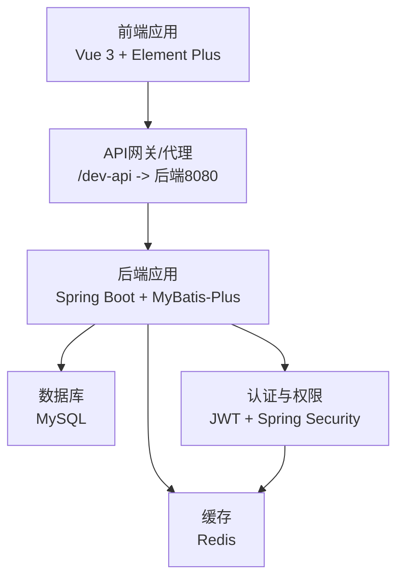
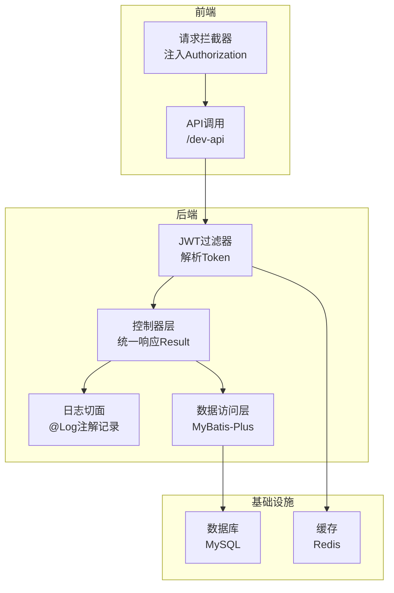
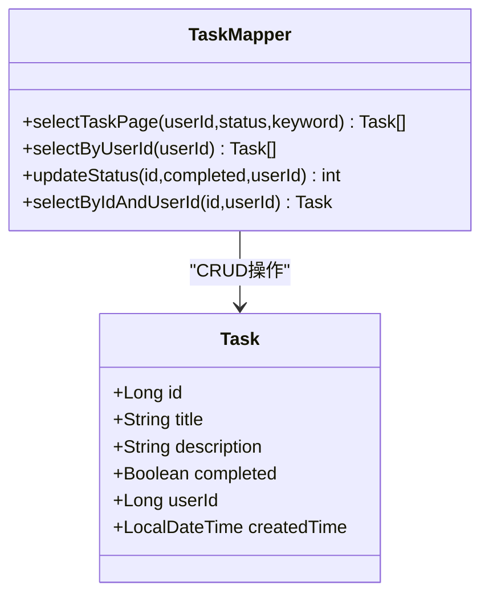
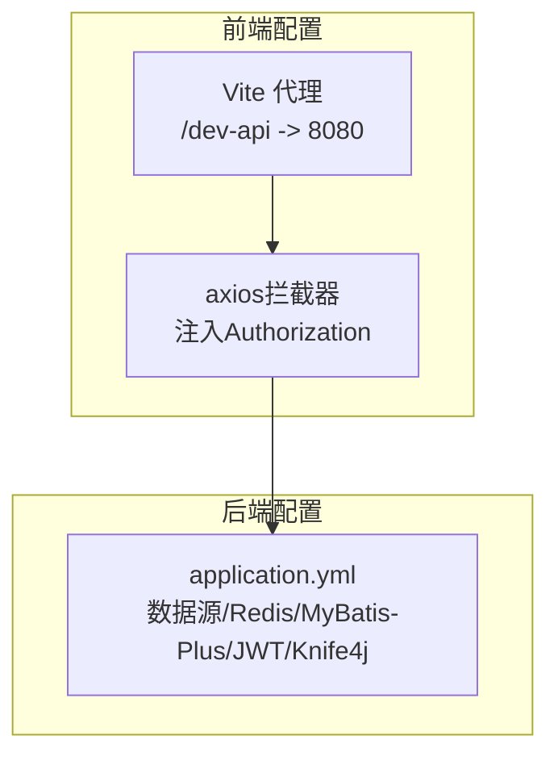

# 团队协作规范

<cite>
**本文引用的文件**
- [CODEBUDDY.md](file://CODEBUDDY.md)
- [Task.java](file://task-manager-backend/src/main/java/com/taskmanager/entity/Task.java)
- [TaskMapper.java](file://task-manager-backend/src/main/java/com/taskmanager/mapper/TaskMapper.java)
- [SysUser.java](file://task-manager-backend/src/main/java/com/taskmanager/domain/SysUser.java)
- [application.yml](file://task-manager-backend/src/main/resources/application.yml)
- [schema.sql](file://task-manager-backend/src/main/resources/schema.sql)
- [SysUserController.java](file://task-manager-backend/src/main/java/com/taskmanager/controller/SysUserController.java)
- [JwtAuthenticationFilter.java](file://task-manager-backend/src/main/java/com/taskmanager/security/JwtAuthenticationFilter.java)
- [LogAspect.java](file://task-manager-backend/src/main/java/com/taskmanager/aspect/LogAspect.java)
- [request.js](file://task-manager-frontend/src/api/request.js)
- [auth.js](file://task-manager-frontend/src/utils/auth.js)
- [index.js](file://task-manager-frontend/src/router/index.js)
- [ruoyi-style-admin-system_350b4ed7.md](file://.codebuddy/plans/ruoyi-style-admin-system_350b4ed7.md)
- [极简任务管理系统技术方案_d2e6454f(未完成).md](file://.codebuddy/plans/极简任务管理系统技术方案_d2e6454f(未完成).md)
</cite>

## 目录
1. [引言](#引言)
2. [项目结构](#项目结构)
3. [核心组件](#核心组件)
4. [架构总览](#架构总览)
5. [详细组件分析](#详细组件分析)
6. [依赖分析](#依赖分析)
7. [性能考量](#性能考量)
8. [故障排查指南](#故障排查指南)
9. [结论](#结论)
10. [附录](#附录)

## 引言
本规范面向CodeBuddy任务管理系统团队，围绕任务分配机制、沟通协调流程、代码审查流程、知识共享机制、冲突解决机制、团队绩效评估与个人成长路径、协作工具最佳实践等方面，结合现有代码库的架构与实现，制定可落地的团队协作标准与流程，提升交付质量与协作效率。

## 项目结构
系统采用前后端分离架构，后端为Spring Boot + MyBatis-Plus + Spring Security + Redis + MySQL，前端为Vue 3 + Element Plus + Pinia + Vue Router。核心模块包括：
- 后端分层：controller/、domain/、mapper/、common/、config/、security/、aspect/
- 前端分层：api/、views/、router/、store/、utils/、layout/

图表来源
- [CODEBUDDY.md:40-79](file://CODEBUDDY.md#L40-L79)
- [application.yml:1-79](file://task-manager-backend/src/main/resources/application.yml#L1-L79)

章节来源
- [CODEBUDDY.md:40-79](file://CODEBUDDY.md#L40-L79)
- [application.yml:1-79](file://task-manager-backend/src/main/resources/application.yml#L1-L79)

## 核心组件
- 任务实体与数据访问：Task实体、TaskMapper提供分页查询、按用户查询、状态更新、按ID+用户查询等能力，支撑任务列表与状态管理。
- 用户与权限：SysUser实体承载用户信息；JwtAuthenticationFilter负责从请求头提取Token并解析用户信息；LogAspect提供操作日志记录。
- 前端交互：request.js封装axios拦截器，自动注入Authorization头并统一处理401；router/index.js定义静态路由与登录/404等基础路由。
- 配置与约定：application.yml集中配置数据源、Redis、MyBatis-Plus、JWT、Knife4j文档；schema.sql定义系统表结构与初始数据。

章节来源
- [Task.java:1-50](file://task-manager-backend/src/main/java/com/taskmanager/entity/Task.java#L1-L50)
- [TaskMapper.java:1-57](file://task-manager-backend/src/main/java/com/taskmanager/mapper/TaskMapper.java#L1-L57)
- [SysUser.java:1-80](file://task-manager-backend/src/main/java/com/taskmanager/domain/SysUser.java#L1-L80)
- [JwtAuthenticationFilter.java:1-70](file://task-manager-backend/src/main/java/com/taskmanager/security/JwtAuthenticationFilter.java#L1-L70)
- [LogAspect.java:1-137](file://task-manager-backend/src/main/java/com/taskmanager/aspect/LogAspect.java#L1-L137)
- [request.js:1-63](file://task-manager-frontend/src/api/request.js#L1-L63)
- [index.js:1-32](file://task-manager-frontend/src/router/index.js#L1-L32)
- [application.yml:1-79](file://task-manager-backend/src/main/resources/application.yml#L1-L79)
- [schema.sql:1-608](file://task-manager-backend/src/main/resources/schema.sql#L1-L608)

## 架构总览
系统遵循“统一响应格式”“分页封装”“逻辑删除”“权限控制”“操作日志”的核心机制。后端通过Security过滤器链与JWT实现认证，通过AOP切面记录操作日志；前端通过axios拦截器统一注入Token并处理错误。

图表来源
- [CODEBUDDY.md:61-68](file://CODEBUDDY.md#L61-L68)
- [JwtAuthenticationFilter.java:37-57](file://task-manager-backend/src/main/java/com/taskmanager/security/JwtAuthenticationFilter.java#L37-L57)
- [LogAspect.java:44-97](file://task-manager-backend/src/main/java/com/taskmanager/aspect/LogAspect.java#L44-L97)
- [request.js:10-20](file://task-manager-frontend/src/api/request.js#L10-L20)

章节来源
- [CODEBUDDY.md:61-68](file://CODEBUDDY.md#L61-L68)
- [JwtAuthenticationFilter.java:37-57](file://task-manager-backend/src/main/java/com/taskmanager/security/JwtAuthenticationFilter.java#L37-L57)
- [LogAspect.java:44-97](file://task-manager-backend/src/main/java/com/taskmanager/aspect/LogAspect.java#L44-L97)
- [request.js:10-20](file://task-manager-frontend/src/api/request.js#L10-L20)

## 详细组件分析

### 任务分配与进度跟踪机制
- 任务分解：以Task实体为核心，包含标题、描述、完成状态、所属用户ID、创建时间等字段，支持按用户维度隔离数据。
- 优先级排序：当前实体未内置优先级字段，可在不影响既有接口的前提下扩展字段并在前端以视觉化标签呈现。
- 责任明确：userId字段确保任务归属，后端通过Mapper按userId查询与更新，避免越权。
- 进度跟踪：completed布尔字段记录完成状态；TaskMapper提供按状态筛选与分页查询，便于看板可视化。

图表来源
- [Task.java:10-49](file://task-manager-backend/src/main/java/com/taskmanager/entity/Task.java#L10-L49)
- [TaskMapper.java:13-56](file://task-manager-backend/src/main/java/com/taskmanager/mapper/TaskMapper.java#L13-L56)

章节来源
- [Task.java:10-49](file://task-manager-backend/src/main/java/com/taskmanager/entity/Task.java#L10-L49)
- [TaskMapper.java:13-56](file://task-manager-backend/src/main/java/com/taskmanager/mapper/TaskMapper.java#L13-L56)

### 沟通协调流程
- 每日站会：建议采用“站立式短会”，聚焦昨日进展、今日计划、阻塞问题，使用看板（如Jira/Notion）同步任务状态。
- 迭代回顾：每轮迭代结束后进行复盘，沉淀经验与改进点，形成可复用的知识资产。
- 需求讨论：需求评审采用“用户故事+验收标准”，确保前后端对齐；评审记录归档至知识库。
- 技术分享会：定期组织主题分享（架构演进、新技术、安全与性能优化），鼓励提问与实操演示。

### 代码审查流程
- PR创建规范：分支命名清晰（feature/xxx、bugfix/xxx、docs/xxx），提交信息遵循约定式提交；PR模板包含变更摘要、影响范围、测试要点、风险评估。
- 审查清单：代码风格、安全性（SQL注入、XSS、鉴权）、性能（复杂度、缓存命中）、可测试性（单元测试覆盖率）、兼容性（前后端协议）。
- 反馈处理：审查意见闭环管理，逐条回复与修订；必要时进行口头澄清与二次审查。
- 问题修复与重新审查：修复完成后在原PR补充提交，触发CI检查，审查者进行回归审查。

### 知识共享机制
- 文档维护：统一存放于知识库，按模块分类（设计、接口、部署、运维），版本化管理，链接到具体PR与Issue。
- 技术博客：鼓励团队成员撰写技术文章，沉淀最佳实践与踩坑记录，纳入月度回顾与分享会。
- 培训计划：新员工入职培训包含技术栈、开发规范、工具使用；定期组织专项培训（安全、性能、架构）。
- 导师制度：为新成员配备导师，提供一对一指导与结对编程机会，加速融入与成长。

### 冲突解决机制
- 分歧处理：优先通过数据与事实进行讨论，必要时引入第三方视角；记录讨论过程与决策依据。
- 决策流程：小范围变更由责任人拍板；重大变更经小组评审并形成决议文档。
- 升级通道：无法达成一致时，提请技术负责人或架构师仲裁，形成最终决策并公开透明。

### 团队绩效评估与个人成长
- 团队绩效指标：需求按时交付率、缺陷密度、平均修复时间、代码审查通过率、文档完善度、知识分享频次。
- 个人成长计划：结合岗位画像制定季度目标，覆盖技术深度、广度与软技能；定期进行360度反馈与自评。
- 技能发展路径：初级工程师→高级工程师→技术专家→架构师，配套能力矩阵与学习资源包。

### 协作工具使用指南与最佳实践
- 版本控制：分支策略采用Git Flow，主分支受保护，合并前必须通过CI与审查。
- 任务看板：Jira/Notion用于需求与任务管理，每日站会同步状态，看板可视化流转。
- 文档协作：Confluence/Wiki用于文档协作，模板化与版本化管理。
- 消息沟通：企业微信/钉钉用于日常沟通，重要决策与会议纪要沉淀至知识库。
- 代码质量：SonarQube持续集成扫描，覆盖率阈值与告警处理纳入CI流程。

## 依赖分析
后端通过application.yml集中配置数据源、Redis、MyBatis-Plus、JWT与Knife4j；前端通过Vite代理/dev-api到后端8080端口，axios拦截器统一注入Authorization头。

图表来源
- [application.yml:1-79](file://task-manager-backend/src/main/resources/application.yml#L1-L79)
- [CODEBUDDY.md:104-106](file://CODEBUDDY.md#L104-L106)
- [request.js:5-20](file://task-manager-frontend/src/api/request.js#L5-L20)

章节来源
- [application.yml:1-79](file://task-manager-backend/src/main/resources/application.yml#L1-L79)
- [CODEBUDDY.md:104-106](file://CODEBUDDY.md#L104-L106)
- [request.js:5-20](file://task-manager-frontend/src/api/request.js#L5-L20)

## 性能考量
- 数据库层面：为task表user_id与status字段建立索引，减少分页查询成本；逻辑删除避免大表物理删除带来的锁竞争。
- 缓存与鉴权：JWT Token存储于Redis，请求时自动续期，降低鉴权成本；注意Redis容量与过期策略。
- 日志与可观测性：通过LogAspect记录操作日志，结合业务类型与耗时统计，辅助性能分析与问题定位。
- 前端体验：axios拦截器统一处理401跳转，避免重复错误提示；分页查询减少一次性数据传输压力。

## 故障排查指南
- 认证失败（401）：检查前端localStorage中的Token是否存在与格式正确；核对后端JWT过滤器是否正确解析；确认Redis中Token是否过期。
- 权限不足：确认用户角色与菜单权限配置；检查@PreAuthorize注解是否正确；核对菜单权限字符串与按钮权限标识。
- 操作日志异常：关注LogAspect写入失败的日志警告；检查sys_oper_log表结构与字段长度限制。
- 数据不一致：确认逻辑删除字段delFlag的使用；核对TaskMapper按userId的查询与更新逻辑。

章节来源
- [JwtAuthenticationFilter.java:37-57](file://task-manager-backend/src/main/java/com/taskmanager/security/JwtAuthenticationFilter.java#L37-L57)
- [LogAspect.java:88-96](file://task-manager-backend/src/main/java/com/taskmanager/aspect/LogAspect.java#L88-L96)
- [SysUserController.java:33-130](file://task-manager-backend/src/main/java/com/taskmanager/controller/SysUserController.java#L33-L130)

## 结论
本规范以现有代码库为基础，结合统一响应、权限控制、操作日志与前后端代理等机制，提出任务分配、沟通协调、代码审查、知识共享、冲突解决、绩效评估与工具使用的协作标准。建议团队在实践中持续优化流程与工具，推动交付质量与协作效率双提升。

## 附录
- 术语说明：统一响应Result<T>、逻辑删除、权限控制、操作日志、JWT认证、分页封装。
- 参考资料：系统架构与分层说明、API路由约定、前端代理配置、数据库表结构与初始化数据。

章节来源
- [CODEBUDDY.md:40-115](file://CODEBUDDY.md#L40-L115)
- [schema.sql:1-608](file://task-manager-backend/src/main/resources/schema.sql#L1-L608)
- [极简任务管理系统技术方案_d2e6454f(未完成).md:130-211](file://.codebuddy/plans/极简任务管理系统技术方案_d2e6454f(未完成).md#L130-L211)
- [ruoyi-style-admin-system_350b4ed7.md:590-602](file://.codebuddy/plans/ruoyi-style-admin-system_350b4ed7.md#L590-L602)