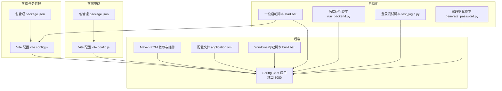
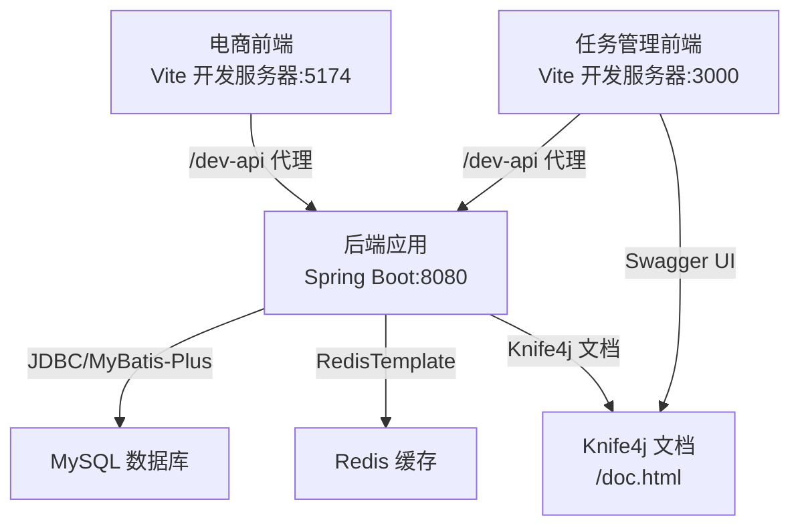
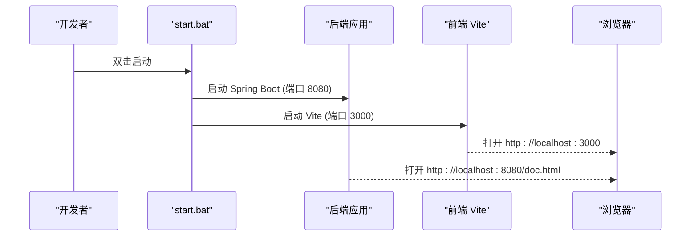
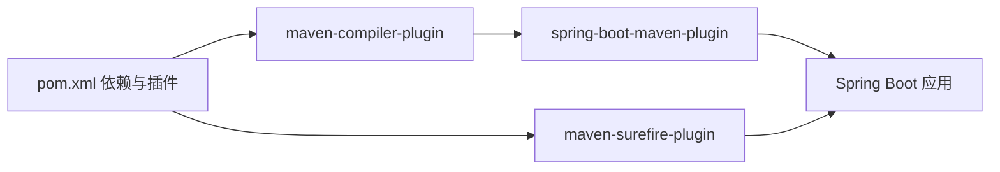

# 开发工具配置

<cite>
**本文引用的文件**
- [pom.xml](file://task-manager-backend/pom.xml)
- [application.yml](file://task-manager-backend/src/main/resources/application.yml)
- [build.bat](file://task-manager-backend/build.bat)
- [run_backend.py](file://run_backend.py)
- [test_login.py](file://test_login.py)
- [generate_password.py](file://generate_password.py)
- [CODEBUDDY.md](file://CODEBUDDY.md)
- [package.json（任务管理前端）](file://task-manager-frontend/package.json)
- [vite.config.js（任务管理前端）](file://task-manager-frontend/vite.config.js)
- [package.json（电商前端）](file://ecommerce-frontend/package.json)
- [vite.config.js（电商前端）](file://ecommerce-frontend/vite.config.js)
- [start.bat](file://start.bat)
</cite>

## 目录
1. [简介](#简介)
2. [项目结构](#项目结构)
3. [核心组件](#核心组件)
4. [架构总览](#架构总览)
5. [详细组件分析](#详细组件分析)
6. [依赖分析](#依赖分析)
7. [性能考虑](#性能考虑)
8. [故障排查指南](#故障排查指南)
9. [结论](#结论)
10. [附录](#附录)

## 简介
本指南面向CodeBuddy任务管理系统，提供一套完整的开发工具配置方案，覆盖IDE推荐配置（IntelliJ IDEA与VS Code）、代码质量工具（SonarQube、SpotBugs、Checkmarx等静态分析工具的配置与集成思路）、调试技巧（远程调试、断点、变量监视、性能分析）、版本控制高级用法（Git rebase、cherry-pick、interactive rebase）、构建工具（Maven、Gradle、Vite）优化与自定义脚本，以及开发环境自动化配置与一键安装方案。内容以仓库现有配置为基础，并给出可落地的实践建议。

## 项目结构
项目采用前后端分离架构：
- 后端（Spring Boot 3.2.0 + Java 17）：位于 task-manager-backend，使用 Maven 管理依赖与构建。
- 前端（Vue 3 + Vite）：位于 task-manager-frontend 与 ecommerce-frontend，分别服务于任务管理与电商场景。
- 通用说明与常用命令：见根目录文档。

图表来源
- [application.yml:1-79](file://task-manager-backend/src/main/resources/application.yml#L1-L79)
- [pom.xml:1-206](file://task-manager-backend/pom.xml#L1-L206)
- [build.bat:1-37](file://task-manager-backend/build.bat#L1-L37)
- [vite.config.js（任务管理前端）:1-28](file://task-manager-frontend/vite.config.js#L1-L28)
- [package.json（任务管理前端）:1-30](file://task-manager-frontend/package.json#L1-L30)
- [vite.config.js（电商前端）:1-24](file://ecommerce-frontend/vite.config.js#L1-L24)
- [package.json（电商前端）:1-25](file://ecommerce-frontend/package.json#L1-L25)
- [start.bat:1-27](file://start.bat#L1-L27)
- [run_backend.py:1-30](file://run_backend.py#L1-L30)
- [test_login.py:1-24](file://test_login.py#L1-L24)
- [generate_password.py:1-12](file://generate_password.py#L1-L12)

章节来源
- [CODEBUDDY.md:1-115](file://CODEBUDDY.md#L1-L115)

## 核心组件
- 后端依赖与构建：Maven POM 定义了 Spring Boot、Web、Security、AOP、Redis、MyBatis-Plus、MySQL、JWT、Knife4j、Lombok、测试等依赖；同时配置了编译器注解处理器、Spring Boot 插件与 Surefire 参数。
- 后端配置：application.yml 提供数据源、Redis、MyBatis-Plus、Jackson、JWT、服务端口、Knife4j 文档分组等关键配置。
- 前端构建：两个 Vite 项目均使用 @vitejs/plugin-vue、Sass、自动导入与组件解析插件；任务管理前端启用代理到后端 8080 端口。
- 自动化脚本：Windows 批处理与 Python 脚本实现一键构建、启动与登录测试，便于本地快速验证。

章节来源
- [pom.xml:1-206](file://task-manager-backend/pom.xml#L1-L206)
- [application.yml:1-79](file://task-manager-backend/src/main/resources/application.yml#L1-L79)
- [package.json（任务管理前端）:1-30](file://task-manager-frontend/package.json#L1-L30)
- [vite.config.js（任务管理前端）:1-28](file://task-manager-frontend/vite.config.js#L1-L28)
- [package.json（电商前端）:1-25](file://ecommerce-frontend/package.json#L1-L25)
- [vite.config.js（电商前端）:1-24](file://ecommerce-frontend/vite.config.js#L1-L24)
- [build.bat:1-37](file://task-manager-backend/build.bat#L1-L37)
- [run_backend.py:1-30](file://run_backend.py#L1-L30)
- [test_login.py:1-24](file://test_login.py#L1-L24)
- [generate_password.py:1-12](file://generate_password.py#L1-L12)
- [start.bat:1-27](file://start.bat#L1-L27)

## 架构总览
下图展示开发阶段的典型交互：前端通过 Vite 代理访问后端 API，后端连接 MySQL 与 Redis，Knife4j 提供在线文档。

图表来源
- [vite.config.js（任务管理前端）:1-28](file://task-manager-frontend/vite.config.js#L1-L28)
- [vite.config.js（电商前端）:1-24](file://ecommerce-frontend/vite.config.js#L1-L24)
- [application.yml:1-79](file://task-manager-backend/src/main/resources/application.yml#L1-L79)
- [CODEBUDDY.md:104-107](file://CODEBUDDY.md#L104-L107)

## 详细组件分析

### IDE 推荐配置（IntelliJ IDEA）
- 插件推荐
  - Lombok：简化实体类与日志等样板代码生成。
  - MyBatis Log Plugin：查看 MyBatis-Spring Boot 执行 SQL。
  - String Manipulation：批量处理字符串。
  - .ignore：忽略不需要纳入版本控制的文件。
  - Rainbow Brackets：彩色括号，提升可读性。
  - Statistic：统计代码行数与变更。
- 主题与字体
  - 推荐深色主题（如 Darcula），搭配等宽字体（如 JetBrains Mono）与字号 12–14。
- 快捷键与模板
  - 使用 Live Template 快速生成常用代码块（如 Getter/Setter、try-catch、log 输出）。
  - 自定义运行配置：为 Spring Boot 应用创建 VM Options（如 JVM 日志输出、GC 参数）。
- 代码风格与检查
  - 使用 .editorconfig 与 IDE 内置检查规则保持一致。
  - 后端开启 Lombok 注解处理器路径，避免编译期警告。

### IDE 推荐配置（VS Code）
- 插件推荐
  - Vue Language Features (Volar)：Vue 3 单文件组件支持。
  - ESLint：统一 JS/TS 代码规范。
  - Prettier：格式化。
  - Debugger for Chrome：前端调试。
  - REST Client：HTTP 请求测试。
  - GitLens：增强 Git 功能。
  - Bracket Pair Colorizer：配对括号高亮。
- 设置同步
  - 使用 settings.json 统一缩进、空格、换行符、保存时格式化等。
- 快捷键与工作区
  - 为常用任务（运行/构建/测试）绑定快捷键。
  - 使用多终端工作区并行运行前后端。

### 代码质量工具配置与集成
- SonarQube
  - 在 CI 中集成 SonarScanner，扫描后端与前端代码覆盖率与质量指标。
  - 配置 quality gate，阻断低质量代码合并。
- SpotBugs（Java）
  - 在 Maven 构建中集成 spotbugs-maven-plugin，生成报告并集成到 CI。
  - 结合 FindBugs/SpotBugs IDE 插件进行本地检查。
- Checkmarx KICS（基础设施即代码）
  - 在 CI 中扫描配置文件（如 Dockerfile、Kubernetes YAML），提前发现安全风险。
- 通用建议
  - 为每个模块配置独立的规则集与阈值。
  - 将质量报告与 PR 评论联动，提高反馈效率。

### 调试技巧
- 远程调试（后端）
  - 在启动参数中添加 JVM 调试选项（如端口、暂停策略），在 IDE 中以 Remote Debug 模式附加进程。
  - 后端默认端口 8080，可配合代理与断点定位问题。
- 断点与变量监视
  - 使用条件断点与日志断点，减少性能影响。
  - 结合 Watch/Expression 视图实时观察关键变量。
- 性能分析
  - 使用 JDK Mission Control/JProfiler 等工具采集火焰图与内存快照。
  - 关注慢查询（MyBatis 日志）、缓存命中率与线程池饱和情况。

### 版本控制高级用法（Git）
- rebase
  - 将分支提交历史线性化，保持提交历史整洁；注意仅对未推送的本地提交执行。
- cherry-pick
  - 选择性地将特定提交应用到当前分支，常用于热修复。
- interactive rebase
  - 合并、重排、编辑或删除提交，适合重构与清理历史。
- 实用建议
  - 与分支保护规则结合，避免破坏主线。
  - 使用 git bisect 快速定位引入问题的提交。

### 构建工具配置与优化
- Maven（后端）
  - 依赖与插件：确保 Lombok 注解处理器路径正确；Spring Boot 插件排除 Lombok；Surefire 传入必要 JVM 参数。
  - 仓库镜像：配置 Maven Central 与阿里云镜像，提升下载速度。
  - Windows 构建：使用 build.bat 自动检测系统 Maven 或 Maven Wrapper 并执行打包。
- Gradle（如需引入）
  - 使用 org.springframework.boot 插件；配置依赖管理与测试框架；启用并行构建与配置缓存。
- Vite（前端）
  - 任务管理前端与电商前端均使用 @vitejs/plugin-vue 与 Sass；配置别名与代理，统一开发体验。
  - 生产构建建议开启压缩、资源内联与分包策略，结合 CDN 与缓存头优化加载性能。

章节来源
- [pom.xml:147-204](file://task-manager-backend/pom.xml#L147-L204)
- [build.bat:1-37](file://task-manager-backend/build.bat#L1-L37)
- [vite.config.js（任务管理前端）:1-28](file://task-manager-frontend/vite.config.js#L1-L28)
- [vite.config.js（电商前端）:1-24](file://ecommerce-frontend/vite.config.js#L1-L24)
- [package.json（任务管理前端）:1-30](file://task-manager-frontend/package.json#L1-L30)
- [package.json（电商前端）:1-25](file://ecommerce-frontend/package.json#L1-L25)

### 自动化与一键安装方案
- 一键启动
  - start.bat：并行启动后端（Spring Boot）与前端（Vite），自动打开浏览器访问后端与文档地址。
- 后端构建与运行
  - run_backend.py：自动切换目录、设置环境变量、调用 mvnw.cmd 打包并启动 JAR。
- 登录测试
  - test_login.py：向后端发起登录请求，验证鉴权流程与返回格式。
- 密码哈希
  - generate_password.py：生成 BCrypt 哈希，便于更新数据库中的用户密码。

图表来源
- [start.bat:1-27](file://start.bat#L1-L27)

章节来源
- [start.bat:1-27](file://start.bat#L1-L27)
- [run_backend.py:1-30](file://run_backend.py#L1-L30)
- [test_login.py:1-24](file://test_login.py#L1-L24)
- [generate_password.py:1-12](file://generate_password.py#L1-L12)

## 依赖分析
- 后端依赖关系
  - Spring Boot Starter Web/Security/AOP/Redis/MyBatis-Plus/MySQL/JWT/Knife4j/Lombok/Test 等。
  - 通过 Spring Boot BOM 管理版本，避免冲突。
- 前端依赖关系
  - Vue 3、Element Plus、Pinia、Vue Router、Axios、Sass、@vitejs/plugin-vue 等。
- 构建与测试
  - Maven 插件链路：maven-compiler-plugin（注解处理器）→ spring-boot-maven-plugin（打包）→ maven-surefire-plugin（测试）。
  - Vite 插件链路：@vitejs/plugin-vue + sass + 自动导入/组件解析插件。

图表来源
- [pom.xml:162-204](file://task-manager-backend/pom.xml#L162-L204)

章节来源
- [pom.xml:32-145](file://task-manager-backend/pom.xml#L32-L145)

## 性能考虑
- 后端
  - 合理配置连接池（HikariCP）与 Redis 连接池参数，避免连接泄漏。
  - 启用逻辑删除与分页查询，减少全表扫描。
  - 使用 Knife4j 文档定位接口性能瓶颈。
- 前端
  - Vite 构建开启压缩与 Tree Shaking；合理拆分包与懒加载页面组件。
  - 代理仅在开发阶段使用，生产环境直连后端域名。
- CI/CD
  - 将静态分析（SonarQube/SpotBugs/Checkmarx）前置到流水线，降低回归成本。

## 故障排查指南
- 启动失败
  - 检查数据库与 Redis 是否正常运行；确认 application.yml 中的连接参数与凭据。
  - 查看后端日志与 Vite 控制台错误信息。
- 代理无效
  - 确认前端 vite.config.js 中代理目标与路径重写规则是否匹配后端实际接口。
- 登录异常
  - 使用 test_login.py 验证登录接口；核对 generate_password.py 生成的 BCrypt 哈希是否正确写入数据库。
- 构建失败
  - 使用 build.bat 或 run_backend.py；若系统未安装 Maven，确保 mvnw.cmd 可用。

章节来源
- [application.yml:1-79](file://task-manager-backend/src/main/resources/application.yml#L1-L79)
- [vite.config.js（任务管理前端）:1-28](file://task-manager-frontend/vite.config.js#L1-L28)
- [test_login.py:1-24](file://test_login.py#L1-L24)
- [generate_password.py:1-12](file://generate_password.py#L1-L12)
- [build.bat:1-37](file://task-manager-backend/build.bat#L1-L37)
- [run_backend.py:1-30](file://run_backend.py#L1-L30)

## 结论
通过本指南，您可以基于现有仓库配置快速搭建高质量的开发环境：在 IDE 中启用必要的插件与模板，在构建工具中完善静态分析与测试流程，在调试与版本控制中采用最佳实践，并借助自动化脚本实现一键启动与验证。建议在团队内统一这些配置，持续演进以适配项目发展。

## 附录
- 常用命令参考（来自根目录文档）
  - 后端：编译打包、运行、测试、跳过测试编译等。
  - 前端：安装依赖、开发模式、生产构建、预览。
- 技术栈与架构要点（来自根目录文档）
  - 后端：Spring Boot 3.2.0 + Java 17 + MyBatis-Plus + Spring Security + Redis + MySQL。
  - 前端：Vue 3 + Vite + Element Plus + Pinia + Vue Router 4。
  - 核心机制：统一响应、分页封装、逻辑删除、权限控制、操作日志。
  - 数据库核心表：用户、角色、菜单、部门、操作日志等。
  - API 路由约定：认证接口公开、系统模块需认证、Knife4j 文档入口。

章节来源
- [CODEBUDDY.md:3-115](file://CODEBUDDY.md#L3-L115)