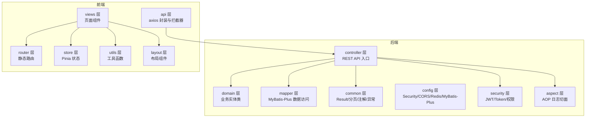
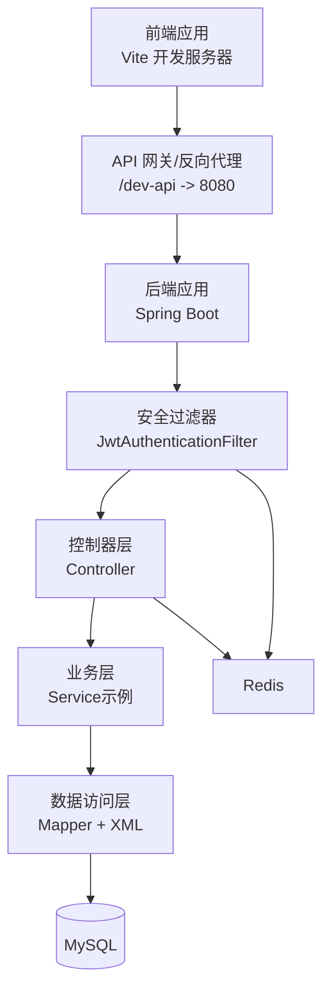
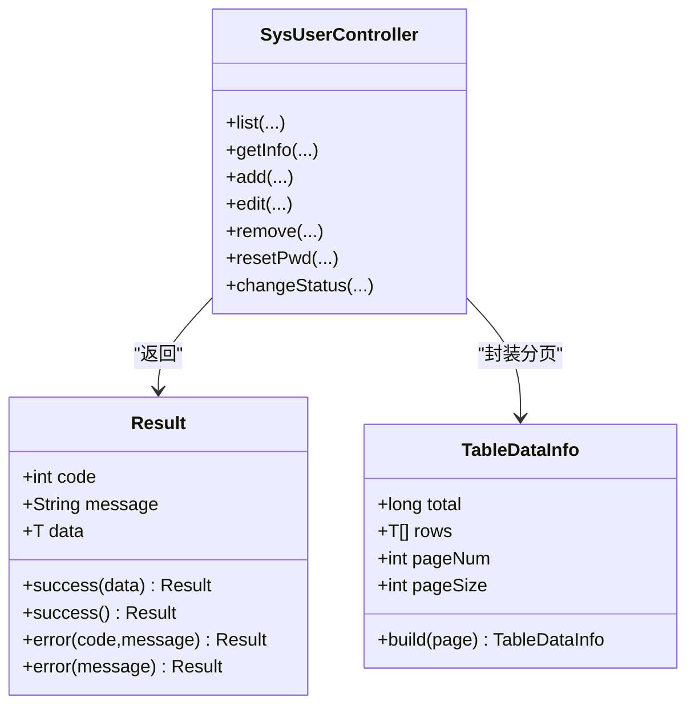
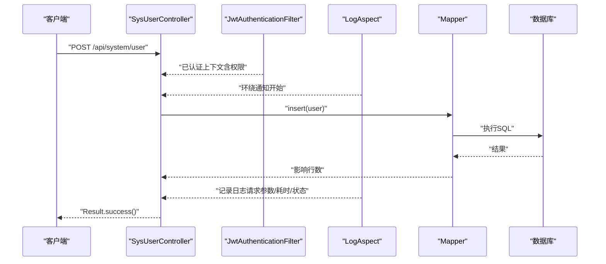
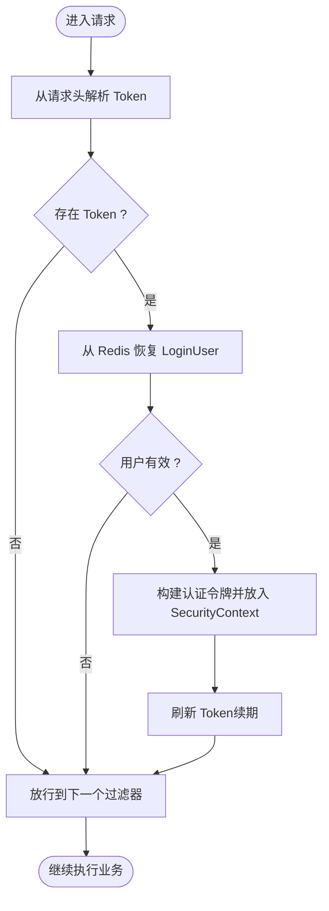
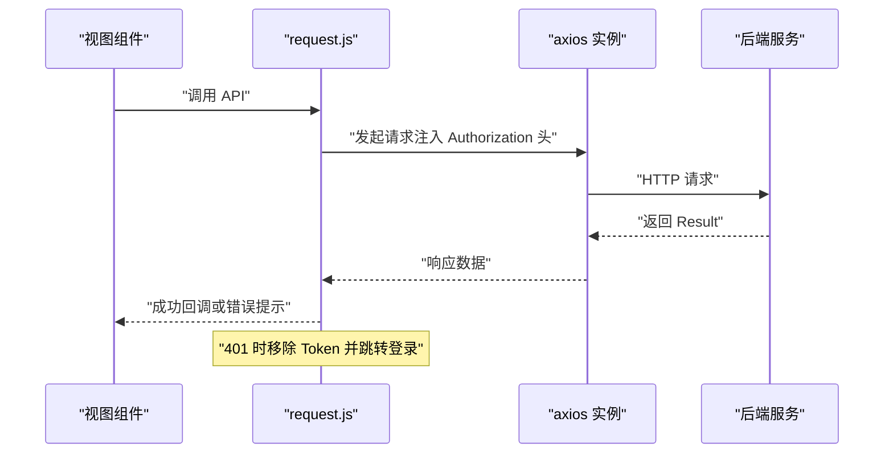
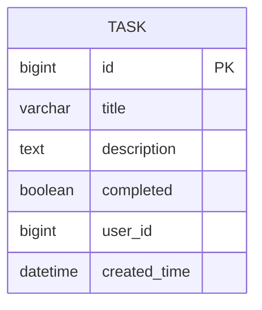
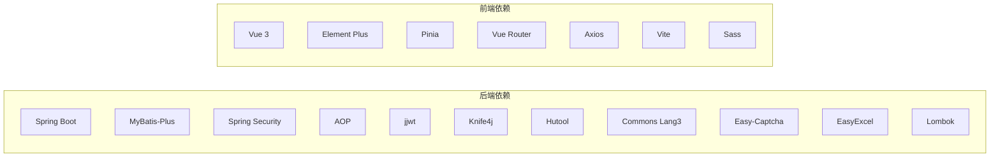

# 开发指南

<cite>
**本文引用的文件**
- [CODEBUDDY.md](file://CODEBUDDY.md)
- [pom.xml](file://task-manager-backend/pom.xml)
- [application.yml](file://task-manager-backend/src/main/resources/application.yml)
- [vite.config.js](file://task-manager-frontend/vite.config.js)
- [package.json](file://task-manager-frontend/package.json)
- [Result.java](file://task-manager-backend/src/main/java/com/taskmanager/common/Result.java)
- [Constants.java](file://task-manager-backend/src/main/java/com/taskmanager/common/constant/Constants.java)
- [Task.java](file://task-manager-backend/src/main/java/com/taskmanager/entity/Task.java)
- [SysUserController.java](file://task-manager-backend/src/main/java/com/taskmanager/controller/SysUserController.java)
- [JwtAuthenticationFilter.java](file://task-manager-backend/src/main/java/com/taskmanager/security/JwtAuthenticationFilter.java)
- [LogAspect.java](file://task-manager-backend/src/main/java/com/taskmanager/aspect/LogAspect.java)
- [request.js](file://task-manager-frontend/src/api/request.js)
- [auth.js](file://task-manager-frontend/src/utils/auth.js)
</cite>

## 目录
1. [简介](#简介)
2. [项目结构](#项目结构)
3. [核心组件](#核心组件)
4. [架构总览](#架构总览)
5. [详细组件分析](#详细组件分析)
6. [依赖分析](#依赖分析)
7. [性能考虑](#性能考虑)
8. [故障排查指南](#故障排查指南)
9. [结论](#结论)
10. [附录](#附录)

## 简介
本指南面向CodeBuddy任务管理系统的核心开发者与协作成员，系统性阐述开发规范、最佳实践、工具配置、版本管理流程、新功能开发流程、代码审查流程、团队协作与效率提升建议。文档以仓库现有实现为依据，结合后端Spring Boot与前端Vue 3的实际代码结构，给出可落地的开发指导。

## 项目结构
项目采用前后端分离架构，后端为Spring Boot应用，前端为Vue 3应用，均遵循“分层+约定优于配置”的组织方式：
- 后端分层：controller/domain/mapper/common/config/security/aspect
- 前端分层：api/views/router/store/utils/layout

图表来源
- [CODEBUDDY.md:49-77](file://CODEBUDDY.md#L49-L77)
- [application.yml:1-79](file://task-manager-backend/src/main/resources/application.yml#L1-L79)
- [vite.config.js:1-28](file://task-manager-frontend/vite.config.js#L1-L28)

章节来源
- [CODEBUDDY.md:40-77](file://CODEBUDDY.md#L40-L77)
- [application.yml:1-79](file://task-manager-backend/src/main/resources/application.yml#L1-L79)
- [vite.config.js:1-28](file://task-manager-frontend/vite.config.js#L1-L28)

## 核心组件
- 统一响应 Result：所有Controller必须返回统一格式，便于前端一致处理与错误提示。
- 分页封装 TableDataInfo：与MyBatis-Plus分页结果配套，简化前端表格渲染。
- 权限注解与切面：@PreAuthorize进行方法级权限校验，@Log注解结合LogAspect自动记录操作日志。
- JWT认证与续期：JwtAuthenticationFilter从请求头提取Token，从Redis恢复用户并自动续期。
- 前端拦截器：axios拦截器统一注入Authorization头、统一错误处理与401跳转。

章节来源
- [Result.java:1-76](file://task-manager-backend/src/main/java/com/taskmanager/common/Result.java#L1-L76)
- [SysUserController.java:1-132](file://task-manager-backend/src/main/java/com/taskmanager/controller/SysUserController.java#L1-L132)
- [LogAspect.java:1-137](file://task-manager-backend/src/main/java/com/taskmanager/aspect/LogAspect.java#L1-L137)
- [JwtAuthenticationFilter.java:1-70](file://task-manager-backend/src/main/java/com/taskmanager/security/JwtAuthenticationFilter.java#L1-L70)
- [request.js:1-63](file://task-manager-frontend/src/api/request.js#L1-L63)

## 架构总览
后端采用三层架构 + RBAC权限控制，前端通过Vite代理到后端8080端口，统一走鉴权与日志切面。

图表来源
- [CODEBUDDY.md:79-84](file://CODEBUDDY.md#L79-L84)
- [vite.config.js:14-24](file://task-manager-frontend/vite.config.js#L14-L24)
- [application.yml:5-56](file://task-manager-backend/src/main/resources/application.yml#L5-L56)

## 详细组件分析

### 统一响应与分页
- 统一响应Result提供success/error静态工厂方法，Controller返回值必须包装为Result，保证前后端契约一致。
- 分页封装TableDataInfo承载total/rows/pageNum/pageSize，配合MyBatis-Plus Page对象使用。

图表来源
- [Result.java:1-76](file://task-manager-backend/src/main/java/com/taskmanager/common/Result.java#L1-L76)
- [SysUserController.java:1-132](file://task-manager-backend/src/main/java/com/taskmanager/controller/SysUserController.java#L1-L132)

章节来源
- [Result.java:1-76](file://task-manager-backend/src/main/java/com/taskmanager/common/Result.java#L1-L76)
- [SysUserController.java:33-44](file://task-manager-backend/src/main/java/com/taskmanager/controller/SysUserController.java#L33-L44)

### 权限控制与操作日志
- 方法级权限：使用@PreAuthorize注解校验权限字符串，未授权将被Security拦截。
- 操作日志：在Controller方法上使用@Log注解，LogAspect环绕通知自动记录请求参数、耗时、状态与异常信息。

图表来源
- [SysUserController.java:59-70](file://task-manager-backend/src/main/java/com/taskmanager/controller/SysUserController.java#L59-L70)
- [LogAspect.java:44-97](file://task-manager-backend/src/main/java/com/taskmanager/aspect/LogAspect.java#L44-L97)
- [JwtAuthenticationFilter.java:37-57](file://task-manager-backend/src/main/java/com/taskmanager/security/JwtAuthenticationFilter.java#L37-L57)

章节来源
- [SysUserController.java:33-106](file://task-manager-backend/src/main/java/com/taskmanager/controller/SysUserController.java#L33-L106)
- [LogAspect.java:44-97](file://task-manager-backend/src/main/java/com/taskmanager/aspect/LogAspect.java#L44-L97)

### JWT认证与续期
- 请求头携带Authorization: Bearer <token>，过滤器解析并从Redis恢复用户信息，构建认证令牌，设置到Security上下文，并自动续期。

图表来源
- [JwtAuthenticationFilter.java:37-57](file://task-manager-backend/src/main/java/com/taskmanager/security/JwtAuthenticationFilter.java#L37-L57)
- [application.yml:51-56](file://task-manager-backend/src/main/resources/application.yml#L51-L56)

章节来源
- [JwtAuthenticationFilter.java:1-70](file://task-manager-backend/src/main/java/com/taskmanager/security/JwtAuthenticationFilter.java#L1-L70)
- [application.yml:51-56](file://task-manager-backend/src/main/resources/application.yml#L51-L56)

### 前端拦截器与认证
- axios拦截器统一注入Authorization头，响应拦截器统一处理非200状态与401跳转登录。
- 前端本地存储TokenKey，登录成功后持久化，退出登录时清理。

图表来源
- [request.js:10-60](file://task-manager-frontend/src/api/request.js#L10-L60)
- [auth.js:1-16](file://task-manager-frontend/src/utils/auth.js#L1-L16)

章节来源
- [request.js:1-63](file://task-manager-frontend/src/api/request.js#L1-L63)
- [auth.js:1-16](file://task-manager-frontend/src/utils/auth.js#L1-L16)

### 数据模型与实体
- 实体类Task映射task表，包含主键、标题、描述、完成状态、所属用户ID与创建时间等字段。

图表来源
- [Task.java:1-50](file://task-manager-backend/src/main/java/com/taskmanager/entity/Task.java#L1-L50)

章节来源
- [Task.java:1-50](file://task-manager-backend/src/main/java/com/taskmanager/entity/Task.java#L1-L50)

## 依赖分析
- 后端依赖：Spring Boot Web/Security/AOP、MyBatis-Plus、Redis、JWT、Knife4j、Hutool、Commons Lang3、Easy-Captcha、EasyExcel、Lombok等。
- 前端依赖：Vue 3、Element Plus、Pinia、Vue Router、Axios、Vite、Sass等。

图表来源
- [pom.xml:32-144](file://task-manager-backend/pom.xml#L32-L144)
- [package.json:11-28](file://task-manager-frontend/package.json#L11-L28)

章节来源
- [pom.xml:1-206](file://task-manager-backend/pom.xml#L1-L206)
- [package.json:1-30](file://task-manager-frontend/package.json#L1-L30)

## 性能考虑
- 后端
  - 使用MyBatis-Plus分页查询，避免一次性加载大结果集。
  - Redis缓存登录用户信息与Token，减少数据库压力，注意合理设置过期时间与续期策略。
  - 启用Knife4j文档，便于接口压测与联调。
- 前端
  - 使用Vite快速冷启动与热更新，开发时启用代理到后端8080端口，避免跨域与重复配置。
  - axios拦截器统一处理错误，避免重复的错误分支判断。

[本节为通用性能建议，不直接分析具体文件]

## 故障排查指南
- 登录后401跳转
  - 检查前端是否正确设置Authorization头，确认TokenKey存在且未过期。
  - 检查后端JwtAuthenticationFilter是否从Header正确提取Token并从Redis恢复用户。
- 接口返回非200
  - 查看后端Result统一响应结构，定位code/message；前端拦截器会弹窗提示并401时跳转登录。
- 操作日志未记录
  - 确认Controller方法是否标注@Log注解，以及LogAspect是否生效。
- 数据库连接与分页
  - 检查application.yml中数据库URL、用户名、密码与连接池配置；确认MyBatis-Plus mapper-locations与逻辑删除字段配置。

章节来源
- [request.js:40-59](file://task-manager-frontend/src/api/request.js#L40-L59)
- [JwtAuthenticationFilter.java:62-68](file://task-manager-backend/src/main/java/com/taskmanager/security/JwtAuthenticationFilter.java#L62-L68)
- [application.yml:5-44](file://task-manager-backend/src/main/resources/application.yml#L5-L44)
- [LogAspect.java:44-97](file://task-manager-backend/src/main/java/com/taskmanager/aspect/LogAspect.java#L44-L97)

## 结论
本指南基于现有代码库总结了开发规范、架构要点与常见问题处理路径。建议团队在日常开发中严格遵循统一响应、权限注解、日志切面与JWT认证流程，确保前后端一致性与可维护性。

[本节为总结性内容，不直接分析具体文件]

## 附录

### 开发规范与最佳实践
- 代码风格与命名
  - 后端：类名使用帕斯卡命名，方法/变量使用驼峰命名；包名全小写；常量使用全大写下划线。
  - 前端：组件文件使用PascalCase，工具函数使用camelCase；样式文件按模块拆分。
- 注释规范
  - 关键类与方法添加简要注释，说明职责与输入输出；复杂逻辑补充流程说明。
- 文件组织
  - 后端按分层组织，新增功能遵循controller/domain/mapper/common/config/security/aspect目录结构。
  - 前端按模块组织views与api，公共组件放入components，工具函数放入utils。

[本节为通用规范建议，不直接分析具体文件]

### 开发工具配置与使用
- IDE推荐
  - 后端：IntelliJ IDEA，启用Lombok注解处理与Spring Boot插件；配置代码模板与检查规则。
  - 前端：VS Code，安装Vue、ESLint、Prettier、Sass等扩展；配置格式化与保存自动修复。
- 插件安装
  - 后端：Lombok、MyBatis-Plus Generator、Rainbow CSV、String Manipulation。
  - 前端：Vue Language Features、ESLint、Prettier、Auto Rename Tag、Bracket Pair Colorizer。
- 调试技巧
  - 后端：断点设置在Controller与Mapper边界，观察Result与分页封装；开启MyBatis日志查看SQL。
  - 前端：利用浏览器Network面板查看请求与响应，结合axios拦截器定位错误。
- 代码质量工具
  - 后端：集成SonarQube或SpotBugs进行静态分析；使用Mockito编写单元测试。
  - 前端：ESLint + Prettier统一风格；使用Vitest/Jest进行单元测试。

[本节为通用工具建议，不直接分析具体文件]

### 版本管理与工作流
- Git分支管理
  - 主分支：main（稳定发布）
  - 功能分支：feature/xxx
  - 修复分支：fix/xxx
  - 预发布分支：release/xxx
- 提交规范
  - 类型：feat/fix/docs/style/refactor/test/build/ci
  - 示例：feat(user): 添加用户列表分页接口
- 合并与发布
  - Pull Request需至少一名Reviewer批准；合并前确保通过CI与测试；发布前更新版本号与Changelog。

[本节为通用流程建议，不直接分析具体文件]

### 新功能开发标准流程
- 需求分析：明确接口与数据模型，评估权限与日志需求。
- 设计评审：确定Controller/Mapper/Entity/DTO结构，评审权限与异常处理。
- 编码实现：遵循统一响应与权限注解；必要时增加@Log注解与切面日志。
- 测试验证：编写单元测试与集成测试；联调接口文档与前端交互。
- 回归与发布：修复缺陷，更新文档，合并至主分支并打标签发布。

[本节为通用流程建议，不直接分析具体文件]

### 代码审查流程与标准
- PR创建：选择合适基线分支，清晰描述变更内容与测试要点。
- 审查要求：关注安全性（权限、日志）、健壮性（异常处理、空值）、一致性（统一响应、命名）。
- 问题修复：按Review意见逐项修正，必要时补充测试；修复后重新请求审查。
- 合并策略：确保无阻塞性问题，通过自动化检查与人工审查。

[本节为通用流程建议，不直接分析具体文件]

### 团队协作最佳实践
- 任务分配：使用看板管理任务，明确负责人与截止时间。
- 进度跟踪：每日站会同步进展，每周回顾迭代成果。
- 沟通协调：统一使用即时通讯工具与Issue模板，保持信息透明。

[本节为通用协作建议，不直接分析具体文件]

### 开发环境个性化配置与效率提升
- 后端
  - 使用Maven Wrapper与阿里云镜像仓库加速依赖下载。
  - 配置IDE自动导入依赖与Lombok注解处理，启用运行配置快捷启动。
- 前端
  - Vite配置代理/dev-api到后端8080端口，避免重复配置BASE_URL。
  - 使用自动导入与组件扫描插件减少样板代码，启用Sass提升样式开发效率。

章节来源
- [CODEBUDDY.md:3-38](file://CODEBUDDY.md#L3-L38)
- [vite.config.js:14-24](file://task-manager-frontend/vite.config.js#L14-L24)
- [pom.xml:147-160](file://task-manager-backend/pom.xml#L147-L160)