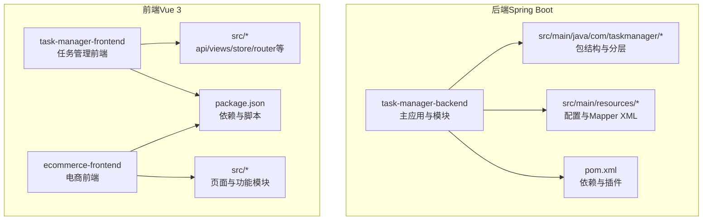
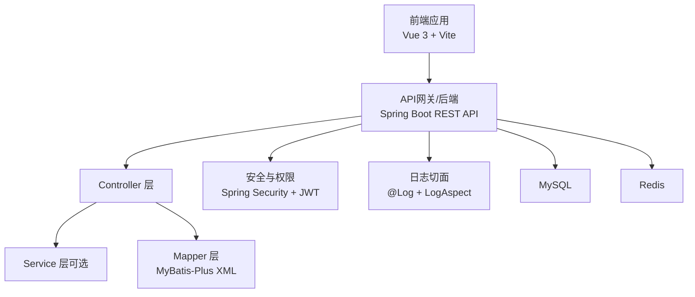
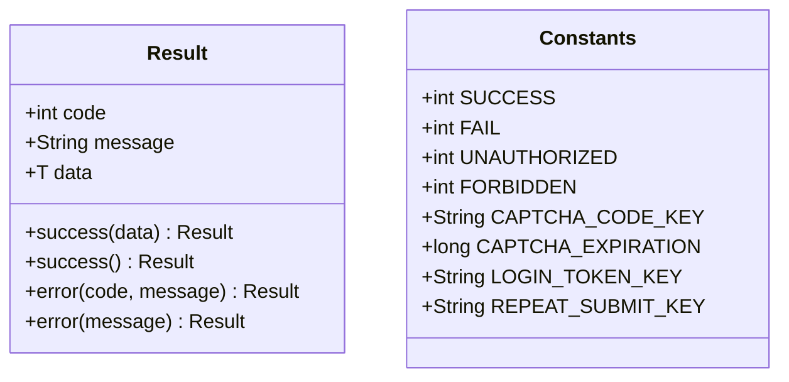
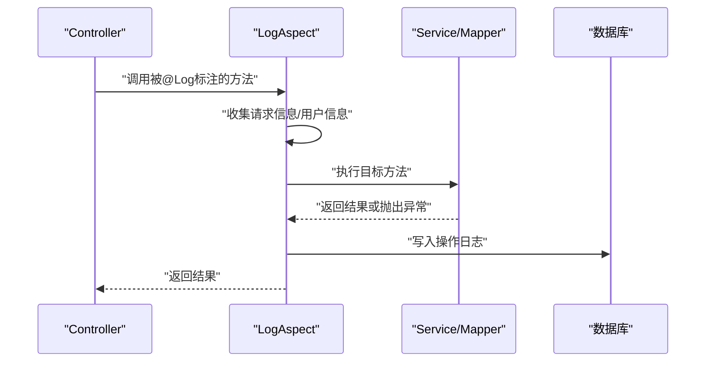
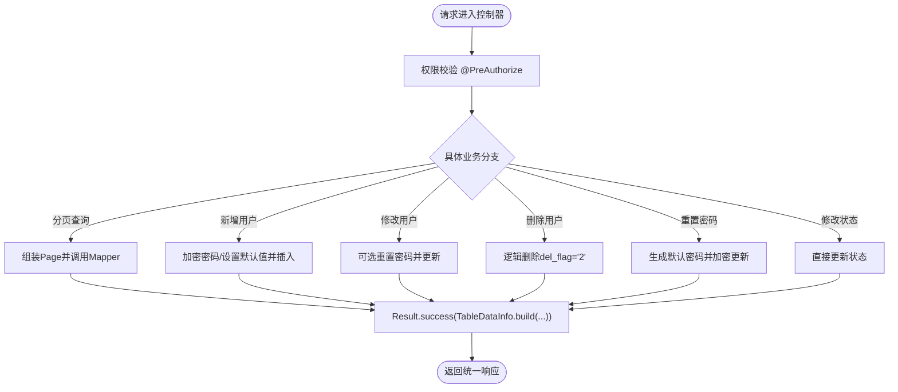
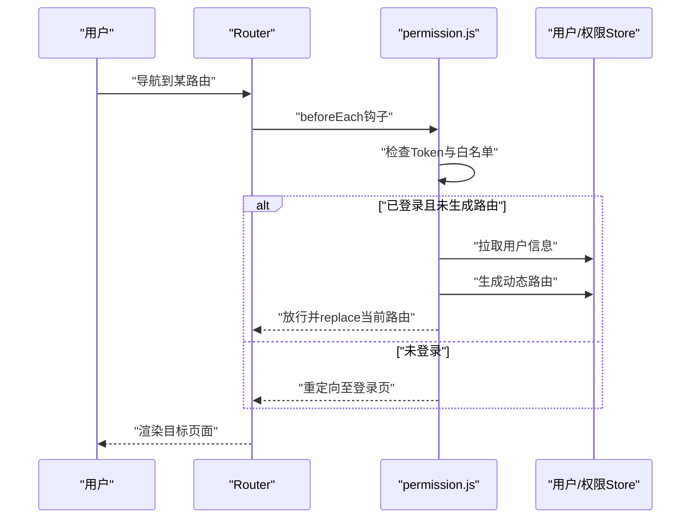
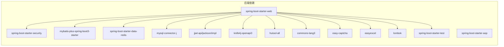

# 开发规范

<cite>
**本文引用的文件**
- [CODEBUDDY.md](file://CODEBUDDY.md)
- [pom.xml](file://task-manager-backend/pom.xml)
- [package.json](file://task-manager-frontend/package.json)
- [TaskManagerApplication.java](file://task-manager-backend/src/main/java/com/taskmanager/TaskManagerApplication.java)
- [Result.java](file://task-manager-backend/src/main/java/com/taskmanager/common/Result.java)
- [Constants.java](file://task-manager-backend/src/main/java/com/taskmanager/common/constant/Constants.java)
- [BusinessTypeEnum.java](file://task-manager-backend/src/main/java/com/taskmanager/common/enums/BusinessTypeEnum.java)
- [Log.java](file://task-manager-backend/src/main/java/com/taskmanager/common/annotation/Log.java)
- [LogAspect.java](file://task-manager-backend/src/main/java/com/taskmanager/aspect/LogAspect.java)
- [SysUserController.java](file://task-manager-backend/src/main/java/com/taskmanager/controller/SysUserController.java)
- [index.js](file://task-manager-frontend/src/router/index.js)
- [permission.js](file://task-manager-frontend/src/permission.js)
- [main.js](file://task-manager-frontend/src/main.js)
- [package.json](file://ecommerce-frontend/package.json)
- [main.js](file://ecommerce-frontend/src/main.js)
</cite>

## 目录
1. [引言](#引言)
2. [项目结构](#项目结构)
3. [核心组件](#核心组件)
4. [架构总览](#架构总览)
5. [详细组件分析](#详细组件分析)
6. [依赖分析](#依赖分析)
7. [性能考虑](#性能考虑)
8. [故障排查指南](#故障排查指南)
9. [结论](#结论)
10. [附录](#附录)

## 引言
本开发规范面向CodeBuddy任务管理系统，覆盖后端（Spring Boot + Java）与前端（Vue 3 + Vite）的代码风格、命名约定、注释规范、文件组织结构、注释模板、以及代码格式化工具配置与使用建议。文档以项目现有实现为依据，结合最佳实践，提供可落地的指导原则，并通过“正确/错误”示例路径帮助开发者快速理解与遵循。

## 项目结构
项目采用前后端分离架构，后端为多模块工程，前端包含两个独立的Vue应用（任务管理前端与电商前端）。整体目录结构清晰，职责边界明确，便于团队协作与维护。

图表来源
- [CODEBUDDY.md](file://CODEBUDDY.md)
- [pom.xml](file://task-manager-backend/pom.xml)
- [package.json](file://task-manager-frontend/package.json)
- [package.json](file://ecommerce-frontend/package.json)

章节来源
- [CODEBUDDY.md](file://CODEBUDDY.md)
- [pom.xml](file://task-manager-backend/pom.xml)
- [package.json](file://task-manager-frontend/package.json)
- [package.json](file://ecommerce-frontend/package.json)

## 核心组件
- 统一响应体：后端通过Result<T>封装所有HTTP响应，保证前后端契约一致。
- 统一常量：集中定义状态码与键前缀，避免魔法数与硬编码。
- 日志注解与切面：@Log注解配合LogAspect自动记录操作日志，支持请求/响应参数过滤与异常状态记录。
- 控制器示例：SysUserController展示分页查询、条件筛选、权限注解、逻辑删除等典型场景。
- 前端路由与权限：Vue Router静态路由 + 动态路由生成，结合权限守卫与用户信息拉取，保障访问安全。

章节来源
- [Result.java](file://task-manager-backend/src/main/java/com/taskmanager/common/Result.java)
- [Constants.java](file://task-manager-backend/src/main/java/com/taskmanager/common/constant/Constants.java)
- [Log.java](file://task-manager-backend/src/main/java/com/taskmanager/common/annotation/Log.java)
- [LogAspect.java](file://task-manager-backend/src/main/java/com/taskmanager/aspect/LogAspect.java)
- [SysUserController.java](file://task-manager-backend/src/main/java/com/taskmanager/controller/SysUserController.java)
- [index.js](file://task-manager-frontend/src/router/index.js)
- [permission.js](file://task-manager-frontend/src/permission.js)

## 架构总览
后端采用标准三层架构 + RBAC权限控制，前端采用组件化与模块化组织，前后端通过REST API交互，开发时通过Vite代理对接后端。

图表来源
- [CODEBUDDY.md](file://CODEBUDDY.md)
- [SysUserController.java](file://task-manager-backend/src/main/java/com/taskmanager/controller/SysUserController.java)
- [LogAspect.java](file://task-manager-backend/src/main/java/com/taskmanager/aspect/LogAspect.java)

章节来源
- [CODEBUDDY.md](file://CODEBUDDY.md)

## 详细组件分析

### 后端：统一响应体与常量
- 统一响应体Result<T>提供success/error静态工厂方法，确保所有接口返回一致的数据结构。
- 常量类Constants集中定义SUCCESS/FAIL/UNAUTHORIZED/FORBIDDEN等状态码及Redis键前缀，避免散落的魔法数。

图表来源
- [Result.java](file://task-manager-backend/src/main/java/com/taskmanager/common/Result.java)
- [Constants.java](file://task-manager-backend/src/main/java/com/taskmanager/common/constant/Constants.java)

章节来源
- [Result.java](file://task-manager-backend/src/main/java/com/taskmanager/common/Result.java)
- [Constants.java](file://task-manager-backend/src/main/java/com/taskmanager/common/constant/Constants.java)

### 后端：日志注解与切面
- @Log注解用于标记需要记录操作日志的方法，支持模块标题、业务类型、是否保存请求/响应参数。
- LogAspect环绕通知在方法执行前后收集请求上下文、用户信息、耗时、状态与异常信息，并持久化到sys_oper_log。

图表来源
- [Log.java](file://task-manager-backend/src/main/java/com/taskmanager/common/annotation/Log.java)
- [LogAspect.java](file://task-manager-backend/src/main/java/com/taskmanager/aspect/LogAspect.java)

章节来源
- [Log.java](file://task-manager-backend/src/main/java/com/taskmanager/common/annotation/Log.java)
- [LogAspect.java](file://task-manager-backend/src/main/java/com/taskmanager/aspect/LogAspect.java)

### 后端：控制器示例（用户管理）
- SysUserController展示分页查询、条件筛选、新增/修改/删除（逻辑删除）、重置密码、状态变更等典型接口。
- 使用@PreAuthorize进行方法级权限校验，确保RBAC生效。
- 返回统一Result包装，便于前端消费。

图表来源
- [SysUserController.java](file://task-manager-backend/src/main/java/com/taskmanager/controller/SysUserController.java)
- [Result.java](file://task-manager-backend/src/main/java/com/taskmanager/common/Result.java)

章节来源
- [SysUserController.java](file://task-manager-backend/src/main/java/com/taskmanager/controller/SysUserController.java)
- [Result.java](file://task-manager-backend/src/main/java/com/taskmanager/common/Result.java)

### 前端：路由与权限守卫
- 静态路由定义于router/index.js，包含登录、404与根布局。
- permission.js实现前置守卫：白名单放行、Token校验、用户信息拉取、动态路由生成与替换跳转。
- main.js注册Element Plus、全局样式与进度条，统一初始化。

图表来源
- [index.js](file://task-manager-frontend/src/router/index.js)
- [permission.js](file://task-manager-frontend/src/permission.js)
- [main.js](file://task-manager-frontend/src/main.js)

章节来源
- [index.js](file://task-manager-frontend/src/router/index.js)
- [permission.js](file://task-manager-frontend/src/permission.js)
- [main.js](file://task-manager-frontend/src/main.js)

### 前端：电商前端对比
- 电商前端与任务管理前端在依赖与入口上基本一致，体现跨项目复用的组件化思想。
- 两者均通过main.js统一注册Element Plus与国际化，保持UI一致性。

章节来源
- [package.json](file://ecommerce-frontend/package.json)
- [main.js](file://ecommerce-frontend/src/main.js)

## 依赖分析
- 后端依赖：Spring Boot Starter Web/Security/AOP + MyBatis-Plus + Redis + MySQL + JWT + Knife4j + Hutool + Commons Lang3 + Easy-Captcha + EasyExcel + Lombok + 测试框架。
- 前端依赖：Vue 3 + Element Plus + Pinia + Vue Router + Axios + Vite + Sass等。

图表来源
- [pom.xml](file://task-manager-backend/pom.xml)

章节来源
- [pom.xml](file://task-manager-backend/pom.xml)
- [package.json](file://task-manager-frontend/package.json)
- [package.json](file://ecommerce-frontend/package.json)

## 性能考虑
- 后端：合理使用分页查询（Page），避免一次性加载大量数据；对敏感字段（如密码）在日志中脱敏；Redis缓存Token与验证码，降低数据库压力。
- 前端：按需加载路由组件，减少首屏体积；统一使用Axios拦截器处理Token与错误提示；避免在组件内重复发起相同请求。

## 故障排查指南
- 登录鉴权失败：检查前端是否携带正确的Authorization头，后端JwtAuthenticationFilter是否能从Redis恢复用户信息并续期。
- 权限不足：确认@PreAuthorize注解的权限字符串与后端菜单权限配置一致。
- 操作日志未记录：检查方法是否标注@Log，LogAspect是否生效，Mapper XML是否正确映射。
- 路由无法访问：确认permission.js已拉取用户信息并生成动态路由，白名单配置是否正确。

章节来源
- [LogAspect.java](file://task-manager-backend/src/main/java/com/taskmanager/aspect/LogAspect.java)
- [permission.js](file://task-manager-frontend/src/permission.js)

## 结论
本规范以项目现有实现为基础，总结了统一响应、权限控制、日志记录、路由与权限守卫等关键机制，并给出前后端的命名与组织建议。建议在日常开发中严格遵循统一响应与注解规范，持续完善文档与测试，确保系统稳定性与可维护性。

## 附录

### 代码风格与命名约定

- 后端（Java）
  - 包名：com.taskmanager.*，按功能域划分（controller/domain/mapper/common/aspect/security/config/util/utils）。
  - 类名：采用帕斯卡命名法；控制器类以Controller结尾；实体类与Mapper同名；枚举与注解语义清晰。
  - 方法名：动词短语，小驼峰；私有方法以下划线开头（如setRequestMessage）。
  - 常量：全大写下划线分隔（如LOGIN_TOKEN_KEY）。
  - 参数与局部变量：小驼峰；布尔变量以is/has/do前缀。
  - 缩进：统一使用4空格；大括号独占一行；长链式调用换行并缩进。
  - 注释：类/方法使用Javadoc；复杂逻辑补充行内注释；TODO/NOTE使用统一标记。

- 前端（Vue 3）
  - 组件命名：帕斯卡命名（如SidebarItem.vue），页面组件置于views下。
  - 文件组织：按功能域分层（api/views/store/router/utils/layout/directive/assets）。
  - 变量命名：小驼峰；常量全大写；布尔变量以is/has/do前缀。
  - 路由命名：使用英文小写与连字符组合，meta.title统一文案。
  - 样式：SCSS模块化，避免全局污染；组件样式隔离。
  - 插件与依赖：通过package.json统一管理，避免重复安装。

### 注释规范（模板）

- 类注释
  - 目的：简述该类职责与作用。
  - 作者：标注作者信息。
  - 版本：标注版本号或最后修改时间。
  - 示例路径：[Result.java](file://task-manager-backend/src/main/java/com/taskmanager/common/Result.java)

- 方法注释
  - 目的：说明方法做什么、输入输出、异常情况。
  - 参数：逐项说明参数含义、类型、是否必填。
  - 返回值：说明返回值含义与约束。
  - 示例路径：[SysUserController.java](file://task-manager-backend/src/main/java/com/taskmanager/controller/SysUserController.java)

- 参数注释
  - 使用@RequestParam/@RequestBody等注解时，在方法注释中明确参数用途。
  - 示例路径：[SysUserController.java](file://task-manager-backend/src/main/java/com/taskmanager/controller/SysUserController.java)

- 返回值注释
  - 统一使用Result<T>包装，注释中说明code/message/data含义。
  - 示例路径：[Result.java](file://task-manager-backend/src/main/java/com/taskmanager/common/Result.java)

### 代码格式化工具配置与使用

- EditorConfig（推荐）
  - 统一缩进、换行、字符集与尾随空白处理。
  - 建议启用IDE内置支持或安装插件。

- Prettier（前端）
  - 用于格式化Vue/JS/CSS/SCSS文件，与ESLint配合。
  - 建议在提交前自动格式化，避免格式差异。

- ESLint（前端）
  - 规范JavaScript/Vue语法与风格，结合prettier统一格式。
  - 建议在IDE中开启实时检查与自动修复。

- Java格式化（IntelliJ IDEA/Eclipse）
  - 使用Google Java Style或自定义风格，统一缩进、空行与注释。
  - 建议配置保存时自动格式化与优化导入。

- 提交前检查清单
  - 后端：通过单元测试与集成测试；检查Result封装与权限注解。
  - 前端：通过ESLint/Prettier检查；确保路由与权限守卫正常工作。

### 正确与错误示例（路径指引）

- 后端
  - 统一响应：使用Result.success()/error()，避免直接返回原始对象。
    - 示例路径：[SysUserController.java](file://task-manager-backend/src/main/java/com/taskmanager/controller/SysUserController.java)
  - 权限注解：每个受保护接口必须添加@PreAuthorize。
    - 示例路径：[SysUserController.java](file://task-manager-backend/src/main/java/com/taskmanager/controller/SysUserController.java)
  - 日志注解：对新增/修改/删除等关键操作添加@Log。
    - 示例路径：[SysUserController.java](file://task-manager-backend/src/main/java/com/taskmanager/controller/SysUserController.java)
  - 常量定义：使用Constants集中管理状态码与键前缀。
    - 示例路径：[Constants.java](file://task-manager-backend/src/main/java/com/taskmanager/common/constant/Constants.java)

- 前端
  - 路由守卫：在permission.js中实现登录态检查与动态路由生成。
    - 示例路径：[permission.js](file://task-manager-frontend/src/permission.js)
  - 组件命名：页面组件使用帕斯卡命名，放置于views下。
    - 示例路径：[index.js](file://task-manager-frontend/src/router/index.js)
  - 样式组织：SCSS模块化，避免全局污染。
    - 示例路径：[main.js](file://task-manager-frontend/src/main.js)