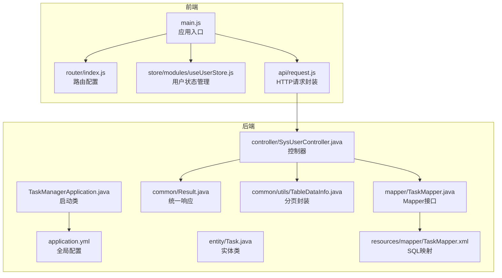
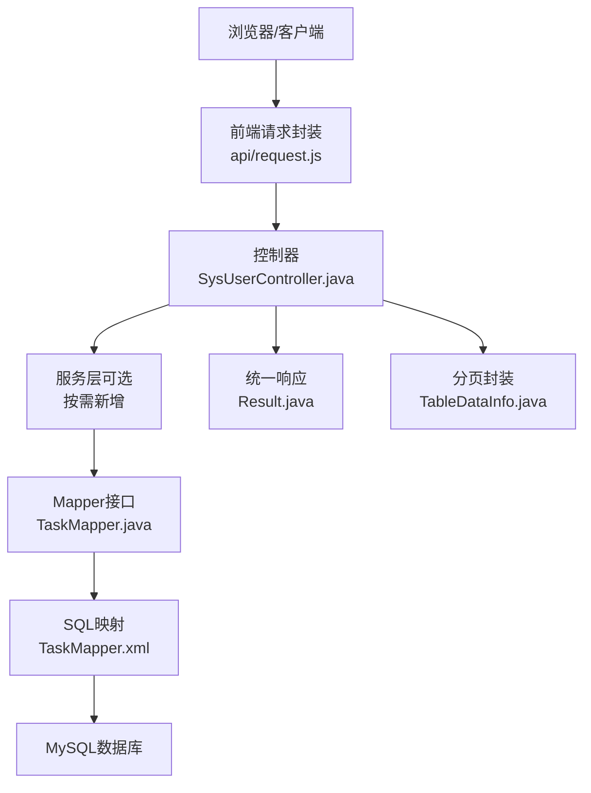
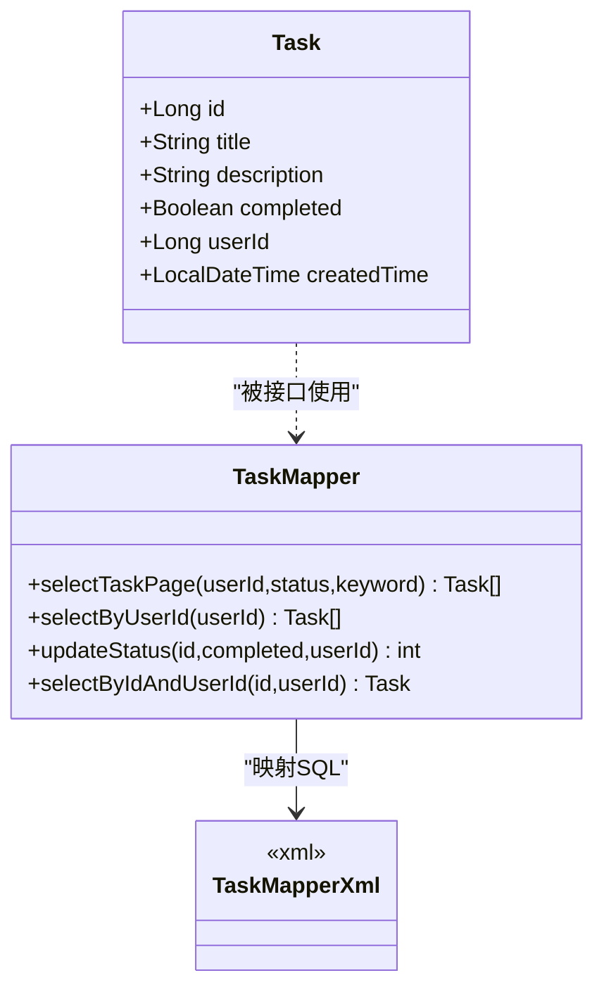
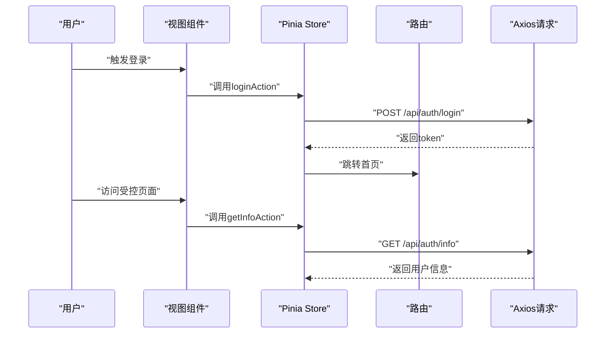
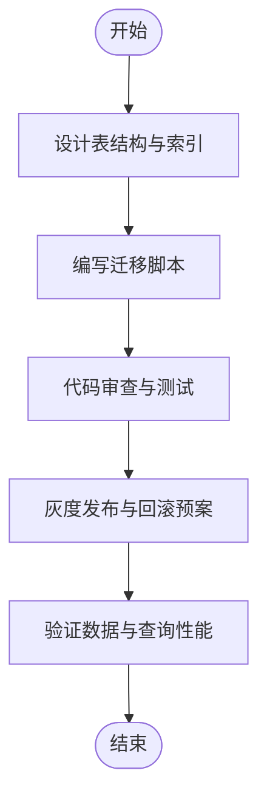
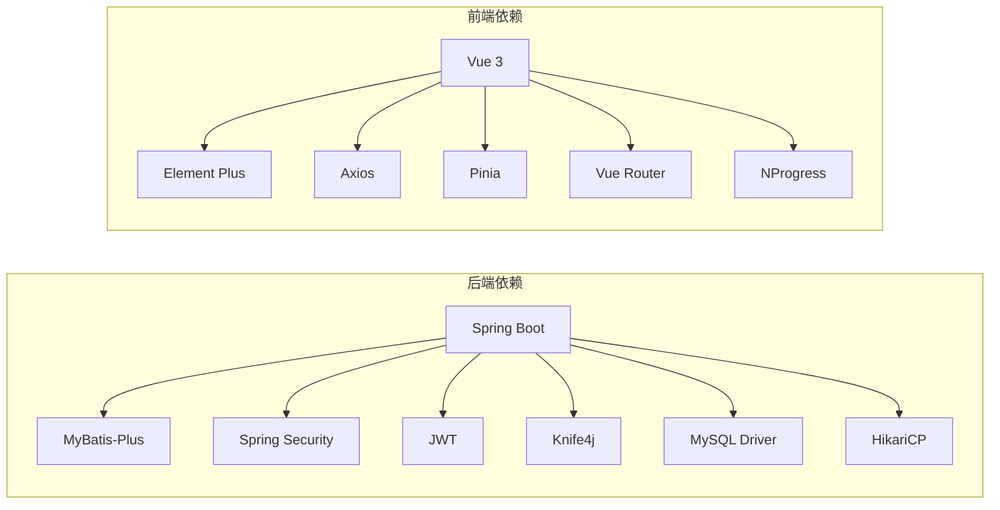

# 新功能开发流程

<cite>
**本文引用的文件**
- [Task.java](file://task-manager-backend/src/main/java/com/taskmanager/entity/Task.java)
- [TaskMapper.java](file://task-manager-backend/src/main/java/com/taskmanager/mapper/TaskMapper.java)
- [TaskMapper.xml](file://task-manager-backend/src/main/resources/mapper/TaskMapper.xml)
- [SysUserController.java](file://task-manager-backend/src/main/java/com/taskmanager/controller/SysUserController.java)
- [SysUser.java](file://task-manager-backend/src/main/java/com/taskmanager/domain/SysUser.java)
- [UserMapper.java](file://task-manager-backend/src/main/java/com/taskmanager/mapper/UserMapper.java)
- [Result.java](file://task-manager-backend/src/main/java/com/taskmanager/common/Result.java)
- [TableDataInfo.java](file://task-manager-backend/src/main/java/com/taskmanager/common/utils/TableDataInfo.java)
- [application.yml](file://task-manager-backend/src/main/resources/application.yml)
- [request.js](file://task-manager-frontend/src/api/request.js)
- [index.js](file://task-manager-frontend/src/router/index.js)
- [useUserStore.js](file://task-manager-frontend/src/store/modules/useUserStore.js)
- [main.js](file://task-manager-frontend/src/main.js)
- [package.json](file://task-manager-frontend/package.json)
</cite>

## 目录
1. [简介](#简介)
2. [项目结构](#项目结构)
3. [核心组件](#核心组件)
4. [架构总览](#架构总览)
5. [详细组件分析](#详细组件分析)
6. [依赖分析](#依赖分析)
7. [性能考虑](#性能考虑)
8. [故障排查指南](#故障排查指南)
9. [结论](#结论)
10. [附录](#附录)

## 简介
本文件面向CodeBuddy任务管理系统的新功能开发，提供从需求分析到功能上线的标准化流程与最佳实践。内容覆盖后端实体设计、Mapper接口与XML映射、Controller开发、Service层实现、前端组件与API封装、路由与权限、状态管理、数据库变更、测试驱动开发以及质量保证检查清单。文档以现有代码库为依据，结合实际文件路径进行说明，帮助团队在一致的规范下高效交付高质量功能。

## 项目结构
系统采用前后端分离架构：
- 后端基于Spring Boot + MyBatis-Plus，使用统一响应包装、分页工具与权限注解，资源位于task-manager-backend目录。
- 前端基于Vue 3 + Pinia + Vue Router，通过Axios封装统一请求与拦截器，资源位于task-manager-frontend目录。
- 数据源与MyBatis-Plus配置集中于application.yml，包含数据源、Redis、JWT、Knife4j文档等配置。

**图表来源**
- [main.js:1-24](file://task-manager-frontend/src/main.js#L1-L24)
- [index.js:1-32](file://task-manager-frontend/src/router/index.js#L1-L32)
- [useUserStore.js:1-52](file://task-manager-frontend/src/store/modules/useUserStore.js#L1-L52)
- [request.js:1-63](file://task-manager-frontend/src/api/request.js#L1-L63)
- [application.yml:1-79](file://task-manager-backend/src/main/resources/application.yml#L1-L79)
- [Result.java:1-76](file://task-manager-backend/src/main/java/com/taskmanager/common/Result.java#L1-L76)
- [TableDataInfo.java:1-60](file://task-manager-backend/src/main/java/com/taskmanager/common/utils/TableDataInfo.java#L1-L60)
- [Task.java:1-50](file://task-manager-backend/src/main/java/com/taskmanager/entity/Task.java#L1-L50)
- [TaskMapper.java:1-57](file://task-manager-backend/src/main/java/com/taskmanager/mapper/TaskMapper.java#L1-L57)
- [TaskMapper.xml:1-43](file://task-manager-backend/src/main/resources/mapper/TaskMapper.xml#L1-L43)
- [SysUserController.java:1-132](file://task-manager-backend/src/main/java/com/taskmanager/controller/SysUserController.java#L1-L132)

**章节来源**
- [application.yml:1-79](file://task-manager-backend/src/main/resources/application.yml#L1-L79)
- [main.js:1-24](file://task-manager-frontend/src/main.js#L1-L24)

## 核心组件
- 统一响应包装：后端通过Result类统一封装响应状态码、消息与数据，便于前端统一处理。
- 分页封装：TableDataInfo将MyBatis-Plus Page转换为表格分页数据结构，简化控制器返回。
- 实体与映射：Task实体与TaskMapper接口及XML映射构成标准的CRUD实现模板。
- 控制器权限：使用Spring Security注解进行权限控制，结合日志注解记录操作。
- 前端请求封装：Axios拦截器统一注入Token与错误处理，Pinia状态管理用户会话。

**章节来源**
- [Result.java:1-76](file://task-manager-backend/src/main/java/com/taskmanager/common/Result.java#L1-L76)
- [TableDataInfo.java:1-60](file://task-manager-backend/src/main/java/com/taskmanager/common/utils/TableDataInfo.java#L1-L60)
- [Task.java:1-50](file://task-manager-backend/src/main/java/com/taskmanager/entity/Task.java#L1-L50)
- [TaskMapper.java:1-57](file://task-manager-backend/src/main/java/com/taskmanager/mapper/TaskMapper.java#L1-L57)
- [TaskMapper.xml:1-43](file://task-manager-backend/src/main/resources/mapper/TaskMapper.xml#L1-L43)
- [SysUserController.java:1-132](file://task-manager-backend/src/main/java/com/taskmanager/controller/SysUserController.java#L1-L132)
- [request.js:1-63](file://task-manager-frontend/src/api/request.js#L1-L63)
- [useUserStore.js:1-52](file://task-manager-frontend/src/store/modules/useUserStore.js#L1-L52)

## 架构总览
后端采用经典的分层架构：Controller负责接口与权限控制，Mapper负责数据访问，XML定义SQL，实体类映射表结构。前端通过Axios封装请求，Pinia管理用户状态，Vue Router组织页面路由。

**图表来源**
- [SysUserController.java:1-132](file://task-manager-backend/src/main/java/com/taskmanager/controller/SysUserController.java#L1-L132)
- [TaskMapper.java:1-57](file://task-manager-backend/src/main/java/com/taskmanager/mapper/TaskMapper.java#L1-L57)
- [TaskMapper.xml:1-43](file://task-manager-backend/src/main/resources/mapper/TaskMapper.xml#L1-L43)
- [Result.java:1-76](file://task-manager-backend/src/main/java/com/taskmanager/common/Result.java#L1-L76)
- [TableDataInfo.java:1-60](file://task-manager-backend/src/main/java/com/taskmanager/common/utils/TableDataInfo.java#L1-L60)
- [request.js:1-63](file://task-manager-frontend/src/api/request.js#L1-L63)

## 详细组件分析

### 后端开发流程（以Task为例）
- 实体类设计：定义字段、主键与表映射，遵循驼峰转下划线配置。
- Mapper接口：继承BaseMapper，声明方法签名与参数。
- XML映射：在namespace下编写SQL，支持条件查询、排序与更新。
- 控制器开发：定义REST接口、参数绑定、权限注解与统一响应。
- 配置与启动：application.yml中配置数据源、MyBatis-Plus、Knife4j等。

**图表来源**
- [Task.java:1-50](file://task-manager-backend/src/main/java/com/taskmanager/entity/Task.java#L1-L50)
- [TaskMapper.java:1-57](file://task-manager-backend/src/main/java/com/taskmanager/mapper/TaskMapper.java#L1-L57)
- [TaskMapper.xml:1-43](file://task-manager-backend/src/main/resources/mapper/TaskMapper.xml#L1-L43)

**章节来源**
- [Task.java:1-50](file://task-manager-backend/src/main/java/com/taskmanager/entity/Task.java#L1-L50)
- [TaskMapper.java:1-57](file://task-manager-backend/src/main/java/com/taskmanager/mapper/TaskMapper.java#L1-L57)
- [TaskMapper.xml:1-43](file://task-manager-backend/src/main/resources/mapper/TaskMapper.xml#L1-L43)

### 前端开发流程
- 组件设计：基于Vue 3单文件组件，按页面与功能模块组织。
- API调用封装：通过Axios创建实例，设置基础URL、超时与拦截器，统一处理响应与错误。
- 路由配置：使用Vue Router定义公共路由与嵌套路由，结合布局组件。
- 权限控制：在路由或组件层面结合用户权限进行展示控制。
- 状态管理：使用Pinia Store管理用户登录态、角色与权限，提供登录、登出与信息获取动作。

**图表来源**
- [useUserStore.js:1-52](file://task-manager-frontend/src/store/modules/useUserStore.js#L1-L52)
- [index.js:1-32](file://task-manager-frontend/src/router/index.js#L1-L32)
- [request.js:1-63](file://task-manager-frontend/src/api/request.js#L1-L63)

**章节来源**
- [request.js:1-63](file://task-manager-frontend/src/api/request.js#L1-L63)
- [index.js:1-32](file://task-manager-frontend/src/router/index.js#L1-L32)
- [useUserStore.js:1-52](file://task-manager-frontend/src/store/modules/useUserStore.js#L1-L52)
- [main.js:1-24](file://task-manager-frontend/src/main.js#L1-L24)
- [package.json:1-30](file://task-manager-frontend/package.json#L1-L30)

### 数据库变更流程
- 表结构设计：根据实体类字段生成表结构，明确主键、索引与约束。
- 索引优化：对常用查询条件（如用户ID、状态、关键词）建立索引，避免全表扫描。
- 数据迁移：编写SQL脚本，包含DDL与DML，确保版本升级时数据一致性。
- 配置同步：在application.yml中确认MyBatis-Plus命名策略与逻辑删除字段。

**章节来源**
- [application.yml:33-44](file://task-manager-backend/src/main/resources/application.yml#L33-L44)
- [Task.java:1-50](file://task-manager-backend/src/main/java/com/taskmanager/entity/Task.java#L1-L50)
- [TaskMapper.xml:1-43](file://task-manager-backend/src/main/resources/mapper/TaskMapper.xml#L1-L43)

### 测试驱动开发最佳实践
- 单元测试：针对Mapper与工具类编写单元测试，覆盖边界与异常场景。
- 集成测试：使用Spring Boot Test与Testcontainers或H2内存数据库，模拟真实环境。
- 端到端测试：基于Playwright/Cypress等框架，录制用户操作流程并回归验证。
- 自动化执行：在CI中串联测试步骤，失败即阻断发布。

[本节为通用指导，不直接分析具体文件，故无“章节来源”]

### 功能开发检查清单
- 需求分析：明确业务目标、用户故事与验收标准。
- 技术评估：评估数据模型、接口设计与性能影响。
- 设计评审：统一实体、接口与交互设计。
- 原型设计：输出线框图与交互说明。
- 开发实现：遵循后端分层与前端组件规范。
- 测试验证：覆盖单元、集成与端到端测试。
- 代码审查：关注安全性、可维护性与性能。
- 部署上线：灰度发布、监控告警与回滚预案。

[本节为通用指导，不直接分析具体文件，故无“章节来源”]

## 依赖分析
- 后端依赖：Spring Boot、MyBatis-Plus、Spring Security、JWT、Knife4j、MySQL驱动与HikariCP连接池。
- 前端依赖：Vue 3、Element Plus、Axios、Pinia、Vue Router、NProgress等。

**图表来源**
- [application.yml:1-79](file://task-manager-backend/src/main/resources/application.yml#L1-L79)
- [package.json:1-30](file://task-manager-frontend/package.json#L1-L30)

**章节来源**
- [application.yml:1-79](file://task-manager-backend/src/main/resources/application.yml#L1-L79)
- [package.json:1-30](file://task-manager-frontend/package.json#L1-L30)

## 性能考虑
- 数据访问：合理使用分页、索引与缓存，避免N+1查询。
- 接口设计：统一响应与分页封装减少重复逻辑，提升前端体验。
- 安全与鉴权：使用JWT与权限注解，避免越权访问。
- 前端优化：按需加载、组件复用与状态最小化，降低渲染压力。

[本节为通用指导，不直接分析具体文件，故无“章节来源”]

## 故障排查指南
- 统一响应错误：后端Result封装错误码与消息，前端拦截器统一提示与401处理。
- 权限问题：检查控制器上的权限注解与用户角色/权限是否匹配。
- 数据库连接：核对application.yml中的数据源与MyBatis-Plus配置。
- 前端Token：确认请求拦截器是否正确注入Authorization头。

**章节来源**
- [Result.java:53-74](file://task-manager-backend/src/main/java/com/taskmanager/common/Result.java#L53-L74)
- [request.js:22-60](file://task-manager-frontend/src/api/request.js#L22-L60)
- [application.yml:5-44](file://task-manager-backend/src/main/resources/application.yml#L5-L44)

## 结论
通过标准化的后端分层与前端组件化开发，结合统一响应、分页封装与权限控制，CodeBuddy任务管理系统能够稳定地交付新功能。建议在每次迭代中严格执行需求、设计、开发、测试与审查流程，确保质量与效率双达标。

[本节为总结性内容，不直接分析具体文件，故无“章节来源”]

## 附录
- 参考实现文件路径：后端实体、Mapper、XML与控制器，前端请求封装、路由与状态管理。
- 配置参考：application.yml中的数据源、MyBatis-Plus、JWT与Knife4j配置。

**章节来源**
- [SysUserController.java:1-132](file://task-manager-backend/src/main/java/com/taskmanager/controller/SysUserController.java#L1-L132)
- [TaskMapper.java:1-57](file://task-manager-backend/src/main/java/com/taskmanager/mapper/TaskMapper.java#L1-L57)
- [TaskMapper.xml:1-43](file://task-manager-backend/src/main/resources/mapper/TaskMapper.xml#L1-L43)
- [request.js:1-63](file://task-manager-frontend/src/api/request.js#L1-L63)
- [index.js:1-32](file://task-manager-frontend/src/router/index.js#L1-L32)
- [useUserStore.js:1-52](file://task-manager-frontend/src/store/modules/useUserStore.js#L1-L52)
- [application.yml:1-79](file://task-manager-backend/src/main/resources/application.yml#L1-L79)