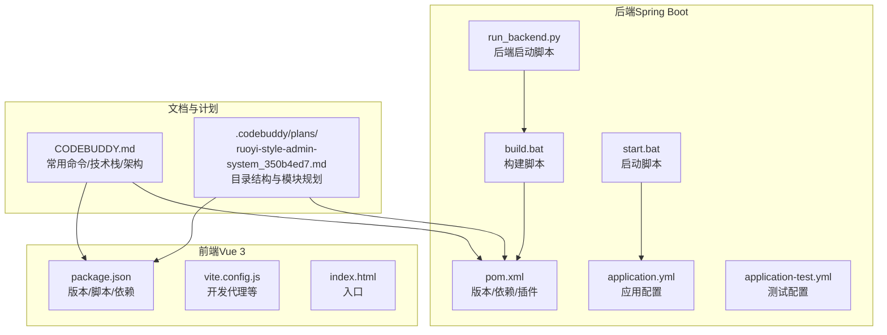
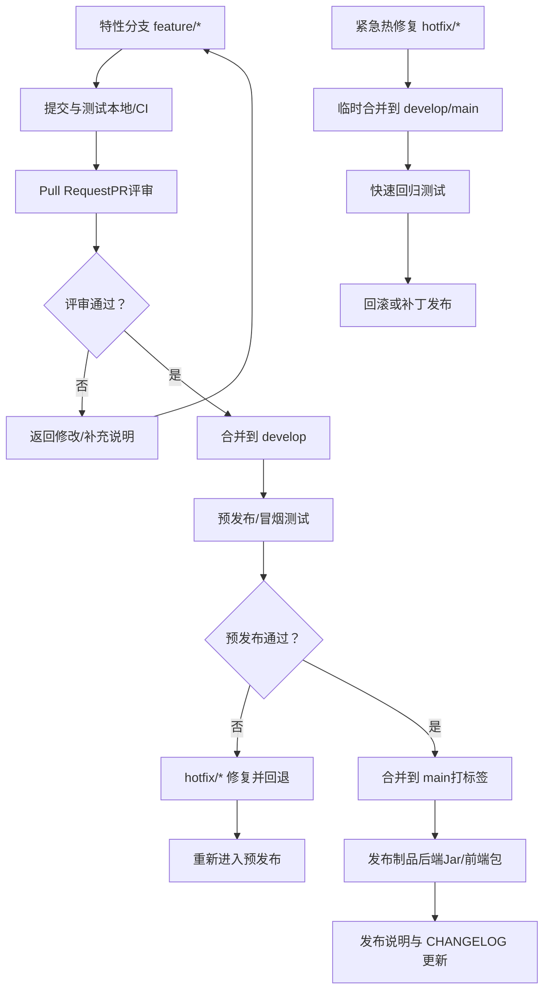
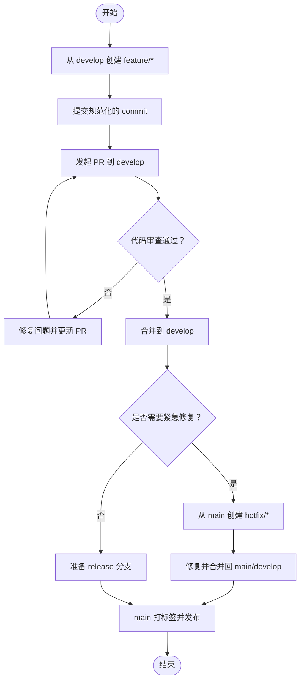
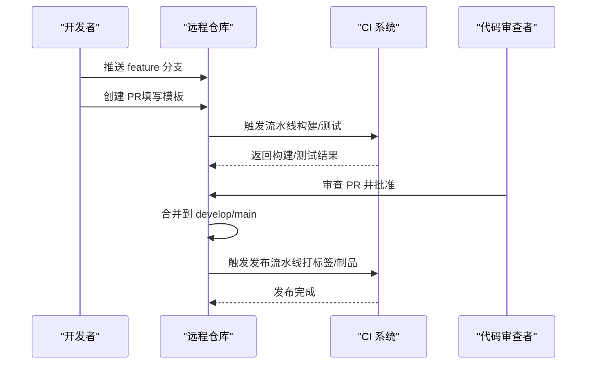
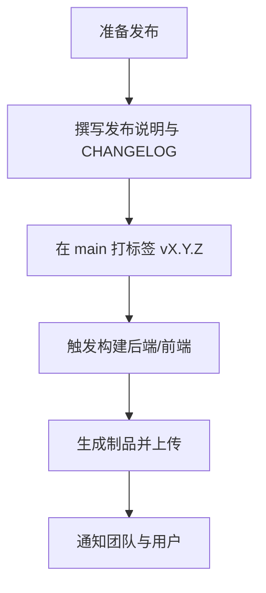
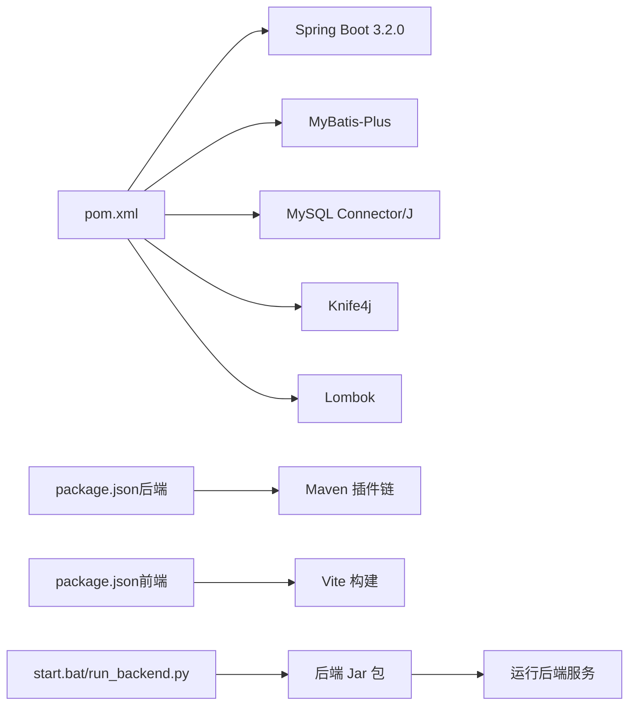

# 版本管理流程

<cite>
**本文引用的文件**
- [CODEBUDDY.md](file://CODEBUDDY.md)
- [pom.xml](file://task-manager-backend/pom.xml)
- [build.bat](file://task-manager-backend/build.bat)
- [package.json（后端）](file://task-manager-backend/package.json)
- [package.json（前端）](file://task-manager-frontend/package.json)
- [application.yml](file://task-manager-backend/src/main/resources/application.yml)
- [application-test.yml](file://task-manager-backend/src/test/resources/application-test.yml)
- [start.bat](file://start.bat)
- [run_backend.py](file://run_backend.py)
- [test_login.py](file://test_login.py)
- [ruoyi-style-admin-system_350b4ed7.md](file://.codebuddy/plans/ruoyi-style-admin-system_350b4ed7.md)
</cite>

## 目录
1. [简介](#简介)
2. [项目结构](#项目结构)
3. [核心组件](#核心组件)
4. [架构总览](#架构总览)
5. [详细组件分析](#详细组件分析)
6. [依赖关系分析](#依赖关系分析)
7. [性能考虑](#性能考虑)
8. [故障排查指南](#故障排查指南)
9. [结论](#结论)
10. [附录](#附录)

## 简介
本文件面向 CodeBuddy 任务管理系统，提供一套完整的 Git 版本管理流程规范，涵盖分支策略、提交规范、合并流程、发布流程、冲突解决与回滚策略，并结合项目现有构建与运行脚本给出可落地的操作示例与可视化图示。目标是在保证质量与可追溯性的前提下，提升团队协作效率与交付稳定性。

## 项目结构
项目采用前后端分离架构，后端为 Spring Boot 应用，前端为 Vue 3 应用；同时提供多平台启动脚本与构建脚本，便于本地开发与快速验证。

**图表来源**
- [CODEBUDDY.md](file://CODEBUDDY.md)
- [pom.xml](file://task-manager-backend/pom.xml)
- [build.bat](file://task-manager-backend/build.bat)
- [package.json（后端）](file://task-manager-backend/package.json)
- [package.json（前端）](file://task-manager-frontend/package.json)
- [application.yml](file://task-manager-backend/src/main/resources/application.yml)
- [application-test.yml](file://task-manager-backend/src/test/resources/application-test.yml)
- [start.bat](file://start.bat)
- [run_backend.py](file://run_backend.py)
- [ruoyi-style-admin-system_350b4ed7.md](file://.codebuddy/plans/ruoyi-style-admin-system_350b4ed7.md)

**章节来源**
- [CODEBUDDY.md](file://CODEBUDDY.md)
- [ruoyi-style-admin-system_350b4ed7.md](file://.codebuddy/plans/ruoyi-style-admin-system_350b4ed7.md)

## 核心组件
- 版本号管理
  - 后端与前端均以语义化版本 1.0.0 作为初始版本，建议遵循主版本.次版本.修订号的规则进行迭代。
- 构建与测试
  - 后端使用 Maven 插件链（编译、打包、测试）；前端使用 Vite 构建；提供批处理与 Python 脚本辅助构建与启动。
- 配置隔离
  - application.yml 与 application-test.yml 提供生产与测试环境配置，便于 CI/CD 中切换。

**章节来源**
- [pom.xml](file://task-manager-backend/pom.xml)
- [package.json（后端）](file://task-manager-backend/package.json)
- [package.json（前端）](file://task-manager-frontend/package.json)
- [application.yml](file://task-manager-backend/src/main/resources/application.yml)
- [application-test.yml](file://task-manager-backend/src/test/resources/application-test.yml)

## 架构总览
以下为基于项目现状的版本管理流程架构示意，展示从分支到发布的闭环路径与关键检查点。

**图表来源**
- [CODEBUDDY.md](file://CODEBUDDY.md)
- [pom.xml](file://task-manager-backend/pom.xml)
- [build.bat](file://task-manager-backend/build.bat)
- [package.json（后端）](file://task-manager-backend/package.json)
- [package.json（前端）](file://task-manager-frontend/package.json)

## 详细组件分析

### 分支管理策略
- 主分支保护
  - main 仅允许通过 PR 合并，禁止直接推送；每次合并需通过 CI 验证与至少一名代码审查者批准。
  - develop 作为集成分支，持续集成最新特性；release 分支用于预发布收敛。
- 特性分支命名
  - feature/模块名/功能描述（如 feature/user-management/add-login-flow），避免跨功能聚合提交。
- 热修复分支
  - hotfix/问题编号/简述（如 hotfix/CVE-YYYY-NNNN9/update-jackson-version），从 main 切出，修复后同时合并回 main 与 develop，并在 main 打上补丁标签。

**图表来源**
- [CODEBUDDY.md](file://CODEBUDDY.md)

**章节来源**
- [CODEBUDDY.md](file://CODEBUDDY.md)

### 提交规范
- 类型（type）
  - feat：新功能
  - fix：缺陷修复
  - docs：文档更新
  - style：不影响逻辑的格式调整
  - refactor：重构（既不修复缺陷也不新增功能）
  - perf：性能优化
  - test：新增或调整测试
  - build：影响构建系统或外部依赖的更改
  - ci：CI 相关变更
  - chore：其他不涉及业务与测试的维护工作
- 作用域（scope）
  - 指明改动影响的模块或包，如 backend:common、frontend:api、ci:workflow。
- 消息正文
  - 简要描述变更；必要时补充动机与后果；引用相关 Issue/PR。
- 破坏性变更（breaking change）
  - 在首行以 BREAKING CHANGE: 开头，随后说明变更内容与迁移指引。

示例路径参考
- [提交规范示例路径](file://CODEBUDDY.md)

**章节来源**
- [CODEBUDDY.md](file://CODEBUDDY.md)

### 合并流程
- Pull Request 模板
  - 标题：type(scope): subject
  - 摘要：本次变更的目的与范围
  - 问题链接：关联 Issue/需求
  - 变更影响：对 API、配置、依赖的影响评估
  - 测试要点：自测步骤与边界条件
- 代码审查要求
  - 至少一名审查者批准；审查关注点：正确性、可读性、安全性、性能、兼容性。
- CI/CD 集成
  - 构建阶段：后端使用 Maven 插件链，前端使用 Vite；可接入自动化测试与安全扫描。
  - 测试阶段：单元测试与集成测试通过；覆盖率阈值设定。
  - 发布阶段：制品上传至制品库或发布到目标环境。
- 自动化测试验证
  - 后端：单元测试与集成测试；可参考测试配置文件。
  - 前端：构建通过、无严重 ESLint 错误、关键页面可访问。

**图表来源**
- [build.bat](file://task-manager-backend/build.bat)
- [application-test.yml](file://task-manager-backend/src/test/resources/application-test.yml)
- [CODEBUDDY.md](file://CODEBUDDY.md)

**章节来源**
- [build.bat](file://task-manager-backend/build.bat)
- [application-test.yml](file://task-manager-backend/src/test/resources/application-test.yml)
- [CODEBUDDY.md](file://CODEBUDDY.md)

### 发布流程
- 版本号管理
  - 语义化版本：主版本.次版本.修订号；重大变更提升主版本，向后兼容的功能变更提升次版本，修复提升修订号。
- CHANGELOG 维护
  - 每次发布更新 CHANGELOG，记录新增功能、修复、破坏性变更与已知问题。
- 标签创建
  - 在 main 上创建 vX.Y.Z 标签；标签与发布说明同步。
- 发布说明
  - 概述变更内容、升级指引、已知问题与回滚建议。
- 制品发布
  - 后端 Jar 包、前端构建产物；确保签名与完整性校验。

**图表来源**
- [pom.xml](file://task-manager-backend/pom.xml)
- [package.json（后端）](file://task-manager-backend/package.json)
- [package.json（前端）](file://task-manager-frontend/package.json)

**章节来源**
- [pom.xml](file://task-manager-backend/pom.xml)
- [package.json（后端）](file://task-manager-backend/package.json)
- [package.json（前端）](file://task-manager-frontend/package.json)

### 冲突解决策略
- 频繁同步
  - 定期从 develop/main 拉取上游变更，减少冲突规模。
- 小步提交
  - 将大改动拆分为多个小 PR，降低合并风险。
- 明确职责
  - 避免多人同时修改同一模块；跨模块改动需提前沟通。
- 冲突处理
  - 使用 IDE 合并工具或命令行工具；解决冲突后务必自测并通过 CI。

### 历史修改最佳实践
- 保持提交原子性：一次提交只做一件事。
- 使用交互式 rebase 整理历史：合并、修改、拆分提交。
- 避免在 main/develop 直接修改历史；通过 PR 合并引入变更。

### 紧急回滚流程
- 快速定位
  - 通过 CI 日志与发布说明定位问题版本与标签。
- 回滚策略
  - 若为后端：拉取上一个稳定标签，修复后以热修复分支发布。
  - 若为前端：回滚到上一个稳定构建产物或回退相关提交。
- 通知与验证
  - 回滚后发布补丁版本并通知用户；执行回归测试。

## 依赖关系分析
- 后端依赖与版本
  - Spring Boot 3.2.0、MySQL Connector/J、MyBatis-Plus、Knife4j、Lombok 等；版本在 POM 中集中管理。
- 前端依赖与版本
  - Vue 3、Element Plus、Pinia、Axios、Vite 等；版本在 package.json 中声明。
- 构建与测试
  - 后端通过 Maven 插件链完成编译、测试与打包；前端通过 Vite 完成开发与生产构建。

**图表来源**
- [pom.xml](file://task-manager-backend/pom.xml)
- [package.json（后端）](file://task-manager-backend/package.json)
- [package.json（前端）](file://task-manager-frontend/package.json)
- [start.bat](file://start.bat)
- [run_backend.py](file://run_backend.py)

**章节来源**
- [pom.xml](file://task-manager-backend/pom.xml)
- [package.json（后端）](file://task-manager-backend/package.json)
- [package.json（前端）](file://task-manager-frontend/package.json)
- [start.bat](file://start.bat)
- [run_backend.py](file://run_backend.py)

## 性能考虑
- 构建性能
  - 后端启用 Maven 编译器注解处理器与 Surefire 参数优化；前端使用 Vite 快速冷启动与按需加载。
- 测试效率
  - 单元测试与集成测试分离，CI 中优先运行快速测试集。
- 依赖管理
  - 使用中央仓库与镜像源加速依赖下载；锁定关键依赖版本以减少波动。

## 故障排查指南
- 后端构建失败
  - 检查系统是否安装 Maven 或使用 Maven Wrapper；查看构建脚本输出与日志。
  - 参考：[build.bat](file://task-manager-backend/build.bat)
- 启动失败
  - 确认数据库与 Redis 可用；检查 application.yml 配置；使用启动脚本验证端口占用。
  - 参考：[application.yml](file://task-manager-backend/src/main/resources/application.yml)，[start.bat](file://start.bat)
- 前端无法访问后端接口
  - 确认 Vite 代理配置指向后端地址；检查跨域配置与鉴权头。
  - 参考：[CODEBUDDY.md](file://CODEBUDDY.md)
- 测试环境异常
  - 检查测试配置排除 Redis 自动配置，避免测试期间连接 Redis。
  - 参考：[application-test.yml](file://task-manager-backend/src/test/resources/application-test.yml)
- 登录测试
  - 使用提供的测试脚本验证登录接口可用性与响应格式。
  - 参考：[test_login.py](file://test_login.py)

**章节来源**
- [build.bat](file://task-manager-backend/build.bat)
- [application.yml](file://task-manager-backend/src/main/resources/application.yml)
- [application-test.yml](file://task-manager-backend/src/test/resources/application-test.yml)
- [CODEBUDDY.md](file://CODEBUDDY.md)
- [test_login.py](file://test_login.py)

## 结论
通过明确的分支策略、标准化的提交规范、严格的 PR 审查与 CI/CD 集成，以及完善的发布与回滚流程，CodeBuddy 任务管理系统能够在保障质量的同时高效交付。建议团队在日常工作中持续完善模板与脚本，逐步引入自动化测试与安全扫描，以进一步提升交付稳定性与可追溯性。

## 附录
- 常用命令与技术栈
  - 参考：[CODEBUDDY.md](file://CODEBUDDY.md)
- 目录结构与模块规划
  - 参考：[ruoyi-style-admin-system_350b4ed7.md](file://.codebuddy/plans/ruoyi-style-admin-system_350b4ed7.md)