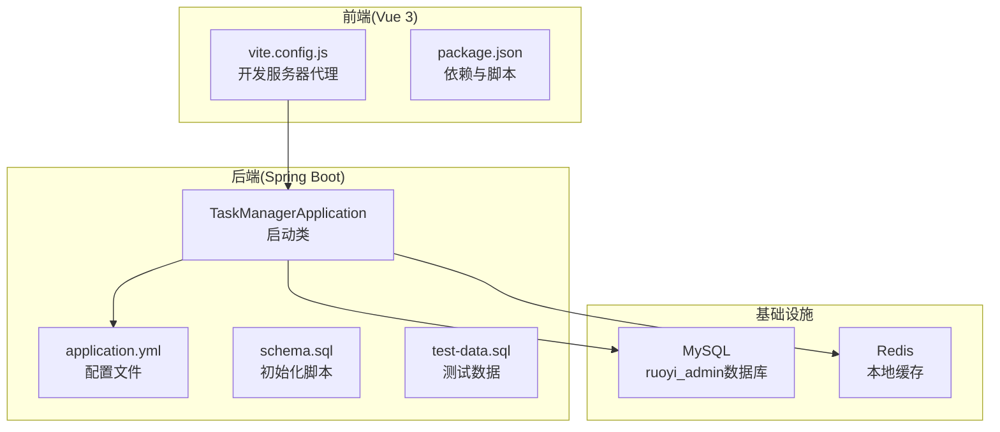
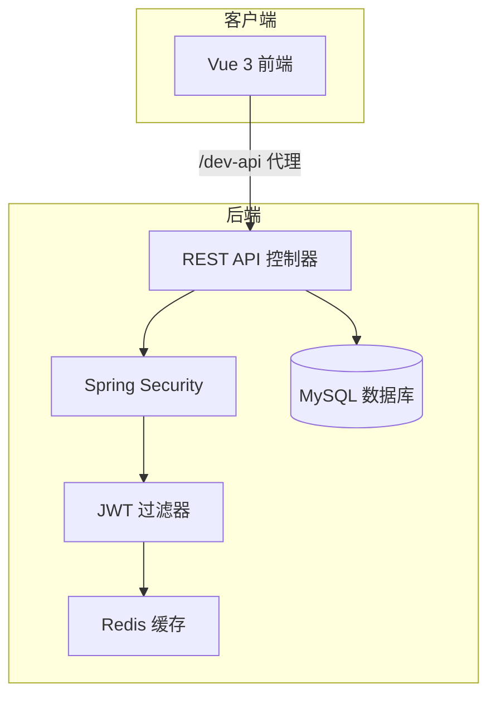
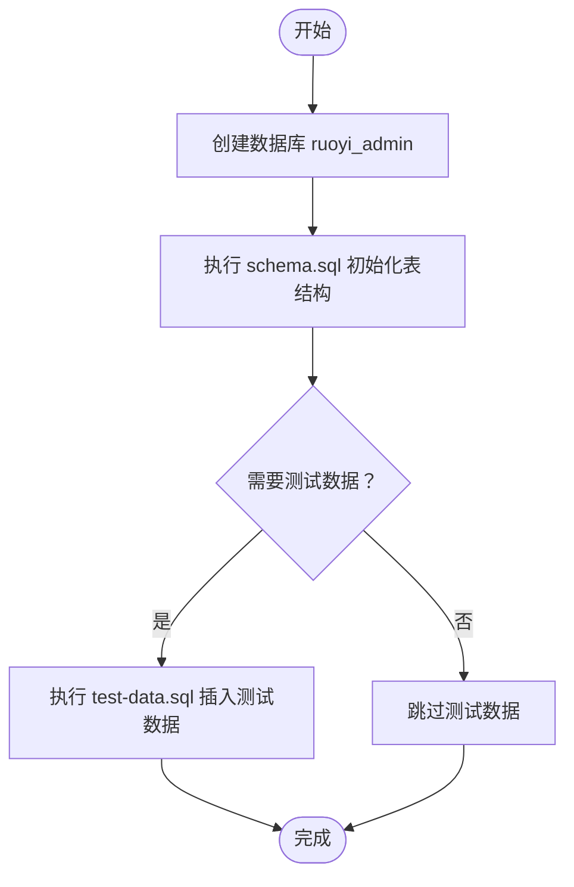
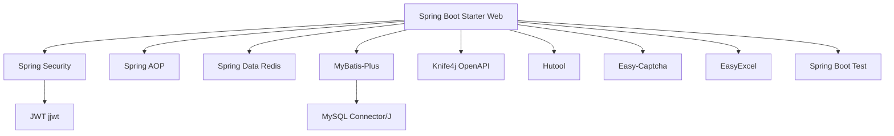

# 快速开始

<cite>
**本文引用的文件**
- [pom.xml](file://task-manager-backend/pom.xml)
- [application.yml](file://task-manager-backend/src/main/resources/application.yml)
- [schema.sql](file://task-manager-backend/src/main/resources/schema.sql)
- [test-data.sql](file://task-manager-backend/src/main/resources/test-data.sql)
- [TaskManagerApplication.java](file://task-manager-backend/src/main/java/com/taskmanager/TaskManagerApplication.java)
- [package.json](file://task-manager-frontend/package.json)
- [vite.config.js](file://task-manager-frontend/vite.config.js)
- [CODEBUDDY.md](file://CODEBUDDY.md)
- [build.bat](file://task-manager-backend/build.bat)
- [application-test.yml](file://task-manager-backend/src/test/resources/application-test.yml)
</cite>

## 目录
1. [简介](#简介)
2. [项目结构](#项目结构)
3. [核心组件](#核心组件)
4. [架构概览](#架构概览)
5. [详细组件分析](#详细组件分析)
6. [依赖分析](#依赖分析)
7. [性能考虑](#性能考虑)
8. [故障排除指南](#故障排除指南)
9. [结论](#结论)
10. [附录](#附录)

## 简介
本指南面向新手开发者，帮助你在30分钟内完成CodeBuddy任务管理系统的环境搭建与运行。你将学到：
- 环境准备：JDK 17、MySQL、Redis的安装与配置
- 后端Spring Boot应用启动：数据库初始化、Redis配置验证
- 前端Vue 3应用安装与运行：Node.js环境、依赖安装、开发服务器启动
- 完整命令行操作流程：从项目克隆到应用成功运行
- 常见问题排查：端口冲突、数据库连接失败、依赖下载超时等
- 开发工具推荐与IDE配置建议

## 项目结构
该项目采用前后端分离架构，后端为Spring Boot应用，前端为Vue 3应用，数据库使用MySQL，缓存使用Redis。



**图表来源**
- [TaskManagerApplication.java:10-16](file://task-manager-backend/src/main/java/com/taskmanager/TaskManagerApplication.java#L10-L16)
- [application.yml:1-79](file://task-manager-backend/src/main/resources/application.yml#L1-L79)
- [schema.sql:1-608](file://task-manager-backend/src/main/resources/schema.sql#L1-L608)
- [test-data.sql:1-558](file://task-manager-backend/src/main/resources/test-data.sql#L1-L558)
- [vite.config.js:14-25](file://task-manager-frontend/vite.config.js#L14-L25)
- [package.json:6-10](file://task-manager-frontend/package.json#L6-L10)

**章节来源**
- [CODEBUDDY.md:40-78](file://CODEBUDDY.md#L40-L78)

## 核心组件
- 后端技术栈：Spring Boot 3.2.0 + Java 17 + MyBatis-Plus + Spring Security + Redis + MySQL
- 前端技术栈：Vue 3 + Vite + Element Plus + Pinia + Vue Router 4
- 核心机制：统一响应格式、分页封装、逻辑删除、RBAC权限控制、操作日志

**章节来源**
- [CODEBUDDY.md:40-44](file://CODEBUDDY.md#L40-L44)
- [CODEBUDDY.md:61-68](file://CODEBUDDY.md#L61-L68)

## 架构概览
系统采用标准的三层架构 + RBAC权限控制，后端分层清晰，前端通过代理访问后端API。



**图表来源**
- [CODEBUDDY.md:49-59](file://CODEBUDDY.md#L49-L59)
- [CODEBUDDY.md:79-85](file://CODEBUDDY.md#L79-L85)
- [vite.config.js:18-24](file://task-manager-frontend/vite.config.js#L18-L24)
- [application.yml:5-79](file://task-manager-backend/src/main/resources/application.yml#L5-L79)

## 详细组件分析

### 环境准备与安装

#### JDK 17
- 版本要求：Java 17
- 验证方式：在命令行输入 java -version
- Maven配置：pom.xml中已设置java.version为17

**章节来源**
- [pom.xml:21-21](file://task-manager-backend/pom.xml#L21-L21)

#### MySQL
- 数据库：ruoyi_admin
- 初始化脚本：schema.sql
- 测试数据：test-data.sql
- 连接配置：application.yml中的datasource.url、username、password

**章节来源**
- [application.yml:5-9](file://task-manager-backend/src/main/resources/application.yml#L5-L9)
- [schema.sql:1-10](file://task-manager-backend/src/main/resources/schema.sql#L1-L10)
- [test-data.sql:1-10](file://task-manager-backend/src/main/resources/test-data.sql#L1-L10)

#### Redis
- 本地默认配置：127.0.0.1:6379
- 连接配置：application.yml中的spring.data.redis.*
- 测试环境禁用Redis自动配置：application-test.yml

**章节来源**
- [application.yml:18-32](file://task-manager-backend/src/main/resources/application.yml#L18-L32)
- [application-test.yml:1-10](file://task-manager-backend/src/test/resources/application-test.yml#L1-L10)

### 后端Spring Boot应用启动步骤

#### 1. 准备数据库
- 创建数据库ruoyi_admin
- 执行schema.sql初始化表结构
- 可选：执行test-data.sql插入测试数据



**图表来源**
- [schema.sql:6-8](file://task-manager-backend/src/main/resources/schema.sql#L6-L8)
- [test-data.sql:1-10](file://task-manager-backend/src/main/resources/test-data.sql#L1-L10)

**章节来源**
- [schema.sql:1-608](file://task-manager-backend/src/main/resources/schema.sql#L1-L608)
- [test-data.sql:1-558](file://task-manager-backend/src/main/resources/test-data.sql#L1-L558)

#### 2. 配置Redis
- 确认Redis服务已启动
- 修改application.yml中的Redis连接信息（如需）
- 验证连接：启动后端应用，观察日志中Redis连接信息

**章节来源**
- [application.yml:18-32](file://task-manager-backend/src/main/resources/application.yml#L18-L32)

#### 3. 启动后端应用
- 方式一：使用Maven Wrapper
  - Windows: ./mvnw.cmd spring-boot:run
  - Linux/Mac: ./mvnw spring-boot:run
- 方式二：使用系统Maven
  - mvn spring-boot:run
- 方式三：使用批处理脚本
  - Windows: build.bat

**章节来源**
- [CODEBUDDY.md:5-21](file://CODEBUDDY.md#L5-L21)
- [build.bat:1-37](file://task-manager-backend/build.bat#L1-L37)

### 前端Vue 3应用安装与运行

#### 1. 安装Node.js
- 版本要求：Node.js 16+
- 验证方式：node -v

#### 2. 安装依赖
- 进入前端目录：cd task-manager-frontend
- 安装依赖：npm install

**章节来源**
- [package.json:6-10](file://task-manager-frontend/package.json#L6-L10)

#### 3. 启动开发服务器
- 开发模式：npm run dev
- 默认端口：3000
- 代理配置：/dev-api 代理到 http://localhost:8080

**章节来源**
- [vite.config.js:14-25](file://task-manager-frontend/vite.config.js#L14-L25)

## 依赖分析

### 后端依赖关系


**图表来源**
- [pom.xml:32-145](file://task-manager-backend/pom.xml#L32-L145)

### 前端依赖关系
```mermaid
graph TB
VUE[Vue 3]
ROUTER[Vue Router 4]
PINIA[Pinia]
AXIOS[Axios]
ELEMENT[Element Plus]
ICONS[@element-plus/icons-vue]
EDITOR[@wangeditor/editor]
EDITOR_VUE[@wangeditor/editor-for-vue]
VITE[Vite]
SASS[Sass]
AUTO_IMPORT[unplugin-auto-import]
COMPONENTS[unplugin-vue-components]
VUE --> ROUTER
VUE --> PINIA
VUE --> AXIOS
VUE --> ELEMENT
ELEMENT --> ICONS
VUE --> EDITOR
EDITOR --> EDITOR_VUE
VITE --> AUTO_IMPORT
VITE --> COMPONENTS
VITE --> SASS
```

**图表来源**
- [package.json:11-28](file://task-manager-frontend/package.json#L11-L28)

**章节来源**
- [pom.xml:1-206](file://task-manager-backend/pom.xml#L1-L206)
- [package.json:1-30](file://task-manager-frontend/package.json#L1-L30)

## 性能考虑
- 连接池配置：HikariCP已在application.yml中配置
- Redis连接池：Lettuce连接池参数已设置
- 日志输出：MyBatis日志已开启，便于调试
- 前端代理：Vite开发服务器代理减少跨域问题

**章节来源**
- [application.yml:11-44](file://task-manager-backend/src/main/resources/application.yml#L11-L44)
- [application.yml:26-32](file://task-manager-backend/src/main/resources/application.yml#L26-L32)

## 故障排除指南

### 端口冲突
- 后端端口：8080（可在application.yml中修改）
- 前端端口：3000（可在vite.config.js中修改）

**章节来源**
- [application.yml:58-60](file://task-manager-backend/src/main/resources/application.yml#L58-L60)
- [vite.config.js:14-17](file://task-manager-frontend/vite.config.js#L14-L17)

### 数据库连接失败
- 检查MySQL服务是否启动
- 验证application.yml中的数据库连接信息
- 确认数据库ruoyi_admin已创建
- 确认schema.sql已正确执行

**章节来源**
- [application.yml:5-9](file://task-manager-backend/src/main/resources/application.yml#L5-L9)
- [schema.sql:6-8](file://task-manager-backend/src/main/resources/schema.sql#L6-L8)

### Redis连接失败
- 检查Redis服务是否启动
- 验证application.yml中的Redis连接信息
- 测试环境可禁用Redis自动配置

**章节来源**
- [application.yml:18-32](file://task-manager-backend/src/main/resources/application.yml#L18-L32)
- [application-test.yml:1-10](file://task-manager-backend/src/test/resources/application-test.yml#L1-L10)

### 依赖下载超时
- 使用npm install --registry https://registry.npmjs.org/
- 检查网络连接
- 考虑使用国内镜像源

**章节来源**
- [package.json:6-10](file://task-manager-frontend/package.json#L6-L10)

### Maven构建失败
- 确认已安装JDK 17
- 检查Maven版本兼容性
- 使用build.bat简化构建过程

**章节来源**
- [build.bat:1-37](file://task-manager-backend/build.bat#L1-L37)

## 结论
通过本指南，你可以在30分钟内完成CodeBuddy任务管理系统的环境搭建与运行。建议按照以下顺序进行：
1. 安装JDK 17、MySQL、Redis
2. 初始化数据库（执行schema.sql）
3. 启动后端应用
4. 安装前端依赖并启动开发服务器
5. 访问前端页面进行验证

如遇问题，可参考故障排除指南中的具体解决方案。

## 附录

### 开发工具推荐
- IDE：IntelliJ IDEA 或 VS Code
- 浏览器：Chrome（配合Vue DevTools）
- 数据库工具：Navicat 或 MySQL Workbench
- API测试：Postman

### IDE配置建议
- 后端：启用Lombok支持，配置JDK 17
- 前端：安装Vue相关插件，配置ESLint
- 调试：后端使用Spring Boot热部署，前端使用Vite HMR

### 常用命令清单
- 后端：./mvnw.cmd spring-boot:run
- 前端：npm run dev
- 构建：npm run build
- 预览：npm run preview

**章节来源**
- [CODEBUDDY.md:3-38](file://CODEBUDDY.md#L3-L38)