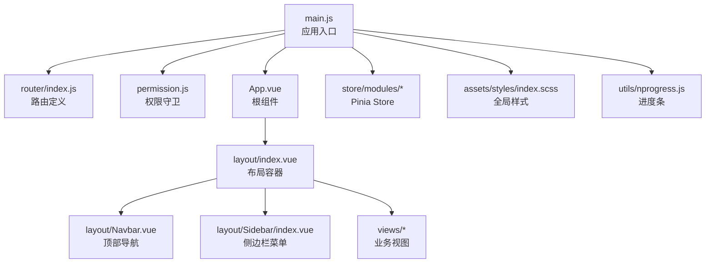
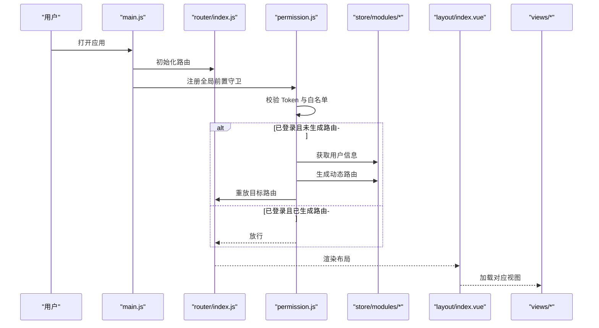

# 前端性能优化

<cite>
**本文引用的文件**
- [vite.config.js](file://task-manager-frontend/vite.config.js)
- [package.json](file://task-manager-frontend/package.json)
- [main.js](file://task-manager-frontend/src/main.js)
- [router/index.js](file://task-manager-frontend/src/router/index.js)
- [App.vue](file://task-manager-frontend/src/App.vue)
- [permission.js](file://task-manager-frontend/src/permission.js)
- [utils/nprogress.js](file://task-manager-frontend/src/utils/nprogress.js)
- [assets/styles/index.scss](file://task-manager-frontend/src/assets/styles/index.scss)
- [layout/index.vue](file://task-manager-frontend/src/layout/index.vue)
- [layout/Navbar.vue](file://task-manager-frontend/src/layout/Navbar.vue)
- [layout/Sidebar/index.vue](file://task-manager-frontend/src/layout/Sidebar/index.vue)
- [store/modules/useAppStore.js](file://task-manager-frontend/src/store/modules/useAppStore.js)
- [store/modules/useUserStore.js](file://task-manager-frontend/src/store/modules/useUserStore.js)
- [views/dashboard/index.vue](file://task-manager-frontend/src/views/dashboard/index.vue)
</cite>

## 目录
1. [简介](#简介)
2. [项目结构](#项目结构)
3. [核心组件](#核心组件)
4. [架构总览](#架构总览)
5. [详细组件分析](#详细组件分析)
6. [依赖分析](#依赖分析)
7. [性能考量与优化建议](#性能考量与优化建议)
8. [故障排查指南](#故障排查指南)
9. [结论](#结论)
10. [附录](#附录)

## 简介
本文件面向 CodeBuddy 任务管理系统前端（基于 Vue 3 + Vite），围绕构建配置优化、代码分割与 Tree Shaking、懒加载与按需加载、资源压缩与 CDN、性能监控与兼容性优化等主题，提供可落地的优化方案与最佳实践。文档同时结合现有仓库中的路由、权限、状态管理与样式体系，给出针对性改进建议。

## 项目结构
任务管理系统前端采用模块化组织方式：
- 构建与运行：Vite 配置集中于根目录配置文件，脚本在 package.json 中定义
- 应用入口：main.js 初始化应用、注册插件、挂载路由与状态管理
- 路由与权限：router/index.js 定义基础路由；permission.js 实现鉴权与动态路由注入
- 布局与视图：layout 提供侧边栏、顶部导航与主内容区；views 下按功能域划分页面
- 状态管理：Pinia Store 模块化管理应用状态与用户信息
- 样式与图标：SCSS 全局样式与 Element Plus 图标全局注册

图表来源
- [main.js:1-24](file://task-manager-frontend/src/main.js#L1-L24)
- [router/index.js:1-32](file://task-manager-frontend/src/router/index.js#L1-L32)
- [permission.js:1-53](file://task-manager-frontend/src/permission.js#L1-L53)
- [App.vue:1-4](file://task-manager-frontend/src/App.vue#L1-L4)
- [layout/index.vue:1-50](file://task-manager-frontend/src/layout/index.vue#L1-L50)
- [layout/Navbar.vue:1-120](file://task-manager-frontend/src/layout/Navbar.vue#L1-L120)
- [layout/Sidebar/index.vue:1-139](file://task-manager-frontend/src/layout/Sidebar/index.vue#L1-L139)
- [assets/styles/index.scss:1-106](file://task-manager-frontend/src/assets/styles/index.scss#L1-L106)
- [utils/nprogress.js:1-7](file://task-manager-frontend/src/utils/nprogress.js#L1-L7)

章节来源
- [vite.config.js:1-28](file://task-manager-frontend/vite.config.js#L1-L28)
- [package.json:1-30](file://task-manager-frontend/package.json#L1-L30)
- [main.js:1-24](file://task-manager-frontend/src/main.js#L1-L24)

## 核心组件
- 应用入口与插件注册：在入口中注册 Element Plus、路由、Pinia，并全局注册图标组件，便于后续按需引入与 Tree Shaking
- 路由与懒加载：登录与错误页采用动态导入实现按需加载；首页布局作为常驻组件保持稳定
- 权限与动态路由：通过守卫在首次登录后拉取用户信息并生成动态路由，减少初始包体
- 布局与状态：侧边栏与顶部导航通过 Pinia 控制展开/收起状态，配合 SCSS 变量与过渡动画提升交互体验
- 样式与进度条：全局样式覆盖 Element Plus 组件风格；NProgress 通过类名控制加载动画

章节来源
- [main.js:1-24](file://task-manager-frontend/src/main.js#L1-L24)
- [router/index.js:1-32](file://task-manager-frontend/src/router/index.js#L1-L32)
- [permission.js:1-53](file://task-manager-frontend/src/permission.js#L1-L53)
- [layout/index.vue:1-50](file://task-manager-frontend/src/layout/index.vue#L1-L50)
- [layout/Navbar.vue:1-120](file://task-manager-frontend/src/layout/Navbar.vue#L1-L120)
- [layout/Sidebar/index.vue:1-139](file://task-manager-frontend/src/layout/Sidebar/index.vue#L1-L139)
- [assets/styles/index.scss:1-106](file://task-manager-frontend/src/assets/styles/index.scss#L1-L106)
- [utils/nprogress.js:1-7](file://task-manager-frontend/src/utils/nprogress.js#L1-L7)

## 架构总览
下图展示从应用启动到页面渲染的关键流程，包括路由守卫、动态路由生成与视图加载：

图表来源
- [main.js:1-24](file://task-manager-frontend/src/main.js#L1-L24)
- [router/index.js:1-32](file://task-manager-frontend/src/router/index.js#L1-L32)
- [permission.js:1-53](file://task-manager-frontend/src/permission.js#L1-L53)
- [layout/index.vue:1-50](file://task-manager-frontend/src/layout/index.vue#L1-L50)

## 详细组件分析

### 构建与开发服务器配置（Vite）
- 插件与别名：启用 Vue 插件与路径别名，简化导入路径
- 本地代理：将 /dev-api 代理至后端服务，便于开发调试
- 服务器：开放主机、端口与跨域允许，便于多机联调

章节来源
- [vite.config.js:1-28](file://task-manager-frontend/vite.config.js#L1-L28)

### 路由与懒加载
- 登录与 404 页面采用动态导入，实现按需加载，降低首屏包体
- 首页布局组件常驻，减少重复加载成本
- 建议：对业务视图进一步拆分，按模块或页面粒度进行动态导入

章节来源
- [router/index.js:1-32](file://task-manager-frontend/src/router/index.js#L1-L32)
- [App.vue:1-4](file://task-manager-frontend/src/App.vue#L1-L4)

### 权限与动态路由
- 在前置守卫中判断 Token 与白名单，未登录跳转登录页
- 首次进入时拉取用户信息并生成动态路由，避免将全部路由打包进初始包
- 成功后重放目标路由，确保导航一致性

章节来源
- [permission.js:1-53](file://task-manager-frontend/src/permission.js#L1-L53)

### 布局与状态管理
- 侧边栏与顶部导航通过 Pinia 控制展开/收起状态，本地持久化开关
- 布局容器根据侧边栏状态调整主内容区宽度，保证视觉一致性

章节来源
- [layout/index.vue:1-50](file://task-manager-frontend/src/layout/index.vue#L1-L50)
- [layout/Navbar.vue:1-120](file://task-manager-frontend/src/layout/Navbar.vue#L1-L120)
- [layout/Sidebar/index.vue:1-139](file://task-manager-frontend/src/layout/Sidebar/index.vue#L1-L139)
- [store/modules/useAppStore.js:1-24](file://task-manager-frontend/src/store/modules/useAppStore.js#L1-L24)

### 样式与图标
- 全局 SCSS 定义颜色、尺寸与过渡动画，覆盖 Element Plus 组件风格
- 图标通过遍历注册，建议改为按需自动导入以减少打包体积

章节来源
- [assets/styles/index.scss:1-106](file://task-manager-frontend/src/assets/styles/index.scss#L1-L106)
- [main.js:1-24](file://task-manager-frontend/src/main.js#L1-L24)

### 进度条与首屏体验
- NProgress 通过类名控制加载动画，结合路由守卫在每次导航开始与结束时控制显示/隐藏
- 建议：在关键页面（如仪表盘）增加骨架屏或占位符，改善感知性能

章节来源
- [utils/nprogress.js:1-7](file://task-manager-frontend/src/utils/nprogress.js#L1-L7)
- [permission.js:10-12](file://task-manager-frontend/src/permission.js#L10-L12)
- [permission.js:50-52](file://task-manager-frontend/src/permission.js#L50-L52)
- [views/dashboard/index.vue:88-112](file://task-manager-frontend/src/views/dashboard/index.vue#L88-L112)

## 依赖分析
- 运行时依赖：Vue 3、Vue Router、Pinia、Element Plus、Axios、NProgress、wangEditor 等
- 开发依赖：Vite、@vitejs/plugin-vue、Sass、unplugin-auto-import、unplugin-vue-components
- 优化潜力：通过按需导入与自动组件注册减少冗余代码；结合 Tree Shaking 与代码分割进一步瘦身

章节来源
- [package.json:1-30](file://task-manager-frontend/package.json#L1-L30)

## 性能考量与优化建议

### Vite 构建配置优化
- 代码分割策略
  - 将大型视图与第三方库拆分为独立 chunk，利用路由级动态导入实现按需加载
  - 对 Element Plus 组件与图标采用按需导入，减少全局样式与组件体积
- Tree Shaking 配置
  - 使用 unplugin-auto-import 与 unplugin-vue-components 自动按需引入 API 与组件，提升摇树效率
  - 确保第三方库支持 ES Module 导入，避免打包整包
- Bundle 分析工具
  - 引入可视化分析工具（如 rollup-plugin-visualizer 或 vite-bundle-analyzer），定期检查包体构成，定位大体积依赖与重复模块

章节来源
- [package.json:22-28](file://task-manager-frontend/package.json#L22-L28)
- [main.js:15-18](file://task-manager-frontend/src/main.js#L15-L18)

### 组件懒加载与按需加载
- 路由级别懒加载：登录、404 等页面已采用动态导入；建议对业务视图进一步拆分
- 动态导入优化：对重型编辑器、图表库等组件采用异步加载，结合骨架屏提升感知速度
- 图标与组件：将 Element Plus 图标改为按需注册，减少初始包体

章节来源
- [router/index.js:7-14](file://task-manager-frontend/src/router/index.js#L7-L14)
- [main.js:15-18](file://task-manager-frontend/src/main.js#L15-L18)

### 资源压缩与优化
- 图片压缩：对背景图与图标使用 WebP 或 SVG，必要时进行压缩与懒加载
- CSS 压缩：启用 PostCSS 与 PurgeCSS 移除未使用样式，结合 SCSS 变量复用减少体积
- JavaScript 压缩：Vite 默认开启生产环境压缩；建议开启长缓存与资源哈希
- HTML 压缩：移除注释与多余空白，保留必要的 meta 与 preload 指令

章节来源
- [assets/styles/index.scss:1-106](file://task-manager-frontend/src/assets/styles/index.scss#L1-L106)

### CDN 优化与缓存策略
- 静态资源 CDN：将公共依赖（如 Vue、Element Plus、图标）指向 CDN，降低主站带宽压力
- 版本控制：为静态资源添加内容哈希后缀，确保缓存失效与更新同步
- 缓存策略：对第三方库设置强缓存（如一年），对入口与变更频繁资源设置协商缓存

章节来源
- [vite.config.js:14-25](file://task-manager-frontend/vite.config.js#L14-L25)

### 前端性能监控
- 页面加载时间：使用 Performance API 与 Navigation Timing API 记录 TTFB、FCP、LCP、INP 等指标
- 首屏渲染时间：结合骨架屏与关键渲染路径优化，测量首屏可交互时间（TTI）
- 交互延迟：监控用户操作到响应的时间（CLS、INP），对长任务进行拆分与优先级调度
- 建议埋点：在路由守卫与关键业务节点埋点，结合后端日志聚合分析

章节来源
- [permission.js:10-12](file://task-manager-frontend/src/permission.js#L10-L12)
- [permission.js:50-52](file://task-manager-frontend/src/permission.js#L50-L52)

### 浏览器兼容性与移动端优化
- 浏览器兼容：针对旧版浏览器启用 polyfill 与预设转换，确保语法与 API 可用
- 移动端优化：采用弹性布局与媒体查询适配不同屏幕；对触摸事件与滚动性能进行专项优化

章节来源
- [main.js:1-24](file://task-manager-frontend/src/main.js#L1-L24)

## 故障排查指南
- 路由跳转异常
  - 检查动态导入路径是否正确，确认模块导出命名与导入一致
  - 关注权限守卫中的重放逻辑，避免循环跳转
- 样式覆盖问题
  - 确认全局样式加载顺序，避免组件作用域样式被覆盖
  - 使用深度选择器或 CSS 变量统一主题色
- 进度条不消失
  - 确保每次导航结束后调用完成方法，避免阻塞在加载状态
- 首屏白屏
  - 检查关键渲染路径，对重型组件采用懒加载与骨架屏

章节来源
- [router/index.js:7-14](file://task-manager-frontend/src/router/index.js#L7-L14)
- [permission.js:10-12](file://task-manager-frontend/src/permission.js#L10-L12)
- [permission.js:50-52](file://task-manager-frontend/src/permission.js#L50-L52)
- [utils/nprogress.js:1-7](file://task-manager-frontend/src/utils/nprogress.js#L1-L7)

## 结论
通过在现有路由与权限体系基础上引入更细粒度的懒加载、按需导入与资源优化策略，并结合 CDN 与缓存机制，可显著降低首屏包体与加载时间。配合性能监控与兼容性优化，能够持续提升用户体验与系统稳定性。

## 附录
- 优化清单
  - 路由级动态导入：对业务视图进一步拆分
  - 按需导入：Element Plus 组件与图标
  - 构建分析：引入 bundle 分析工具
  - 资源优化：图片、CSS、JS、HTML 压缩
  - CDN 与缓存：第三方库 CDN 化与版本哈希
  - 性能监控：加载时间、首屏渲染、交互延迟
  - 兼容性与移动端：polyfill 与响应式设计