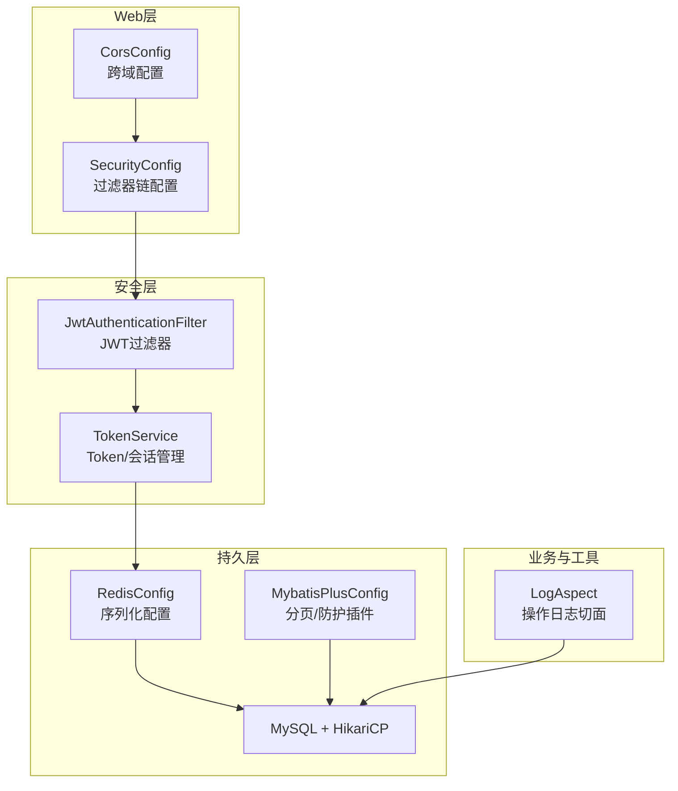
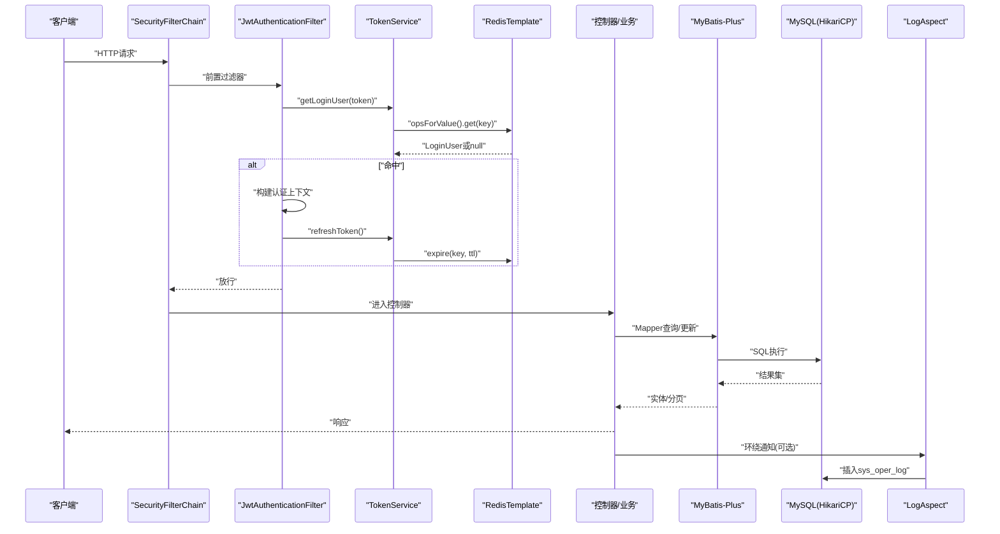
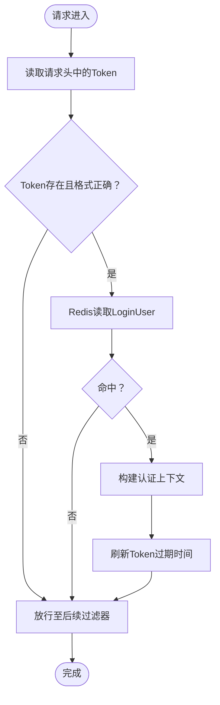
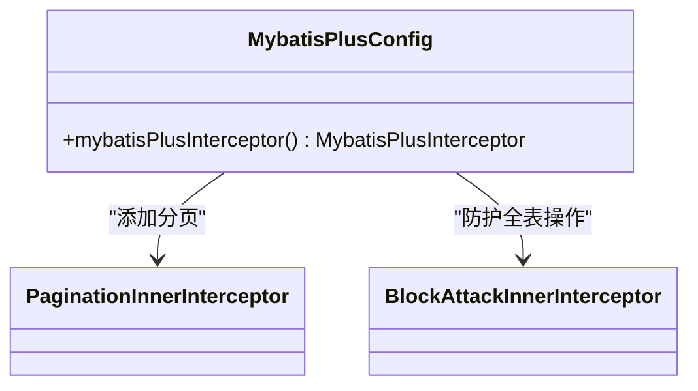
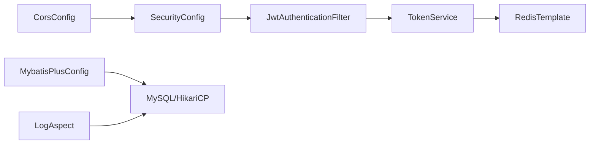

# 后端性能优化

<cite>
**本文引用的文件**
- [application.yml](file://task-manager-backend/src/main/resources/application.yml)
- [pom.xml](file://task-manager-backend/pom.xml)
- [SecurityConfig.java](file://task-manager-backend/src/main/java/com/taskmanager/config/SecurityConfig.java)
- [JwtAuthenticationFilter.java](file://task-manager-backend/src/main/java/com/taskmanager/security/JwtAuthenticationFilter.java)
- [TokenService.java](file://task-manager-backend/src/main/java/com/taskmanager/security/TokenService.java)
- [MybatisPlusConfig.java](file://task-manager-backend/src/main/java/com/taskmanager/config/MybatisPlusConfig.java)
- [RedisConfig.java](file://task-manager-backend/src/main/java/com/taskmanager/config/RedisConfig.java)
- [CorsConfig.java](file://task-manager-backend/src/main/java/com/taskmanager/config/CorsConfig.java)
- [LogAspect.java](file://task-manager-backend/src/main/java/com/taskmanager/aspect/LogAspect.java)
- [Task.java](file://task-manager-backend/src/main/java/com/taskmanager/entity/Task.java)
- [SysUser.java](file://task-manager-backend/src/main/java/com/taskmanager/domain/SysUser.java)
</cite>

## 目录
1. [引言](#引言)
2. [项目结构](#项目结构)
3. [核心组件](#核心组件)
4. [架构总览](#架构总览)
5. [详细组件分析](#详细组件分析)
6. [依赖关系分析](#依赖关系分析)
7. [性能考量](#性能考量)
8. [故障排查指南](#故障排查指南)
9. [结论](#结论)
10. [附录](#附录)

## 引言
本文件面向CodeBuddy任务管理系统后端，聚焦Spring Boot应用的性能优化实践，围绕线程池与异步处理、WebMvc配置调优、JWT认证过滤器性能优化（含Token验证缓存、过滤器链优化、并发处理能力）、批量操作优化（批量插入/更新/删除）、数据库访问层优化（MyBatis-Plus配置、二级缓存、查询结果集优化）、并发性能优化（线程安全、锁优化、无锁数据结构）、以及后端性能监控与瓶颈识别方法展开。文档以仓库现有配置与代码为依据，提供可落地的优化建议与可视化图示。

## 项目结构
后端采用Spring Boot 3.2 + Spring Security + MyBatis-Plus + Redis + MySQL的典型企业级架构。核心模块包括：
- 安全与认证：基于JWT的无状态认证，前置过滤器链在用户名密码过滤器之前执行
- 数据访问：MyBatis-Plus + HikariCP连接池 + Redis缓存
- 日志与可观测性：基于AOP的操作日志切面
- 跨域与文档：CORS配置与Knife4j OpenAPI文档

图表来源
- [SecurityConfig.java:47-97](file://task-manager-backend/src/main/java/com/taskmanager/config/SecurityConfig.java#L47-L97)
- [JwtAuthenticationFilter.java:37-57](file://task-manager-backend/src/main/java/com/taskmanager/security/JwtAuthenticationFilter.java#L37-L57)
- [TokenService.java:34-87](file://task-manager-backend/src/main/java/com/taskmanager/security/TokenService.java#L34-L87)
- [MybatisPlusConfig.java:22-30](file://task-manager-backend/src/main/java/com/taskmanager/config/MybatisPlusConfig.java#L22-L30)
- [RedisConfig.java:18-31](file://task-manager-backend/src/main/java/com/taskmanager/config/RedisConfig.java#L18-L31)
- [CorsConfig.java:21-45](file://task-manager-backend/src/main/java/com/taskmanager/config/CorsConfig.java#L21-L45)
- [LogAspect.java:44-97](file://task-manager-backend/src/main/java/com/taskmanager/aspect/LogAspect.java#L44-L97)

章节来源
- [application.yml:1-79](file://task-manager-backend/src/main/resources/application.yml#L1-L79)
- [pom.xml:1-206](file://task-manager-backend/pom.xml#L1-L206)

## 核心组件
- 安全与过滤器链：无状态会话、禁用CSRF、基于Ant匹配的放行规则、JWT前置过滤器
- JWT认证过滤器：从请求头提取Token、从Redis解析用户、构建认证上下文、自动续期
- Token服务：基于Redis的Token创建/刷新/删除，带过期时间
- MyBatis-Plus：分页插件与全表更新/删除防护
- Redis：字符串Key序列化、JSON值序列化
- CORS：高优先级跨域过滤器
- 操作日志切面：环绕通知记录请求/响应、耗时、异常等

章节来源
- [SecurityConfig.java:36-97](file://task-manager-backend/src/main/java/com/taskmanager/config/SecurityConfig.java#L36-L97)
- [JwtAuthenticationFilter.java:23-69](file://task-manager-backend/src/main/java/com/taskmanager/security/JwtAuthenticationFilter.java#L23-L69)
- [TokenService.java:18-88](file://task-manager-backend/src/main/java/com/taskmanager/security/TokenService.java#L18-L88)
- [MybatisPlusConfig.java:16-31](file://task-manager-backend/src/main/java/com/taskmanager/config/MybatisPlusConfig.java#L16-L31)
- [RedisConfig.java:15-32](file://task-manager-backend/src/main/java/com/taskmanager/config/RedisConfig.java#L15-L32)
- [CorsConfig.java:17-46](file://task-manager-backend/src/main/java/com/taskmanager/config/CorsConfig.java#L17-L46)
- [LogAspect.java:27-137](file://task-manager-backend/src/main/java/com/taskmanager/aspect/LogAspect.java#L27-L137)

## 架构总览
下图展示请求从进入Web层到安全认证、缓存读取、数据库访问与日志记录的整体流程。

图表来源
- [SecurityConfig.java:47-97](file://task-manager-backend/src/main/java/com/taskmanager/config/SecurityConfig.java#L47-L97)
- [JwtAuthenticationFilter.java:37-57](file://task-manager-backend/src/main/java/com/taskmanager/security/JwtAuthenticationFilter.java#L37-L57)
- [TokenService.java:49-71](file://task-manager-backend/src/main/java/com/taskmanager/security/TokenService.java#L49-L71)
- [RedisConfig.java:18-31](file://task-manager-backend/src/main/java/com/taskmanager/config/RedisConfig.java#L18-L31)
- [MybatisPlusConfig.java:22-30](file://task-manager-backend/src/main/java/com/taskmanager/config/MybatisPlusConfig.java#L22-L30)
- [LogAspect.java:44-97](file://task-manager-backend/src/main/java/com/taskmanager/aspect/LogAspect.java#L44-L97)

## 详细组件分析

### 安全与JWT认证过滤器优化
- 无状态会话与过滤器链
  - 会话策略设为STATELESS，避免Session开销
  - 基于AntPathRequestMatcher精确放行登录、注册、验证码、公开字典、Knife4j文档等接口
  - 在UsernamePasswordAuthenticationFilter前添加JWT过滤器，确保鉴权前置
- Token验证缓存与续期
  - Token存储于Redis，Key前缀统一，Value为LoginUser对象，序列化为JSON
  - 读取命中后直接构建认证上下文，避免重复数据库校验
  - 每次有效请求自动续期，降低频繁登录成本
- 并发处理能力
  - Redis单线程命令模型天然线程安全；TokenService方法均为幂等读写
  - 建议：对高频接口增加本地缓存（如Guava/Caffeine）短期命中，进一步降低Redis压力

图表来源
- [JwtAuthenticationFilter.java:37-57](file://task-manager-backend/src/main/java/com/taskmanager/security/JwtAuthenticationFilter.java#L37-L57)
- [TokenService.java:49-71](file://task-manager-backend/src/main/java/com/taskmanager/security/TokenService.java#L49-L71)
- [RedisConfig.java:18-31](file://task-manager-backend/src/main/java/com/taskmanager/config/RedisConfig.java#L18-L31)

章节来源
- [SecurityConfig.java:47-97](file://task-manager-backend/src/main/java/com/taskmanager/config/SecurityConfig.java#L47-L97)
- [JwtAuthenticationFilter.java:23-69](file://task-manager-backend/src/main/java/com/taskmanager/security/JwtAuthenticationFilter.java#L23-L69)
- [TokenService.java:18-88](file://task-manager-backend/src/main/java/com/taskmanager/security/TokenService.java#L18-L88)
- [RedisConfig.java:15-32](file://task-manager-backend/src/main/java/com/taskmanager/config/RedisConfig.java#L15-L32)

### WebMvc配置与线程池优化
- 当前配置要点
  - Jackson日期格式与时区：统一输出格式，减少前端解析成本
  - Knife4j文档：按包扫描控制器，便于API治理
  - 服务器端口：8080
- 线程池与Web调优建议
  - Undertow/NIO线程池：根据CPU核数与QPS设定I/O线程与worker线程比例
  - WebMvc异步：对长耗时接口启用@Async，配合线程池隔离阻塞任务
  - 跨域：CORS高优先级过滤器已配置，注意与安全过滤器顺序
  - 响应压缩：开启Gzip/Deflate，降低大响应体积
  - 缓存控制：静态资源与只读接口设置合理Cache-Control

章节来源
- [application.yml:46-79](file://task-manager-backend/src/main/resources/application.yml#L46-L79)
- [CorsConfig.java:17-46](file://task-manager-backend/src/main/java/com/taskmanager/config/CorsConfig.java#L17-L46)

### 数据库访问层优化（MyBatis-Plus）
- 插件配置
  - 分页插件：MySQL分页拦截，避免全表扫描
  - 全表更新/删除防护：防止误操作导致性能灾难
- 查询优化建议
  - Mapper XML中显式选择列，避免SELECT *
  - 合理使用条件构造器，避免N+1查询
  - 结果集映射：实体类字段与数据库一致命名，开启驼峰映射
- 事务与连接
  - HikariCP连接池：最小空闲、最大池大小、空闲超时、最大生命周期、连接超时均已在配置中给出
  - 事务粒度：批量操作使用事务，减少往返开销
  - 只读查询：标记只读事务，走只读连接池

图表来源
- [MybatisPlusConfig.java:22-30](file://task-manager-backend/src/main/java/com/taskmanager/config/MybatisPlusConfig.java#L22-L30)

章节来源
- [MybatisPlusConfig.java:16-31](file://task-manager-backend/src/main/java/com/taskmanager/config/MybatisPlusConfig.java#L16-L31)
- [application.yml:33-44](file://task-manager-backend/src/main/resources/application.yml#L33-L44)

### Redis缓存与序列化优化
- Key/Value序列化
  - Key使用String序列化，避免乱码
  - Value使用JSON序列化，支持复杂对象
- Token存储策略
  - TTL与自动续期结合，避免热点Key过期风暴
  - 建议：对高并发场景增加Token热点Key的本地缓存（短TTL）
- 并发与一致性
  - Redis命令单线程，天然线程安全
  - 批量操作使用pipeline减少RTT

章节来源
- [RedisConfig.java:15-32](file://task-manager-backend/src/main/java/com/taskmanager/config/RedisConfig.java#L15-L32)
- [TokenService.java:34-87](file://task-manager-backend/src/main/java/com/taskmanager/security/TokenService.java#L34-L87)

### 操作日志切面与性能影响
- 切面职责
  - 记录请求URL、方法、参数（过滤敏感字段）、响应结果（可选）、耗时、异常
  - 写入sys_oper_log表
- 性能注意事项
  - 参数与响应体序列化可能带来CPU与内存开销，建议仅对关键接口开启
  - 异常捕获与日志落库在finally中执行，避免阻塞主业务线程
  - 建议：对高频接口关闭保存响应数据，或采用异步落库

章节来源
- [LogAspect.java:27-137](file://task-manager-backend/src/main/java/com/taskmanager/aspect/LogAspect.java#L27-L137)

### 并发性能优化（线程安全、锁优化、无锁结构）
- 线程安全
  - Spring组件默认单例，避免在实例变量中存放可变状态
  - Redis命令天然线程安全，但业务逻辑需保证幂等
- 锁优化
  - 减少分布式锁粒度，避免热点Key争用
  - 使用Redisson等客户端的RedLock或Lua脚本保证原子性
- 无锁数据结构
  - 对高频计数/限流场景，使用Redis HyperLogLog、布隆过滤器
  - 本地缓存使用ConcurrentHashMap，注意容量与过期策略

[本节为通用指导，不直接分析具体文件]

### 批量操作优化策略
- 批量插入
  - MyBatis-Plus BatchInsert：Mapper批量插入，SQL合并
  - JDBC批量：Statement.addBatch/executeBatch
- 批量更新/删除
  - 条件构造器批量更新，避免逐条UPDATE
  - 使用物理分页，分批提交，控制事务大小
- 并发与事务
  - 控制批次大小，避免长时间持有行锁
  - 使用只读事务与异步落库，降低主流程阻塞

[本节为通用指导，不直接分析具体文件]

## 依赖关系分析
- 组件耦合
  - SecurityConfig依赖JwtAuthenticationFilter与ObjectMapper
  - JwtAuthenticationFilter依赖TokenService
  - TokenService依赖RedisTemplate与配置项
  - MybatisPlusConfig独立提供插件
  - LogAspect依赖Mapper与ObjectMapper
- 外部依赖
  - Spring Boot Starter Web/Security/AOP/Redis/MyBatis-Plus
  - MySQL Connector/J
  - jjwt（JWT）
  - Knife4j（OpenAPI）

图表来源
- [SecurityConfig.java:36-42](file://task-manager-backend/src/main/java/com/taskmanager/config/SecurityConfig.java#L36-L42)
- [JwtAuthenticationFilter.java:31-35](file://task-manager-backend/src/main/java/com/taskmanager/security/JwtAuthenticationFilter.java#L31-L35)
- [TokenService.java:25-26](file://task-manager-backend/src/main/java/com/taskmanager/security/TokenService.java#L25-L26)
- [MybatisPlusConfig.java:22-30](file://task-manager-backend/src/main/java/com/taskmanager/config/MybatisPlusConfig.java#L22-L30)
- [LogAspect.java:33-38](file://task-manager-backend/src/main/java/com/taskmanager/aspect/LogAspect.java#L33-L38)
- [CorsConfig.java:21-45](file://task-manager-backend/src/main/java/com/taskmanager/config/CorsConfig.java#L21-L45)

章节来源
- [pom.xml:32-145](file://task-manager-backend/pom.xml#L32-L145)

## 性能考量
- CPU使用率
  - 关注JWT解析、Redis序列化/反序列化、日志JSON序列化
  - 对热点接口启用本地缓存与异步落库
- 内存占用
  - Redis对象序列化体积控制，避免大对象频繁读写
  - Jackson时间格式化与时区设置减少字符串转换
- GC频率
  - 控制日志与JSON对象生命周期，避免临时对象逃逸
  - 合理设置Redis过期时间，避免大量Key同时过期
- I/O与网络
  - 启用Gzip压缩、合理设置连接池与超时
  - 对只读接口开启缓存与CDN（静态资源）

[本节为通用指导，不直接分析具体文件]

## 故障排查指南
- 认证失败/401
  - 检查请求头是否包含正确的Authorization前缀与Token
  - 核对Redis中是否存在对应Key，TTL是否过期
  - 查看SecurityConfig放行规则是否覆盖该路径
- 性能瓶颈定位
  - 使用JFR/Arthas采集CPU与堆栈，定位热点方法
  - 观察Redis慢查询日志，排查序列化与Key设计
  - 分析日志切面耗时，评估是否需要降级
- 数据库慢查询
  - 检查Mapper SQL与索引，避免全表扫描
  - 分页参数是否合理，避免超大offset

章节来源
- [SecurityConfig.java:47-97](file://task-manager-backend/src/main/java/com/taskmanager/config/SecurityConfig.java#L47-L97)
- [JwtAuthenticationFilter.java:37-57](file://task-manager-backend/src/main/java/com/taskmanager/security/JwtAuthenticationFilter.java#L37-L57)
- [TokenService.java:49-71](file://task-manager-backend/src/main/java/com/taskmanager/security/TokenService.java#L49-L71)
- [LogAspect.java:44-97](file://task-manager-backend/src/main/java/com/taskmanager/aspect/LogAspect.java#L44-L97)

## 结论
本项目已具备良好的无状态认证与基础性能配置（Redis缓存、分页插件、CORS）。建议在以下方面持续优化：JWT过滤器链与Token缓存的并发能力、Web层线程池与异步处理、数据库批量操作与索引优化、日志切面的异步化与采样、以及完善的性能监控与压测体系。通过这些措施，可在保障稳定性的同时显著提升吞吐与延迟表现。

## 附录
- 实体参考
  - 任务实体：包含主键、标题、描述、完成状态、用户ID、创建时间
  - 用户实体：包含用户ID、部门ID、账号、昵称、邮箱、手机、性别、头像、密码、状态、删除标志、登录信息、创建/更新时间等

章节来源
- [Task.java:10-50](file://task-manager-backend/src/main/java/com/taskmanager/entity/Task.java#L10-L50)
- [SysUser.java:11-80](file://task-manager-backend/src/main/java/com/taskmanager/domain/SysUser.java#L11-L80)