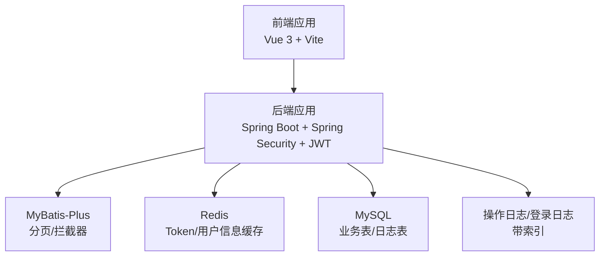
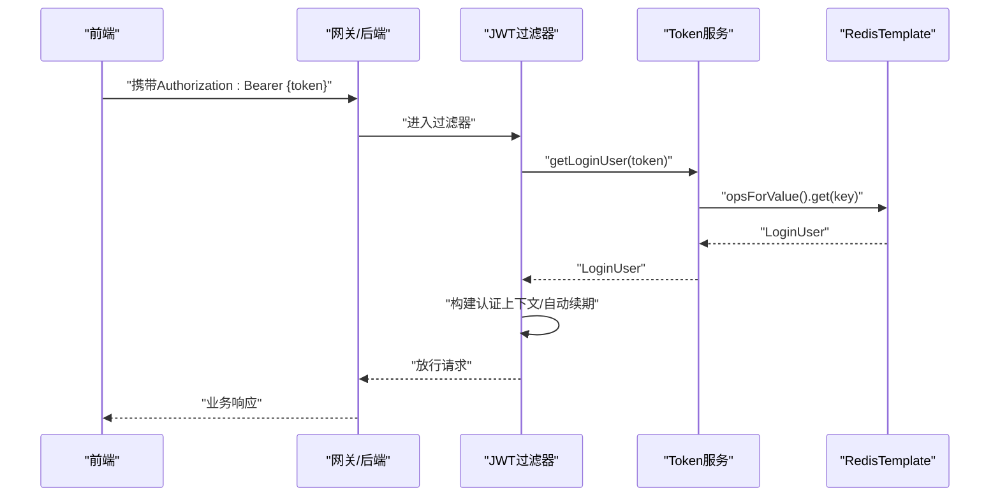
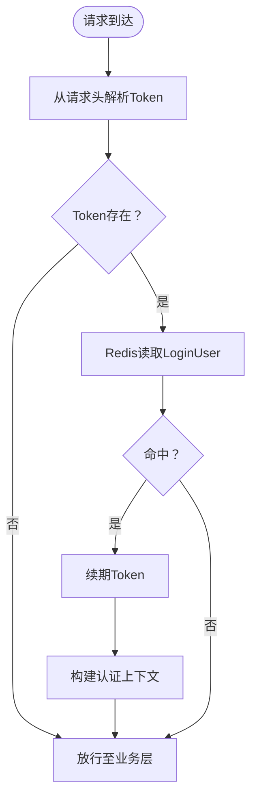
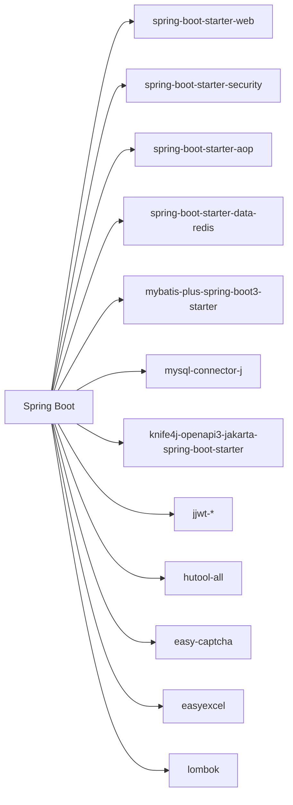

# 性能优化

<cite>
**本文引用的文件**
- [application.yml](file://task-manager-backend/src/main/resources/application.yml)
- [RedisConfig.java](file://task-manager-backend/src/main/java/com/taskmanager/config/RedisConfig.java)
- [MybatisPlusConfig.java](file://task-manager-backend/src/main/java/com/taskmanager/config/MybatisPlusConfig.java)
- [TokenService.java](file://task-manager-backend/src/main/java/com/taskmanager/security/TokenService.java)
- [JwtAuthenticationFilter.java](file://task-manager-backend/src/main/java/com/taskmanager/security/JwtAuthenticationFilter.java)
- [SysLoginController.java](file://task-manager-backend/src/main/java/com/taskmanager/controller/SysLoginController.java)
- [Constants.java](file://task-manager-backend/src/main/java/com/taskmanager/common/constant/Constants.java)
- [TaskMapper.xml](file://task-manager-backend/src/main/resources/mapper/TaskMapper.xml)
- [schema.sql](file://task-manager-backend/src/main/resources/schema.sql)
- [pom.xml](file://task-manager-backend/pom.xml)
- [vite.config.js](file://task-manager-frontend/vite.config.js)
- [package.json](file://task-manager-frontend/package.json)
- [auth.js](file://task-manager-frontend/src/api/auth.js)
- [auth.utils.js](file://task-manager-frontend/src/utils/auth.js)
</cite>

## 目录
1. [简介](#简介)
2. [项目结构](#项目结构)
3. [核心组件](#核心组件)
4. [架构总览](#架构总览)
5. [详细组件分析](#详细组件分析)
6. [依赖分析](#依赖分析)
7. [性能考量](#性能考量)
8. [故障排查指南](#故障排查指南)
9. [结论](#结论)
10. [附录](#附录)

## 简介
本指南面向CodeBuddy任务管理系统，围绕数据库、缓存、前后端与后端运行时等维度，提供可落地的性能优化建议与最佳实践。重点覆盖：
- 数据库查询优化、索引设计、连接池配置、MyBatis-Plus分页优化
- Redis缓存策略（Token、用户信息、配置）与失效机制
- 前端构建与运行时优化（懒加载、资源压缩、CDN、打包优化）
- 后端线程池、异步处理、批量操作与缓存命中率优化
- 监控指标与性能瓶颈识别
- 性能测试方法与工具推荐
- 生产环境调优经验

## 项目结构
后端采用Spring Boot + Spring Security + JWT + MyBatis-Plus + Redis + MySQL；前端采用Vue 3 + Vite。整体以“鉴权前置 + 缓存兜底 + ORM分页 + 数据库索引”的思路组织。

图表来源
- [application.yml:1-79](file://task-manager-backend/src/main/resources/application.yml#L1-L79)
- [pom.xml:32-145](file://task-manager-backend/pom.xml#L32-L145)

章节来源
- [application.yml:1-79](file://task-manager-backend/src/main/resources/application.yml#L1-L79)
- [pom.xml:1-206](file://task-manager-backend/pom.xml#L1-L206)

## 核心组件
- 配置中心与连接池：HikariCP连接池、Redis连接池、MyBatis-Plus配置
- 安全与鉴权：JWT过滤器、Token服务、登录控制器
- 缓存序列化：RedisTemplate键值序列化策略
- 数据访问：Mapper XML分页查询、逻辑删除字段
- 前端代理与构建：Vite开发服务器代理、构建脚本

章节来源
- [application.yml:5-44](file://task-manager-backend/src/main/resources/application.yml#L5-L44)
- [RedisConfig.java:1-33](file://task-manager-backend/src/main/java/com/taskmanager/config/RedisConfig.java#L1-L33)
- [MybatisPlusConfig.java:1-32](file://task-manager-backend/src/main/java/com/taskmanager/config/MybatisPlusConfig.java#L1-L32)
- [TokenService.java:1-89](file://task-manager-backend/src/main/java/com/taskmanager/security/TokenService.java#L1-L89)
- [JwtAuthenticationFilter.java:1-70](file://task-manager-backend/src/main/java/com/taskmanager/security/JwtAuthenticationFilter.java#L1-L70)
- [SysLoginController.java:1-327](file://task-manager-backend/src/main/java/com/taskmanager/controller/SysLoginController.java#L1-L327)
- [TaskMapper.xml:1-43](file://task-manager-backend/src/main/resources/mapper/TaskMapper.xml#L1-L43)

## 架构总览
鉴权流程：前端携带Token访问后端，JWT过滤器从请求头解析Token，从Redis读取用户信息，构建认证上下文，自动续期Token。

图表来源
- [JwtAuthenticationFilter.java:37-57](file://task-manager-backend/src/main/java/com/taskmanager/security/JwtAuthenticationFilter.java#L37-L57)
- [TokenService.java:49-71](file://task-manager-backend/src/main/java/com/taskmanager/security/TokenService.java#L49-L71)
- [Constants.java:28-29](file://task-manager-backend/src/main/java/com/taskmanager/common/constant/Constants.java#L28-L29)

章节来源
- [JwtAuthenticationFilter.java:1-70](file://task-manager-backend/src/main/java/com/taskmanager/security/JwtAuthenticationFilter.java#L1-L70)
- [TokenService.java:1-89](file://task-manager-backend/src/main/java/com/taskmanager/security/TokenService.java#L1-L89)
- [Constants.java:1-40](file://task-manager-backend/src/main/java/com/taskmanager/common/constant/Constants.java#L1-L40)

## 详细组件分析

### 数据库性能优化
- 查询优化
  - 使用Mapper XML进行条件拼接与排序，避免全表扫描。例如按用户ID过滤、关键词模糊匹配、按创建时间倒序，有利于索引利用。
  - 建议在常用查询列（如用户ID、关键词列）建立合适索引，减少回表与全表扫描。
- 索引设计原则
  - 主键与唯一约束：用户表、字典类型表、仓库表、商品表、商品库存表等均具备主键或唯一键，有助于快速定位。
  - 辅助索引：对高频查询字段（如sys_user.user_name、sys_oper_log.oper_time、sys_logininfor.login_time）建立索引，提升查询效率。
- 连接池配置优化
  - HikariCP最小空闲、最大池大小、空闲超时、最大生命周期、连接超时等参数需结合QPS与并发峰值调整，避免连接不足或过多导致上下文切换开销。
- MyBatis-Plus分页查询优化
  - 已启用分页插件与防全表更新/删除插件，建议在高并发场景下：
    - 明确分页边界，避免超大offset
    - 使用覆盖索引查询，减少回表
    - 对热点查询增加缓存（见“Redis缓存策略”）

章节来源
- [TaskMapper.xml:5-18](file://task-manager-backend/src/main/resources/mapper/TaskMapper.xml#L5-L18)
- [schema.sql:14-36](file://task-manager-backend/src/main/resources/schema.sql#L14-L36)
- [schema.sql:174-198](file://task-manager-backend/src/main/resources/schema.sql#L174-L198)
- [schema.sql:203-217](file://task-manager-backend/src/main/resources/schema.sql#L203-L217)
- [application.yml:10-16](file://task-manager-backend/src/main/resources/application.yml#L10-L16)
- [MybatisPlusConfig.java:22-30](file://task-manager-backend/src/main/java/com/taskmanager/config/MybatisPlusConfig.java#L22-L30)

### Redis缓存策略设计与实现
- Token缓存
  - Key前缀：login_tokens:，过期时间由JWT配置决定，每次有效请求自动续期，降低频繁鉴权带来的数据库压力。
  - 失效机制：登出时删除对应Key；过期自动清理。
- 用户信息缓存
  - 登录成功后将LoginUser对象写入Redis，JSON序列化，便于跨服务共享用户上下文。
- 配置缓存
  - 可将字典类型/数据等静态配置放入Redis，设置合理TTL，减少数据库读取。
- 序列化与性能
  - Key使用String序列化，Value使用JSON序列化，兼顾可读性与复杂对象存储。

图表来源
- [JwtAuthenticationFilter.java:41-56](file://task-manager-backend/src/main/java/com/taskmanager/security/JwtAuthenticationFilter.java#L41-L56)
- [TokenService.java:34-71](file://task-manager-backend/src/main/java/com/taskmanager/security/TokenService.java#L34-L71)
- [Constants.java:28-29](file://task-manager-backend/src/main/java/com/taskmanager/common/constant/Constants.java#L28-L29)
- [RedisConfig.java:18-31](file://task-manager-backend/src/main/java/com/taskmanager/config/RedisConfig.java#L18-L31)

章节来源
- [TokenService.java:1-89](file://task-manager-backend/src/main/java/com/taskmanager/security/TokenService.java#L1-L89)
- [JwtAuthenticationFilter.java:1-70](file://task-manager-backend/src/main/java/com/taskmanager/security/JwtAuthenticationFilter.java#L1-L70)
- [Constants.java:1-40](file://task-manager-backend/src/main/java/com/taskmanager/common/constant/Constants.java#L1-L40)
- [RedisConfig.java:1-33](file://task-manager-backend/src/main/java/com/taskmanager/config/RedisConfig.java#L1-L33)

### 前端性能优化方案
- 组件懒加载
  - 路由级懒加载可显著降低首屏体积与初次渲染时间。
- 资源压缩与CDN
  - 构建产物开启压缩与Tree-shaking；第三方依赖可考虑CDN引入以降低主站带宽压力。
- Webpack/Vite构建优化
  - 使用动态导入拆分代码块；合理配置别名与预构建依赖；禁用开发调试日志输出到生产包。
- 开发体验
  - Vite已内置代理/dev-api到后端8080端口，便于联调。

章节来源
- [vite.config.js:1-28](file://task-manager-frontend/vite.config.js#L1-L28)
- [package.json:1-30](file://task-manager-frontend/package.json#L1-L30)

### 后端性能优化技术
- 线程池配置
  - Spring Boot默认Web线程池满足一般场景；高IO场景可自定义异步线程池处理耗时任务（如日志落库、通知发送）。
- 异步处理
  - 对非关键路径操作（如写入操作日志、发送邮件）采用异步执行，避免阻塞主线程。
- 批量操作
  - 对多条记录的更新/删除采用批处理，减少往返次数与锁竞争。
- 缓存命中率优化
  - 提升Token续期命中率（减少无效请求）、对热点数据增加缓存、合理设置TTL与淘汰策略。

### 系统监控指标与瓶颈识别
- 关键指标
  - QPS/响应时间、错误率、缓存命中率、数据库慢查询数、连接池活跃/等待数、Redis命中率/内存占用。
- 日志与追踪
  - 操作日志与登录日志表包含时间戳与耗时字段，可用于分析慢接口与异常点。
- 瓶颈识别
  - 通过指标阈值告警与采样分析（如A/B测试）定位CPU/IO/网络瓶颈。

章节来源
- [schema.sql:194-196](file://task-manager-backend/src/main/resources/schema.sql#L194-L196)
- [schema.sql:214-216](file://task-manager-backend/src/main/resources/schema.sql#L214-L216)

## 依赖分析
后端主要依赖：Spring Web、Security、AOP、Redis、MyBatis-Plus、MySQL驱动、Knife4j文档、JWT、Hutool、EasyCaptcha、EasyExcel、Lombok等。

图表来源
- [pom.xml:32-145](file://task-manager-backend/pom.xml#L32-L145)

章节来源
- [pom.xml:1-206](file://task-manager-backend/pom.xml#L1-L206)

## 性能考量
- 数据库层面
  - 为高频查询列建立索引；避免SELECT *；使用LIMIT与覆盖索引；对热点表进行分区或读写分离。
- 缓存层面
  - 合理设置TTL与淘汰策略；区分热数据与温数据；对缓存穿透、击穿、雪崩采取预防措施。
- 应用层面
  - 减少同步阻塞调用；对幂等接口增加去重缓存；对大对象序列化采用二进制或压缩。
- 前端层面
  - 图片与静态资源CDN；组件懒加载与代码分割；构建时Tree-shaking与压缩。

## 故障排查指南
- 登录鉴权失败
  - 检查请求头Authorization格式与前缀；确认Redis中是否存在对应Key；核对Token是否过期。
- 缓存未命中
  - 检查Key前缀与序列化策略；确认TTL是否被提前续期；排查Redis连接与内存上限。
- 数据库慢查询
  - 查看慢查询日志与执行计划；为WHERE与JOIN列补充索引；评估分页策略。
- 前端无法访问后端接口
  - 检查Vite代理配置与后端端口；确认CORS与跨域设置。

章节来源
- [JwtAuthenticationFilter.java:62-68](file://task-manager-backend/src/main/java/com/taskmanager/security/JwtAuthenticationFilter.java#L62-L68)
- [TokenService.java:34-41](file://task-manager-backend/src/main/java/com/taskmanager/security/TokenService.java#L34-L41)
- [vite.config.js:18-24](file://task-manager-frontend/vite.config.js#L18-L24)

## 结论
通过合理的数据库索引与分页策略、高效的Redis缓存与序列化、前端构建优化与懒加载、以及完善的监控与测试体系，CodeBuddy任务管理系统可在高并发场景下保持稳定与高性能。建议在生产环境中持续观测关键指标，迭代优化热点路径与缓存策略，并结合压测结果进行容量规划与参数调优。

## 附录
- 性能测试方法与工具推荐
  - 压力测试：JMeter、Gatling、k6
  - 负载测试：Locust、Artillery
  - 分析工具：Java Mission Control、Async Profiler、Pinpoint、SkyWalking
  - 前端分析：Lighthouse、Webpack Bundle Analyzer、Source Map分析
- 生产环境调优经验
  - 连接池参数与数据库参数双优化；缓存多级降级；异步化非关键路径；灰度发布与回滚预案；监控告警与根因分析闭环