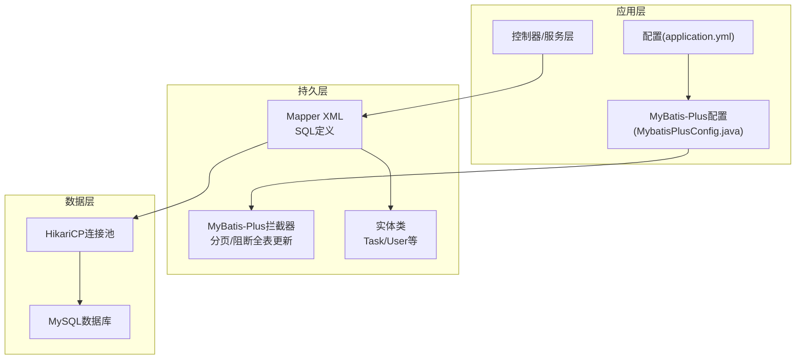
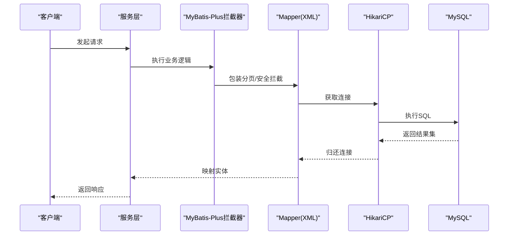
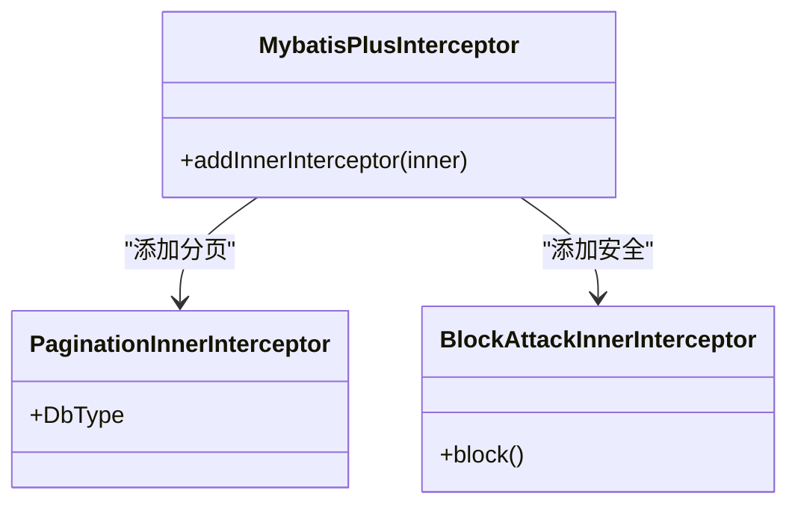
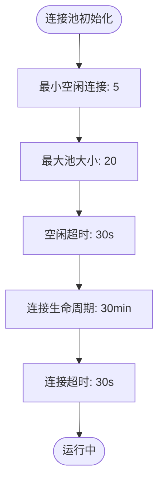
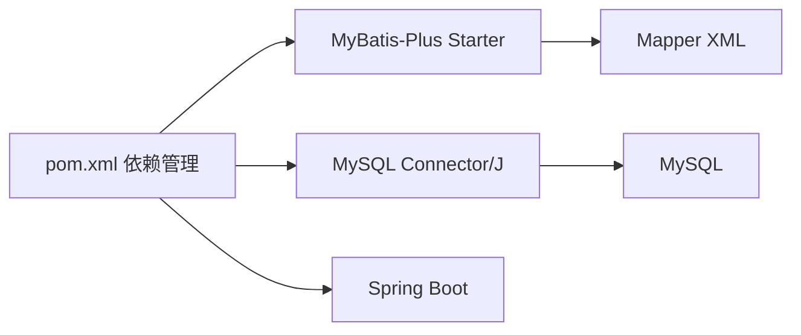

# 数据库性能优化

<cite>
**本文引用的文件**
- [application.yml](file://task-manager-backend/src/main/resources/application.yml)
- [MybatisPlusConfig.java](file://task-manager-backend/src/main/java/com/taskmanager/config/MybatisPlusConfig.java)
- [pom.xml](file://task-manager-backend/pom.xml)
- [TaskMapper.xml](file://task-manager-backend/src/main/resources/mapper/TaskMapper.xml)
- [UserMapper.xml](file://task-manager-backend/src/main/resources/mapper/UserMapper.xml)
- [SysUserMapper.xml](file://task-manager-backend/src/main/resources/mapper/SysUserMapper.xml)
- [SysOperLogMapper.xml](file://task-manager-backend/src/main/resources/mapper/SysOperLogMapper.xml)
- [schema.sql](file://task-manager-backend/src/main/resources/schema.sql)
- [Task.java](file://task-manager-backend/src/main/java/com/taskmanager/entity/Task.java)
- [User.java](file://task-manager-backend/src/main/java/com/taskmanager/entity/User.java)
- [test-data.sql](file://task-manager-backend/src/main/resources/test-data.sql)
</cite>

## 目录
1. [简介](#简介)
2. [项目结构](#项目结构)
3. [核心组件](#核心组件)
4. [架构总览](#架构总览)
5. [详细组件分析](#详细组件分析)
6. [依赖分析](#依赖分析)
7. [性能考量](#性能考量)
8. [故障排查指南](#故障排查指南)
9. [结论](#结论)
10. [附录](#附录)

## 简介
本文件面向CodeBuddy任务管理系统，聚焦数据库性能优化，围绕以下主题展开：
- MyBatis-Plus配置优化：分页查询优化、批量操作配置、查询性能监控
- 数据库连接池优化：HikariCP参数调优、最大连接数、连接超时
- SQL查询优化：慢查询分析、执行计划分析、索引使用策略
- 数据库索引设计：复合索引、覆盖索引、索引维护策略
- 数据库监控指标：连接数、查询响应时间、锁等待
- 最佳实践与常见问题解决方案

## 项目结构
后端采用Spring Boot + MyBatis-Plus + MySQL + HikariCP的典型架构。配置集中在application.yml中，MyBatis-Plus通过拦截器实现分页与安全防护；SQL语句集中在XML映射文件中；数据库结构与测试数据在schema.sql与test-data.sql中定义。

图表来源
- [application.yml:5-45](file://task-manager-backend/src/main/resources/application.yml#L5-L45)
- [MybatisPlusConfig.java:17-31](file://task-manager-backend/src/main/java/com/taskmanager/config/MybatisPlusConfig.java#L17-L31)
- [TaskMapper.xml:5-18](file://task-manager-backend/src/main/resources/mapper/TaskMapper.xml#L5-L18)
- [UserMapper.xml:5-10](file://task-manager-backend/src/main/resources/mapper/UserMapper.xml#L5-L10)
- [SysUserMapper.xml:29-56](file://task-manager-backend/src/main/resources/mapper/SysUserMapper.xml#L29-L56)

章节来源
- [application.yml:1-79](file://task-manager-backend/src/main/resources/application.yml#L1-L79)
- [MybatisPlusConfig.java:1-32](file://task-manager-backend/src/main/java/com/taskmanager/config/MybatisPlusConfig.java#L1-L32)
- [TaskMapper.xml:1-43](file://task-manager-backend/src/main/resources/mapper/TaskMapper.xml#L1-L43)
- [UserMapper.xml:1-13](file://task-manager-backend/src/main/resources/mapper/UserMapper.xml#L1-L13)
- [SysUserMapper.xml:1-58](file://task-manager-backend/src/main/resources/mapper/SysUserMapper.xml#L1-L58)
- [schema.sql:1-608](file://task-manager-backend/src/main/resources/schema.sql#L1-L608)

## 核心组件
- MyBatis-Plus配置：启用分页插件与全表更新/删除阻断插件，保证分页与安全
- HikariCP连接池：最小空闲、最大池大小、空闲超时、生命周期、连接超时等参数
- SQL映射：基于XML的查询与更新，包含分页查询、条件筛选、权限校验
- 实体模型：Task、User等，映射到数据库表字段
- 数据库结构：包含系统用户、角色、菜单、日志、电商模块等表，具备索引与约束

章节来源
- [MybatisPlusConfig.java:17-31](file://task-manager-backend/src/main/java/com/taskmanager/config/MybatisPlusConfig.java#L17-L31)
- [application.yml:10-17](file://task-manager-backend/src/main/resources/application.yml#L10-L17)
- [Task.java:13-49](file://task-manager-backend/src/main/java/com/taskmanager/entity/Task.java#L13-L49)
- [User.java:11-30](file://task-manager-backend/src/main/java/com/taskmanager/entity/User.java#L11-L30)
- [schema.sql:11-36](file://task-manager-backend/src/main/resources/schema.sql#L11-L36)

## 架构总览
下图展示数据库访问的关键流程：应用层通过MyBatis-Plus拦截器进行分页与安全处理，Mapper XML定义SQL，HikariCP提供连接池，最终访问MySQL。

图表来源
- [MybatisPlusConfig.java:22-30](file://task-manager-backend/src/main/java/com/taskmanager/config/MybatisPlusConfig.java#L22-L30)
- [TaskMapper.xml:5-18](file://task-manager-backend/src/main/resources/mapper/TaskMapper.xml#L5-L18)
- [application.yml:10-17](file://task-manager-backend/src/main/resources/application.yml#L10-L17)

## 详细组件分析

### MyBatis-Plus配置优化
- 分页插件：对MySQL数据库启用PaginationInnerInterceptor，确保分页SQL正确生成
- 安全防护：BlockAttackInnerInterceptor防止误操作导致的全表更新/删除
- 日志输出：StdOutImpl开启SQL日志，便于开发调试与性能分析

图表来源
- [MybatisPlusConfig.java:22-30](file://task-manager-backend/src/main/java/com/taskmanager/config/MybatisPlusConfig.java#L22-L30)

章节来源
- [MybatisPlusConfig.java:17-31](file://task-manager-backend/src/main/java/com/taskmanager/config/MybatisPlusConfig.java#L17-L31)
- [application.yml:33-45](file://task-manager-backend/src/main/resources/application.yml#L33-L45)

### 数据库连接池配置优化（HikariCP）
- 最小空闲连接：minimum-idle=5，保证热连接数量
- 最大池大小：maximum-pool-size=20，结合业务并发与数据库承载能力调整
- 空闲超时：idle-timeout=30000ms，避免长时间占用资源
- 生命周期：max-lifetime=1800000ms，降低连接老化带来的风险
- 连接超时：connection-timeout=30000ms，避免请求长时间阻塞

图表来源
- [application.yml:10-17](file://task-manager-backend/src/main/resources/application.yml#L10-L17)

章节来源
- [application.yml:10-17](file://task-manager-backend/src/main/resources/application.yml#L10-L17)

### SQL查询优化与索引设计
- 查询模式分析
  - 任务分页查询：按用户ID过滤，支持状态与关键词模糊匹配，按创建时间倒序
  - 用户名查询：按用户名精确匹配，带逻辑删除过滤
  - 用户列表分页：多条件动态拼接，LEFT JOIN部门表，按创建时间倒序
  - 操作日志：按时间与操作人建立索引，便于审计与报表

- 索引现状与建议
  - sys_user：主键user_id，唯一索引uk_user_name；建议在del_flag上建立辅助索引以加速逻辑删除过滤
  - sys_oper_log/sys_logininfor：主键oper_id，idx_oper_time/idx_login_time等索引；建议在高频查询字段上建立复合索引
  - task：当前查询按user_id与created_time排序，建议在(user_id, created_time)上建立复合索引以覆盖排序与过滤
  - sys_user_role/sys_role_menu：联合主键，idx_role_id/idx_menu_id；建议在高频过滤字段上评估复合索引

- 覆盖索引与执行计划
  - 使用EXPLAIN分析SQL执行计划，确认是否命中索引、是否发生全表扫描
  - 对于SELECT * 的查询，优先改为仅查询必要列，减少IO与内存拷贝
  - 对LIKE '%keyword%' 类型的模糊查询，考虑全文索引或前缀索引策略

- 批量操作配置
  - MyBatis-Plus支持批量插入/更新，建议在Mapper XML中使用foreach批量提交，减少往返次数
  - 控制批大小，避免单次事务过大导致锁竞争与回滚成本过高

章节来源
- [TaskMapper.xml:5-18](file://task-manager-backend/src/main/resources/mapper/TaskMapper.xml#L5-L18)
- [UserMapper.xml:5-10](file://task-manager-backend/src/main/resources/mapper/UserMapper.xml#L5-L10)
- [SysUserMapper.xml:29-56](file://task-manager-backend/src/main/resources/mapper/SysUserMapper.xml#L29-L56)
- [SysOperLogMapper.xml:6-24](file://task-manager-backend/src/main/resources/mapper/SysOperLogMapper.xml#L6-L24)
- [schema.sql:11-36](file://task-manager-backend/src/main/resources/schema.sql#L11-L36)
- [schema.sql:174-198](file://task-manager-backend/src/main/resources/schema.sql#L174-L198)
- [schema.sql:200-217](file://task-manager-backend/src/main/resources/schema.sql#L200-L217)

### 数据库监控指标与方法
- 连接数监控：通过HikariCP指标（active connections、idle connections、total connections）观察池化状态
- 查询响应时间：结合日志与数据库慢查询日志，定位耗时SQL
- 锁等待：关注InnoDB锁等待与死锁日志，识别热点表与热点行
- 指标采集：可通过Prometheus+Grafana或数据库自带监控工具采集关键指标

章节来源
- [application.yml:10-17](file://task-manager-backend/src/main/resources/application.yml#L10-L17)

## 依赖分析
- Spring Boot Starter与MyBatis-Plus版本：确保兼容性与性能特性
- MySQL驱动：mysql-connector-j
- 依赖版本在pom.xml中集中管理，便于升级与一致性控制

图表来源
- [pom.xml:57-69](file://task-manager-backend/pom.xml#L57-L69)

章节来源
- [pom.xml:1-206](file://task-manager-backend/pom.xml#L1-L206)

## 性能考量
- 分页优化：合理设置每页大小，避免深度分页；对高频分页字段建立复合索引
- 连接池调优：根据QPS与并发峰值调整maximum-pool-size，避免过度连接导致上下文切换
- SQL优化：避免SELECT *，减少不必要的JOIN；对动态WHERE条件进行索引规划
- 索引策略：复合索引遵循“最左前缀”原则；覆盖索引减少回表
- 监控与告警：建立慢查询阈值与异常告警机制

## 故障排查指南
- 分页失效或全表扫描
  - 检查是否正确注入MyBatis-Plus拦截器
  - 使用EXPLAIN确认索引命中情况
  - 为过滤与排序字段建立复合索引
- 连接池耗尽
  - 提升maximum-pool-size或缩短连接超时
  - 检查是否存在未关闭的事务或连接泄漏
- 慢查询
  - 开启慢查询日志，定位热点SQL
  - 优化WHERE、JOIN、ORDER BY子句，必要时增加索引
- 逻辑删除过滤异常
  - 确认逻辑删除字段与全局配置一致
  - 在高频过滤字段上建立辅助索引

章节来源
- [MybatisPlusConfig.java:22-30](file://task-manager-backend/src/main/java/com/taskmanager/config/MybatisPlusConfig.java#L22-L30)
- [application.yml:39-44](file://task-manager-backend/src/main/resources/application.yml#L39-L44)
- [schema.sql:11-36](file://task-manager-backend/src/main/resources/schema.sql#L11-L36)

## 结论
通过对MyBatis-Plus分页与安全拦截、HikariCP连接池参数、SQL查询与索引策略的系统化优化，可显著提升任务管理系统的数据库性能与稳定性。建议在生产环境中持续监控关键指标，并结合业务增长趋势动态调整参数与索引策略。

## 附录
- 测试数据与表结构参考：用于验证索引与查询效果
- 建议的索引清单
  - sys_user：(del_flag) 辅助过滤
  - task：(user_id, created_time) 复合索引
  - sys_oper_log：(oper_time, oper_name) 复合索引
  - sys_logininfor：(login_time, user_name) 复合索引

章节来源
- [test-data.sql:1-558](file://task-manager-backend/src/main/resources/test-data.sql#L1-L558)
- [schema.sql:11-36](file://task-manager-backend/src/main/resources/schema.sql#L11-L36)
- [schema.sql:174-198](file://task-manager-backend/src/main/resources/schema.sql#L174-L198)
- [schema.sql:200-217](file://task-manager-backend/src/main/resources/schema.sql#L200-L217)