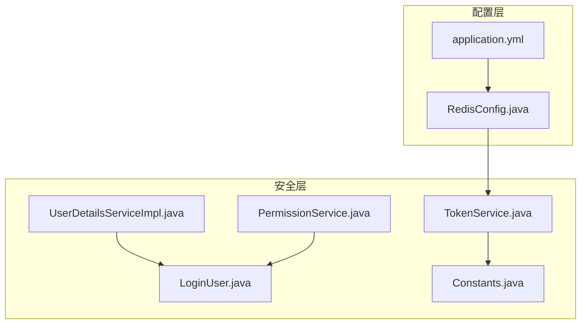
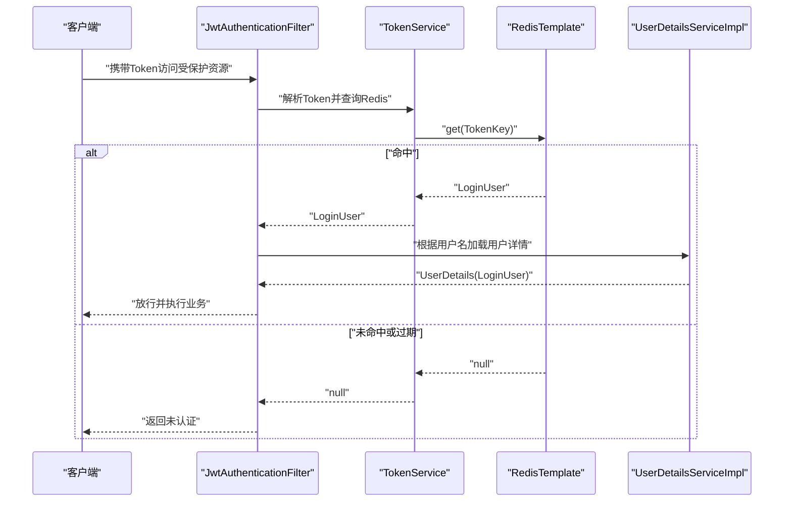
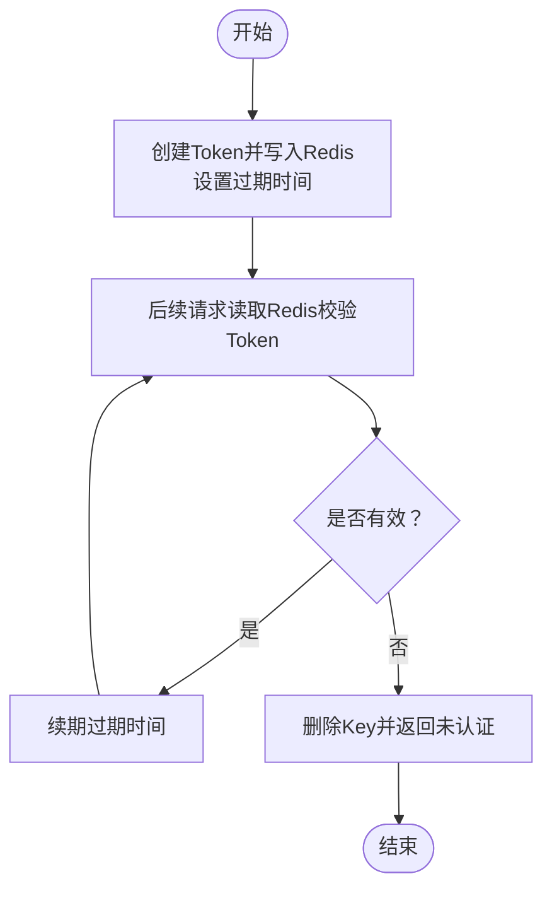
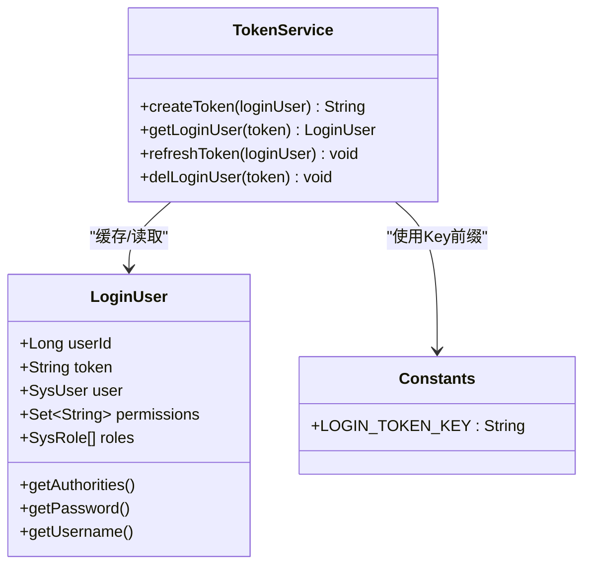
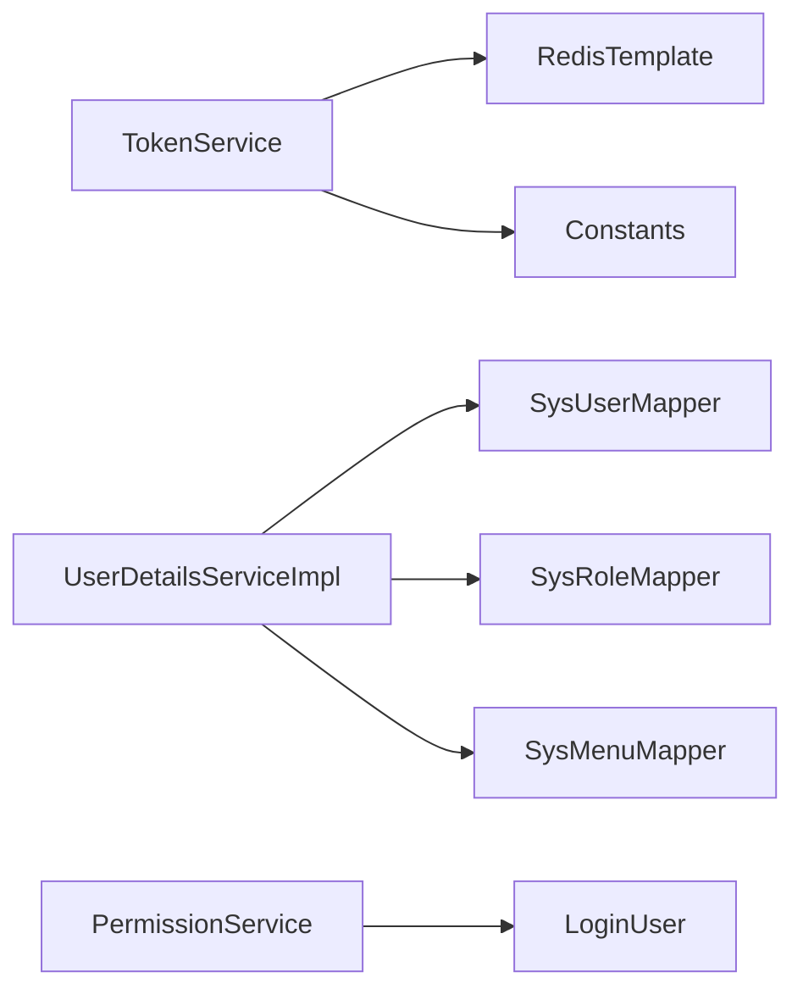

# 缓存策略设计

<cite>
**本文引用的文件**
- [RedisConfig.java](file://task-manager-backend/src/main/java/com/taskmanager/config/RedisConfig.java)
- [application.yml](file://task-manager-backend/src/main/resources/application.yml)
- [TokenService.java](file://task-manager-backend/src/main/java/com/taskmanager/security/TokenService.java)
- [Constants.java](file://task-manager-backend/src/main/java/com/taskmanager/common/constant/Constants.java)
- [LoginUser.java](file://task-manager-backend/src/main/java/com/taskmanager/security/LoginUser.java)
- [UserDetailsServiceImpl.java](file://task-manager-backend/src/main/java/com/taskmanager/security/UserDetailsServiceImpl.java)
- [PermissionService.java](file://task-manager-backend/src/main/java/com/taskmanager/security/PermissionService.java)
</cite>

## 目录
1. [简介](#简介)
2. [项目结构](#项目结构)
3. [核心组件](#核心组件)
4. [架构总览](#架构总览)
5. [详细组件分析](#详细组件分析)
6. [依赖分析](#依赖分析)
7. [性能考虑](#性能考虑)
8. [故障排查指南](#故障排查指南)
9. [结论](#结论)
10. [附录](#附录)

## 简介
本文件面向CodeBuddy任务管理系统，系统性梳理后端基于Spring Data Redis的缓存策略设计，重点覆盖以下方面：
- Redis序列化配置与选择（StringRedisSerializer与GenericJackson2JsonRedisSerializer）
- Token缓存策略（JWT Token的Redis存储、过期时间、续期与删除）
- 用户信息缓存设计（用户详情、权限、菜单等）
- 缓存失效机制（主动失效、被动失效、缓存穿透防护）
- 缓存性能监控（命中率、内存使用、热点分布）
- 缓存调优参数（连接池、内存限制、持久化）

## 项目结构
后端采用Spring Boot工程，缓存相关的关键位置如下：
- 配置层：Redis序列化配置、应用配置（Redis连接与JWT参数）
- 安全层：TokenService负责Token与登录用户信息的Redis存取；UserDetailsServiceImpl负责用户详情加载；PermissionService负责权限校验
- 常量层：集中定义Redis Key前缀与过期时间常量

图表来源
- [RedisConfig.java:18-31](file://task-manager-backend/src/main/java/com/taskmanager/config/RedisConfig.java#L18-L31)
- [application.yml:18-32](file://task-manager-backend/src/main/resources/application.yml#L18-L32)
- [TokenService.java:21-41](file://task-manager-backend/src/main/java/com/taskmanager/security/TokenService.java#L21-L41)
- [Constants.java:28-32](file://task-manager-backend/src/main/java/com/taskmanager/common/constant/Constants.java#L28-L32)
- [UserDetailsServiceImpl.java:40-57](file://task-manager-backend/src/main/java/com/taskmanager/security/UserDetailsServiceImpl.java#L40-L57)
- [PermissionService.java:25-38](file://task-manager-backend/src/main/java/com/taskmanager/security/PermissionService.java#L25-L38)

章节来源
- [RedisConfig.java:1-33](file://task-manager-backend/src/main/java/com/taskmanager/config/RedisConfig.java#L1-L33)
- [application.yml:1-79](file://task-manager-backend/src/main/resources/application.yml#L1-L79)

## 核心组件
- Redis序列化配置：统一Key使用字符串序列化，Value使用JSON序列化，确保Key可读且Value支持复杂对象
- Token服务：负责Token创建、读取、续期与删除，并以统一Key前缀+Token构建Redis键
- 用户详情服务：按用户名加载用户、角色与权限，组装为LoginUser对象
- 权限服务：基于Security上下文中的LoginUser进行权限校验
- 常量定义：集中管理Redis Key前缀与过期时间

章节来源
- [RedisConfig.java:18-31](file://task-manager-backend/src/main/java/com/taskmanager/config/RedisConfig.java#L18-L31)
- [TokenService.java:21-81](file://task-manager-backend/src/main/java/com/taskmanager/security/TokenService.java#L21-L81)
- [UserDetailsServiceImpl.java:40-57](file://task-manager-backend/src/main/java/com/taskmanager/security/UserDetailsServiceImpl.java#L40-L57)
- [PermissionService.java:25-38](file://task-manager-backend/src/main/java/com/taskmanager/security/PermissionService.java#L25-L38)
- [Constants.java:28-32](file://task-manager-backend/src/main/java/com/taskmanager/common/constant/Constants.java#L28-L32)

## 架构总览
下图展示登录流程中Token与用户信息在Redis中的交互：

图表来源
- [TokenService.java:49-62](file://task-manager-backend/src/main/java/com/taskmanager/security/TokenService.java#L49-L62)
- [UserDetailsServiceImpl.java:40-57](file://task-manager-backend/src/main/java/com/taskmanager/security/UserDetailsServiceImpl.java#L40-L57)
- [Constants.java:28-32](file://task-manager-backend/src/main/java/com/taskmanager/common/constant/Constants.java#L28-L32)

## 详细组件分析

### Redis序列化策略
- Key序列化：使用字符串序列化，便于直接查看与运维
- Value序列化：使用JSON序列化，支持复杂对象（如LoginUser）的存取
- 影响：提升可读性与跨语言兼容性，同时保证对象字段的完整序列化

章节来源
- [RedisConfig.java:22-28](file://task-manager-backend/src/main/java/com/taskmanager/config/RedisConfig.java#L22-L28)

### Token缓存策略
- 存储结构：以统一前缀拼接Token作为Redis Key，Value为LoginUser对象
- 过期时间：从JWT配置读取，单位毫秒
- 生命周期：
  - 创建：生成UUID作为Token，写入Redis并设置过期
  - 续期：每次有效请求触发续期，延长过期时间
  - 删除：登出时删除对应Key
- Key前缀：集中定义于常量类，便于统一管理

图表来源
- [TokenService.java:34-41](file://task-manager-backend/src/main/java/com/taskmanager/security/TokenService.java#L34-L41)
- [TokenService.java:67-71](file://task-manager-backend/src/main/java/com/taskmanager/security/TokenService.java#L67-L71)
- [TokenService.java:76-80](file://task-manager-backend/src/main/java/com/taskmanager/security/TokenService.java#L76-L80)
- [Constants.java:28-32](file://task-manager-backend/src/main/java/com/taskmanager/common/constant/Constants.java#L28-L32)
- [application.yml:52-56](file://task-manager-backend/src/main/resources/application.yml#L52-L56)

章节来源
- [TokenService.java:21-81](file://task-manager-backend/src/main/java/com/taskmanager/security/TokenService.java#L21-L81)
- [Constants.java:28-32](file://task-manager-backend/src/main/java/com/taskmanager/common/constant/Constants.java#L28-L32)
- [application.yml:52-56](file://task-manager-backend/src/main/resources/application.yml#L52-L56)

### 用户信息缓存设计
- 用户详情缓存：LoginUser对象包含用户基础信息、权限集合与角色列表，适合整体缓存
- 权限信息缓存：权限集合用于快速校验，避免重复查询数据库
- 菜单缓存策略：当前实现通过权限集合间接支撑菜单过滤，若需独立菜单缓存，可在业务侧扩展Key前缀与过期策略

图表来源
- [LoginUser.java:25-109](file://task-manager-backend/src/main/java/com/taskmanager/security/LoginUser.java#L25-L109)
- [TokenService.java:34-41](file://task-manager-backend/src/main/java/com/taskmanager/security/TokenService.java#L34-L41)
- [Constants.java:28-32](file://task-manager-backend/src/main/java/com/taskmanager/common/constant/Constants.java#L28-L32)

章节来源
- [LoginUser.java:25-109](file://task-manager-backend/src/main/java/com/taskmanager/security/LoginUser.java#L25-L109)
- [UserDetailsServiceImpl.java:40-57](file://task-manager-backend/src/main/java/com/taskmanager/security/UserDetailsServiceImpl.java#L40-L57)

### 缓存失效机制
- 主动失效：登出时删除对应Token Key
- 被动失效：基于过期时间自动淘汰
- 缓存穿透防护：当前实现未见显式防穿透逻辑，建议在用户不存在时写入空对象或短过期的占位Key

章节来源
- [TokenService.java:76-80](file://task-manager-backend/src/main/java/com/taskmanager/security/TokenService.java#L76-L80)
- [TokenService.java:49-62](file://task-manager-backend/src/main/java/com/taskmanager/security/TokenService.java#L49-L62)

### 缓存性能监控
- 命中率：可通过Redis INFO命令或Spring Boot Actuator指标观测
- 内存使用：结合Redis内存分析命令评估对象大小与Key数量
- 热点分布：对高频Token与用户Key进行统计，识别热点并考虑分片或多实例

[本节为通用指导，不直接分析具体文件]

## 依赖分析
- TokenService依赖RedisTemplate与Constants，负责Token生命周期管理
- UserDetailsServiceImpl依赖多个Mapper，负责用户详情加载
- PermissionService依赖Security上下文，基于LoginUser进行权限校验

图表来源
- [TokenService.java:25-26](file://task-manager-backend/src/main/java/com/taskmanager/security/TokenService.java#L25-L26)
- [Constants.java:28-32](file://task-manager-backend/src/main/java/com/taskmanager/common/constant/Constants.java#L28-L32)
- [UserDetailsServiceImpl.java:24-33](file://task-manager-backend/src/main/java/com/taskmanager/security/UserDetailsServiceImpl.java#L24-L33)
- [PermissionService.java:53-62](file://task-manager-backend/src/main/java/com/taskmanager/security/PermissionService.java#L53-L62)

章节来源
- [TokenService.java:21-81](file://task-manager-backend/src/main/java/com/taskmanager/security/TokenService.java#L21-L81)
- [UserDetailsServiceImpl.java:21-59](file://task-manager-backend/src/main/java/com/taskmanager/security/UserDetailsServiceImpl.java#L21-L59)
- [PermissionService.java:13-64](file://task-manager-backend/src/main/java/com/taskmanager/security/PermissionService.java#L13-L64)

## 性能考虑
- 连接池优化：调整最大连接数、空闲连接与等待超时，平衡吞吐与延迟
- 内存限制：合理设置过期时间，避免长期占用内存；对大对象进行拆分或压缩
- 持久化策略：生产环境建议开启RDB快照或AOF，权衡数据安全与性能
- 热点Key治理：对高并发Token Key进行分片或引入本地缓存兜底

[本节为通用指导，不直接分析具体文件]

## 故障排查指南
- Token无法读取：检查TokenKey前缀与过期时间配置，确认Redis连接与序列化一致
- 权限校验异常：确认Security上下文中LoginUser已正确注入，权限集合非空
- 登出后仍可访问：检查是否遗漏删除TokenKey或续期逻辑导致过期时间被重置

章节来源
- [TokenService.java:49-62](file://task-manager-backend/src/main/java/com/taskmanager/security/TokenService.java#L49-L62)
- [PermissionService.java:25-38](file://task-manager-backend/src/main/java/com/taskmanager/security/PermissionService.java#L25-L38)
- [Constants.java:28-32](file://task-manager-backend/src/main/java/com/taskmanager/common/constant/Constants.java#L28-L32)

## 结论
本缓存策略以简洁高效为目标：统一的序列化配置确保Key可读与对象可序列化；Token缓存结合过期与续期实现会话管理；用户详情与权限缓存在LoginUser中聚合，便于快速校验。建议在现有基础上补充缓存穿透防护与热点治理，并完善性能监控与调优参数。

[本节为总结，不直接分析具体文件]

## 附录
- 关键配置项参考
  - Redis连接与池化：host、port、password、database、timeout、lettuce.pool.*
  - JWT参数：secret、expiration、header、prefix

章节来源
- [application.yml:18-32](file://task-manager-backend/src/main/resources/application.yml#L18-L32)
- [application.yml:52-56](file://task-manager-backend/src/main/resources/application.yml#L52-L56)