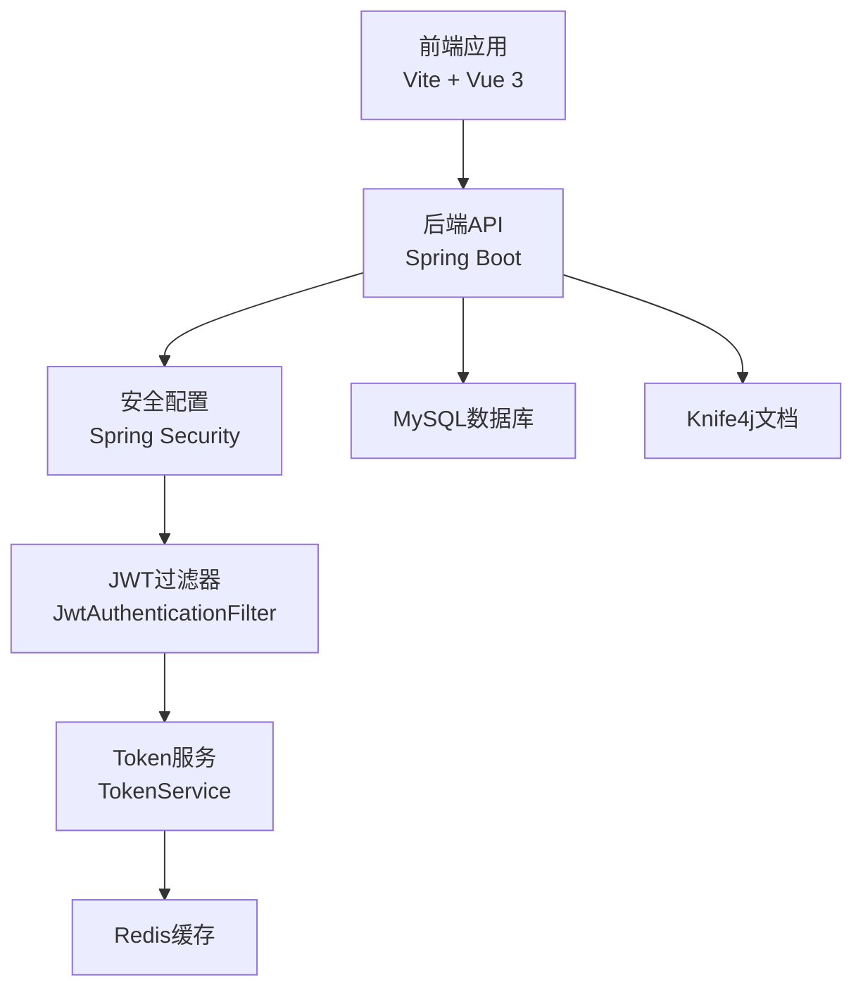
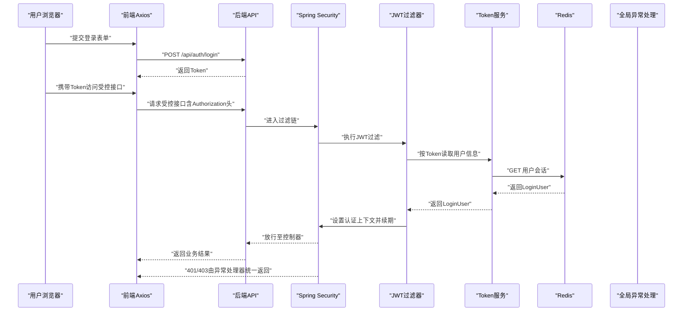
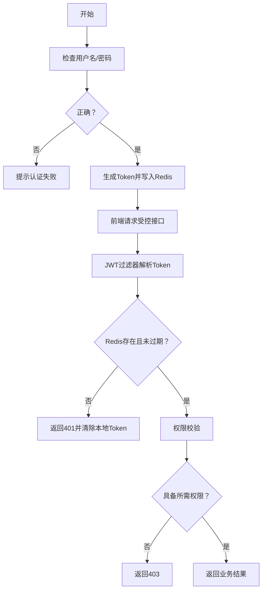
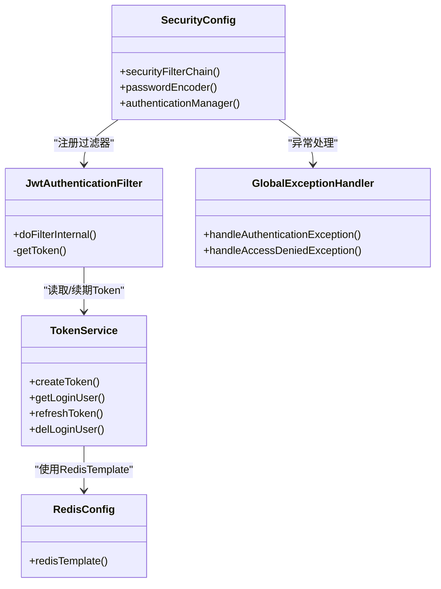

# 常见问题排查

<cite>
**本文引用的文件**
- [application.yml](file://task-manager-backend/src/main/resources/application.yml)
- [SecurityConfig.java](file://task-manager-backend/src/main/java/com/taskmanager/config/SecurityConfig.java)
- [JwtAuthenticationFilter.java](file://task-manager-backend/src/main/java/com/taskmanager/security/JwtAuthenticationFilter.java)
- [TokenService.java](file://task-manager-backend/src/main/java/com/taskmanager/security/TokenService.java)
- [RedisConfig.java](file://task-manager-backend/src/main/java/com/taskmanager/config/RedisConfig.java)
- [GlobalExceptionHandler.java](file://task-manager-backend/src/main/java/com/taskmanager/common/exception/GlobalExceptionHandler.java)
- [PermissionService.java](file://task-manager-backend/src/main/java/com/taskmanager/security/PermissionService.java)
- [schema.sql](file://task-manager-backend/src/main/resources/schema.sql)
- [auth.js（前端工具）](file://task-manager-frontend/src/utils/auth.js)
- [request.js（前端请求封装）](file://task-manager-frontend/src/api/request.js)
- [router/index.js（前端路由）](file://task-manager-frontend/src/router/index.js)
- [test_login.py（登录测试脚本）](file://test_login.py)
- [start.bat（启动脚本）](file://start.bat)
- [run_backend.py（后端启动脚本）](file://run_backend.py)
</cite>

## 目录
1. [引言](#引言)
2. [项目结构](#项目结构)
3. [核心组件](#核心组件)
4. [架构总览](#架构总览)
5. [详细组件分析](#详细组件分析)
6. [依赖分析](#依赖分析)
7. [性能考虑](#性能考虑)
8. [故障排查指南](#故障排查指南)
9. [结论](#结论)
10. [附录](#附录)

## 引言
本指南面向CodeBuddy任务管理系统运维与开发人员，聚焦于系统运行中的常见问题，提供可操作的诊断与修复路径。覆盖范围包括：登录失败（用户名密码错误、Token过期、权限不足）、权限异常（角色/菜单/数据权限）、数据库连接问题（超时/连接池耗尽/SQL错误）、Redis连接问题（连接失败/序列化错误/缓存失效）、前端问题（页面空白/API失败/静态资源加载）、系统启动问题（端口占用/配置错误）、网络问题（跨域/证书验证）。每个问题均给出定位步骤、根因分析与修复建议，并辅以可视化图示帮助快速定位。

## 项目结构
系统采用前后端分离架构：
- 后端基于Spring Boot，使用Spring Security + JWT + Redis实现认证鉴权；MyBatis-Plus负责数据访问；Knife4j提供在线文档。
- 前端基于Vue 3 + Vite，使用Axios封装HTTP请求，内置Token注入与401自动跳转逻辑。

图表来源
- [SecurityConfig.java:47-96](file://task-manager-backend/src/main/java/com/taskmanager/config/SecurityConfig.java#L47-L96)
- [JwtAuthenticationFilter.java:37-57](file://task-manager-backend/src/main/java/com/taskmanager/security/JwtAuthenticationFilter.java#L37-L57)
- [TokenService.java:34-41](file://task-manager-backend/src/main/java/com/taskmanager/security/TokenService.java#L34-L41)
- [application.yml:5-44](file://task-manager-backend/src/main/resources/application.yml#L5-L44)

章节来源
- [application.yml:1-79](file://task-manager-backend/src/main/resources/application.yml#L1-L79)
- [SecurityConfig.java:31-116](file://task-manager-backend/src/main/java/com/taskmanager/config/SecurityConfig.java#L31-L116)

## 核心组件
- 安全配置与放行规则：配置无状态会话、JWT过滤器链、认证入口点与放行路径（登录、注册、验证码、公开字典、Knife4j文档等）。
- JWT认证过滤器：从请求头提取Token，从Redis解析用户信息，构建认证上下文并自动续期。
- Token服务：负责Token创建、读取、刷新与删除，以及Redis键空间管理。
- Redis配置：统一Key/HashKey序列化策略，避免乱码。
- 全局异常处理：对认证失败、权限拒绝、参数校验等进行标准化输出。
- 前端请求封装：统一注入Authorization头、处理401自动登出、统一错误提示。

章节来源
- [SecurityConfig.java:47-96](file://task-manager-backend/src/main/java/com/taskmanager/config/SecurityConfig.java#L47-L96)
- [JwtAuthenticationFilter.java:37-68](file://task-manager-backend/src/main/java/com/taskmanager/security/JwtAuthenticationFilter.java#L37-L68)
- [TokenService.java:34-80](file://task-manager-backend/src/main/java/com/taskmanager/security/TokenService.java#L34-L80)
- [RedisConfig.java:18-31](file://task-manager-backend/src/main/java/com/taskmanager/config/RedisConfig.java#L18-L31)
- [GlobalExceptionHandler.java:25-107](file://task-manager-backend/src/main/java/com/taskmanager/common/exception/GlobalExceptionHandler.java#L25-L107)
- [request.js（前端请求封装）:10-60](file://task-manager-frontend/src/api/request.js#L10-L60)

## 架构总览
下图展示登录与权限校验的关键交互流程，涵盖请求进入、JWT解析、Redis读写、权限判断与异常处理。

图表来源
- [SecurityConfig.java:47-96](file://task-manager-backend/src/main/java/com/taskmanager/config/SecurityConfig.java#L47-L96)
- [JwtAuthenticationFilter.java:37-57](file://task-manager-backend/src/main/java/com/taskmanager/security/JwtAuthenticationFilter.java#L37-L57)
- [TokenService.java:49-70](file://task-manager-backend/src/main/java/com/taskmanager/security/TokenService.java#L49-L70)
- [GlobalExceptionHandler.java:59-65](file://task-manager-backend/src/main/java/com/taskmanager/common/exception/GlobalExceptionHandler.java#L59-L65)

## 详细组件分析

### 登录失败问题排查
- 用户名密码错误
  - 现象：登录接口返回业务错误或认证异常。
  - 排查要点：确认用户名是否存在、密码是否匹配（BCrypt校验）、是否被禁用或删除标记。
  - 参考数据模型与初始化数据。
- Token过期
  - 现象：前端收到401，自动跳转登录页。
  - 排查要点：检查JWT过期时间配置、Redis中会话是否过期、请求是否频繁导致未及时续期。
- 权限不足
  - 现象：返回403“没有权限，请联系管理员授权”。
  - 排查要点：检查用户角色权限、菜单权限、按钮权限是否正确授予；确认通配符权限与具体权限标识。

图表来源
- [SecurityConfig.java:59-74](file://task-manager-backend/src/main/java/com/taskmanager/config/SecurityConfig.java#L59-L74)
- [JwtAuthenticationFilter.java:37-57](file://task-manager-backend/src/main/java/com/taskmanager/security/JwtAuthenticationFilter.java#L37-L57)
- [TokenService.java:49-70](file://task-manager-backend/src/main/java/com/taskmanager/security/TokenService.java#L49-L70)
- [GlobalExceptionHandler.java:59-65](file://task-manager-backend/src/main/java/com/taskmanager/common/exception/GlobalExceptionHandler.java#L59-L65)

章节来源
- [test_login.py:1-24](file://test_login.py#L1-L24)
- [schema.sql:223-242](file://task-manager-backend/src/main/resources/schema.sql#L223-L242)
- [application.yml:52-56](file://task-manager-backend/src/main/resources/application.yml#L52-L56)

### 权限异常问题排查
- 角色权限配置错误
  - 现象：用户无法访问受控功能。
  - 排查：核对sys_user_role与sys_role表，确认角色状态与数据范围。
- 菜单权限缺失
  - 现象：导航菜单不显示或按钮不可见。
  - 排查：核对sys_menu与sys_role_menu，确认菜单类型与权限标识（perms）。
- 数据权限过滤
  - 现象：查询结果为空或部分数据不可见。
  - 排查：核对角色的数据范围字段（data_scope）与具体过滤逻辑（如部门范围）。

章节来源
- [schema.sql:42-130](file://task-manager-backend/src/main/resources/schema.sql#L42-L130)
- [PermissionService.java:25-38](file://task-manager-backend/src/main/java/com/taskmanager/security/PermissionService.java#L25-L38)

### 数据库连接问题排查
- 连接超时
  - 现象：SQL执行超时或连接获取超时。
  - 排查：检查HikariCP连接超时、最大池大小、空闲超时配置；确认MySQL服务可用性与网络连通。
- 连接池耗尽
  - 现象：大量请求堆积，出现等待获取连接。
  - 排查：增大最大池大小、优化慢SQL、检查连接泄漏（未关闭资源）。
- SQL执行错误
  - 现象：SQL语法错误、约束冲突、表不存在。
  - 排查：核对Mapper XML与实体映射、DDL初始化脚本、事务边界。

章节来源
- [application.yml:10-16](file://task-manager-backend/src/main/resources/application.yml#L10-L16)
- [schema.sql:1-608](file://task-manager-backend/src/main/resources/schema.sql#L1-L608)

### Redis连接问题排查
- 连接失败
  - 现象：Token读取/写入失败，认证链路中断。
  - 排查：确认Redis主机/端口/密码配置、网络连通性、Redis服务状态。
- 序列化错误
  - 现象：读取对象失败或Key乱码。
  - 排查：确认RedisTemplate序列化配置（String与JSON）。
- 缓存失效
  - 现象：Token过期但未清理，或频繁续期导致过期时间异常。
  - 排查：核对Token过期时间配置与自动续期逻辑。

章节来源
- [application.yml:18-31](file://task-manager-backend/src/main/resources/application.yml#L18-L31)
- [RedisConfig.java:18-31](file://task-manager-backend/src/main/java/com/taskmanager/config/RedisConfig.java#L18-L31)
- [TokenService.java:34-80](file://task-manager-backend/src/main/java/com/taskmanager/security/TokenService.java#L34-L80)

### 前端问题排查
- 页面空白
  - 现象：路由未生效或组件未渲染。
  - 排查：确认路由配置、公共路由与Layout嵌套、打包产物路径。
- API调用失败
  - 现象：401自动跳转、统一错误提示。
  - 排查：确认baseURL、Authorization头注入、响应拦截器处理逻辑。
- 静态资源加载错误
  - 现象：CSS/JS缺失或跨域。
  - 排查：确认Vite构建与代理配置、静态资源路径与CDN策略。

章节来源
- [router/index.js（前端路由）:1-32](file://task-manager-frontend/src/router/index.js#L1-L32)
- [request.js（前端请求封装）:10-60](file://task-manager-frontend/src/api/request.js#L10-L60)
- [auth.js（前端工具）:1-16](file://task-manager-frontend/src/utils/auth.js#L1-L16)

### 系统启动问题排查
- 后端启动失败
  - 现象：编译失败或JAR启动异常。
  - 排查：查看编译日志、JVM参数、端口占用、依赖版本。
- 前端启动失败
  - 现象：Vite Dev Server启动失败或端口被占用。
  - 排查：检查node_modules、端口占用、代理配置。
- 端口占用
  - 现象：8080/3000被占用。
  - 排查：修改application.yml与Vite配置中的端口，或释放占用进程。
- 配置文件错误
  - 现象：数据库连接失败、Redis连接失败、JWT配置异常。
  - 排查：核对application.yml中各配置项，确保与实际环境一致。

章节来源
- [start.bat（启动脚本）:1-27](file://start.bat#L1-L27)
- [run_backend.py（后端启动脚本）:1-30](file://run_backend.py#L1-L30)
- [application.yml:5-60](file://task-manager-backend/src/main/resources/application.yml#L5-L60)

### 网络相关问题排查
- 跨域问题
  - 现象：前端请求后端报跨域错误。
  - 排查：确认CORS配置与放行路径，确保前端代理或后端CORS策略一致。
- 证书验证失败
  - 现象：HTTPS请求失败。
  - 排查：检查证书链、域名匹配、客户端信任库。

章节来源
- [SecurityConfig.java:50-51](file://task-manager-backend/src/main/java/com/taskmanager/config/SecurityConfig.java#L50-L51)

## 依赖分析
后端安全链路主要依赖关系如下：

图表来源
- [SecurityConfig.java:39-96](file://task-manager-backend/src/main/java/com/taskmanager/config/SecurityConfig.java#L39-L96)
- [JwtAuthenticationFilter.java:31-57](file://task-manager-backend/src/main/java/com/taskmanager/security/JwtAuthenticationFilter.java#L31-L57)
- [TokenService.java:25-80](file://task-manager-backend/src/main/java/com/taskmanager/security/TokenService.java#L25-L80)
- [RedisConfig.java:18-31](file://task-manager-backend/src/main/java/com/taskmanager/config/RedisConfig.java#L18-L31)
- [GlobalExceptionHandler.java:25-107](file://task-manager-backend/src/main/java/com/taskmanager/common/exception/GlobalExceptionHandler.java#L25-L107)

## 性能考虑
- 连接池与超时
  - 合理设置最大池大小、连接超时与空闲超时，避免高并发下的连接争用。
- Token续期策略
  - 频繁请求自动续期可提升用户体验，但需避免过度刷新导致Redis压力。
- 日志与监控
  - 开启必要日志级别，结合操作日志与登录日志定位性能瓶颈。

## 故障排查指南

### 登录失败
- 步骤
  - 使用登录测试脚本验证接口连通性与返回。
  - 核对用户名是否存在、密码是否正确。
  - 检查JWT过期时间与Redis会话状态。
  - 如返回403，检查用户权限与角色配置。
- 修复
  - 更新用户密码或恢复账户状态。
  - 调整JWT过期时间与Redis续期策略。
  - 补充角色与菜单权限。

章节来源
- [test_login.py:1-24](file://test_login.py#L1-L24)
- [application.yml:52-56](file://task-manager-backend/src/main/resources/application.yml#L52-L56)
- [TokenService.java:67-70](file://task-manager-backend/src/main/java/com/taskmanager/security/TokenService.java#L67-L70)
- [schema.sql:223-300](file://task-manager-backend/src/main/resources/schema.sql#L223-L300)

### 权限异常
- 步骤
  - 核对sys_user_role与sys_role_menu是否正确。
  - 检查菜单权限标识（perms）与按钮权限。
  - 验证数据范围（data_scope）是否符合预期。
- 修复
  - 补充缺失的角色-菜单关联。
  - 修正权限标识与菜单状态。
  - 调整数据范围策略。

章节来源
- [schema.sql:112-130](file://task-manager-backend/src/main/resources/schema.sql#L112-L130)
- [schema.sql:243-297](file://task-manager-backend/src/main/resources/schema.sql#L243-L297)
- [PermissionService.java:25-38](file://task-manager-backend/src/main/java/com/taskmanager/security/PermissionService.java#L25-L38)

### 数据库连接问题
- 步骤
  - 检查HikariCP配置与MySQL服务状态。
  - 查看慢查询与连接池指标。
  - 核对初始化脚本与表结构一致性。
- 修复
  - 调整连接池参数。
  - 优化SQL与索引。
  - 重新执行初始化脚本。

章节来源
- [application.yml:10-16](file://task-manager-backend/src/main/resources/application.yml#L10-L16)
- [schema.sql:1-608](file://task-manager-backend/src/main/resources/schema.sql#L1-L608)

### Redis连接问题
- 步骤
  - 检查Redis主机/端口/密码与网络连通。
  - 核对序列化配置，避免Key乱码。
  - 验证Token过期时间与续期逻辑。
- 修复
  - 修正Redis配置。
  - 修复序列化策略。
  - 清理过期会话并调整过期时间。

章节来源
- [application.yml:18-31](file://task-manager-backend/src/main/resources/application.yml#L18-L31)
- [RedisConfig.java:18-31](file://task-manager-backend/src/main/java/com/taskmanager/config/RedisConfig.java#L18-L31)
- [TokenService.java:34-80](file://task-manager-backend/src/main/java/com/taskmanager/security/TokenService.java#L34-L80)

### 前端问题
- 步骤
  - 检查路由配置与Layout嵌套。
  - 核对Axios baseURL与拦截器逻辑。
  - 验证静态资源路径与代理配置。
- 修复
  - 修正路由children与组件路径。
  - 统一baseURL与请求头。
  - 修复代理与静态资源部署。

章节来源
- [router/index.js（前端路由）:1-32](file://task-manager-frontend/src/router/index.js#L1-L32)
- [request.js（前端请求封装）:5-20](file://task-manager-frontend/src/api/request.js#L5-L20)
- [auth.js（前端工具）:1-16](file://task-manager-frontend/src/utils/auth.js#L1-L16)

### 系统启动问题
- 步骤
  - 查看编译日志与JVM参数。
  - 检查端口占用与依赖版本。
  - 核对application.yml配置。
- 修复
  - 修复编译错误与依赖冲突。
  - 更改端口或释放占用进程。
  - 校正配置项与环境变量。

章节来源
- [start.bat（启动脚本）:1-27](file://start.bat#L1-L27)
- [run_backend.py（后端启动脚本）:1-30](file://run_backend.py#L1-L30)
- [application.yml:58-60](file://task-manager-backend/src/main/resources/application.yml#L58-L60)

### 网络问题
- 步骤
  - 检查CORS放行路径与代理策略。
  - 核对HTTPS证书链与域名。
- 修复
  - 配置CORS与代理。
  - 更新证书与信任库。

章节来源
- [SecurityConfig.java:50-51](file://task-manager-backend/src/main/java/com/taskmanager/config/SecurityConfig.java#L50-L51)

## 结论
本指南提供了从登录认证、权限控制、数据库与Redis连接、前端交互到系统启动与网络配置的全链路排查方法。建议在生产环境中结合日志与监控体系，持续观察连接池、Token续期与权限命中率等关键指标，以便快速定位与解决问题。

## 附录
- 关键配置参考
  - JWT过期时间与Header前缀
  - 数据源与连接池参数
  - Redis连接与序列化配置
- 快速检查清单
  - 数据库连通性与初始化脚本
  - Redis服务状态与序列化
  - JWT过期与续期策略
  - CORS与代理配置
  - 端口占用与进程状态