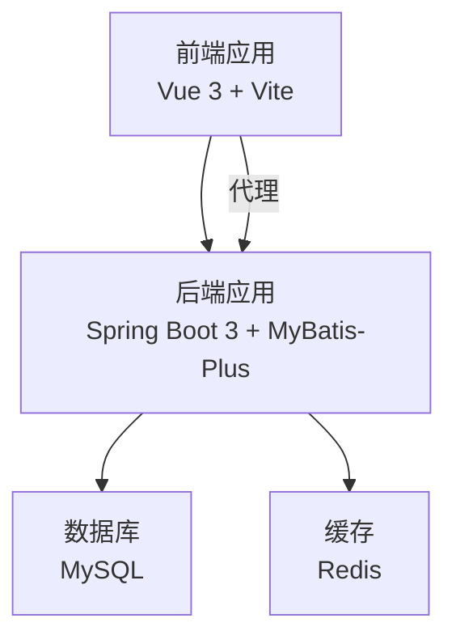
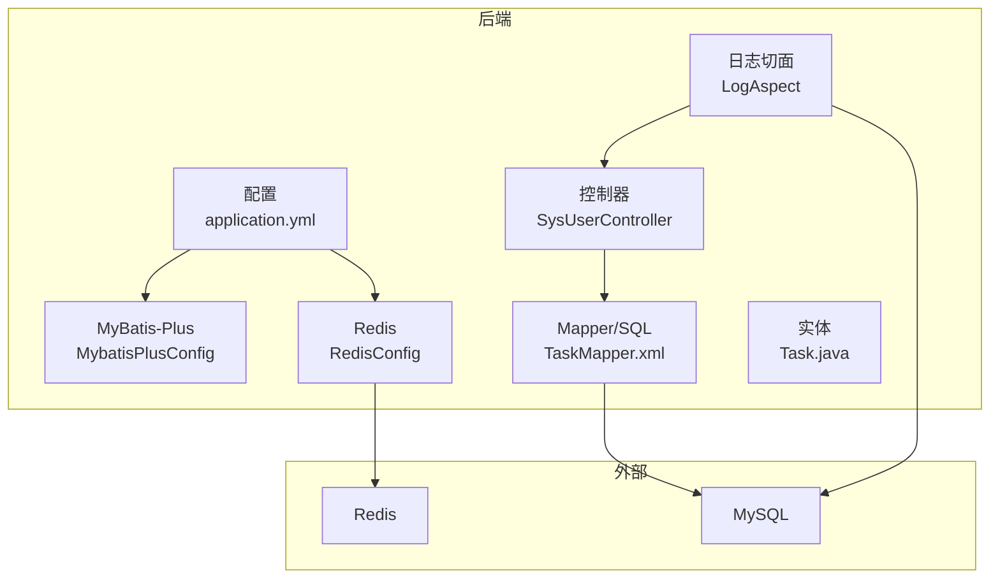
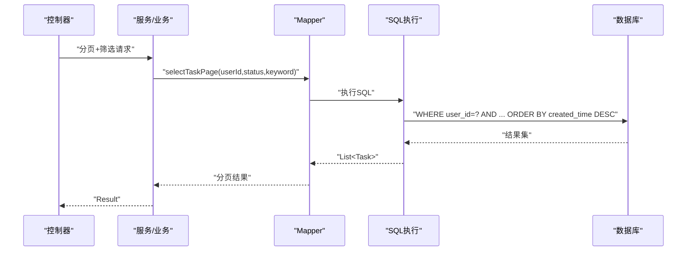
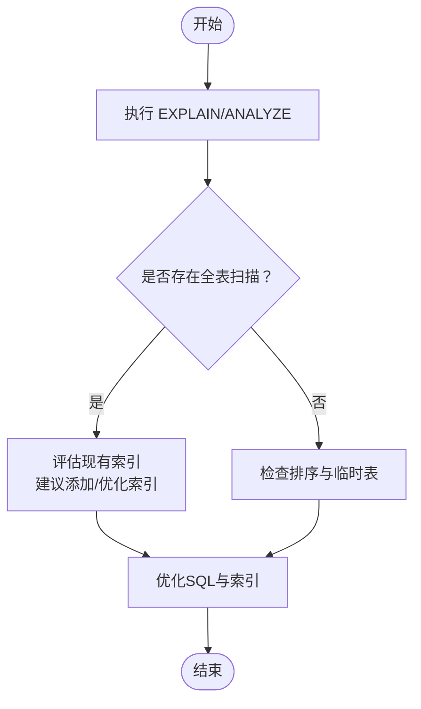
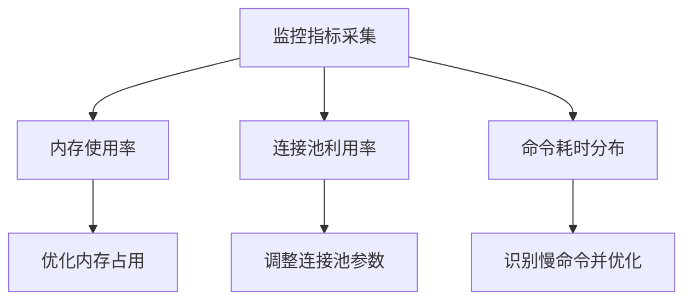
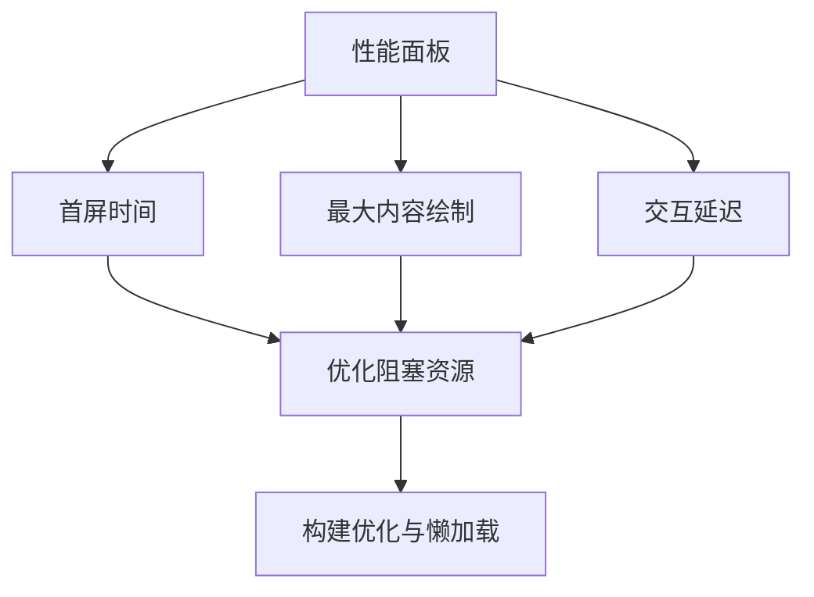
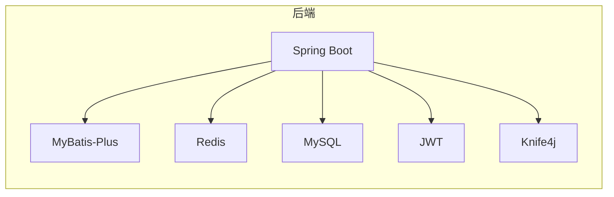

# 性能问题排查

<cite>
**本文引用的文件**   
- [application.yml](file://task-manager-backend/src/main/resources/application.yml)
- [MybatisPlusConfig.java](file://task-manager-backend/src/main/java/com/taskmanager/config/MybatisPlusConfig.java)
- [RedisConfig.java](file://task-manager-backend/src/main/java/com/taskmanager/config/RedisConfig.java)
- [pom.xml](file://task-manager-backend/pom.xml)
- [TaskMapper.java](file://task-manager-backend/src/main/java/com/taskmanager/mapper/TaskMapper.java)
- [TaskMapper.xml](file://task-manager-backend/src/main/resources/mapper/TaskMapper.xml)
- [Task.java](file://task-manager-backend/src/main/java/com/taskmanager/entity/Task.java)
- [LogAspect.java](file://task-manager-backend/src/main/java/com/taskmanager/aspect/LogAspect.java)
- [SysUserController.java](file://task-manager-backend/src/main/java/com/taskmanager/controller/SysUserController.java)
- [schema.sql](file://task-manager-backend/src/main/resources/schema.sql)
- [vite.config.js](file://task-manager-frontend/vite.config.js)
- [package.json](file://task-manager-frontend/package.json)
- [main.js](file://task-manager-frontend/src/main.js)
</cite>

## 目录
1. [简介](#简介)
2. [项目结构](#项目结构)
3. [核心组件](#核心组件)
4. [架构总览](#架构总览)
5. [详细组件分析](#详细组件分析)
6. [依赖分析](#依赖分析)
7. [性能考量](#性能考量)
8. [故障排查指南](#故障排查指南)
9. [结论](#结论)
10. [附录](#附录)

## 简介
本指南面向CodeBuddy任务管理系统，聚焦后端Java应用与前端Vue应用在生产环境中的性能问题排查。内容覆盖：
- 慢查询识别与优化：MyBatis-Plus查询性能分析、SQL执行计划分析、索引使用检查
- 内存泄漏检测与定位：JVM内存分析、堆转储分析、内存使用趋势监控
- 并发问题排查：线程死锁检测、并发访问冲突、资源竞争分析与解决
- 数据库性能诊断：连接池配置优化、查询超时设置、事务隔离级别调整
- Redis性能排查：缓存命中率分析、内存使用监控、命令执行时间分析
- 前端性能识别：页面加载时间分析、资源文件优化、渲染性能监控
- 系统瓶颈定位：CPU使用率分析、I/O等待时间监控、网络延迟检测

## 项目结构
系统采用前后端分离架构：
- 后端基于Spring Boot 3 + MyBatis-Plus，使用HikariCP连接池、Knife4j文档、Redis缓存
- 前端基于Vue 3 + Vite，开发服务器代理后端接口，构建产物部署于Nginx或静态服务器

**图表来源**
- [vite.config.js:18-24](file://task-manager-frontend/vite.config.js#L18-L24)
- [application.yml:5-31](file://task-manager-backend/src/main/resources/application.yml#L5-L31)

**章节来源**
- [vite.config.js:1-28](file://task-manager-frontend/vite.config.js#L1-L28)
- [application.yml:1-79](file://task-manager-backend/src/main/resources/application.yml#L1-L79)

## 核心组件
- 配置层
  - 数据源与连接池：HikariCP最小空闲、最大连接、空闲超时、最大生命周期、连接超时
  - Redis：连接超时、连接池大小、序列化策略
  - MyBatis-Plus：驼峰映射、日志输出、分页与全表阻断插件
- 业务层
  - 控制器：用户管理等接口，使用分页与条件筛选
  - Mapper/SQL：任务查询、按用户ID查询、状态更新、权限校验查询
  - 实体：任务实体包含主键、标题、描述、完成状态、用户ID、创建时间
- 监控与日志
  - 操作日志切面：环绕通知统计耗时、记录请求/响应、异常捕获与落库

**章节来源**
- [application.yml:5-44](file://task-manager-backend/src/main/resources/application.yml#L5-L44)
- [MybatisPlusConfig.java:16-31](file://task-manager-backend/src/main/java/com/taskmanager/config/MybatisPlusConfig.java#L16-L31)
- [RedisConfig.java:15-32](file://task-manager-backend/src/main/java/com/taskmanager/config/RedisConfig.java#L15-L32)
- [SysUserController.java:30-45](file://task-manager-backend/src/main/java/com/taskmanager/controller/SysUserController.java#L30-L45)
- [TaskMapper.java:14-56](file://task-manager-backend/src/main/java/com/taskmanager/mapper/TaskMapper.java#L14-L56)
- [TaskMapper.xml:5-41](file://task-manager-backend/src/main/resources/mapper/TaskMapper.xml#L5-L41)
- [Task.java:13-49](file://task-manager-backend/src/main/java/com/taskmanager/entity/Task.java#L13-L49)
- [LogAspect.java:44-97](file://task-manager-backend/src/main/java/com/taskmanager/aspect/LogAspect.java#L44-L97)

## 架构总览
后端启动时加载配置，初始化连接池与缓存模板，暴露REST接口并通过MyBatis-Plus访问数据库。前端通过Vite代理转发请求至后端。

**图表来源**
- [application.yml:5-44](file://task-manager-backend/src/main/resources/application.yml#L5-L44)
- [MybatisPlusConfig.java:16-31](file://task-manager-backend/src/main/java/com/taskmanager/config/MybatisPlusConfig.java#L16-L31)
- [RedisConfig.java:15-32](file://task-manager-backend/src/main/java/com/taskmanager/config/RedisConfig.java#L15-L32)
- [SysUserController.java:30-45](file://task-manager-backend/src/main/java/com/taskmanager/controller/SysUserController.java#L30-L45)
- [TaskMapper.xml:5-41](file://task-manager-backend/src/main/resources/mapper/TaskMapper.xml#L5-L41)
- [Task.java:13-49](file://task-manager-backend/src/main/java/com/taskmanager/entity/Task.java#L13-L49)
- [LogAspect.java:44-97](file://task-manager-backend/src/main/java/com/taskmanager/aspect/LogAspect.java#L44-L97)

## 详细组件分析

### MyBatis-Plus查询性能分析
- 配置要点
  - 日志输出：StdOutImpl便于开发期观察SQL与参数
  - 分页插件：MySQL分页内核，避免全表扫描
  - 全表阻断：BlockAttackInnerInterceptor防止误操作
- SQL与索引
  - 任务查询涉及用户维度过滤与可选状态/关键词过滤，需确保user_id与created_time有序
  - 建议在user_id、completed、created_time组合建立合适索引以提升分页与筛选效率
- 参数化与安全
  - 使用@Param传参，避免拼接SQL，降低注入风险

**图表来源**
- [SysUserController.java:33-45](file://task-manager-backend/src/main/java/com/taskmanager/controller/SysUserController.java#L33-L45)
- [TaskMapper.java:24-26](file://task-manager-backend/src/main/java/com/taskmanager/mapper/TaskMapper.java#L24-L26)
- [TaskMapper.xml:5-18](file://task-manager-backend/src/main/resources/mapper/TaskMapper.xml#L5-L18)

**章节来源**
- [MybatisPlusConfig.java:16-31](file://task-manager-backend/src/main/java/com/taskmanager/config/MybatisPlusConfig.java#L16-L31)
- [application.yml:33-44](file://task-manager-backend/src/main/resources/application.yml#L33-L44)
- [TaskMapper.java:14-56](file://task-manager-backend/src/main/java/com/taskmanager/mapper/TaskMapper.java#L14-L56)
- [TaskMapper.xml:5-41](file://task-manager-backend/src/main/resources/mapper/TaskMapper.xml#L5-L41)
- [Task.java:13-49](file://task-manager-backend/src/main/java/com/taskmanager/entity/Task.java#L13-L49)

### SQL执行计划与索引使用检查
- 执行计划
  - 使用EXPLAIN/ANALYZE查看SELECT、UPDATE、WHERE子句的索引使用情况
  - 关注全表扫描、回表次数、排序与临时表使用
- 索引建议
  - user_id + completed + created_time复合索引，匹配分页与筛选
  - 对高频过滤字段建立单列索引，如status
- 限制与分页
  - 避免SELECT *，仅取必要字段
  - 结合LIMIT与ORDER BY created_time DESC，减少结果集

**图表来源**
- [TaskMapper.xml:5-18](file://task-manager-backend/src/main/resources/mapper/TaskMapper.xml#L5-L18)
- [schema.sql:174-198](file://task-manager-backend/src/main/resources/schema.sql#L174-L198)

**章节来源**
- [TaskMapper.xml:5-41](file://task-manager-backend/src/main/resources/mapper/TaskMapper.xml#L5-L41)
- [schema.sql:174-198](file://task-manager-backend/src/main/resources/schema.sql#L174-L198)

### Redis性能排查
- 配置要点
  - 连接超时、连接池大小、序列化策略（Key/Hash Key字符串、Value JSON）
- 命令与命中率
  - 使用INFO memory、INFO stats、INFO commandstats收集指标
  - 通过KEYS/SCAN定位大Key与过期策略
- 命令执行时间
  - 使用MONITOR或慢查询日志（slowlog）定位热点命令
- 缓存策略
  - 合理TTL、批量读写、避免穿透与击穿

**图表来源**
- [application.yml:18-31](file://task-manager-backend/src/main/resources/application.yml#L18-L31)
- [RedisConfig.java:15-32](file://task-manager-backend/src/main/java/com/taskmanager/config/RedisConfig.java#L15-L32)

**章节来源**
- [application.yml:18-31](file://task-manager-backend/src/main/resources/application.yml#L18-L31)
- [RedisConfig.java:15-32](file://task-manager-backend/src/main/java/com/taskmanager/config/RedisConfig.java#L15-L32)

### 前端性能识别
- 页面加载时间
  - 使用浏览器性能面板记录首屏、交互、完全加载时间
  - 关注关键渲染路径与阻塞资源
- 资源优化
  - Vite构建产物分析，拆分代码、懒加载、CDN
  - 图片压缩、字体优化、CSS/JS压缩与去重
- 渲染性能
  - Vue Devtools观测组件渲染次数、响应式依赖变化
  - 避免不必要的深度监听与大数组频繁变更

**图表来源**
- [vite.config.js:1-28](file://task-manager-frontend/vite.config.js#L1-L28)
- [package.json:1-30](file://task-manager-frontend/package.json#L1-L30)
- [main.js:1-24](file://task-manager-frontend/src/main.js#L1-L24)

**章节来源**
- [vite.config.js:1-28](file://task-manager-frontend/vite.config.js#L1-L28)
- [package.json:1-30](file://task-manager-frontend/package.json#L1-L30)
- [main.js:1-24](file://task-manager-frontend/src/main.js#L1-L24)

## 依赖分析
- 后端依赖
  - Spring Boot Starter Web、Security、AOP、Data Redis、MyBatis-Plus、MySQL驱动、JWT、Knife4j、Hutool、Commons Lang3、Easy-Captcha、EasyExcel、Lombok
- 前端依赖
  - Vue 3、Element Plus、Axios、Pinia、Vue Router、Vite、Sass、Auto Import/Components

**图表来源**
- [pom.xml:32-145](file://task-manager-backend/pom.xml#L32-L145)

**章节来源**
- [pom.xml:1-206](file://task-manager-backend/pom.xml#L1-L206)

## 性能考量
- 数据库连接池
  - HikariCP参数：minimum-idle、maximum-pool-size、idle-timeout、max-lifetime、connection-timeout
  - 建议根据QPS与事务持续时间调优，避免连接不足或过度创建
- 查询超时与事务
  - MyBatis-Plus未显式设置超时，可在SQL层面或连接池层面控制
  - 事务隔离级别建议使用READ_COMMITTED，避免长事务与锁竞争
- 缓存策略
  - 合理TTL与热点数据预热，避免缓存雪崩与穿透
- 日志与监控
  - StdOutImpl适合开发调试，生产建议接入结构化日志与APM
  - 操作日志切面记录耗时，可用于慢调用定位

**章节来源**
- [application.yml:10-17](file://task-manager-backend/src/main/resources/application.yml#L10-L17)
- [MybatisPlusConfig.java:16-31](file://task-manager-backend/src/main/java/com/taskmanager/config/MybatisPlusConfig.java#L16-L31)
- [LogAspect.java:44-97](file://task-manager-backend/src/main/java/com/taskmanager/aspect/LogAspect.java#L44-L97)

## 故障排查指南

### 慢查询识别与优化
- 步骤
  - 开启慢查询日志与执行计划分析
  - 定位高耗时SQL与频繁扫描表
  - 优化WHERE、JOIN、ORDER BY、GROUP BY
  - 增加/调整索引，避免回表
- 参考
  - 任务查询涉及user_id与created_time排序，建议复合索引
  - 使用EXPLAIN/ANALYZE验证索引使用

**章节来源**
- [TaskMapper.xml:5-18](file://task-manager-backend/src/main/resources/mapper/TaskMapper.xml#L5-L18)
- [schema.sql:174-198](file://task-manager-backend/src/main/resources/schema.sql#L174-L198)

### 内存泄漏检测与定位
- JVM内存分析
  - 采集堆转储（heap dump），使用工具分析对象存活与GC Roots
  - 关注持久代/元空间溢出、大对象持有、线程本地变量泄漏
- 内存使用趋势
  - 监控堆内存、非堆内存、GC频率与耗时
  - 识别增长曲线异常的模块与线程
- 定位技巧
  - 逐步缩小范围：关闭功能开关、替换组件、降级缓存
  - 复现问题场景：高并发、长时间运行、批量导入

**章节来源**
- [application.yml:33-44](file://task-manager-backend/src/main/resources/application.yml#L33-L44)

### 并发问题排查
- 线程死锁
  - 采集线程转储，定位相互等待的锁对象
  - 重构加锁顺序，避免循环等待
- 并发访问冲突
  - 使用乐观锁（版本号）或悲观锁（SELECT ... FOR UPDATE）
  - 控制事务粒度，缩短持有锁的时间
- 资源竞争
  - 限流与队列缓冲，避免瞬时洪峰
  - 分布式锁与幂等设计

**章节来源**
- [LogAspect.java:44-97](file://task-manager-backend/src/main/java/com/taskmanager/aspect/LogAspect.java#L44-L97)

### 数据库性能诊断
- 连接池配置优化
  - minimum-idle、maximum-pool-size、idle-timeout、max-lifetime、connection-timeout
  - 结合慢查询与等待事件分析，动态调整
- 查询超时设置
  - 在SQL层面设置超时或在连接池层面统一超时
- 事务隔离级别
  - READ_COMMITTED避免脏读与不可重复读
  - 避免长事务，定期提交

**章节来源**
- [application.yml:10-17](file://task-manager-backend/src/main/resources/application.yml#L10-L17)
- [MybatisPlusConfig.java:16-31](file://task-manager-backend/src/main/java/com/taskmanager/config/MybatisPlusConfig.java#L16-L31)

### Redis性能排查
- 命令执行时间
  - 使用MONITOR或slowlog定位热点命令
- 内存使用监控
  - INFO memory、INFO stats，关注used_memory_peak、mem_fragmentation_ratio
- 命中率分析
  - 计算hit/miss比率，优化TTL与预热策略

**章节来源**
- [application.yml:18-31](file://task-manager-backend/src/main/resources/application.yml#L18-L31)
- [RedisConfig.java:15-32](file://task-manager-backend/src/main/java/com/taskmanager/config/RedisConfig.java#L15-L32)

### 前端性能问题识别
- 页面加载时间
  - 使用浏览器性能面板记录关键指标
- 资源文件优化
  - 代码分割、懒加载、CDN与缓存策略
- 渲染性能监控
  - Vue Devtools观测组件渲染与响应式更新

**章节来源**
- [vite.config.js:1-28](file://task-manager-frontend/vite.config.js#L1-L28)
- [package.json:1-30](file://task-manager-frontend/package.json#L1-L30)
- [main.js:1-24](file://task-manager-frontend/src/main.js#L1-L24)

### 系统瓶颈定位
- CPU使用率
  - 识别高占用线程与热点方法，结合火焰图
- I/O等待时间
  - 监控磁盘I/O与网络I/O，定位瓶颈
- 网络延迟
  - 接口超时、跨服务调用延迟、DNS解析与TLS握手

**章节来源**
- [LogAspect.java:44-97](file://task-manager-backend/src/main/java/com/taskmanager/aspect/LogAspect.java#L44-L97)

## 结论
本指南提供了从数据库、缓存、后端框架到前端应用的全栈性能排查方法。建议在生产环境中：
- 建立完善的监控体系（APM、日志、指标）
- 将慢查询与慢接口纳入告警
- 定期进行容量规划与压测
- 持续优化索引与SQL、缓存策略与连接池参数

## 附录
- 快速检查清单
  - 数据库：索引覆盖率、慢查询、锁等待、连接池利用率
  - 缓存：命中率、内存使用、命令耗时
  - 后端：日志耗时、线程池与队列、GC趋势
  - 前端：首屏时间、资源体积、渲染帧率