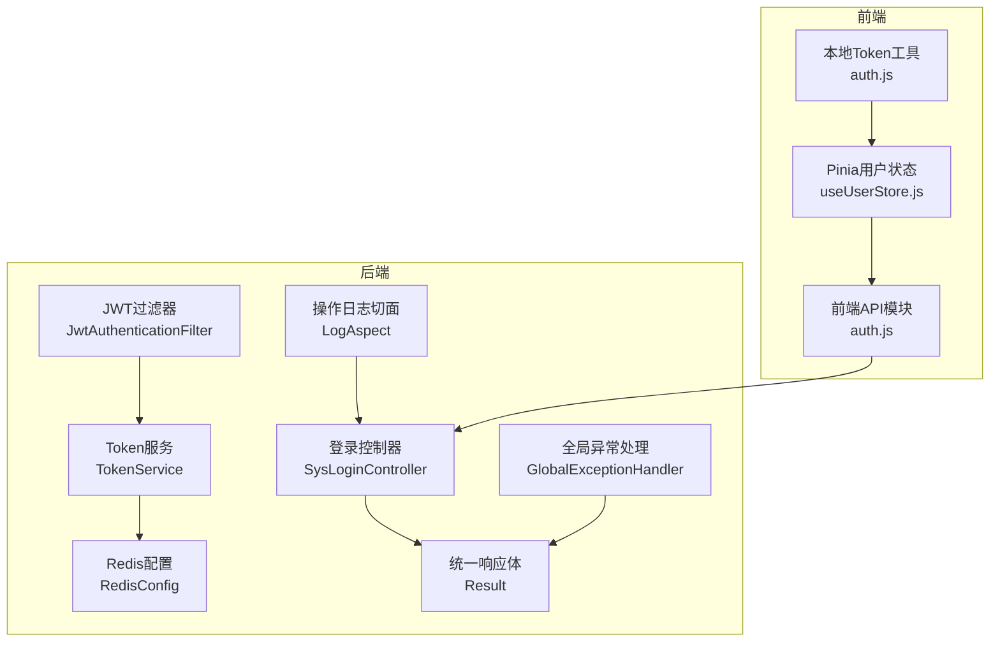
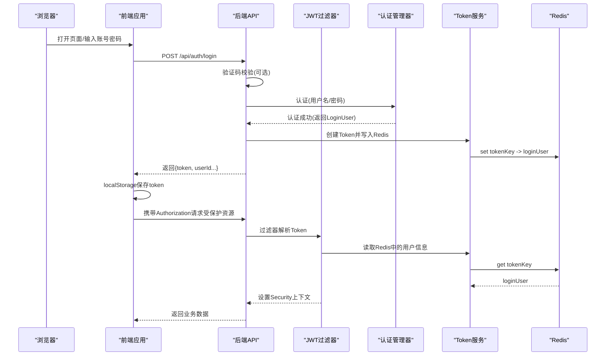
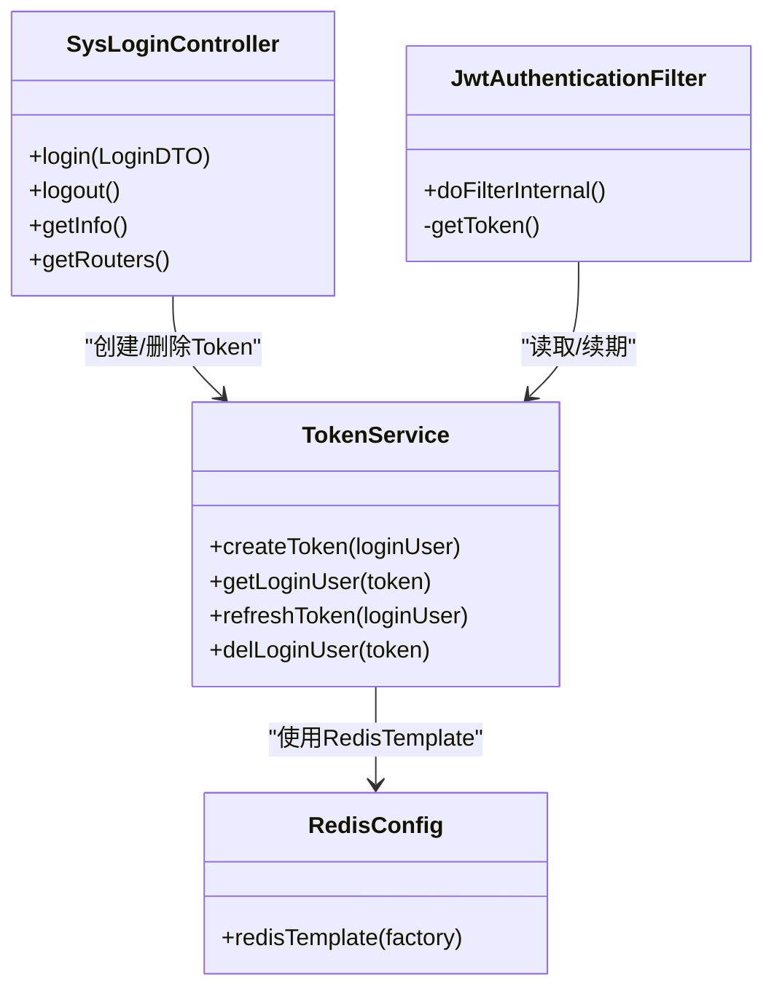
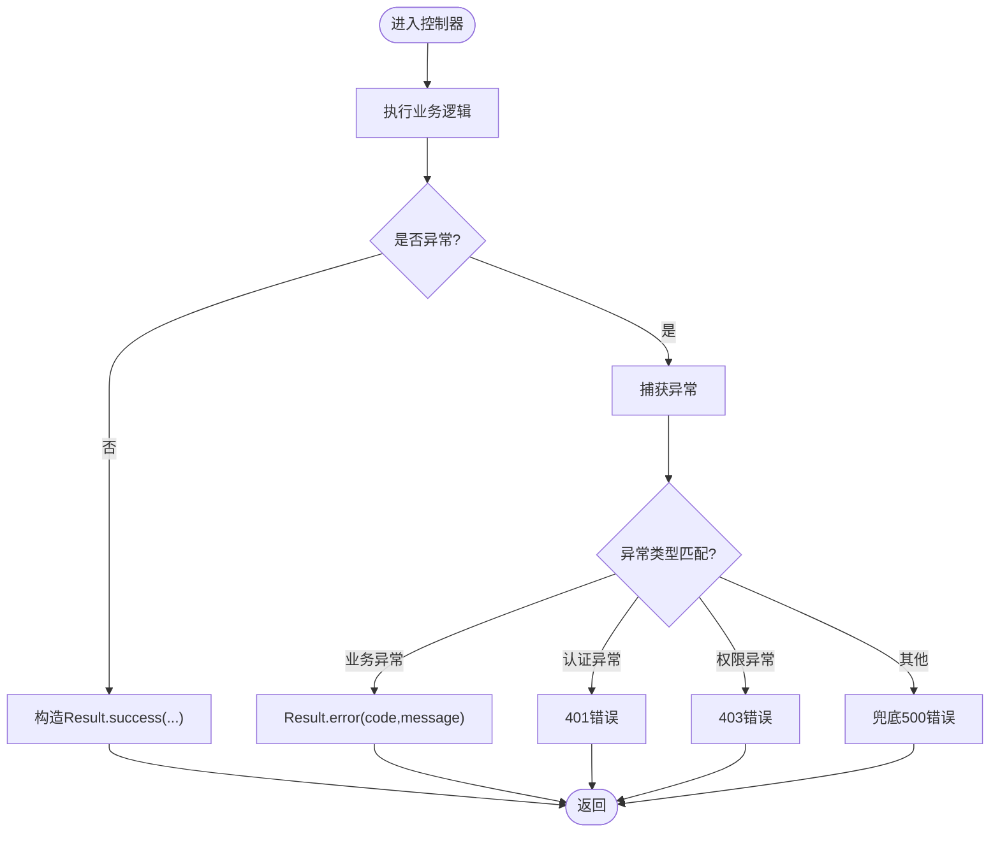
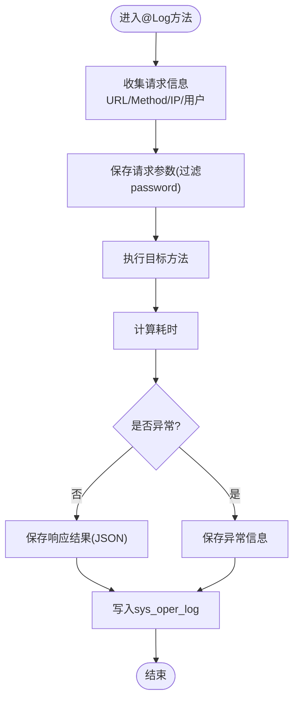
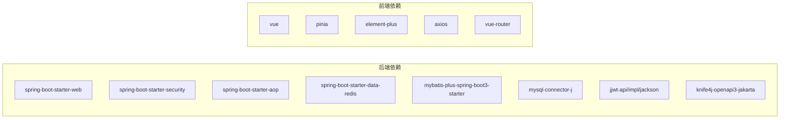

# 故障排查

<cite>
**本文引用的文件**
- [application.yml](file://task-manager-backend/src/main/resources/application.yml)
- [SysLoginController.java](file://task-manager-backend/src/main/java/com/taskmanager/controller/SysLoginController.java)
- [JwtAuthenticationFilter.java](file://task-manager-backend/src/main/java/com/taskmanager/security/JwtAuthenticationFilter.java)
- [TokenService.java](file://task-manager-backend/src/main/java/com/taskmanager/security/TokenService.java)
- [RedisConfig.java](file://task-manager-backend/src/main/java/com/taskmanager/config/RedisConfig.java)
- [GlobalExceptionHandler.java](file://task-manager-backend/src/main/java/com/taskmanager/common/exception/GlobalExceptionHandler.java)
- [LogAspect.java](file://task-manager-backend/src/main/java/com/taskmanager/aspect/LogAspect.java)
- [Result.java](file://task-manager-backend/src/main/java/com/taskmanager/common/Result.java)
- [SysOperLogMapper.java](file://task-manager-backend/src/main/java/com/taskmanager/mapper/SysOperLogMapper.java)
- [auth.js](file://task-manager-frontend/src/api/auth.js)
- [auth.js](file://task-manager-frontend/src/utils/auth.js)
- [useUserStore.js](file://task-manager-frontend/src/store/modules/useUserStore.js)
- [package.json](file://task-manager-frontend/package.json)
- [pom.xml](file://task-manager-backend/pom.xml)
</cite>

## 目录
1. [简介](#简介)
2. [项目结构](#项目结构)
3. [核心组件](#核心组件)
4. [架构总览](#架构总览)
5. [详细组件分析](#详细组件分析)
6. [依赖分析](#依赖分析)
7. [性能考虑](#性能考虑)
8. [故障排查指南](#故障排查指南)
9. [结论](#结论)
10. [附录](#附录)

## 简介
本指南面向CodeBuddy任务管理系统的运维与开发人员，聚焦于生产环境中的常见故障与应急处置。内容覆盖登录失败、权限异常、数据库与Redis连接问题、前端页面空白、日志分析、性能排查、系统监控指标解读、错误处理机制调试、以及生产应急响应与预防性监控配置。

## 项目结构
系统采用前后端分离架构：
- 后端基于Spring Boot 3 + Spring Security + Spring Data Redis + MyBatis-Plus，提供REST API与统一异常处理、操作日志切面。
- 前端基于Vue 3 + Pinia + Element Plus，通过Axios封装HTTP请求，本地存储Token并注入到请求头。

图表来源
- [SysLoginController.java:103-135](file://task-manager-backend/src/main/java/com/taskmanager/controller/SysLoginController.java#L103-L135)
- [JwtAuthenticationFilter.java:37-57](file://task-manager-backend/src/main/java/com/taskmanager/security/JwtAuthenticationFilter.java#L37-L57)
- [TokenService.java:34-41](file://task-manager-backend/src/main/java/com/taskmanager/security/TokenService.java#L34-L41)
- [RedisConfig.java:18-31](file://task-manager-backend/src/main/java/com/taskmanager/config/RedisConfig.java#L18-L31)
- [GlobalExceptionHandler.java:23-108](file://task-manager-backend/src/main/java/com/taskmanager/common/exception/GlobalExceptionHandler.java#L23-L108)
- [LogAspect.java:44-97](file://task-manager-backend/src/main/java/com/taskmanager/aspect/LogAspect.java#L44-L97)
- [Result.java:15-75](file://task-manager-backend/src/main/java/com/taskmanager/common/Result.java#L15-L75)
- [auth.js:16-22](file://task-manager-frontend/src/api/auth.js#L16-L22)
- [useUserStore.js:17-21](file://task-manager-frontend/src/store/modules/useUserStore.js#L17-L21)
- [auth.js:3-9](file://task-manager-frontend/src/utils/auth.js#L3-L9)

章节来源
- [application.yml:1-79](file://task-manager-backend/src/main/resources/application.yml#L1-L79)
- [pom.xml:32-145](file://task-manager-backend/pom.xml#L32-L145)
- [package.json:11-21](file://task-manager-frontend/package.json#L11-L21)

## 核心组件
- 登录与认证
  - 登录控制器负责验证码校验、用户认证、Token签发与Redis存储。
  - JWT过滤器从请求头提取Token，解析用户信息，构建认证上下文，并自动续期。
  - Token服务封装Redis中用户会话的创建、读取、刷新与删除。
- 统一响应与异常处理
  - 统一响应体封装code/message/data；全局异常处理器按类型返回标准错误。
- 日志与审计
  - 操作日志切面自动记录请求URL、方法、耗时、参数与异常信息至sys_oper_log表。
- 前端交互
  - 前端通过API模块调用后端接口，使用Pinia维护用户状态，localStorage持久化Token。

章节来源
- [SysLoginController.java:103-135](file://task-manager-backend/src/main/java/com/taskmanager/controller/SysLoginController.java#L103-L135)
- [JwtAuthenticationFilter.java:37-57](file://task-manager-backend/src/main/java/com/taskmanager/security/JwtAuthenticationFilter.java#L37-L57)
- [TokenService.java:34-41](file://task-manager-backend/src/main/java/com/taskmanager/security/TokenService.java#L34-L41)
- [GlobalExceptionHandler.java:23-108](file://task-manager-backend/src/main/java/com/taskmanager/common/exception/GlobalExceptionHandler.java#L23-L108)
- [LogAspect.java:44-97](file://task-manager-backend/src/main/java/com/taskmanager/aspect/LogAspect.java#L44-L97)
- [Result.java:15-75](file://task-manager-backend/src/main/java/com/taskmanager/common/Result.java#L15-L75)
- [auth.js:16-22](file://task-manager-frontend/src/api/auth.js#L16-L22)
- [useUserStore.js:17-21](file://task-manager-frontend/src/store/modules/useUserStore.js#L17-L21)
- [auth.js:3-9](file://task-manager-frontend/src/utils/auth.js#L3-L9)

## 架构总览
后端通过Spring Security拦截请求，JWT过滤器完成Token解析与认证上下文注入；登录控制器完成认证与会话建立；异常处理器统一输出；操作日志切面记录审计信息。前端通过Axios发起请求，携带Token，Pinia管理用户状态。

图表来源
- [SysLoginController.java:103-135](file://task-manager-backend/src/main/java/com/taskmanager/controller/SysLoginController.java#L103-L135)
- [JwtAuthenticationFilter.java:37-57](file://task-manager-backend/src/main/java/com/taskmanager/security/JwtAuthenticationFilter.java#L37-L57)
- [TokenService.java:34-41](file://task-manager-backend/src/main/java/com/taskmanager/security/TokenService.java#L34-L41)
- [RedisConfig.java:18-31](file://task-manager-backend/src/main/java/com/taskmanager/config/RedisConfig.java#L18-L31)
- [auth.js:16-22](file://task-manager-frontend/src/api/auth.js#L16-L22)
- [useUserStore.js:17-21](file://task-manager-frontend/src/store/modules/useUserStore.js#L17-L21)

## 详细组件分析

### 登录与认证组件
- 登录流程要点
  - 支持可选验证码校验；认证成功后创建UUID Token并写入Redis，设置过期时间。
  - 前端接收token后写入localStorage，后续请求由JWT过滤器解析并续期。
- 关键实现位置
  - 登录控制器：[SysLoginController.java:103-135](file://task-manager-backend/src/main/java/com/taskmanager/controller/SysLoginController.java#L103-L135)
  - JWT过滤器：[JwtAuthenticationFilter.java:37-57](file://task-manager-backend/src/main/java/com/taskmanager/security/JwtAuthenticationFilter.java#L37-L57)
  - Token服务：[TokenService.java:34-41](file://task-manager-backend/src/main/java/com/taskmanager/security/TokenService.java#L34-L41)
  - Redis配置：[RedisConfig.java:18-31](file://task-manager-backend/src/main/java/com/taskmanager/config/RedisConfig.java#L18-L31)

图表来源
- [SysLoginController.java:103-135](file://task-manager-backend/src/main/java/com/taskmanager/controller/SysLoginController.java#L103-L135)
- [JwtAuthenticationFilter.java:37-57](file://task-manager-backend/src/main/java/com/taskmanager/security/JwtAuthenticationFilter.java#L37-L57)
- [TokenService.java:34-41](file://task-manager-backend/src/main/java/com/taskmanager/security/TokenService.java#L34-L41)
- [RedisConfig.java:18-31](file://task-manager-backend/src/main/java/com/taskmanager/config/RedisConfig.java#L18-L31)

章节来源
- [SysLoginController.java:103-135](file://task-manager-backend/src/main/java/com/taskmanager/controller/SysLoginController.java#L103-L135)
- [JwtAuthenticationFilter.java:37-57](file://task-manager-backend/src/main/java/com/taskmanager/security/JwtAuthenticationFilter.java#L37-L57)
- [TokenService.java:34-41](file://task-manager-backend/src/main/java/com/taskmanager/security/TokenService.java#L34-L41)
- [RedisConfig.java:18-31](file://task-manager-backend/src/main/java/com/taskmanager/config/RedisConfig.java#L18-L31)

### 统一响应与异常处理
- 统一响应体Result提供success/error静态方法，后端接口统一返回该结构。
- 全局异常处理器按异常类型返回标准错误码与消息，便于前端统一处理。
- 关键实现位置
  - 统一响应体：[Result.java:15-75](file://task-manager-backend/src/main/java/com/taskmanager/common/Result.java#L15-L75)
  - 全局异常处理：[GlobalExceptionHandler.java:23-108](file://task-manager-backend/src/main/java/com/taskmanager/common/exception/GlobalExceptionHandler.java#L23-L108)

图表来源
- [GlobalExceptionHandler.java:23-108](file://task-manager-backend/src/main/java/com/taskmanager/common/exception/GlobalExceptionHandler.java#L23-L108)
- [Result.java:15-75](file://task-manager-backend/src/main/java/com/taskmanager/common/Result.java#L15-L75)

章节来源
- [Result.java:15-75](file://task-manager-backend/src/main/java/com/taskmanager/common/Result.java#L15-L75)
- [GlobalExceptionHandler.java:23-108](file://task-manager-backend/src/main/java/com/taskmanager/common/exception/GlobalExceptionHandler.java#L23-L108)

### 操作日志切面
- 切面自动记录请求URL、方法、客户端IP、请求参数（过滤password）、响应结果、耗时与异常信息。
- 最终将日志写入sys_oper_log表，便于审计与问题回溯。
- 关键实现位置
  - 切面：[LogAspect.java:44-97](file://task-manager-backend/src/main/java/com/taskmanager/aspect/LogAspect.java#L44-L97)
  - Mapper：[SysOperLogMapper.java:11-12](file://task-manager-backend/src/main/java/com/taskmanager/mapper/SysOperLogMapper.java#L11-L12)

图表来源
- [LogAspect.java:44-97](file://task-manager-backend/src/main/java/com/taskmanager/aspect/LogAspect.java#L44-L97)
- [SysOperLogMapper.java:11-12](file://task-manager-backend/src/main/java/com/taskmanager/mapper/SysOperLogMapper.java#L11-L12)

章节来源
- [LogAspect.java:44-97](file://task-manager-backend/src/main/java/com/taskmanager/aspect/LogAspect.java#L44-L97)
- [SysOperLogMapper.java:11-12](file://task-manager-backend/src/main/java/com/taskmanager/mapper/SysOperLogMapper.java#L11-L12)

### 前端交互与状态管理
- 前端通过API模块调用后端接口，使用localStorage保存Token并在请求头注入。
- Pinia Store维护用户信息、角色与权限，登出时清理状态并跳转登录页。
- 关键实现位置
  - 登录API：[auth.js:16-22](file://task-manager-frontend/src/api/auth.js#L16-L22)
  - 用户状态：[useUserStore.js:17-21](file://task-manager-frontend/src/store/modules/useUserStore.js#L17-L21)
  - Token工具：[auth.js:3-9](file://task-manager-frontend/src/utils/auth.js#L3-L9)
  - 依赖清单：[package.json:11-21](file://task-manager-frontend/package.json#L11-L21)

章节来源
- [auth.js:16-22](file://task-manager-frontend/src/api/auth.js#L16-L22)
- [useUserStore.js:17-21](file://task-manager-frontend/src/store/modules/useUserStore.js#L17-L21)
- [auth.js:3-9](file://task-manager-frontend/src/utils/auth.js#L3-L9)
- [package.json:11-21](file://task-manager-frontend/package.json#L11-L21)

## 依赖分析
- 后端依赖
  - Spring Boot Web、Security、AOP、Data Redis、MyBatis-Plus、MySQL驱动、JWT、Knife4j、Hutool、Commons Lang3、Easy-Captcha等。
- 前端依赖
  - Vue 3、Pinia、Element Plus、Axios、Vue Router等。

图表来源
- [pom.xml:32-145](file://task-manager-backend/pom.xml#L32-L145)
- [package.json:11-21](file://task-manager-frontend/package.json#L11-L21)

章节来源
- [pom.xml:32-145](file://task-manager-backend/pom.xml#L32-L145)
- [package.json:11-21](file://task-manager-frontend/package.json#L11-L21)

## 性能考虑
- 连接池与超时
  - 数据源HikariCP连接池参数需结合QPS与事务时长评估，避免连接不足或空闲过多导致资源浪费。
  - Redis连接池大小与超时需与并发请求数匹配，防止阻塞。
- 缓存命中与续期
  - Token在每次有效请求时自动续期，需关注Redis写放大与过期策略。
- 日志与审计
  - 操作日志写入数据库可能成为瓶颈，建议对高频接口降采样或异步落库。
- 前端渲染
  - 大列表分页加载、懒加载组件、减少不必要的重渲染。

[本节为通用指导，无需列出具体文件来源]

## 故障排查指南

### 一、登录失败
- 症状
  - 前端提示“认证失败，请重新登录”或401。
- 诊断步骤
  1) 检查后端日志：确认是否触发全局异常处理器的认证异常分支。
  2) 检查Redis：确认Token是否创建成功、是否存在、是否过期。
  3) 检查请求头：确认Authorization头是否正确携带前缀与Token。
  4) 检查数据库：确认用户是否存在、密码是否加密匹配。
  5) 检查验证码：若启用，确认验证码是否校验通过。
- 处理建议
  - 若认证异常，检查用户名/密码是否正确；若Token无效，引导重新登录。
  - 若Redis异常，检查连接配置与可用性，必要时临时禁用Redis缓存进行对比测试。
  - 若数据库异常，检查连接池参数与SQL执行情况。

章节来源
- [GlobalExceptionHandler.java:58-65](file://task-manager-backend/src/main/java/com/taskmanager/common/exception/GlobalExceptionHandler.java#L58-L65)
- [TokenService.java:34-41](file://task-manager-backend/src/main/java/com/taskmanager/security/TokenService.java#L34-L41)
- [JwtAuthenticationFilter.java:37-57](file://task-manager-backend/src/main/java/com/taskmanager/security/JwtAuthenticationFilter.java#L37-L57)
- [SysLoginController.java:103-135](file://task-manager-backend/src/main/java/com/taskmanager/controller/SysLoginController.java#L103-L135)

### 二、权限异常（403）
- 症状
  - 返回403“没有权限，请联系管理员授权”。
- 诊断步骤
  1) 检查后端日志：确认是否命中权限拒绝异常处理。
  2) 检查用户角色与权限：确认用户角色与权限集合是否正确加载。
  3) 检查路由与菜单：确认前端路由是否与后端权限一致。
- 处理建议
  - 为用户授予对应角色与权限；核对菜单树与路由生成逻辑。

章节来源
- [GlobalExceptionHandler.java:48-54](file://task-manager-backend/src/main/java/com/taskmanager/common/exception/GlobalExceptionHandler.java#L48-L54)
- [SysLoginController.java:175-197](file://task-manager-backend/src/main/java/com/taskmanager/controller/SysLoginController.java#L175-L197)

### 三、数据库连接问题
- 症状
  - SQL执行超时、连接池耗尽、启动报错。
- 诊断步骤
  1) 检查application.yml中的数据库连接参数与驱动。
  2) 查看HikariCP连接池状态与活跃连接数。
  3) 检查慢查询与锁等待。
- 处理建议
  - 调整最小空闲、最大池大小、连接超时；优化SQL与索引；拆分读写库或引入连接池监控。

章节来源
- [application.yml:5-16](file://task-manager-backend/src/main/resources/application.yml#L5-L16)

### 四、Redis连接问题
- 症状
  - Token读取失败、认证上下文为空、频繁超时。
- 诊断步骤
  1) 检查Redis配置与连通性。
  2) 检查RedisTemplate序列化配置。
  3) 检查Redis连接池参数与最大活跃连接。
- 处理建议
  1) 修复连接参数；扩容连接池；开启Redis慢查询日志定位热点Key。
  2) 若Redis不可用，可临时降级（仅限测试环境）以验证业务可用性。

章节来源
- [application.yml:18-32](file://task-manager-backend/src/main/resources/application.yml#L18-L32)
- [RedisConfig.java:18-31](file://task-manager-backend/src/main/java/com/taskmanager/config/RedisConfig.java#L18-L31)
- [TokenService.java:34-41](file://task-manager-backend/src/main/java/com/taskmanager/security/TokenService.java#L34-L41)

### 五、前端页面空白
- 症状
  - 页面白屏或路由无法跳转。
- 诊断步骤
  1) 打开浏览器控制台，检查是否有JS错误或跨域问题。
  2) 检查网络面板：登录接口是否成功、Token是否写入localStorage。
  3) 检查路由守卫与权限状态：用户信息是否拉取成功。
- 处理建议
  - 修复跨域与静态资源路径；确保登录成功后写入Token并初始化用户信息；检查路由与菜单生成逻辑。

章节来源
- [auth.js:16-22](file://task-manager-frontend/src/api/auth.js#L16-L22)
- [useUserStore.js:17-33](file://task-manager-frontend/src/store/modules/useUserStore.js#L17-L33)
- [auth.js:3-9](file://task-manager-frontend/src/utils/auth.js#L3-L9)
- [package.json:11-21](file://task-manager-frontend/package.json#L11-L21)

### 六、日志分析方法与技巧
- 后端日志
  - 全局异常处理器会记录请求URI与异常信息；操作日志切面会记录请求参数、耗时与异常。
  - 建议开启INFO/WARN级别，结合业务日志定位问题。
- 前端控制台
  - 打开开发者工具，查看Console与Network标签页，定位错误堆栈与失败请求。
- 网络请求监控
  - 使用浏览器Network面板观察请求/响应、状态码、耗时；结合后端操作日志定位异常。

章节来源
- [GlobalExceptionHandler.java:23-108](file://task-manager-backend/src/main/java/com/taskmanager/common/exception/GlobalExceptionHandler.java#L23-L108)
- [LogAspect.java:44-97](file://task-manager-backend/src/main/java/com/taskmanager/aspect/LogAspect.java#L44-L97)

### 七、性能问题排查流程
- 慢查询识别
  - 启用数据库慢查询日志；结合操作日志中的耗时字段定位慢接口。
- 内存泄漏检测
  - 关注大对象持有、线程池与连接池泄漏；前端关注事件监听未移除、定时器未清理。
- 并发问题定位
  - 检查共享状态访问顺序、锁竞争；后端关注线程池饱和与Redis阻塞。

章节来源
- [LogAspect.java:44-97](file://task-manager-backend/src/main/java/com/taskmanager/aspect/LogAspect.java#L44-L97)

### 八、系统监控指标解读
- CPU使用率
  - 高CPU通常由热点线程、GC频繁或死循环引起；结合线程Dump定位。
- 内存占用
  - 关注堆外内存（Redis/NIO）、对象存活与晋升；排查大对象与缓存膨胀。
- 数据库连接数
  - 连接池峰值接近上限需扩容或优化SQL；关注连接泄漏。
- Redis性能指标
  - 命中率下降、延迟升高、内存占用上升需检查Key设计与过期策略。

[本节为通用指导，无需列出具体文件来源]

### 九、错误处理机制调试
- 异常堆栈分析
  - 从全局异常处理器的日志入手，定位异常类型与发生路径。
- 错误码含义
  - 400参数校验失败、401认证失败、403权限不足、405请求方式不支持、500系统异常。
- 错误信息定位
  - 结合操作日志中的请求参数与异常消息，快速复现与修复。

章节来源
- [GlobalExceptionHandler.java:23-108](file://task-manager-backend/src/main/java/com/taskmanager/common/exception/GlobalExceptionHandler.java#L23-L108)
- [LogAspect.java:44-97](file://task-manager-backend/src/main/java/com/taskmanager/aspect/LogAspect.java#L44-L97)

### 十、生产应急响应流程与恢复策略
- 流程
  1) 快速隔离：停止滚动发布，回滚至上一个稳定版本。
  2) 降级与熔断：关闭非关键功能，释放资源；对Redis/DB进行限流。
  3) 修复与验证：定位根因、修复、灰度验证。
  4) 恢复与复盘：全量上线、监控回归、总结改进。
- 恢复策略
  - 数据库：备份与恢复演练；主从切换预案。
  - Redis：哨兵/集群部署；热备与故障转移。
  - 应用：多实例部署、健康检查、自动扩缩容。

[本节为通用指导，无需列出具体文件来源]

### 十一、故障预防与监控告警
- 预防措施
  - 代码层面：参数校验、异常分类、日志分级、超时与重试策略。
  - 运维层面：容量规划、压测、变更评审、备份演练。
- 监控告警
  - 关键指标：接口RT/P95、错误率、连接池使用率、Redis命中率、GC频率。
  - 告警阈值：基于历史基线与SLA设定，避免误报与漏报。

[本节为通用指导，无需列出具体文件来源]

## 结论
通过统一的异常处理、操作日志与JWT认证体系，结合前后端协作与完善的监控告警，可以高效定位与解决CodeBuddy任务管理系统在生产环境中的各类故障。建议持续完善容量规划、压测与演练，确保系统在高负载与异常场景下的稳定性。

## 附录
- 关键配置参考
  - 数据库与Redis连接、连接池参数：[application.yml:5-32](file://task-manager-backend/src/main/resources/application.yml#L5-L32)
  - JWT配置：[application.yml:51-56](file://task-manager-backend/src/main/resources/application.yml#L51-L56)
- 依赖清单
  - 后端依赖：[pom.xml:32-145](file://task-manager-backend/pom.xml#L32-L145)
  - 前端依赖：[package.json:11-21](file://task-manager-frontend/package.json#L11-L21)