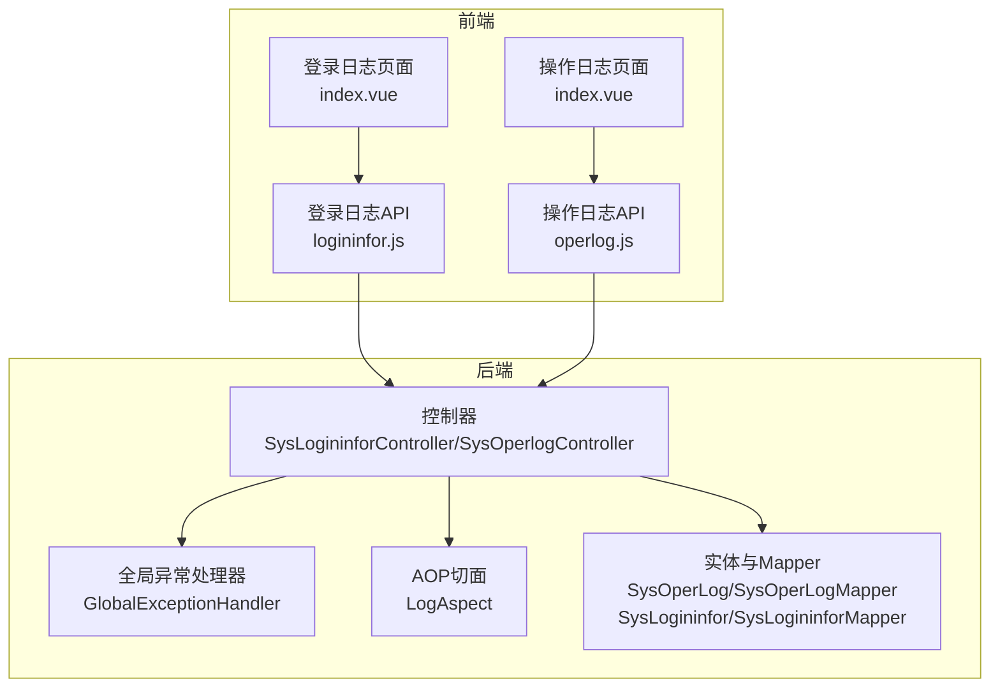
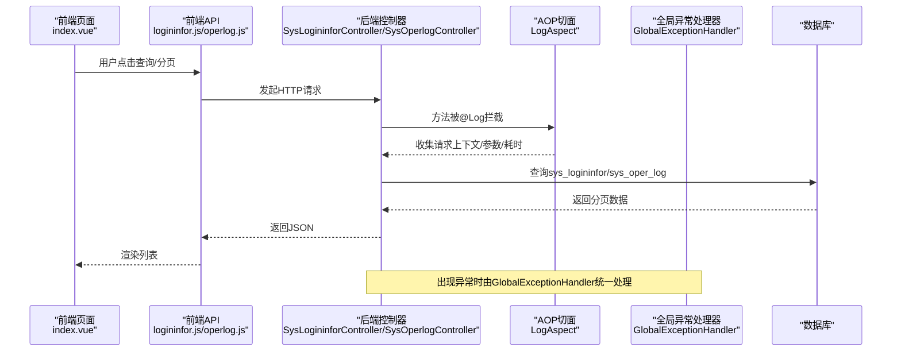
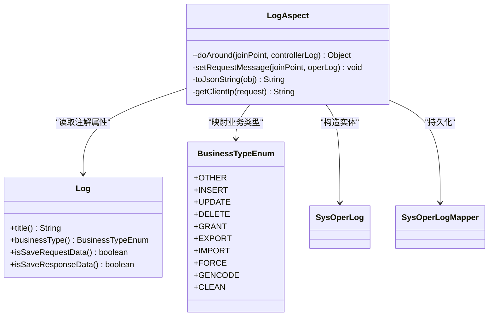
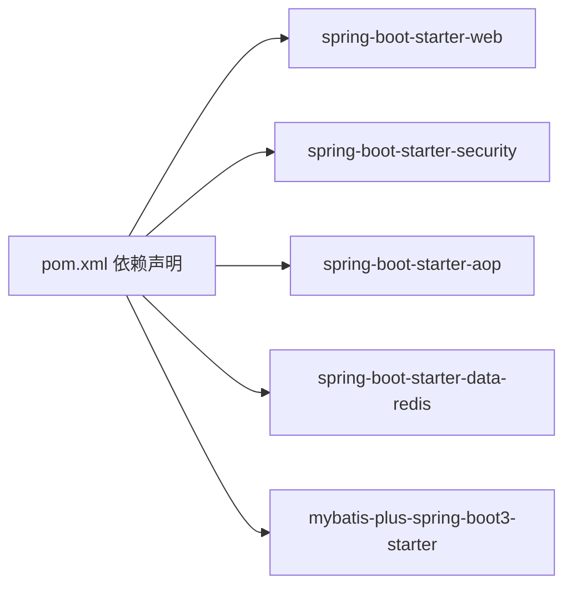

# 日志分析

<cite>
**本文引用的文件**
- [application.yml](file://task-manager-backend/src/main/resources/application.yml)
- [GlobalExceptionHandler.java](file://task-manager-backend/src/main/java/com/taskmanager/common/exception/GlobalExceptionHandler.java)
- [ServiceException.java](file://task-manager-backend/src/main/java/com/taskmanager/common/exception/ServiceException.java)
- [CaptchaException.java](file://task-manager-backend/src/main/java/com/taskmanager/common/exception/CaptchaException.java)
- [LogAspect.java](file://task-manager-backend/src/main/java/com/taskmanager/aspect/LogAspect.java)
- [Log.java](file://task-manager-backend/src/main/java/com/taskmanager/common/annotation/Log.java)
- [BusinessTypeEnum.java](file://task-manager-backend/src/main/java/com/taskmanager/common/enums/BusinessTypeEnum.java)
- [SysOperLog.java](file://task-manager-backend/src/main/java/com/taskmanager/domain/SysOperLog.java)
- [SysOperLogMapper.java](file://task-manager-backend/src/main/java/com/taskmanager/mapper/SysOperLogMapper.java)
- [SysLogininfor.java](file://task-manager-backend/src/main/java/com/taskmanager/domain/SysLogininfor.java)
- [SysLogininforMapper.java](file://task-manager-backend/src/main/java/com/taskmanager/mapper/SysLogininforMapper.java)
- [SysLoginController.java](file://task-manager-backend/src/main/java/com/taskmanager/controller/SysLoginController.java)
- [SysLogininforController.java](file://task-manager-backend/src/main/java/com/taskmanager/controller/SysLogininforController.java)
- [SysOperlogController.java](file://task-manager-backend/src/main/java/com/taskmanager/controller/SysOperlogController.java)
- [logininfor.js](file://task-manager-frontend/src/api/monitor/logininfor.js)
- [operlog.js](file://task-manager-frontend/src/api/monitor/operlog.js)
- [index.vue（登录日志）](file://task-manager-frontend/src/views/monitor/logininfor/index.vue)
- [index.vue（操作日志）](file://task-manager-frontend/src/views/monitor/operlog/index.vue)
- [application-test.yml](file://task-manager-backend/src/test/resources/application-test.yml)
- [pom.xml](file://task-manager-backend/pom.xml)
</cite>

## 目录
1. [简介](#简介)
2. [项目结构](#项目结构)
3. [核心组件](#核心组件)
4. [架构总览](#架构总览)
5. [组件详解](#组件详解)
6. [依赖关系分析](#依赖关系分析)
7. [性能与日志级别建议](#性能与日志级别建议)
8. [故障排查指南](#故障排查指南)
9. [结论](#结论)
10. [附录](#附录)

## 简介
本指南面向CodeBuddy任务管理系统的运维与开发人员，系统性讲解后端日志配置与分析方法，涵盖全局异常日志、AOP切面日志（操作日志/登录日志）、前端控制台与网络面板调试要点，并提供日志轮转与归档、搜索与过滤、监控与告警的实践建议。文档以仓库中实际代码为依据，结合前后端交互路径，帮助快速定位问题并提升排障效率。

## 项目结构
后端采用Spring Boot工程，日志相关能力主要集中在：
- 全局异常处理：统一捕获并记录异常，输出标准结果
- AOP切面：围绕控制器方法自动采集请求上下文、参数、耗时与结果
- 控制器：提供登录日志与操作日志的查询接口
- 前端：提供登录日志与操作日志的可视化页面与API调用

图表来源
- [SysLogininforController.java](file://task-manager-backend/src/main/java/com/taskmanager/controller/SysLogininforController.java)
- [SysOperlogController.java](file://task-manager-backend/src/main/java/com/taskmanager/controller/SysOperlogController.java)
- [GlobalExceptionHandler.java](file://task-manager-backend/src/main/java/com/taskmanager/common/exception/GlobalExceptionHandler.java)
- [LogAspect.java](file://task-manager-backend/src/main/java/com/taskmanager/aspect/LogAspect.java)
- [SysOperLog.java](file://task-manager-backend/src/main/java/com/taskmanager/domain/SysOperLog.java)
- [SysOperLogMapper.java](file://task-manager-backend/src/main/java/com/taskmanager/mapper/SysOperLogMapper.java)
- [SysLogininfor.java](file://task-manager-backend/src/main/java/com/taskmanager/domain/SysLogininfor.java)
- [SysLogininforMapper.java](file://task-manager-backend/src/main/java/com/taskmanager/mapper/SysLogininforMapper.java)
- [index.vue（登录日志）](file://task-manager-frontend/src/views/monitor/logininfor/index.vue)
- [index.vue（操作日志）](file://task-manager-frontend/src/views/monitor/operlog/index.vue)
- [logininfor.js](file://task-manager-frontend/src/api/monitor/logininfor.js)
- [operlog.js](file://task-manager-frontend/src/api/monitor/operlog.js)

章节来源
- [application.yml:1-79](file://task-manager-backend/src/main/resources/application.yml#L1-L79)
- [pom.xml:1-206](file://task-manager-backend/pom.xml#L1-L206)

## 核心组件
- 全局异常处理器：集中捕获业务异常、认证/权限异常、参数校验异常、请求方式不支持、验证码异常以及兜底异常，统一输出标准响应并记录日志。
- AOP切面：对标注@Log的方法进行环绕拦截，自动采集模块、业务类型、请求URL、IP、方法、耗时、请求/响应数据、状态与错误信息，并持久化到sys_oper_log表。
- 登录日志与操作日志：提供查询接口与前端页面，支持按条件分页检索。
- MyBatis-Plus日志：开启StdOutImpl输出SQL与参数，便于排查数据层问题。

章节来源
- [GlobalExceptionHandler.java:1-109](file://task-manager-backend/src/main/java/com/taskmanager/common/exception/GlobalExceptionHandler.java#L1-L109)
- [LogAspect.java:1-137](file://task-manager-backend/src/main/java/com/taskmanager/aspect/LogAspect.java#L1-L137)
- [Log.java:1-38](file://task-manager-backend/src/main/java/com/taskmanager/common/annotation/Log.java#L1-L38)
- [BusinessTypeEnum.java:1-56](file://task-manager-backend/src/main/java/com/taskmanager/common/enums/BusinessTypeEnum.java#L1-L56)
- [SysOperLog.java](file://task-manager-backend/src/main/java/com/taskmanager/domain/SysOperLog.java)
- [SysOperLogMapper.java](file://task-manager-backend/src/main/java/com/taskmanager/mapper/SysOperLogMapper.java)
- [SysLogininfor.java](file://task-manager-backend/src/main/java/com/taskmanager/domain/SysLogininfor.java)
- [SysLogininforMapper.java](file://task-manager-backend/src/main/java/com/taskmanager/mapper/SysLogininforMapper.java)
- [SysLoginController.java](file://task-manager-backend/src/main/java/com/taskmanager/controller/SysLoginController.java)
- [SysLogininforController.java](file://task-manager-backend/src/main/java/com/taskmanager/controller/SysLogininforController.java)
- [SysOperlogController.java](file://task-manager-backend/src/main/java/com/taskmanager/controller/SysOperlogController.java)
- [application.yml:34-38](file://task-manager-backend/src/main/resources/application.yml#L34-L38)

## 架构总览
下图展示从浏览器到后端控制器、AOP切面、异常处理与数据持久化的完整链路，以及前端页面与API的调用关系。

图表来源
- [index.vue（登录日志）:69-82](file://task-manager-frontend/src/views/monitor/logininfor/index.vue#L69-L82)
- [index.vue（操作日志）:84-94](file://task-manager-frontend/src/views/monitor/operlog/index.vue#L84-L94)
- [logininfor.js](file://task-manager-frontend/src/api/monitor/logininfor.js)
- [operlog.js](file://task-manager-frontend/src/api/monitor/operlog.js)
- [SysLogininforController.java](file://task-manager-backend/src/main/java/com/taskmanager/controller/SysLogininforController.java)
- [SysOperlogController.java](file://task-manager-backend/src/main/java/com/taskmanager/controller/SysOperlogController.java)
- [LogAspect.java:44-97](file://task-manager-backend/src/main/java/com/taskmanager/aspect/LogAspect.java#L44-L97)
- [GlobalExceptionHandler.java:23-108](file://task-manager-backend/src/main/java/com/taskmanager/common/exception/GlobalExceptionHandler.java#L23-L108)

## 组件详解

### 后端日志配置与查看
- 日志输出位置与级别
  - 默认情况下，Spring Boot应用的标准输出即为日志输出位置；当前仓库未显式配置logging.file或log.path，因此日志默认输出至控制台。
  - 若需落盘文件，可在配置文件中添加日志文件路径与滚动策略（例如按大小滚动、保留天数等），并在启动参数中指定日志配置文件路径。
- MyBatis-Plus SQL日志
  - 已启用StdOutImpl，SQL与参数会直接打印到控制台，便于快速定位数据访问问题。
- 日志级别建议
  - 开发/测试：INFO
  - 生产：WARN及以上，必要时临时提升到DEBUG定位问题
- 日志文件位置
  - 若未配置文件路径，默认输出到控制台；生产环境建议配置文件输出路径与轮转策略。

章节来源
- [application.yml:34-38](file://task-manager-backend/src/main/resources/application.yml#L34-L38)

### 全局异常处理器日志分析
- 业务异常（ServiceException）
  - 特征：携带自定义错误码与消息；日志包含请求URI与异常信息；返回标准Result。
  - 分析要点：关注错误码与消息是否符合预期；检查上游调用是否正确传递参数。
- 验证码异常（CaptchaException）
  - 特征：警告级别日志；返回固定错误码与提示信息。
  - 分析要点：验证码生成/校验流程是否异常；图片/字符是否被篡改。
- 权限异常（AccessDeniedException）
  - 特征：返回403状态码；日志包含请求URI与异常信息。
  - 分析要点：确认用户权限与资源授权；检查@PreAuthorize规则与权限服务实现。
- 认证异常（AuthenticationException）
  - 特征：返回401状态码；日志包含请求URI与异常信息。
  - 分析要点：Token是否过期/无效；登录态是否被强制退出；网关/过滤器是否正确传递认证信息。
- 参数校验与绑定异常
  - 特征：参数校验失败或绑定失败；返回400状态码；日志包含具体校验/绑定失败信息。
- 请求方式不支持
  - 特征：返回405状态码；日志包含不支持的请求方式。
- 兜底异常
  - 特征：未捕获异常统一走此分支；返回“系统繁忙”提示；日志包含请求URI与堆栈。
- 建议的分析流程
  - 定位异常类型：根据返回码与日志前缀快速识别（业务/权限/认证/参数/系统）。
  - 关联请求上下文：结合请求URI、用户标识、时间窗口进行交叉验证。
  - 复现与回归：针对高发异常建立最小复现步骤与回归用例。

章节来源
- [GlobalExceptionHandler.java:23-108](file://task-manager-backend/src/main/java/com/taskmanager/common/exception/GlobalExceptionHandler.java#L23-L108)
- [ServiceException.java:1-35](file://task-manager-backend/src/main/java/com/taskmanager/common/exception/ServiceException.java#L1-L35)
- [CaptchaException.java:1-16](file://task-manager-backend/src/main/java/com/taskmanager/common/exception/CaptchaException.java#L1-L16)

### AOP切面日志分析（操作日志/登录日志）
- 操作日志（sys_oper_log）
  - 触发点：控制器方法上标注@Log注解。
  - 采集内容：模块名、业务类型、请求URL、IP、方法、耗时、请求参数（过滤敏感字段）、响应结果（可选）、状态（成功/失败）、错误信息（失败时）。
  - 写入策略：无论成功与否，最终都会尝试写入数据库；失败时记录错误摘要。
  - 业务类型枚举：包含新增、修改、删除、授权、导出、导入、强退、生成代码、清空数据等。
- 登录日志（sys_logininfor）
  - 触发点：登录控制器（SysLoginController）处理登录请求。
  - 采集内容：登录账号、IP、浏览器、操作系统、登录地点、登录状态（成功/失败）、提示信息、登录时间等。
  - 写入策略：登录完成后写入sys_logininfor表，供前端查询展示。
- 分析技巧
  - 快速定位：按模块名、操作人员、业务类型、状态筛选；结合时间范围与IP段缩小范围。
  - 性能分析：关注耗时字段，识别慢操作与批量操作。
  - 安全审计：核对敏感字段是否被正确脱敏（密码字段已过滤）；检查异常状态与错误信息。
  - 故障回溯：结合全局异常日志与操作日志，定位失败原因与影响范围。

图表来源
- [LogAspect.java:27-97](file://task-manager-backend/src/main/java/com/taskmanager/aspect/LogAspect.java#L27-L97)
- [Log.java:13-37](file://task-manager-backend/src/main/java/com/taskmanager/common/annotation/Log.java#L13-L37)
- [BusinessTypeEnum.java:8-38](file://task-manager-backend/src/main/java/com/taskmanager/common/enums/BusinessTypeEnum.java#L8-L38)
- [SysOperLog.java](file://task-manager-backend/src/main/java/com/taskmanager/domain/SysOperLog.java)
- [SysOperLogMapper.java](file://task-manager-backend/src/main/java/com/taskmanager/mapper/SysOperLogMapper.java)

章节来源
- [LogAspect.java:44-97](file://task-manager-backend/src/main/java/com/taskmanager/aspect/LogAspect.java#L44-L97)
- [Log.java:13-37](file://task-manager-backend/src/main/java/com/taskmanager/common/annotation/Log.java#L13-L37)
- [BusinessTypeEnum.java:8-38](file://task-manager-backend/src/main/java/com/taskmanager/common/enums/BusinessTypeEnum.java#L8-L38)

### 前端控制台与网络面板调试
- 控制台日志
  - 使用浏览器开发者工具的Console面板查看前端打印的日志与错误信息；关注网络请求失败、参数缺失、鉴权失败等提示。
- 网络面板
  - 在Network面板中观察登录日志与操作日志接口的请求与响应；重点检查状态码、响应体、请求头（如Authorization）与请求参数。
- 页面行为
  - 登录日志与操作日志页面已提供基础搜索与分页控件，待接入后端API后即可实时查看数据。

章节来源
- [index.vue（登录日志）:69-82](file://task-manager-frontend/src/views/monitor/logininfor/index.vue#L69-L82)
- [index.vue（操作日志）:84-94](file://task-manager-frontend/src/views/monitor/operlog/index.vue#L84-L94)
- [logininfor.js](file://task-manager-frontend/src/api/monitor/logininfor.js)
- [operlog.js](file://task-manager-frontend/src/api/monitor/operlog.js)

## 依赖关系分析
- 日志相关依赖
  - Spring Boot Starter Web、Security、AOP、Data Redis、MyBatis-Plus等均已在依赖中声明，为日志功能提供运行时支撑。
- 测试环境排除
  - 测试配置中排除了Redis自动配置，避免测试期间产生不必要的日志与连接。

图表来源
- [pom.xml:32-145](file://task-manager-backend/pom.xml#L32-L145)

章节来源
- [pom.xml:32-145](file://task-manager-backend/pom.xml#L32-L145)
- [application-test.yml:1-10](file://task-manager-backend/src/test/resources/application-test.yml#L1-L10)

## 性能与日志级别建议
- 日志级别
  - 生产环境建议使用WARN及以上级别，仅在定位问题时临时调整为DEBUG。
- SQL日志
  - 当前已启用StdOutImpl，便于开发阶段排查；生产环境建议关闭或外置到专用日志系统。
- AOP日志开销
  - 请求/响应数据序列化与数据库写入会带来一定开销；可通过@Log注解的开关字段按需控制。
- 并发与线程
  - 切面与异常处理器均为单例，注意避免在日志中输出大对象或阻塞操作。

[本节为通用建议，不直接分析具体文件]

## 故障排查指南
- 常见问题与定位思路
  - 401/403：优先检查认证/权限链路与全局异常日志；确认Token有效性与用户权限。
  - 参数校验失败：查看参数校验异常日志与前端表单输入；核对字段类型与必填项。
  - 操作超时/慢查询：结合操作日志耗时字段与数据库慢查询日志定位瓶颈。
  - 登录失败：核对登录日志状态与提示信息；检查验证码异常与认证异常日志。
- 关键日志关键字
  - 业务异常、权限拒绝、认证失败、参数校验失败、参数绑定失败、系统异常、操作日志写入失败。
- 复现步骤
  - 明确异常类型与触发场景；准备最小复现请求；在控制台与数据库侧同时观察日志与数据变化。

章节来源
- [GlobalExceptionHandler.java:23-108](file://task-manager-backend/src/main/java/com/taskmanager/common/exception/GlobalExceptionHandler.java#L23-L108)
- [LogAspect.java:88-96](file://task-manager-backend/src/main/java/com/taskmanager/aspect/LogAspect.java#L88-L96)

## 结论
通过统一的全局异常处理与AOP切面日志体系，结合前端页面与API的协同，能够高效地完成问题定位与根因分析。建议在生产环境中完善日志落盘与轮转策略、建立日志搜索与告警机制，持续优化日志质量与可观测性。

[本节为总结性内容，不直接分析具体文件]

## 附录

### 日志轮转与归档（配置建议）
- 文件大小限制与保留天数
  - 建议在配置文件中添加日志文件路径与滚动策略（例如按大小滚动、按时间滚动、保留天数等）。
- 日志清理策略
  - 可结合系统日志轮转工具（如logrotate）或应用内置策略，定期清理过期日志，避免磁盘占用过高。
- 启动参数
  - 如需外部化日志配置，可在启动参数中指定日志配置文件路径。

[本节为通用建议，不直接分析具体文件]

### 日志搜索与过滤技巧
- 关键词搜索
  - 使用日志平台的关键词检索功能，结合异常类型前缀（如“业务异常”、“权限拒绝”）快速过滤。
- 时间范围筛选
  - 将问题发生的时间窗口作为首要筛选条件，缩小搜索范围。
- 日志级别过滤
  - 先按ERROR/WARN筛选，再逐步降低到INFO，定位问题根源。
- 前端辅助
  - 借助浏览器Network面板与Console面板，结合后端日志进行端到端关联分析。

[本节为通用建议，不直接分析具体文件]

### 日志监控与告警（配置建议）
- 监控指标
  - 异常数量、401/403占比、操作日志失败率、数据库慢查询次数。
- 告警策略
  - 设定阈值（如单位时间内异常数超过阈值）触发告警；结合日志关键字与用户/模块维度进行分级告警。
- 平台集成
  - 建议将应用日志接入统一日志平台（如ELK/云日志服务），实现集中存储、检索与可视化。

[本节为通用建议，不直接分析具体文件]