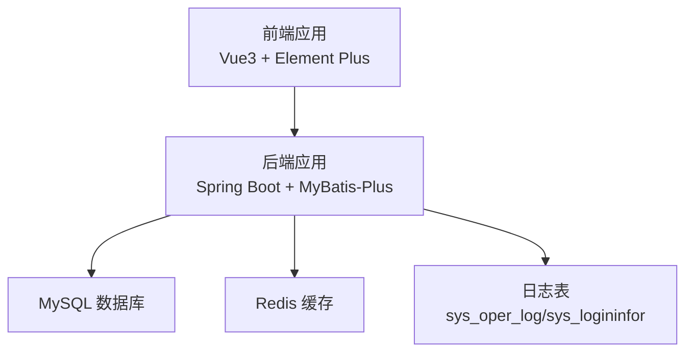
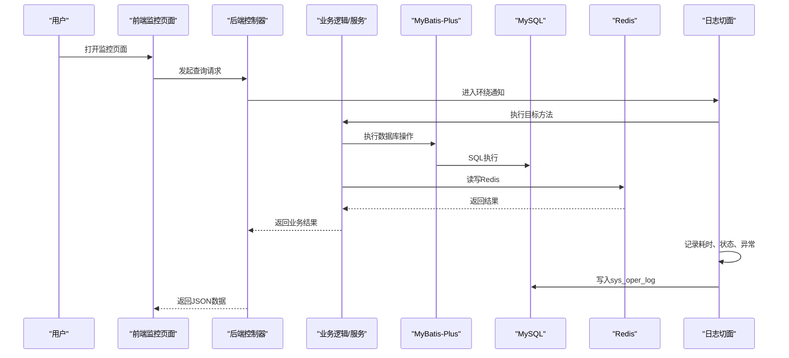
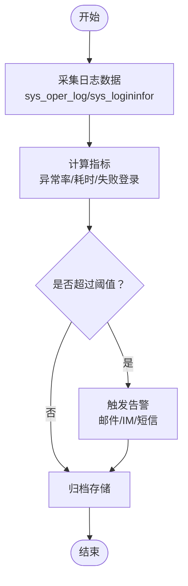
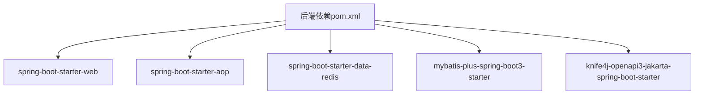
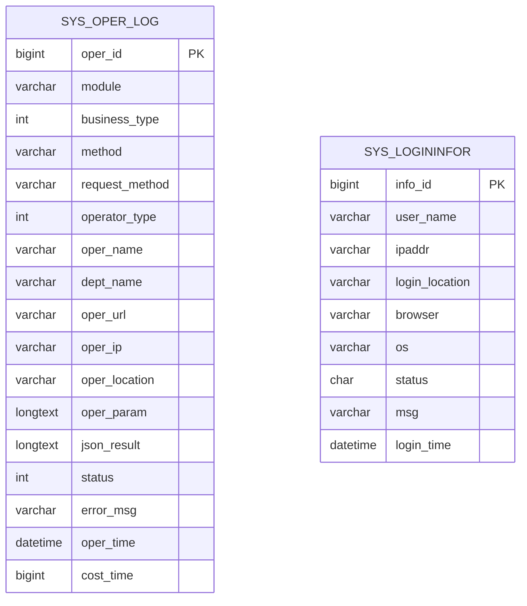

# 监控指标解读

<cite>
**本文引用的文件**
- [application.yml](file://task-manager-backend/src/main/resources/application.yml)
- [LogAspect.java](file://task-manager-backend/src/main/java/com/taskmanager/aspect/LogAspect.java)
- [RedisConfig.java](file://task-manager-backend/src/main/java/com/taskmanager/config/RedisConfig.java)
- [SysOperLog.java](file://task-manager-backend/src/main/java/com/taskmanager/domain/SysOperLog.java)
- [SysOperLogMapper.java](file://task-manager-backend/src/main/java/com/taskmanager/mapper/SysOperLogMapper.java)
- [schema.sql](file://task-manager-backend/src/main/resources/schema.sql)
- [Task.java](file://task-manager-backend/src/main/java/com/taskmanager/entity/Task.java)
- [pom.xml](file://task-manager-backend/pom.xml)
- [index.vue（操作日志）](file://task-manager-frontend/src/views/monitor/operlog/index.vue)
- [index.vue（登录日志）](file://task-manager-frontend/src/views/monitor/logininfor/index.vue)
- [package.json（前端）](file://task-manager-frontend/package.json)
</cite>

## 目录
1. [引言](#引言)
2. [项目结构](#项目结构)
3. [核心组件](#核心组件)
4. [架构总览](#架构总览)
5. [详细组件分析](#详细组件分析)
6. [依赖分析](#依赖分析)
7. [性能考量](#性能考量)
8. [故障排查指南](#故障排查指南)
9. [结论](#结论)
10. [附录](#附录)

## 引言
本指南面向CodeBuddy任务管理系统，围绕系统运行与业务健康度，提供一套可落地的监控指标解读与实践方案。内容覆盖系统资源（CPU、内存、磁盘、网络）、数据库性能（连接数、查询速度、锁等待、缓冲池使用率）、Redis性能（连接数、内存、命令响应时间、键空间大小）、应用层性能（请求响应时间、吞吐量、错误率、并发用户数）、日志监控与告警、分布式追踪与链路监控，以及监控数据可视化展示方法。文档以现有代码与配置为依据，结合最佳实践给出可操作的建议。

## 项目结构
项目采用前后端分离架构：
- 后端基于Spring Boot与MyBatis-Plus，提供REST接口与日志切面能力；配置文件集中于application.yml，包含数据库、Redis、MyBatis-Plus、Knife4j等关键配置。
- 前端基于Vue3与Element Plus，提供监控页面（操作日志、登录日志）的视图与交互，但当前尚未接入后端API。

**图表来源**
- [application.yml:1-79](file://task-manager-backend/src/main/resources/application.yml#L1-L79)
- [schema.sql:174-217](file://task-manager-backend/src/main/resources/schema.sql#L174-L217)

**章节来源**
- [application.yml:1-79](file://task-manager-backend/src/main/resources/application.yml#L1-L79)
- [schema.sql:174-217](file://task-manager-backend/src/main/resources/schema.sql#L174-L217)

## 核心组件
- 日志切面与日志表：通过环绕通知自动采集请求上下文、耗时、状态与异常信息，并持久化至sys_oper_log表，支撑后续指标分析与告警。
- Redis配置：统一Key/Value序列化策略，便于后续对键空间、内存使用等指标进行观测。
- 数据库与连接池：HikariCP连接池参数直接影响数据库吞吐与延迟，需结合慢查询与锁等待指标综合评估。
- 前端监控页面：提供操作日志与登录日志的筛选、分页与展示，为监控面板与报表提供基础数据入口。

**章节来源**
- [LogAspect.java:1-137](file://task-manager-backend/src/main/java/com/taskmanager/aspect/LogAspect.java#L1-L137)
- [SysOperLog.java:1-74](file://task-manager-backend/src/main/java/com/taskmanager/domain/SysOperLog.java#L1-L74)
- [SysOperLogMapper.java:1-13](file://task-manager-backend/src/main/java/com/taskmanager/mapper/SysOperLogMapper.java#L1-L13)
- [RedisConfig.java:1-33](file://task-manager-backend/src/main/java/com/taskmanager/config/RedisConfig.java#L1-L33)
- [application.yml:5-32](file://task-manager-backend/src/main/resources/application.yml#L5-L32)
- [schema.sql:174-217](file://task-manager-backend/src/main/resources/schema.sql#L174-L217)
- [index.vue（操作日志）:1-124](file://task-manager-frontend/src/views/monitor/operlog/index.vue#L1-L124)
- [index.vue（登录日志）:1-98](file://task-manager-frontend/src/views/monitor/logininfor/index.vue#L1-L98)

## 架构总览
下图展示了从请求进入后端，到数据库与Redis交互，再到日志落库的关键流程，以及前端监控页面的数据来源。

**图表来源**
- [LogAspect.java:44-97](file://task-manager-backend/src/main/java/com/taskmanager/aspect/LogAspect.java#L44-L97)
- [SysOperLog.java:1-74](file://task-manager-backend/src/main/java/com/taskmanager/domain/SysOperLog.java#L1-L74)
- [application.yml:5-32](file://task-manager-backend/src/main/resources/application.yml#L5-L32)
- [schema.sql:174-198](file://task-manager-backend/src/main/resources/schema.sql#L174-L198)

## 详细组件分析

### 系统资源监控（CPU、内存、磁盘、网络）
- CPU使用率
  - 含义：衡量进程占用的CPU时间比例，过高可能引发排队与延迟上升。
  - 监控方法：使用系统自带工具或APM采集器（如Prometheus Node Exporter），关注平均使用率与峰值。
  - 关联性：与请求处理耗时、数据库锁等待、Redis命令响应时间共同决定整体SLA。
- 内存占用
  - 含义：堆内与堆外内存使用情况，GC频率与停顿时间是关键信号。
  - 监控方法：采集堆内存、线程数、GC次数/时长；关注老年代增长趋势与Full GC频率。
  - 关联性：与MyBatis-Plus批量操作、Redis大key、日志写入频率相关。
- 磁盘空间
  - 含义：系统盘、日志盘、数据库数据/日志目录剩余空间。
  - 监控方法：设置阈值告警（如剩余10%触发预警），定期巡检备份与清理策略。
  - 关联性：日志表增长、慢查询日志、数据库binlog/redo log膨胀。
- 网络带宽
  - 含义：入/出站流量与连接数，识别异常抖动与DDoS风险。
  - 监控方法：采集每秒请求数、并发连接数、错误率、RT分布；观察突发流量与长尾延迟。

[本节为通用指导，不直接分析具体文件]

### 数据库性能指标解读
- 连接数
  - 含义：活跃连接数与最大连接池配置的关系，反映并发压力与资源紧张程度。
  - 阈值设置：参考HikariCP配置的最大池大小；建议在峰值前预留缓冲，避免拒绝连接。
  - 关联性：与请求响应时间、错误率、慢查询密切相关。
- 查询速度
  - 含义：平均/分位查询耗时，慢查询占比。
  - 监控方法：启用慢查询日志，统计Top N SQL；结合索引使用情况与执行计划。
  - 优化建议：补充缺失索引、拆分复杂查询、减少N+1、控制返回字段。
- 锁等待
  - 含义：事务等待行锁/间隙锁的时间，高锁等待通常意味着热点更新或长事务。
  - 监控方法：观察锁等待超时次数、锁等待时间、死锁计数。
  - 优化建议：缩短事务、降低隔离级别（谨慎）、拆分热点表、使用乐观锁。
- 缓冲池使用率
  - 含义：InnoDB缓冲池命中率与脏页比例，影响I/O放大。
  - 监控方法：关注缓冲池命中率、脏页刷新速率、检查点间隔。
  - 优化建议：增加缓冲池、优化热点数据访问模式、减少随机写放大。

**章节来源**
- [application.yml:10-17](file://task-manager-backend/src/main/resources/application.yml#L10-L17)
- [schema.sql:174-217](file://task-manager-backend/src/main/resources/schema.sql#L174-L217)

### Redis性能指标监控
- 连接数
  - 含义：当前活跃连接与池容量的关系，峰值接近上限可能导致拒绝。
  - 阈值设置：参考最大活跃连接配置；建议在高峰前留有余量。
- 内存使用
  - 含义：used_memory、used_memory_rss、内存碎片率。
  - 监控方法：关注内存使用率与增长趋势，识别大key与过期策略失效。
- 命令响应时间
  - 含义：P95/P99延迟，区分读写热点。
  - 监控方法：采样热点命令（如GET/SET/HGETALL等），识别慢命令。
- 键空间大小
  - 含义：键总数、过期键数量、平均TTL。
  - 监控方法：定期盘点冷数据与僵尸键，制定淘汰策略。
- 序列化与键设计
  - 影响：JSON序列化与Key命名规范影响内存与查询效率。
  - 建议：合理拆分大对象、避免嵌套过深、统一Key前缀与命名空间。

**章节来源**
- [application.yml:18-32](file://task-manager-backend/src/main/resources/application.yml#L18-L32)
- [RedisConfig.java:18-31](file://task-manager-backend/src/main/java/com/taskmanager/config/RedisConfig.java#L18-L31)

### 应用层性能指标
- 请求响应时间（RT）
  - 含义：从接收请求到返回响应的总耗时，分位值（P50/P90/P95/P99）更稳健。
  - 监控方法：在网关/拦截器/切面中埋点，按接口、方法、业务维度聚合。
  - 关联性：与数据库慢查询、Redis热点、线程池饱和度强相关。
- 吞吐量（QPS/RPS）
  - 含义：单位时间内处理的请求数，结合RT评估系统承载力。
  - 监控方法：按接口/模块统计，观察峰值与基线波动。
- 错误率
  - 含义：HTTP 4xx/5xx占比，异常分类（业务异常/系统异常）。
  - 监控方法：结合日志切面记录的状态与异常信息，建立阈值告警。
- 并发用户数
  - 含义：活跃会话/连接数，与线程池、连接池上限匹配。
  - 监控方法：结合登录日志与会话管理，评估峰值并发。

**章节来源**
- [LogAspect.java:44-97](file://task-manager-backend/src/main/java/com/taskmanager/aspect/LogAspect.java#L44-L97)
- [SysOperLog.java:68-72](file://task-manager-backend/src/main/java/com/taskmanager/domain/SysOperLog.java#L68-L72)

### 日志监控与告警
- 操作日志（sys_oper_log）
  - 内容：模块、业务类型、请求URL、方法、IP、耗时、状态、错误信息。
  - 指标：异常率、平均耗时、Top操作、异常堆栈关键词。
  - 告警：异常率突增、单接口RT异常、高频重复错误。
- 登录日志（sys_logininfor）
  - 内容：用户名、IP、地点、浏览器、OS、状态、消息、时间。
  - 指标：失败登录占比、异地登录、暴力破解尝试。
  - 告警：短时间多失败、跨地域登录、白名单外IP。
- 前端监控页面
  - 功能：筛选、分页、展示；当前为占位实现，需接入后端API。
  - 建议：完善分页参数、排序、导出能力，对接后端分页接口。

**图表来源**
- [LogAspect.java:44-97](file://task-manager-backend/src/main/java/com/taskmanager/aspect/LogAspect.java#L44-L97)
- [SysOperLog.java:1-74](file://task-manager-backend/src/main/java/com/taskmanager/domain/SysOperLog.java#L1-L74)
- [schema.sql:174-217](file://task-manager-backend/src/main/resources/schema.sql#L174-L217)
- [index.vue（操作日志）:84-89](file://task-manager-frontend/src/views/monitor/operlog/index.vue#L84-L89)
- [index.vue（登录日志）:69-73](file://task-manager-frontend/src/views/monitor/logininfor/index.vue#L69-L73)

**章节来源**
- [LogAspect.java:44-97](file://task-manager-backend/src/main/java/com/taskmanager/aspect/LogAspect.java#L44-L97)
- [SysOperLog.java:1-74](file://task-manager-backend/src/main/java/com/taskmanager/domain/SysOperLog.java#L1-L74)
- [schema.sql:174-217](file://task-manager-backend/src/main/resources/schema.sql#L174-L217)
- [index.vue（操作日志）:84-89](file://task-manager-frontend/src/views/monitor/operlog/index.vue#L84-L89)
- [index.vue（登录日志）:69-73](file://task-manager-frontend/src/views/monitor/logininfor/index.vue#L69-L73)

### 分布式追踪与链路监控
- 请求链路可视化
  - 建议：在网关/拦截器中注入TraceId，贯穿请求到数据库、Redis调用链路。
  - 指标：端到端RT、各环节耗时占比、错误传播路径。
- 服务间调用关系
  - 建议：基于埋点统计接口调用频次与耗时，绘制服务拓扑。
- 性能瓶颈定位
  - 方法：对比RT分布、错误率与数据库/Redis指标，定位热点与异常。

[本节为通用指导，不直接分析具体文件]

### 监控数据可视化
- 仪表板设计
  - 建议：分区域展示系统资源、数据库、Redis、应用层、日志告警。
  - 图表类型：折线图（趋势）、柱状图（错误分布）、热力图（地理分布）、散点图（RT分布）。
- 报表生成
  - 建议：按日/周/月生成SLA报告、慢查询TOP N、异常事件复盘。
- 前端页面
  - 当前前端监控页面为占位实现，需完善与后端API对接，支持分页、筛选、导出。

**章节来源**
- [index.vue（操作日志）:1-124](file://task-manager-frontend/src/views/monitor/operlog/index.vue#L1-L124)
- [index.vue（登录日志）:1-98](file://task-manager-frontend/src/views/monitor/logininfor/index.vue#L1-L98)
- [package.json（前端）:1-30](file://task-manager-frontend/package.json#L1-L30)

## 依赖分析
后端依赖中与监控密切相关的组件：
- Spring Boot Starter Web：提供HTTP请求处理与Web层监控基础。
- Spring Boot Starter AOP：支撑日志切面能力。
- Spring Boot Starter Data Redis：提供Redis连接与序列化配置。
- MyBatis-Plus：提供ORM与SQL执行监控入口。
- Knife4j：提供OpenAPI文档，便于接口级监控与压测。

**图表来源**
- [pom.xml:32-95](file://task-manager-backend/pom.xml#L32-L95)

**章节来源**
- [pom.xml:32-95](file://task-manager-backend/pom.xml#L32-L95)

## 性能考量
- 连接池与线程池
  - HikariCP最大池大小与连接超时应与数据库承载力匹配，避免过度连接导致排队。
  - 线程池队列长度与拒绝策略影响突发流量下的稳定性。
- 缓存策略
  - 合理设置TTL与淘汰策略，避免大key与热点Key集中。
  - 读写分离与多级缓存可降低数据库压力。
- 日志与审计
  - 切面记录的耗时与异常是评估性能的重要依据；建议异步落库或批量入库，避免阻塞主流程。
- 前端交互
  - 监控页面应支持分页、筛选与导出，提升可观测性与诊断效率。

[本节为通用指导，不直接分析具体文件]

## 故障排查指南
- 快速定位
  - 通过日志切面记录的异常信息与耗时，快速定位异常接口与调用链。
  - 结合数据库慢查询与锁等待指标，判断是否存在热点更新或索引缺失。
- 常见问题
  - 高RT：检查数据库连接池、Redis热点、线程池饱和、慢查询。
  - 高错误率：检查鉴权、参数校验、第三方依赖可用性。
  - 高内存：检查大对象序列化、缓存未命中、GC配置。
- 建议流程
  - 收集指标 -> 定位异常 -> 复现验证 -> 修复上线 -> 回归验证 -> 复盘总结。

**章节来源**
- [LogAspect.java:44-97](file://task-manager-backend/src/main/java/com/taskmanager/aspect/LogAspect.java#L44-L97)
- [SysOperLog.java:62-72](file://task-manager-backend/src/main/java/com/taskmanager/domain/SysOperLog.java#L62-L72)

## 结论
通过对日志切面、数据库与Redis配置、前端监控页面的梳理，可以构建从系统资源到应用层的全链路监控体系。建议以“指标-告警-可视化-闭环”为主线，持续迭代优化，保障系统在高并发场景下的稳定性与可诊断性。

## 附录
- 数据模型（与监控相关）
  - sys_oper_log：操作日志表，包含模块、业务类型、请求URL、方法、IP、耗时、状态、错误信息等。
  - sys_logininfor：登录日志表，包含用户、IP、地点、浏览器、OS、状态、消息、时间等。

**图表来源**
- [schema.sql:174-217](file://task-manager-backend/src/main/resources/schema.sql#L174-L217)