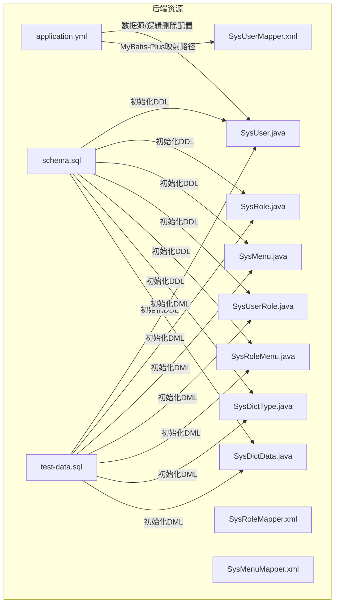
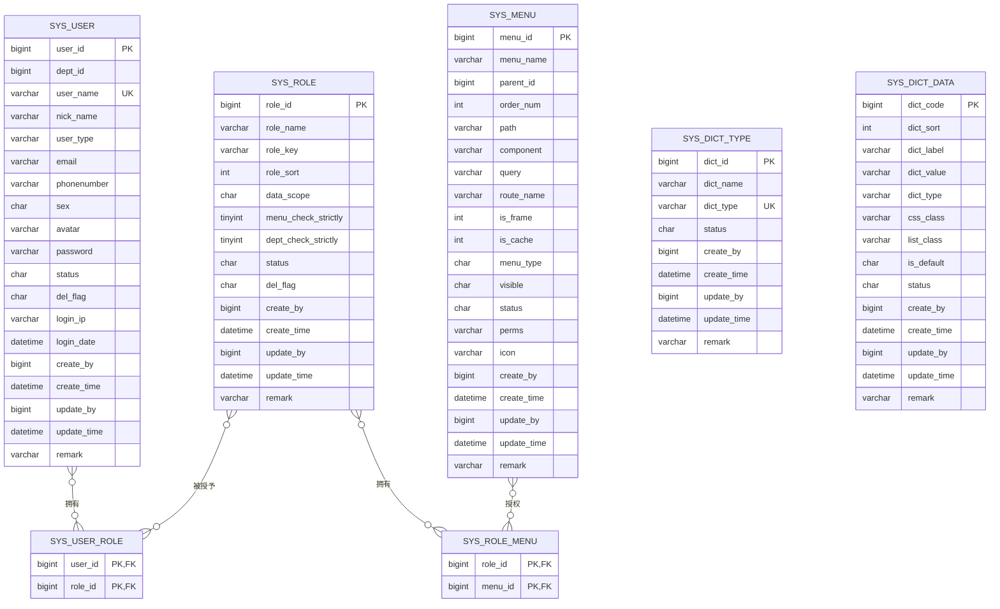
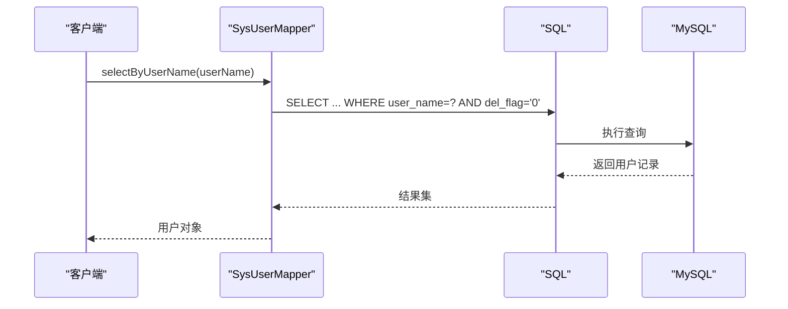
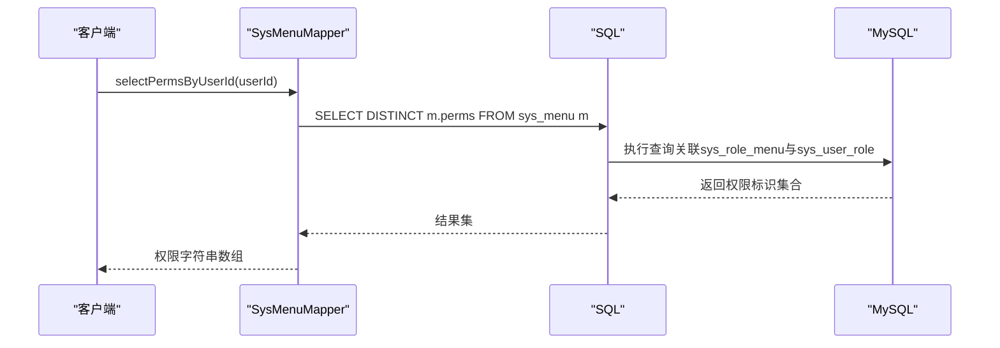
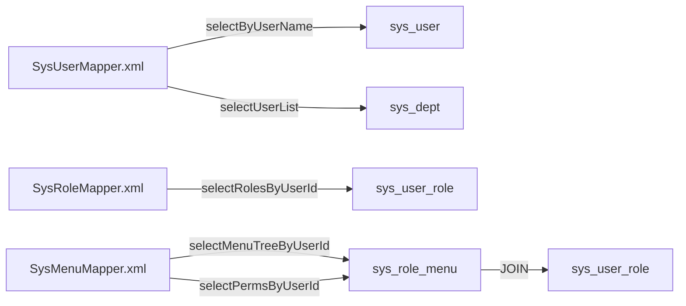

# 数据库设计

<cite>
**本文引用的文件**
- [schema.sql](file://task-manager-backend/src/main/resources/schema.sql)
- [test-data.sql](file://task-manager-backend/src/main/resources/test-data.sql)
- [application.yml](file://task-manager-backend/src/main/resources/application.yml)
- [SysUser.java](file://task-manager-backend/src/main/java/com/taskmanager/domain/SysUser.java)
- [SysRole.java](file://task-manager-backend/src/main/java/com/taskmanager/domain/SysRole.java)
- [SysMenu.java](file://task-manager-backend/src/main/java/com/taskmanager/domain/SysMenu.java)
- [SysUserRole.java](file://task-manager-backend/src/main/java/com/taskmanager/domain/SysUserRole.java)
- [SysRoleMenu.java](file://task-manager-backend/src/main/java/com/taskmanager/domain/SysRoleMenu.java)
- [SysDictType.java](file://task-manager-backend/src/main/java/com/taskmanager/domain/SysDictType.java)
- [SysDictData.java](file://task-manager-backend/src/main/java/com/taskmanager/domain/SysDictData.java)
- [SysDept.java](file://task-manager-backend/src/main/java/com/taskmanager/domain/SysDept.java)
- [SysLogininfor.java](file://task-manager-backend/src/main/java/com/taskmanager/domain/SysLogininfor.java)
- [SysOperLog.java](file://task-manager-backend/src/main/java/com/taskmanager/domain/SysOperLog.java)
- [Product.java](file://task-manager-backend/src/main/java/com/taskmanager/domain/Product.java)
- [Warehouse.java](file://task-manager-backend/src/main/java/com/taskmanager/domain/Warehouse.java)
- [SysUserMapper.xml](file://task-manager-backend/src/main/resources/mapper/SysUserMapper.xml)
- [SysRoleMapper.xml](file://task-manager-backend/src/main/resources/mapper/SysRoleMapper.xml)
- [SysMenuMapper.xml](file://task-manager-backend/src/main/resources/mapper/SysMenuMapper.xml)
</cite>

## 目录
1. [引言](#引言)
2. [项目结构](#项目结构)
3. [核心组件](#核心组件)
4. [架构总览](#架构总览)
5. [详细组件分析](#详细组件分析)
6. [依赖分析](#依赖分析)
7. [性能考虑](#性能考虑)
8. [故障排查指南](#故障排查指南)
9. [结论](#结论)
10. [附录](#附录)

## 引言
本文件面向CodeBuddy任务管理系统，提供数据库层面的完整设计文档。重点覆盖系统管理与权限控制的核心表（sys_user、sys_role、sys_menu、sys_user_role、sys_role_menu），以及数据字典（sys_dict_type、sys_dict_data）的设计与实现；同时说明逻辑删除机制、索引策略、初始化与测试数据、ER图与表关系图，并给出数据迁移与版本管理建议。

## 项目结构
后端采用Spring Boot + MyBatis-Plus，数据库初始化脚本位于resources目录，实体类位于domain包，MyBatis映射XML位于resources/mapper目录。应用配置文件中包含数据源、Redis、MyBatis-Plus全局配置（含逻辑删除字段与值）。

**图表来源**
- [application.yml:5-44](file://task-manager-backend/src/main/resources/application.yml#L5-L44)
- [schema.sql:14-171](file://task-manager-backend/src/main/resources/schema.sql#L14-L171)
- [test-data.sql:1-558](file://task-manager-backend/src/main/resources/test-data.sql#L1-L558)

**章节来源**
- [application.yml:1-79](file://task-manager-backend/src/main/resources/application.yml#L1-L79)
- [schema.sql:1-608](file://task-manager-backend/src/main/resources/schema.sql#L1-L608)
- [test-data.sql:1-558](file://task-manager-backend/src/main/resources/test-data.sql#L1-L558)

## 核心组件
本节聚焦系统管理与权限控制的关键表及其职责：
- sys_user：用户基本信息与认证凭据，支持逻辑删除、状态控制、登录信息记录。
- sys_role：角色定义与数据范围策略，支持逻辑删除与状态控制。
- sys_menu：菜单与权限标识，支持树形结构与按钮级权限控制。
- sys_user_role：用户-角色多对多关联。
- sys_role_menu：角色-菜单多对多关联。
- sys_dict_type/sys_dict_data：数据字典类型与字典项，支撑系统配置与回显。

上述表均具备通用审计字段（create_by、create_time、update_by、update_time）与逻辑删除字段del_flag。

**章节来源**
- [SysUser.java:16-79](file://task-manager-backend/src/main/java/com/taskmanager/domain/SysUser.java#L16-L79)
- [SysRole.java:16-64](file://task-manager-backend/src/main/java/com/taskmanager/domain/SysRole.java#L16-L64)
- [SysMenu.java:20-91](file://task-manager-backend/src/main/java/com/taskmanager/domain/SysMenu.java#L20-L91)
- [SysUserRole.java:14-25](file://task-manager-backend/src/main/java/com/taskmanager/domain/SysUserRole.java#L14-L25)
- [SysRoleMenu.java:13-24](file://task-manager-backend/src/main/java/com/taskmanager/domain/SysRoleMenu.java#L13-L24)
- [SysDictType.java:16-49](file://task-manager-backend/src/main/java/com/taskmanager/domain/SysDictType.java#L16-L49)
- [SysDictData.java:16-64](file://task-manager-backend/src/main/java/com/taskmanager/domain/SysDictData.java#L16-L64)

## 架构总览
系统采用“用户-角色-菜单”三层权限模型，配合数据字典实现灵活的配置与回显。MyBatis-Plus通过全局逻辑删除配置屏蔽物理删除风险，查询侧默认过滤del_flag=2的记录。

**图表来源**
- [schema.sql:14-171](file://task-manager-backend/src/main/resources/schema.sql#L14-L171)
- [SysUser.java:22-78](file://task-manager-backend/src/main/java/com/taskmanager/domain/SysUser.java#L22-L78)
- [SysRole.java:22-61](file://task-manager-backend/src/main/java/com/taskmanager/domain/SysRole.java#L22-L61)
- [SysMenu.java:26-86](file://task-manager-backend/src/main/java/com/taskmanager/domain/SysMenu.java#L26-L86)
- [SysUserRole.java:20-24](file://task-manager-backend/src/main/java/com/taskmanager/domain/SysUserRole.java#L20-L24)
- [SysRoleMenu.java:19-23](file://task-manager-backend/src/main/java/com/taskmanager/domain/SysRoleMenu.java#L19-L23)
- [SysDictType.java:22-48](file://task-manager-backend/src/main/java/com/taskmanager/domain/SysDictType.java#L22-L48)
- [SysDictData.java:22-63](file://task-manager-backend/src/main/java/com/taskmanager/domain/SysDictData.java#L22-L63)

## 详细组件分析

### 用户表 sys_user
- 设计要点
  - 主键user_id自增，唯一索引uk_user_name用于账号唯一性校验。
  - del_flag=0表示存在，del_flag=2表示逻辑删除；默认查询均过滤del_flag=2。
  - 包含登录信息字段login_ip、login_date，便于审计与风控。
- 关联关系
  - 通过sys_user_role与角色建立多对多关系。
- 查询策略
  - MyBatis映射中默认WHERE del_flag='0'，分页查询支持按用户名、手机号、状态、部门树过滤。

**图表来源**
- [SysUserMapper.xml:30-33](file://task-manager-backend/src/main/resources/mapper/SysUserMapper.xml#L30-L33)

**章节来源**
- [schema.sql:14-36](file://task-manager-backend/src/main/resources/schema.sql#L14-L36)
- [SysUser.java:22-78](file://task-manager-backend/src/main/java/com/taskmanager/domain/SysUser.java#L22-L78)
- [SysUserMapper.xml:30-33](file://task-manager-backend/src/main/resources/mapper/SysUserMapper.xml#L30-L33)

### 角色表 sys_role
- 设计要点
  - 角色权限字符串role_key用于鉴权；data_scope定义数据范围策略。
  - del_flag=0表示存在，del_flag=2表示逻辑删除。
- 关联关系
  - 通过sys_user_role与用户建立多对多关系；通过sys_role_menu与菜单建立多对多关系。
- 查询策略
  - MyBatis映射支持按角色名、角色键、状态过滤，按排序字段升序排列。

**章节来源**
- [schema.sql:41-58](file://task-manager-backend/src/main/resources/schema.sql#L41-L58)
- [SysRole.java:22-61](file://task-manager-backend/src/main/java/com/taskmanager/domain/SysRole.java#L22-L61)
- [SysRoleMapper.xml:19-40](file://task-manager-backend/src/main/resources/mapper/SysRoleMapper.xml#L19-L40)

### 菜单表 sys_menu
- 设计要点
  - 支持树形结构（parent_id），菜单类型区分目录/菜单/按钮（M/C/F）。
  - 权限标识perms用于按钮级权限控制。
  - status=0表示正常，配合查询过滤。
- 关联关系
  - 通过sys_role_menu与角色建立多对多关系。
- 查询策略
  - 提供全量菜单树查询、按用户ID查询菜单树、按用户ID查询权限标识集合（DISTINCT过滤空值）。

**图表来源**
- [SysMenuMapper.xml:42-49](file://task-manager-backend/src/main/resources/mapper/SysMenuMapper.xml#L42-L49)

**章节来源**
- [schema.sql:63-86](file://task-manager-backend/src/main/resources/schema.sql#L63-L86)
- [SysMenu.java:26-86](file://task-manager-backend/src/main/java/com/taskmanager/domain/SysMenu.java#L26-L86)
- [SysMenuMapper.xml:26-54](file://task-manager-backend/src/main/resources/mapper/SysMenuMapper.xml#L26-L54)

### 用户-角色关联表 sys_user_role
- 设计要点
  - 复合主键(user_id, role_id)，确保同一用户不能重复绑定相同角色。
  - 辅助索引idx_role_id用于按角色查询用户列表。
- 关联关系
  - 作为用户与角色的桥梁，支撑多角色与角色继承。

**章节来源**
- [schema.sql:113-119](file://task-manager-backend/src/main/resources/schema.sql#L113-L119)
- [SysUserRole.java:14-25](file://task-manager-backend/src/main/java/com/taskmanager/domain/SysUserRole.java#L14-L25)

### 角色-菜单关联表 sys_role_menu
- 设计要点
  - 复合主键(role_id, menu_id)，确保同一角色不能重复授权相同菜单。
  - 辅助索引idx_menu_id用于按菜单查询角色列表。
- 关联关系
  - 作为角色与菜单的桥梁，支撑权限矩阵与按钮级权限控制。

**章节来源**
- [schema.sql:124-130](file://task-manager-backend/src/main/resources/schema.sql#L124-L130)
- [SysRoleMenu.java:13-24](file://task-manager-backend/src/main/java/com/taskmanager/domain/SysRoleMenu.java#L13-L24)

### 数据字典 sys_dict_type 与 sys_dict_data
- 设计要点
  - sys_dict_type：字典类型唯一（uk_dict_type），用于归类字典项。
  - sys_dict_data：字典项按dict_type分组，支持排序、样式、默认标记与状态。
- 使用场景
  - 用户性别、菜单状态、系统开关、商品状态、仓库类型等均以字典形式维护，便于前端回显与统一管理。

**章节来源**
- [schema.sql:135-171](file://task-manager-backend/src/main/resources/schema.sql#L135-L171)
- [SysDictType.java:22-48](file://task-manager-backend/src/main/java/com/taskmanager/domain/SysDictType.java#L22-L48)
- [SysDictData.java:22-63](file://task-manager-backend/src/main/java/com/taskmanager/domain/SysDictData.java#L22-L63)

### 逻辑删除机制
- 实现方式
  - MyBatis-Plus全局配置logic-delete-field=delFlag，logic-delete-value=2，logic-not-delete-value=0。
  - 实体类字段delFlag对应数据库字符类型，查询侧默认WHERE del_flag=0。
- 影响范围
  - 所有实体类均具备delFlag字段，遵循统一逻辑删除策略，避免误删与数据恢复成本。

**章节来源**
- [application.yml:40-44](file://task-manager-backend/src/main/resources/application.yml#L40-L44)
- [SysUser.java:56-57](file://task-manager-backend/src/main/java/com/taskmanager/domain/SysUser.java#L56-L57)
- [SysRole.java:47-48](file://task-manager-backend/src/main/java/com/taskmanager/domain/SysRole.java#L47-L48)
- [SysMenu.java:70-71](file://task-manager-backend/src/main/java/com/taskmanager/domain/SysMenu.java#L70-L71)

### 索引设计策略
- 主键索引
  - 所有表主键均为自增BIGINT，确保插入性能与并发安全。
- 唯一索引
  - sys_user.uk_user_name：保证账号唯一。
  - sys_dict_type.uk_dict_type：保证字典类型唯一。
  - wms_warehouse.uk_warehouse_code：保证仓库编码唯一。
  - wms_product.uk_sku_code：保证商品SKU唯一。
  - wms_product_supplier.uk_product_supplier：保证商品-供应商唯一。
  - ecommerce_cart.uk_user_product：保证用户-商品唯一。
- 复合索引
  - sys_user_role.idx_role_id：加速按角色查询用户。
  - sys_role_menu.idx_menu_id：加速按菜单查询角色。
  - wms_product_inventory.uk_product_warehouse：保证商品-仓库唯一。
- 其他索引
  - sys_oper_log.idx_oper_time、idx_oper_name：加速操作日志检索。
  - sys_logininfor.idx_login_time、idx_user_name：加速登录日志检索。

**章节来源**
- [schema.sql:34-36](file://task-manager-backend/src/main/resources/schema.sql#L34-L36)
- [schema.sql:146-148](file://task-manager-backend/src/main/resources/schema.sql#L146-L148)
- [schema.sql:441-442](file://task-manager-backend/src/main/resources/schema.sql#L441-L442)
- [schema.sql:465-467](file://task-manager-backend/src/main/resources/schema.sql#L465-L467)
- [schema.sql:487-489](file://task-manager-backend/src/main/resources/schema.sql#L487-L489)
- [schema.sql:508-509](file://task-manager-backend/src/main/resources/schema.sql#L508-L509)
- [schema.sql:118-119](file://task-manager-backend/src/main/resources/schema.sql#L118-L119)
- [schema.sql:129-130](file://task-manager-backend/src/main/resources/schema.sql#L129-L130)
- [schema.sql:196-198](file://task-manager-backend/src/main/resources/schema.sql#L196-L198)
- [schema.sql:215-217](file://task-manager-backend/src/main/resources/schema.sql#L215-L217)
- [schema.sql:580-581](file://task-manager-backend/src/main/resources/schema.sql#L580-L581)

### 数据字典的设计与使用
- 字典类型与字典数据分离，通过dict_type关联。
- 常见用途：用户性别、菜单状态、系统开关、商品状态、仓库类型、是否默认等。
- 前端通过字典类型获取对应标签与值，实现统一展示与交互。

**章节来源**
- [schema.sql:135-171](file://task-manager-backend/src/main/resources/schema.sql#L135-L171)
- [SysDictType.java:22-30](file://task-manager-backend/src/main/java/com/taskmanager/domain/SysDictType.java#L22-L30)
- [SysDictData.java:22-36](file://task-manager-backend/src/main/java/com/taskmanager/domain/SysDictData.java#L22-L36)

### 数据库初始化脚本与测试数据
- 初始化脚本
  - 创建数据库ruoyi_admin，设置字符集与排序规则。
  - 创建核心表：sys_user、sys_role、sys_menu、sys_user_role、sys_role_menu、sys_dict_type、sys_dict_data、sys_oper_log、sys_logininfor。
  - 插入基础数据：管理员账号、部门、角色、菜单、字典类型与字典数据。
- 测试数据
  - 全场景覆盖：多层级部门、停用/删除用户、多角色、多供应商、多仓库、多商品、库存、操作日志、登录日志、电商模块数据。
  - 电商模块包含客户用户、商品、库存、购物车、订单（全状态）。

**章节来源**
- [schema.sql:1-608](file://task-manager-backend/src/main/resources/schema.sql#L1-L608)
- [test-data.sql:1-558](file://task-manager-backend/src/main/resources/test-data.sql#L1-L558)

## 依赖分析
- MyBatis-Plus全局配置
  - 逻辑删除字段与值：delFlag、2、0。
  - ID策略：AUTO。
  - 映射路径：classpath:mapper/*.xml。
- 实体类与表映射
  - 所有实体类通过@TableName标注对应表名，字段通过@TableId/@TableField映射列名。
- 查询依赖
  - 用户查询依赖sys_user_role与sys_dept联合查询。
  - 角色查询依赖sys_user_role关联。
  - 菜单查询依赖sys_role_menu与sys_user_role关联。

**图表来源**
- [SysUserMapper.xml:30-56](file://task-manager-backend/src/main/resources/mapper/SysUserMapper.xml#L30-L56)
- [SysRoleMapper.xml:19-40](file://task-manager-backend/src/main/resources/mapper/SysRoleMapper.xml#L19-L40)
- [SysMenuMapper.xml:33-49](file://task-manager-backend/src/main/resources/mapper/SysMenuMapper.xml#L33-L49)

**章节来源**
- [application.yml:33-44](file://task-manager-backend/src/main/resources/application.yml#L33-L44)
- [SysUserMapper.xml:30-56](file://task-manager-backend/src/main/resources/mapper/SysUserMapper.xml#L30-L56)
- [SysRoleMapper.xml:19-40](file://task-manager-backend/src/main/resources/mapper/SysRoleMapper.xml#L19-L40)
- [SysMenuMapper.xml:26-54](file://task-manager-backend/src/main/resources/mapper/SysMenuMapper.xml#L26-L54)

## 性能考虑
- 查询过滤
  - 默认过滤del_flag=0，减少扫描与连接开销。
- 索引利用
  - 复合主键与辅助索引配合，避免全表扫描；对高频过滤条件（如user_name、dept_id、role_id、menu_id）建立索引。
- 关联查询
  - 用户列表与角色列表查询通过INNER JOIN/LEFT JOIN限定条件，避免笛卡尔积。
- 日志表
  - 操作日志与登录日志建立时间与名称索引，满足高频检索需求。

[本节为通用指导，无需具体文件引用]

## 故障排查指南
- 登录失败
  - 检查sys_logininfor中状态字段与消息字段，确认账号状态、验证码、IP限制等。
- 权限不足
  - 检查sys_user_role与sys_role_menu关联是否存在，确认菜单状态与按钮权限标识是否为空。
- 数据缺失
  - 确认实体类delFlag字段是否正确映射，查询是否带有del_flag='0'过滤。
- 字典不生效
  - 检查sys_dict_type与sys_dict_data的dict_type是否一致，状态是否正常。

**章节来源**
- [SysLogininfor.java:22-48](file://task-manager-backend/src/main/java/com/taskmanager/domain/SysLogininfor.java#L22-L48)
- [SysOperLog.java:22-72](file://task-manager-backend/src/main/java/com/taskmanager/domain/SysOperLog.java#L22-L72)
- [SysMenuMapper.xml:42-49](file://task-manager-backend/src/main/resources/mapper/SysMenuMapper.xml#L42-L49)

## 结论
本设计以“用户-角色-菜单”为核心，结合数据字典实现灵活配置与统一回显；通过MyBatis-Plus全局逻辑删除策略保障数据安全与可恢复性；初始化脚本与全场景测试数据覆盖系统关键业务路径。建议在生产环境持续完善索引与查询计划，定期评估日志表归档策略，确保系统稳定性与可维护性。

[本节为总结性内容，无需具体文件引用]

## 附录

### 数据迁移与版本管理方案
- 版本命名
  - 采用YYYYMMDD_版本号命名规范，如20260401_01，确保迁移脚本有序执行。
- 迁移策略
  - 新增表：在schema.sql中追加DDL，配合初始化脚本执行。
  - 修改表：先ALTER语句变更结构，再补充默认值或转换数据，最后更新索引。
  - 删除表/字段：先逻辑迁移（保留一段时间），再执行物理删除。
- 执行顺序
  - 先执行DDL，再执行DML；对依赖关系进行分组，避免外键约束冲突。
- 回滚策略
  - 保留逆向脚本（如drop/rollback），并做好备份与灰度发布。

[本节为通用指导，无需具体文件引用]