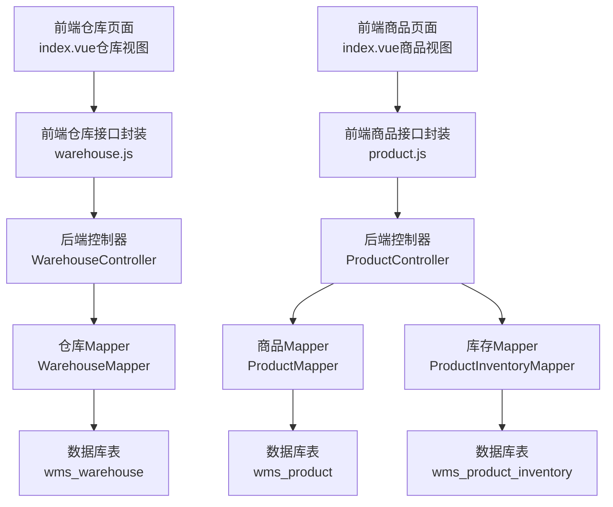
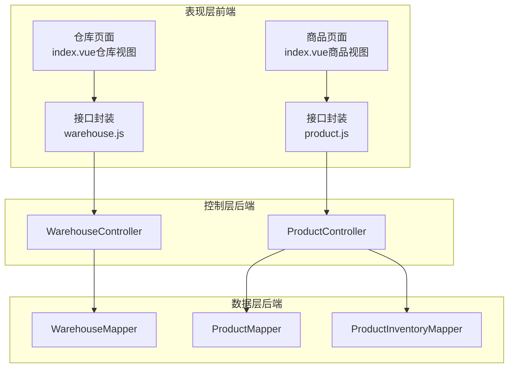
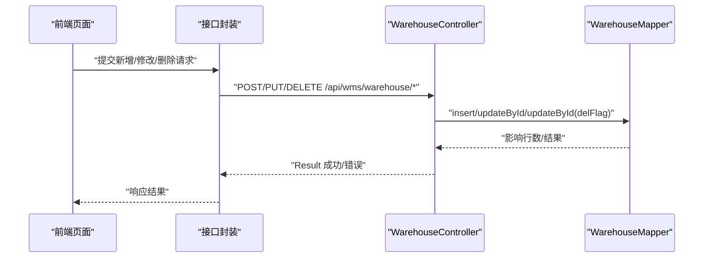
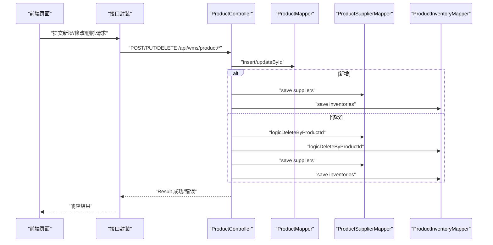
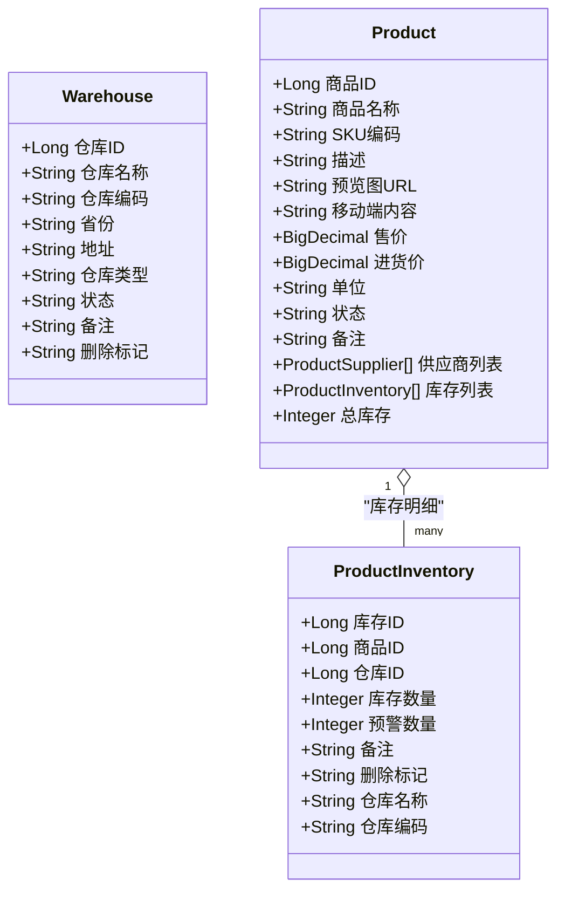
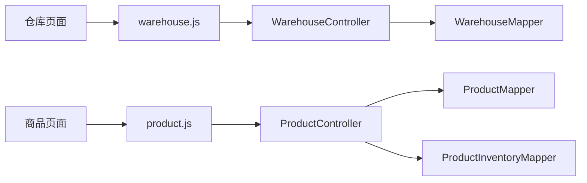

# 仓储管理系统

<cite>
**本文引用的文件**
- [WarehouseController.java](file://task-manager-backend/src/main/java/com/taskmanager/controller/WarehouseController.java)
- [ProductController.java](file://task-manager-backend/src/main/java/com/taskmanager/controller/ProductController.java)
- [Warehouse.java](file://task-manager-backend/src/main/java/com/taskmanager/domain/Warehouse.java)
- [Product.java](file://task-manager-backend/src/main/java/com/taskmanager/domain/Product.java)
- [ProductInventory.java](file://task-manager-backend/src/main/java/com/taskmanager/domain/ProductInventory.java)
- [WarehouseMapper.java](file://task-manager-backend/src/main/java/com/taskmanager/mapper/WarehouseMapper.java)
- [ProductMapper.java](file://task-manager-backend/src/main/java/com/taskmanager/mapper/ProductMapper.java)
- [ProductInventoryMapper.java](file://task-manager-backend/src/main/java/com/taskmanager/mapper/ProductInventoryMapper.java)
- [warehouse.js](file://task-manager-frontend/src/api/wms/warehouse.js)
- [product.js](file://task-manager-frontend/src/api/wms/product.js)
- [index.vue（仓库视图）](file://task-manager-frontend/src/views/wms/warehouse/index.vue)
- [index.vue（商品视图）](file://task-manager-frontend/src/views/wms/product/index.vue)
</cite>

## 目录
1. [引言](#引言)
2. [项目结构](#项目结构)
3. [核心组件](#核心组件)
4. [架构总览](#架构总览)
5. [详细组件分析](#详细组件分析)
6. [依赖分析](#依赖分析)
7. [性能考虑](#性能考虑)
8. [故障排查指南](#故障排查指南)
9. [结论](#结论)
10. [附录](#附录)

## 引言
本文件面向仓储管理系统（WMS）的功能与技术实现，围绕仓库管理、商品管理、库存管理三大核心模块展开。重点解析后端控制器（WarehouseController、ProductController）的接口能力与业务流程，剖析仓库（Warehouse）、商品（Product）、库存（ProductInventory）三类实体的数据模型设计，并结合前端仓储管理页面（仓库列表、商品管理、库存查询、导入导出）说明交互与集成方式。同时补充库存管理机制（库存计算、安全库存预警、库存调拨、批次管理等）与最佳实践（库存优化策略、盘点流程、损耗控制），并提供完整接口文档与业务流程示例。

## 项目结构
系统采用前后端分离架构：
- 后端基于 Spring Boot + MyBatis-Plus，提供 REST 接口与数据访问层；
- 前端基于 Vue 3 + Element Plus，通过统一请求封装对接后端接口；
- 控制器分别处理仓库与商品的 CRUD、筛选、导入导出等操作；
- 实体类映射数据库表，包含仓库、商品、库存等维度；
- 前端页面提供仓库列表、商品管理、库存信息维护与导出导入等交互。

图表来源
- [index.vue（仓库视图）](file://task-manager-frontend/src/views/wms/warehouse/index.vue)
- [index.vue（商品视图）](file://task-manager-frontend/src/views/wms/product/index.vue)
- [warehouse.js](file://task-manager-frontend/src/api/wms/warehouse.js)
- [product.js](file://task-manager-frontend/src/api/wms/product.js)
- [WarehouseController.java](file://task-manager-backend/src/main/java/com/taskmanager/controller/WarehouseController.java)
- [ProductController.java](file://task-manager-backend/src/main/java/com/taskmanager/controller/ProductController.java)
- [WarehouseMapper.java](file://task-manager-backend/src/main/java/com/taskmanager/mapper/WarehouseMapper.java)
- [ProductMapper.java](file://task-manager-backend/src/main/java/com/taskmanager/mapper/ProductMapper.java)
- [ProductInventoryMapper.java](file://task-manager-backend/src/main/java/com/taskmanager/mapper/ProductInventoryMapper.java)

章节来源
- [index.vue（仓库视图）](file://task-manager-frontend/src/views/wms/warehouse/index.vue)
- [index.vue（商品视图）](file://task-manager-frontend/src/views/wms/product/index.vue)
- [warehouse.js](file://task-manager-frontend/src/api/wms/warehouse.js)
- [product.js](file://task-manager-frontend/src/api/wms/product.js)
- [WarehouseController.java](file://task-manager-backend/src/main/java/com/taskmanager/controller/WarehouseController.java)
- [ProductController.java](file://task-manager-backend/src/main/java/com/taskmanager/controller/ProductController.java)
- [WarehouseMapper.java](file://task-manager-backend/src/main/java/com/taskmanager/mapper/WarehouseMapper.java)
- [ProductMapper.java](file://task-manager-backend/src/main/java/com/taskmanager/mapper/ProductMapper.java)
- [ProductInventoryMapper.java](file://task-manager-backend/src/main/java/com/taskmanager/mapper/ProductInventoryMapper.java)

## 核心组件
- 仓库管理控制器（WarehouseController）
  - 支持分页+条件筛选的仓库列表查询、全量正常仓库查询、按ID查询详情、新增、修改、逻辑删除、导出、导入、模板下载。
- 商品管理控制器（ProductController）
  - 支持分页+条件筛选的商品列表查询、按ID查询详情（含供应商与库存）、新增（含供应商与库存）、修改（含供应商与库存）、删除（含供应商与库存）、导出、导入、模板下载。
- 数据模型
  - 仓库（Warehouse）：仓库ID、名称、编码、省市区、仓库类型、状态、备注等。
  - 商品（Product）：商品ID、名称、SKU、简介、图片、价格、单位、状态、供应商与库存集合、总库存等。
  - 库存（ProductInventory）：库存ID、商品ID、仓库ID、库存数量、预警数量、仓库名称/编码等。

章节来源
- [WarehouseController.java](file://task-manager-backend/src/main/java/com/taskmanager/controller/WarehouseController.java)
- [ProductController.java](file://task-manager-backend/src/main/java/com/taskmanager/controller/ProductController.java)
- [Warehouse.java](file://task-manager-backend/src/main/java/com/taskmanager/domain/Warehouse.java)
- [Product.java](file://task-manager-backend/src/main/java/com/taskmanager/domain/Product.java)
- [ProductInventory.java](file://task-manager-backend/src/main/java/com/taskmanager/domain/ProductInventory.java)

## 架构总览
系统采用典型的三层架构：
- 表现层（前端）：Vue 页面与 Element Plus 组件，负责用户交互与数据展示。
- 控制层（后端）：Spring MVC 控制器，接收请求、组装参数、调用服务与持久化层。
- 数据层（后端）：MyBatis-Plus Mapper，封装 SQL 查询与分页，映射实体类。

图表来源
- [index.vue（仓库视图）](file://task-manager-frontend/src/views/wms/warehouse/index.vue)
- [index.vue（商品视图）](file://task-manager-frontend/src/views/wms/product/index.vue)
- [warehouse.js](file://task-manager-frontend/src/api/wms/warehouse.js)
- [product.js](file://task-manager-frontend/src/api/wms/product.js)
- [WarehouseController.java](file://task-manager-backend/src/main/java/com/taskmanager/controller/WarehouseController.java)
- [ProductController.java](file://task-manager-backend/src/main/java/com/taskmanager/controller/ProductController.java)
- [WarehouseMapper.java](file://task-manager-backend/src/main/java/com/taskmanager/mapper/WarehouseMapper.java)
- [ProductMapper.java](file://task-manager-backend/src/main/java/com/taskmanager/mapper/ProductMapper.java)
- [ProductInventoryMapper.java](file://task-manager-backend/src/main/java/com/taskmanager/mapper/ProductInventoryMapper.java)

## 详细组件分析

### 仓库管理（WarehouseController）
- 功能点
  - 列表查询：分页 + 多条件筛选（名称、编码、省份、类型、状态），支持省份多选。
  - 全量查询：返回所有“正常”状态仓库，用于下拉选择。
  - 详情查询：按ID查询仓库信息。
  - 新增/修改：设置删除标记为“存在”，执行插入或更新。
  - 删除：对指定仓库ID批量执行逻辑删除（更新删除标记为“删除”）。
  - 导出：根据筛选条件导出 Excel。
  - 导入：读取 Excel 并逐行入库，失败行数与原因汇总返回。
  - 模板下载：输出空数据的导入模板。
- 关键流程（新增/修改/删除）时序图

图表来源
- [WarehouseController.java](file://task-manager-backend/src/main/java/com/taskmanager/controller/WarehouseController.java)
- [WarehouseMapper.java](file://task-manager-backend/src/main/java/com/taskmanager/mapper/WarehouseMapper.java)
- [warehouse.js](file://task-manager-frontend/src/api/wms/warehouse.js)
- [index.vue（仓库视图）](file://task-manager-frontend/src/views/wms/warehouse/index.vue)

章节来源
- [WarehouseController.java](file://task-manager-backend/src/main/java/com/taskmanager/controller/WarehouseController.java)
- [WarehouseMapper.java](file://task-manager-backend/src/main/java/com/taskmanager/mapper/WarehouseMapper.java)
- [warehouse.js](file://task-manager-frontend/src/api/wms/warehouse.js)
- [index.vue（仓库视图）](file://task-manager-frontend/src/views/wms/warehouse/index.vue)

### 商品管理（ProductController）
- 功能点
  - 列表查询：分页 + 多条件筛选（名称、SKU、状态、价格区间）。
  - 详情查询：按ID查询商品，同时加载供应商与库存列表。
  - 新增/修改：设置删除标记为“存在”，插入商品；修改时先逻辑删除旧供应商与库存，再保存新关系。
  - 删除：对指定商品ID批量执行逻辑删除（更新删除标记为“删除”）。
  - 导出：根据筛选条件导出 Excel。
  - 导入：读取 Excel 并逐行入库，失败行数与原因汇总返回。
  - 模板下载：输出空数据的导入模板。
- 关键流程（新增/修改/删除）时序图

图表来源
- [ProductController.java](file://task-manager-backend/src/main/java/com/taskmanager/controller/ProductController.java)
- [ProductMapper.java](file://task-manager-backend/src/main/java/com/taskmanager/mapper/ProductMapper.java)
- [ProductInventoryMapper.java](file://task-manager-backend/src/main/java/com/taskmanager/mapper/ProductInventoryMapper.java)
- [product.js](file://task-manager-frontend/src/api/wms/product.js)
- [index.vue（商品视图）](file://task-manager-frontend/src/views/wms/product/index.vue)

章节来源
- [ProductController.java](file://task-manager-backend/src/main/java/com/taskmanager/controller/ProductController.java)
- [ProductMapper.java](file://task-manager-backend/src/main/java/com/taskmanager/mapper/ProductMapper.java)
- [ProductInventoryMapper.java](file://task-manager-backend/src/main/java/com/taskmanager/mapper/ProductInventoryMapper.java)
- [product.js](file://task-manager-frontend/src/api/wms/product.js)
- [index.vue（商品视图）](file://task-manager-frontend/src/views/wms/product/index.vue)

### 数据模型设计（实体类）
- 仓库（Warehouse）
  - 关键属性：仓库ID、名称、编码、省市区、仓库类型、状态、备注、删除标记、创建/更新信息。
  - 用途：支撑仓库的增删改查、筛选、导出导入。
- 商品（Product）
  - 关键属性：商品ID、名称、SKU、简介、图片、价格、单位、状态、备注、删除标记。
  - 扩展：供应商列表、库存列表、总库存（非持久化字段）。
  - 用途：商品信息维护、价格管理、供应商与库存联动。
- 库存（ProductInventory）
  - 关键属性：库存ID、商品ID、仓库ID、库存数量、预警数量、备注、删除标记。
  - 扩展：仓库名称/编码（非持久化字段，用于关联查询展示）。
  - 用途：按仓库维度记录库存数量与预警阈值。

图表来源
- [Warehouse.java](file://task-manager-backend/src/main/java/com/taskmanager/domain/Warehouse.java)
- [Product.java](file://task-manager-backend/src/main/java/com/taskmanager/domain/Product.java)
- [ProductInventory.java](file://task-manager-backend/src/main/java/com/taskmanager/domain/ProductInventory.java)

章节来源
- [Warehouse.java](file://task-manager-backend/src/main/java/com/taskmanager/domain/Warehouse.java)
- [Product.java](file://task-manager-backend/src/main/java/com/taskmanager/domain/Product.java)
- [ProductInventory.java](file://task-manager-backend/src/main/java/com/taskmanager/domain/ProductInventory.java)

### 前端仓储管理页面实现
- 仓库页面（index.vue）
  - 搜索：支持仓库名称、编码、省份（多选）、类型、状态筛选。
  - 列表：展示仓库名称、编码、省市区、类型、状态、备注，支持分页与勾选。
  - 操作：新增、删除、导入、导出；弹窗表单支持必填校验。
  - 导入：限制文件类型，提交后提示导入结果；模板下载。
- 商品页面（index.vue）
  - 搜索：支持商品名称、SKU、状态筛选。
  - 列表：展示预览图、名称、SKU、价格、单位、状态，支持分页与勾选。
  - 操作：新增、删除、导出；弹窗表单包含基本信息、移动端内容、供应商、库存四个标签页。
  - 供应商与库存：动态增删行，支持默认供应商标记、按仓库设置库存与预警数量。

章节来源
- [index.vue（仓库视图）](file://task-manager-frontend/src/views/wms/warehouse/index.vue)
- [index.vue（商品视图）](file://task-manager-frontend/src/views/wms/product/index.vue)
- [warehouse.js](file://task-manager-frontend/src/api/wms/warehouse.js)
- [product.js](file://task-manager-frontend/src/api/wms/product.js)

### 库存管理机制
- 库存计算
  - 商品总库存可通过其库存列表汇总得到；前端在商品详情中可查看各仓库库存与预警阈值。
- 安全库存预警
  - 每个库存记录包含“预警数量”，可用于前端展示与后端校验；建议在出入库流程中结合该阈值触发告警。
- 库存调拨
  - 当前控制器未直接暴露调拨接口；可在业务流程中通过“新增/修改库存”实现跨仓转移（先减后加），或扩展新增专用接口以保证原子性与审计。
- 批次管理
  - 当前实体未包含批次号字段；如需批次追踪，建议在库存实体中增加批次号、生产日期、有效期等字段，并在出入库流程中严格校验。

章节来源
- [Product.java](file://task-manager-backend/src/main/java/com/taskmanager/domain/Product.java)
- [ProductInventory.java](file://task-manager-backend/src/main/java/com/taskmanager/domain/ProductInventory.java)
- [ProductController.java](file://task-manager-backend/src/main/java/com/taskmanager/controller/ProductController.java)

## 依赖分析
- 控制器与 Mapper 的依赖关系
  - WarehouseController 依赖 WarehouseMapper 进行仓库数据的分页与筛选查询。
  - ProductController 依赖 ProductMapper 与 ProductInventoryMapper 进行商品、供应商与库存的组合维护。
- 前后端接口依赖
  - 前端页面通过接口封装调用后端控制器，控制器与 Mapper 之间遵循 MyBatis-Plus 的约定式命名与 XML 映射。

图表来源
- [WarehouseController.java](file://task-manager-backend/src/main/java/com/taskmanager/controller/WarehouseController.java)
- [ProductController.java](file://task-manager-backend/src/main/java/com/taskmanager/controller/ProductController.java)
- [WarehouseMapper.java](file://task-manager-backend/src/main/java/com/taskmanager/mapper/WarehouseMapper.java)
- [ProductMapper.java](file://task-manager-backend/src/main/java/com/taskmanager/mapper/ProductMapper.java)
- [ProductInventoryMapper.java](file://task-manager-backend/src/main/java/com/taskmanager/mapper/ProductInventoryMapper.java)
- [warehouse.js](file://task-manager-frontend/src/api/wms/warehouse.js)
- [product.js](file://task-manager-frontend/src/api/wms/product.js)

章节来源
- [WarehouseController.java](file://task-manager-backend/src/main/java/com/taskmanager/controller/WarehouseController.java)
- [ProductController.java](file://task-manager-backend/src/main/java/com/taskmanager/controller/ProductController.java)
- [WarehouseMapper.java](file://task-manager-backend/src/main/java/com/taskmanager/mapper/WarehouseMapper.java)
- [ProductMapper.java](file://task-manager-backend/src/main/java/com/taskmanager/mapper/ProductMapper.java)
- [ProductInventoryMapper.java](file://task-manager-backend/src/main/java/com/taskmanager/mapper/ProductInventoryMapper.java)
- [warehouse.js](file://task-manager-frontend/src/api/wms/warehouse.js)
- [product.js](file://task-manager-frontend/src/api/wms/product.js)

## 性能考虑
- 分页与筛选
  - 后端已使用分页插件与多条件筛选，建议前端合理设置分页大小与筛选条件，避免一次性加载过多数据。
- 导入导出
  - 导入采用分页监听逐批写入，建议控制单次导入行数上限并做好异常回滚提示。
  - 导出限制最大导出条数，避免超大数据量导致内存压力。
- 数据一致性
  - 商品新增/修改涉及多表写入（商品、供应商、库存），建议使用事务保障一致性。
- 前端渲染
  - 列表与弹窗表格较多时，注意虚拟滚动与懒加载策略，减少 DOM 渲染压力。

## 故障排查指南
- 常见问题
  - 导入失败：检查文件格式（仅支持 xlsx/xls）、模板字段与数据类型是否匹配。
  - 删除异常：确认目标仓库/商品是否存在关联数据（如库存、订单等）。
  - 权限不足：接口均带有权限注解，确保登录用户具备相应菜单权限。
- 排查步骤
  - 查看后端日志与异常处理器返回的错误信息。
  - 前端控制台网络请求与响应，定位具体接口与参数。
  - 核对字典项与下拉数据是否正确加载（省份、仓库类型、商品状态等）。

章节来源
- [WarehouseController.java](file://task-manager-backend/src/main/java/com/taskmanager/controller/WarehouseController.java)
- [ProductController.java](file://task-manager-backend/src/main/java/com/taskmanager/controller/ProductController.java)
- [index.vue（仓库视图）](file://task-manager-frontend/src/views/wms/warehouse/index.vue)
- [index.vue（商品视图）](file://task-manager-frontend/src/views/wms/product/index.vue)

## 结论
本系统围绕仓库、商品、库存三大核心实体构建了完整的仓储管理能力，后端通过控制器与 Mapper 提供标准的 CRUD、筛选、导入导出接口，前端页面实现了直观的交互与数据展示。当前版本在安全库存与批次管理方面具备扩展空间，建议后续完善调拨与批次字段，以满足更复杂的仓储运营需求。

## 附录

### 接口文档（仓库管理）
- 列表查询
  - 方法：GET
  - 路径：/api/wms/warehouse/list
  - 参数：pageNum、pageSize、warehouseName、warehouseCode、province（逗号分隔）、warehouseType、status
  - 返回：分页数据（TableDataInfo）
- 全量查询
  - 方法：GET
  - 路径：/api/wms/warehouse/listAll
  - 返回：仓库列表（正常状态）
- 详情查询
  - 方法：GET
  - 路径：/api/wms/warehouse/{warehouseId}
  - 返回：仓库详情
- 新增
  - 方法：POST
  - 路径：/api/wms/warehouse
  - 请求体：仓库对象（自动设置删除标记为“存在”）
- 修改
  - 方法：PUT
  - 路径：/api/wms/warehouse
  - 请求体：仓库对象
- 删除
  - 方法：DELETE
  - 路径：/api/wms/warehouse/{warehouseIds}
  - 说明：批量逻辑删除（更新删除标记为“删除”）
- 导出
  - 方法：POST
  - 路径：/api/wms/warehouse/export
  - 参数：同列表查询
  - 返回：Excel 文件流
- 导入
  - 方法：POST
  - 路径：/api/wms/warehouse/import
  - 参数：file（Excel）
  - 返回：导入结果（成功/失败计数与失败原因）
- 模板下载
  - 方法：POST
  - 路径：/api/wms/warehouse/template
  - 返回：空数据模板 Excel

章节来源
- [WarehouseController.java](file://task-manager-backend/src/main/java/com/taskmanager/controller/WarehouseController.java)
- [warehouse.js](file://task-manager-frontend/src/api/wms/warehouse.js)
- [index.vue（仓库视图）](file://task-manager-frontend/src/views/wms/warehouse/index.vue)

### 接口文档（商品管理）
- 列表查询
  - 方法：GET
  - 路径：/api/wms/product/list
  - 参数：pageNum、pageSize、productName、skuCode、status、minPrice、maxPrice
  - 返回：分页数据（TableDataInfo）
- 详情查询
  - 方法：GET
  - 路径：/api/wms/product/{productId}
  - 返回：商品详情（含供应商与库存列表）
- 新增
  - 方法：POST
  - 路径：/api/wms/product
  - 请求体：商品对象（含供应商与库存列表，自动设置删除标记为“存在”）
- 修改
  - 方法：PUT
  - 路径：/api/wms/product
  - 请求体：商品对象（先逻辑删除旧供应商与库存，再保存新关系）
- 删除
  - 方法：DELETE
  - 路径：/api/wms/product/{productIds}
  - 说明：批量逻辑删除（更新删除标记为“删除”）
- 导出
  - 方法：POST
  - 路径：/api/wms/product/export
  - 参数：同列表查询
  - 返回：Excel 文件流
- 导入
  - 方法：POST
  - 路径：/api/wms/product/import
  - 参数：file（Excel）
  - 返回：导入结果（成功/失败计数与失败原因）
- 模板下载
  - 方法：POST
  - 路径：/api/wms/product/template
  - 返回：空数据模板 Excel

章节来源
- [ProductController.java](file://task-manager-backend/src/main/java/com/taskmanager/controller/ProductController.java)
- [product.js](file://task-manager-frontend/src/api/wms/product.js)
- [index.vue（商品视图）](file://task-manager-frontend/src/views/wms/product/index.vue)

### 业务流程示例
- 新增仓库
  - 前端填写表单 → 调用新增接口 → 后端插入仓库记录 → 刷新列表
- 商品导入
  - 前端上传 Excel → 调用导入接口 → 后端逐行读取并插入 → 返回导入结果
- 商品新增（含供应商与库存）
  - 前端填写基本信息与供应商/库存 → 调用新增接口 → 后端插入商品、供应商、库存 → 刷新列表
- 安全库存预警
  - 前端展示各仓库库存与预警数量 → 当库存低于预警值时高亮提示 → 触发补货流程

章节来源
- [index.vue（仓库视图）](file://task-manager-frontend/src/views/wms/warehouse/index.vue)
- [index.vue（商品视图）](file://task-manager-frontend/src/views/wms/product/index.vue)
- [WarehouseController.java](file://task-manager-backend/src/main/java/com/taskmanager/controller/WarehouseController.java)
- [ProductController.java](file://task-manager-backend/src/main/java/com/taskmanager/controller/ProductController.java)