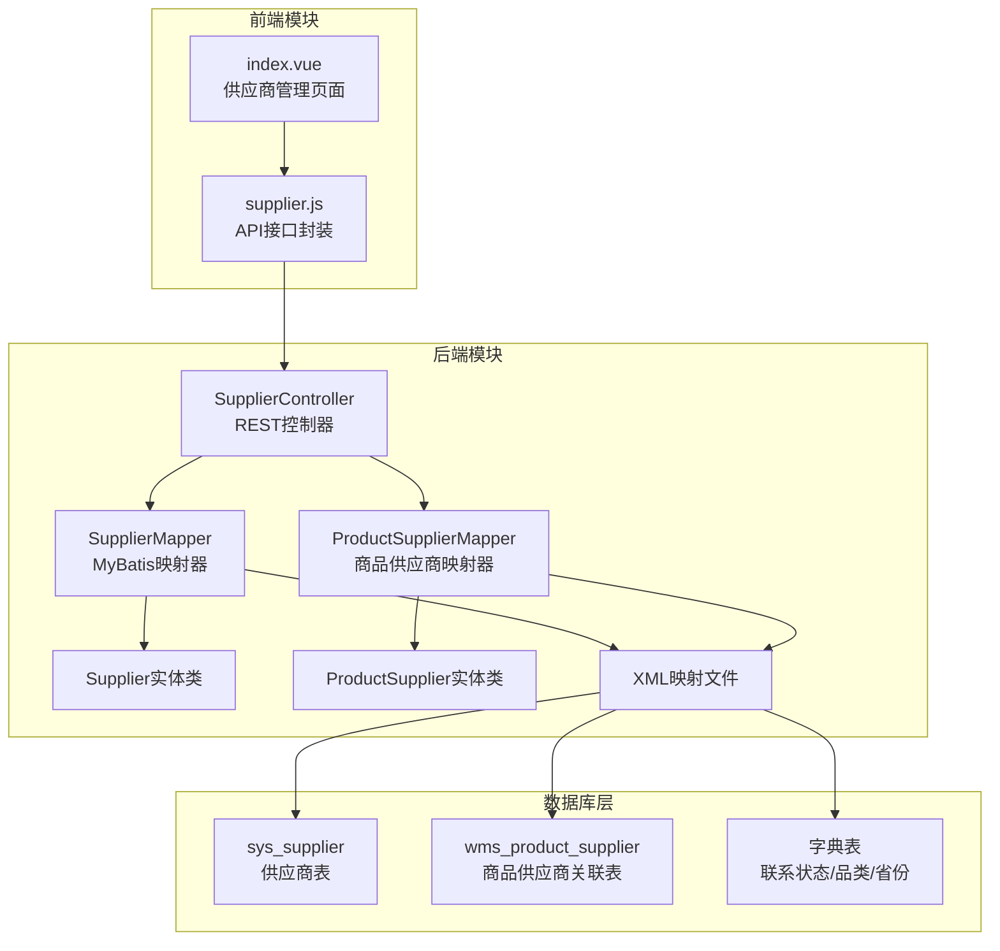
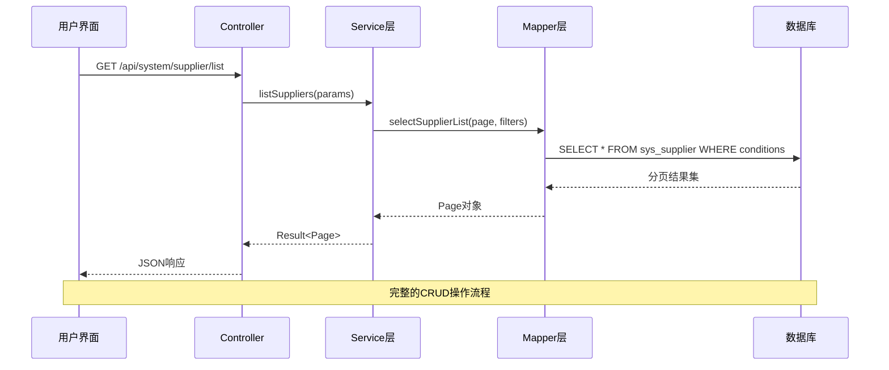
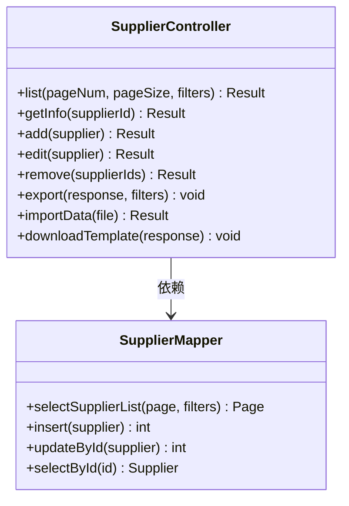
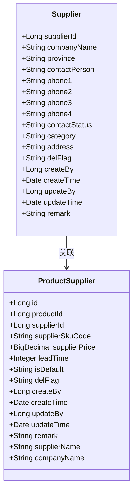
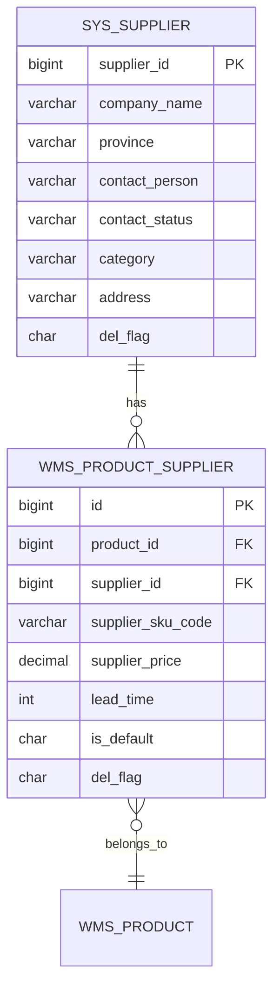
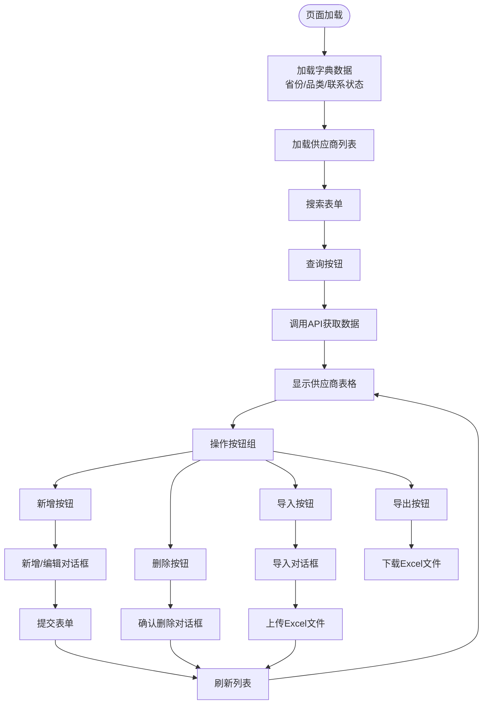
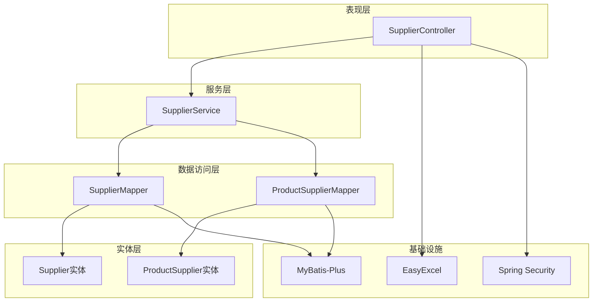
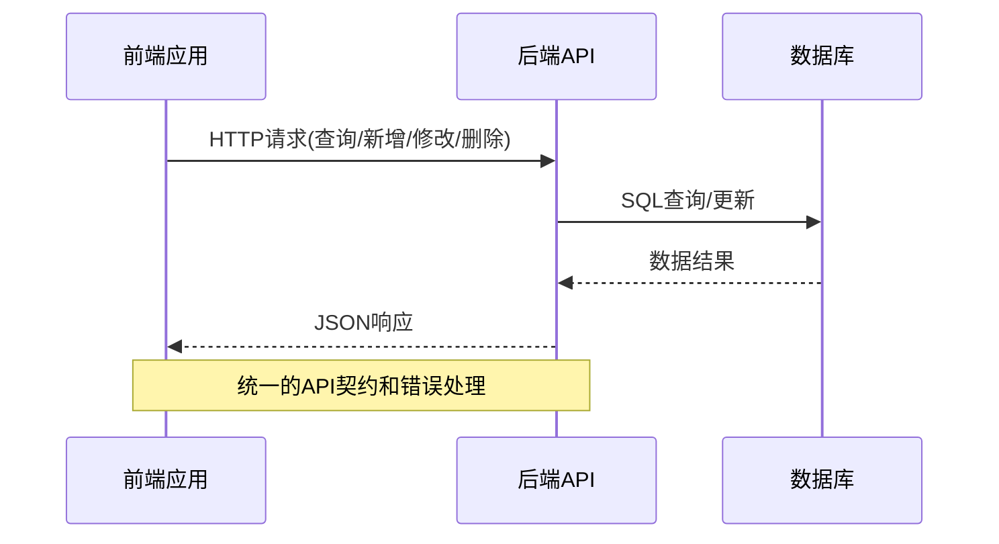

# 供应商管理

<cite>
**本文引用的文件**
- [SupplierController.java](file://task-manager-backend/src/main/java/com/taskmanager/controller/SupplierController.java)
- [Supplier.java](file://task-manager-backend/src/main/java/com/taskmanager/domain/Supplier.java)
- [ProductSupplier.java](file://task-manager-backend/src/main/java/com/taskmanager/domain/ProductSupplier.java)
- [SupplierMapper.java](file://task-manager-backend/src/main/java/com/taskmanager/mapper/SupplierMapper.java)
- [ProductSupplierMapper.java](file://task-manager-backend/src/main/java/com/taskmanager/mapper/ProductSupplierMapper.java)
- [SupplierMapper.xml](file://task-manager-backend/src/main/resources/mapper/SupplierMapper.xml)
- [ProductSupplierMapper.xml](file://task-manager-backend/src/main/resources/mapper/ProductSupplierMapper.xml)
- [index.vue](file://task-manager-frontend/src/views/system/supplier/index.vue)
- [supplier.js](file://task-manager-frontend/src/api/system/supplier.js)
- [application.yml](file://task-manager-backend/src/main/resources/application.yml)
- [schema.sql](file://task-manager-backend/src/main/resources/schema.sql)
- [test-data.sql](file://task-manager-backend/src/main/resources/test-data.sql)
</cite>

## 目录
1. [简介](#简介)
2. [项目结构](#项目结构)
3. [核心组件](#核心组件)
4. [架构概览](#架构概览)
5. [详细组件分析](#详细组件分析)
6. [依赖关系分析](#依赖关系分析)
7. [性能考虑](#性能考虑)
8. [故障排除指南](#故障排除指南)
9. [结论](#结论)
10. [附录](#附录)

## 简介
供应商管理模块是企业资源规划系统中的关键组成部分，负责维护供应商信息、管理供应商状态以及建立供应商与商品之间的关联关系。该模块实现了完整的供应商生命周期管理，包括供应商信息的增删改查、批量导入导出、联系状态跟踪、多供应商管理等核心功能。

本模块采用前后端分离架构，后端基于Spring Boot + MyBatis-Plus技术栈，前端使用Vue.js + Element Plus构建用户界面。通过字典数据驱动的方式，实现了灵活的状态管理和配置化扩展。

## 项目结构
供应商管理模块在项目中的组织结构如下：

**图表来源**
- [SupplierController.java:1-201](file://task-manager-backend/src/main/java/com/taskmanager/controller/SupplierController.java#L1-L201)
- [index.vue:1-485](file://task-manager-frontend/src/views/system/supplier/index.vue#L1-L485)

**章节来源**
- [SupplierController.java:1-201](file://task-manager-backend/src/main/java/com/taskmanager/controller/SupplierController.java#L1-L201)
- [Supplier.java:1-86](file://task-manager-backend/src/main/java/com/taskmanager/domain/Supplier.java#L1-L86)
- [ProductSupplier.java:1-71](file://task-manager-backend/src/main/java/com/taskmanager/domain/ProductSupplier.java#L1-L71)

## 核心组件
供应商管理模块由多个核心组件构成，每个组件都有明确的职责分工：

### 后端核心组件
- **SupplierController**: REST API控制器，处理供应商相关的HTTP请求
- **SupplierMapper**: 数据访问接口，提供供应商数据的CRUD操作
- **ProductSupplierMapper**: 商品供应商关联数据访问接口
- **Supplier实体类**: 供应商数据模型，映射sys_supplier表结构
- **ProductSupplier实体类**: 商品供应商关联模型，映射wms_product_supplier表结构

### 前端核心组件
- **供应商管理页面**: Vue组件，提供供应商信息的可视化管理界面
- **API封装模块**: 封装供应商相关的HTTP请求方法

### 数据库组件
- **供应商表(sys_supplier)**: 存储供应商基本信息和状态
- **商品供应商关联表(wms_product_supplier)**: 维护供应商与商品的多对多关系
- **字典表**: 支持联系状态、品类分类、省份等配置化管理

**章节来源**
- [SupplierController.java:24-201](file://task-manager-backend/src/main/java/com/taskmanager/controller/SupplierController.java#L24-L201)
- [Supplier.java:12-86](file://task-manager-backend/src/main/java/com/taskmanager/domain/Supplier.java#L12-L86)
- [ProductSupplier.java:12-71](file://task-manager-backend/src/main/java/com/taskmanager/domain/ProductSupplier.java#L12-L71)

## 架构概览
供应商管理模块采用经典的三层架构设计，实现了清晰的职责分离和良好的可扩展性。

**图表来源**
- [SupplierController.java:48-67](file://task-manager-backend/src/main/java/com/taskmanager/controller/SupplierController.java#L48-L67)
- [SupplierMapper.xml:28-54](file://task-manager-backend/src/main/resources/mapper/SupplierMapper.xml#L28-L54)

### 技术架构特点
- **安全控制**: 基于注解的权限控制(@PreAuthorize)
- **日志记录**: 操作日志自动记录(@Log注解)
- **分页查询**: MyBatis-Plus分页插件支持
- **Excel集成**: EasyExcel实现数据导入导出
- **字典驱动**: 基于字典表的状态和配置管理

**章节来源**
- [application.yml:33-44](file://task-manager-backend/src/main/resources/application.yml#L33-L44)

## 详细组件分析

### SupplierController 控制器分析
SupplierController是供应商管理模块的核心控制器，提供了完整的供应商CRUD操作和相关功能。

#### 主要功能特性
- **分页查询**: 支持多条件筛选的供应商列表查询
- **批量操作**: 支持批量删除和批量导入导出
- **Excel集成**: 完整的Excel导入导出功能
- **权限控制**: 基于角色的细粒度权限管理
- **操作日志**: 自动记录所有供应商操作

**图表来源**
- [SupplierController.java:29-201](file://task-manager-backend/src/main/java/com/taskmanager/controller/SupplierController.java#L29-L201)
- [SupplierMapper.java:15-34](file://task-manager-backend/src/main/java/com/taskmanager/mapper/SupplierMapper.java#L15-L34)

#### API接口规范
控制器暴露了以下REST API接口：

| 方法 | 路径 | 权限 | 功能描述 |
|------|------|------|----------|
| GET | /api/system/supplier/list | system:supplier:list | 获取供应商列表 |
| GET | /api/system/supplier/{id} | system:supplier:query | 获取供应商详情 |
| POST | /api/system/supplier | system:supplier:add | 新增供应商 |
| PUT | /api/system/supplier | system:supplier:edit | 修改供应商 |
| DELETE | /api/system/supplier/{ids} | system:supplier:remove | 删除供应商 |
| POST | /api/system/supplier/export | system:supplier:export | 导出供应商数据 |
| POST | /api/system/supplier/import | system:supplier:import | 导入供应商数据 |
| POST | /api/system/supplier/template | system:supplier:import | 下载导入模板 |

**章节来源**
- [SupplierController.java:48-201](file://task-manager-backend/src/main/java/com/taskmanager/controller/SupplierController.java#L48-L201)

### 供应商实体模型分析
供应商实体类Supplier设计遵循了领域驱动设计原则，包含了完整的供应商信息和管理字段。

#### 核心属性设计
- **基础信息**: 公司名称、联系人、多个电话号码
- **地理位置**: 省份、详细地址
- **业务分类**: 品类(支持多选，逗号分隔)
- **状态管理**: 联系状态(0-4五种状态)
- **生命周期**: 创建时间、更新时间、删除标志
- **审计追踪**: 创建者、更新者、备注信息

**图表来源**
- [Supplier.java:19-85](file://task-manager-backend/src/main/java/com/taskmanager/domain/Supplier.java#L19-L85)
- [ProductSupplier.java:19-70](file://task-manager-backend/src/main/java/com/taskmanager/domain/ProductSupplier.java#L19-L70)

#### 数据模型特点
- **逻辑删除**: 使用delFlag字段实现软删除
- **状态枚举**: 联系状态采用数字枚举值
- **多值存储**: 品类使用逗号分隔的字符串存储
- **关联查询**: 支持供应商名称和公司名称的关联查询

**章节来源**
- [Supplier.java:23-85](file://task-manager-backend/src/main/java/com/taskmanager/domain/Supplier.java#L23-L85)
- [ProductSupplier.java:23-70](file://task-manager-backend/src/main/java/com/taskmanager/domain/ProductSupplier.java#L23-L70)

### 商品供应商关联机制
商品供应商关联表实现了供应商与商品的多对多关系管理，支持多供应商并存和默认供应商设置。

#### 关联表设计要点
- **唯一约束**: (product_id, supplier_id)确保一对一关联
- **默认供应商**: is_default字段标识主要供应商
- **价格管理**: supplier_price字段存储供应商报价
- **交货周期**: lead_time字段跟踪供应链时效
- **SKU映射**: supplier_sku_code支持供应商内部编码

**图表来源**
- [schema.sql:470-489](file://task-manager-backend/src/main/resources/schema.sql#L470-L489)
- [ProductSupplierMapper.xml:26-32](file://task-manager-backend/src/main/resources/mapper/ProductSupplierMapper.xml#L26-L32)

#### 业务逻辑实现
- **多供应商管理**: 同一商品可配置多个供应商
- **价格比较**: 通过不同供应商报价进行成本对比
- **供应稳定性**: 通过交货周期和联系状态评估供应商可靠性
- **默认供应商**: is_default字段确保主要供应商优先

**章节来源**
- [ProductSupplier.java:23-62](file://task-manager-backend/src/main/java/com/taskmanager/domain/ProductSupplier.java#L23-L62)
- [ProductSupplierMapper.xml:26-38](file://task-manager-backend/src/main/resources/mapper/ProductSupplierMapper.xml#L26-L38)

### 前端供应商管理页面
前端供应商管理页面提供了直观的用户界面，支持供应商信息的全生命周期管理。

#### 页面功能特性
- **高级搜索**: 支持多条件组合查询(公司名称、省份、联系人、品类、联系状态)
- **批量操作**: 支持批量删除和批量导出
- **Excel集成**: 完整的导入导出功能，支持模板下载
- **实时验证**: 表单输入验证和错误提示
- **响应式设计**: 适配不同屏幕尺寸的设备

**图表来源**
- [index.vue:248-485](file://task-manager-frontend/src/views/system/supplier/index.vue#L248-L485)

#### 用户交互流程
- **数据加载**: 页面初始化时同时加载字典数据和供应商列表
- **搜索过滤**: 实时响应用户输入，动态更新查询条件
- **表单管理**: 新增/编辑统一使用同一对话框，支持双向数据绑定
- **批量处理**: 支持多选操作，提供批量删除和批量导出功能

**章节来源**
- [index.vue:248-485](file://task-manager-frontend/src/views/system/supplier/index.vue#L248-L485)
- [supplier.js:1-47](file://task-manager-frontend/src/api/system/supplier.js#L1-L47)

## 依赖关系分析

### 后端依赖关系
供应商管理模块的后端依赖关系体现了清晰的分层架构设计：

**图表来源**
- [SupplierController.java:33-34](file://task-manager-backend/src/main/java/com/taskmanager/controller/SupplierController.java#L33-L34)
- [SupplierMapper.java:15-34](file://task-manager-backend/src/main/java/com/taskmanager/mapper/SupplierMapper.java#L15-L34)

### 前后端通信依赖
前后端通过标准REST API进行通信，采用JSON格式传输数据：

**图表来源**
- [supplier.js:4-46](file://task-manager-frontend/src/api/system/supplier.js#L4-L46)

**章节来源**
- [SupplierController.java:1-201](file://task-manager-backend/src/main/java/com/taskmanager/controller/SupplierController.java#L1-L201)
- [index.vue:248-485](file://task-manager-frontend/src/views/system/supplier/index.vue#L248-L485)

## 性能考虑
供应商管理模块在设计时充分考虑了性能优化和可扩展性要求：

### 数据库性能优化
- **索引策略**: 在常用查询字段上建立适当索引
- **分页查询**: 使用MyBatis-Plus分页插件避免全表扫描
- **逻辑删除**: 通过delFlag字段实现软删除，避免物理删除影响性能
- **批量操作**: 支持批量导入导出，减少网络往返次数

### 缓存策略
- **字典数据缓存**: 常用的字典数据(联系状态、品类、省份)可以缓存到Redis
- **查询结果缓存**: 对于不经常变化的静态数据可以考虑缓存
- **会话管理**: 基于JWT的无状态认证，支持水平扩展

### 前端性能优化
- **虚拟滚动**: 对于大量数据的表格可以考虑虚拟滚动技术
- **懒加载**: 图片和复杂组件按需加载
- **防抖节流**: 搜索框输入事件的防抖处理
- **组件复用**: 通用组件的复用减少重复渲染

## 故障排除指南

### 常见问题及解决方案

#### 1. Excel导入失败
**问题现象**: 导入Excel文件时报错或部分数据导入失败

**可能原因**:
- Excel文件格式不符合要求(.xlsx/.xls)
- 数据格式与实体类不匹配
- 重复数据导致唯一约束冲突

**解决步骤**:
1. 确认文件格式为.xlsx或.xls
2. 下载最新导入模板，按照模板格式填写数据
3. 检查必填字段是否完整
4. 查看导入结果中的失败信息，定位具体行号

#### 2. 供应商查询结果异常
**问题现象**: 搜索条件正确但查询结果为空或不准确

**排查步骤**:
1. 检查查询参数格式(多选条件使用逗号分隔)
2. 验证字典数据是否正确加载
3. 确认数据库中是否存在匹配数据
4. 查看SQL执行计划和日志

#### 3. 权限访问被拒绝
**问题现象**: 提示没有权限访问供应商相关功能

**解决方法**:
1. 确认当前用户是否具有相应的角色权限
2. 检查菜单权限配置是否正确
3. 重新登录系统获取最新的权限信息

**章节来源**
- [SupplierController.java:155-184](file://task-manager-backend/src/main/java/com/taskmanager/controller/SupplierController.java#L155-L184)
- [index.vue:440-478](file://task-manager-frontend/src/views/system/supplier/index.vue#L440-L478)

### 调试工具和技巧
- **后端日志**: 启用MyBatis SQL日志查看实际执行的SQL语句
- **浏览器开发者工具**: 检查网络请求和响应
- **数据库客户端**: 直接查询数据库验证数据状态
- **单元测试**: 编写测试用例验证核心业务逻辑

## 结论
供应商管理模块是一个设计完善、功能完整的业务系统模块。它通过清晰的分层架构、合理的数据模型设计和友好的用户界面，为企业提供了全面的供应商管理能力。

### 主要优势
- **功能完整性**: 覆盖供应商管理的全生命周期
- **用户体验**: 直观的界面设计和流畅的操作体验
- **技术先进**: 采用现代化的技术栈和最佳实践
- **扩展性强**: 基于字典驱动的设计便于功能扩展
- **安全性**: 完善的权限控制和操作日志

### 应用价值
该模块不仅满足了当前的业务需求，还为未来的业务发展预留了充足的扩展空间。通过多供应商管理、价格比较、供应稳定性评估等功能，能够有效提升企业的供应链管理水平。

## 附录

### 数据库表结构
供应商管理模块涉及的主要数据库表及其关系：

| 表名 | 描述 | 主要字段 |
|------|------|----------|
| sys_supplier | 供应商信息表 | supplier_id, company_name, contact_status, category, address |
| wms_product_supplier | 商品供应商关联表 | id, product_id, supplier_id, supplier_price, is_default |
| sys_dict_type | 字典类型表 | dict_id, dict_name, dict_type |
| sys_dict_data | 字典数据表 | dict_code, dict_label, dict_value |

### 字典配置
系统通过字典表实现配置化管理：

| 字典类型 | 键值 | 显示标签 | 用途 |
|----------|------|----------|------|
| supplier_contact_status | 0 | 未联系 | 供应商联系状态 |
| supplier_contact_status | 1 | 已加微信 | 供应商联系状态 |
| supplier_contact_status | 2 | 未接 | 供应商联系状态 |
| supplier_contact_status | 3 | 空号 | 供应商联系状态 |
| supplier_contact_status | 4 | 已下单 | 供应商联系状态 |
| supplier_category | 电子产品 | 电子产品 | 供应商品类分类 |
| supplier_province | 北京 | 北京 | 供应商省份分类 |

### 最佳实践建议
1. **数据质量保证**
   - 建立供应商信息完整性检查机制
   - 定期清理无效或过期的供应商数据
   - 实施供应商分级管理制度

2. **风险控制**
   - 建立供应商评估指标体系
   - 设置供应商风险预警机制
   - 建立备用供应商清单

3. **系统维护**
   - 定期备份供应商数据
   - 监控系统性能指标
   - 及时更新系统版本

4. **业务流程优化**
   - 标准化供应商准入流程
   - 建立供应商绩效评估机制
   - 优化采购决策流程

**章节来源**
- [schema.sql:319-489](file://task-manager-backend/src/main/resources/schema.sql#L319-L489)
- [test-data.sql:126-225](file://task-manager-backend/src/main/resources/test-data.sql#L126-L225)