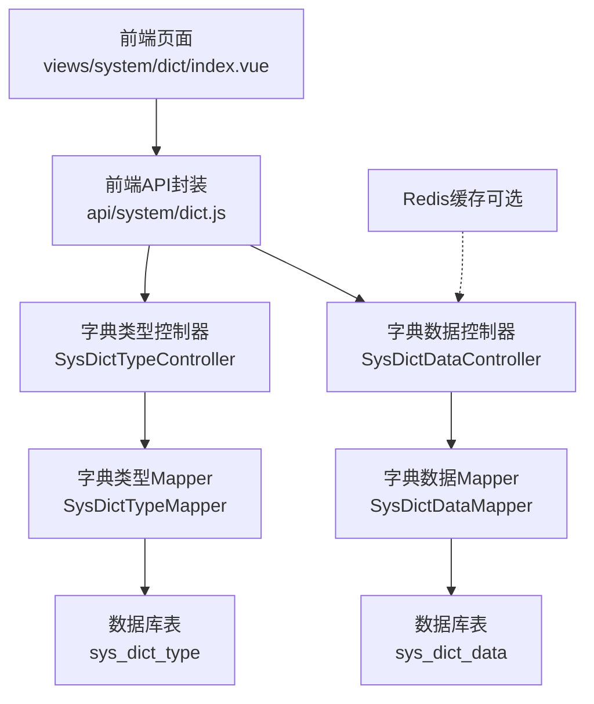
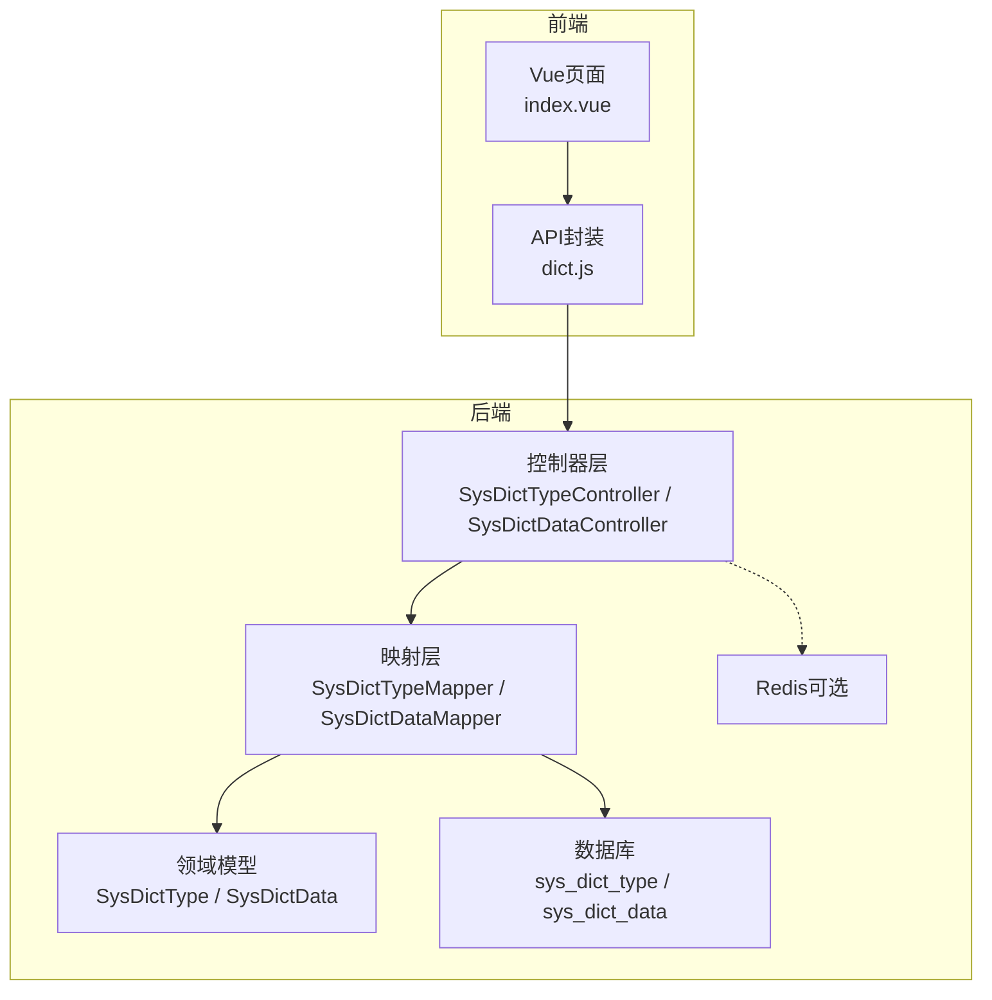
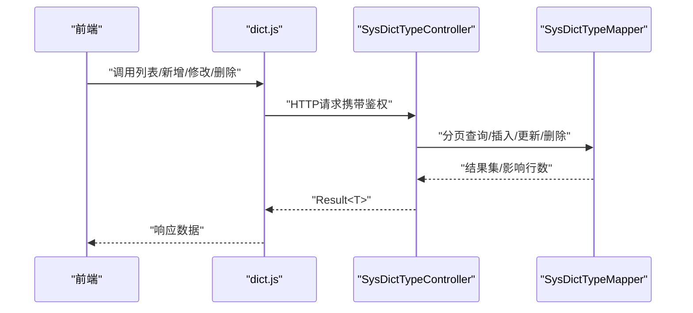
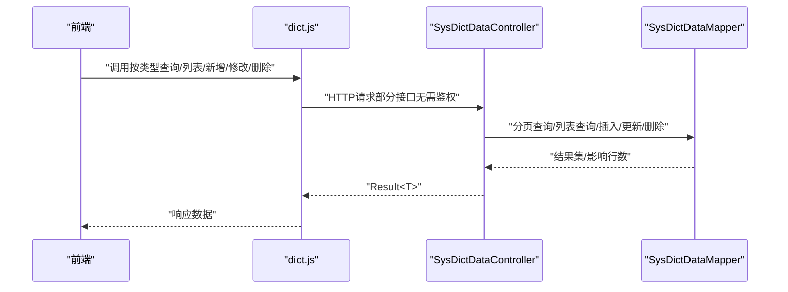
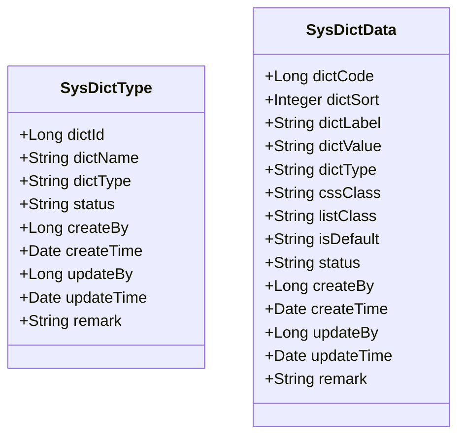
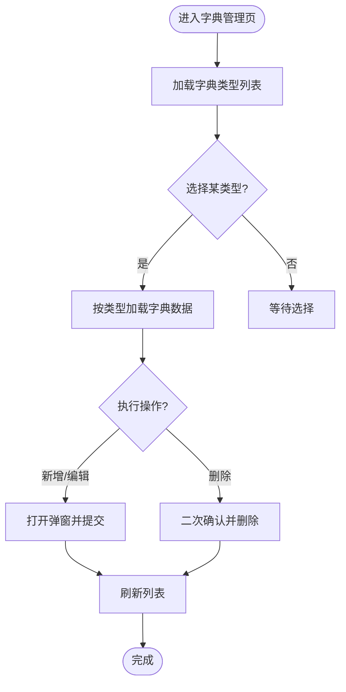
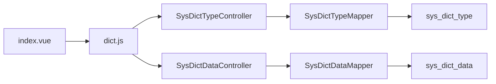

# 字典管理

<cite>
**本文引用的文件**
- [SysDictTypeController.java](file://task-manager-backend/src/main/java/com/taskmanager/controller/SysDictTypeController.java)
- [SysDictDataController.java](file://task-manager-backend/src/main/java/com/taskmanager/controller/SysDictDataController.java)
- [SysDictType.java](file://task-manager-backend/src/main/java/com/taskmanager/domain/SysDictType.java)
- [SysDictData.java](file://task-manager-backend/src/main/java/com/taskmanager/domain/SysDictData.java)
- [SysDictTypeMapper.java](file://task-manager-backend/src/main/java/com/taskmanager/mapper/SysDictTypeMapper.java)
- [SysDictDataMapper.java](file://task-manager-backend/src/main/java/com/taskmanager/mapper/SysDictDataMapper.java)
- [application.yml](file://task-manager-backend/src/main/resources/application.yml)
- [schema.sql](file://task-manager-backend/src/main/resources/schema.sql)
- [index.vue](file://task-manager-frontend/src/views/system/dict/index.vue)
- [dict.js](file://task-manager-frontend/src/api/system/dict.js)
- [SysDictTypeControllerTest.java](file://task-manager-backend/src/test/java/com/taskmanager/controller/SysDictTypeControllerTest.java)
- [SysDictDataControllerTest.java](file://task-manager-backend/src/test/java/com/taskmanager/controller/SysDictDataControllerTest.java)
</cite>

## 目录
1. [引言](#引言)
2. [项目结构](#项目结构)
3. [核心组件](#核心组件)
4. [架构总览](#架构总览)
5. [详细组件分析](#详细组件分析)
6. [依赖分析](#依赖分析)
7. [性能考虑](#性能考虑)
8. [故障排查指南](#故障排查指南)
9. [结论](#结论)
10. [附录](#附录)

## 引言
本文件面向字典管理模块，系统性阐述数据字典体系的设计与实现，覆盖字典类型管理、字典数据维护、字典数据查询、前后端交互、以及可选的缓存策略与最佳实践。文档以代码为依据，结合接口与实体模型，帮助开发者快速理解并高效使用该模块。

## 项目结构
字典管理模块由后端控制器、领域模型、持久层映射、前端页面与API封装组成，并通过数据库表进行持久化。后端采用Spring Boot + MyBatis-Plus；前端采用Vue 3 + Element Plus；数据库为MySQL；Redis作为可选缓存介质。

图表来源
- [index.vue:130-227](file://task-manager-frontend/src/views/system/dict/index.vue#L130-L227)
- [dict.js:1-48](file://task-manager-frontend/src/api/system/dict.js#L1-L48)
- [SysDictTypeController.java:19-78](file://task-manager-backend/src/main/java/com/taskmanager/controller/SysDictTypeController.java#L19-L78)
- [SysDictDataController.java:19-88](file://task-manager-backend/src/main/java/com/taskmanager/controller/SysDictDataController.java#L19-L88)
- [SysDictTypeMapper.java:11-13](file://task-manager-backend/src/main/java/com/taskmanager/mapper/SysDictTypeMapper.java#L11-L13)
- [SysDictDataMapper.java:11-13](file://task-manager-backend/src/main/java/com/taskmanager/mapper/SysDictDataMapper.java#L11-L13)
- [schema.sql:134-171](file://task-manager-backend/src/main/resources/schema.sql#L134-L171)
- [application.yml:18-32](file://task-manager-backend/src/main/resources/application.yml#L18-L32)

章节来源
- [index.vue:1-227](file://task-manager-frontend/src/views/system/dict/index.vue#L1-L227)
- [dict.js:1-48](file://task-manager-frontend/src/api/system/dict.js#L1-L48)
- [SysDictTypeController.java:1-78](file://task-manager-backend/src/main/java/com/taskmanager/controller/SysDictTypeController.java#L1-L78)
- [SysDictDataController.java:1-88](file://task-manager-backend/src/main/java/com/taskmanager/controller/SysDictDataController.java#L1-L88)
- [SysDictTypeMapper.java:1-13](file://task-manager-backend/src/main/java/com/taskmanager/mapper/SysDictTypeMapper.java#L1-L13)
- [SysDictDataMapper.java:1-13](file://task-manager-backend/src/main/java/com/taskmanager/mapper/SysDictDataMapper.java#L1-L13)
- [schema.sql:134-171](file://task-manager-backend/src/main/resources/schema.sql#L134-L171)
- [application.yml:18-32](file://task-manager-backend/src/main/resources/application.yml#L18-L32)

## 核心组件
- 控制器
  - 字典类型控制器：提供分页查询、详情查询、新增、修改、删除等REST接口。
  - 字典数据控制器：提供分页查询、按类型查询、详情查询、新增、修改、删除等REST接口。
- 实体模型
  - 字典类型实体：包含类型标识、名称、状态、创建/更新信息等。
  - 字典数据实体：包含标签、键值、类型、排序、样式、默认标记、状态等。
- 映射接口
  - 类型与数据的Mapper接口，基于MyBatis-Plus的BaseMapper。
- 前端页面
  - 字典类型列表与字典数据表格，支持新增、编辑、删除、分页与筛选。
- 缓存配置
  - application.yml中提供Redis连接配置，可用于字典数据缓存（当前控制器未直接使用）。

章节来源
- [SysDictTypeController.java:26-78](file://task-manager-backend/src/main/java/com/taskmanager/controller/SysDictTypeController.java#L26-L78)
- [SysDictDataController.java:26-88](file://task-manager-backend/src/main/java/com/taskmanager/controller/SysDictDataController.java#L26-L88)
- [SysDictType.java:16-50](file://task-manager-backend/src/main/java/com/taskmanager/domain/SysDictType.java#L16-L50)
- [SysDictData.java:16-65](file://task-manager-backend/src/main/java/com/taskmanager/domain/SysDictData.java#L16-L65)
- [SysDictTypeMapper.java:11-13](file://task-manager-backend/src/main/java/com/taskmanager/mapper/SysDictTypeMapper.java#L11-L13)
- [SysDictDataMapper.java:11-13](file://task-manager-backend/src/main/java/com/taskmanager/mapper/SysDictDataMapper.java#L11-L13)
- [index.vue:1-227](file://task-manager-frontend/src/views/system/dict/index.vue#L1-L227)
- [application.yml:18-32](file://task-manager-backend/src/main/resources/application.yml#L18-L32)

## 架构总览
后端采用分层架构：控制器负责HTTP请求处理与鉴权，Mapper负责数据库访问，Domain负责数据模型。前端通过API封装调用后端接口，完成字典类型与数据的CRUD与查询。

图表来源
- [index.vue:130-227](file://task-manager-frontend/src/views/system/dict/index.vue#L130-L227)
- [dict.js:18-32](file://task-manager-backend/src/main/resources/application.yml#L18-L32)
- [SysDictTypeController.java:19-78](file://task-manager-backend/src/main/java/com/taskmanager/controller/SysDictTypeController.java#L19-L78)
- [SysDictDataController.java:19-88](file://task-manager-backend/src/main/java/com/taskmanager/controller/SysDictDataController.java#L19-L88)
- [SysDictTypeMapper.java:11-13](file://task-manager-backend/src/main/java/com/taskmanager/mapper/SysDictTypeMapper.java#L11-L13)
- [SysDictDataMapper.java:11-13](file://task-manager-backend/src/main/java/com/taskmanager/mapper/SysDictDataMapper.java#L11-L13)
- [schema.sql:134-171](file://task-manager-backend/src/main/resources/schema.sql#L134-L171)

## 详细组件分析

### 字典类型控制器（SysDictTypeController）
- 功能要点
  - 分页查询：支持按名称、类型、状态过滤。
  - 详情查询：按主键获取字典类型。
  - 新增：默认状态填充为“正常”。
  - 修改：更新字典类型信息。
  - 删除：支持批量删除。
- 权限控制：使用注解校验系统权限位。
- 返回统一：使用通用结果包装对象。

图表来源
- [SysDictTypeController.java:26-78](file://task-manager-backend/src/main/java/com/taskmanager/controller/SysDictTypeController.java#L26-L78)
- [SysDictTypeMapper.java:11-13](file://task-manager-backend/src/main/java/com/taskmanager/mapper/SysDictTypeMapper.java#L11-L13)
- [dict.js:4-22](file://task-manager-frontend/src/api/system/dict.js#L4-L22)

章节来源
- [SysDictTypeController.java:26-78](file://task-manager-backend/src/main/java/com/taskmanager/controller/SysDictTypeController.java#L26-L78)
- [SysDictTypeControllerTest.java:94-251](file://task-manager-backend/src/test/java/com/taskmanager/controller/SysDictTypeControllerTest.java#L94-L251)

### 字典数据控制器（SysDictDataController）
- 功能要点
  - 分页查询：按类型过滤并按排序字段升序排列。
  - 公开查询：按类型获取启用状态的字典数据，供前端下拉框使用。
  - 详情查询：按编码获取字典数据。
  - 新增：默认状态为“正常”，默认是否默认为“否”。
  - 修改/删除：同类型控制器。
- 返回统一：使用通用结果包装对象。

图表来源
- [SysDictDataController.java:26-88](file://task-manager-backend/src/main/java/com/taskmanager/controller/SysDictDataController.java#L26-L88)
- [SysDictDataMapper.java:11-13](file://task-manager-backend/src/main/java/com/taskmanager/mapper/SysDictDataMapper.java#L11-L13)
- [dict.js:24-48](file://task-manager-frontend/src/api/system/dict.js#L24-L48)

章节来源
- [SysDictDataController.java:26-88](file://task-manager-backend/src/main/java/com/taskmanager/controller/SysDictDataController.java#L26-L88)
- [SysDictDataControllerTest.java:95-269](file://task-manager-backend/src/test/java/com/taskmanager/controller/SysDictDataControllerTest.java#L95-L269)

### 数据模型设计（SysDictType 与 SysDictData）

图表来源
- [SysDictType.java:16-50](file://task-manager-backend/src/main/java/com/taskmanager/domain/SysDictType.java#L16-L50)
- [SysDictData.java:16-65](file://task-manager-backend/src/main/java/com/taskmanager/domain/SysDictData.java#L16-L65)

章节来源
- [SysDictType.java:16-50](file://task-manager-backend/src/main/java/com/taskmanager/domain/SysDictType.java#L16-L50)
- [SysDictData.java:16-65](file://task-manager-backend/src/main/java/com/taskmanager/domain/SysDictData.java#L16-L65)
- [schema.sql:134-171](file://task-manager-backend/src/main/resources/schema.sql#L134-L171)

### 前端实现（字典管理页面）
- 页面布局
  - 左侧：字典类型列表，支持搜索、分页、新增/编辑/删除。
  - 右侧：对应类型的字典数据表格，支持新增/编辑/删除。
- 交互流程
  - 选择类型 -> 加载该类型的字典数据列表。
  - 新增/编辑/删除弹窗提交 -> 调用后端API -> 刷新列表或提示成功。
- API封装
  - 提供类型与数据的列表、详情、新增、修改、删除等方法。

图表来源
- [index.vue:169-225](file://task-manager-frontend/src/views/system/dict/index.vue#L169-L225)
- [dict.js:4-48](file://task-manager-frontend/src/api/system/dict.js#L4-L48)

章节来源
- [index.vue:1-227](file://task-manager-frontend/src/views/system/dict/index.vue#L1-L227)
- [dict.js:1-48](file://task-manager-frontend/src/api/system/dict.js#L1-L48)

### 字典数据缓存机制（Redis）
- 配置现状
  - application.yml中提供Redis连接参数（主机、端口、数据库、超时、连接池等）。
- 当前实现
  - 控制器未直接使用Redis缓存；字典数据查询走数据库。
- 可选实现思路
  - 在数据变更（新增/修改/删除）时，清理或更新对应dictType的缓存键。
  - 在公开查询接口中，先查Redis，命中则返回；未命中再查数据库并写入缓存。
  - 注意：缓存键命名建议采用“dict:type:{dictType}”形式，便于管理与失效。

章节来源
- [application.yml:18-32](file://task-manager-backend/src/main/resources/application.yml#L18-L32)
- [SysDictDataController.java:40-50](file://task-manager-backend/src/main/java/com/taskmanager/controller/SysDictDataController.java#L40-L50)

## 依赖分析
- 控制器依赖
  - SysDictTypeController依赖SysDictTypeMapper。
  - SysDictDataController依赖SysDictDataMapper。
- Mapper依赖
  - 两者均为MyBatis-Plus的BaseMapper接口，继承自动增删改查能力。
- 前端依赖
  - index.vue依赖dict.js提供的API方法。
- 数据库依赖
  - sys_dict_type与sys_dict_data两张表，前者唯一约束dict_type，后者按dict_type建立索引。

图表来源
- [SysDictTypeController.java:23-24](file://task-manager-backend/src/main/java/com/taskmanager/controller/SysDictTypeController.java#L23-L24)
- [SysDictDataController.java:23-24](file://task-manager-backend/src/main/java/com/taskmanager/controller/SysDictDataController.java#L23-L24)
- [SysDictTypeMapper.java:11-13](file://task-manager-backend/src/main/java/com/taskmanager/mapper/SysDictTypeMapper.java#L11-L13)
- [SysDictDataMapper.java:11-13](file://task-manager-backend/src/main/java/com/taskmanager/mapper/SysDictDataMapper.java#L11-L13)
- [schema.sql:134-171](file://task-manager-backend/src/main/resources/schema.sql#L134-L171)
- [index.vue:130-227](file://task-manager-frontend/src/views/system/dict/index.vue#L130-L227)
- [dict.js:1-48](file://task-manager-frontend/src/api/system/dict.js#L1-L48)

章节来源
- [SysDictTypeController.java:23-24](file://task-manager-backend/src/main/java/com/taskmanager/controller/SysDictTypeController.java#L23-L24)
- [SysDictDataController.java:23-24](file://task-manager-backend/src/main/java/com/taskmanager/controller/SysDictDataController.java#L23-L24)
- [SysDictTypeMapper.java:11-13](file://task-manager-backend/src/main/java/com/taskmanager/mapper/SysDictTypeMapper.java#L11-L13)
- [SysDictDataMapper.java:11-13](file://task-manager-backend/src/main/java/com/taskmanager/mapper/SysDictDataMapper.java#L11-L13)
- [schema.sql:134-171](file://task-manager-backend/src/main/resources/schema.sql#L134-L171)
- [index.vue:130-227](file://task-manager-frontend/src/views/system/dict/index.vue#L130-L227)
- [dict.js:1-48](file://task-manager-frontend/src/api/system/dict.js#L1-L48)

## 性能考虑
- 查询性能
  - 字典数据按dict_type建立索引，分页查询配合排序字段可提升效率。
  - 公开接口按状态过滤启用数据，减少渲染无效选项。
- 写入性能
  - 批量删除类型时逐条删除，建议在业务允许范围内合并SQL或使用批量删除逻辑。
- 缓存策略（建议）
  - 对高频读取的字典类型数据启用Redis缓存，键名规范为“dict:type:{dictType}”。
  - 写操作后主动失效相关缓存键，保证一致性。
- 前端体验
  - 列表加载使用loading态，避免闪烁。
  - 表单提交后及时刷新当前类型下的数据列表。

## 故障排查指南
- 接口鉴权
  - 控制器使用权限注解，确保前端携带有效令牌并具备相应权限位。
- 参数校验
  - 新增/修改时默认值填充逻辑已在后端实现，前端仍需保证必填字段完整。
- 数据一致性
  - 若启用Redis缓存，需确保写操作后正确清理缓存，避免脏读。
- 单元测试参考
  - 提供了控制器的典型场景测试，可对照验证接口行为与返回结构。

章节来源
- [SysDictTypeControllerTest.java:94-251](file://task-manager-backend/src/test/java/com/taskmanager/controller/SysDictTypeControllerTest.java#L94-L251)
- [SysDictDataControllerTest.java:95-269](file://task-manager-backend/src/test/java/com/taskmanager/controller/SysDictDataControllerTest.java#L95-L269)

## 结论
字典管理模块以清晰的分层设计实现了类型与数据的全生命周期管理，前后端协作明确，接口统一且易于扩展。建议在生产环境中引入Redis缓存以提升读取性能，并完善缓存失效策略与监控，确保数据一致性与系统稳定性。

## 附录

### 接口文档（后端）
- 字典类型
  - GET /api/system/dict/type/list：分页查询（支持dictName/dictType/status过滤）
  - GET /api/system/dict/type/{dictId}：获取详情
  - POST /api/system/dict/type：新增（默认状态为“正常”）
  - PUT /api/system/dict/type：修改
  - DELETE /api/system/dict/type/{dictIds}：删除（支持批量）
- 字典数据
  - GET /api/system/dict/data/list：分页查询（支持dictType过滤，按dictSort升序）
  - GET /api/system/dict/data/type/{dictType}：按类型查询启用数据（公开接口）
  - GET /api/system/dict/data/{dictCode}：获取详情
  - POST /api/system/dict/data：新增（默认状态为“正常”，默认是否默认为“否”）
  - PUT /api/system/dict/data：修改
  - DELETE /api/system/dict/data/{dictCodes}：删除（支持批量）

章节来源
- [SysDictTypeController.java:26-78](file://task-manager-backend/src/main/java/com/taskmanager/controller/SysDictTypeController.java#L26-L78)
- [SysDictDataController.java:26-88](file://task-manager-backend/src/main/java/com/taskmanager/controller/SysDictDataController.java#L26-L88)

### 数据模型（数据库）
- sys_dict_type
  - 主键：dict_id
  - 唯一：dict_type
  - 关键字段：dict_name、status、create_by、update_by、remark
- sys_dict_data
  - 主键：dict_code
  - 索引：dict_type
  - 关键字段：dict_label、dict_value、dict_type、dict_sort、status、is_default、cssClass、listClass、remark

章节来源
- [schema.sql:134-171](file://task-manager-backend/src/main/resources/schema.sql#L134-L171)