# 核心功能模块

<cite>
**本文引用的文件**
- [TaskManagerApplication.java](file://task-manager-backend/src/main/java/com/taskmanager/TaskManagerApplication.java)
- [application.yml](file://task-manager-backend/src/main/resources/application.yml)
- [SysUser.java](file://task-manager-backend/src/main/java/com/taskmanager/domain/SysUser.java)
- [SysRole.java](file://task-manager-backend/src/main/java/com/taskmanager/domain/SysRole.java)
- [SysMenu.java](file://task-manager-backend/src/main/java/com/taskmanager/domain/SysMenu.java)
- [SysDept.java](file://task-manager-backend/src/main/java/com/taskmanager/domain/SysDept.java)
- [SysDictData.java](file://task-manager-backend/src/main/java/com/taskmanager/domain/SysDictData.java)
- [Supplier.java](file://task-manager-backend/src/main/java/com/taskmanager/domain/Supplier.java)
- [Warehouse.java](file://task-manager-backend/src/main/java/com/taskmanager/domain/Warehouse.java)
- [Product.java](file://task-manager-backend/src/main/java/com/taskmanager/domain/Product.java)
- [SysUserController.java](file://task-manager-backend/src/main/java/com/taskmanager/controller/SysUserController.java)
- [SysRoleController.java](file://task-manager-backend/src/main/java/com/taskmanager/controller/SysRoleController.java)
- [SysMenuController.java](file://task-manager-backend/src/main/java/com/taskmanager/controller/SysMenuController.java)
- [PermissionService.java](file://task-manager-backend/src/main/java/com/taskmanager/security/PermissionService.java)
- [LogAspect.java](file://task-manager-backend/src/main/java/com/taskmanager/aspect/LogAspect.java)
</cite>

## 目录
1. [引言](#引言)
2. [项目结构](#项目结构)
3. [核心组件](#核心组件)
4. [架构总览](#架构总览)
5. [详细组件分析](#详细组件分析)
6. [依赖分析](#依赖分析)
7. [性能考虑](#性能考虑)
8. [故障排查指南](#故障排查指南)
9. [结论](#结论)
10. [附录](#附录)

## 引言
本文件面向CodeBuddy任务管理系统的核心功能模块，围绕系统管理、RBAC权限控制、系统监控、供应商管理、仓储管理以及电商模块进行系统化说明。文档以“模块职责—数据模型—API接口—业务流程—最佳实践”为主线，帮助开发者与运维人员快速理解与落地。

## 项目结构
后端采用Spring Boot + MyBatis-Plus架构，统一入口类负责应用启动扫描Mapper包，配置文件集中管理数据源、Redis、MyBatis-Plus、Jackson、JWT与Knife4j文档等。前端位于独立目录，后端提供REST接口供前端调用。

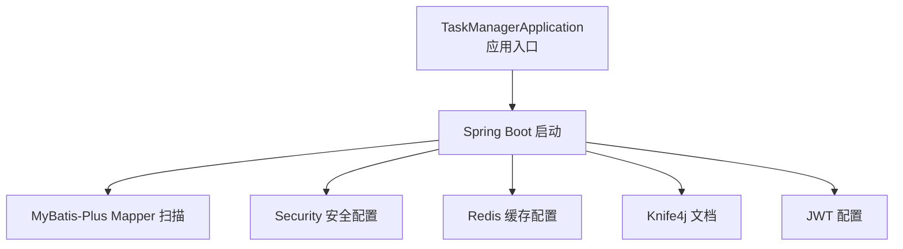

**图表来源**
- [TaskManagerApplication.java:1-18](file://task-manager-backend/src/main/java/com/taskmanager/TaskManagerApplication.java#L1-L18)
- [application.yml:1-79](file://task-manager-backend/src/main/resources/application.yml#L1-L79)

**章节来源**
- [TaskManagerApplication.java:1-18](file://task-manager-backend/src/main/java/com/taskmanager/TaskManagerApplication.java#L1-L18)
- [application.yml:1-79](file://task-manager-backend/src/main/resources/application.yml#L1-L79)

## 核心组件
- 系统管理模块：用户、角色、菜单、部门、字典的增删改查与权限校验。
- RBAC权限控制：基于注解的权限校验与通配符权限支持。
- 系统监控模块：操作日志切面记录、登录日志管理与查询统计。
- 供应商管理模块：供应商信息维护、联系状态与品类管理。
- 仓储管理模块：仓库与商品库存管理、库存预警机制。
- 电商模块：购物车、订单与支付集成（后端提供基础实体与接口，前端电商页面已实现）。

**章节来源**
- [SysUserController.java:1-132](file://task-manager-backend/src/main/java/com/taskmanager/controller/SysUserController.java#L1-L132)
- [SysRoleController.java:1-83](file://task-manager-backend/src/main/java/com/taskmanager/controller/SysRoleController.java#L1-L83)
- [SysMenuController.java:1-86](file://task-manager-backend/src/main/java/com/taskmanager/controller/SysMenuController.java#L1-L86)
- [PermissionService.java:1-64](file://task-manager-backend/src/main/java/com/taskmanager/security/PermissionService.java#L1-L64)
- [LogAspect.java:1-137](file://task-manager-backend/src/main/java/com/taskmanager/aspect/LogAspect.java#L1-L137)
- [Supplier.java:1-86](file://task-manager-backend/src/main/java/com/taskmanager/domain/Supplier.java#L1-L86)
- [Warehouse.java:1-70](file://task-manager-backend/src/main/java/com/taskmanager/domain/Warehouse.java#L1-L70)
- [Product.java:1-97](file://task-manager-backend/src/main/java/com/taskmanager/domain/Product.java#L1-L97)

## 架构总览
系统采用前后端分离，后端提供REST接口，前端通过路由与状态管理访问。权限控制通过Spring Security与自定义权限服务实现，日志通过AOP切面统一采集。

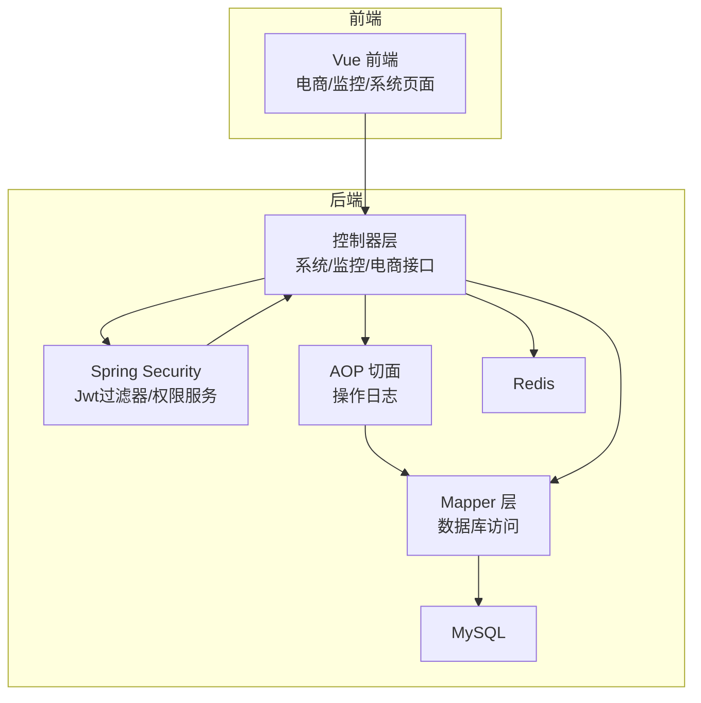

**图表来源**
- [application.yml:1-79](file://task-manager-backend/src/main/resources/application.yml#L1-L79)
- [LogAspect.java:1-137](file://task-manager-backend/src/main/java/com/taskmanager/aspect/LogAspect.java#L1-L137)
- [PermissionService.java:1-64](file://task-manager-backend/src/main/java/com/taskmanager/security/PermissionService.java#L1-L64)

## 详细组件分析

### 系统管理模块（用户/角色/菜单/部门/字典）
- 用户管理：分页查询、新增/编辑（含密码加密）、逻辑删除、重置密码、状态变更。
- 角色管理：分页查询、新增/编辑（默认数据范围）、逻辑删除。
- 菜单管理：平铺列表、菜单树、新增/编辑、删除前检查子节点。
- 部门管理：树形结构（父ID/祖先链），支持层级组织。
- 字典管理：字典类型与字典数据，支持样式与默认标记。

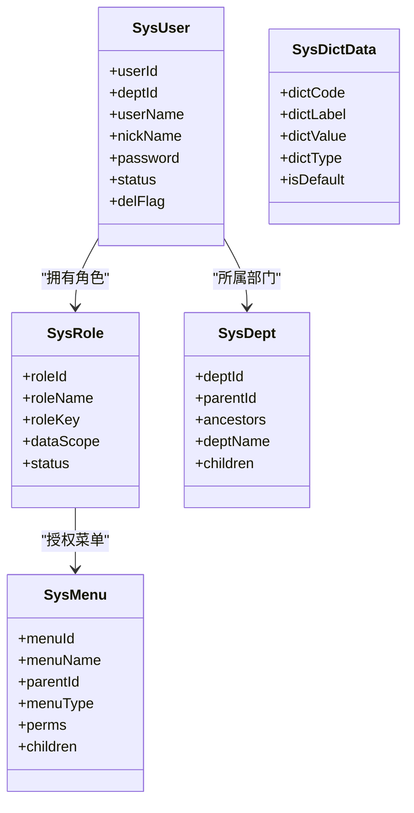

**图表来源**
- [SysUser.java:1-80](file://task-manager-backend/src/main/java/com/taskmanager/domain/SysUser.java#L1-L80)
- [SysRole.java:1-65](file://task-manager-backend/src/main/java/com/taskmanager/domain/SysRole.java#L1-L65)
- [SysMenu.java:1-92](file://task-manager-backend/src/main/java/com/taskmanager/domain/SysMenu.java#L1-L92)
- [SysDept.java:1-73](file://task-manager-backend/src/main/java/com/taskmanager/domain/SysDept.java#L1-L73)
- [SysDictData.java:1-65](file://task-manager-backend/src/main/java/com/taskmanager/domain/SysDictData.java#L1-L65)

**章节来源**
- [SysUserController.java:1-132](file://task-manager-backend/src/main/java/com/taskmanager/controller/SysUserController.java#L1-L132)
- [SysRoleController.java:1-83](file://task-manager-backend/src/main/java/com/taskmanager/controller/SysRoleController.java#L1-L83)
- [SysMenuController.java:1-86](file://task-manager-backend/src/main/java/com/taskmanager/controller/SysMenuController.java#L1-L86)

#### 用户管理业务流程
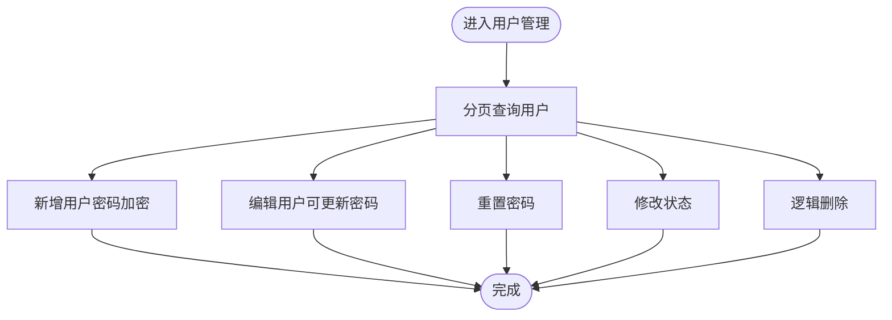

**图表来源**
- [SysUserController.java:30-130](file://task-manager-backend/src/main/java/com/taskmanager/controller/SysUserController.java#L30-L130)

**章节来源**
- [SysUserController.java:30-130](file://task-manager-backend/src/main/java/com/taskmanager/controller/SysUserController.java#L30-L130)

#### 角色管理业务流程
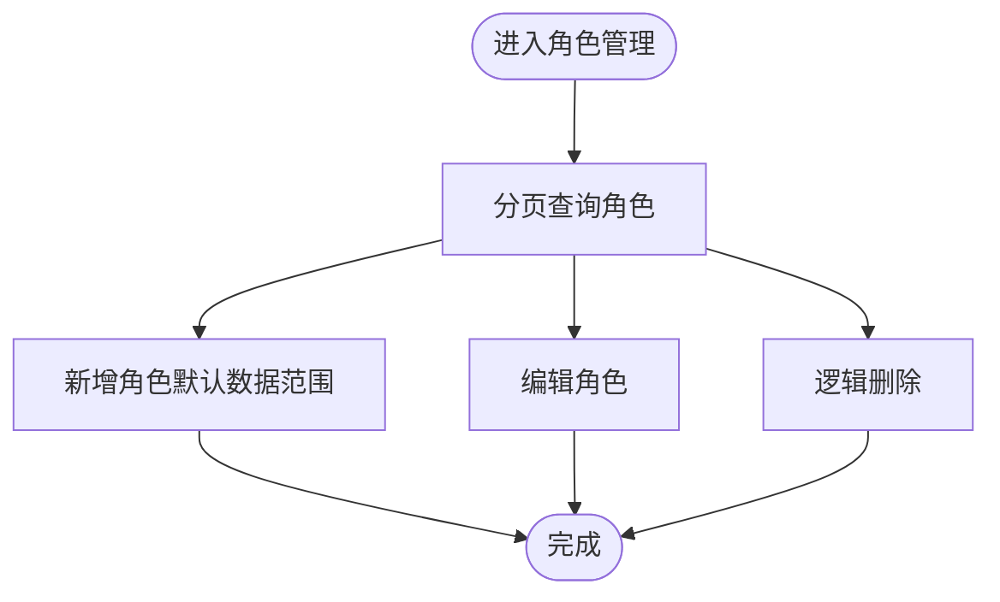

**图表来源**
- [SysRoleController.java:26-81](file://task-manager-backend/src/main/java/com/taskmanager/controller/SysRoleController.java#L26-L81)

**章节来源**
- [SysRoleController.java:26-81](file://task-manager-backend/src/main/java/com/taskmanager/controller/SysRoleController.java#L26-L81)

#### 菜单管理业务流程
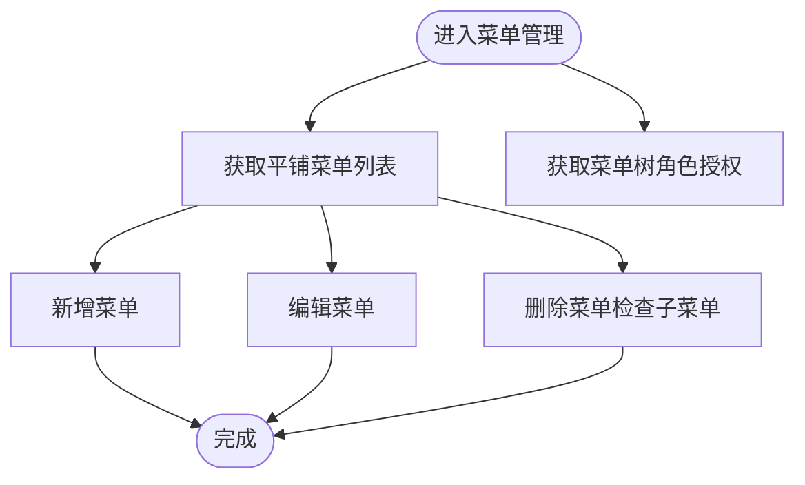

**图表来源**
- [SysMenuController.java:26-84](file://task-manager-backend/src/main/java/com/taskmanager/controller/SysMenuController.java#L26-L84)

**章节来源**
- [SysMenuController.java:26-84](file://task-manager-backend/src/main/java/com/taskmanager/controller/SysMenuController.java#L26-L84)

### RBAC权限控制
- 权限校验：通过自定义权限服务在方法级注解中校验权限标识，支持通配符“*:*:*”超级管理员。
- 控制器层：大量使用“@PreAuthorize”结合“@ss.hasPermi(...)”，确保接口访问受控。
- 登录用户上下文：从Security上下文提取当前用户，获取其权限集合。

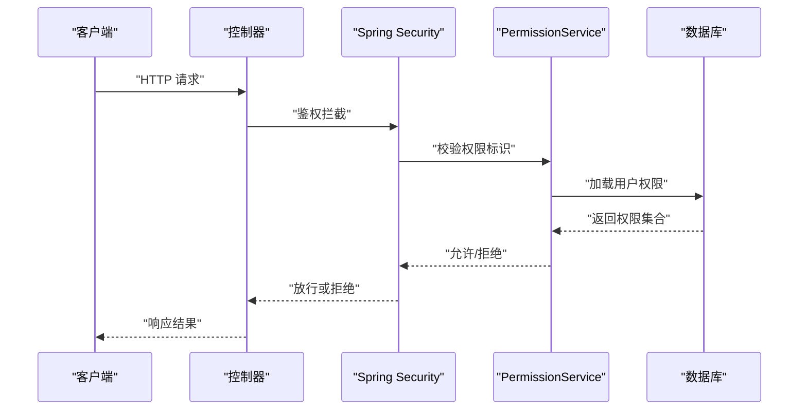

**图表来源**
- [PermissionService.java:19-38](file://task-manager-backend/src/main/java/com/taskmanager/security/PermissionService.java#L19-L38)
- [SysUserController.java:33](file://task-manager-backend/src/main/java/com/taskmanager/controller/SysUserController.java#L33)
- [SysRoleController.java:29](file://task-manager-backend/src/main/java/com/taskmanager/controller/SysRoleController.java#L29)
- [SysMenuController.java:27](file://task-manager-backend/src/main/java/com/taskmanager/controller/SysMenuController.java#L27)

**章节来源**
- [PermissionService.java:1-64](file://task-manager-backend/src/main/java/com/taskmanager/security/PermissionService.java#L1-L64)
- [SysUserController.java:30-130](file://task-manager-backend/src/main/java/com/taskmanager/controller/SysUserController.java#L30-L130)
- [SysRoleController.java:26-81](file://task-manager-backend/src/main/java/com/taskmanager/controller/SysRoleController.java#L26-L81)
- [SysMenuController.java:26-84](file://task-manager-backend/src/main/java/com/taskmanager/controller/SysMenuController.java#L26-L84)

### 系统监控模块（操作日志与登录日志）
- 操作日志：通过AOP切面拦截标注“@Log”的控制器方法，自动记录模块、业务类型、请求参数、响应结果、耗时、异常等。
- 登录日志：登录相关接口与日志查询页面在前端存在，后端提供登录日志实体与接口映射文件，便于扩展。

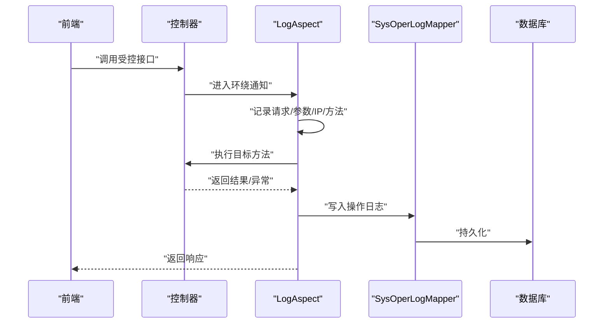

**图表来源**
- [LogAspect.java:44-96](file://task-manager-backend/src/main/java/com/taskmanager/aspect/LogAspect.java#L44-L96)

**章节来源**
- [LogAspect.java:1-137](file://task-manager-backend/src/main/java/com/taskmanager/aspect/LogAspect.java#L1-L137)

### 供应商管理模块
- 供应商实体包含公司名称、联系人、多电话、联系状态、品类、地址等字段，支持Excel导入导出。
- 业务逻辑建议：建立联系状态枚举与品类字典，提供批量导入模板，设置联系状态流转规则（如“未联系”到“已加微信”再到“已下单”）。

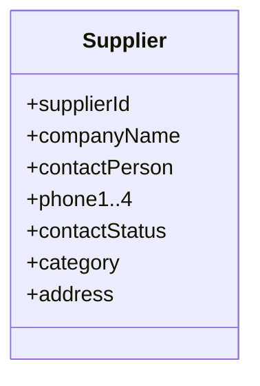

**图表来源**
- [Supplier.java:17-85](file://task-manager-backend/src/main/java/com/taskmanager/domain/Supplier.java#L17-L85)

**章节来源**
- [Supplier.java:1-86](file://task-manager-backend/src/main/java/com/taskmanager/domain/Supplier.java#L1-L86)

### 仓储管理模块
- 仓库实体包含仓库名称、编码、省市区、类型、状态等字段。
- 商品实体包含名称、SKU、价格、单位、状态等，支持供应商与库存关联。
- 库存管理建议：引入库存表与预警阈值字段，结合商品汇总计算总库存，触发预警通知。

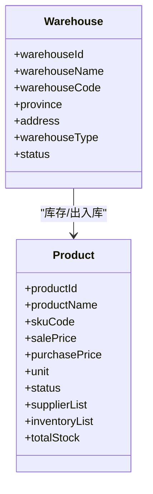

**图表来源**
- [Warehouse.java:17-69](file://task-manager-backend/src/main/java/com/taskmanager/domain/Warehouse.java#L17-L69)
- [Product.java:20-96](file://task-manager-backend/src/main/java/com/taskmanager/domain/Product.java#L20-L96)

**章节来源**
- [Warehouse.java:1-70](file://task-manager-backend/src/main/java/com/taskmanager/domain/Warehouse.java#L1-L70)
- [Product.java:1-97](file://task-manager-backend/src/main/java/com/taskmanager/domain/Product.java#L1-L97)

### 电商模块
- 后端提供电商相关实体（购物车、订单、商品、库存、供应商等）与基础接口映射，前端电商页面已实现路由与视图。
- 建议：在后端完善订单状态机、支付回调处理、库存扣减与超卖防护、购物车与订单的幂等性设计。

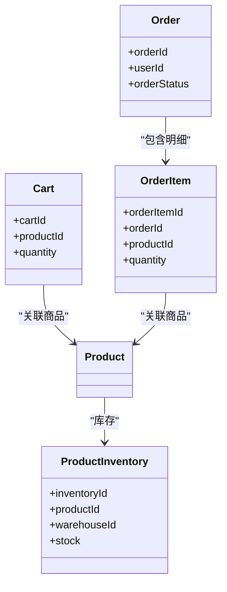

**图表来源**
- [Cart.java](file://task-manager-backend/src/main/java/com/taskmanager/domain/Cart.java)
- [Order.java](file://task-manager-backend/src/main/java/com/taskmanager/domain/Order.java)
- [OrderItem.java](file://task-manager-backend/src/main/java/com/taskmanager/domain/OrderItem.java)
- [ProductInventory.java](file://task-manager-backend/src/main/java/com/taskmanager/domain/ProductInventory.java)

**章节来源**
- [Cart.java](file://task-manager-backend/src/main/java/com/taskmanager/domain/Cart.java)
- [Order.java](file://task-manager-backend/src/main/java/com/taskmanager/domain/Order.java)
- [OrderItem.java](file://task-manager-backend/src/main/java/com/taskmanager/domain/OrderItem.java)
- [ProductInventory.java](file://task-manager-backend/src/main/java/com/taskmanager/domain/ProductInventory.java)

## 依赖分析
- 组件内聚：各模块控制器职责清晰，均通过Mapper访问数据库，遵循分层架构。
- 外部依赖：MyBatis-Plus、Spring Security、Redis、JWT、Knife4j等。
- 权限耦合：控制器与权限服务强耦合，权限校验集中在注解与自定义服务中，便于统一管理。

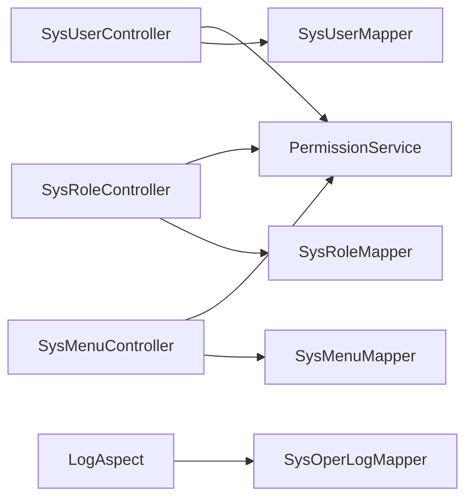

**图表来源**
- [SysUserController.java:30-130](file://task-manager-backend/src/main/java/com/taskmanager/controller/SysUserController.java#L30-L130)
- [SysRoleController.java:26-81](file://task-manager-backend/src/main/java/com/taskmanager/controller/SysRoleController.java#L26-L81)
- [SysMenuController.java:26-84](file://task-manager-backend/src/main/java/com/taskmanager/controller/SysMenuController.java#L26-L84)
- [PermissionService.java:13-38](file://task-manager-backend/src/main/java/com/taskmanager/security/PermissionService.java#L13-L38)
- [LogAspect.java:33-96](file://task-manager-backend/src/main/java/com/taskmanager/aspect/LogAspect.java#L33-L96)

**章节来源**
- [SysUserController.java:30-130](file://task-manager-backend/src/main/java/com/taskmanager/controller/SysUserController.java#L30-L130)
- [SysRoleController.java:26-81](file://task-manager-backend/src/main/java/com/taskmanager/controller/SysRoleController.java#L26-L81)
- [SysMenuController.java:26-84](file://task-manager-backend/src/main/java/com/taskmanager/controller/SysMenuController.java#L26-L84)
- [PermissionService.java:13-38](file://task-manager-backend/src/main/java/com/taskmanager/security/PermissionService.java#L13-L38)
- [LogAspect.java:33-96](file://task-manager-backend/src/main/java/com/taskmanager/aspect/LogAspect.java#L33-L96)

## 性能考虑
- 分页查询：用户/角色/字典等列表接口使用分页插件，避免一次性加载大表。
- 缓存策略：Redis用于会话与热点数据缓存，建议对菜单树、字典类型等只读数据做缓存。
- 日志落库：操作日志异步化或批量写入，避免阻塞主业务。
- 数据库连接池：HikariCP已配置，注意慢SQL与连接泄漏监控。

[本节为通用建议，无需特定文件引用]

## 故障排查指南
- 权限不足：检查“@PreAuthorize”注解与“@ss.hasPermi(...)"调用是否正确，确认登录用户权限集合是否包含所需标识。
- 操作日志未记录：确认AOP切面是否生效、Mapper是否注入、数据库表是否存在。
- 登录异常：核对JWT密钥、过期时间与Header头设置，检查Security过滤器链路。
- 数据库连接失败：核对application.yml中的数据源配置与网络连通性。

**章节来源**
- [PermissionService.java:25-38](file://task-manager-backend/src/main/java/com/taskmanager/security/PermissionService.java#L25-L38)
- [LogAspect.java:44-96](file://task-manager-backend/src/main/java/com/taskmanager/aspect/LogAspect.java#L44-L96)
- [application.yml:5-16](file://task-manager-backend/src/main/resources/application.yml#L5-L16)

## 结论
本系统以清晰的分层架构与完善的权限体系为基础，覆盖系统管理、监控、供应商与仓储、电商等核心业务域。通过注解驱动的权限控制与AOP日志采集，保障了系统的安全性与可观测性。建议后续在电商模块完善订单状态机与库存风控，在监控模块增强日志统计与告警能力。

[本节为总结，无需特定文件引用]

## 附录
- 配置要点：数据源、Redis、MyBatis-Plus、JWT、Knife4j均在配置文件中集中管理。
- 接口文档：通过Knife4j在后端生成OpenAPI文档，便于前后端协同。

**章节来源**
- [application.yml:1-79](file://task-manager-backend/src/main/resources/application.yml#L1-L79)