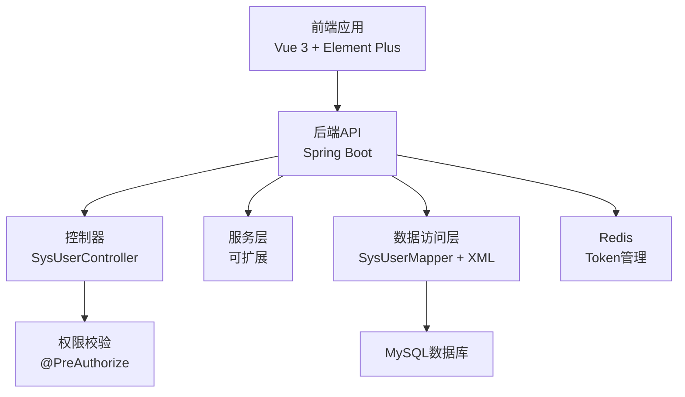
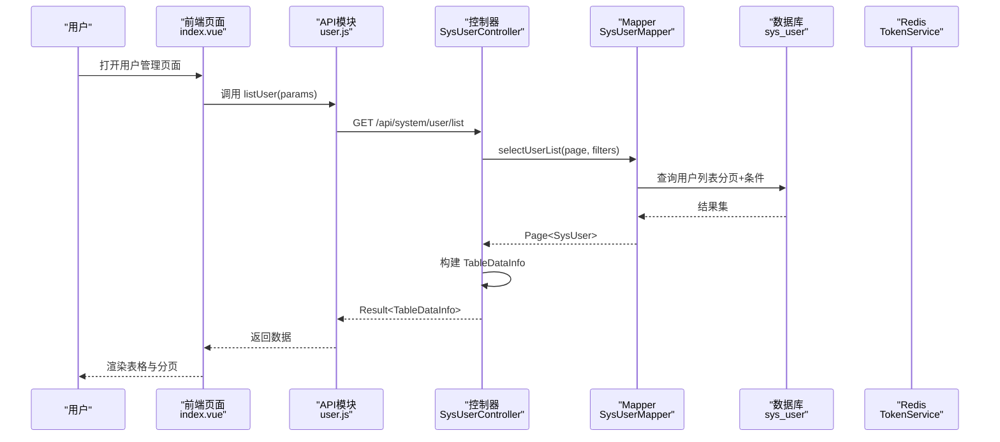
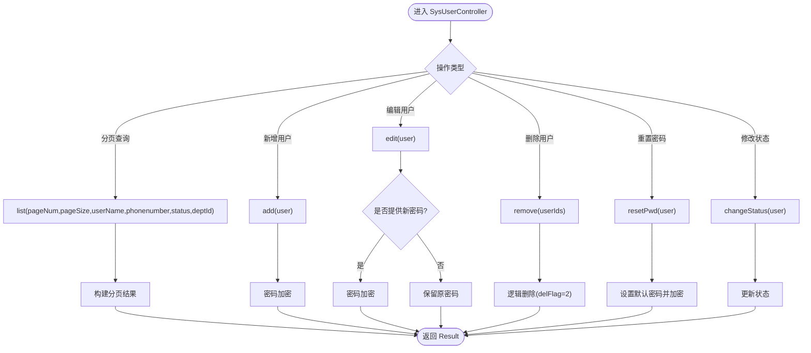
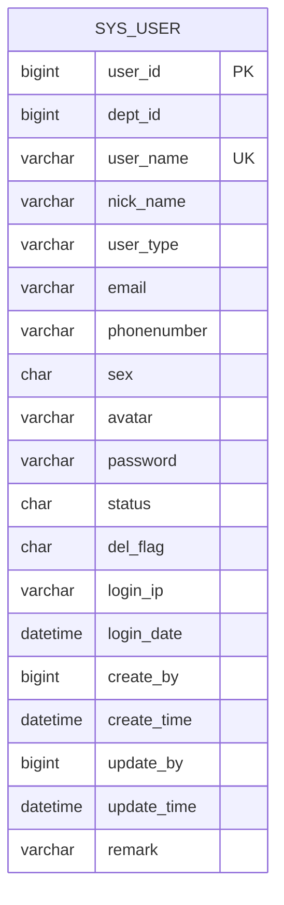
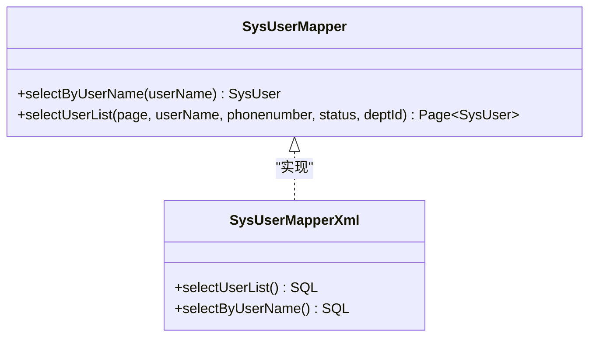
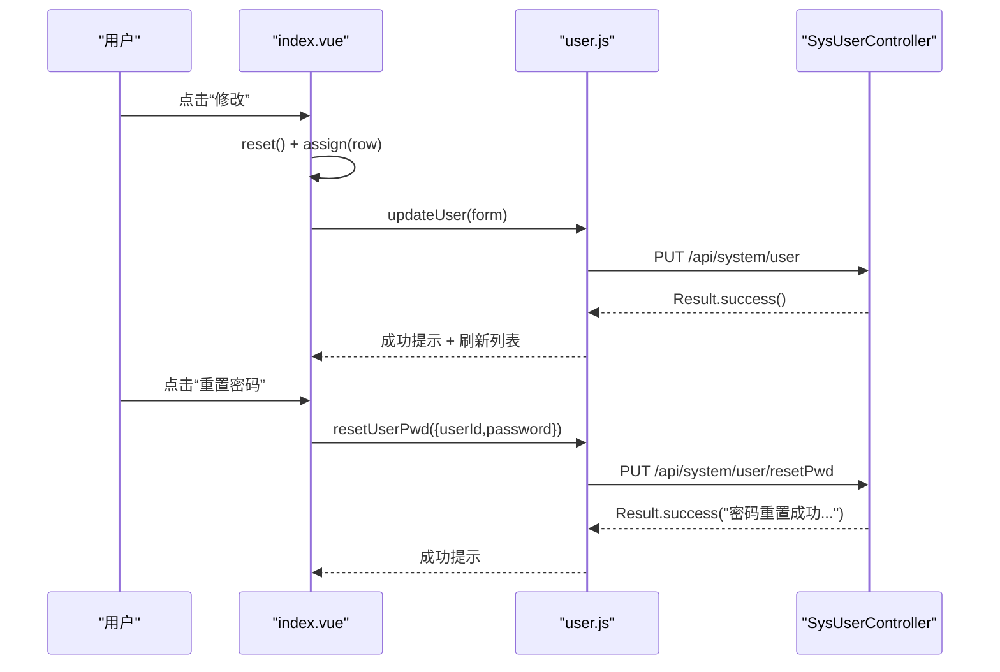
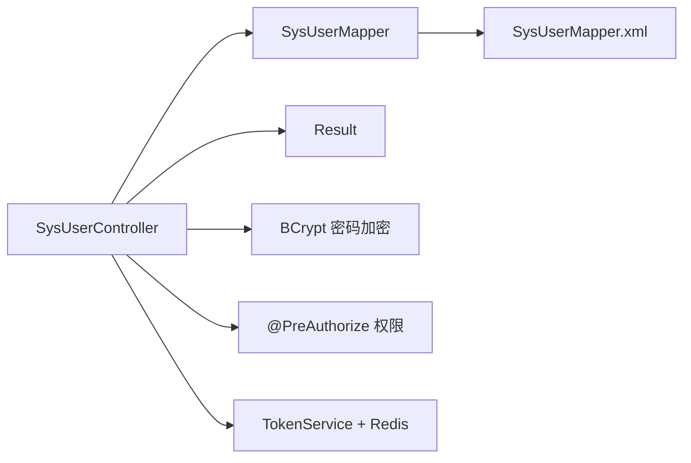

# 用户管理系统

<cite>
**本文引用的文件**
- [SysUserController.java](file://task-manager-backend/src/main/java/com/taskmanager/controller/SysUserController.java)
- [SysUser.java](file://task-manager-backend/src/main/java/com/taskmanager/domain/SysUser.java)
- [SysUserMapper.java](file://task-manager-backend/src/main/java/com/taskmanager/mapper/SysUserMapper.java)
- [SysUserMapper.xml](file://task-manager-backend/src/main/resources/mapper/SysUserMapper.xml)
- [Result.java](file://task-manager-backend/src/main/java/com/taskmanager/common/Result.java)
- [TableDataInfo.java](file://task-manager-backend/src/main/java/com/taskmanager/common/utils/TableDataInfo.java)
- [index.vue](file://task-manager-frontend/src/views/system/user/index.vue)
- [user.js](file://task-manager-frontend/src/api/system/user.js)
- [schema.sql](file://task-manager-backend/src/main/resources/schema.sql)
- [application.yml](file://task-manager-backend/src/main/resources/application.yml)
- [TokenService.java](file://task-manager-backend/src/main/java/com/taskmanager/security/TokenService.java)
</cite>

## 目录
1. [引言](#引言)
2. [项目结构](#项目结构)
3. [核心组件](#核心组件)
4. [架构概览](#架构概览)
5. [详细组件分析](#详细组件分析)
6. [依赖分析](#依赖分析)
7. [性能考虑](#性能考虑)
8. [故障排查指南](#故障排查指南)
9. [结论](#结论)
10. [附录](#附录)

## 引言
本文件面向用户管理系统，围绕用户管理模块的完整实现进行深入说明，涵盖后端控制器、实体模型、前端页面与交互、以及最佳实践与安全策略。重点包括：
- 用户CRUD操作与分页查询
- 密码加密处理与默认密码重置
- 用户状态管理与逻辑删除
- 部门关联与权限控制
- 前端表格展示、搜索、批量操作与弹窗表单
- API接口规范、参数与返回值说明

## 项目结构
系统采用前后端分离架构，后端基于Spring Boot + MyBatis-Plus，前端基于Vue 3 + Element Plus，通过REST API进行交互。

图表来源
- [SysUserController.java:20-131](file://task-manager-backend/src/main/java/com/taskmanager/controller/SysUserController.java#L20-L131)
- [SysUserMapper.java:13-38](file://task-manager-backend/src/main/java/com/taskmanager/mapper/SysUserMapper.java#L13-L38)
- [SysUserMapper.xml:4-57](file://task-manager-backend/src/main/resources/mapper/SysUserMapper.xml#L4-L57)
- [application.yml:5-56](file://task-manager-backend/src/main/resources/application.yml#L5-L56)

章节来源
- [SysUserController.java:1-132](file://task-manager-backend/src/main/java/com/taskmanager/controller/SysUserController.java#L1-L132)
- [index.vue:1-240](file://task-manager-frontend/src/views/system/user/index.vue#L1-L240)
- [user.js:1-37](file://task-manager-frontend/src/api/system/user.js#L1-L37)

## 核心组件
- 控制器：SysUserController 提供用户管理的REST接口，包含分页查询、详情获取、新增、编辑、删除、密码重置、状态变更等。
- 实体模型：SysUser 映射sys_user表，包含用户基本信息、状态、部门关联、删除标志、登录信息与审计字段。
- 数据访问：SysUserMapper 接口与SysUserMapper.xml提供分页查询与条件筛选，支持模糊匹配用户名/手机号、精确匹配状态与部门。
- 响应封装：Result<T>统一返回格式；TableDataInfo<T>封装分页数据。
- 前端页面：index.vue实现表格、搜索、批量操作、弹窗表单与状态切换；user.js封装API调用。

章节来源
- [SysUserController.java:30-131](file://task-manager-backend/src/main/java/com/taskmanager/controller/SysUserController.java#L30-L131)
- [SysUser.java:16-79](file://task-manager-backend/src/main/java/com/taskmanager/domain/SysUser.java#L16-L79)
- [SysUserMapper.java:13-38](file://task-manager-backend/src/main/java/com/taskmanager/mapper/SysUserMapper.java#L13-L38)
- [SysUserMapper.xml:35-56](file://task-manager-backend/src/main/resources/mapper/SysUserMapper.xml#L35-L56)
- [Result.java:15-75](file://task-manager-backend/src/main/java/com/taskmanager/common/Result.java#L15-L75)
- [TableDataInfo.java:15-59](file://task-manager-backend/src/main/java/com/taskmanager/common/utils/TableDataInfo.java#L15-L59)
- [index.vue:133-239](file://task-manager-frontend/src/views/system/user/index.vue#L133-L239)
- [user.js:1-37](file://task-manager-frontend/src/api/system/user.js#L1-L37)

## 架构概览
后端通过Spring MVC暴露REST接口，MyBatis-Plus负责ORM映射，Redis用于Token会话管理，权限通过注解@PreAuthorize进行细粒度控制。前端通过Axios封装的API模块调用后端接口，Element Plus提供UI组件与交互。

图表来源
- [SysUserController.java:33-45](file://task-manager-backend/src/main/java/com/taskmanager/controller/SysUserController.java#L33-L45)
- [SysUserMapper.xml:35-56](file://task-manager-backend/src/main/resources/mapper/SysUserMapper.xml#L35-L56)
- [user.js:4-6](file://task-manager-frontend/src/api/system/user.js#L4-L6)
- [index.vue:157-166](file://task-manager-frontend/src/views/system/user/index.vue#L157-L166)

## 详细组件分析

### 控制器：SysUserController
- 分页查询：支持pageNum/pageSize、userName（模糊）、phonenumber（模糊）、status（精确）、deptId（精确）。deptId支持子部门查询（通过祖先集合）。
- 新增用户：对密码进行BCrypt加密；默认delFlag=0、status=0；返回统一Result。
- 编辑用户：若提交密码非空则重新加密；否则保留原密码；更新用户。
- 删除用户：逻辑删除（delFlag=2），逐个更新。
- 重置密码：默认密码从配置读取（示例为Admin@2026），加密后更新。
- 状态变更：直接更新status字段。
- 权限控制：使用@PreAuthorize对各接口进行权限校验。

图表来源
- [SysUserController.java:33-131](file://task-manager-backend/src/main/java/com/taskmanager/controller/SysUserController.java#L33-L131)

章节来源
- [SysUserController.java:30-131](file://task-manager-backend/src/main/java/com/taskmanager/controller/SysUserController.java#L30-L131)

### 实体模型：SysUser
- 主键：userId（自增）
- 关联：deptId（部门ID）
- 基本信息：userName、nickName、userType、email、phonenumber、sex、avatar
- 安全：password（BCrypt加密存储）
- 状态：status（0正常/1停用），delFlag（0存在/2删除）
- 登录：loginIp、loginDate
- 审计：createBy、createTime、updateBy、updateTime
- 备注：remark

图表来源
- [schema.sql:14-36](file://task-manager-backend/src/main/resources/schema.sql#L14-L36)

章节来源
- [SysUser.java:16-79](file://task-manager-backend/src/main/java/com/taskmanager/domain/SysUser.java#L16-L79)
- [schema.sql:14-36](file://task-manager-backend/src/main/resources/schema.sql#L14-L36)

### 数据访问：SysUserMapper与XML
- selectUserList：支持userName、phonenumber模糊匹配，status精确匹配，deptId精确匹配或其子部门（通过ancestors集合）。
- selectByUserName：按用户名查询（登录使用）。
- MyBatis-Plus全局逻辑删除配置：delFlag=2表示删除，查询默认过滤delFlag=0。

图表来源
- [SysUserMapper.java:13-38](file://task-manager-backend/src/main/java/com/taskmanager/mapper/SysUserMapper.java#L13-L38)
- [SysUserMapper.xml:29-56](file://task-manager-backend/src/main/resources/mapper/SysUserMapper.xml#L29-L56)

章节来源
- [SysUserMapper.java:13-38](file://task-manager-backend/src/main/java/com/taskmanager/mapper/SysUserMapper.java#L13-L38)
- [SysUserMapper.xml:35-56](file://task-manager-backend/src/main/resources/mapper/SysUserMapper.xml#L35-L56)
- [application.yml:39-44](file://task-manager-backend/src/main/resources/application.yml#L39-L44)

### 前端页面：用户管理
- 搜索栏：支持userName、phonenumber、status筛选，Enter触发查询。
- 操作按钮：新增、删除（批量禁用/启用）。
- 表格列：userId、userName、nickName、deptId、phone、status（开关）、createTime、操作列（修改、删除、重置密码）。
- 分页：支持页码与每页大小切换。
- 弹窗表单：新增/修改用户，包含必填校验（用户名、昵称、密码>=5），性别与状态选择，备注。
- 状态切换：通过el-switch触发changeStatus。
- 重置密码：弹窗输入新密码，调用resetUserPwd。
- 删除：二次确认，支持单条与批量。

图表来源
- [index.vue:181-225](file://task-manager-frontend/src/views/system/user/index.vue#L181-L225)
- [user.js:13-36](file://task-manager-frontend/src/api/system/user.js#L13-L36)

章节来源
- [index.vue:1-240](file://task-manager-frontend/src/views/system/user/index.vue#L1-L240)
- [user.js:1-37](file://task-manager-frontend/src/api/system/user.js#L1-L37)

### 统一响应与分页封装
- Result<T>：统一返回code/message/data结构，提供success/error静态方法。
- TableDataInfo<T>：封装total/rows/pageNum/pageSize/pages，从MyBatis-Plus Page构建。

章节来源
- [Result.java:15-75](file://task-manager-backend/src/main/java/com/taskmanager/common/Result.java#L15-L75)
- [TableDataInfo.java:15-59](file://task-manager-backend/src/main/java/com/taskmanager/common/utils/TableDataInfo.java#L15-L59)

## 依赖分析
- 控制器依赖：SysUserMapper、PasswordEncoder（BCrypt）、权限注解@PreAuthorize。
- Mapper依赖：MyBatis-Plus Page分页、XML动态SQL。
- 前端依赖：Element Plus组件、Axios封装、路由与状态管理。
- 安全依赖：Redis存储Token，TokenService提供创建/刷新/删除/查询。

图表来源
- [SysUserController.java:24-28](file://task-manager-backend/src/main/java/com/taskmanager/controller/SysUserController.java#L24-L28)
- [SysUserMapper.java:13-38](file://task-manager-backend/src/main/java/com/taskmanager/mapper/SysUserMapper.java#L13-L38)
- [TokenService.java:18-88](file://task-manager-backend/src/main/java/com/taskmanager/security/TokenService.java#L18-L88)

章节来源
- [SysUserController.java:1-132](file://task-manager-backend/src/main/java/com/taskmanager/controller/SysUserController.java#L1-L132)
- [TokenService.java:18-88](file://task-manager-backend/src/main/java/com/taskmanager/security/TokenService.java#L18-L88)

## 性能考虑
- 分页查询：使用MyBatis-Plus Page，避免一次性加载全量数据；建议合理设置pageSize上限。
- 动态SQL：条件判断避免无效LIKE，deptId支持祖先集合查询，注意索引与执行计划。
- 密码加密：BCrypt成本因子默认，建议结合业务压力评估调整。
- Redis会话：Token过期时间可配置，建议根据业务场景优化；注意Redis连接池参数。
- 前端渲染：表格列尽量懒加载，避免过多DOM节点；分页与搜索联动减少后端压力。

## 故障排查指南
- 分页查询无数据：检查deptId传参与祖先集合匹配逻辑；确认delFlag=0的过滤生效。
- 密码重置失败：确认默认密码生成与BCrypt加密流程；检查resetPwd接口权限。
- 状态切换无效：确认changeStatus接口权限与前端事件绑定。
- 删除后仍可见：确认逻辑删除字段delFlag=2与查询过滤一致。
- 前端报错：检查user.js接口路径与参数传递；确认后端返回Result格式正确。

章节来源
- [SysUserController.java:94-131](file://task-manager-backend/src/main/java/com/taskmanager/controller/SysUserController.java#L94-L131)
- [index.vue:209-236](file://task-manager-frontend/src/views/system/user/index.vue#L209-L236)

## 结论
用户管理系统通过清晰的分层设计与统一的响应格式，实现了完善的用户CRUD与状态管理，并结合权限控制与安全策略保障系统稳定与安全。前端交互友好，支持分页、搜索、批量操作与弹窗表单，满足日常运维与管理需求。

## 附录

### API接口说明
- 列表查询
  - 方法：GET
  - 路径：/api/system/user/list
  - 参数：pageNum、pageSize、userName、phonenumber、status、deptId
  - 返回：Result<TableDataInfo<SysUser>>
- 获取详情
  - 方法：GET
  - 路径：/api/system/user/{userId}
  - 返回：Result<SysUser>
- 新增用户
  - 方法：POST
  - 路径：/api/system/user
  - 请求体：SysUser（密码将被加密）
  - 返回：Result<Void>
- 修改用户
  - 方法：PUT
  - 路径：/api/system/user
  - 请求体：SysUser（密码为空则保留原密码）
  - 返回：Result<Void>
- 删除用户
  - 方法：DELETE
  - 路径：/api/system/user/{userIds}
  - 返回：Result<Void>
- 重置密码
  - 方法：PUT
  - 路径：/api/system/user/resetPwd
  - 请求体：SysUser（包含userId与新密码）
  - 返回：Result<String>
- 修改状态
  - 方法：PUT
  - 路径：/api/system/user/changeStatus
  - 请求体：SysUser（包含userId与status）
  - 返回：Result<Void>

章节来源
- [SysUserController.java:33-131](file://task-manager-backend/src/main/java/com/taskmanager/controller/SysUserController.java#L33-L131)
- [user.js:1-37](file://task-manager-frontend/src/api/system/user.js#L1-L37)

### 数据模型与约束
- sys_user表字段与约束参考schema.sql，包含唯一索引（uk_user_name）、删除标志（delFlag=0/2）、状态（status=0/1）等。
- MyBatis-Plus全局逻辑删除配置：逻辑删除字段delFlag=2，查询默认过滤delFlag=0。

章节来源
- [schema.sql:14-36](file://task-manager-backend/src/main/resources/schema.sql#L14-L36)
- [application.yml:42-44](file://task-manager-backend/src/main/resources/application.yml#L42-L44)

### 安全与最佳实践
- 密码策略：使用BCrypt加密存储；建议默认密码策略与首次登录强制修改相结合。
- 权限配置：通过菜单与按钮权限（如system:user:list/add/edit/remove/resetPwd）控制接口访问。
- 会话管理：Token存储于Redis，过期时间可配置；建议结合JWT与Redis实现会话持久化。
- 数据安全：逻辑删除避免物理删除；敏感字段脱敏；接口参数校验与权限校验双保险。
- 前端交互：表单校验与提示；二次确认删除；批量操作与单条操作区分。

章节来源
- [application.yml:51-56](file://task-manager-backend/src/main/resources/application.yml#L51-L56)
- [TokenService.java:18-88](file://task-manager-backend/src/main/java/com/taskmanager/security/TokenService.java#L18-L88)
- [index.vue:151-155](file://task-manager-frontend/src/views/system/user/index.vue#L151-L155)