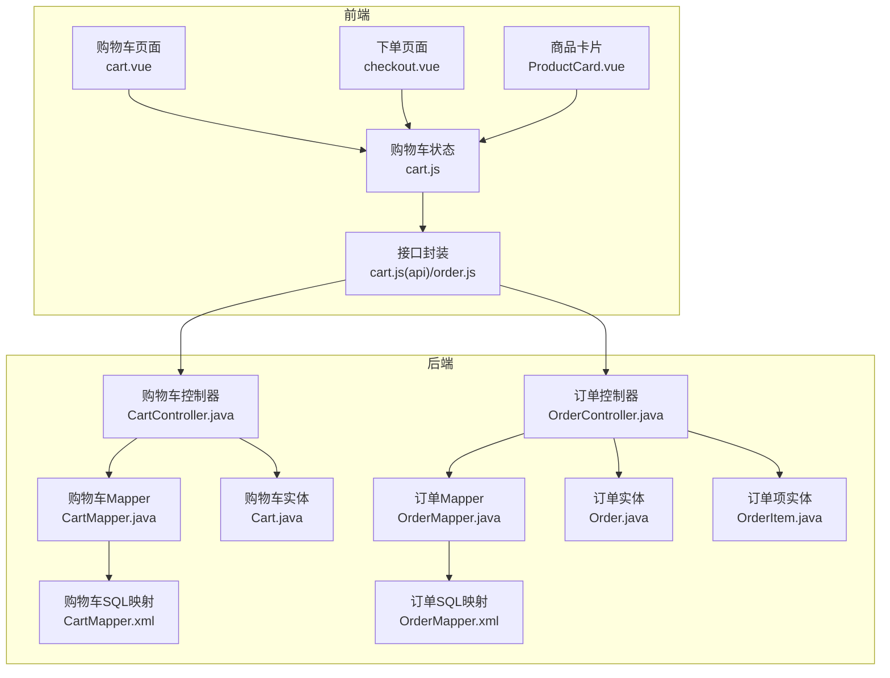
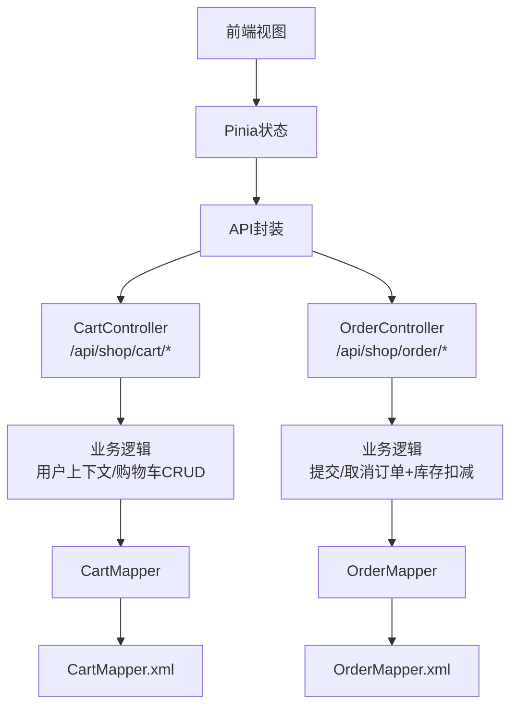
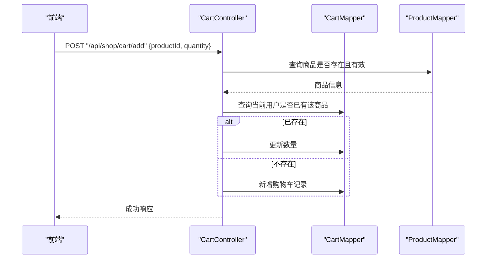
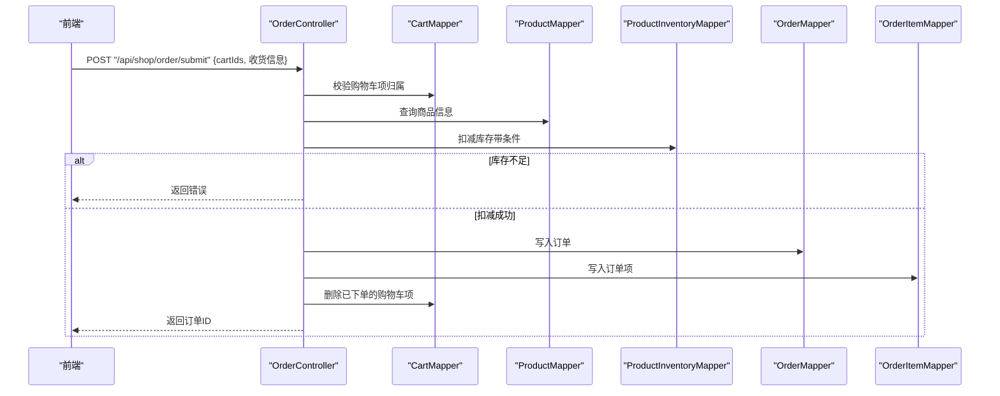
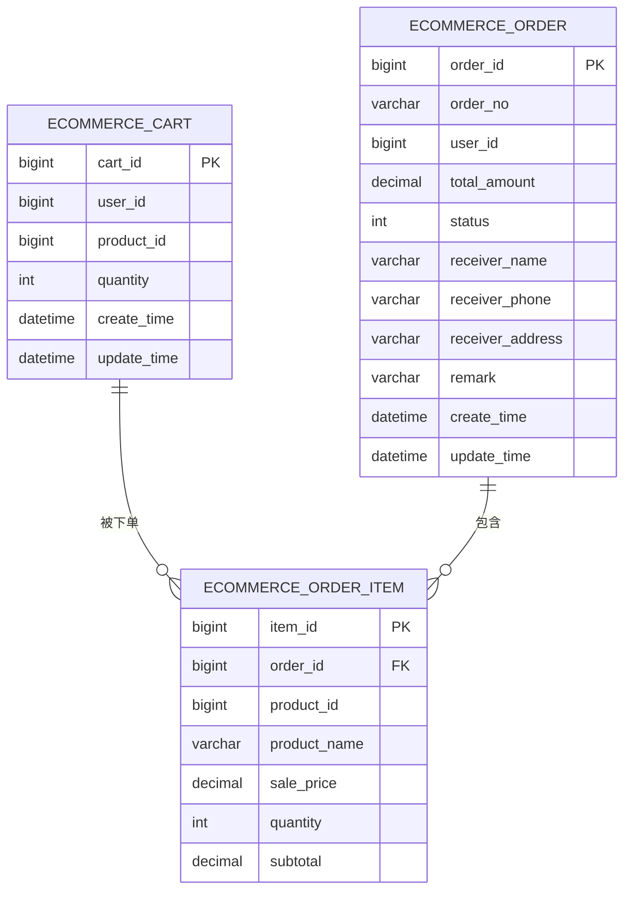
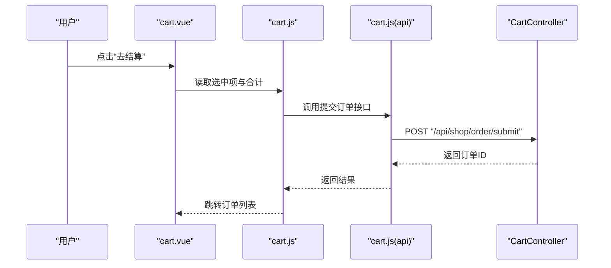
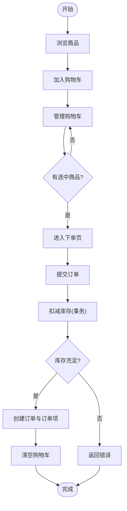
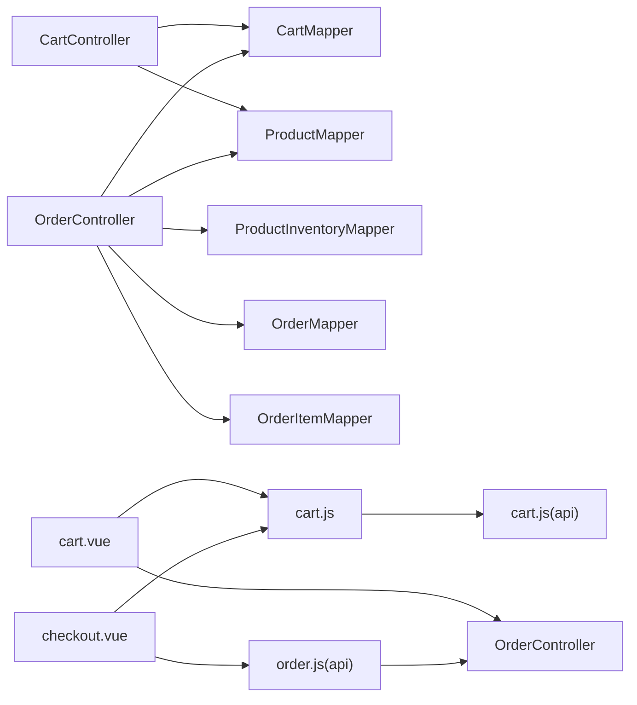

# 电商模块

<cite>
**本文引用的文件**
- [CartController.java](file://task-manager-backend/src/main/java/com/taskmanager/controller/CartController.java)
- [OrderController.java](file://task-manager-backend/src/main/java/com/taskmanager/controller/OrderController.java)
- [Cart.java](file://task-manager-backend/src/main/java/com/taskmanager/domain/Cart.java)
- [Order.java](file://task-manager-backend/src/main/java/com/taskmanager/domain/Order.java)
- [OrderItem.java](file://task-manager-backend/src/main/java/com/taskmanager/domain/OrderItem.java)
- [CartMapper.java](file://task-manager-backend/src/main/java/com/taskmanager/mapper/CartMapper.java)
- [OrderMapper.java](file://task-manager-backend/src/main/java/com/taskmanager/mapper/OrderMapper.java)
- [CartMapper.xml](file://task-manager-backend/src/main/resources/mapper/CartMapper.xml)
- [OrderMapper.xml](file://task-manager-backend/src/main/resources/mapper/OrderMapper.xml)
- [cart.vue](file://ecommerce-frontend/src/views/cart.vue)
- [checkout.vue](file://ecommerce-frontend/src/views/order/checkout.vue)
- [cart.js](file://ecommerce-frontend/src/store/cart.js)
- [cart.js(api)](file://ecommerce-frontend/src/api/cart.js)
- [order.js(api)](file://ecommerce-frontend/src/api/order.js)
- [ProductCard.vue](file://ecommerce-frontend/src/components/ProductCard.vue)
</cite>

## 目录
1. [简介](#简介)
2. [项目结构](#项目结构)
3. [核心组件](#核心组件)
4. [架构总览](#架构总览)
5. [详细组件分析](#详细组件分析)
6. [依赖分析](#依赖分析)
7. [性能考虑](#性能考虑)
8. [故障排查指南](#故障排查指南)
9. [结论](#结论)
10. [附录](#附录)

## 简介
本文件面向电商模块的功能与实现进行系统化说明，覆盖后端控制器（购物车与订单）、数据模型（购物车、订单、订单项）、前端页面与状态管理、以及完整的业务流程与最佳实践。重点包括：
- 购物车管理：添加、修改数量、删除、查询列表
- 订单处理：提交订单、订单列表、订单详情、取消订单
- 数据模型：购物车、订单、订单项的属性与关系
- 前端页面：商品展示、购物车管理、下单流程、订单查询
- 业务流程：浏览商品、加入购物车、提交订单、库存扣减、订单状态流转
- 最佳实践：并发控制、库存扣减、订单状态机、支付安全

## 项目结构
电商模块由后端 Spring Boot 服务与前端 Vue 应用组成，采用前后端分离架构：
- 后端提供 REST 接口，使用 MyBatis-Plus 访问数据库
- 前端通过 Pinia 状态管理与 Element Plus 组件库构建页面交互
- 数据模型对应三张核心表：购物车、订单、订单项

图表来源
- [CartController.java:1-134](file://task-manager-backend/src/main/java/com/taskmanager/controller/CartController.java#L1-L134)
- [OrderController.java:1-303](file://task-manager-backend/src/main/java/com/taskmanager/controller/OrderController.java#L1-L303)
- [CartMapper.java:1-26](file://task-manager-backend/src/main/java/com/taskmanager/mapper/CartMapper.java#L1-L26)
- [OrderMapper.java:1-15](file://task-manager-backend/src/main/java/com/taskmanager/mapper/OrderMapper.java#L1-L15)
- [CartMapper.xml:1-15](file://task-manager-backend/src/main/resources/mapper/CartMapper.xml#L1-L15)
- [OrderMapper.xml:1-5](file://task-manager-backend/src/main/resources/mapper/OrderMapper.xml#L1-L5)
- [Cart.java:1-61](file://task-manager-backend/src/main/java/com/taskmanager/domain/Cart.java#L1-L61)
- [Order.java:1-65](file://task-manager-backend/src/main/java/com/taskmanager/domain/Order.java#L1-L65)
- [OrderItem.java:1-44](file://task-manager-backend/src/main/java/com/taskmanager/domain/OrderItem.java#L1-L44)
- [cart.vue:1-392](file://ecommerce-frontend/src/views/cart.vue#L1-L392)
- [checkout.vue:1-247](file://ecommerce-frontend/src/views/order/checkout.vue#L1-L247)
- [cart.js:1-53](file://ecommerce-frontend/src/store/cart.js#L1-L53)
- [cart.js(api):1-36](file://ecommerce-frontend/src/api/cart.js#L1-L36)
- [order.js(api):1-36](file://ecommerce-frontend/src/api/order.js#L1-L36)
- [ProductCard.vue:1-146](file://ecommerce-frontend/src/components/ProductCard.vue#L1-L146)

章节来源
- [CartController.java:1-134](file://task-manager-backend/src/main/java/com/taskmanager/controller/CartController.java#L1-L134)
- [OrderController.java:1-303](file://task-manager-backend/src/main/java/com/taskmanager/controller/OrderController.java#L1-L303)
- [cart.vue:1-392](file://ecommerce-frontend/src/views/cart.vue#L1-L392)
- [checkout.vue:1-247](file://ecommerce-frontend/src/views/order/checkout.vue#L1-L247)

## 核心组件
- 购物车控制器：提供获取列表、添加、修改数量、删除等接口，基于当前登录用户上下文操作
- 订单控制器：提供提交订单、订单列表、订单详情、取消订单等接口，包含事务性库存扣减与状态流转
- 数据模型：
  - 购物车：用户ID、商品ID、数量、扩展字段（商品名、预览图、售价、单位）
  - 订单：订单号、用户ID、总金额、状态、收货信息、备注、时间戳、订单明细集合
  - 订单项：订单ID、商品ID、商品名、单价、数量、小计
- 前端页面与状态：
  - 购物车页面：展示列表、选择、数量变更、批量删除、去结算
  - 下单页面：校验收货信息、展示选中商品与合计、提交订单
  - 购物车状态：Pinia 管理列表、选中项、合计金额

章节来源
- [CartController.java:36-123](file://task-manager-backend/src/main/java/com/taskmanager/controller/CartController.java#L36-L123)
- [OrderController.java:59-153](file://task-manager-backend/src/main/java/com/taskmanager/controller/OrderController.java#L59-L153)
- [Cart.java:24-60](file://task-manager-backend/src/main/java/com/taskmanager/domain/Cart.java#L24-L60)
- [Order.java:25-63](file://task-manager-backend/src/main/java/com/taskmanager/domain/Order.java#L25-L63)
- [OrderItem.java:22-42](file://task-manager-backend/src/main/java/com/taskmanager/domain/OrderItem.java#L22-L42)
- [cart.vue:10-189](file://ecommerce-frontend/src/views/cart.vue#L10-L189)
- [checkout.vue:14-170](file://ecommerce-frontend/src/views/order/checkout.vue#L14-L170)
- [cart.js:9-51](file://ecommerce-frontend/src/store/cart.js#L9-L51)

## 架构总览
后端采用 MVC 分层：
- 控制器层：CartController、OrderController
- 数据访问层：CartMapper、OrderMapper（XML 映射）
- 领域模型：Cart、Order、OrderItem
- 安全上下文：通过 SecurityContextHolder 获取当前用户ID

前端采用组合式 API + Pinia：
- 视图组件：cart.vue、checkout.vue、ProductCard.vue
- 状态管理：cart.js
- 接口封装：cart.js(api)、order.js(api)

图表来源
- [CartController.java:24-132](file://task-manager-backend/src/main/java/com/taskmanager/controller/CartController.java#L24-L132)
- [OrderController.java:38-250](file://task-manager-backend/src/main/java/com/taskmanager/controller/OrderController.java#L38-L250)
- [CartMapper.java:15-25](file://task-manager-backend/src/main/java/com/taskmanager/mapper/CartMapper.java#L15-L25)
- [OrderMapper.java:12-14](file://task-manager-backend/src/main/java/com/taskmanager/mapper/OrderMapper.java#L12-L14)
- [CartMapper.xml:5-12](file://task-manager-backend/src/main/resources/mapper/CartMapper.xml#L5-L12)
- [OrderMapper.xml:3-4](file://task-manager-backend/src/main/resources/mapper/OrderMapper.xml#L3-L4)
- [cart.vue:121-189](file://ecommerce-frontend/src/views/cart.vue#L121-L189)
- [checkout.vue:89-170](file://ecommerce-frontend/src/views/order/checkout.vue#L89-L170)
- [cart.js:18-51](file://ecommerce-frontend/src/store/cart.js#L18-L51)
- [cart.js(api):4-35](file://ecommerce-frontend/src/api/cart.js#L4-L35)
- [order.js(api):4-35](file://ecommerce-frontend/src/api/order.js#L4-L35)

## 详细组件分析

### 购物车控制器 CartController
- 接口职责
  - 获取列表：按用户ID查询购物车，返回含商品信息的列表
  - 添加商品：若同商品已存在则累加数量，否则新增
  - 修改数量：数量<=0时删除该项，否则更新数量
  - 删除多项：支持以逗号分隔的ID批量删除，仅删除当前用户项
- 关键点
  - 使用 SecurityContextHolder 获取当前用户ID
  - 添加时校验商品存在且状态有效
  - 列表查询通过 CartMapper 的 SQL 映射联表查询商品信息

图表来源
- [CartController.java:47-77](file://task-manager-backend/src/main/java/com/taskmanager/controller/CartController.java#L47-L77)
- [CartMapper.java:18-24](file://task-manager-backend/src/main/java/com/taskmanager/mapper/CartMapper.java#L18-L24)
- [CartMapper.xml:5-12](file://task-manager-backend/src/main/resources/mapper/CartMapper.xml#L5-L12)

章节来源
- [CartController.java:36-123](file://task-manager-backend/src/main/java/com/taskmanager/controller/CartController.java#L36-L123)
- [CartMapper.java:18-24](file://task-manager-backend/src/main/java/com/taskmanager/mapper/CartMapper.java#L18-L24)
- [CartMapper.xml:5-12](file://task-manager-backend/src/main/resources/mapper/CartMapper.xml#L5-L12)

### 订单控制器 OrderController
- 接口职责
  - 提交订单：校验购物车项归属、生成订单号、构建订单明细、扣减库存、写入订单与订单项、清空购物车
  - 订单列表：按用户ID分页查询
  - 订单详情：返回订单及明细
  - 取消订单：仅待付款可取消，恢复库存
- 关键点
  - 事务性：提交与取消均使用事务保证一致性
  - 并发安全：库存扣减使用带条件的更新，避免超卖
  - 订单状态：0待付款、1已付款、2已发货、3已完成、4已取消

图表来源
- [OrderController.java:59-153](file://task-manager-backend/src/main/java/com/taskmanager/controller/OrderController.java#L59-L153)
- [OrderController.java:192-232](file://task-manager-backend/src/main/java/com/taskmanager/controller/OrderController.java#L192-L232)
- [CartMapper.java:18-24](file://task-manager-backend/src/main/java/com/taskmanager/mapper/CartMapper.java#L18-L24)
- [ProductMapper.java](file://task-manager-backend/src/main/java/com/taskmanager/mapper/ProductMapper.java)
- [ProductInventoryMapper.java](file://task-manager-backend/src/main/java/com/taskmanager/mapper/ProductInventoryMapper.java)
- [OrderMapper.java:12-14](file://task-manager-backend/src/main/java/com/taskmanager/mapper/OrderMapper.java#L12-L14)
- [OrderItemMapper.java](file://task-manager-backend/src/main/java/com/taskmanager/mapper/OrderItemMapper.java)

章节来源
- [OrderController.java:59-232](file://task-manager-backend/src/main/java/com/taskmanager/controller/OrderController.java#L59-L232)

### 数据模型设计
- 购物车 Cart
  - 主键：cartId
  - 关联：userId、productId
  - 业务：quantity、createTime、updateTime
  - 扩展：productName、previewImage、salePrice、unit（用于返回前端）
- 订单 Order
  - 主键：orderId
  - 标识：orderNo、userId
  - 金额：totalAmount
  - 状态：status（0待付款至4已取消）
  - 收货：receiverName、receiverPhone、receiverAddress
  - 时间：createTime、updateTime
  - 明细：orderItems（非持久化字段）
- 订单项 OrderItem
  - 主键：itemId
  - 关联：orderId、productId
  - 业务：productName、salePrice、quantity、subtotal

图表来源
- [Cart.java:24-60](file://task-manager-backend/src/main/java/com/taskmanager/domain/Cart.java#L24-L60)
- [Order.java:25-63](file://task-manager-backend/src/main/java/com/taskmanager/domain/Order.java#L25-L63)
- [OrderItem.java:22-42](file://task-manager-backend/src/main/java/com/taskmanager/domain/OrderItem.java#L22-L42)

章节来源
- [Cart.java:1-61](file://task-manager-backend/src/main/java/com/taskmanager/domain/Cart.java#L1-L61)
- [Order.java:1-65](file://task-manager-backend/src/main/java/com/taskmanager/domain/Order.java#L1-L65)
- [OrderItem.java:1-44](file://task-manager-backend/src/main/java/com/taskmanager/domain/OrderItem.java#L1-L44)

### 前端电商页面实现
- 购物车页面 cart.vue
  - 展示列表、勾选、数量输入、删除、全选、合计、去结算
  - 通过 Pinia 状态管理与 API 封装完成 CRUD
- 下单页面 checkout.vue
  - 校验选中商品、展示订单商品与合计、填写收货信息、提交订单
  - 提交成功后重置选中、刷新购物车并跳转订单列表
- 商品卡片 ProductCard.vue
  - 展示商品信息与价格，点击进入详情，加入购物车需登录
- 状态与接口
  - 购物车状态 cart.js：fetchCart、addItem、updateItem、removeItems、toggleSelect、toggleSelectAll
  - 接口封装 cart.js(api)、order.js(api)：统一调用后端 REST

图表来源
- [cart.vue:174-180](file://ecommerce-frontend/src/views/cart.vue#L174-L180)
- [checkout.vue:138-164](file://ecommerce-frontend/src/views/order/checkout.vue#L138-L164)
- [cart.js:18-51](file://ecommerce-frontend/src/store/cart.js#L18-L51)
- [cart.js(api):11-18](file://ecommerce-frontend/src/api/cart.js#L11-L18)
- [order.js(api):4-10](file://ecommerce-frontend/src/api/order.js#L4-L10)
- [OrderController.java:59-153](file://task-manager-backend/src/main/java/com/taskmanager/controller/OrderController.java#L59-L153)

章节来源
- [cart.vue:1-392](file://ecommerce-frontend/src/views/cart.vue#L1-L392)
- [checkout.vue:1-247](file://ecommerce-frontend/src/views/order/checkout.vue#L1-L247)
- [cart.js:1-53](file://ecommerce-frontend/src/store/cart.js#L1-L53)
- [cart.js(api):1-36](file://ecommerce-frontend/src/api/cart.js#L1-L36)
- [order.js(api):1-36](file://ecommerce-frontend/src/api/order.js#L1-L36)

### 业务流程详解
- 商品浏览与加入购物车
  - 浏览商品卡片，点击“加入购物车”触发状态更新
  - 登录态校验，未登录引导登录
- 购物车管理
  - 修改数量、勾选、批量删除、全选
- 提交订单
  - 校验购物车项归属与有效性
  - 生成订单号、构建订单明细、扣减库存、写入订单与订单项、清理购物车
- 订单状态管理
  - 待付款（0）：可取消
  - 已付款（1）：后续流程（发货、完成）
  - 已取消（4）：恢复库存
- 发货与完成
  - 当前代码未实现发货与完成状态流转，可在后续扩展中增加相应接口与状态转换

图表来源
- [OrderController.java:59-153](file://task-manager-backend/src/main/java/com/taskmanager/controller/OrderController.java#L59-L153)
- [OrderController.java:192-232](file://task-manager-backend/src/main/java/com/taskmanager/controller/OrderController.java#L192-L232)
- [cart.vue:174-180](file://ecommerce-frontend/src/views/cart.vue#L174-L180)
- [checkout.vue:138-164](file://ecommerce-frontend/src/views/order/checkout.vue#L138-L164)

章节来源
- [OrderController.java:59-232](file://task-manager-backend/src/main/java/com/taskmanager/controller/OrderController.java#L59-L232)
- [cart.vue:174-180](file://ecommerce-frontend/src/views/cart.vue#L174-L180)
- [checkout.vue:138-164](file://ecommerce-frontend/src/views/order/checkout.vue#L138-L164)

## 依赖分析
- 控制器与 Mapper
  - CartController 依赖 CartMapper、ProductMapper
  - OrderController 依赖 CartMapper、ProductMapper、ProductInventoryMapper、OrderMapper、OrderItemMapper
- Mapper 与 XML
  - CartMapper 通过 CartMapper.xml 实现联表查询
  - OrderMapper 无自定义 SQL，沿用通用基类能力
- 前端依赖
  - cart.vue 依赖 cart.js 状态与 cart.js(api) 接口
  - checkout.vue 依赖 cart.js 状态与 order.js(api) 接口

图表来源
- [CartController.java:27-31](file://task-manager-backend/src/main/java/com/taskmanager/controller/CartController.java#L27-L31)
- [OrderController.java:41-54](file://task-manager-backend/src/main/java/com/taskmanager/controller/OrderController.java#L41-L54)
- [CartMapper.java:15-25](file://task-manager-backend/src/main/java/com/taskmanager/mapper/CartMapper.java#L15-L25)
- [OrderMapper.java:12-14](file://task-manager-backend/src/main/java/com/taskmanager/mapper/OrderMapper.java#L12-L14)
- [cart.vue:126-129](file://ecommerce-frontend/src/views/cart.vue#L126-L129)
- [checkout.vue:94-97](file://ecommerce-frontend/src/views/order/checkout.vue#L94-L97)
- [cart.js:1-53](file://ecommerce-frontend/src/store/cart.js#L1-L53)
- [cart.js(api):1-36](file://ecommerce-frontend/src/api/cart.js#L1-L36)
- [order.js(api):1-36](file://ecommerce-frontend/src/api/order.js#L1-L36)

章节来源
- [CartController.java:27-31](file://task-manager-backend/src/main/java/com/taskmanager/controller/CartController.java#L27-L31)
- [OrderController.java:41-54](file://task-manager-backend/src/main/java/com/taskmanager/controller/OrderController.java#L41-L54)
- [CartMapper.java:15-25](file://task-manager-backend/src/main/java/com/taskmanager/mapper/CartMapper.java#L15-L25)
- [OrderMapper.java:12-14](file://task-manager-backend/src/main/java/com/taskmanager/mapper/OrderMapper.java#L12-L14)
- [cart.vue:126-129](file://ecommerce-frontend/src/views/cart.vue#L126-L129)
- [checkout.vue:94-97](file://ecommerce-frontend/src/views/order/checkout.vue#L94-L97)
- [cart.js:1-53](file://ecommerce-frontend/src/store/cart.js#L1-L53)
- [cart.js(api):1-36](file://ecommerce-frontend/src/api/cart.js#L1-L36)
- [order.js(api):1-36](file://ecommerce-frontend/src/api/order.js#L1-L36)

## 性能考虑
- 数据访问
  - 购物车列表使用联表查询一次性返回商品信息，减少往返
  - 订单提交时对库存使用带条件的原子更新，避免超卖
- 前端渲染
  - 使用虚拟滚动与懒加载优化大列表渲染（建议）
  - 对价格格式化与合计计算进行防抖与缓存（建议）
- 并发与一致性
  - 订单提交与取消使用事务，确保库存与订单状态一致
  - 库存扣减使用精确条件更新，避免竞态

## 故障排查指南
- 常见错误与定位
  - 购物车添加：商品不存在或已下架、数量非法
  - 购物车修改/删除：无权操作或项不存在
  - 提交订单：购物车为空、购物车项不属于当前用户、库存不足
  - 取消订单：状态非待付款
- 建议排查步骤
  - 检查用户登录态与当前用户ID
  - 核对购物车项归属与商品状态
  - 查看库存扣减日志与事务回滚原因
  - 前端确认接口返回码与错误消息

章节来源
- [CartController.java:53-57](file://task-manager-backend/src/main/java/com/taskmanager/controller/CartController.java#L53-L57)
- [CartController.java:88-92](file://task-manager-backend/src/main/java/com/taskmanager/controller/CartController.java#L88-L92)
- [OrderController.java:64-68](file://task-manager-backend/src/main/java/com/taskmanager/controller/OrderController.java#L64-L68)
- [OrderController.java:75-79](file://task-manager-backend/src/main/java/com/taskmanager/controller/OrderController.java#L75-L79)
- [OrderController.java:115-127](file://task-manager-backend/src/main/java/com/taskmanager/controller/OrderController.java#L115-L127)
- [OrderController.java:196-203](file://task-manager-backend/src/main/java/com/taskmanager/controller/OrderController.java#L196-L203)

## 结论
电商模块实现了从购物车到订单的核心闭环，具备良好的分层与可扩展性。建议后续完善发货与完成状态、引入支付回调与安全校验、增强库存与事务的健壮性，并在前端进一步优化大列表与交互体验。

## 附录

### 接口文档（后端）
- 购物车
  - GET /api/shop/cart/list → 返回当前用户购物车列表（含商品信息）
  - POST /api/shop/cart/add → 添加商品到购物车（若已存在则累加数量）
  - PUT /api/shop/cart/update → 修改购物车数量（<=0删除）
  - DELETE /api/shop/cart/{cartIds} → 批量删除购物车项（仅删除当前用户项）
- 订单
  - POST /api/shop/order/submit → 提交订单（传入cartIds与收货信息）
  - GET /api/shop/order/list?pageNum=&pageSize= → 当前用户订单列表
  - GET /api/shop/order/{orderId} → 订单详情
  - PUT /api/shop/order/cancel/{orderId} → 取消订单（仅待付款）

章节来源
- [CartController.java:36-123](file://task-manager-backend/src/main/java/com/taskmanager/controller/CartController.java#L36-L123)
- [OrderController.java:59-187](file://task-manager-backend/src/main/java/com/taskmanager/controller/OrderController.java#L59-L187)
- [OrderController.java:192-232](file://task-manager-backend/src/main/java/com/taskmanager/controller/OrderController.java#L192-L232)

### 前端接口封装（参考路径）
- 购物车接口
  - 列表：GET /api/shop/cart/list
  - 添加：POST /api/shop/cart/add
  - 更新：PUT /api/shop/cart/update
  - 删除：DELETE /api/shop/cart/{cartIds}
- 订单接口
  - 提交：POST /api/shop/order/submit
  - 列表：GET /api/shop/order/list
  - 详情：GET /api/shop/order/{orderId}
  - 取消：PUT /api/shop/order/cancel/{orderId}

章节来源
- [cart.js(api):4-35](file://ecommerce-frontend/src/api/cart.js#L4-L35)
- [order.js(api):4-35](file://ecommerce-frontend/src/api/order.js#L4-L35)