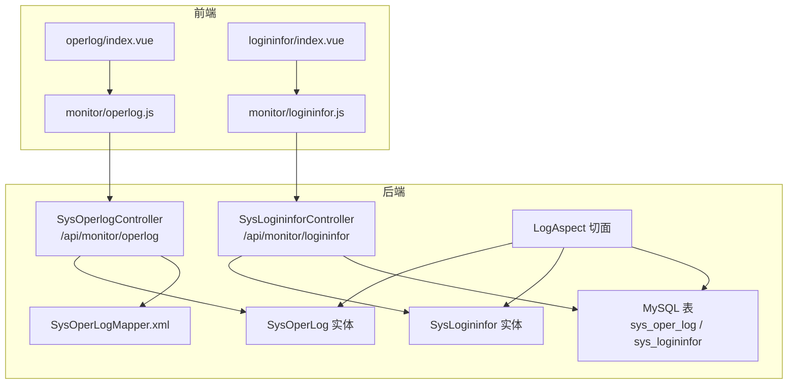
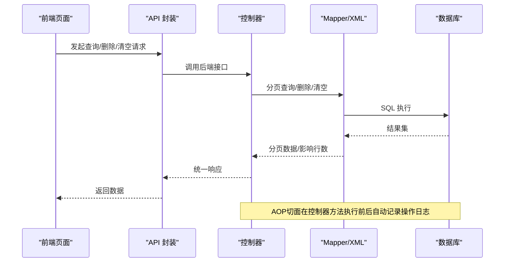
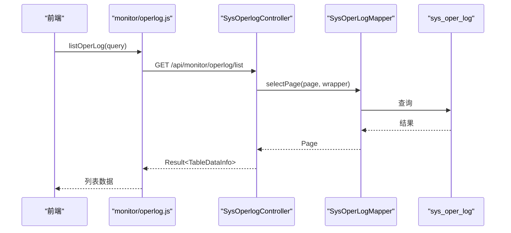
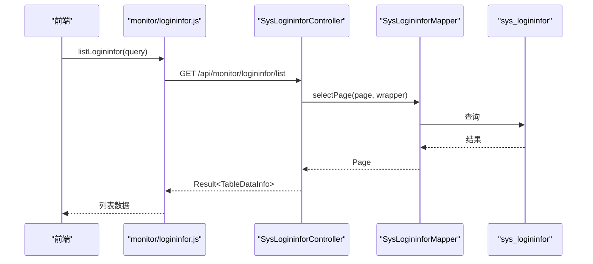
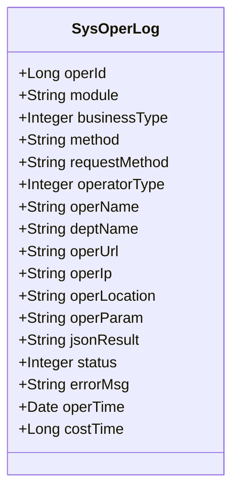
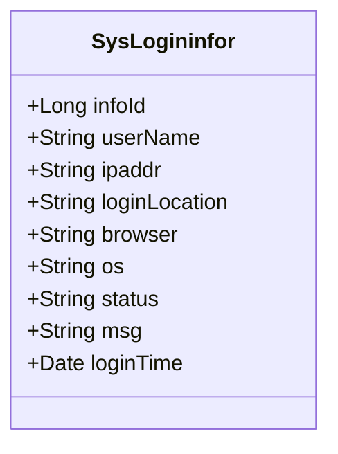
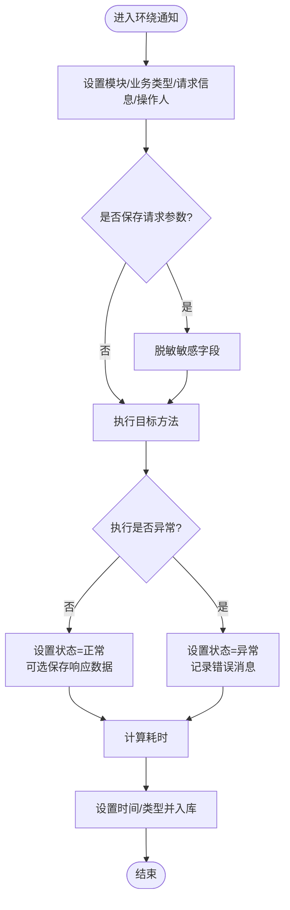
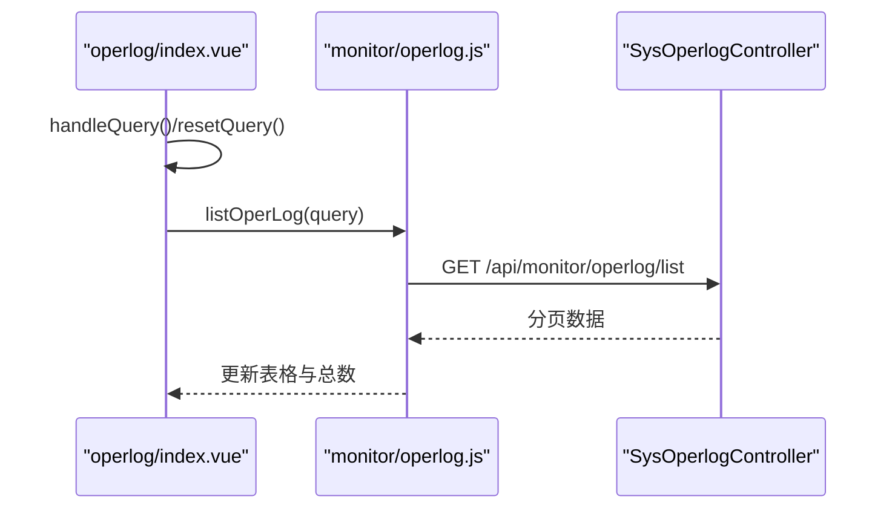
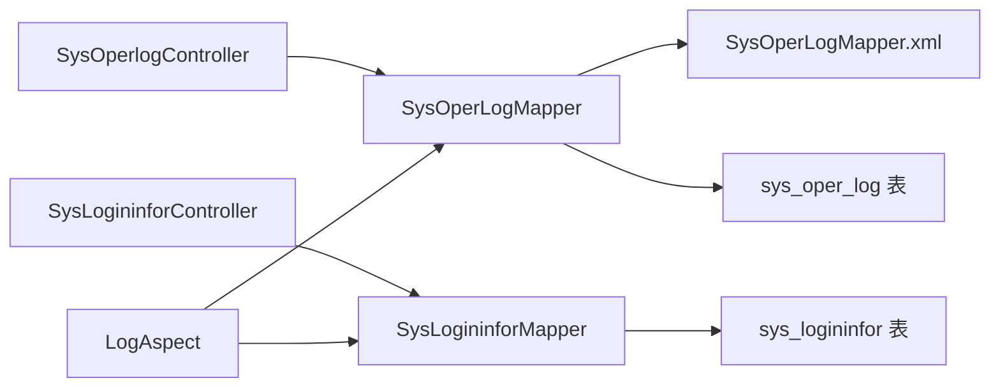

# 系统监控

<cite>
**本文引用的文件**
- [SysOperlogController.java](file://task-manager-backend/src/main/java/com/taskmanager/controller/SysOperlogController.java)
- [SysLogininforController.java](file://task-manager-backend/src/main/java/com/taskmanager/controller/SysLogininforController.java)
- [SysOperLog.java](file://task-manager-backend/src/main/java/com/taskmanager/domain/SysOperLog.java)
- [SysLogininfor.java](file://task-manager-backend/src/main/java/com/taskmanager/domain/SysLogininfor.java)
- [LogAspect.java](file://task-manager-backend/src/main/java/com/taskmanager/aspect/LogAspect.java)
- [Log.java](file://task-manager-backend/src/main/java/com/taskmanager/common/annotation/Log.java)
- [BusinessTypeEnum.java](file://task-manager-backend/src/main/java/com/taskmanager/common/enums/BusinessTypeEnum.java)
- [SysOperLogMapper.xml](file://task-manager-backend/src/main/resources/mapper/SysOperLogMapper.xml)
- [schema.sql](file://task-manager-backend/src/main/resources/schema.sql)
- [operlog.js](file://task-manager-frontend/src/api/monitor/operlog.js)
- [logininfor.js](file://task-manager-frontend/src/api/monitor/logininfor.js)
- [operlog/index.vue](file://task-manager-frontend/src/views/monitor/operlog/index.vue)
- [logininfor/index.vue](file://task-manager-frontend/src/views/monitor/logininfor/index.vue)
</cite>

## 目录
1. [引言](#引言)
2. [项目结构](#项目结构)
3. [核心组件](#核心组件)
4. [架构总览](#架构总览)
5. [详细组件分析](#详细组件分析)
6. [依赖分析](#依赖分析)
7. [性能考量](#性能考量)
8. [故障排查指南](#故障排查指南)
9. [结论](#结论)
10. [附录：监控接口文档与最佳实践](#附录监控接口文档与最佳实践)

## 引言
本文件面向系统监控模块，围绕操作日志与登录日志两大主题，系统化阐述后端控制器、实体模型、AOP切面、前端页面与接口的实现与交互。重点覆盖：
- 控制器职责：日志CRUD、分页查询、批量删除、清空日志
- 数据模型：操作日志与登录日志的字段设计与业务语义
- 前端页面：日志列表、筛选、分页、详情占位与后续接入
- AOP实现：基于注解的自动记录、请求/响应数据处理、异常状态与性能指标
- 最佳实践：日志策略、存储优化、查询性能、安全与合规

## 项目结构
系统监控相关代码分布在后端与前端两个子工程中：
- 后端（Spring Boot）：控制器、领域模型、AOP切面、MyBatis映射、数据库初始化脚本
- 前端（Vue 3 + Element Plus）：监控页面、API封装、路由与权限集成

图表来源
- [SysOperlogController.java:1-80](file://task-manager-backend/src/main/java/com/taskmanager/controller/SysOperlogController.java#L1-L80)
- [SysLogininforController.java:1-87](file://task-manager-backend/src/main/java/com/taskmanager/controller/SysLogininforController.java#L1-L87)
- [SysOperLog.java:1-74](file://task-manager-backend/src/main/java/com/taskmanager/domain/SysOperLog.java#L1-L74)
- [SysLogininfor.java:1-50](file://task-manager-backend/src/main/java/com/taskmanager/domain/SysLogininfor.java#L1-L50)
- [LogAspect.java:1-137](file://task-manager-backend/src/main/java/com/taskmanager/aspect/LogAspect.java#L1-L137)
- [SysOperLogMapper.xml:1-27](file://task-manager-backend/src/main/resources/mapper/SysOperLogMapper.xml#L1-L27)
- [operlog/index.vue:1-124](file://task-manager-frontend/src/views/monitor/operlog/index.vue#L1-L124)
- [logininfor/index.vue:1-98](file://task-manager-frontend/src/views/monitor/logininfor/index.vue#L1-L98)
- [operlog.js:1-18](file://task-manager-frontend/src/api/monitor/operlog.js#L1-L18)
- [logininfor.js:1-18](file://task-manager-frontend/src/api/monitor/logininfor.js#L1-L18)

章节来源
- [SysOperlogController.java:1-80](file://task-manager-backend/src/main/java/com/taskmanager/controller/SysOperlogController.java#L1-L80)
- [SysLogininforController.java:1-87](file://task-manager-backend/src/main/java/com/taskmanager/controller/SysLogininforController.java#L1-L87)
- [SysOperLog.java:1-74](file://task-manager-backend/src/main/java/com/taskmanager/domain/SysOperLog.java#L1-L74)
- [SysLogininfor.java:1-50](file://task-manager-backend/src/main/java/com/taskmanager/domain/SysLogininfor.java#L1-L50)
- [LogAspect.java:1-137](file://task-manager-backend/src/main/java/com/taskmanager/aspect/LogAspect.java#L1-L137)
- [SysOperLogMapper.xml:1-27](file://task-manager-backend/src/main/resources/mapper/SysOperLogMapper.xml#L1-L27)
- [operlog/index.vue:1-124](file://task-manager-frontend/src/views/monitor/operlog/index.vue#L1-L124)
- [logininfor/index.vue:1-98](file://task-manager-frontend/src/views/monitor/logininfor/index.vue#L1-L98)
- [operlog.js:1-18](file://task-manager-frontend/src/api/monitor/operlog.js#L1-L18)
- [logininfor.js:1-18](file://task-manager-frontend/src/api/monitor/logininfor.js#L1-L18)

## 核心组件
- 控制器层
  - 操作日志控制器：提供分页查询、详情获取、批量删除、清空接口
  - 登录日志控制器：提供分页查询、详情获取、批量删除、清空、账号解锁预留接口
- 领域模型
  - 操作日志实体：记录模块、业务类型、请求方式、操作人、IP、地点、请求/响应参数、状态、错误、时间、耗时等
  - 登录日志实体：记录账号、IP、地点、浏览器、系统、状态、消息、时间等
- AOP切面
  - 基于注解自动记录操作日志，处理请求参数脱敏、响应数据可选保存、异常状态与耗时统计、最终入库
- 前端页面
  - 操作日志与登录日志页面具备基础搜索、分页与表格展示，API调用占位，便于后续对接

章节来源
- [SysOperlogController.java:25-78](file://task-manager-backend/src/main/java/com/taskmanager/controller/SysOperlogController.java#L25-L78)
- [SysLogininforController.java:24-75](file://task-manager-backend/src/main/java/com/taskmanager/controller/SysLogininforController.java#L24-L75)
- [SysOperLog.java:22-72](file://task-manager-backend/src/main/java/com/taskmanager/domain/SysOperLog.java#L22-L72)
- [SysLogininfor.java:22-48](file://task-manager-backend/src/main/java/com/taskmanager/domain/SysLogininfor.java#L22-L48)
- [LogAspect.java:44-97](file://task-manager-backend/src/main/java/com/taskmanager/aspect/LogAspect.java#L44-L97)
- [operlog/index.vue:8-66](file://task-manager-frontend/src/views/monitor/operlog/index.vue#L8-L66)
- [logininfor/index.vue:7-52](file://task-manager-frontend/src/views/monitor/logininfor/index.vue#L7-L52)

## 架构总览
系统监控采用“前端页面 -> API封装 -> 控制器 -> 服务/持久层 -> 数据库”的标准分层架构。AOP切面在控制器方法执行前后进行横切增强，自动采集日志并落库。

图表来源
- [operlog.js:1-18](file://task-manager-frontend/src/api/monitor/operlog.js#L1-L18)
- [logininfor.js:1-18](file://task-manager-frontend/src/api/monitor/logininfor.js#L1-L18)
- [SysOperlogController.java:28-78](file://task-manager-backend/src/main/java/com/taskmanager/controller/SysOperlogController.java#L28-L78)
- [SysLogininforController.java:27-75](file://task-manager-backend/src/main/java/com/taskmanager/controller/SysLogininforController.java#L27-L75)
- [SysOperLogMapper.xml:1-27](file://task-manager-backend/src/main/resources/mapper/SysOperLogMapper.xml#L1-L27)
- [schema.sql:174-217](file://task-manager-backend/src/main/resources/schema.sql#L174-L217)

## 详细组件分析

### 控制器：SysOperlogController
- 功能清单
  - 分页查询：支持按模块、业务类型、操作人、状态筛选，按操作时间倒序
  - 详情获取：按日志ID获取
  - 批量删除：接收ID数组逐条删除
  - 清空日志：删除全部记录
- 权限控制：使用表达式注解校验菜单权限
- 返回格式：统一结果包装与分页封装

图表来源
- [SysOperlogController.java:28-45](file://task-manager-backend/src/main/java/com/taskmanager/controller/SysOperlogController.java#L28-L45)
- [operlog.js:3-5](file://task-manager-frontend/src/api/monitor/operlog.js#L3-L5)

章节来源
- [SysOperlogController.java:25-78](file://task-manager-backend/src/main/java/com/taskmanager/controller/SysOperlogController.java#L25-L78)

### 控制器：SysLogininforController
- 功能清单
  - 分页查询：支持按账号、IP、状态筛选，按登录时间倒序
  - 详情获取：按登录日志ID获取
  - 批量删除：接收ID数组逐条删除
  - 清空日志：删除全部记录
  - 账号解锁：预留接口（可扩展Redis失败次数重置）
- 权限控制：使用表达式注解校验菜单权限

图表来源
- [SysLogininforController.java:27-42](file://task-manager-backend/src/main/java/com/taskmanager/controller/SysLogininforController.java#L27-L42)
- [logininfor.js:3-5](file://task-manager-frontend/src/api/monitor/logininfor.js#L3-L5)

章节来源
- [SysLogininforController.java:24-75](file://task-manager-backend/src/main/java/com/taskmanager/controller/SysLogininforController.java#L24-L75)

### 实体模型：SysOperLog（操作日志）
- 关键字段
  - 日志主键、模块、业务类型、方法名、请求方式、操作人、部门、URL、IP、地点、请求参数、响应结果、状态、错误消息、操作时间、耗时
- 设计要点
  - 业务类型通过枚举映射
  - 请求/响应参数以长文本存储，便于审计与复现
  - 状态区分正常/异常，异常时保留错误消息
  - 耗时毫秒级记录，便于性能分析

图表来源
- [SysOperLog.java:16-73](file://task-manager-backend/src/main/java/com/taskmanager/domain/SysOperLog.java#L16-L73)

章节来源
- [SysOperLog.java:22-72](file://task-manager-backend/src/main/java/com/taskmanager/domain/SysOperLog.java#L22-L72)

### 实体模型：SysLogininfor（登录日志）
- 关键字段
  - 访问ID、账号、IP、地点、浏览器、系统、状态、消息、登录时间
- 设计要点
  - 登录状态区分成功/失败
  - 时间字段用于排序与统计
  - 可扩展用于登录风控与反爬策略

图表来源
- [SysLogininfor.java:16-49](file://task-manager-backend/src/main/java/com/taskmanager/domain/SysLogininfor.java#L16-L49)

章节来源
- [SysLogininfor.java:22-48](file://task-manager-backend/src/main/java/com/taskmanager/domain/SysLogininfor.java#L22-L48)

### AOP实现：LogAspect（操作日志切面）
- 切点与流程
  - 使用环绕通知拦截带@Log注解的方法
  - 在方法前设置模块、业务类型、请求信息、操作人、请求参数（含敏感字段脱敏）
  - 执行目标方法，计算耗时，设置状态与响应数据（可选）
  - 异常时记录异常消息，最终统一入库
- 性能与安全
  - 脱敏处理避免敏感信息入库
  - 响应数据可选保存，降低存储压力
  - 入库异常记录日志但不影响主流程

图表来源
- [LogAspect.java:44-97](file://task-manager-backend/src/main/java/com/taskmanager/aspect/LogAspect.java#L44-L97)
- [Log.java:16-37](file://task-manager-backend/src/main/java/com/taskmanager/common/annotation/Log.java#L16-L37)
- [BusinessTypeEnum.java:8-38](file://task-manager-backend/src/main/java/com/taskmanager/common/enums/BusinessTypeEnum.java#L8-L38)

章节来源
- [LogAspect.java:41-97](file://task-manager-backend/src/main/java/com/taskmanager/aspect/LogAspect.java#L41-L97)
- [Log.java:16-37](file://task-manager-backend/src/main/java/com/taskmanager/common/annotation/Log.java#L16-L37)
- [BusinessTypeEnum.java:8-38](file://task-manager-backend/src/main/java/com/taskmanager/common/enums/BusinessTypeEnum.java#L8-L38)

### 前端监控页面
- 操作日志页面
  - 支持模块、操作人员、业务类型、状态筛选
  - 展示日志编号、模块、类型、操作人、IP、状态、时间等列
  - 分页控件与占位查询逻辑，API调用待接入
- 登录日志页面
  - 支持账号、状态筛选
  - 展示日志编号、账号、IP、地点、浏览器、系统、状态、消息、时间等列
  - 分页控件与占位查询逻辑，API调用待接入
- API封装
  - 操作日志：列表、详情、批量删除、清空
  - 登录日志：列表、批量删除、清空、解锁预留

图表来源
- [operlog/index.vue:84-94](file://task-manager-frontend/src/views/monitor/operlog/index.vue#L84-L94)
- [operlog.js:3-5](file://task-manager-frontend/src/api/monitor/operlog.js#L3-L5)
- [SysOperlogController.java:28-45](file://task-manager-backend/src/main/java/com/taskmanager/controller/SysOperlogController.java#L28-L45)

章节来源
- [operlog/index.vue:7-66](file://task-manager-frontend/src/views/monitor/operlog/index.vue#L7-L66)
- [logininfor/index.vue:7-52](file://task-manager-frontend/src/views/monitor/logininfor/index.vue#L7-L52)
- [operlog.js:1-18](file://task-manager-frontend/src/api/monitor/operlog.js#L1-L18)
- [logininfor.js:1-18](file://task-manager-frontend/src/api/monitor/logininfor.js#L1-L18)

## 依赖分析
- 控制器依赖
  - 操作日志控制器依赖操作日志Mapper
  - 登录日志控制器依赖登录日志Mapper
- 切面依赖
  - 切面依赖Mapper与ObjectMapper，负责入库与序列化
- 映射与表结构
  - 操作日志Mapper定义字段映射
  - schema.sql定义sys_oper_log与sys_logininfor表结构与索引

图表来源
- [SysOperlogController.java:22-23](file://task-manager-backend/src/main/java/com/taskmanager/controller/SysOperlogController.java#L22-L23)
- [SysLogininforController.java:21-22](file://task-manager-backend/src/main/java/com/taskmanager/controller/SysLogininforController.java#L21-L22)
- [LogAspect.java:33-39](file://task-manager-backend/src/main/java/com/taskmanager/aspect/LogAspect.java#L33-L39)
- [SysOperLogMapper.xml:4-24](file://task-manager-backend/src/main/resources/mapper/SysOperLogMapper.xml#L4-L24)
- [schema.sql:174-217](file://task-manager-backend/src/main/resources/schema.sql#L174-L217)

章节来源
- [SysOperlogController.java:22-23](file://task-manager-backend/src/main/java/com/taskmanager/controller/SysOperlogController.java#L22-L23)
- [SysLogininforController.java:21-22](file://task-manager-backend/src/main/java/com/taskmanager/controller/SysLogininforController.java#L21-L22)
- [LogAspect.java:33-39](file://task-manager-backend/src/main/java/com/taskmanager/aspect/LogAspect.java#L33-L39)
- [SysOperLogMapper.xml:4-24](file://task-manager-backend/src/main/resources/mapper/SysOperLogMapper.xml#L4-L24)
- [schema.sql:174-217](file://task-manager-backend/src/main/resources/schema.sql#L174-L217)

## 性能考量
- 存储层面
  - 请求/响应参数采用长文本存储，建议对大对象进行压缩或外部化（如对象存储），减少数据库膨胀
  - 业务类型与状态字段建立索引，提升查询效率
- 查询层面
  - 分页查询默认按时间倒序，建议结合业务类型与状态添加复合索引
  - 过滤条件尽量使用等值匹配，避免LIKE通配开头导致全表扫描
- AOP开销
  - 请求参数脱敏与JSON序列化带来额外CPU开销，可通过开关控制保存响应数据
  - 异常分支会记录错误消息，注意长度限制与截断策略
- 缓存与归档
  - 对高频查询结果可引入短期缓存
  - 历史日志定期归档至冷存储，保留必要字段与索引

## 故障排查指南
- 控制器权限不足
  - 现象：接口返回无权限
  - 处理：确认菜单权限与角色授权是否包含对应权限字符串
- 查询无结果或异常
  - 现象：分页为空或报错
  - 处理：检查筛选条件、分页参数、Mapper映射与数据库索引
- 日志未入库
  - 现象：AOP未记录日志
  - 处理：确认方法是否标注@Log注解、切面是否生效、Mapper插入是否抛异常
- 前端无法展示数据
  - 现象：页面空白或加载失败
  - 处理：检查API封装与后端接口连通性、跨域配置、网络代理

章节来源
- [SysOperlogController.java:28-45](file://task-manager-backend/src/main/java/com/taskmanager/controller/SysOperlogController.java#L28-L45)
- [SysLogininforController.java:27-42](file://task-manager-backend/src/main/java/com/taskmanager/controller/SysLogininforController.java#L27-L42)
- [LogAspect.java:88-96](file://task-manager-backend/src/main/java/com/taskmanager/aspect/LogAspect.java#L88-L96)
- [operlog.js:3-5](file://task-manager-frontend/src/api/monitor/operlog.js#L3-L5)
- [logininfor.js:3-5](file://task-manager-frontend/src/api/monitor/logininfor.js#L3-L5)

## 结论
系统监控模块通过清晰的分层设计与AOP自动化记录，实现了对操作日志与登录日志的完整覆盖。控制器提供完善的CRUD与清空能力，实体模型与数据库结构满足审计与统计需求，前端页面完成基础展示与筛选布局。建议在生产环境中完善日志策略、存储优化与查询性能，并持续关注安全与合规要求。

## 附录：监控接口文档与最佳实践

### 接口文档

- 操作日志
  - 列表查询
    - 方法：GET
    - 路径：/api/monitor/operlog/list
    - 权限：monitor:operlog:list
    - 参数：pageNum、pageSize、module、businessType、operName、status
    - 返回：分页数据
  - 详情获取
    - 方法：GET
    - 路径：/api/monitor/operlog/{operId}
    - 权限：monitor:operlog:query
    - 返回：单条日志
  - 批量删除
    - 方法：DELETE
    - 路径：/api/monitor/operlog/{operIds}
    - 权限：monitor:operlog:remove
    - 返回：成功
  - 清空日志
    - 方法：DELETE
    - 路径：/api/monitor/operlog/clean
    - 权限：monitor:operlog:remove
    - 返回：成功

- 登录日志
  - 列表查询
    - 方法：GET
    - 路径：/api/monitor/logininfor/list
    - 权限：monitor:logininfor:list
    - 参数：pageNum、pageSize、userName、ipaddr、status
    - 返回：分页数据
  - 详情获取
    - 方法：GET
    - 路径：/api/monitor/logininfor/{infoId}
    - 权限：monitor:logininfor:query
    - 返回：单条日志
  - 批量删除
    - 方法：DELETE
    - 路径：/api/monitor/logininfor/{infoIds}
    - 权限：monitor:logininfor:remove
    - 返回：成功
  - 清空日志
    - 方法：DELETE
    - 路径：/api/monitor/logininfor/clean
    - 权限：monitor:logininfor:remove
    - 返回：成功
  - 账号解锁（预留）
    - 方法：GET
    - 路径：/api/monitor/logininfor/unlock/{userName}
    - 权限：monitor:logininfor:unlock
    - 返回：成功

章节来源
- [SysOperlogController.java:28-78](file://task-manager-backend/src/main/java/com/taskmanager/controller/SysOperlogController.java#L28-L78)
- [SysLogininforController.java:27-85](file://task-manager-backend/src/main/java/com/taskmanager/controller/SysLogininforController.java#L27-L85)

### 最佳实践
- 日志策略
  - 明确保留期限与归档策略，定期清理过期日志
  - 对敏感字段统一脱敏，避免明文存储
- 存储优化
  - 对超长参数采用压缩或外部化；对历史日志进行冷热分离
  - 合理设置索引，避免冗余索引造成写入开销
- 查询性能
  - 优先使用等值过滤与范围过滤；避免全表扫描
  - 分页查询结合业务维度建立复合索引
- 安全与合规
  - 严格权限控制与最小授权原则
  - 审计日志不可篡改，备份与异地容灾
  - 符合数据保护法规，提供日志导出与销毁能力