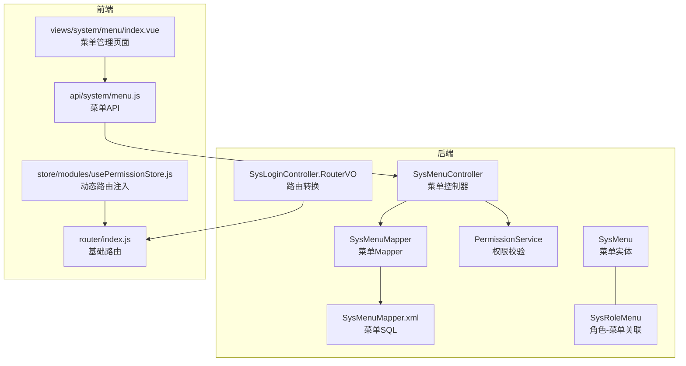
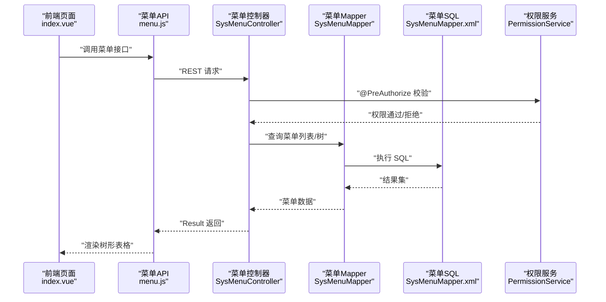
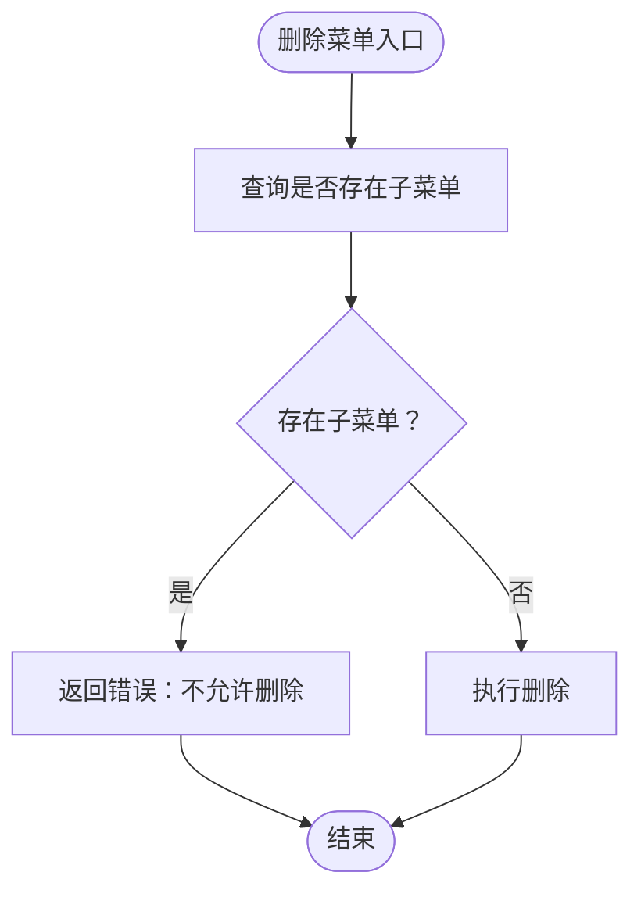
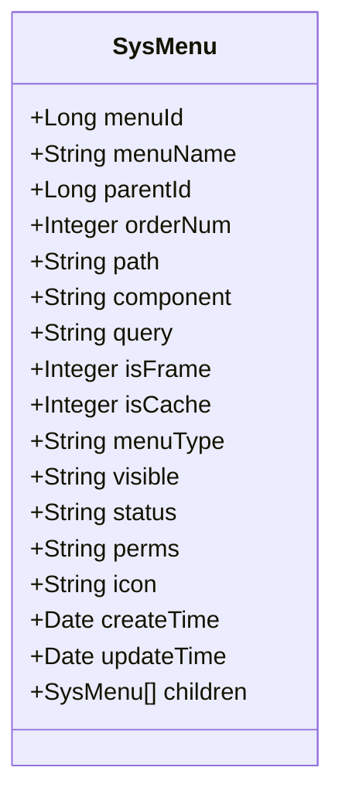
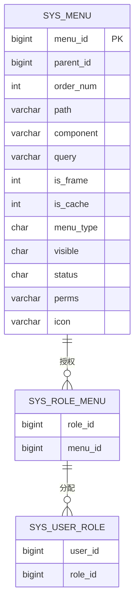
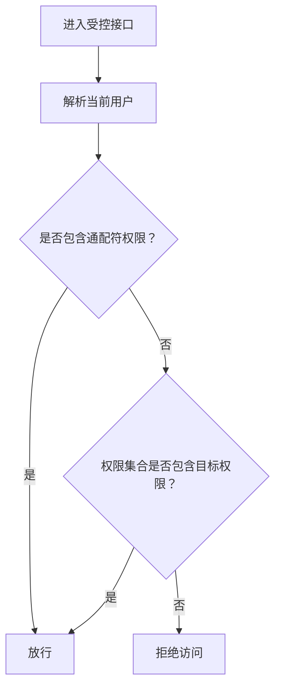
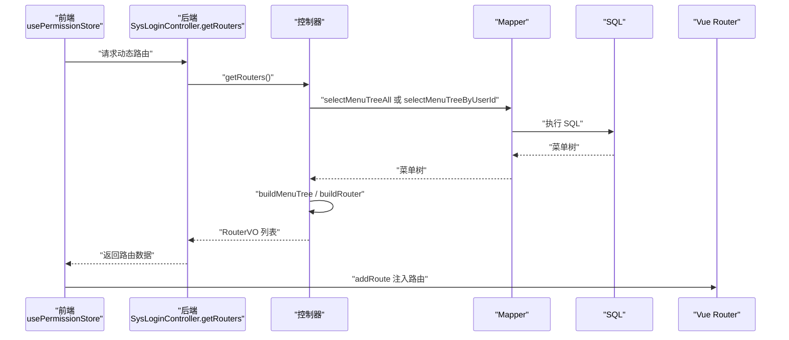
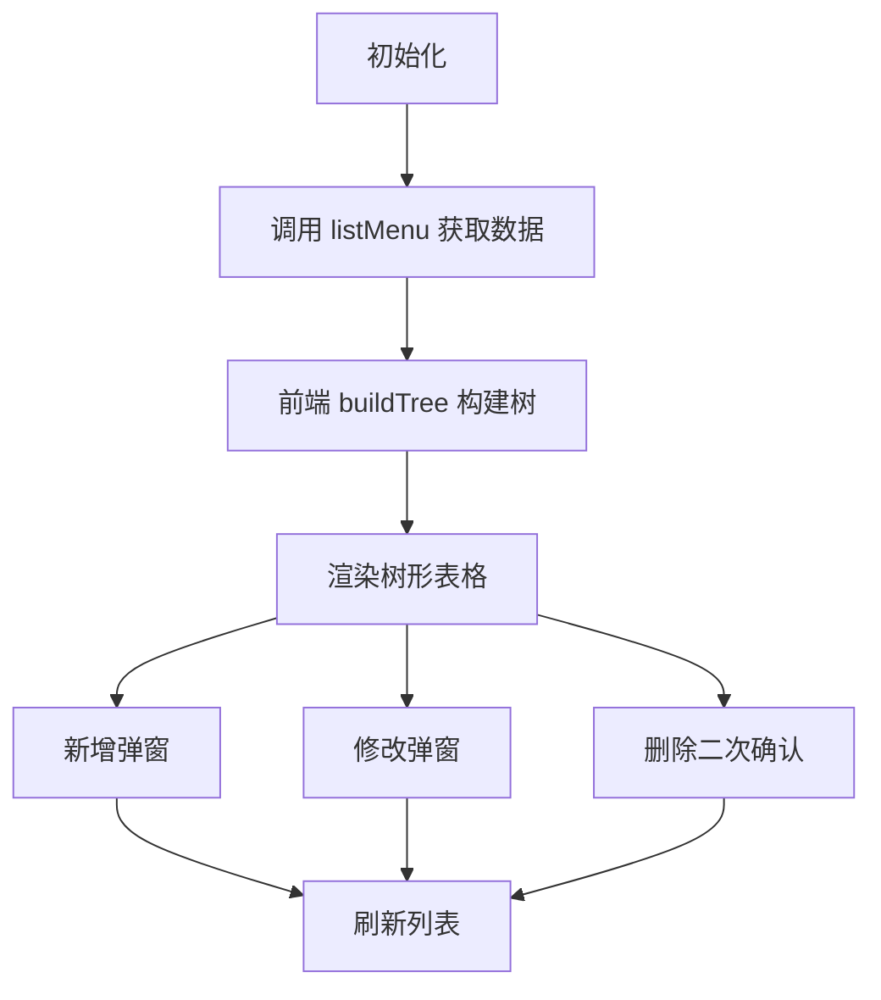
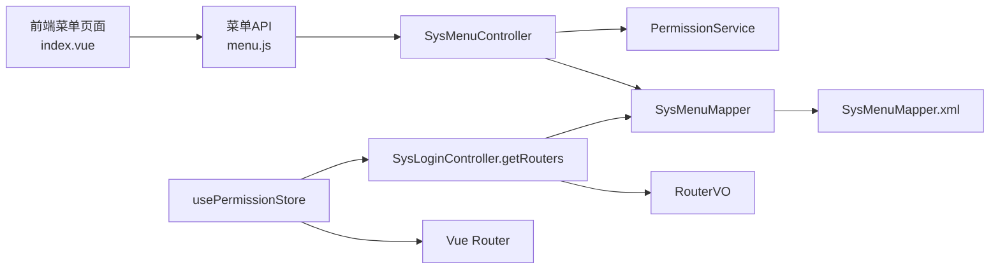

# 菜单系统管理

<cite>
**本文引用的文件**
- [SysMenu.java](file://task-manager-backend/src/main/java/com/taskmanager/domain/SysMenu.java)
- [SysMenuController.java](file://task-manager-backend/src/main/java/com/taskmanager/controller/SysMenuController.java)
- [SysMenuMapper.java](file://task-manager-backend/src/main/java/com/taskmanager/mapper/SysMenuMapper.java)
- [SysMenuMapper.xml](file://task-manager-backend/src/main/resources/mapper/SysMenuMapper.xml)
- [SysRoleMenu.java](file://task-manager-backend/src/main/java/com/taskmanager/domain/SysRoleMenu.java)
- [PermissionService.java](file://task-manager-backend/src/main/java/com/taskmanager/security/PermissionService.java)
- [SysLoginController.java](file://task-manager-backend/src/main/java/com/taskmanager/controller/SysLoginController.java)
- [index.vue](file://task-manager-frontend/src/views/system/menu/index.vue)
- [menu.js](file://task-manager-frontend/src/api/system/menu.js)
- [usePermissionStore.js](file://task-manager-frontend/src/store/modules/usePermissionStore.js)
- [router/index.js](file://task-manager-frontend/src/router/index.js)
</cite>

## 目录
1. [简介](#简介)
2. [项目结构](#项目结构)
3. [核心组件](#核心组件)
4. [架构总览](#架构总览)
5. [详细组件分析](#详细组件分析)
6. [依赖关系分析](#依赖关系分析)
7. [性能考量](#性能考量)
8. [故障排查指南](#故障排查指南)
9. [结论](#结论)
10. [附录](#附录)

## 简介
本文件面向“菜单系统管理”模块，围绕后端控制器、数据模型、权限服务与前端页面三部分展开，系统性阐述动态菜单生成机制、菜单层级结构、权限控制、路由配置、菜单与角色关联、动态路由生成等关键能力，并提供最佳实践与接口文档。

## 项目结构
后端采用 Spring Boot + MyBatis-Plus 架构；前端采用 Vue 3 + Element Plus + Pinia + Vue Router。菜单管理涉及以下关键文件：
- 后端
  - 控制器：SysMenuController（菜单 CRUD 与树形查询）
  - 数据模型：SysMenu（菜单实体）、SysRoleMenu（角色-菜单关联）
  - 数据访问：SysMenuMapper + XML（菜单树、用户权限、角色菜单 ID）
  - 安全与权限：PermissionService（@PreAuthorize 权限校验）
  - 动态路由：SysLoginController.RouterVO（菜单到路由转换）
- 前端
  - 页面：views/system/menu/index.vue（树形表格、表单弹窗）
  - API：api/system/menu.js（菜单接口封装）
  - 状态与路由：store/modules/usePermissionStore.js（动态路由注入）、router/index.js（基础路由）

图表来源
- [SysMenuController.java:1-86](file://task-manager-backend/src/main/java/com/taskmanager/controller/SysMenuController.java#L1-L86)
- [SysMenuMapper.java:1-29](file://task-manager-backend/src/main/java/com/taskmanager/mapper/SysMenuMapper.java#L1-L29)
- [SysMenuMapper.xml:1-56](file://task-manager-backend/src/main/resources/mapper/SysMenuMapper.xml#L1-L56)
- [PermissionService.java:1-64](file://task-manager-backend/src/main/java/com/taskmanager/security/PermissionService.java#L1-L64)
- [SysLoginController.java:170-327](file://task-manager-backend/src/main/java/com/taskmanager/controller/SysLoginController.java#L170-L327)
- [index.vue:1-216](file://task-manager-frontend/src/views/system/menu/index.vue#L1-L216)
- [menu.js:1-26](file://task-manager-frontend/src/api/system/menu.js#L1-L26)
- [usePermissionStore.js:1-105](file://task-manager-frontend/src/store/modules/usePermissionStore.js#L1-L105)
- [router/index.js:1-32](file://task-manager-frontend/src/router/index.js#L1-L32)

章节来源
- [SysMenuController.java:1-86](file://task-manager-backend/src/main/java/com/taskmanager/controller/SysMenuController.java#L1-L86)
- [SysMenu.java:1-92](file://task-manager-backend/src/main/java/com/taskmanager/domain/SysMenu.java#L1-L92)
- [SysMenuMapper.java:1-29](file://task-manager-backend/src/main/java/com/taskmanager/mapper/SysMenuMapper.java#L1-L29)
- [SysMenuMapper.xml:1-56](file://task-manager-backend/src/main/resources/mapper/SysMenuMapper.xml#L1-L56)
- [SysRoleMenu.java:1-25](file://task-manager-backend/src/main/java/com/taskmanager/domain/SysRoleMenu.java#L1-L25)
- [PermissionService.java:1-64](file://task-manager-backend/src/main/java/com/taskmanager/security/PermissionService.java#L1-L64)
- [SysLoginController.java:170-327](file://task-manager-backend/src/main/java/com/taskmanager/controller/SysLoginController.java#L170-L327)
- [index.vue:1-216](file://task-manager-frontend/src/views/system/menu/index.vue#L1-L216)
- [menu.js:1-26](file://task-manager-frontend/src/api/system/menu.js#L1-L26)
- [usePermissionStore.js:1-105](file://task-manager-frontend/src/store/modules/usePermissionStore.js#L1-L105)
- [router/index.js:1-32](file://task-manager-frontend/src/router/index.js#L1-L32)

## 核心组件
- 菜单实体 SysMenu：包含菜单 ID、名称、父级、排序、路由地址、组件、外链、缓存、类型、可见/状态、权限标识、图标、时间戳等字段，并内置 children 列表用于树形结构。
- 菜单控制器 SysMenuController：提供菜单列表（平铺）、菜单树（角色授权下拉）、详情、新增、修改、删除等接口，并通过 @PreAuthorize 进行权限控制。
- 菜单 Mapper 与 SQL：提供菜单树查询、按用户查询菜单树、按用户查询权限集合、按角色查询菜单 ID 集合等方法。
- 权限服务 PermissionService：在 @PreAuthorize 中通过 @ss.hasPermi() 调用，支持通配符权限（*:*:*）与用户权限集合比对。
- 动态路由生成：SysLoginController 的 getRouters 接口根据用户角色返回菜单树并转换为 RouterVO，前端 usePermissionStore 将其注入到 Vue Router。
- 前端菜单管理页面：基于 Element Plus 的树形表格展示菜单层级，支持新增/修改/删除、图标选择、权限标识配置、父子级选择等。

章节来源
- [SysMenu.java:14-92](file://task-manager-backend/src/main/java/com/taskmanager/domain/SysMenu.java#L14-L92)
- [SysMenuController.java:26-84](file://task-manager-backend/src/main/java/com/taskmanager/controller/SysMenuController.java#L26-L84)
- [SysMenuMapper.java:17-28](file://task-manager-backend/src/main/java/com/taskmanager/mapper/SysMenuMapper.java#L17-L28)
- [SysMenuMapper.xml:27-49](file://task-manager-backend/src/main/resources/mapper/SysMenuMapper.xml#L27-L49)
- [PermissionService.java:25-38](file://task-manager-backend/src/main/java/com/taskmanager/security/PermissionService.java#L25-L38)
- [SysLoginController.java:175-243](file://task-manager-backend/src/main/java/com/taskmanager/controller/SysLoginController.java#L175-L243)
- [index.vue:27-141](file://task-manager-frontend/src/views/system/menu/index.vue#L27-L141)
- [menu.js:3-25](file://task-manager-frontend/src/api/system/menu.js#L3-L25)
- [usePermissionStore.js:37-87](file://task-manager-frontend/src/store/modules/usePermissionStore.js#L37-L87)

## 架构总览
动态菜单生成的关键流程：
- 后端
  - 菜单管理接口：SysMenuController 提供 CRUD 与树形查询，配合 PermissionService 进行权限拦截。
  - 菜单树构建：SysMenuMapper 提供按用户/全部的菜单树查询；SysLoginController 在 getRouters 中将菜单树转换为 RouterVO。
- 前端
  - 菜单管理页面：index.vue 展示树形表格，调用 menu.js 封装的接口进行增删改查。
  - 动态路由注入：usePermissionStore.js 调用 getRouters，将菜单树转换为路由并注入到 router/index.js 的路由表中。

图表来源
- [index.vue:162-169](file://task-manager-frontend/src/views/system/menu/index.vue#L162-L169)
- [menu.js:3-25](file://task-manager-frontend/src/api/system/menu.js#L3-L25)
- [SysMenuController.java:26-84](file://task-manager-backend/src/main/java/com/taskmanager/controller/SysMenuController.java#L26-L84)
- [SysMenuMapper.java:17-28](file://task-manager-backend/src/main/java/com/taskmanager/mapper/SysMenuMapper.java#L17-L28)
- [SysMenuMapper.xml:27-49](file://task-manager-backend/src/main/resources/mapper/SysMenuMapper.xml#L27-L49)
- [PermissionService.java:25-38](file://task-manager-backend/src/main/java/com/taskmanager/security/PermissionService.java#L25-L38)

## 详细组件分析

### 后端：SysMenuController 控制器
- 接口职责
  - 列表查询：返回平铺菜单列表，前端负责构建树形结构。
  - 树形选择：返回可用于角色授权的菜单树（treeSelect）。
  - 详情查询：按菜单 ID 获取菜单详情。
  - 新增/修改：设置默认可见与状态值，保存菜单。
  - 删除：若存在子菜单则禁止删除，否则执行物理删除。
- 权限控制
  - 使用 @PreAuthorize 结合自定义权限服务 @ss.hasPermi(...)，确保操作粒度可控。
- 错误处理
  - 删除前检查子菜单数量，避免破坏层级完整性。

图表来源
- [SysMenuController.java:68-84](file://task-manager-backend/src/main/java/com/taskmanager/controller/SysMenuController.java#L68-L84)

章节来源
- [SysMenuController.java:26-84](file://task-manager-backend/src/main/java/com/taskmanager/controller/SysMenuController.java#L26-L84)

### 数据模型：SysMenu 实体
- 关键字段
  - 菜单标识：menuId、parentId、orderNum
  - 路由与组件：path、component、query、isFrame、isCache
  - 类型与状态：menuType（目录/菜单/按钮）、visible、status
  - 权限与外观：perms、icon
  - 时间与审计：createBy、createTime、updateBy、updateTime、remark
  - 树形扩展：children（非持久化字段）
- 设计要点
  - 通过 parentId 与 orderNum 构建层级与排序。
  - children 用于前后端树形渲染与路由转换。
  - menuType 决定是否参与路由生成与按钮级权限控制。

图表来源
- [SysMenu.java:22-91](file://task-manager-backend/src/main/java/com/taskmanager/domain/SysMenu.java#L22-L91)

章节来源
- [SysMenu.java:22-91](file://task-manager-backend/src/main/java/com/taskmanager/domain/SysMenu.java#L22-L91)

### 数据访问：SysMenuMapper 与 SQL
- 方法概览
  - selectMenuTreeAll：查询全部有效菜单树（status=0），按 parent_id、order_num 排序。
  - selectMenuTreeByUserId：按用户查询其授权菜单树（经由 sys_role_menu 与 sys_user_role 关联）。
  - selectPermsByUserId：查询用户拥有的权限标识集合（过滤空值与无效项）。
  - selectMenuIdsByRoleId：查询角色授权的菜单 ID 集合。
- 关键点
  - 通过 LEFT JOIN 实现用户-角色-菜单三层关联。
  - 权限标识集合用于前端按钮级权限控制与后端 @PreAuthorize 校验。

图表来源
- [SysMenuMapper.xml:34-54](file://task-manager-backend/src/main/resources/mapper/SysMenuMapper.xml#L34-L54)
- [SysRoleMenu.java:19-24](file://task-manager-backend/src/main/java/com/taskmanager/domain/SysRoleMenu.java#L19-L24)

章节来源
- [SysMenuMapper.java:17-28](file://task-manager-backend/src/main/java/com/taskmanager/mapper/SysMenuMapper.java#L17-L28)
- [SysMenuMapper.xml:27-49](file://task-manager-backend/src/main/resources/mapper/SysMenuMapper.xml#L27-L49)
- [SysRoleMenu.java:19-24](file://task-manager-backend/src/main/java/com/taskmanager/domain/SysRoleMenu.java#L19-L24)

### 权限服务：PermissionService
- 能力
  - hasPermi(permission)：判断当前用户是否具备某权限标识。
  - lacksPermi(permission)：与前者相反，用于限制操作。
  - 支持通配符权限（*:*:*）作为超级管理员权限。
- 使用方式
  - 在控制器方法上通过 @PreAuthorize("@ss.hasPermi('...')") 调用。

图表来源
- [PermissionService.java:25-38](file://task-manager-backend/src/main/java/com/taskmanager/security/PermissionService.java#L25-L38)

章节来源
- [PermissionService.java:25-38](file://task-manager-backend/src/main/java/com/taskmanager/security/PermissionService.java#L25-L38)

### 动态路由：SysLoginController.RouterVO
- 流程
  - getRouters：根据是否管理员选择菜单树来源，构建菜单树并转换为 RouterVO。
  - buildRouter：将 SysMenu 转为前端路由对象，过滤按钮类型子节点，处理路径与组件。
  - getRouterPath/getComponent：根据 isFrame、menuType、parent_id 等规则生成最终路由。
- 前端集成
  - usePermissionStore.generateRoutes：调用 getRouters，将菜单树注入到 Vue Router，形成可导航的侧边栏与页面路由。

图表来源
- [SysLoginController.java:175-243](file://task-manager-backend/src/main/java/com/taskmanager/controller/SysLoginController.java#L175-L243)
- [usePermissionStore.js:37-87](file://task-manager-frontend/src/store/modules/usePermissionStore.js#L37-L87)

章节来源
- [SysLoginController.java:175-243](file://task-manager-backend/src/main/java/com/taskmanager/controller/SysLoginController.java#L175-L243)
- [usePermissionStore.js:37-87](file://task-manager-frontend/src/store/modules/usePermissionStore.js#L37-L87)

### 前端：菜单管理页面
- 功能特性
  - 树形表格：基于 el-table 的 tree-props 渲染层级，支持默认展开。
  - 操作按钮：新增（仅目录/菜单）、修改、删除（按钮不可新增/删除）。
  - 表单弹窗：上级菜单使用 el-tree-select（父子级联动），菜单类型切换影响表单项显示。
  - 图标选择：支持图标名输入并在表格中渲染。
- 数据流
  - 初始化：调用 listMenu 获取平铺数据，前端 buildTree 构建树形。
  - 新增/修改：提交表单后刷新列表。
  - 删除：二次确认后调用 delMenu 并刷新。

图表来源
- [index.vue:162-176](file://task-manager-frontend/src/views/system/menu/index.vue#L162-L176)
- [index.vue:186-212](file://task-manager-frontend/src/views/system/menu/index.vue#L186-L212)
- [menu.js:3-25](file://task-manager-frontend/src/api/system/menu.js#L3-L25)

章节来源
- [index.vue:27-141](file://task-manager-frontend/src/views/system/menu/index.vue#L27-L141)
- [index.vue:162-176](file://task-manager-frontend/src/views/system/menu/index.vue#L162-L176)
- [index.vue:186-212](file://task-manager-frontend/src/views/system/menu/index.vue#L186-L212)
- [menu.js:3-25](file://task-manager-frontend/src/api/system/menu.js#L3-L25)

## 依赖关系分析
- 控制器依赖 Mapper 与权限服务，Mapper 依赖 SQL 文件。
- 前端页面依赖 API 封装，API 调用后端控制器。
- 动态路由生成依赖后端菜单树与 RouterVO 转换，前端通过 Pinia store 注入到 Vue Router。

图表来源
- [index.vue:148](file://task-manager-frontend/src/views/system/menu/index.vue#L148)
- [menu.js:3-25](file://task-manager-frontend/src/api/system/menu.js#L3-L25)
- [SysMenuController.java:26-84](file://task-manager-backend/src/main/java/com/taskmanager/controller/SysMenuController.java#L26-L84)
- [PermissionService.java:25-38](file://task-manager-backend/src/main/java/com/taskmanager/security/PermissionService.java#L25-L38)
- [SysMenuMapper.java:17-28](file://task-manager-backend/src/main/java/com/taskmanager/mapper/SysMenuMapper.java#L17-L28)
- [SysMenuMapper.xml:27-49](file://task-manager-backend/src/main/resources/mapper/SysMenuMapper.xml#L27-L49)
- [SysLoginController.java:175-243](file://task-manager-backend/src/main/java/com/taskmanager/controller/SysLoginController.java#L175-L243)
- [usePermissionStore.js:37-87](file://task-manager-frontend/src/store/modules/usePermissionStore.js#L37-L87)
- [router/index.js:26-29](file://task-manager-frontend/src/router/index.js#L26-L29)

章节来源
- [SysMenuController.java:26-84](file://task-manager-backend/src/main/java/com/taskmanager/controller/SysMenuController.java#L26-L84)
- [SysMenuMapper.java:17-28](file://task-manager-backend/src/main/java/com/taskmanager/mapper/SysMenuMapper.java#L17-L28)
- [SysMenuMapper.xml:27-49](file://task-manager-backend/src/main/resources/mapper/SysMenuMapper.xml#L27-L49)
- [PermissionService.java:25-38](file://task-manager-backend/src/main/java/com/taskmanager/security/PermissionService.java#L25-L38)
- [SysLoginController.java:175-243](file://task-manager-backend/src/main/java/com/taskmanager/controller/SysLoginController.java#L175-L243)
- [index.vue:148](file://task-manager-frontend/src/views/system/menu/index.vue#L148)
- [menu.js:3-25](file://task-manager-frontend/src/api/system/menu.js#L3-L25)
- [usePermissionStore.js:37-87](file://task-manager-frontend/src/store/modules/usePermissionStore.js#L37-L87)
- [router/index.js:26-29](file://task-manager-frontend/src/router/index.js#L26-L29)

## 性能考量
- 菜单树查询
  - SQL 已按 parent_id、order_num 排序，避免前端重复排序。
  - 用户菜单树通过 LEFT JOIN 三表关联，建议在 sys_user_id、role_id、menu_id 上建立索引以提升查询效率。
- 权限查询
  - selectPermsByUserId 使用 DISTINCT 去重，注意 perms 字段的索引优化。
- 前端渲染
  - 树形表格默认展开可能带来大量 DOM，建议在大数据量场景下关闭默认展开或启用虚拟滚动。
- 动态路由
  - RouterVO 转换与 addRoute 操作应避免重复注入，store 中维护 routesGenerated 标志位可减少重复。

## 故障排查指南
- 删除菜单失败
  - 现象：返回“存在子菜单，不允许删除”
  - 处理：先删除子菜单，再执行删除父菜单。
  - 参考路径：[SysMenuController.java:77-79](file://task-manager-backend/src/main/java/com/taskmanager/controller/SysMenuController.java#L77-L79)
- 权限不足
  - 现象：接口返回 403
  - 处理：确认用户是否具备 system:menu:* 权限，或是否为超级管理员。
  - 参考路径：[PermissionService.java:25-38](file://task-manager-backend/src/main/java/com/taskmanager/security/PermissionService.java#L25-L38)
- 路由未生效
  - 现象：菜单未出现在侧边栏
  - 处理：确认 getRouters 返回的菜单树是否包含该菜单，且 menuType 不为按钮；检查 usePermissionStore 是否成功注入路由。
  - 参考路径：[SysLoginController.java:233-242](file://task-manager-backend/src/main/java/com/taskmanager/controller/SysLoginController.java#L233-L242)、[usePermissionStore.js:37-87](file://task-manager-frontend/src/store/modules/usePermissionStore.js#L37-L87)
- 菜单图标不显示
  - 现象：表格中图标为空或不正确
  - 处理：确认 icon 字段是否为有效图标名，且前端模板中正确渲染。
  - 参考路径：[index.vue:31-32](file://task-manager-frontend/src/views/system/menu/index.vue#L31-L32)

章节来源
- [SysMenuController.java:77-79](file://task-manager-backend/src/main/java/com/taskmanager/controller/SysMenuController.java#L77-L79)
- [PermissionService.java:25-38](file://task-manager-backend/src/main/java/com/taskmanager/security/PermissionService.java#L25-L38)
- [SysLoginController.java:233-242](file://task-manager-backend/src/main/java/com/taskmanager/controller/SysLoginController.java#L233-L242)
- [usePermissionStore.js:37-87](file://task-manager-frontend/src/store/modules/usePermissionStore.js#L37-L87)
- [index.vue:31-32](file://task-manager-frontend/src/views/system/menu/index.vue#L31-L32)

## 结论
本菜单系统通过“实体-控制器-Mapper-权限服务-动态路由”的分层设计，实现了菜单的灵活管理与安全控制。后端提供完善的菜单 CRUD 与树形查询，结合权限服务保障操作安全；前端以树形表格直观呈现菜单层级，并通过动态路由将菜单转换为可导航的页面。角色-菜单关联与权限标识共同构成细粒度的权限体系，满足多角色、多权限场景下的业务需求。

## 附录

### 接口文档
- 获取菜单列表（平铺）
  - 方法：GET
  - 路径：/api/system/menu/list
  - 权限：system:menu:list
  - 参数：SysMenu 查询条件
  - 返回：Result<List<SysMenu>>
- 获取菜单树（角色授权下拉）
  - 方法：GET
  - 路径：/api/system/menu/treeSelect
  - 权限：system:menu:list
  - 返回：Result<List<SysMenu>>
- 获取菜单详情
  - 方法：GET
  - 路径：/api/system/menu/{menuId}
  - 权限：system:menu:query
  - 返回：Result<SysMenu>
- 新增菜单
  - 方法：POST
  - 路径：/api/system/menu
  - 权限：system:menu:add
  - 请求体：SysMenu
  - 返回：Result<Void>
- 修改菜单
  - 方法：PUT
  - 路径：/api/system/menu
  - 权限：system:menu:edit
  - 请求体：SysMenu
  - 返回：Result<Void>
- 删除菜单
  - 方法：DELETE
  - 路径：/api/system/menu/{menuId}
  - 权限：system:menu:remove
  - 返回：Result<Void>

章节来源
- [SysMenuController.java:26-84](file://task-manager-backend/src/main/java/com/taskmanager/controller/SysMenuController.java#L26-L84)

### 最佳实践
- 菜单设计原则
  - 使用 menuType 区分目录、菜单与按钮，避免在路由层面混用按钮。
  - 为每个菜单配置明确的 perms，便于按钮级权限控制。
- 权限配置策略
  - 为不同角色分配最小必要菜单集合，避免过度授权。
  - 使用通配符权限仅授予超级管理员，其他用户通过具体 perms 授权。
- 用户体验优化
  - 前端树形表格默认展开时注意性能，必要时提供折叠/懒加载。
  - 图标选择建议提供预览与常用图标库，减少用户学习成本。
- 动态路由生成
  - 确保 getRouters 返回的菜单树不含按钮类型节点，避免产生无效路由。
  - 统一处理 isFrame 与路径前缀，保证一级目录路由规范。