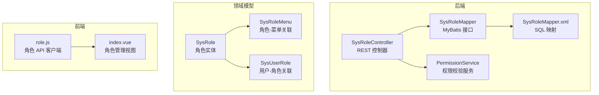
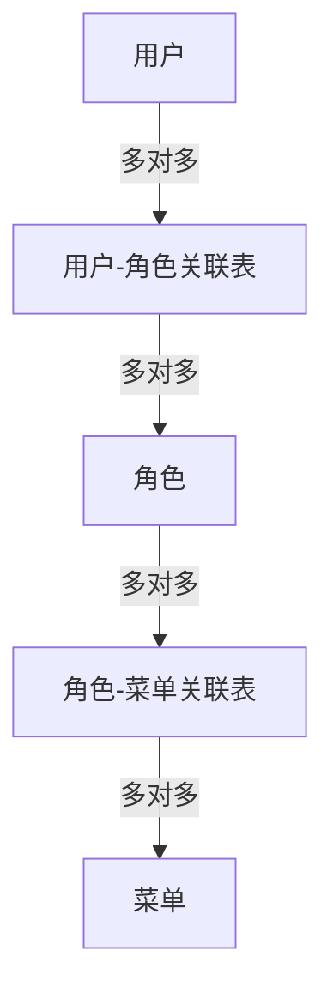
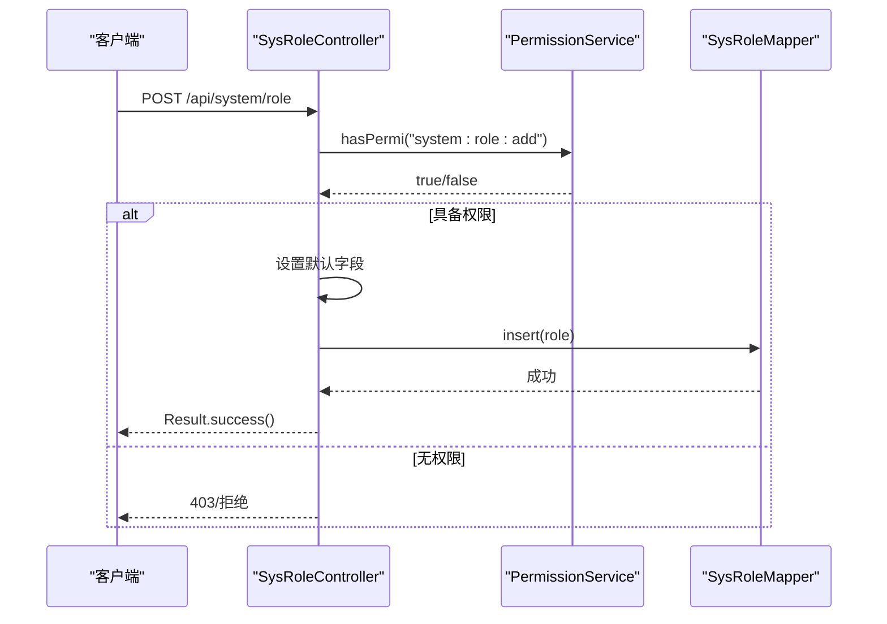
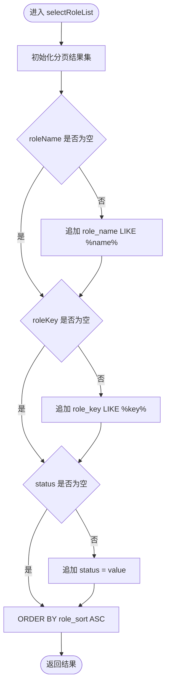
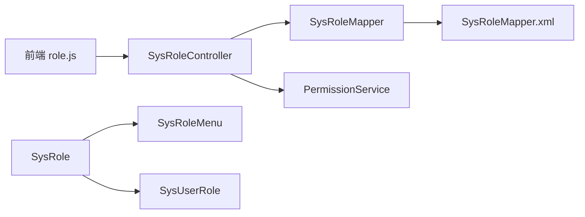

# 角色权限管理

<cite>
**本文引用的文件**
- [SysRoleController.java](file://task-manager-backend/src/main/java/com/taskmanager/controller/SysRoleController.java)
- [SysRole.java](file://task-manager-backend/src/main/java/com/taskmanager/domain/SysRole.java)
- [SysRoleMenu.java](file://task-manager-backend/src/main/java/com/taskmanager/domain/SysRoleMenu.java)
- [SysUserRole.java](file://task-manager-backend/src/main/java/com/taskmanager/domain/SysUserRole.java)
- [SysRoleMapper.java](file://task-manager-backend/src/main/java/com/taskmanager/mapper/SysRoleMapper.java)
- [SysRoleMapper.xml](file://task-manager-backend/src/main/resources/mapper/SysRoleMapper.xml)
- [SysRoleMenuMapper.java](file://task-manager-backend/src/main/java/com/taskmanager/mapper/SysRoleMenuMapper.java)
- [SysUserRoleMapper.java](file://task-manager-backend/src/main/java/com/taskmanager/mapper/SysUserRoleMapper.java)
- [PermissionService.java](file://task-manager-backend/src/main/java/com/taskmanager/security/PermissionService.java)
- [role.js](file://task-manager-frontend/src/api/system/role.js)
- [index.vue](file://task-manager-frontend/src/views/system/role/index.vue)
</cite>

## 目录
1. [简介](#简介)
2. [项目结构](#项目结构)
3. [核心组件](#核心组件)
4. [架构总览](#架构总览)
5. [详细组件分析](#详细组件分析)
6. [依赖分析](#依赖分析)
7. [性能考虑](#性能考虑)
8. [故障排查指南](#故障排查指南)
9. [结论](#结论)
10. [附录](#附录)

## 简介
本技术文档围绕角色权限管理模块展开，系统性阐述基于 RBAC 的权限模型实现，涵盖角色定义、权限分配、菜单授权与用户授权等关键环节。文档重点解析后端控制器 SysRoleController 的功能边界与调用流程，剖析角色实体 SysRole 及其关联实体 SysRoleMenu、SysUserRole 的数据模型设计，并结合前端角色管理页面的交互与 API 使用，给出最佳实践、安全与性能优化建议。

## 项目结构
角色权限管理模块位于后端 Java 工程与前端 Vue 工程中，采用分层架构组织：
- 后端按领域模型划分包：controller、domain、mapper、security 等
- 前端按功能页面划分：views/system/role 下的角色管理页面与对应的 API 模块

图表来源
- [SysRoleController.java:1-83](file://task-manager-backend/src/main/java/com/taskmanager/controller/SysRoleController.java#L1-L83)
- [SysRoleMapper.java:1-30](file://task-manager-backend/src/main/java/com/taskmanager/mapper/SysRoleMapper.java#L1-L30)
- [SysRoleMapper.xml:1-42](file://task-manager-backend/src/main/resources/mapper/SysRoleMapper.xml#L1-L42)
- [SysRole.java:1-65](file://task-manager-backend/src/main/java/com/taskmanager/domain/SysRole.java#L1-L65)
- [SysRoleMenu.java:1-25](file://task-manager-backend/src/main/java/com/taskmanager/domain/SysRoleMenu.java#L1-L25)
- [SysUserRole.java:1-26](file://task-manager-backend/src/main/java/com/taskmanager/domain/SysUserRole.java#L1-L26)
- [PermissionService.java:1-64](file://task-manager-backend/src/main/java/com/taskmanager/security/PermissionService.java#L1-L64)
- [role.js](file://task-manager-frontend/src/api/system/role.js)
- [index.vue](file://task-manager-frontend/src/views/system/role/index.vue)

章节来源
- [SysRoleController.java:1-83](file://task-manager-backend/src/main/java/com/taskmanager/controller/SysRoleController.java#L1-L83)
- [SysRole.java:1-65](file://task-manager-backend/src/main/java/com/taskmanager/domain/SysRole.java#L1-L65)
- [SysRoleMenu.java:1-25](file://task-manager-backend/src/main/java/com/taskmanager/domain/SysRoleMenu.java#L1-L25)
- [SysUserRole.java:1-26](file://task-manager-backend/src/main/java/com/taskmanager/domain/SysUserRole.java#L1-L26)
- [SysRoleMapper.java:1-30](file://task-manager-backend/src/main/java/com/taskmanager/mapper/SysRoleMapper.java#L1-L30)
- [SysRoleMapper.xml:1-42](file://task-manager-backend/src/main/resources/mapper/SysRoleMapper.xml#L1-L42)
- [SysRoleMenuMapper.java:1-13](file://task-manager-backend/src/main/java/com/taskmanager/mapper/SysRoleMenuMapper.java#L1-L13)
- [SysUserRoleMapper.java:1-13](file://task-manager-backend/src/main/java/com/taskmanager/mapper/SysUserRoleMapper.java#L1-L13)
- [PermissionService.java:1-64](file://task-manager-backend/src/main/java/com/taskmanager/security/PermissionService.java#L1-L64)
- [role.js](file://task-manager-frontend/src/api/system/role.js)
- [index.vue](file://task-manager-frontend/src/views/system/role/index.vue)

## 核心组件
- 角色实体 SysRole：承载角色基本信息、权限标识、数据范围、状态与审计字段
- 角色-菜单关联 SysRoleMenu：维护角色与菜单的多对多授权关系
- 用户-角色关联 SysUserRole：维护用户与角色的多对多归属关系
- 角色 Mapper 与 SQL 映射：提供角色分页查询、按用户查询角色列表等能力
- 角色控制器 SysRoleController：提供角色 CRUD 与分页列表接口
- 权限服务 PermissionService：在 Spring Security 的 @PreAuthorize 中提供权限校验

章节来源
- [SysRole.java:1-65](file://task-manager-backend/src/main/java/com/taskmanager/domain/SysRole.java#L1-L65)
- [SysRoleMenu.java:1-25](file://task-manager-backend/src/main/java/com/taskmanager/domain/SysRoleMenu.java#L1-L25)
- [SysUserRole.java:1-26](file://task-manager-backend/src/main/java/com/taskmanager/domain/SysUserRole.java#L1-L26)
- [SysRoleMapper.java:1-30](file://task-manager-backend/src/main/java/com/taskmanager/mapper/SysRoleMapper.java#L1-L30)
- [SysRoleMapper.xml:1-42](file://task-manager-backend/src/main/resources/mapper/SysRoleMapper.xml#L1-L42)
- [SysRoleController.java:1-83](file://task-manager-backend/src/main/java/com/taskmanager/controller/SysRoleController.java#L1-L83)
- [PermissionService.java:1-64](file://task-manager-backend/src/main/java/com/taskmanager/security/PermissionService.java#L1-L64)

## 架构总览
RBAC 权限模型在本项目中的落地：
- 角色（Role）：定义权限集合与数据范围
- 菜单（Menu）：系统功能入口，与角色建立授权关系
- 用户（User）：通过角色继承权限，受数据范围约束
- 权限校验：通过 PermissionService 在控制器层进行细粒度校验

图表来源
- [SysRole.java:1-65](file://task-manager-backend/src/main/java/com/taskmanager/domain/SysRole.java#L1-L65)
- [SysRoleMenu.java:1-25](file://task-manager-backend/src/main/java/com/taskmanager/domain/SysRoleMenu.java#L1-L25)
- [SysUserRole.java:1-26](file://task-manager-backend/src/main/java/com/taskmanager/domain/SysUserRole.java#L1-L26)

## 详细组件分析

### SysRoleController 控制器
职责与接口概览：
- 列表查询：分页 + 多条件筛选（角色名、权限键、状态）
- 详情查询：按角色 ID 获取角色信息
- 新增角色：设置默认值并持久化
- 修改角色：更新角色信息
- 删除角色：逻辑删除（标记 delFlag）

权限控制：
- 所有接口均通过 @PreAuthorize 结合 PermissionService 进行权限校验，例如 system:role:list、system:role:query、system:role:add、system:role:edit、system:role:remove

处理流程（以新增角色为例）：

图表来源
- [SysRoleController.java:1-83](file://task-manager-backend/src/main/java/com/taskmanager/controller/SysRoleController.java#L1-L83)
- [PermissionService.java:1-64](file://task-manager-backend/src/main/java/com/taskmanager/security/PermissionService.java#L1-L64)

章节来源
- [SysRoleController.java:26-81](file://task-manager-backend/src/main/java/com/taskmanager/controller/SysRoleController.java#L26-L81)
- [PermissionService.java:25-38](file://task-manager-backend/src/main/java/com/taskmanager/security/PermissionService.java#L25-L38)

### 角色实体 SysRole 数据模型
字段说明（节选）：
- 角色标识：roleId、roleName、roleKey
- 展示与范围：roleSort、dataScope
- 关联控制：menuCheckStrictly、deptCheckStrictly
- 状态与审计：status、delFlag、createBy、createTime、updateBy、updateTime、remark

设计要点：
- 使用 MyBatis-Plus 注解映射数据库表
- dataScope 用于控制数据访问范围（如全部、本部门、仅本人等）
- delFlag 实现软删除策略，便于审计与恢复

章节来源
- [SysRole.java:22-63](file://task-manager-backend/src/main/java/com/taskmanager/domain/SysRole.java#L22-L63)

### 角色-菜单关联 SysRoleMenu
用途：
- 维护角色与菜单的授权关系，支持角色对菜单的批量授权与回收

设计要点：
- 简洁的复合字段结构，便于快速查询与清理
- 与 SysRoleMenuMapper 协同工作

章节来源
- [SysRoleMenu.java:19-23](file://task-manager-backend/src/main/java/com/taskmanager/domain/SysRoleMenu.java#L19-L23)
- [SysRoleMenuMapper.java:1-13](file://task-manager-backend/src/main/java/com/taskmanager/mapper/SysRoleMenuMapper.java#L1-L13)

### 用户-角色关联 SysUserRole
用途：
- 维护用户与角色的多对多归属关系，支持用户的角色继承与切换

设计要点：
- 复合主键（userId + roleId）确保唯一性
- 与 SysUserRoleMapper 协同，支撑用户角色查询与变更

章节来源
- [SysUserRole.java:20-24](file://task-manager-backend/src/main/java/com/taskmanager/domain/SysUserRole.java#L20-L24)
- [SysUserRoleMapper.java:1-13](file://task-manager-backend/src/main/java/com/taskmanager/mapper/SysUserRoleMapper.java#L1-L13)

### 角色 Mapper 与 SQL 映射
- selectRolesByUserId：根据用户 ID 查询其有效角色列表（过滤 delFlag）
- selectRoleList：分页查询角色列表，支持角色名、权限键、状态的多条件模糊匹配

图表来源
- [SysRoleMapper.xml:26-40](file://task-manager-backend/src/main/resources/mapper/SysRoleMapper.xml#L26-L40)

章节来源
- [SysRoleMapper.java:17-28](file://task-manager-backend/src/main/java/com/taskmanager/mapper/SysRoleMapper.java#L17-L28)
- [SysRoleMapper.xml:19-40](file://task-manager-backend/src/main/resources/mapper/SysRoleMapper.xml#L19-L40)

### 权限服务 PermissionService
- 提供 hasPermi 与 lacksPermi 方法，用于 @PreAuthorize 注解
- 超级管理员权限标识为 "*:*:*"，具备全量权限
- 从 Security 上下文提取当前登录用户及其权限集合

章节来源
- [PermissionService.java:25-38](file://task-manager-backend/src/main/java/com/taskmanager/security/PermissionService.java#L25-L38)

### 前端角色管理页面
- 角色列表展示：调用后端分页接口，渲染角色卡片或表格
- 权限树形选择：基于菜单树进行勾选授权，提交角色-菜单关联
- 批量授权操作：支持一键授权/取消授权菜单集合

API 使用参考：
- 角色列表：GET /api/system/role/list
- 角色详情：GET /api/system/role/{roleId}
- 新增角色：POST /api/system/role
- 修改角色：PUT /api/system/role
- 删除角色：DELETE /api/system/role/{roleIds}

章节来源
- [role.js](file://task-manager-frontend/src/api/system/role.js)
- [index.vue](file://task-manager-frontend/src/views/system/role/index.vue)

## 依赖分析
- 控制器依赖 Mapper 与权限服务，实现业务编排与权限校验
- Mapper 依赖 XML 映射文件执行 SQL 查询
- 实体类之间通过关联表实体形成多对多关系
- 前端通过 API 客户端与后端控制器对接

图表来源
- [SysRoleController.java:1-83](file://task-manager-backend/src/main/java/com/taskmanager/controller/SysRoleController.java#L1-L83)
- [SysRoleMapper.java:1-30](file://task-manager-backend/src/main/java/com/taskmanager/mapper/SysRoleMapper.java#L1-L30)
- [SysRoleMapper.xml:1-42](file://task-manager-backend/src/main/resources/mapper/SysRoleMapper.xml#L1-L42)
- [SysRole.java:1-65](file://task-manager-backend/src/main/java/com/taskmanager/domain/SysRole.java#L1-L65)
- [SysRoleMenu.java:1-25](file://task-manager-backend/src/main/java/com/taskmanager/domain/SysRoleMenu.java#L1-L25)
- [SysUserRole.java:1-26](file://task-manager-backend/src/main/java/com/taskmanager/domain/SysUserRole.java#L1-L26)
- [role.js](file://task-manager-frontend/src/api/system/role.js)

章节来源
- [SysRoleController.java:1-83](file://task-manager-backend/src/main/java/com/taskmanager/controller/SysRoleController.java#L1-L83)
- [SysRoleMapper.java:1-30](file://task-manager-backend/src/main/java/com/taskmanager/mapper/SysRoleMapper.java#L1-L30)
- [SysRoleMapper.xml:1-42](file://task-manager-backend/src/main/resources/mapper/SysRoleMapper.xml#L1-L42)
- [SysRole.java:1-65](file://task-manager-backend/src/main/java/com/taskmanager/domain/SysRole.java#L1-L65)
- [SysRoleMenu.java:1-25](file://task-manager-backend/src/main/java/com/taskmanager/domain/SysRoleMenu.java#L1-L25)
- [SysUserRole.java:1-26](file://task-manager-backend/src/main/java/com/taskmanager/domain/SysUserRole.java#L1-L26)
- [role.js](file://task-manager-frontend/src/api/system/role.js)

## 性能考虑
- 分页查询：列表接口已采用分页参数，避免一次性加载大量数据
- 条件过滤：SQL 映射中对可选条件进行动态拼接，减少无效扫描
- 字段映射：ResultMap 精准映射必要字段，降低 ORM 开销
- 缓存建议：可在用户权限集合与菜单树上引入缓存，减少重复计算
- 批量操作：授权/撤销授权时建议采用批量插入/删除，降低网络往返

## 故障排查指南
- 权限不足：检查当前登录用户的权限集合是否包含所需标识；确认 PermissionService 的 hasPermi 返回值
- 无数据或数据异常：核对 delFlag 与 status 字段过滤条件；确认 SQL 映射中的动态条件拼接
- 授权不生效：确认角色-菜单关联表是否正确写入；检查菜单树选择策略（menuCheckStrictly）

章节来源
- [PermissionService.java:25-38](file://task-manager-backend/src/main/java/com/taskmanager/security/PermissionService.java#L25-L38)
- [SysRoleMapper.xml:26-40](file://task-manager-backend/src/main/resources/mapper/SysRoleMapper.xml#L26-L40)

## 结论
本模块以清晰的领域模型与分层架构实现了 RBAC 权限控制，控制器提供标准的 CRUD 与分页查询接口，配合权限服务完成细粒度的访问控制。前端角色管理页面通过 API 完成角色列表、树形授权与批量操作。建议在生产环境中进一步完善权限缓存、批量授权优化与审计日志，持续提升安全性与性能。

## 附录

### API 接口清单（后端）
- GET /api/system/role/list
  - 参数：pageNum、pageSize、roleName、roleKey、status
  - 返回：分页角色列表
- GET /api/system/role/{roleId}
  - 返回：指定角色详情
- POST /api/system/role
  - 请求体：SysRole（新增）
  - 返回：成功
- PUT /api/system/role
  - 请求体：SysRole（修改）
  - 返回：成功
- DELETE /api/system/role/{roleIds}
  - 路径参数：roleIds（数组）
  - 返回：成功

章节来源
- [SysRoleController.java:29-81](file://task-manager-backend/src/main/java/com/taskmanager/controller/SysRoleController.java#L29-L81)