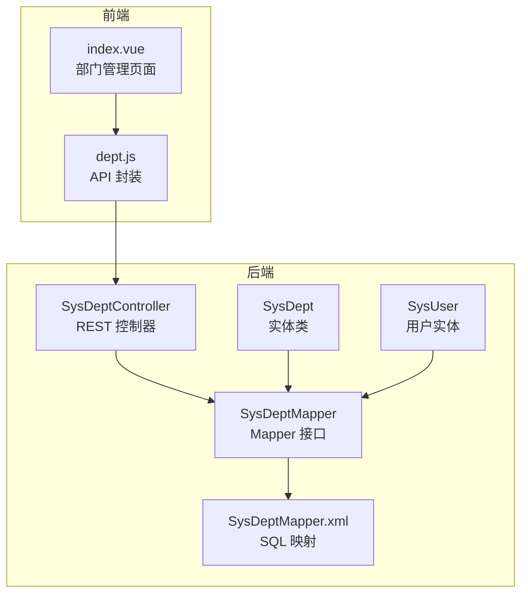
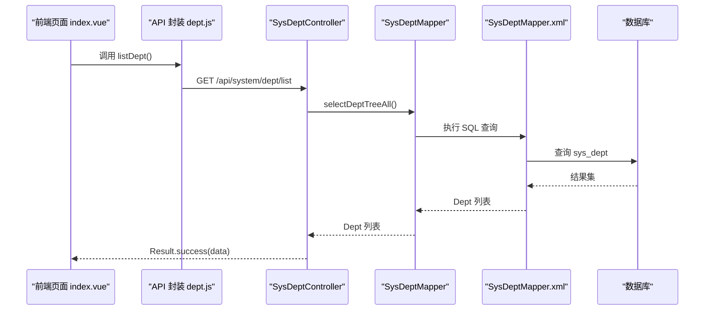
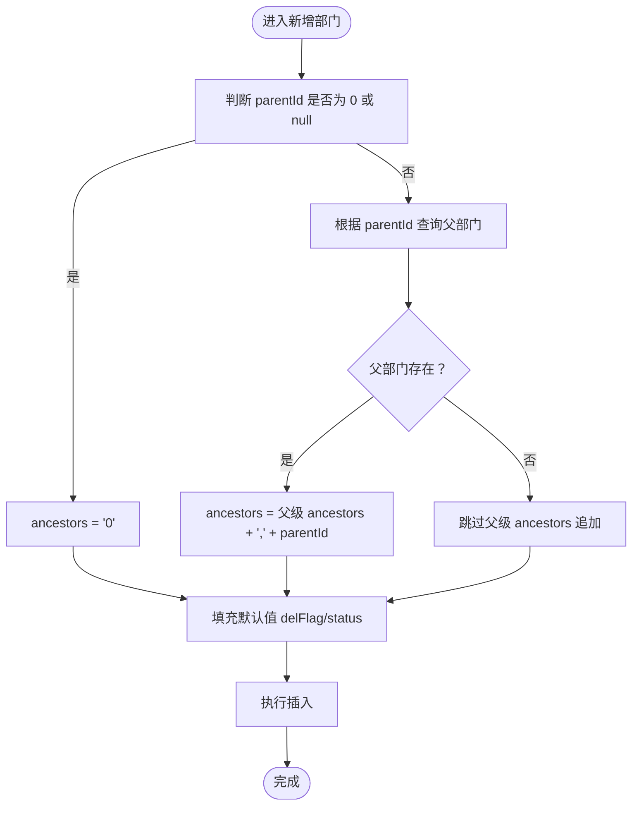
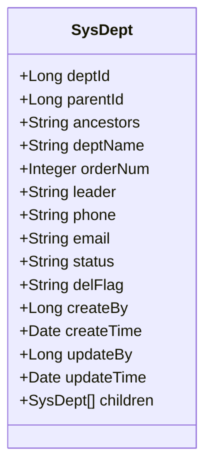
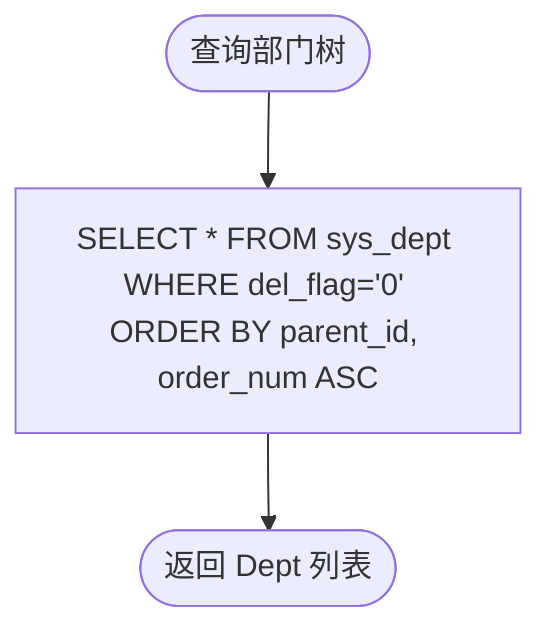
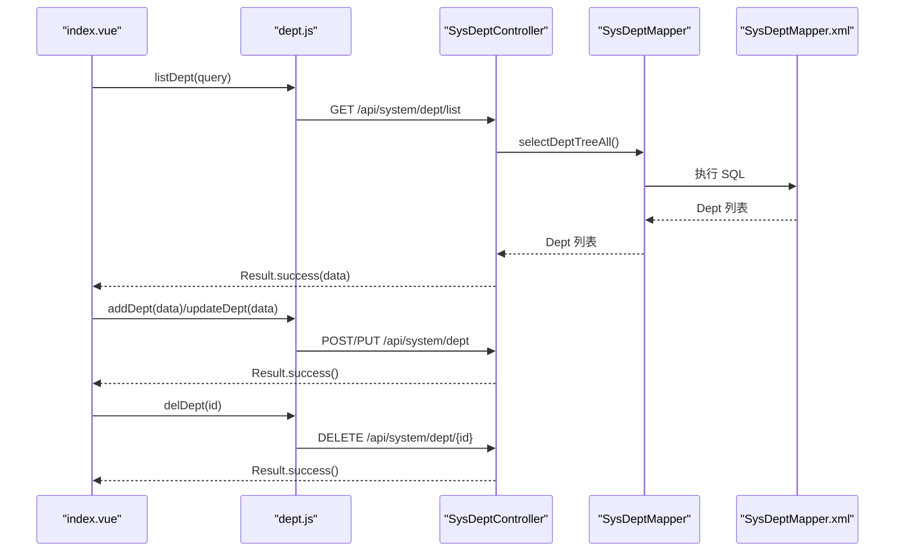
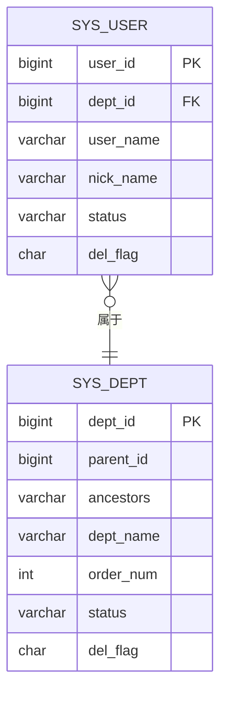
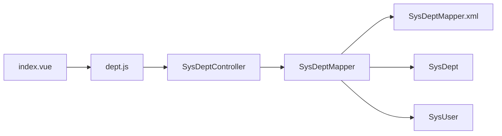

# 部门管理

<cite>
**本文引用的文件**
- [SysDeptController.java](file://task-manager-backend/src/main/java/com/taskmanager/controller/SysDeptController.java)
- [SysDept.java](file://task-manager-backend/src/main/java/com/taskmanager/domain/SysDept.java)
- [SysDeptMapper.java](file://task-manager-backend/src/main/java/com/taskmanager/mapper/SysDeptMapper.java)
- [SysDeptMapper.xml](file://task-manager-backend/src/main/resources/mapper/SysDeptMapper.xml)
- [SysUser.java](file://task-manager-backend/src/main/java/com/taskmanager/domain/SysUser.java)
- [index.vue](file://task-manager-frontend/src/views/system/dept/index.vue)
- [dept.js](file://task-manager-frontend/src/api/system/dept.js)
- [SysDeptControllerTest.java](file://task-manager-backend/src/test/java/com/taskmanager/controller/SysDeptControllerTest.java)
- [schema.sql](file://task-manager-backend/src/main/resources/schema.sql)
- [test-data.sql](file://task-manager-backend/src/main/resources/test-data.sql)
</cite>

## 目录
1. [简介](#简介)
2. [项目结构](#项目结构)
3. [核心组件](#核心组件)
4. [架构总览](#架构总览)
5. [详细组件分析](#详细组件分析)
6. [依赖分析](#依赖分析)
7. [性能考虑](#性能考虑)
8. [故障排查指南](#故障排查指南)
9. [结论](#结论)
10. [附录](#附录)

## 简介
本文件面向“部门管理”模块，系统性阐述组织架构管理的实现方式，涵盖：
- 部门层级结构与树形渲染
- 部门 CRUD 操作与权限控制
- 部门与用户的关联关系
- 控制器 SysDeptController 的实现要点
- 实体类 SysDept 的数据模型设计
- 前端部门管理页面的交互与数据流
- 层级关系处理机制（父子关系维护、祖先链、树形渲染、权限继承思路）
- 最佳实践与性能优化建议
- 完整的 API 接口说明与使用示例

## 项目结构
后端采用 Spring Boot + MyBatis-Plus 架构，前端采用 Vue 3 + Element Plus。部门管理涉及后端控制器、实体、Mapper、XML 映射以及前端页面与 API 封装。

图表来源
- [SysDeptController.java:1-85](file://task-manager-backend/src/main/java/com/taskmanager/controller/SysDeptController.java#L1-L85)
- [SysDeptMapper.java:1-21](file://task-manager-backend/src/main/java/com/taskmanager/mapper/SysDeptMapper.java#L1-L21)
- [SysDeptMapper.xml:1-34](file://task-manager-backend/src/main/resources/mapper/SysDeptMapper.xml#L1-L34)
- [SysDept.java:1-73](file://task-manager-backend/src/main/java/com/taskmanager/domain/SysDept.java#L1-L73)
- [SysUser.java:1-80](file://task-manager-backend/src/main/java/com/taskmanager/domain/SysUser.java#L1-L80)
- [index.vue:1-190](file://task-manager-frontend/src/views/system/dept/index.vue#L1-L190)
- [dept.js:1-22](file://task-manager-frontend/src/api/system/dept.js#L1-L22)

章节来源
- [SysDeptController.java:1-85](file://task-manager-backend/src/main/java/com/taskmanager/controller/SysDeptController.java#L1-L85)
- [SysDept.java:1-73](file://task-manager-backend/src/main/java/com/taskmanager/domain/SysDept.java#L1-L73)
- [SysDeptMapper.java:1-21](file://task-manager-backend/src/main/java/com/taskmanager/mapper/SysDeptMapper.java#L1-L21)
- [SysDeptMapper.xml:1-34](file://task-manager-backend/src/main/resources/mapper/SysDeptMapper.xml#L1-L34)
- [index.vue:1-190](file://task-manager-frontend/src/views/system/dept/index.vue#L1-L190)
- [dept.js:1-22](file://task-manager-frontend/src/api/system/dept.js#L1-L22)

## 核心组件
- 后端控制器 SysDeptController：提供部门树形列表、详情、新增、修改、删除等接口，并进行权限校验与日志记录。
- 实体类 SysDept：映射 sys_dept 表，包含部门 ID、父部门 ID、祖先链、名称、排序、负责人、联系方式、状态、删除标记等字段；同时包含 children 列表用于树形结构。
- Mapper 接口与 XML：提供 selectDeptTreeAll、selectChildrenCountByDeptId 等方法，支持树形查询与删除前校验。
- 前端页面 index.vue：以树形表格展示部门，支持搜索、展开/折叠、新增/修改/删除弹窗。
- API 封装 dept.js：封装对后端接口的调用。

章节来源
- [SysDeptController.java:26-83](file://task-manager-backend/src/main/java/com/taskmanager/controller/SysDeptController.java#L26-L83)
- [SysDept.java:26-71](file://task-manager-backend/src/main/java/com/taskmanager/domain/SysDept.java#L26-L71)
- [SysDeptMapper.java:15-19](file://task-manager-backend/src/main/java/com/taskmanager/mapper/SysDeptMapper.java#L15-L19)
- [SysDeptMapper.xml:21-32](file://task-manager-backend/src/main/resources/mapper/SysDeptMapper.xml#L21-L32)
- [index.vue:30-113](file://task-manager-frontend/src/views/system/dept/index.vue#L30-L113)
- [dept.js:3-21](file://task-manager-frontend/src/api/system/dept.js#L3-L21)

## 架构总览
部门管理遵循前后端分离架构：
- 前端通过 API 请求后端接口，后端返回标准 Result 包裹的数据。
- 控制器负责权限校验、参数处理、调用 Mapper 并返回结果。
- Mapper 使用 XML 映射 SQL，实现树形查询与删除前校验。
- 前端页面基于 Element Plus 的树形表格组件渲染部门层级。

图表来源
- [index.vue:135-142](file://task-manager-frontend/src/views/system/dept/index.vue#L135-L142)
- [dept.js:3-5](file://task-manager-frontend/src/api/system/dept.js#L3-L5)
- [SysDeptController.java:27-32](file://task-manager-backend/src/main/java/com/taskmanager/controller/SysDeptController.java#L27-L32)
- [SysDeptMapper.java:15-16](file://task-manager-backend/src/main/java/com/taskmanager/mapper/SysDeptMapper.java#L15-L16)
- [SysDeptMapper.xml:21-26](file://task-manager-backend/src/main/resources/mapper/SysDeptMapper.xml#L21-L26)

## 详细组件分析

### 控制器 SysDeptController 分析
- 路由与权限
  - GET /api/system/dept/list：返回部门树形列表，需要 system:dept:list 权限。
  - GET /api/system/dept/{deptId}：返回指定部门详情，需要 system:dept:query 权限。
  - POST /api/system/dept：新增部门，需要 system:dept:add 权限；自动计算 ancestors，填充默认值。
  - PUT /api/system/dept：修改部门，需要 system:dept:edit 权限。
  - DELETE /api/system/dept/{deptId}：删除部门，需要 system:dept:remove 权限；删除前检查是否存在子部门。
- 关键逻辑
  - 新增时若 parentId 为 0 或 null，则 ancestors 设为 "0"；否则从父节点继承 ancestors 并追加父节点 ID。
  - 新增时若 delFlag/status 为空则填充默认值。
  - 删除时先查询子部门数量，大于 0 则拒绝删除并返回错误信息。

图表来源
- [SysDeptController.java:41-58](file://task-manager-backend/src/main/java/com/taskmanager/controller/SysDeptController.java#L41-L58)

章节来源
- [SysDeptController.java:26-83](file://task-manager-backend/src/main/java/com/taskmanager/controller/SysDeptController.java#L26-L83)

### 实体类 SysDept 数据模型
- 表字段映射
  - deptId：主键
  - parentId：父部门 ID
  - ancestors：祖先链，用于快速判定层级关系
  - deptName：部门名称
  - orderNum：显示顺序
  - leader/phone/email：负责人与联系方式
  - status：部门状态（0 正常，1 停用）
  - delFlag：删除标记（0 存在，2 删除）
  - createBy/createTime/updateBy/updateTime：审计字段
- 非持久化字段
  - children：用于树形结构的子部门集合

图表来源
- [SysDept.java:26-71](file://task-manager-backend/src/main/java/com/taskmanager/domain/SysDept.java#L26-L71)

章节来源
- [SysDept.java:26-71](file://task-manager-backend/src/main/java/com/taskmanager/domain/SysDept.java#L26-L71)
- [schema.sql:91-108](file://task-manager-backend/src/main/resources/schema.sql#L91-L108)

### Mapper 与 XML 查询
- selectDeptTreeAll：查询所有未删除部门，按 parent_id、order_num 排序，用于构建树形结构。
- selectChildrenCountByDeptId：删除前校验，统计某部门的直接子部门数量（未删除）。
- XML 中定义了 DeptResultMap，确保字段映射正确。

图表来源
- [SysDeptMapper.xml:21-26](file://task-manager-backend/src/main/resources/mapper/SysDeptMapper.xml#L21-L26)

章节来源
- [SysDeptMapper.java:15-19](file://task-manager-backend/src/main/java/com/taskmanager/mapper/SysDeptMapper.java#L15-L19)
- [SysDeptMapper.xml:21-32](file://task-manager-backend/src/main/resources/mapper/SysDeptMapper.xml#L21-L32)

### 前端页面 index.vue 与 API 封装
- 页面功能
  - 搜索：支持按部门名称与状态筛选。
  - 展开/折叠：控制树形表格的默认展开状态。
  - 树形表格：展示部门名称、排序、负责人、电话、邮箱、状态、创建时间等列。
  - 弹窗：新增/修改部门，支持上级部门选择（树形选择器）。
- 数据流
  - 调用 listDept 获取部门树，前端通过递归函数将一维数组转换为树形结构。
  - 新增/修改通过 addDept/updateDept 提交，删除通过 delDept 调用并刷新列表。

图表来源
- [index.vue:135-188](file://task-manager-frontend/src/views/system/dept/index.vue#L135-L188)
- [dept.js:3-21](file://task-manager-frontend/src/api/system/dept.js#L3-L21)
- [SysDeptController.java:27-83](file://task-manager-backend/src/main/java/com/taskmanager/controller/SysDeptController.java#L27-L83)
- [SysDeptMapper.xml:21-32](file://task-manager-backend/src/main/resources/mapper/SysDeptMapper.xml#L21-L32)

章节来源
- [index.vue:30-113](file://task-manager-frontend/src/views/system/dept/index.vue#L30-L113)
- [index.vue:135-188](file://task-manager-frontend/src/views/system/dept/index.vue#L135-L188)
- [dept.js:3-21](file://task-manager-frontend/src/api/system/dept.js#L3-L21)

### 部门与用户的关联关系
- 用户实体包含 deptId 字段，用于标识用户所属部门。
- 测试数据中包含多个用户与部门的关联，以及“无部门用户”的边界情况。
- 在权限体系中，部门可作为数据范围的基础，例如“本部门数据范围”、“本部门及以下数据范围”。

图表来源
- [SysUser.java:26-27](file://task-manager-backend/src/main/java/com/taskmanager/domain/SysUser.java#L26-L27)
- [schema.sql:91-108](file://task-manager-backend/src/main/resources/schema.sql#L91-L108)
- [test-data.sql:108-110](file://task-manager-backend/src/main/resources/test-data.sql#L108-L110)

章节来源
- [SysUser.java:26-27](file://task-manager-backend/src/main/java/com/taskmanager/domain/SysUser.java#L26-L27)
- [test-data.sql:108-110](file://task-manager-backend/src/main/resources/test-data.sql#L108-L110)

### 单元测试要点
- 测试覆盖：部门列表、详情、新增（含顶级与子部门）、默认值填充、修改、删除（含存在子部门场景）。
- 权限模拟：通过 Mock TokenService 与 RedisTemplate 返回登录用户，携带系统级权限字符串。
- 断言：验证响应码、数据字段与错误消息。

章节来源
- [SysDeptControllerTest.java:93-250](file://task-manager-backend/src/test/java/com/taskmanager/controller/SysDeptControllerTest.java#L93-L250)

## 依赖分析
- 控制器依赖 Mapper 接口，Mapper 依赖 XML 映射 SQL。
- 前端页面依赖 API 封装，API 封装依赖统一请求工具。
- 实体类 SysDept 与 SysUser 通过 deptId 形成一对多关系（一个部门可包含多个用户）。

图表来源
- [index.vue:120](file://task-manager-frontend/src/views/system/dept/index.vue#L120)
- [dept.js:1](file://task-manager-frontend/src/api/system/dept.js#L1)
- [SysDeptController.java:24](file://task-manager-backend/src/main/java/com/taskmanager/controller/SysDeptController.java#L24)
- [SysDeptMapper.java:13](file://task-manager-backend/src/main/java/com/taskmanager/mapper/SysDeptMapper.java#L13)
- [SysDeptMapper.xml:4](file://task-manager-backend/src/main/resources/mapper/SysDeptMapper.xml#L4)
- [SysDept.java:22](file://task-manager-backend/src/main/java/com/taskmanager/domain/SysDept.java#L22)
- [SysUser.java:17](file://task-manager-backend/src/main/java/com/taskmanager/domain/SysUser.java#L17)

章节来源
- [SysDeptController.java:24](file://task-manager-backend/src/main/java/com/taskmanager/controller/SysDeptController.java#L24)
- [SysDeptMapper.java:13](file://task-manager-backend/src/main/java/com/taskmanager/mapper/SysDeptMapper.java#L13)
- [SysDeptMapper.xml:4](file://task-manager-backend/src/main/resources/mapper/SysDeptMapper.xml#L4)
- [SysDept.java:22](file://task-manager-backend/src/main/java/com/taskmanager/domain/SysDept.java#L22)
- [SysUser.java:17](file://task-manager-backend/src/main/java/com/taskmanager/domain/SysUser.java#L17)

## 性能考虑
- 树形查询：selectDeptTreeAll 一次性拉取全量部门，按 parent_id、order_num 排序，前端再构建树形结构。对于大规模组织架构，建议：
  - 后端分页或懒加载（仅加载当前可见层级），前端按需展开。
  - 对 ancestors 字段建立索引，加速层级查询与权限继承判断。
- 删除校验：删除前查询子部门数量，避免循环依赖与数据不一致。建议：
  - 在数据库层面增加外键约束（如 parent_id 指向 dept_id），并在删除时使用事务保证原子性。
- 前端渲染：Element Plus 的树形表格在大数据量时可能卡顿，建议：
  - 使用虚拟滚动（若组件支持）或分页展示。
  - 仅在必要时展开节点，减少 DOM 数量。

## 故障排查指南
- 新增部门失败或 ancestors 异常
  - 检查 parentId 是否为 0 或 null，以及父部门是否存在。
  - 确认 ancestors 计算逻辑是否正确拼接。
- 删除部门报错“存在下级部门”
  - 确认子部门数量统计 SQL 是否正确，以及 delFlag 过滤条件。
- 前端树形不显示或展开异常
  - 检查后端返回的 children 字段是否正确映射，以及前端 buildTree 递归逻辑。
- 权限不足
  - 确认当前登录用户是否具备 system:dept:* 权限。

章节来源
- [SysDeptController.java:46-56](file://task-manager-backend/src/main/java/com/taskmanager/controller/SysDeptController.java#L46-L56)
- [SysDeptController.java:74-82](file://task-manager-backend/src/main/java/com/taskmanager/controller/SysDeptController.java#L74-L82)
- [SysDeptMapper.xml:28-32](file://task-manager-backend/src/main/resources/mapper/SysDeptMapper.xml#L28-L32)
- [index.vue:144-149](file://task-manager-frontend/src/views/system/dept/index.vue#L144-L149)

## 结论
部门管理模块通过清晰的层次设计与前后端协作，实现了组织架构的可视化与可维护性。SysDeptController 提供了完善的 CRUD 与权限控制，SysDept 实体与 Mapper 支持高效的树形查询与删除校验，前端页面提供了直观的树形表格与弹窗交互。结合测试用例与最佳实践建议，可在保证数据一致性的同时提升性能与用户体验。

## 附录

### API 接口说明
- 获取部门树形列表
  - 方法：GET
  - 路径：/api/system/dept/list
  - 权限：system:dept:list
  - 返回：Result<List<SysDept>>
- 获取部门详情
  - 方法：GET
  - 路径：/api/system/dept/{deptId}
  - 权限：system:dept:query
  - 返回：Result<SysDept>
- 新增部门
  - 方法：POST
  - 路径：/api/system/dept
  - 权限：system:dept:add
  - 请求体：SysDept
  - 返回：Result<Void>
- 修改部门
  - 方法：PUT
  - 路径：/api/system/dept
  - 权限：system:dept:edit
  - 请求体：SysDept
  - 返回：Result<Void>
- 删除部门
  - 方法：DELETE
  - 路径：/api/system/dept/{deptId}
  - 权限：system:dept:remove
  - 返回：Result<Void>

章节来源
- [SysDeptController.java:27-83](file://task-manager-backend/src/main/java/com/taskmanager/controller/SysDeptController.java#L27-L83)
- [dept.js:3-21](file://task-manager-frontend/src/api/system/dept.js#L3-L21)

### 使用示例
- 获取部门树
  - 前端调用：listDept()
  - 后端返回：Result.success(部门树列表)
- 新增部门
  - 前端调用：addDept({ parentId, deptName, orderNum, leader, phone, email, status })
  - 后端逻辑：自动计算 ancestors，填充默认值，插入数据库
- 删除部门
  - 前端调用：delDept(deptId)
  - 后端逻辑：若存在子部门则拒绝删除，否则软删除（更新 delFlag）

章节来源
- [index.vue:135-188](file://task-manager-frontend/src/views/system/dept/index.vue#L135-L188)
- [SysDeptController.java:41-83](file://task-manager-backend/src/main/java/com/taskmanager/controller/SysDeptController.java#L41-L83)