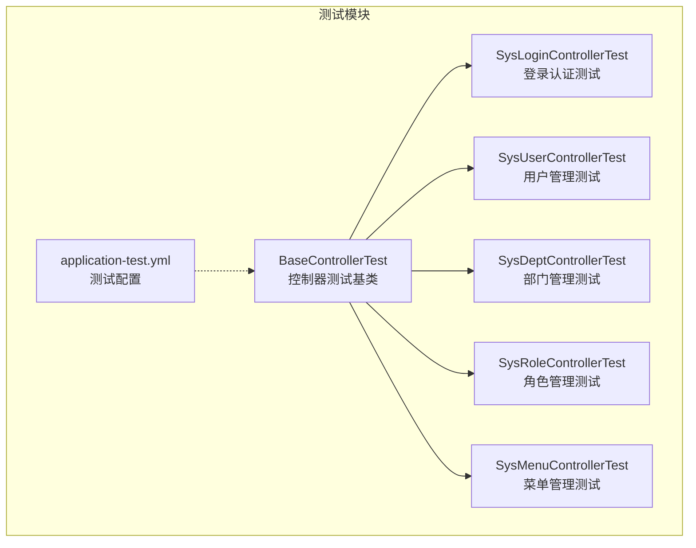
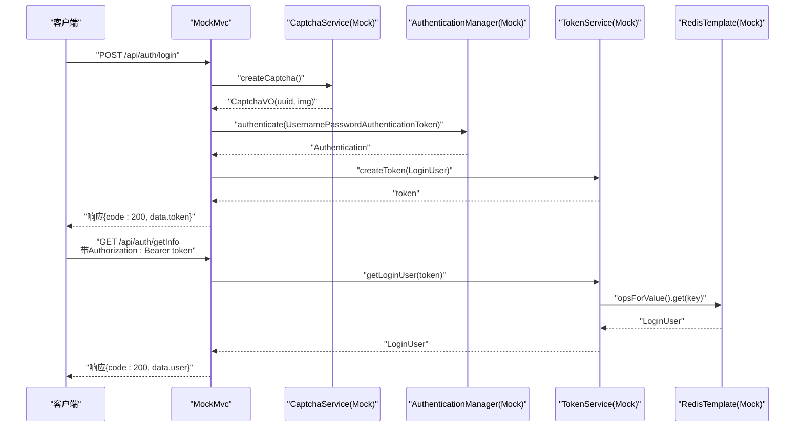
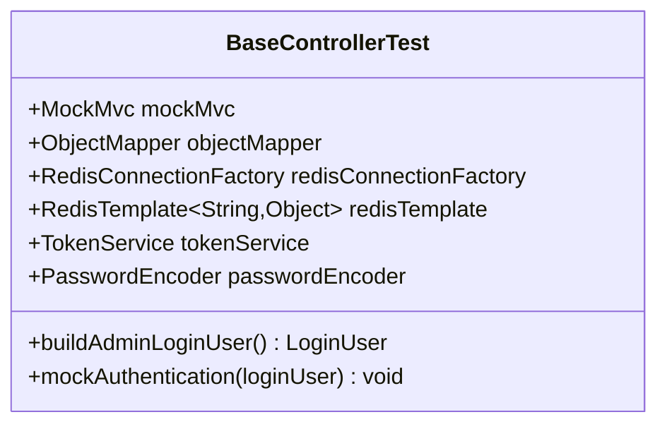
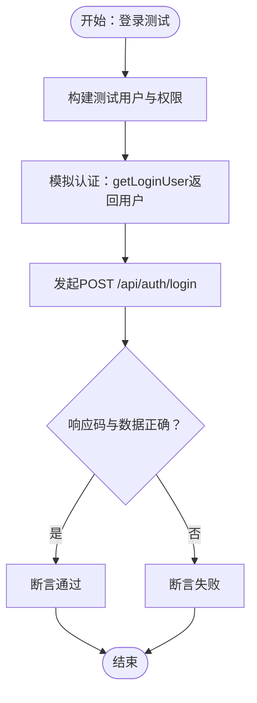
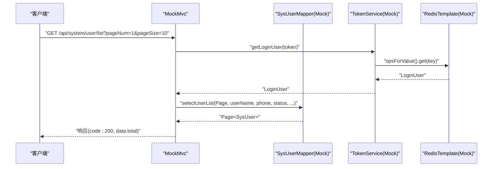
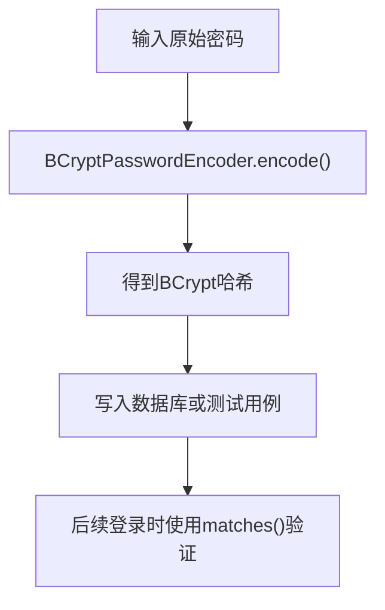
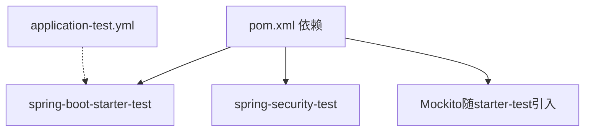

# 单元测试

<cite>
**本文引用的文件**
- [BaseControllerTest.java](file://task-manager-backend/src/test/java/com/taskmanager/controller/BaseControllerTest.java)
- [SysLoginControllerTest.java](file://task-manager-backend/src/test/java/com/taskmanager/controller/SysLoginControllerTest.java)
- [SysUserControllerTest.java](file://task-manager-backend/src/test/java/com/taskmanager/controller/SysUserControllerTest.java)
- [SysDeptControllerTest.java](file://task-manager-backend/src/test/java/com/taskmanager/controller/SysDeptControllerTest.java)
- [SysRoleControllerTest.java](file://task-manager-backend/src/test/java/com/taskmanager/controller/SysRoleControllerTest.java)
- [SysMenuControllerTest.java](file://task-manager-backend/src/test/java/com/taskmanager/controller/SysMenuControllerTest.java)
- [application-test.yml](file://task-manager-backend/src/test/resources/application-test.yml)
- [pom.xml](file://task-manager-backend/pom.xml)
- [TokenService.java](file://task-manager-backend/src/main/java/com/taskmanager/security/TokenService.java)
- [UserDetailsServiceImpl.java](file://task-manager-backend/src/main/java/com/taskmanager/security/UserDetailsServiceImpl.java)
- [PasswordTest.java](file://task-manager-backend/src/test/java/com/taskmanager/PasswordTest.java)
</cite>

## 目录
1. [简介](#简介)
2. [项目结构](#项目结构)
3. [核心组件](#核心组件)
4. [架构总览](#架构总览)
5. [详细组件分析](#详细组件分析)
6. [依赖分析](#依赖分析)
7. [性能考虑](#性能考虑)
8. [故障排查指南](#故障排查指南)
9. [结论](#结论)
10. [附录](#附录)

## 简介
本文件面向CodeBuddy任务管理系统后端的单元测试，系统性梳理了基于JUnit 5与Mockito的测试实践，覆盖控制器层的HTTP接口测试、安全与鉴权流程模拟、密码加密与验证策略、以及可复用的测试基类设计。文档同时给出最佳实践建议与覆盖率提升策略，帮助开发者高效编写高质量的单元测试。

## 项目结构
后端测试位于task-manager-backend模块的src/test路径下，采用按功能域分包组织：
- controller：控制器层测试，包含登录、用户、部门、角色、菜单等模块的测试类
- resources：测试专用配置，禁用Redis相关自动装配以保证测试稳定性
- 公共基类：BaseControllerTest提供统一的Mock配置与工具方法，便于各控制器测试复用

**图表来源**
- [BaseControllerTest.java:40-88](file://task-manager-backend/src/test/java/com/taskmanager/controller/BaseControllerTest.java#L40-L88)
- [SysLoginControllerTest.java:53-84](file://task-manager-backend/src/test/java/com/taskmanager/controller/SysLoginControllerTest.java#L53-L84)
- [SysUserControllerTest.java:44-66](file://task-manager-backend/src/test/java/com/taskmanager/controller/SysUserControllerTest.java#L44-L66)
- [SysDeptControllerTest.java:43-65](file://task-manager-backend/src/test/java/com/taskmanager/controller/SysDeptControllerTest.java#L43-L65)
- [SysRoleControllerTest.java:43-65](file://task-manager-backend/src/test/java/com/taskmanager/controller/SysRoleControllerTest.java#L43-L65)
- [SysMenuControllerTest.java:44-63](file://task-manager-backend/src/test/java/com/taskmanager/controller/SysMenuControllerTest.java#L44-L63)
- [application-test.yml:1-10](file://task-manager-backend/src/test/resources/application-test.yml#L1-L10)

**章节来源**
- [BaseControllerTest.java:40-88](file://task-manager-backend/src/test/java/com/taskmanager/controller/BaseControllerTest.java#L40-L88)
- [application-test.yml:1-10](file://task-manager-backend/src/test/resources/application-test.yml#L1-L10)

## 核心组件
- JUnit 5注解体系
  - @SpringBootTest：启动完整Spring上下文，支持Web环境随机端口
  - @AutoConfigureMockMvc：自动装配MockMvc，用于发起HTTP请求
  - @MockBean：替换或注入Mock Bean，隔离外部依赖
  - @DisplayName：为测试方法提供可读性强的名称
  - @BeforeEach/@AfterEach：在每个测试方法执行前/后执行的生命周期钩子（部分测试类中体现）
- Mockito框架
  - @Mock/@Spy：创建Mock或Spy实例（在测试类中通过@MockBean实现）
  - when(...).thenReturn(...)：定义桩方法返回值
  - verify(...)：验证方法是否被调用及调用次数
  - ArgumentMatchers：参数匹配器，如any、eq、anyString等
- 安全与鉴权
  - TokenService：负责Token创建、读取、续期与删除，并与Redis交互
  - UserDetailsServiceImpl：实现UserDetailsService，加载用户、角色与权限
- 密码加密
  - 使用BCryptPasswordEncoder进行密码编码与匹配
  - 提供独立的PasswordTest工具类用于生成与验证哈希

**章节来源**
- [SysLoginControllerTest.java:13-41](file://task-manager-backend/src/test/java/com/taskmanager/controller/SysLoginControllerTest.java#L13-L41)
- [SysUserControllerTest.java:11-32](file://task-manager-backend/src/test/java/com/taskmanager/controller/SysUserControllerTest.java#L11-L32)
- [TokenService.java:18-89](file://task-manager-backend/src/main/java/com/taskmanager/security/TokenService.java#L18-L89)
- [UserDetailsServiceImpl.java:21-59](file://task-manager-backend/src/main/java/com/taskmanager/security/UserDetailsServiceImpl.java#L21-L59)
- [PasswordTest.java:9-49](file://task-manager-backend/src/test/java/com/taskmanager/PasswordTest.java#L9-L49)

## 架构总览
以下序列图展示了登录接口的端到端测试流程，涵盖验证码、认证、Token生成与Redis存储、以及后续受保护接口的鉴权验证。

**图表来源**
- [SysLoginControllerTest.java:114-171](file://task-manager-backend/src/test/java/com/taskmanager/controller/SysLoginControllerTest.java#L114-L171)
- [TokenService.java:34-62](file://task-manager-backend/src/main/java/com/taskmanager/security/TokenService.java#L34-L62)

**章节来源**
- [SysLoginControllerTest.java:114-171](file://task-manager-backend/src/test/java/com/taskmanager/controller/SysLoginControllerTest.java#L114-L171)
- [TokenService.java:34-62](file://task-manager-backend/src/main/java/com/taskmanager/security/TokenService.java#L34-L62)

## 详细组件分析

### 控制器基类BaseControllerTest
- 设计目标
  - 统一Mock配置：集中管理MockMvc、ObjectMapper、Redis模板、TokenService与PasswordEncoder
  - 复用工具方法：提供构建管理员登录用户与模拟认证的方法，减少重复代码
- 关键点
  - @SpringBootTest(webEnvironment = RANDOM_PORT) + @AutoConfigureMockMvc：快速搭建Web测试环境
  - @MockBean：对Redis连接工厂、RedisTemplate、TokenService进行Mock，避免真实Redis依赖
  - buildAdminLoginUser：构造具备全部权限的管理员用户，便于测试受权限控制的接口
  - mockAuthentication：模拟从Token解析登录用户并从Redis读取，覆盖鉴权链路

**图表来源**
- [BaseControllerTest.java:40-88](file://task-manager-backend/src/test/java/com/taskmanager/controller/BaseControllerTest.java#L40-L88)

**章节来源**
- [BaseControllerTest.java:40-88](file://task-manager-backend/src/test/java/com/taskmanager/controller/BaseControllerTest.java#L40-L88)

### 登录认证控制器测试（SysLoginControllerTest）
- 测试范围
  - 验证码获取、登录（含验证码）、登出、获取当前用户信息、获取路由菜单
  - 验证未认证访问受保护接口返回401
- 关键测试点
  - when(captchaService.createCaptcha()).thenReturn(...)：模拟验证码生成
  - when(authenticationManager.authenticate(...)).thenReturn(...)：模拟认证成功
  - when(tokenService.createToken(...)).thenReturn(...)：模拟Token生成
  - when(tokenService.getLoginUser(anyString())).thenReturn(...)：模拟从Token解析用户
  - doThrow(...).when(...).validateCaptcha(...)：模拟验证码错误异常
  - 断言：status().isOk()、jsonPath("$.code").value(...)、jsonPath("$.data...")

**图表来源**
- [SysLoginControllerTest.java:114-171](file://task-manager-backend/src/test/java/com/taskmanager/controller/SysLoginControllerTest.java#L114-L171)

**章节来源**
- [SysLoginControllerTest.java:114-171](file://task-manager-backend/src/test/java/com/taskmanager/controller/SysLoginControllerTest.java#L114-L171)

### 用户管理控制器测试（SysUserControllerTest）
- 测试范围
  - 用户列表查询（分页+筛选）、详情查询、新增、修改（含密码更新）、删除（逻辑删除）、重置密码、修改状态
  - 无权限访问返回403
- 关键测试点
  - 构建管理员用户与模拟认证
  - when(userMapper.xxx(...)).thenReturn(...)：模拟数据访问层返回
  - 断言：jsonPath("$.data.total"/"$.data.rows[0].userName"/"$.data")

**图表来源**
- [SysUserControllerTest.java:96-122](file://task-manager-backend/src/test/java/com/taskmanager/controller/SysUserControllerTest.java#L96-L122)

**章节来源**
- [SysUserControllerTest.java:96-122](file://task-manager-backend/src/test/java/com/taskmanager/controller/SysUserControllerTest.java#L96-L122)

### 部门管理控制器测试（SysDeptControllerTest）
- 测试范围
  - 部门列表、详情、新增（顶级/子部门自动拼接祖先列表）、修改、删除（含存在下级部门的边界场景）
- 关键测试点
  - when(deptMapper.xxx(...)).thenReturn(...)：模拟树形结构与统计查询
  - 断言：jsonPath("$.data[0].deptName")

**章节来源**
- [SysDeptControllerTest.java:93-110](file://task-manager-backend/src/test/java/com/taskmanager/controller/SysDeptControllerTest.java#L93-L110)

### 角色管理控制器测试（SysRoleControllerTest）
- 测试范围
  - 角色列表（分页+筛选）、详情、新增（默认值填充）、修改、删除
- 关键测试点
  - when(roleMapper.xxx(...)).thenReturn(...)：模拟角色数据访问
  - 断言：jsonPath("$.data.rows[0].roleName")

**章节来源**
- [SysRoleControllerTest.java:93-118](file://task-manager-backend/src/test/java/com/taskmanager/controller/SysRoleControllerTest.java#L93-L118)

### 菜单管理控制器测试（SysMenuControllerTest）
- 测试范围
  - 菜单列表、菜单树、详情、新增（目录/菜单/按钮类型）、修改、删除
- 关键测试点
  - when(menuMapper.xxx(...)).thenReturn(...)：模拟菜单树与列表查询
  - 断言：jsonPath("$.data[].menuName"/"$.data")

**章节来源**
- [SysMenuControllerTest.java:91-127](file://task-manager-backend/src/test/java/com/taskmanager/controller/SysMenuControllerTest.java#L91-L127)

### 密码加密与验证测试
- 实现要点
  - 使用BCryptPasswordEncoder进行密码编码与匹配
  - 在测试中通过PasswordEncoder对原始密码进行编码，确保与数据库一致
  - 提供PasswordTest工具类，演示如何生成哈希与验证已知哈希
- 最佳实践
  - 不在测试中直接硬编码明文密码；通过PasswordEncoder生成哈希
  - 使用独立工具类生成哈希，便于批量更新用户密码

**图表来源**
- [PasswordTest.java:10-47](file://task-manager-backend/src/test/java/com/taskmanager/PasswordTest.java#L10-L47)

**章节来源**
- [PasswordTest.java:10-47](file://task-manager-backend/src/test/java/com/taskmanager/PasswordTest.java#L10-L47)

## 依赖分析
- 测试框架与Mock
  - JUnit 5：测试生命周期与断言
  - Spring Boot Test + Spring Security Test：集成测试与安全测试支持
  - Mockito：Mock Bean与桩函数
- 配置排除
  - application-test.yml禁用Redis相关自动配置，避免真实Redis影响测试
- 版本与仓库
  - pom.xml中通过Spring Boot BOM锁定版本，使用阿里云镜像加速

**图表来源**
- [pom.xml:132-145](file://task-manager-backend/pom.xml#L132-L145)
- [application-test.yml:1-10](file://task-manager-backend/src/test/resources/application-test.yml#L1-L10)

**章节来源**
- [pom.xml:132-145](file://task-manager-backend/pom.xml#L132-L145)
- [application-test.yml:1-10](file://task-manager-backend/src/test/resources/application-test.yml#L1-L10)

## 性能考虑
- 使用@AutoConfigureMockMvc避免启动完整Web服务器，提高测试执行速度
- 通过@MockBean替换外部依赖（如Redis、TokenService），减少I/O开销
- 在测试中仅模拟必要行为，避免过度复杂的桩逻辑
- 合理拆分测试用例，聚焦单一职责，降低维护成本

## 故障排查指南
- 未认证访问受保护接口返回401
  - 现象：访问需要鉴权的接口返回401
  - 排查：确认是否正确模拟tokenService.getLoginUser(...)返回非空用户
  - 参考：SysLoginControllerTest中“未认证访问受保护接口”的测试
- 验证码错误导致登录失败
  - 现象：登录接口返回错误码与消息
  - 排查：检查doThrow(...).when(captchaService).validateCaptcha(...)是否正确配置
  - 参考：SysLoginControllerTest中“验证码错误”的测试
- Redis相关异常
  - 现象：从Redis读取用户信息失败
  - 排查：确认RedisTemplate的ValueOperations被正确Mock并返回LoginUser
  - 参考：BaseControllerTest与各控制器测试中的mockAuthentication方法
- 密码不匹配
  - 现象：登录失败或用户详情校验失败
  - 排查：确认使用PasswordEncoder对原始密码进行编码后再写入或比较

**章节来源**
- [SysLoginControllerTest.java:300-307](file://task-manager-backend/src/test/java/com/taskmanager/controller/SysLoginControllerTest.java#L300-L307)
- [BaseControllerTest.java:82-87](file://task-manager-backend/src/test/java/com/taskmanager/controller/BaseControllerTest.java#L82-L87)

## 结论
通过统一的测试基类与Mock策略，结合严谨的断言与边界场景覆盖，本项目实现了高可维护性的控制器层单元测试。配合密码加密工具与禁用Redis自动配置的测试环境，能够稳定、高效地验证业务逻辑与安全流程。建议持续扩展边界与异常场景测试，进一步提升测试覆盖率与质量。

## 附录

### JUnit 5与Mockito注解与方法速查
- 测试注解
  - @SpringBootTest：启动Spring上下文
  - @AutoConfigureMockMvc：自动装配MockMvc
  - @MockBean：注入Mock Bean
  - @DisplayName：测试方法命名
  - @BeforeEach/@AfterEach：测试前后置处理
- Mockito常用方法
  - when(...).thenReturn(...)：定义桩函数
  - doThrow(...).when(...).xxx(...)：定义抛出异常
  - verify(...).xxx(...)：验证方法调用
  - any()/eq()/anyString()：参数匹配器

**章节来源**
- [SysLoginControllerTest.java:13-41](file://task-manager-backend/src/test/java/com/taskmanager/controller/SysLoginControllerTest.java#L13-L41)
- [SysUserControllerTest.java:11-32](file://task-manager-backend/src/test/java/com/taskmanager/controller/SysUserControllerTest.java#L11-L32)

### 单元测试最佳实践
- 命名规范
  - 使用@DisplayName描述测试意图，例如“用户登录 - 成功”、“获取路由信息 - 管理员获取全部菜单”
- 断言选择
  - 使用status().isOk()与jsonPath()组合断言HTTP状态与JSON响应体字段
- 测试数据准备
  - 使用PasswordEncoder对密码进行编码
  - 使用Mock Bean替代真实外部依赖
- 覆盖率提升建议
  - 补充边界与异常场景：空输入、非法参数、权限不足、Redis异常
  - 对复杂分支进行独立测试用例拆分
  - 对鉴权链路进行充分验证（Token解析、权限校验）