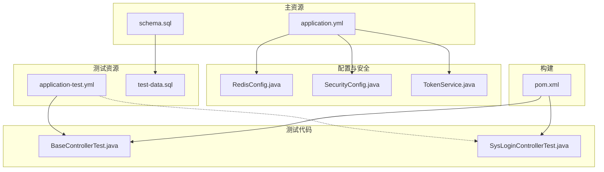
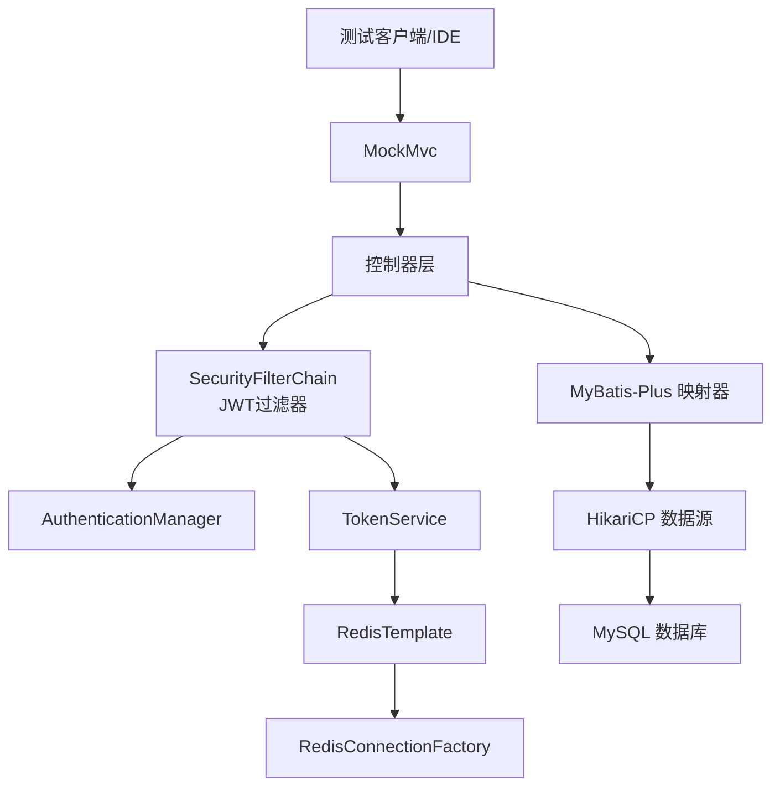
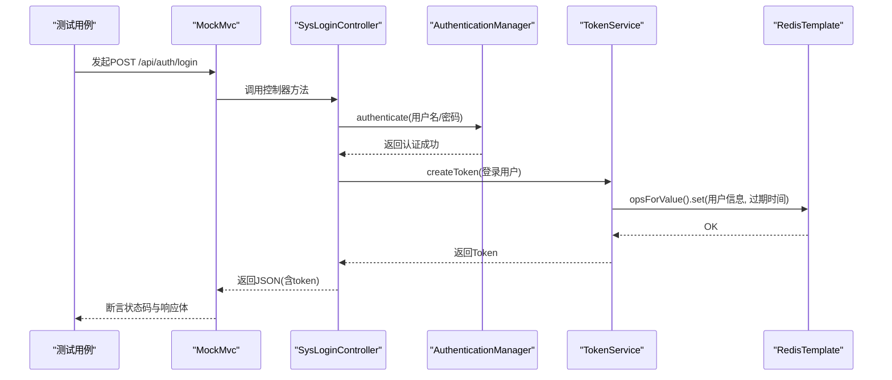

# 测试环境配置

<cite>
**本文引用的文件**
- [application-test.yml](file://task-manager-backend/src/test/resources/application-test.yml)
- [application.yml](file://task-manager-backend/src/main/resources/application.yml)
- [schema.sql](file://task-manager-backend/src/main/resources/schema.sql)
- [test-data.sql](file://task-manager-backend/src/main/resources/test-data.sql)
- [BaseControllerTest.java](file://task-manager-backend/src/test/java/com/taskmanager/controller/BaseControllerTest.java)
- [SysLoginControllerTest.java](file://task-manager-backend/src/test/java/com/taskmanager/controller/SysLoginControllerTest.java)
- [RedisConfig.java](file://task-manager-backend/src/main/java/com/taskmanager/config/RedisConfig.java)
- [SecurityConfig.java](file://task-manager-backend/src/main/java/com/taskmanager/config/SecurityConfig.java)
- [TokenService.java](file://task-manager-backend/src/main/java/com/taskmanager/security/TokenService.java)
- [pom.xml](file://task-manager-backend/pom.xml)
</cite>

## 目录
1. [引言](#引言)
2. [项目结构](#项目结构)
3. [核心组件](#核心组件)
4. [架构总览](#架构总览)
5. [详细组件分析](#详细组件分析)
6. [依赖分析](#依赖分析)
7. [性能考虑](#性能考虑)
8. [故障排查指南](#故障排查指南)
9. [结论](#结论)
10. [附录](#附录)

## 引言
本文件面向CodeBuddy任务管理系统后端的测试环境配置，目标是帮助开发者与测试工程师快速理解并搭建稳定的测试环境。文档围绕以下主题展开：
- application-test.yml测试专用配置详解（禁用Redis自动装配、禁用Redis仓库）
- 测试数据库Schema初始化与测试数据导入策略
- 测试数据准备与清理、事务管理与隔离
- 开发与测试环境的配置分离与环境变量使用
- 测试工具与Mock配置（Redis连接工厂、TokenService等）
- 测试环境启动与停止脚本建议，以及常见问题解决方案

## 项目结构
测试相关的关键位置与文件如下：
- 测试配置文件：task-manager-backend/src/test/resources/application-test.yml
- 主配置文件：task-manager-backend/src/main/resources/application.yml
- 数据库Schema：task-manager-backend/src/main/resources/schema.sql
- 测试数据：task-manager-backend/src/main/resources/test-data.sql
- 测试基类与控制器测试：task-manager-backend/src/test/java/com/taskmanager/controller/*
- 配置与安全组件：task-manager-backend/src/main/java/com/taskmanager/config/*
- 安全与Token服务：task-manager-backend/src/main/java/com/taskmanager/security/*
- 构建与依赖：task-manager-backend/pom.xml

图表来源
- [application-test.yml:1-10](file://task-manager-backend/src/test/resources/application-test.yml#L1-L10)
- [application.yml:1-79](file://task-manager-backend/src/main/resources/application.yml#L1-L79)
- [schema.sql:1-608](file://task-manager-backend/src/main/resources/schema.sql#L1-L608)
- [test-data.sql:1-558](file://task-manager-backend/src/main/resources/test-data.sql#L1-L558)
- [BaseControllerTest.java:1-89](file://task-manager-backend/src/test/java/com/taskmanager/controller/BaseControllerTest.java#L1-L89)
- [SysLoginControllerTest.java:1-309](file://task-manager-backend/src/test/java/com/taskmanager/controller/SysLoginControllerTest.java#L1-L309)
- [RedisConfig.java:1-33](file://task-manager-backend/src/main/java/com/taskmanager/config/RedisConfig.java#L1-L33)
- [SecurityConfig.java:1-116](file://task-manager-backend/src/main/java/com/taskmanager/config/SecurityConfig.java#L1-L116)
- [TokenService.java:1-89](file://task-manager-backend/src/main/java/com/taskmanager/security/TokenService.java#L1-L89)
- [pom.xml:1-206](file://task-manager-backend/pom.xml#L1-L206)

章节来源
- [application-test.yml:1-10](file://task-manager-backend/src/test/resources/application-test.yml#L1-L10)
- [application.yml:1-79](file://task-manager-backend/src/main/resources/application.yml#L1-L79)
- [schema.sql:1-608](file://task-manager-backend/src/main/resources/schema.sql#L1-L608)
- [test-data.sql:1-558](file://task-manager-backend/src/main/resources/test-data.sql#L1-L558)
- [BaseControllerTest.java:1-89](file://task-manager-backend/src/test/java/com/taskmanager/controller/BaseControllerTest.java#L1-L89)
- [SysLoginControllerTest.java:1-309](file://task-manager-backend/src/test/java/com/taskmanager/controller/SysLoginControllerTest.java#L1-L309)
- [RedisConfig.java:1-33](file://task-manager-backend/src/main/java/com/taskmanager/config/RedisConfig.java#L1-L33)
- [SecurityConfig.java:1-116](file://task-manager-backend/src/main/java/com/taskmanager/config/SecurityConfig.java#L1-L116)
- [TokenService.java:1-89](file://task-manager-backend/src/main/java/com/taskmanager/security/TokenService.java#L1-L89)
- [pom.xml:1-206](file://task-manager-backend/pom.xml#L1-L206)

## 核心组件
- 测试配置文件application-test.yml：明确禁用Redis自动装配与Redis仓库，确保测试中不依赖真实Redis实例。
- 主配置application.yml：定义MySQL数据源、Redis连接、MyBatis-Plus、Jackson、JWT、服务端口、Knife4j等生产环境配置。
- Schema与测试数据：schema.sql负责数据库初始化，test-data.sql提供全场景测试数据。
- 测试基类BaseControllerTest：统一Mock配置（RedisTemplate、TokenService、AuthenticationManager等），提供构建登录用户与模拟认证的方法。
- 安全与Redis配置：SecurityConfig定义无状态JWT过滤链；RedisConfig定义序列化策略；TokenService封装Redis中的Token生命周期。

章节来源
- [application-test.yml:1-10](file://task-manager-backend/src/test/resources/application-test.yml#L1-L10)
- [application.yml:1-79](file://task-manager-backend/src/main/resources/application.yml#L1-L79)
- [schema.sql:1-608](file://task-manager-backend/src/main/resources/schema.sql#L1-L608)
- [test-data.sql:1-558](file://task-manager-backend/src/main/resources/test-data.sql#L1-L558)
- [BaseControllerTest.java:1-89](file://task-manager-backend/src/test/java/com/taskmanager/controller/BaseControllerTest.java#L1-L89)
- [SecurityConfig.java:1-116](file://task-manager-backend/src/main/java/com/taskmanager/config/SecurityConfig.java#L1-L116)
- [RedisConfig.java:1-33](file://task-manager-backend/src/main/java/com/taskmanager/config/RedisConfig.java#L1-L33)
- [TokenService.java:1-89](file://task-manager-backend/src/main/java/com/taskmanager/security/TokenService.java#L1-L89)

## 架构总览
测试环境整体架构围绕“无真实外部依赖”的原则设计，通过Mock与内存化配置实现快速、稳定、可重复的测试执行。

图表来源
- [SysLoginControllerTest.java:48-53](file://task-manager-backend/src/test/java/com/taskmanager/controller/SysLoginControllerTest.java#L48-L53)
- [BaseControllerTest.java:40-87](file://task-manager-backend/src/test/java/com/taskmanager/controller/BaseControllerTest.java#L40-L87)
- [SecurityConfig.java:47-96](file://task-manager-backend/src/main/java/com/taskmanager/config/SecurityConfig.java#L47-L96)
- [TokenService.java:34-80](file://task-manager-backend/src/main/java/com/taskmanager/security/TokenService.java#L34-L80)
- [RedisConfig.java:18-31](file://task-manager-backend/src/main/java/com/taskmanager/config/RedisConfig.java#L18-L31)
- [application.yml:5-44](file://task-manager-backend/src/main/resources/application.yml#L5-L44)

## 详细组件分析

### 测试配置文件 application-test.yml 解析
- 目的：在测试环境中禁用Redis自动装配与仓库，避免加载真实Redis连接，保证测试独立性与稳定性。
- 关键点：
  - spring.autoconfigure.exclude：排除RedisReactive自动配置，防止自动注入Redis相关Bean。
  - spring.data.redis.repositories.enabled：关闭Redis仓库，避免扫描到Redis实体映射。
- 适用范围：所有基于@SpringBootTest的集成测试，可通过注解或全局配置生效。

章节来源
- [application-test.yml:1-10](file://task-manager-backend/src/test/resources/application-test.yml#L1-L10)

### 主配置文件 application.yml 解析
- 数据源配置（MySQL + HikariCP）：定义连接URL、用户名、密码、驱动、连接池参数。
- Redis配置：host、port、database、timeout、Lettuce连接池参数。
- MyBatis-Plus：驼峰映射、日志实现、Mapper XML路径、逻辑删除字段配置。
- Jackson：日期格式与时区。
- JWT：密钥、过期时间、Header与前缀。
- 服务端口：server.port。
- Knife4j：Swagger UI与OpenAPI文档路径与分组。

章节来源
- [application.yml:1-79](file://task-manager-backend/src/main/resources/application.yml#L1-L79)

### 数据库初始化与测试数据
- Schema初始化：schema.sql创建数据库与所有业务表（用户、角色、菜单、部门、字典、日志、供应商、仓库、商品、库存、电商模块等），并插入基础数据。
- 测试数据：test-data.sql提供全场景覆盖的扩展数据，包括：
  - 部门、角色、用户、权限、菜单、字典、日志、供应商、仓库、商品、库存、电商客户、购物车、订单等。
  - 涵盖停用/删除状态、多级部门树、多角色权限、多仓库库存、多状态订单等边界场景。
- 执行顺序建议：先执行schema.sql初始化数据库与基础数据，再执行test-data.sql导入全量测试数据。

章节来源
- [schema.sql:1-608](file://task-manager-backend/src/main/resources/schema.sql#L1-L608)
- [test-data.sql:1-558](file://task-manager-backend/src/main/resources/test-data.sql#L1-L558)

### 测试数据准备策略
- 初始数据插入：
  - 使用schema.sql初始化数据库与基础数据。
  - 使用test-data.sql导入全量测试数据，覆盖用户管理、角色权限、部门组织、供应商管理、WMS商品、日志审计、电商模块等。
- 测试前后数据清理：
  - 建议在每个测试类或测试方法结束后执行清理脚本，删除本次测试产生的临时数据，避免影响其他测试。
  - 对于幂等性要求高的测试，可在测试开始前重建最小化数据集。
- 事务管理：
  - Spring Boot测试默认使用事务回滚，确保测试间隔离。
  - 对于涉及外部资源（如Redis）的测试，应通过Mock替代真实连接，避免事务无法回滚外部资源状态。

章节来源
- [schema.sql:1-608](file://task-manager-backend/src/main/resources/schema.sql#L1-L608)
- [test-data.sql:1-558](file://task-manager-backend/src/main/resources/test-data.sql#L1-L558)
- [BaseControllerTest.java:40-87](file://task-manager-backend/src/test/java/com/taskmanager/controller/BaseControllerTest.java#L40-L87)

### 测试环境隔离机制
- 配置分离：
  - application-test.yml用于测试环境，禁用Redis自动装配与仓库。
  - application.yml用于开发/生产环境，包含完整配置。
- 环境变量：
  - 可通过Spring Profiles激活测试配置（例如spring.profiles.active=test），并在CI中通过环境变量覆盖敏感配置。
- 测试基类统一Mock：
  - BaseControllerTest集中定义MockBean（RedisTemplate、TokenService、AuthenticationManager等），确保测试间一致性与隔离。

章节来源
- [application-test.yml:1-10](file://task-manager-backend/src/test/resources/application-test.yml#L1-L10)
- [BaseControllerTest.java:34-59](file://task-manager-backend/src/test/java/com/taskmanager/controller/BaseControllerTest.java#L34-L59)

### 测试工具与Mock配置
- Redis连接工厂与模板：
  - 在测试中通过@MockBean注入RedisConnectionFactory与RedisTemplate，避免真实Redis依赖。
  - RedisConfig定义了序列化策略，确保复杂对象在Redis中正确存储与读取。
- TokenService模拟：
  - 通过@MockBean注入TokenService，模拟createToken、getLoginUser、refreshToken、delLoginUser等行为。
  - BaseControllerTest提供mockAuthentication方法，模拟从Redis读取登录用户。
- 认证与授权：
  - SecurityConfig定义无状态JWT过滤链，放行认证相关接口，其余接口需认证。
  - SysLoginControllerTest演示验证码、登录、登出、获取用户信息与路由等接口的Mock测试。

章节来源
- [RedisConfig.java:18-31](file://task-manager-backend/src/main/java/com/taskmanager/config/RedisConfig.java#L18-L31)
- [TokenService.java:34-80](file://task-manager-backend/src/main/java/com/taskmanager/security/TokenService.java#L34-L80)
- [BaseControllerTest.java:40-87](file://task-manager-backend/src/test/java/com/taskmanager/controller/BaseControllerTest.java#L40-L87)
- [SecurityConfig.java:47-96](file://task-manager-backend/src/main/java/com/taskmanager/config/SecurityConfig.java#L47-L96)
- [SysLoginControllerTest.java:48-53](file://task-manager-backend/src/test/java/com/taskmanager/controller/SysLoginControllerTest.java#L48-L53)

### 测试流程时序（以登录接口为例）

图表来源
- [SysLoginControllerTest.java:128-147](file://task-manager-backend/src/test/java/com/taskmanager/controller/SysLoginControllerTest.java#L128-L147)
- [TokenService.java:34-41](file://task-manager-backend/src/main/java/com/taskmanager/security/TokenService.java#L34-L41)
- [BaseControllerTest.java:83-87](file://task-manager-backend/src/test/java/com/taskmanager/controller/BaseControllerTest.java#L83-L87)

## 依赖分析
- 测试依赖：
  - spring-boot-starter-test、spring-security-test、Mockito（通过BOM版本管理）。
- 构建插件：
  - maven-surefire-plugin开启必要JVM参数，确保测试运行稳定。
- 仓库与镜像：
  - Maven Central优先，阿里云公共仓库作为镜像加速。

章节来源
- [pom.xml:132-145](file://task-manager-backend/pom.xml#L132-L145)
- [pom.xml:191-202](file://task-manager-backend/pom.xml#L191-L202)
- [pom.xml:147-160](file://task-manager-backend/pom.xml#L147-L160)

## 性能考虑
- 测试数据库：建议使用内存数据库（如H2）或本地MySQL实例，避免网络延迟。
- 连接池：测试环境可适当降低最大连接数，减少资源占用。
- 日志：测试阶段可关闭冗余日志输出，提高测试执行速度。
- Mock策略：优先使用Mock替代真实外部依赖，减少I/O与网络开销。

## 故障排查指南
- Redis相关错误：
  - 症状：测试中出现Redis连接异常或自动装配失败。
  - 处理：确认application-test.yml已禁用Redis自动装配与仓库；检查测试类是否正确注入@MockBean。
- 认证失败（401）：
  - 症状：访问受保护接口返回401。
  - 处理：确认BaseControllerTest中mockAuthentication已正确模拟TokenService与RedisTemplate；检查JWT头是否正确传递。
- 数据不一致：
  - 症状：测试间相互影响或数据污染。
  - 处理：确保每个测试方法或类结束后执行清理脚本；使用事务回滚；避免在测试中直接操作真实Redis。
- 密码匹配问题：
  - 症状：登录失败或密码校验异常。
  - 处理：使用BCrypt进行密码编码，参考PasswordTest工具生成哈希；在schema.sql或test-data.sql中使用正确的哈希值。

章节来源
- [application-test.yml:1-10](file://task-manager-backend/src/test/resources/application-test.yml#L1-L10)
- [BaseControllerTest.java:83-87](file://task-manager-backend/src/test/java/com/taskmanager/controller/BaseControllerTest.java#L83-L87)
- [PasswordTest.java:1-49](file://task-manager-backend/src/test/java/com/taskmanager/PasswordTest.java#L1-L49)

## 结论
通过application-test.yml的Redis禁用配置、application.yml的生产配置、schema.sql与test-data.sql的完整数据准备，以及BaseControllerTest的统一Mock策略，CodeBuddy任务管理系统的测试环境实现了与生产环境的清晰分离、高度可控与稳定可重复。配合事务回滚与数据清理策略，可进一步提升测试效率与可靠性。

## 附录
- 启动与停止脚本建议（概念性说明）：
  - 启动：设置spring.profiles.active=test，启动后执行schema.sql与test-data.sql初始化数据库。
  - 停止：执行清理脚本删除测试数据，停止应用。
- 常见问题清单：
  - Redis自动装配导致测试失败 → 使用application-test.yml禁用。
  - 401未认证 → 检查TokenService与RedisTemplate的Mock配置。
  - 密码不匹配 → 使用BCrypt生成哈希并更新数据库。
  - 数据污染 → 使用事务回滚与测试后清理。