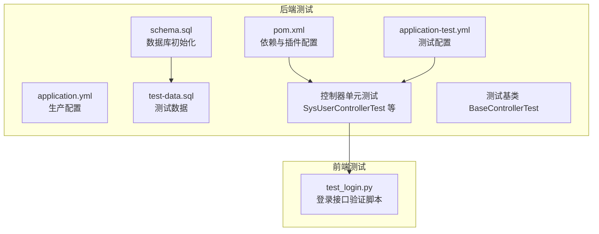
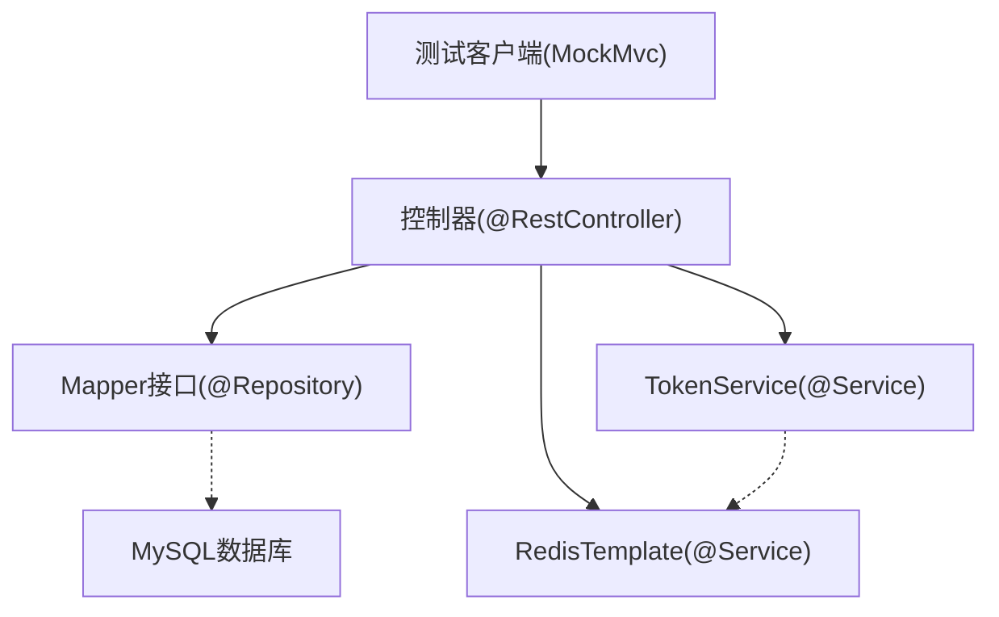
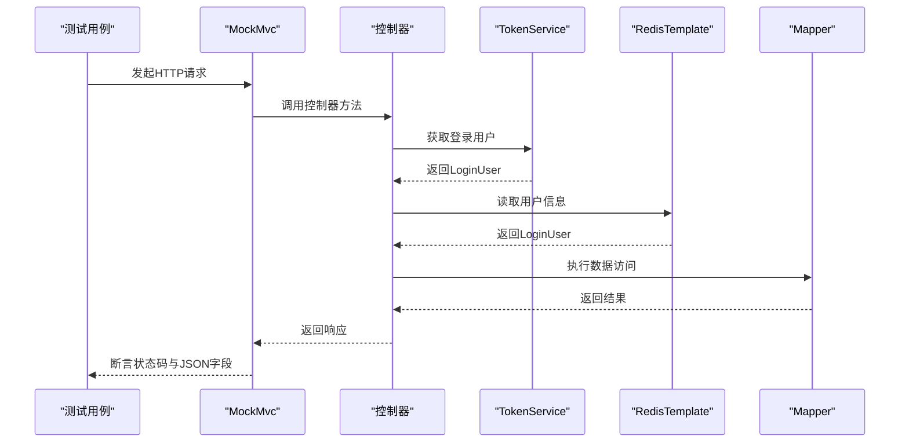
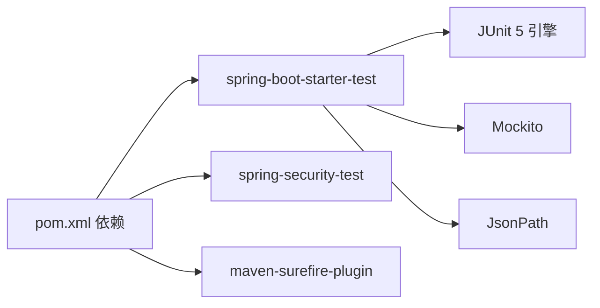

# 测试策略

<cite>
**本文引用的文件**
- [pom.xml](file://task-manager-backend/pom.xml)
- [application.yml](file://task-manager-backend/src/main/resources/application.yml)
- [application-test.yml](file://task-manager-backend/src/test/resources/application-test.yml)
- [schema.sql](file://task-manager-backend/src/main/resources/schema.sql)
- [test-data.sql](file://task-manager-backend/src/main/resources/test-data.sql)
- [SysUserControllerTest.java](file://task-manager-backend/src/test/java/com/taskmanager/controller/SysUserControllerTest.java)
- [SysDeptControllerTest.java](file://task-manager-backend/src/test/java/com/taskmanager/controller/SysDeptControllerTest.java)
- [SysRoleControllerTest.java](file://task-manager-backend/src/test/java/com/taskmanager/controller/SysRoleControllerTest.java)
- [SysDictDataControllerTest.java](file://task-manager-backend/src/test/java/com/taskmanager/controller/SysDictDataControllerTest.java)
- [SysDictTypeControllerTest.java](file://task-manager-backend/src/test/java/com/taskmanager/controller/SysDictTypeControllerTest.java)
- [BaseControllerTest.java](file://task-manager-backend/src/test/java/com/taskmanager/controller/BaseControllerTest.java)
- [PasswordTest.java](file://task-manager-backend/src/test/java/com/taskmanager/PasswordTest.java)
- [test_login.py](file://test_login.py)
</cite>

## 目录
1. [引言](#引言)
2. [项目结构](#项目结构)
3. [核心组件](#核心组件)
4. [架构总览](#架构总览)
5. [详细组件分析](#详细组件分析)
6. [依赖分析](#依赖分析)
7. [性能考虑](#性能考虑)
8. [故障排查指南](#故障排查指南)
9. [结论](#结论)
10. [附录](#附录)

## 引言
本测试策略文档面向CodeBuddy任务管理系统，围绕后端Spring Boot应用与前端Vue应用，系统化阐述单元测试、集成测试与端到端测试的实施方法，涵盖：
- 单元测试：基于JUnit 5与Mockito，结合Spring Boot Test与MockMvc进行控制器测试。
- 集成测试：基于测试配置与测试数据库脚本，验证接口行为与数据一致性。
- 端到端测试：通过Python脚本对登录接口进行简单验证，为后续引入浏览器自动化奠定基础。
- 测试环境：测试数据库初始化、测试数据准备、测试配置管理。
- 覆盖率与CI：测试覆盖率要求与持续集成中的测试自动化与报告生成建议。

## 项目结构
后端采用Spring Boot工程，测试位于task-manager-backend模块；前端为独立的Vue项目。测试策略以后端为核心，前端通过接口联调与端到端脚本进行验证。

**图表来源**
- [pom.xml:132-145](file://task-manager-backend/pom.xml#L132-L145)
- [application-test.yml:1-10](file://task-manager-backend/src/test/resources/application-test.yml#L1-L10)
- [schema.sql:1-608](file://task-manager-backend/src/main/resources/schema.sql#L1-L608)
- [test-data.sql:1-558](file://task-manager-backend/src/main/resources/test-data.sql#L1-L558)
- [SysUserControllerTest.java:1-316](file://task-manager-backend/src/test/java/com/taskmanager/controller/SysUserControllerTest.java#L1-L316)
- [BaseControllerTest.java:1-89](file://task-manager-backend/src/test/java/com/taskmanager/controller/BaseControllerTest.java#L1-L89)
- [test_login.py:1-24](file://test_login.py#L1-L24)

**章节来源**
- [pom.xml:132-145](file://task-manager-backend/pom.xml#L132-L145)
- [application.yml:1-79](file://task-manager-backend/src/main/resources/application.yml#L1-L79)
- [application-test.yml:1-10](file://task-manager-backend/src/test/resources/application-test.yml#L1-L10)
- [schema.sql:1-608](file://task-manager-backend/src/main/resources/schema.sql#L1-L608)
- [test-data.sql:1-558](file://task-manager-backend/src/main/resources/test-data.sql#L1-L558)

## 核心组件
- 测试框架与工具
  - JUnit 5：测试生命周期与断言。
  - Spring Boot Test：启动Web环境与自动装配。
  - MockMvc：对控制器进行HTTP层面的模拟请求与断言。
  - Mockito：Mock Bean与外部依赖，隔离业务逻辑。
  - Jackson ObjectMapper：JSON序列化与反序列化。
- 测试配置
  - application-test.yml：禁用Redis自动配置，避免测试期间连接真实Redis。
  - pom.xml：Surefire插件配置，支持Java模块系统与注解处理器。
- 测试数据
  - schema.sql：初始化数据库结构。
  - test-data.sql：全场景测试数据，覆盖用户、角色、部门、字典、电商等业务域。

**章节来源**
- [pom.xml:190-202](file://task-manager-backend/pom.xml#L190-L202)
- [application-test.yml:1-10](file://task-manager-backend/src/test/resources/application-test.yml#L1-L10)
- [schema.sql:1-608](file://task-manager-backend/src/main/resources/schema.sql#L1-L608)
- [test-data.sql:1-558](file://task-manager-backend/src/main/resources/test-data.sql#L1-L558)

## 架构总览
后端测试采用“控制器层+服务层Mock”的架构，通过MockMvc发起HTTP请求，TokenService与RedisTemplate被Mock以模拟鉴权与会话。测试基类BaseControllerTest提供通用的登录用户构建与认证模拟能力。

**图表来源**
- [SysUserControllerTest.java:46-66](file://task-manager-backend/src/test/java/com/taskmanager/controller/SysUserControllerTest.java#L46-L66)
- [BaseControllerTest.java:42-58](file://task-manager-backend/src/test/java/com/taskmanager/controller/BaseControllerTest.java#L42-L58)

**章节来源**
- [SysUserControllerTest.java:46-66](file://task-manager-backend/src/test/java/com/taskmanager/controller/SysUserControllerTest.java#L46-L66)
- [BaseControllerTest.java:42-58](file://task-manager-backend/src/test/java/com/taskmanager/controller/BaseControllerTest.java#L42-L58)

## 详细组件分析

### 单元测试设计与实现（JUnit 5 + Mockito）
- 测试注解与配置
  - @SpringBootTest：加载应用上下文，支持随机端口与Web环境。
  - @AutoConfigureMockMvc：自动装配MockMvc。
  - @MockBean：替换真实Bean为Mock实例，隔离外部依赖。
- 请求与断言
  - 使用MockMvc.perform发起GET/POST/PUT/DELETE请求。
  - 断言状态码与JSON响应字段（如$.code、$.data）。
- 认证与权限
  - 通过TokenService与RedisTemplate的Mock，模拟已登录用户与权限集合。
  - 无权限场景断言返回403 Forbidden。

**图表来源**
- [SysUserControllerTest.java:96-122](file://task-manager-backend/src/test/java/com/taskmanager/controller/SysUserControllerTest.java#L96-L122)
- [BaseControllerTest.java:82-87](file://task-manager-backend/src/test/java/com/taskmanager/controller/BaseControllerTest.java#L82-L87)

**章节来源**
- [SysUserControllerTest.java:96-122](file://task-manager-backend/src/test/java/com/taskmanager/controller/SysUserControllerTest.java#L96-L122)
- [SysDeptControllerTest.java:93-110](file://task-manager-backend/src/test/java/com/taskmanager/controller/SysDeptControllerTest.java#L93-L110)
- [SysRoleControllerTest.java:93-118](file://task-manager-backend/src/test/java/com/taskmanager/controller/SysRoleControllerTest.java#L93-L118)
- [SysDictDataControllerTest.java:95-120](file://task-manager-backend/src/test/java/com/taskmanager/controller/SysDictDataControllerTest.java#L95-L120)
- [SysDictTypeControllerTest.java:94-119](file://task-manager-backend/src/test/java/com/taskmanager/controller/SysDictTypeControllerTest.java#L94-L119)
- [BaseControllerTest.java:82-87](file://task-manager-backend/src/test/java/com/taskmanager/controller/BaseControllerTest.java#L82-L87)

### 控制器测试基类（BaseControllerTest）
- 职责
  - 提供MockMvc与ObjectMapper注入。
  - 提供Mock Redis与TokenService的能力。
  - 提供构建管理员LoginUser与模拟认证的方法。
- 价值
  - 统一测试基线，减少重复代码，便于扩展更多控制器测试。

**章节来源**
- [BaseControllerTest.java:40-89](file://task-manager-backend/src/test/java/com/taskmanager/controller/BaseControllerTest.java#L40-L89)

### 用户管理控制器测试（SysUserControllerTest）
- 覆盖场景
  - 列表查询（分页、筛选条件）。
  - 详情查询。
  - 新增、修改、删除（逻辑删除）。
  - 重置密码。
  - 修改状态。
  - 无权限访问返回403。
- 关键点
  - 使用Mock分页结果与Mapper返回值。
  - 对密码重置接口断言不再返回明文密码。

**章节来源**
- [SysUserControllerTest.java:96-314](file://task-manager-backend/src/test/java/com/taskmanager/controller/SysUserControllerTest.java#L96-L314)

### 部门管理控制器测试（SysDeptControllerTest）
- 覆盖场景
  - 列表查询（树形结构）。
  - 详情查询。
  - 新增顶级部门与子部门（祖先列表自动拼接）。
  - 修改、删除（存在子部门时禁止删除）。
- 关键点
  - 验证父子关系与祖先列表逻辑。
  - 删除前检查子部门数量。

**章节来源**
- [SysDeptControllerTest.java:93-250](file://task-manager-backend/src/test/java/com/taskmanager/controller/SysDeptControllerTest.java#L93-L250)

### 角色管理控制器测试（SysRoleControllerTest）
- 覆盖场景
  - 列表查询（分页、筛选）。
  - 详情查询。
  - 新增（默认值填充）。
  - 修改、删除（批量与单个）。
  - 无权限访问返回403。
- 关键点
  - 验证默认字段（如dataScope、delFlag）的处理。

**章节来源**
- [SysRoleControllerTest.java:93-275](file://task-manager-backend/src/test/java/com/taskmanager/controller/SysRoleControllerTest.java#L93-L275)

### 字典数据与类型控制器测试（SysDictDataControllerTest、SysDictTypeControllerTest）
- 覆盖场景
  - 列表查询（按类型筛选）。
  - 公开接口按类型查询（无需认证）。
  - 详情查询。
  - 新增（默认值填充）、修改、删除。
- 关键点
  - 公开接口断言无需Authorization头。
  - 默认状态与默认标记字段的处理。

**章节来源**
- [SysDictDataControllerTest.java:95-268](file://task-manager-backend/src/test/java/com/taskmanager/controller/SysDictDataControllerTest.java#L95-L268)
- [SysDictTypeControllerTest.java:94-251](file://task-manager-backend/src/test/java/com/taskmanager/controller/SysDictTypeControllerTest.java#L94-L251)

### 密码测试工具（PasswordTest）
- 用途
  - 生成BCrypt哈希，验证已知哈希，输出SQL更新语句。
- 应用
  - 在测试数据准备阶段，确保用户密码字段使用正确的BCrypt哈希。

**章节来源**
- [PasswordTest.java:1-49](file://task-manager-backend/src/test/java/com/taskmanager/PasswordTest.java#L1-L49)

### 端到端测试（Python脚本）
- 用途
  - 验证登录接口的基本连通性与返回格式。
- 方法
  - 使用requests发送POST请求到http://localhost:8080/api/auth/login。
  - 输出状态码与响应JSON。
- 建议
  - 后续可引入Selenium或Playwright进行浏览器自动化，覆盖更完整的用户操作流程。

**章节来源**
- [test_login.py:1-24](file://test_login.py#L1-L24)

## 依赖分析
- 测试依赖
  - spring-boot-starter-test：JUnit引擎、Mockito、AssertJ、JsonPath等。
  - spring-security-test：安全测试支持。
  - Surefire插件：测试执行与参数配置。
- 配置排除
  - application-test.yml排除Redis自动配置，避免测试期间连接真实Redis。

**图表来源**
- [pom.xml:132-145](file://task-manager-backend/pom.xml#L132-L145)
- [pom.xml:190-202](file://task-manager-backend/pom.xml#L190-L202)

**章节来源**
- [pom.xml:132-145](file://task-manager-backend/pom.xml#L132-L145)
- [application-test.yml:1-10](file://task-manager-backend/src/test/resources/application-test.yml#L1-L10)

## 性能考虑
- 测试执行性能
  - 使用Mock替代真实数据库与Redis，显著降低测试执行时间。
  - 通过分页与条件筛选测试，避免一次性加载大量数据。
- 数据准备效率
  - 使用schema.sql与test-data.sql快速初始化测试数据库，保证测试稳定性与可重复性。
- 并发与隔离
  - 每个测试用例独立Mock，避免共享状态导致的竞态条件。

## 故障排查指南
- 常见问题
  - Redis自动配置导致测试失败：确认application-test.yml已排除Redis自动配置。
  - 认证失败：检查TokenService与RedisTemplate的Mock实现，确保返回正确的LoginUser。
  - JSON断言失败：核对响应结构与字段名，必要时打印响应体辅助调试。
  - 数据库连接异常：确认MySQL服务可用，数据库与用户权限正确。
- 解决步骤
  - 启用详细日志，观察测试执行过程。
  - 使用最小化用例复现问题，逐步缩小范围。
  - 检查测试数据是否完整，特别是字典、角色与权限映射。

**章节来源**
- [application-test.yml:1-10](file://task-manager-backend/src/test/resources/application-test.yml#L1-L10)
- [SysUserControllerTest.java:96-122](file://task-manager-backend/src/test/java/com/taskmanager/controller/SysUserControllerTest.java#L96-L122)

## 结论
本测试策略以控制器层单元测试为核心，结合Mock与测试数据，实现了对用户、部门、角色、字典等核心业务的全面验证。通过测试基类统一认证与Mock机制，提升了测试可维护性。建议后续补充浏览器自动化端到端测试，并在CI中集成覆盖率统计与报告生成，以进一步保障代码质量与交付效率。

## 附录

### 测试环境配置
- 测试数据库
  - 初始化：执行schema.sql创建数据库与表结构。
  - 测试数据：执行test-data.sql插入全场景测试数据。
- 测试配置
  - application-test.yml：禁用Redis自动配置，确保测试隔离。
- 运行方式
  - 使用Maven执行测试：mvn test。
  - 端到端脚本：python test_login.py。

**章节来源**
- [schema.sql:1-608](file://task-manager-backend/src/main/resources/schema.sql#L1-L608)
- [test-data.sql:1-558](file://task-manager-backend/src/main/resources/test-data.sql#L1-L558)
- [application-test.yml:1-10](file://task-manager-backend/src/test/resources/application-test.yml#L1-L10)
- [test_login.py:1-24](file://test_login.py#L1-L24)

### 测试覆盖率与CI建议
- 覆盖率要求
  - 建议单元测试行覆盖率≥80%，分支覆盖率≥70%。
  - 集成测试覆盖率关注关键业务路径与异常场景。
- CI集成
  - 在CI流水线中执行mvn test，并生成Surefire报告。
  - 使用JaCoCo或SonarQube收集覆盖率数据，生成报告并告警阈值。
  - 端到端测试可在独立Job中运行，确保浏览器与后端服务可用。

[本节为通用指导，无需具体文件引用]