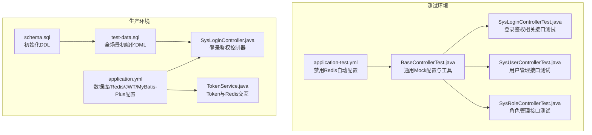
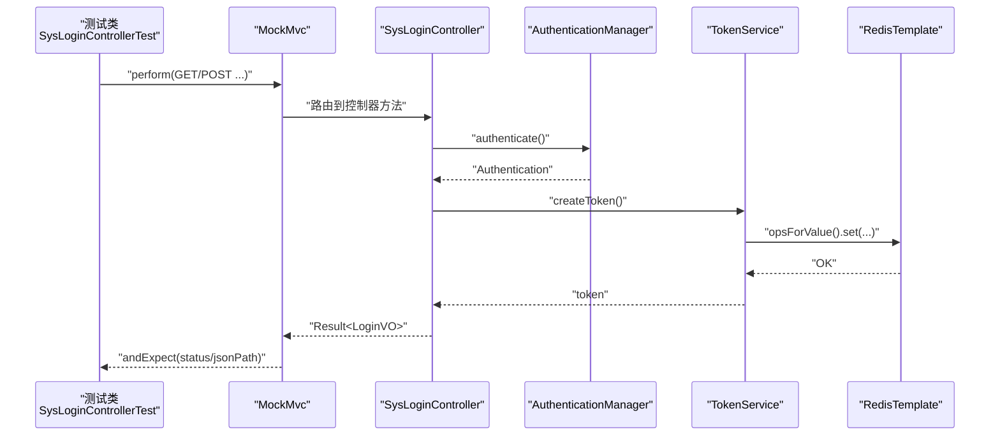
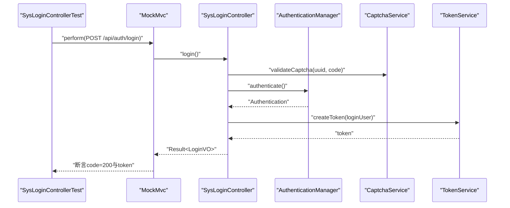
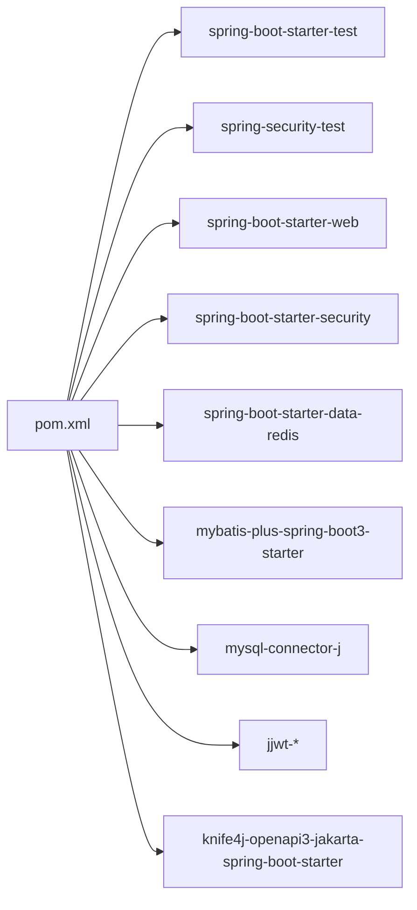

# 集成测试

<cite>
**本文引用的文件**
- [application-test.yml](file://task-manager-backend/src/test/resources/application-test.yml)
- [BaseControllerTest.java](file://task-manager-backend/src/test/java/com/taskmanager/controller/BaseControllerTest.java)
- [SysLoginControllerTest.java](file://task-manager-backend/src/test/java/com/taskmanager/controller/SysLoginControllerTest.java)
- [SysUserControllerTest.java](file://task-manager-backend/src/test/java/com/taskmanager/controller/SysUserControllerTest.java)
- [SysRoleControllerTest.java](file://task-manager-backend/src/test/java/com/taskmanager/controller/SysRoleControllerTest.java)
- [application.yml](file://task-manager-backend/src/main/resources/application.yml)
- [SysLoginController.java](file://task-manager-backend/src/main/java/com/taskmanager/controller/SysLoginController.java)
- [TokenService.java](file://task-manager-backend/src/main/java/com/taskmanager/security/TokenService.java)
- [pom.xml](file://task-manager-backend/pom.xml)
- [schema.sql](file://task-manager-backend/src/main/resources/schema.sql)
- [test-data.sql](file://task-manager-backend/src/main/resources/test-data.sql)
</cite>

## 目录
1. [引言](#引言)
2. [项目结构](#项目结构)
3. [核心组件](#核心组件)
4. [架构总览](#架构总览)
5. [详细组件分析](#详细组件分析)
6. [依赖分析](#依赖分析)
7. [性能考虑](#性能考虑)
8. [故障排查指南](#故障排查指南)
9. [结论](#结论)
10. [附录](#附录)

## 引言
本文件面向CodeBuddy任务管理系统后端的集成测试，系统性梳理Spring Boot Test在Web层的配置与使用、MockMvc在控制器层的测试策略、测试配置文件application-test.yml的作用与关键项、控制器层集成测试的实现范式（以SysLoginControllerTest等为例）、数据库测试的准备与回滚策略，并总结编写规范与最佳实践。目标是帮助开发者快速理解并高效编写高质量的集成测试。

## 项目结构
后端采用Spring Boot工程，测试代码位于task-manager-backend/src/test目录，资源位于src/test/resources；生产代码位于src/main目录，资源位于src/main/resources。测试配置文件application-test.yml用于禁用Redis自动配置，避免测试期间对真实Redis的依赖；生产配置application.yml定义了数据库、Redis、MyBatis-Plus、JWT等关键参数。

图表来源
- [application-test.yml:1-10](file://task-manager-backend/src/test/resources/application-test.yml#L1-L10)
- [BaseControllerTest.java:34-89](file://task-manager-backend/src/test/java/com/taskmanager/controller/BaseControllerTest.java#L34-L89)
- [SysLoginControllerTest.java:48-309](file://task-manager-backend/src/test/java/com/taskmanager/controller/SysLoginControllerTest.java#L48-L309)
- [SysUserControllerTest.java:39-316](file://task-manager-backend/src/test/java/com/taskmanager/controller/SysUserControllerTest.java#L39-L316)
- [SysRoleControllerTest.java:38-277](file://task-manager-backend/src/test/java/com/taskmanager/controller/SysRoleControllerTest.java#L38-L277)
- [application.yml:1-79](file://task-manager-backend/src/main/resources/application.yml#L1-L79)
- [schema.sql:1-608](file://task-manager-backend/src/main/resources/schema.sql#L1-L608)
- [test-data.sql:1-558](file://task-manager-backend/src/main/resources/test-data.sql#L1-L558)
- [SysLoginController.java:31-327](file://task-manager-backend/src/main/java/com/taskmanager/controller/SysLoginController.java#L31-L327)
- [TokenService.java:18-89](file://task-manager-backend/src/main/java/com/taskmanager/security/TokenService.java#L18-L89)

章节来源
- [application-test.yml:1-10](file://task-manager-backend/src/test/resources/application-test.yml#L1-L10)
- [application.yml:1-79](file://task-manager-backend/src/main/resources/application.yml#L1-L79)
- [schema.sql:1-608](file://task-manager-backend/src/main/resources/schema.sql#L1-L608)
- [test-data.sql:1-558](file://task-manager-backend/src/main/resources/test-data.sql#L1-L558)

## 核心组件
- Spring Boot Test与MockMvc
  - 使用@SpringBootTest注解加载完整上下文，结合@AutoConfigureMockMvc自动装配MockMvc。
  - 在测试类中通过@Autowired注入MockMvc与ObjectMapper，使用perform()发起HTTP请求，使用andExpect()断言响应状态与JSON字段。
- 测试配置application-test.yml
  - 禁用Redis自动配置，避免测试对真实Redis的依赖，保证测试稳定性与可重复性。
- 控制器层测试基类BaseControllerTest
  - 统一的Mock配置：@MockBean注入Redis相关组件、TokenService、PasswordEncoder等。
  - 提供构建管理员登录用户与模拟已认证请求的方法，便于复用。
- 关键控制器与服务
  - SysLoginController：登录、登出、获取用户信息、获取路由等接口。
  - TokenService：基于Redis的Token创建、读取、续期与删除。

章节来源
- [BaseControllerTest.java:34-89](file://task-manager-backend/src/test/java/com/taskmanager/controller/BaseControllerTest.java#L34-L89)
- [SysLoginControllerTest.java:48-309](file://task-manager-backend/src/test/java/com/taskmanager/controller/SysLoginControllerTest.java#L48-L309)
- [application-test.yml:1-10](file://task-manager-backend/src/test/resources/application-test.yml#L1-L10)
- [SysLoginController.java:31-327](file://task-manager-backend/src/main/java/com/taskmanager/controller/SysLoginController.java#L31-L327)
- [TokenService.java:18-89](file://task-manager-backend/src/main/java/com/taskmanager/security/TokenService.java#L18-L89)

## 架构总览
下图展示了集成测试的典型流程：测试启动Spring Boot上下文，MockMvc构造HTTP请求，控制器调用Security与业务组件，最终返回JSON响应。测试通过MockBean替换真实依赖（如Redis、TokenService），确保可控与可重复。

图表来源
- [SysLoginControllerTest.java:114-147](file://task-manager-backend/src/test/java/com/taskmanager/controller/SysLoginControllerTest.java#L114-L147)
- [SysLoginController.java:103-135](file://task-manager-backend/src/main/java/com/taskmanager/controller/SysLoginController.java#L103-L135)
- [TokenService.java:34-41](file://task-manager-backend/src/main/java/com/taskmanager/security/TokenService.java#L34-L41)

## 详细组件分析

### Spring Boot Test与MockMvc配置
- @SpringBootTest注解
  - webEnvironment：使用RANDOM_PORT或定义随机端口，确保端口冲突最小化。
  - properties：在测试中禁用Redis相关自动配置，与application-test.yml保持一致。
- @AutoConfigureMockMvc
  - 自动装配MockMvc，避免手动配置WebTestClient或启动完整服务器。
- perform()与断言
  - 使用get/post/delete等方法构建请求，设置Header与Body。
  - 使用status()与jsonPath()断言HTTP状态码与JSON字段值。

章节来源
- [BaseControllerTest.java:34-39](file://task-manager-backend/src/test/java/com/taskmanager/controller/BaseControllerTest.java#L34-L39)
- [SysLoginControllerTest.java:48-52](file://task-manager-backend/src/test/java/com/taskmanager/controller/SysLoginControllerTest.java#L48-L52)
- [SysUserControllerTest.java:39-44](file://task-manager-backend/src/test/java/com/taskmanager/controller/SysUserControllerTest.java#L39-L44)

### 测试配置文件application-test.yml
- 禁用Redis自动配置
  - 排除org.springframework.boot.autoconfigure.data.redis.RedisReactiveAutoConfiguration。
  - 关闭spring.data.redis.repositories.enabled，避免Redis Repositories导致的额外依赖。
- 作用
  - 保证测试在无外部Redis依赖的情况下运行，提升稳定性与可移植性。

章节来源
- [application-test.yml:1-10](file://task-manager-backend/src/test/resources/application-test.yml#L1-L10)

### 控制器层集成测试实现（SysLoginControllerTest）
- 登录接口测试
  - 验证验证码开启/关闭两种场景，断言返回的token与用户信息。
  - 使用MockBean模拟AuthenticationManager与TokenService，确保可控。
- 登出与获取用户信息
  - 通过tokenService.getLoginUser与RedisTemplate获取用户信息，断言成功与401未认证场景。
- 获取路由信息
  - 模拟管理员与普通用户的不同菜单树，断言返回的路由数组与字段。
- 未认证访问
  - 断言未认证访问受保护接口返回401。

图表来源
- [SysLoginControllerTest.java:128-147](file://task-manager-backend/src/test/java/com/taskmanager/controller/SysLoginControllerTest.java#L128-L147)
- [SysLoginController.java:103-135](file://task-manager-backend/src/main/java/com/taskmanager/controller/SysLoginController.java#L103-L135)

章节来源
- [SysLoginControllerTest.java:114-190](file://task-manager-backend/src/test/java/com/taskmanager/controller/SysLoginControllerTest.java#L114-L190)
- [SysLoginControllerTest.java:191-223](file://task-manager-backend/src/test/java/com/taskmanager/controller/SysLoginControllerTest.java#L191-L223)
- [SysLoginControllerTest.java:225-298](file://task-manager-backend/src/test/java/com/taskmanager/controller/SysLoginControllerTest.java#L225-L298)
- [SysLoginControllerTest.java:300-307](file://task-manager-backend/src/test/java/com/taskmanager/controller/SysLoginControllerTest.java#L300-L307)

### 控制器层集成测试实现（SysUserControllerTest）
- 用户列表查询
  - 使用分页参数与条件筛选，断言返回总数与行数据。
- 用户详情、新增、修改、删除、重置密码、修改状态
  - 通过MockBean模拟SysUserMapper，断言成功与权限不足返回403。

章节来源
- [SysUserControllerTest.java:96-147](file://task-manager-backend/src/test/java/com/taskmanager/controller/SysUserControllerTest.java#L96-L147)
- [SysUserControllerTest.java:149-166](file://task-manager-backend/src/test/java/com/taskmanager/controller/SysUserControllerTest.java#L149-L166)
- [SysUserControllerTest.java:168-235](file://task-manager-backend/src/test/java/com/taskmanager/controller/SysUserControllerTest.java#L168-L235)
- [SysUserControllerTest.java:237-249](file://task-manager-backend/src/test/java/com/taskmanager/controller/SysUserControllerTest.java#L237-L249)
- [SysUserControllerTest.java:251-270](file://task-manager-backend/src/test/java/com/taskmanager/controller/SysUserControllerTest.java#L251-L270)
- [SysUserControllerTest.java:272-289](file://task-manager-backend/src/test/java/com/taskmanager/controller/SysUserControllerTest.java#L272-L289)
- [SysUserControllerTest.java:292-314](file://task-manager-backend/src/test/java/com/taskmanager/controller/SysUserControllerTest.java#L292-L314)

### 控制器层集成测试实现（SysRoleControllerTest）
- 角色列表查询、详情、新增、修改、删除
  - 与用户测试类似，断言分页、条件筛选、成功与权限不足返回403。

章节来源
- [SysRoleControllerTest.java:93-143](file://task-manager-backend/src/test/java/com/taskmanager/controller/SysRoleControllerTest.java#L93-L143)
- [SysRoleControllerTest.java:145-162](file://task-manager-backend/src/test/java/com/taskmanager/controller/SysRoleControllerTest.java#L145-L162)
- [SysRoleControllerTest.java:164-205](file://task-manager-backend/src/test/java/com/taskmanager/controller/SysRoleControllerTest.java#L164-L205)
- [SysRoleControllerTest.java:207-225](file://task-manager-backend/src/test/java/com/taskmanager/controller/SysRoleControllerTest.java#L207-L225)
- [SysRoleControllerTest.java:227-253](file://task-manager-backend/src/test/java/com/taskmanager/controller/SysRoleControllerTest.java#L227-L253)
- [SysRoleControllerTest.java:255-275](file://task-manager-backend/src/test/java/com/taskmanager/controller/SysRoleControllerTest.java#L255-L275)

### 数据库测试处理方式
- 初始化脚本
  - schema.sql：创建数据库与表结构。
  - test-data.sql：插入全场景测试数据，覆盖用户、角色、菜单、日志、电商等业务。
- 测试隔离与回滚
  - 项目未显式声明@Transactional或数据库回滚策略，通常通过：
    - 使用内存数据库或独立测试库（本项目未见此类配置）。
    - 通过测试数据的幂等插入与唯一约束避免重复。
    - 在测试结束后不进行回滚，依赖测试数据的可重复性。
- 建议
  - 如需事务回滚，可在测试类上添加@Commit或使用嵌入式数据库+事务回滚策略。

章节来源
- [schema.sql:1-608](file://task-manager-backend/src/main/resources/schema.sql#L1-L608)
- [test-data.sql:1-558](file://task-manager-backend/src/main/resources/test-data.sql#L1-L558)

### 测试基类与通用工具
- BaseControllerTest
  - 统一的@SpringBootTest配置与@AutoConfigureMockMvc。
  - @MockBean注入Redis相关组件、TokenService、PasswordEncoder。
  - 提供构建管理员登录用户与模拟已认证请求的方法，便于复用。

章节来源
- [BaseControllerTest.java:34-89](file://task-manager-backend/src/test/java/com/taskmanager/controller/BaseControllerTest.java#L34-L89)

## 依赖分析
- 测试依赖
  - spring-boot-starter-test：JUnit 5、Mockito、AssertJ等。
  - spring-security-test：支持Spring Security测试。
- 生产依赖
  - spring-boot-starter-web、spring-boot-starter-security、spring-boot-starter-data-redis、mybatis-plus-spring-boot3-starter、mysql-connector-j、jjwt、knife4j等。
- Maven插件
  - maven-surefire-plugin：配置argLine以支持Mockito与Java模块系统。

图表来源
- [pom.xml:132-145](file://task-manager-backend/pom.xml#L132-L145)

章节来源
- [pom.xml:132-145](file://task-manager-backend/pom.xml#L132-L145)

## 性能考虑
- MockMvc优于RestAssured或WebTestClient，减少启动成本，适合集成测试。
- 禁用Redis自动配置可避免网络开销，提升测试速度。
- 合理使用@MockBean替换真实依赖，避免真实数据库与Redis带来的性能瓶颈。
- 对于复杂业务，建议拆分为更细粒度的单元测试与集成测试，避免单个测试用例过长。

## 故障排查指南
- 401未认证
  - 检查Authorization头是否正确传递，以及tokenService.getLoginUser是否返回LoginUser。
- 403权限不足
  - 检查用户权限集合是否包含所需权限标识（如system:user:list）。
- JSON断言失败
  - 使用jsonPath()逐项断言，确认响应体结构与字段名一致。
- Redis相关异常
  - 确认application-test.yml已禁用Redis自动配置，且@MockBean正确注入RedisTemplate与ValueOperations。

章节来源
- [SysLoginControllerTest.java:300-307](file://task-manager-backend/src/test/java/com/taskmanager/controller/SysLoginControllerTest.java#L300-L307)
- [SysUserControllerTest.java:292-314](file://task-manager-backend/src/test/java/com/taskmanager/controller/SysUserControllerTest.java#L292-L314)

## 结论
本项目通过@SpringBootTest与MockMvc实现了对控制器层的全面集成测试，配合application-test.yml禁用Redis自动配置，确保测试的稳定性与可重复性。测试基类BaseControllerTest提供了统一的Mock配置与工具方法，SysLoginControllerTest等具体示例展示了典型的登录、用户、角色等接口测试方法。数据库方面，通过schema.sql与test-data.sql提供全场景初始化数据。建议在后续迭代中引入事务回滚或嵌入式数据库策略，进一步提升测试隔离性与执行效率。

## 附录
- 测试编写规范与最佳实践
  - 测试隔离：每个测试方法独立，避免共享状态。
  - 依赖注入：使用@MockBean替换真实依赖，确保可控。
  - Mock对象：合理使用when().thenReturn()与doThrow()等，覆盖正常与异常分支。
  - 请求构建：使用MockMvcRequestBuilders与ObjectMapper构造请求体。
  - 响应验证：使用status()与jsonPath()断言HTTP状态与JSON字段。
  - 配置一致性：测试配置与application-test.yml保持一致，避免遗漏。