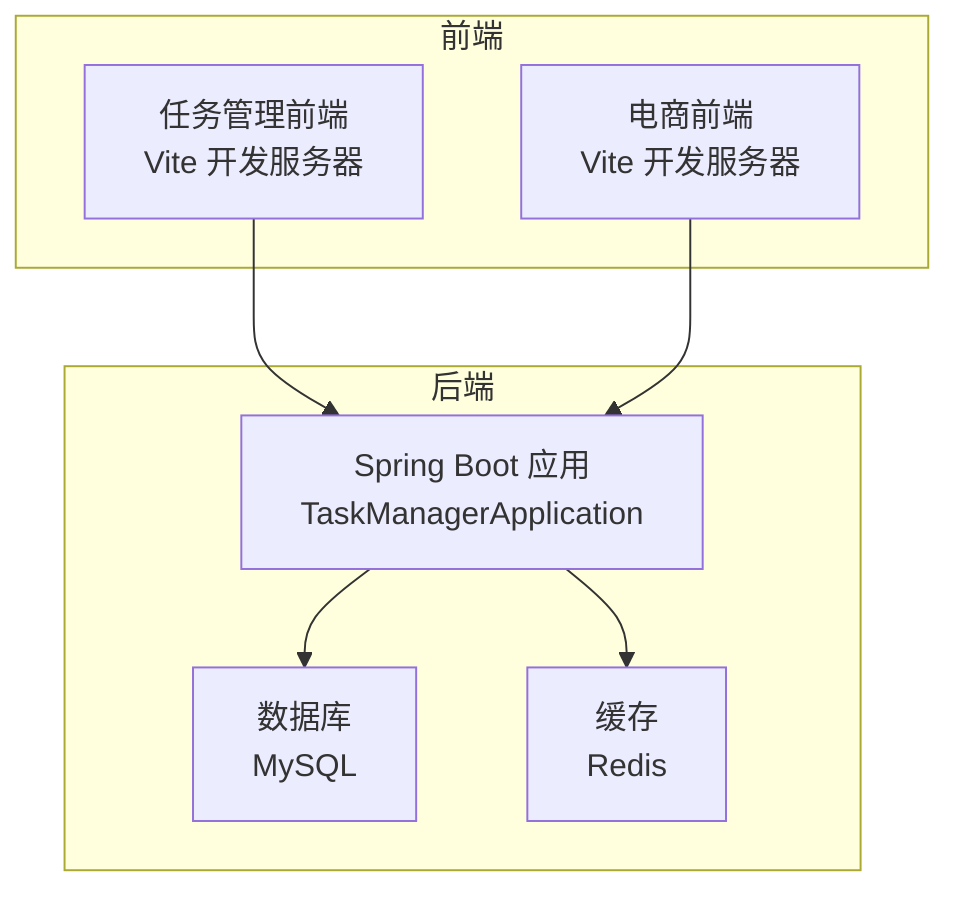
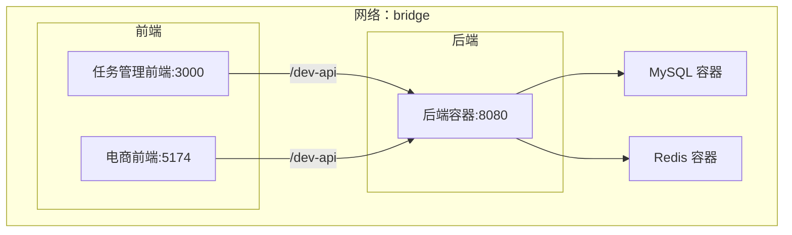
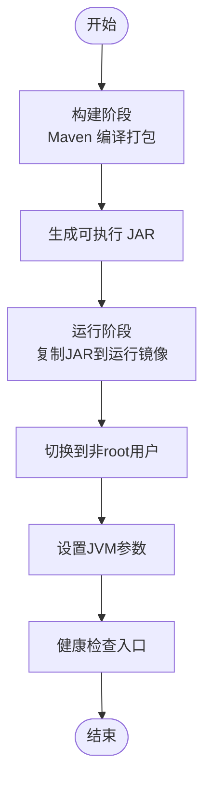
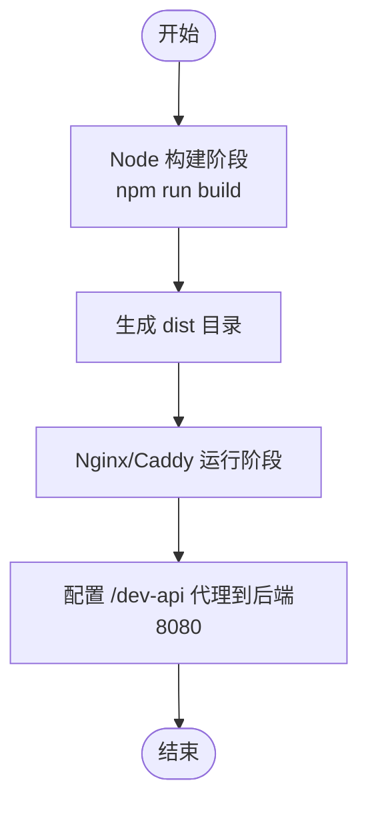
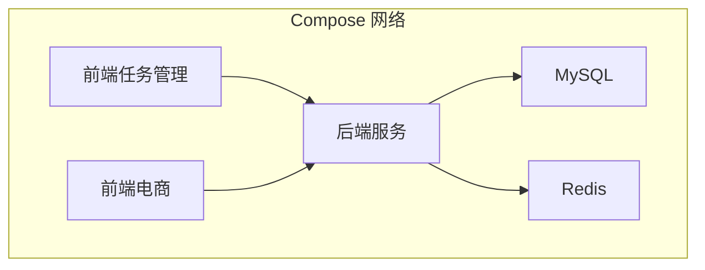
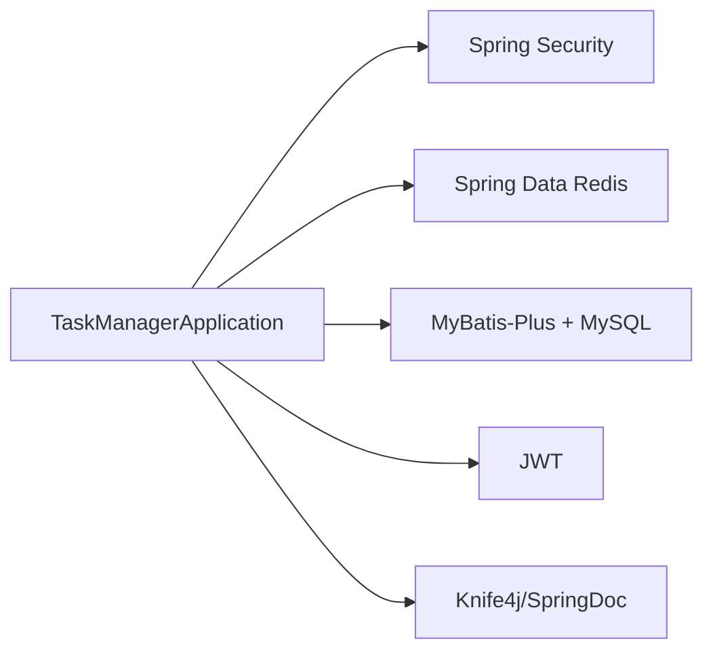

# 容器化部署

<cite>
**本文引用的文件**
- [pom.xml](file://task-manager-backend/pom.xml)
- [application.yml](file://task-manager-backend/src/main/resources/application.yml)
- [schema.sql](file://task-manager-backend/src/main/resources/schema.sql)
- [test-data.sql](file://task-manager-backend/src/main/resources/test-data.sql)
- [TaskManagerApplication.java](file://task-manager-backend/src/main/java/com/taskmanager/TaskManagerApplication.java)
- [build.bat](file://task-manager-backend/build.bat)
- [CODEBUDDY.md](file://CODEBUDDY.md)
- [vite.config.js（任务管理前端）](file://task-manager-frontend/vite.config.js)
- [package.json（任务管理前端）](file://task-manager-frontend/package.json)
- [vite.config.js（电商前端）](file://ecommerce-frontend/vite.config.js)
</cite>

## 目录
1. [引言](#引言)
2. [项目结构](#项目结构)
3. [核心组件](#核心组件)
4. [架构总览](#架构总览)
5. [详细组件分析](#详细组件分析)
6. [依赖分析](#依赖分析)
7. [性能考虑](#性能考虑)
8. [故障排查指南](#故障排查指南)
9. [结论](#结论)
10. [附录](#附录)

## 引言
本指南面向CodeBuddy任务管理系统，提供从后端Java应用到前端Vue应用的完整容器化部署方案。内容涵盖：
- Docker镜像制作（后端多阶段构建、前端静态站点镜像）
- Docker Compose编排（服务、网络、卷、环境变量）
- 容器编排最佳实践（依赖、健康检查、重启策略）
- 容器运行与管理（启动/停止/日志/监控）
- 网络配置（端口映射、服务发现、代理）
- 安全加固（用户/权限/网络安全）
- 监控与日志（指标采集与日志聚合）
- 升级与回滚策略
- 常见问题排查

## 项目结构
项目采用前后端分离架构，后端为Spring Boot应用，前端包含两个Vue工程（任务管理前端与电商前端）。后端使用MySQL与Redis，配置集中于application.yml。

图表来源
- [TaskManagerApplication.java:10-16](file://task-manager-backend/src/main/java/com/taskmanager/TaskManagerApplication.java#L10-L16)
- [application.yml:5-31](file://task-manager-backend/src/main/resources/application.yml#L5-L31)

章节来源
- [CODEBUDDY.md:40-79](file://CODEBUDDY.md#L40-L79)
- [application.yml:1-79](file://task-manager-backend/src/main/resources/application.yml#L1-L79)

## 核心组件
- 后端服务（Spring Boot）
  - 语言与框架：Java 17 + Spring Boot 3.2.0 + MyBatis-Plus + Spring Security + Redis + MySQL
  - 端口：HTTP 8080（server.port）
  - 数据源：MySQL（默认本地127.0.0.1:3306）
  - 缓存：Redis（默认本地127.0.0.1:6379）
- 前端（Vue + Vite）
  - 任务管理前端：开发端口3000，代理/dev-api到后端8080
  - 电商前端：开发端口5174，代理/dev-api到后端8080

章节来源
- [CODEBUDDY.md:40-44](file://CODEBUDDY.md#L40-L44)
- [application.yml:58-60](file://task-manager-backend/src/main/resources/application.yml#L58-L60)
- [vite.config.js（任务管理前端）:14-25](file://task-manager-frontend/vite.config.js#L14-L25)
- [vite.config.js（电商前端）:12-22](file://ecommerce-frontend/vite.config.js#L12-L22)

## 架构总览
容器化后的典型拓扑：
- 后端服务容器暴露8080端口
- 前端容器分别运行在3000与5174端口
- MySQL与Redis以独立容器运行
- 所有服务通过自定义Bridge网络互联
- 前端通过反向代理访问后端API

图表来源
- [application.yml:5-31](file://task-manager-backend/src/main/resources/application.yml#L5-L31)
- [vite.config.js（任务管理前端）:18-24](file://task-manager-frontend/vite.config.js#L18-L24)
- [vite.config.js（电商前端）:15-21](file://ecommerce-frontend/vite.config.js#L15-L21)

## 详细组件分析

### 后端镜像制作（多阶段构建）
目标：最小化镜像体积、缩短构建时间、保证运行时安全与可重复性。

- 构建阶段
  - 基础镜像：官方Maven镜像（含OpenJDK 17）
  - 依赖下载：使用settings.xml或镜像内置仓库加速
  - 构建产物：使用Maven插件生成可执行jar
- 运行阶段
  - 基础镜像：官方OpenJDK 17或Alpine JDK
  - 安全：以非root用户运行；禁用不必要的系统工具
  - 性能：设置JVM参数（如堆大小、GC策略）；启用GZIP压缩
  - 可观测性：暴露JMX/Actuator端点（如启用）

图表来源
- [pom.xml:162-204](file://task-manager-backend/pom.xml#L162-L204)
- [build.bat:6-26](file://task-manager-backend/build.bat#L6-L26)

章节来源
- [pom.xml:1-206](file://task-manager-backend/pom.xml#L1-L206)
- [build.bat:1-37](file://task-manager-backend/build.bat#L1-L37)

### 前端镜像制作（静态站点）
- 构建阶段
  - 基础镜像：官方Node镜像
  - 依赖安装：使用package-lock.json锁定版本
  - 构建产物：Vite生产构建输出dist目录
- 运行阶段
  - 基础镜像：Nginx或Caddy
  - 静态文件：将dist目录挂载到Nginx根目录
  - 代理：配置/dev-api转发到后端8080

图表来源
- [package.json（任务管理前端）:6-10](file://task-manager-frontend/package.json#L6-L10)
- [vite.config.js（任务管理前端）:18-24](file://task-manager-frontend/vite.config.js#L18-L24)

章节来源
- [package.json（任务管理前端）:1-30](file://task-manager-frontend/package.json#L1-L30)
- [vite.config.js（任务管理前端）:1-28](file://task-manager-frontend/vite.config.js#L1-L28)

### Docker Compose编排
- 服务定义
  - 后端：映射宿主8080->容器8080；挂载日志目录；设置环境变量覆盖数据库/Redis连接
  - 前端：任务管理前端映射3000，电商前端映射5174；挂载前端源码实现热更新（开发）
  - 数据库：MySQL容器，持久化卷；初始化脚本与测试数据
  - 缓存：Redis容器，持久化卷
- 网络配置
  - 自定义bridge网络，服务间通过服务名互访
- 卷挂载
  - MySQL：/var/lib/mysql
  - Redis：/data
  - 日志：/app/logs
- 环境变量
  - 数据库：MYSQL_ROOT_PASSWORD、MYSQL_DATABASE、MYSQL_HOST、MYSQL_PORT
  - Redis：REDIS_HOST、REDIS_PORT
  - 后端：SPRING_DATASOURCE_URL、SPRING_DATA_REDIS_HOST、SPRING_PROFILES_ACTIVE

图表来源
- [application.yml:5-31](file://task-manager-backend/src/main/resources/application.yml#L5-L31)
- [schema.sql:1-10](file://task-manager-backend/src/main/resources/schema.sql#L1-L10)

章节来源
- [application.yml:1-79](file://task-manager-backend/src/main/resources/application.yml#L1-L79)
- [schema.sql:1-608](file://task-manager-backend/src/main/resources/schema.sql#L1-L608)

### 容器编排最佳实践
- 依赖关系
  - 后端依赖MySQL与Redis；Compose通过depends_on实现启动顺序
  - 前端依赖后端；通过服务名与端口通信
- 健康检查
  - 后端：HTTP GET /actuator/health（如启用）
  - MySQL/Redis：TCP端口探测
- 重启策略
  - 建议使用unless-stopped或on-failure，避免手动干预
- 资源限制
  - 为后端设置内存上限，防止OOM
  - 为数据库与缓存设置持久化卷与备份策略

章节来源
- [application.yml:58-60](file://task-manager-backend/src/main/resources/application.yml#L58-L60)

### 容器运行与管理
- 启动/停止
  - docker compose up -d 启动；docker compose down 停止
- 日志查看
  - docker compose logs -f 后端；docker compose logs -f 前端
- 资源监控
  - docker stats 查看CPU/内存；Prometheus+Grafana采集指标
- 进程进入
  - docker compose exec 后端 bash 进入容器调试

章节来源
- [CODEBUDDY.md:3-21](file://CODEBUDDY.md#L3-L21)

### 容器网络配置
- 端口映射
  - 后端：8080->8080
  - 前端：3000->3000（任务管理）、5174->5174（电商）
- 服务发现
  - 通过服务名（后端、MySQL、Redis）互访
- 负载均衡
  - 多实例后端通过反向代理（Nginx）实现
- 代理规则
  - 前端/dev-api -> 后端8080/api

章节来源
- [vite.config.js（任务管理前端）:18-24](file://task-manager-frontend/vite.config.js#L18-L24)
- [vite.config.js（电商前端）:15-21](file://ecommerce-frontend/vite.config.js#L15-L21)

### 容器安全配置
- 用户权限
  - 运行镜像使用非root用户；授予必要文件权限
- 文件系统权限
  - 挂载卷使用合适的SELinux上下文；避免写入只读目录
- 网络安全
  - 仅暴露必要端口；使用防火墙/安全组限制入站
  - 后端与数据库之间走内部网络；禁用公网访问
- 凭据管理
  - 使用Secrets或环境变量注入敏感信息；避免硬编码

章节来源
- [application.yml:5-31](file://task-manager-backend/src/main/resources/application.yml#L5-L31)

### 监控与日志收集
- 指标采集
  - 启用Actuator端点；Prometheus抓取/metrics
- 日志收集
  - stdout/stderr输出；使用Fluent Bit/Filebeat收集；集中到ELK或Loki
- 健康检查
  - 定义HTTP/TCP探针；失败自动重启

章节来源
- [application.yml:58-79](file://task-manager-backend/src/main/resources/application.yml#L58-L79)

### 升级与回滚策略
- 升级
  - 蓝绿/金丝雀发布：逐步替换容器；验证健康检查
  - 数据库迁移：在升级前执行schema.sql变更
- 回滚
  - 保留上一个镜像版本；回滚Compose配置
  - 数据库回滚：使用schema.sql与test-data.sql进行一致性校验

章节来源
- [schema.sql:1-608](file://task-manager-backend/src/main/resources/schema.sql#L1-L608)
- [test-data.sql:1-558](file://task-manager-backend/src/main/resources/test-data.sql#L1-L558)

### 常见问题排查
- 启动失败
  - 检查端口占用（8080/3000/5174）；确认数据库/Redis连通性
- 数据库初始化
  - 确认schema.sql与test-data.sql已正确加载；检查卷挂载路径
- 前端代理无效
  - 确认/dev-api代理指向后端8080；浏览器Network面板查看请求
- 权限问题
  - 非root运行时，检查日志与卷权限；必要时调整用户ID映射

章节来源
- [CODEBUDDY.md:3-21](file://CODEBUDDY.md#L3-L21)
- [vite.config.js（任务管理前端）:18-24](file://task-manager-frontend/vite.config.js#L18-L24)

## 依赖分析
后端依赖关系（简化）：

图表来源
- [pom.xml:32-145](file://task-manager-backend/pom.xml#L32-L145)
- [TaskManagerApplication.java:10-16](file://task-manager-backend/src/main/java/com/taskmanager/TaskManagerApplication.java#L10-L16)

章节来源
- [pom.xml:1-206](file://task-manager-backend/pom.xml#L1-L206)

## 性能考虑
- JVM参数：合理设置堆大小、GC策略；启用GZIP压缩
- 连接池：HikariCP连接池参数（最大连接数、空闲超时）
- 缓存：Redis连接池与超时配置
- 前端：开启静态资源压缩与缓存；CDN加速

章节来源
- [application.yml:10-31](file://task-manager-backend/src/main/resources/application.yml#L10-L31)

## 故障排查指南
- 启动失败
  - 检查端口占用与防火墙；确认数据库/Redis可达
- 数据库初始化
  - 确认schema.sql与test-data.sql已执行；卷路径正确
- 前端代理
  - 校验/dev-api代理规则；确认后端8080可用
- 日志与监控
  - 查看容器日志；验证健康检查与指标采集

章节来源
- [CODEBUDDY.md:3-21](file://CODEBUDDY.md#L3-L21)
- [application.yml:58-60](file://task-manager-backend/src/main/resources/application.yml#L58-L60)

## 结论
通过多阶段构建与Compose编排，CodeBuddy任务管理系统可实现高效、安全、可观测的容器化部署。建议在生产环境中结合蓝绿/金丝雀发布、完善的监控与日志体系，以及严格的权限与网络安全策略，确保系统的稳定性与可维护性。

## 附录
- 常用命令参考
  - 构建后端：使用Maven插件生成可执行jar
  - 启动服务：docker compose up -d
  - 查看日志：docker compose logs -f
  - 停止服务：docker compose down

章节来源
- [build.bat:6-26](file://task-manager-backend/build.bat#L6-L26)
- [CODEBUDDY.md:3-21](file://CODEBUDDY.md#L3-L21)