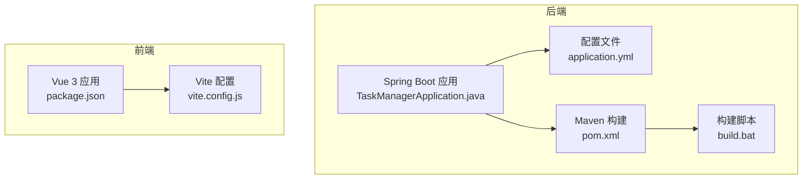
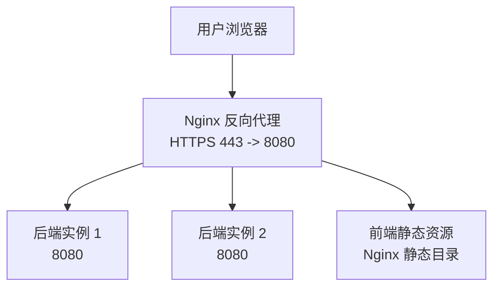
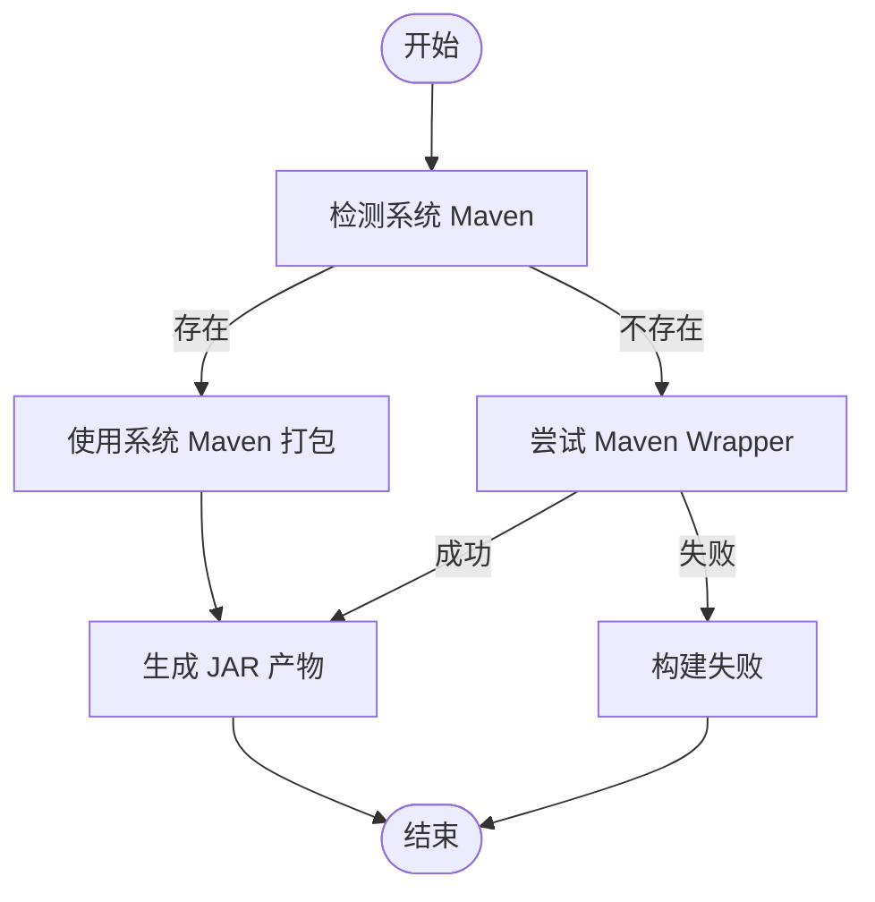
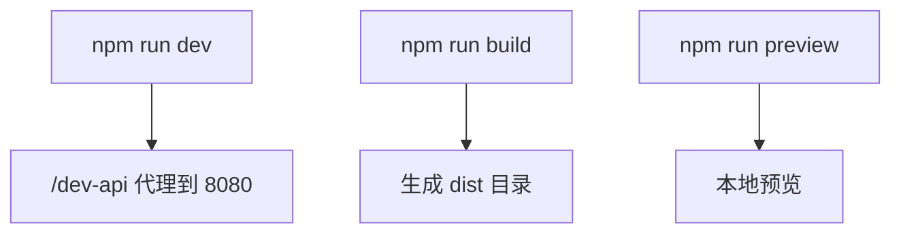
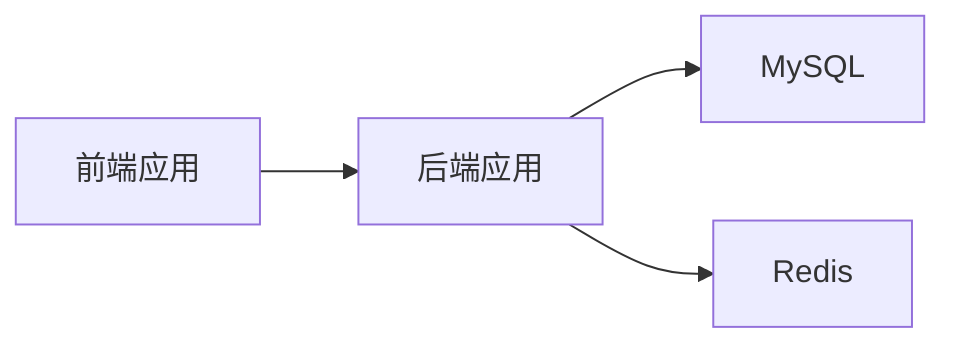

# 生产部署

<cite>
**本文引用的文件**
- [pom.xml](file://task-manager-backend/pom.xml)
- [application.yml](file://task-manager-backend/src/main/resources/application.yml)
- [TaskManagerApplication.java](file://task-manager-backend/src/main/java/com/taskmanager/TaskManagerApplication.java)
- [vite.config.js](file://task-manager-frontend/vite.config.js)
- [package.json](file://task-manager-frontend/package.json)
- [build.bat](file://task-manager-backend/build.bat)
- [CODEBUDDY.md](file://CODEBUDDY.md)
- [schema.sql](file://task-manager-backend/src/main/resources/schema.sql)
- [start.bat](file://start.bat)
- [PasswordTest.java](file://task-manager-backend/src/test/java/com/taskmanager/PasswordTest.java)
</cite>

## 目录
1. [引言](#引言)
2. [项目结构](#项目结构)
3. [核心组件](#核心组件)
4. [架构总览](#架构总览)
5. [详细组件分析](#详细组件分析)
6. [依赖关系分析](#依赖关系分析)
7. [性能考量](#性能考量)
8. [故障排查指南](#故障排查指南)
9. [结论](#结论)
10. [附录](#附录)

## 引言
本指南面向生产环境，围绕 CodeBuddy 任务管理系统（后端基于 Spring Boot 3.2.0 + Java 17，前端基于 Vue 3 + Vite）提供从构建到上线的完整部署说明。内容涵盖：
- 后端打包与构建（Maven 编译、JAR 产物、构建脚本）
- 前端静态资源构建（Vite 配置、dist 目录、资源优化）
- 服务器环境要求（操作系统、硬件、网络）
- 应用部署步骤（JAR 上传、配置替换、服务启停）
- 进程管理（PM2 或 systemd）
- 负载均衡与反向代理（Nginx）
- SSL 证书与 HTTPS
- 部署后验证（健康检查、功能测试、性能测试）
- 回滚策略与应急处置

## 项目结构
项目采用前后端分离架构，后端为 Spring Boot 应用，前端为 Vue 3 + Vite 应用。关键目录与职责如下：
- 后端：task-manager-backend
  - 源代码与资源：src/main/java、src/main/resources
  - 构建脚本：pom.xml、build.bat
  - 默认端口：8080
- 前端：task-manager-frontend
  - 源代码与资源：src、public、index.html
  - 构建脚本：package.json、vite.config.js
  - 默认开发端口：3000

图表来源
- [TaskManagerApplication.java:10-16](file://task-manager-backend/src/main/java/com/taskmanager/TaskManagerApplication.java#L10-L16)
- [application.yml:58-60](file://task-manager-backend/src/main/resources/application.yml#L58-L60)
- [pom.xml:162-204](file://task-manager-backend/pom.xml#L162-L204)
- [build.bat:1-37](file://task-manager-backend/build.bat#L1-L37)
- [package.json:6-10](file://task-manager-frontend/package.json#L6-L10)
- [vite.config.js:14-25](file://task-manager-frontend/vite.config.js#L14-L25)

章节来源
- [CODEBUDDY.md:40-44](file://CODEBUDDY.md#L40-L44)
- [application.yml:58-60](file://task-manager-backend/src/main/resources/application.yml#L58-L60)
- [pom.xml:162-204](file://task-manager-backend/pom.xml#L162-L204)
- [build.bat:1-37](file://task-manager-backend/build.bat#L1-L37)
- [package.json:6-10](file://task-manager-frontend/package.json#L6-L10)
- [vite.config.js:14-25](file://task-manager-frontend/vite.config.js#L14-L25)

## 核心组件
- 后端应用
  - 启动类：TaskManagerApplication，负责扫描 Mapper 并启动 Spring Boot
  - 配置中心：application.yml，包含数据库、Redis、MyBatis-Plus、JWT、服务端口、Knife4j 文档等
  - 构建工具：Maven（pom.xml），支持 Maven Wrapper（build.bat）
- 前端应用
  - 包管理与脚本：package.json（dev/build/preview）
  - 开发代理：vite.config.js（/dev-api 代理至后端 8080）

章节来源
- [TaskManagerApplication.java:10-16](file://task-manager-backend/src/main/java/com/taskmanager/TaskManagerApplication.java#L10-L16)
- [application.yml:1-79](file://task-manager-backend/src/main/resources/application.yml#L1-L79)
- [pom.xml:1-206](file://task-manager-backend/pom.xml#L1-L206)
- [build.bat:1-37](file://task-manager-backend/build.bat#L1-L37)
- [package.json:6-10](file://task-manager-frontend/package.json#L6-L10)
- [vite.config.js:14-25](file://task-manager-frontend/vite.config.js#L14-L25)

## 架构总览
生产部署建议采用“Nginx 反向代理 + 多实例后端 + 单前端”的模式：
- Nginx 对外暴露 HTTPS，反向代理到后端多个实例（8080）
- 前端构建产物部署至 Nginx 的静态目录
- 后端连接 MySQL 与 Redis，使用 HikariCP 连接池与 MyBatis-Plus

图表来源
- [application.yml:58-60](file://task-manager-backend/src/main/resources/application.yml#L58-L60)
- [vite.config.js:18-24](file://task-manager-frontend/vite.config.js#L18-L24)

## 详细组件分析

### 后端构建与打包
- 构建工具链
  - Maven：pom.xml 定义了 Java 版本、依赖、插件（Spring Boot、Lombok、Surefire）
  - Maven Wrapper：build.bat 支持优先使用系统 Maven，其次使用 mvnw.cmd
- 打包产物
  - 目标 JAR：target/task-manager-backend-1.0.0.jar
  - 构建命令参考：CODEBUDDY.md 中的常用命令
- 关键构建插件
  - spring-boot-maven-plugin：生成可执行 JAR
  - maven-compiler-plugin：支持 Lombok 注解处理器
  - maven-surefire-plugin：测试 JVM 参数配置

图表来源
- [build.bat:6-26](file://task-manager-backend/build.bat#L6-L26)
- [pom.xml:162-204](file://task-manager-backend/pom.xml#L162-L204)

章节来源
- [pom.xml:162-204](file://task-manager-backend/pom.xml#L162-L204)
- [build.bat:1-37](file://task-manager-backend/build.bat#L1-L37)
- [CODEBUDDY.md:5-21](file://CODEBUDDY.md#L5-L21)

### 前端静态资源构建
- 构建脚本
  - package.json 提供 dev/build/preview 脚本
  - 开发代理：vite.config.js 将 /dev-api 代理到后端 8080
- 构建输出
  - Vite 生产构建生成 dist 目录，部署于 Nginx 静态目录
- 资源优化
  - 建议在生产环境开启压缩与缓存策略（由 Nginx 配置实现）

图表来源
- [package.json:6-10](file://task-manager-frontend/package.json#L6-L10)
- [vite.config.js:14-25](file://task-manager-frontend/vite.config.js#L14-L25)

章节来源
- [package.json:6-10](file://task-manager-frontend/package.json#L6-L10)
- [vite.config.js:14-25](file://task-manager-frontend/vite.config.js#L14-L25)
- [CODEBUDDY.md:23-38](file://CODEBUDDY.md#L23-L38)

### 服务器环境要求
- 操作系统
  - Linux（推荐 Ubuntu/Debian/CentOS）或 Windows（用于开发机）
- 硬件资源
  - CPU：至少 2 核（生产建议 4 核以上）
  - 内存：至少 2 GB（生产建议 4 GB+）
  - 磁盘：剩余空间满足数据库与日志需求
- 运行时
  - JDK 17（Java 17）
  - Node.js（用于前端构建）
  - MySQL 8+ 与 Redis
- 网络
  - 开放端口：8080（后端）、443（Nginx，如启用 HTTPS）
  - 防火墙放行与安全组配置

章节来源
- [pom.xml:20-30](file://task-manager-backend/pom.xml#L20-L30)
- [application.yml:5-9](file://task-manager-backend/src/main/resources/application.yml#L5-L9)
- [application.yml:18-31](file://task-manager-backend/src/main/resources/application.yml#L18-L31)

### 应用部署步骤
- 准备阶段
  - 安装 JDK 17、Node.js、MySQL、Redis
  - 创建数据库与初始化表结构（schema.sql）
- 后端部署
  - 生成 JAR：使用 Maven 或 Maven Wrapper
  - 上传 JAR 至目标服务器
  - 替换配置：application.yml（数据库、Redis、JWT、端口）
  - 启动服务：java -jar target/...jar
- 前端部署
  - 构建静态资源：npm run build
  - 将 dist 目录内容部署至 Nginx 静态目录
- 反向代理
  - Nginx 配置：将 /api* 代理到后端 8080；静态资源走本地 dist
- 验证
  - 访问前端首页、Swagger 文档、登录接口

章节来源
- [schema.sql:1-20](file://task-manager-backend/src/main/resources/schema.sql#L1-L20)
- [build.bat:1-37](file://task-manager-backend/build.bat#L1-L37)
- [application.yml:58-60](file://task-manager-backend/src/main/resources/application.yml#L58-L60)
- [vite.config.js:18-24](file://task-manager-frontend/vite.config.js#L18-L24)

### 进程管理（PM2 或 systemd）
- PM2（推荐）
  - 后端：pm2 start java --name "backend" -- -jar /path/to/target/task-manager-backend-1.0.0.jar
  - 前端：pm2 start nginx（或直接以静态资源方式托管）
- systemd（Linux）
  - 编写 service 文件，设置 ExecStart、WorkingDirectory、Restart
  - 后端示例：ExecStart=/usr/bin/java -jar /path/to/target/task-manager-backend-1.0.0.jar
  - 开机自启：systemctl enable backend.service

章节来源
- [application.yml:58-60](file://task-manager-backend/src/main/resources/application.yml#L58-L60)

### 负载均衡与反向代理（Nginx）
- Nginx 配置要点
  - HTTPS：监听 443，配置证书与私钥
  - 反向代理：/api* 代理到后端 8080
  - 静态资源：root 指向 dist 目录，开启 gzip 与缓存
- 健康检查
  - Nginx 可通过 upstream + health_check 实现后端健康探测（可选）

章节来源
- [vite.config.js:18-24](file://task-manager-frontend/vite.config.js#L18-L24)
- [application.yml:58-60](file://task-manager-backend/src/main/resources/application.yml#L58-L60)

### SSL 证书与 HTTPS
- 证书来源
  - Let’s Encrypt（推荐，免费）
  - 商业 CA（付费）
- Nginx 配置
  - ssl_certificate 与 ssl_certificate_key 指向证书与私钥
  - 强制 HTTPS 重定向
- 证书续期
  - certbot 自动续期（Let’s Encrypt）

章节来源
- [vite.config.js:18-24](file://task-manager-frontend/vite.config.js#L18-L24)

### 部署后验证
- 健康检查
  - Swagger 文档：/doc.html
  - 登录接口：/api/auth/login（验证 JWT）
- 功能测试
  - 用户管理、角色管理、菜单管理、商品管理、仓库管理等模块
- 性能测试
  - ab/wrk 压测 /api/* 接口，观察响应时间与错误率
- 日志与监控
  - 后端日志：application.yml 中的 MyBatis 日志配置
  - Nginx 访问/错误日志

章节来源
- [application.yml:34-38](file://task-manager-backend/src/main/resources/application.yml#L34-L38)
- [CODEBUDDY.md:79-102](file://CODEBUDDY.md#L79-L102)

### 回滚策略与应急处置
- 回滚策略
  - 保留上一个版本的 JAR 与前端 dist
  - 通过 Nginx 切换后端实例或回退前端静态资源
- 应急处置
  - 后端异常：查看日志、重启进程、检查数据库/Redis 连通性
  - 前端异常：确认 dist 部署完整性、清理浏览器缓存
  - 数据库问题：使用 schema.sql 重建或回滚到备份

章节来源
- [schema.sql:1-20](file://task-manager-backend/src/main/resources/schema.sql#L1-L20)

## 依赖关系分析
后端与前端的关键依赖关系如下：
- 后端依赖
  - Spring Boot Web、Security、AOP、Redis、MyBatis-Plus、MySQL Driver、JWT、Knife4j、Hutool、Commons Lang3、Easy-Captcha、EasyExcel、Lombok
- 前端依赖
  - Vue 3、Element Plus、Pinia、Vue Router、Axios、Sass、Vite 插件

图表来源
- [pom.xml:32-145](file://task-manager-backend/pom.xml#L32-L145)
- [package.json:11-28](file://task-manager-frontend/package.json#L11-L28)

章节来源
- [pom.xml:32-145](file://task-manager-backend/pom.xml#L32-L145)
- [package.json:11-28](file://task-manager-frontend/package.json#L11-L28)

## 性能考量
- 连接池与数据库
  - HikariCP 连接池参数（最小空闲、最大池大小、超时）已在 application.yml 中配置
- 缓存与会话
  - Redis 用于 JWT 会话存储与缓存，建议独立部署并开启持久化
- 前端资源
  - 生产构建开启压缩与 Tree Shaking，建议配合 CDN 与缓存头
- 后端线程与 JVM
  - 合理设置 JVM 堆大小与 GC 参数，避免 Full GC

章节来源
- [application.yml:10-16](file://task-manager-backend/src/main/resources/application.yml#L10-L16)
- [application.yml:18-31](file://task-manager-backend/src/main/resources/application.yml#L18-L31)

## 故障排查指南
- 启动失败
  - 检查 JDK 版本与 JAVA_HOME
  - 确认 application.yml 中数据库、Redis 地址与端口
- 数据库问题
  - 使用 schema.sql 初始化数据库
  - 校验连接串、用户名、密码
- 前端跨域
  - 确认 Nginx 反代 /api* 到后端 8080
- 密码相关
  - 使用 PasswordTest 生成或验证 BCrypt 哈希，更新数据库中用户密码字段

章节来源
- [schema.sql:223-225](file://task-manager-backend/src/main/resources/schema.sql#L223-L225)
- [PasswordTest.java:10-47](file://task-manager-backend/src/test/java/com/taskmanager/PasswordTest.java#L10-L47)

## 结论
本指南提供了从构建到上线的完整流程，建议在生产环境中结合 Nginx 反向代理、负载均衡、SSL 证书与进程管理工具（PM2/systemd）实现高可用与高可靠。部署完成后务必进行健康检查、功能测试与性能压测，并建立完善的回滚与应急处置机制。

## 附录
- 常用命令参考（来自文档）
  - 后端：编译打包、运行、测试、跳过测试编译
  - 前端：安装依赖、开发模式、生产构建、预览
- 启动脚本（start.bat）可用于本地开发环境快速启动后端与前端

章节来源
- [CODEBUDDY.md:5-38](file://CODEBUDDY.md#L5-L38)
- [start.bat:8-25](file://start.bat#L8-L25)