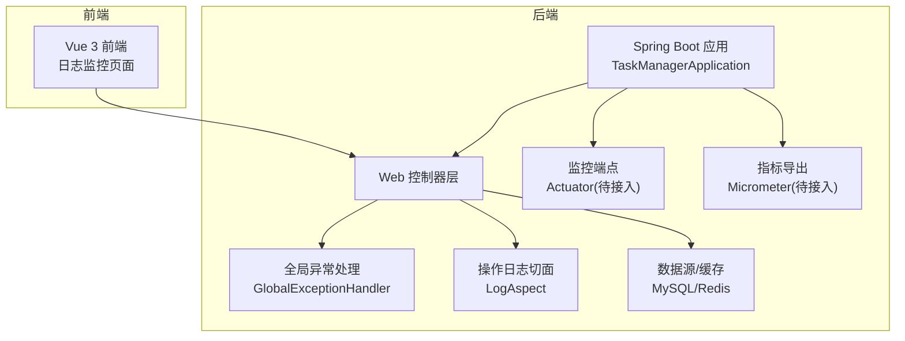
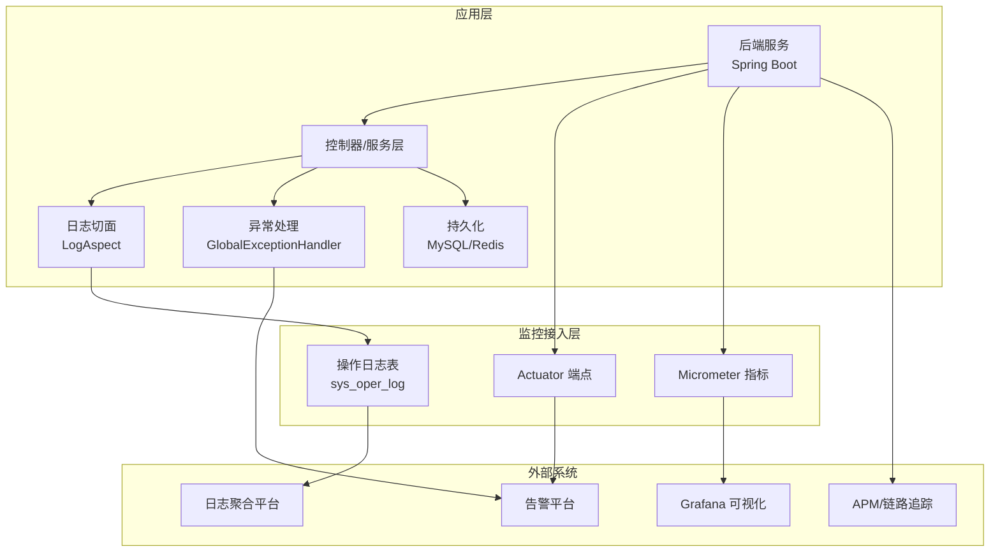
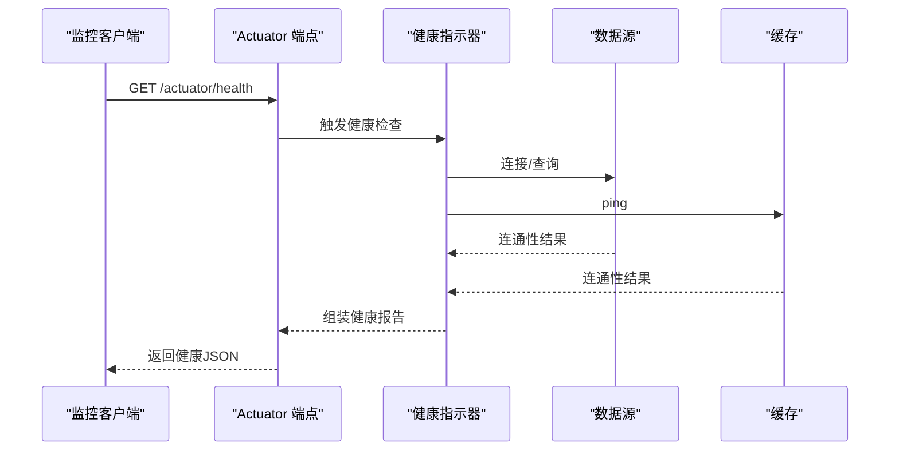
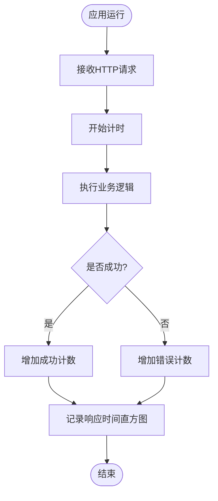
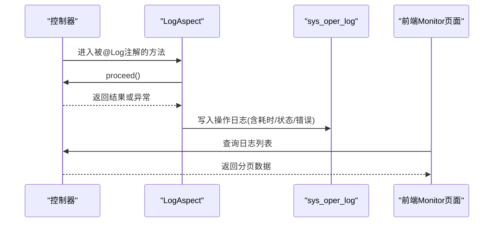
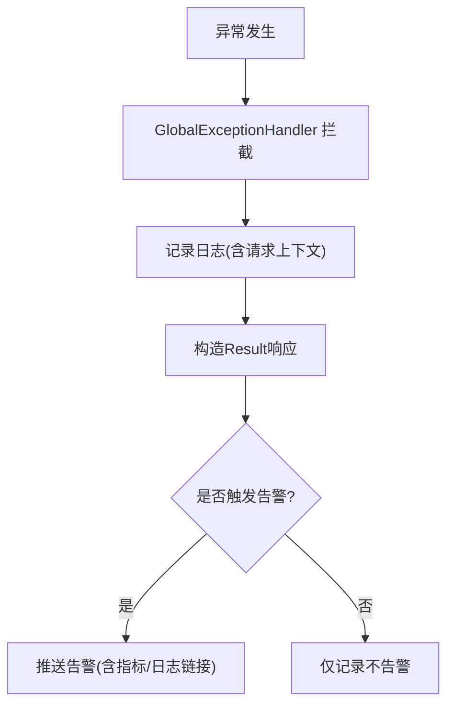
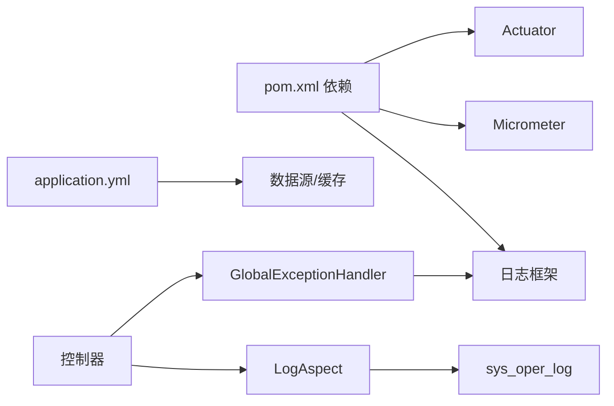

# 监控告警

<cite>
**本文引用的文件**
- [application.yml](file://task-manager-backend/src/main/resources/application.yml)
- [pom.xml](file://task-manager-backend/pom.xml)
- [TaskManagerApplication.java](file://task-manager-backend/src/main/java/com/taskmanager/TaskManagerApplication.java)
- [GlobalExceptionHandler.java](file://task-manager-backend/src/main/java/com/taskmanager/common/exception/GlobalExceptionHandler.java)
- [LogAspect.java](file://task-manager-backend/src/main/java/com/taskmanager/aspect/LogAspect.java)
- [Result.java](file://task-manager-backend/src/main/java/com/taskmanager/common/Result.java)
- [SysOperlogControllerTest.java](file://task-manager-backend/src/test/java/com/taskmanager/controller/SysOperlogControllerTest.java)
- [SysLogininforControllerTest.java](file://task-manager-backend/src/test/java/com/taskmanager/controller/SysLogininforControllerTest.java)
- [operlog.js](file://task-manager-frontend/src/api/monitor/operlog.js)
- [application-test.yml](file://task-manager-backend/src/test/resources/application-test.yml)
</cite>

## 目录
1. [引言](#引言)
2. [项目结构](#项目结构)
3. [核心组件](#核心组件)
4. [架构总览](#架构总览)
5. [详细组件分析](#详细组件分析)
6. [依赖关系分析](#依赖关系分析)
7. [性能考量](#性能考量)
8. [故障排查指南](#故障排查指南)
9. [结论](#结论)
10. [附录](#附录)

## 引言
本指南面向CodeBuddy任务管理系统，围绕后端Spring Boot应用构建“可观测性”体系，覆盖应用健康检查、性能指标、日志采集与分析、错误监控与告警、APM集成、监控数据可视化以及阈值与策略设定，并提供可操作的维护与优化建议。当前代码库已具备统一异常处理、操作日志切面等基础能力，后续可在现有基础上扩展Actuator、Micrometer、日志聚合与告警平台。

## 项目结构
后端采用Spring Boot 3 + MyBatis-Plus + Redis + MySQL架构；前端Vue 3 + Element Plus。监控侧可利用Spring Boot Actuator暴露健康与指标端点，结合Micrometer收集JVM与应用指标，配合日志切面与全局异常处理完善可观测性闭环。

图表来源
- [TaskManagerApplication.java:1-18](file://task-manager-backend/src/main/java/com/taskmanager/TaskManagerApplication.java#L1-L18)
- [GlobalExceptionHandler.java:1-109](file://task-manager-backend/src/main/java/com/taskmanager/common/exception/GlobalExceptionHandler.java#L1-L109)
- [LogAspect.java:1-137](file://task-manager-backend/src/main/java/com/taskmanager/aspect/LogAspect.java#L1-L137)
- [application.yml:1-79](file://task-manager-backend/src/main/resources/application.yml#L1-L79)

章节来源
- [application.yml:1-79](file://task-manager-backend/src/main/resources/application.yml#L1-L79)
- [pom.xml:1-206](file://task-manager-backend/pom.xml#L1-L206)
- [TaskManagerApplication.java:1-18](file://task-manager-backend/src/main/java/com/taskmanager/TaskManagerApplication.java#L1-L18)

## 核心组件
- 启动类与配置
  - 启动类负责扫描Mapper与装配应用上下文。
  - 应用配置文件定义数据库、Redis、MyBatis-Plus、Jackson、Knife4j等关键参数。
- 统一异常处理
  - 全局异常处理器对业务异常、认证/权限异常、参数校验异常等进行分类处理，统一返回Result格式。
- 操作日志切面
  - 通过环绕通知自动记录请求/响应、耗时、状态、错误信息等，写入sys_oper_log表。
- 统一响应格式
  - Result<T>提供success/error静态方法，便于前端与监控侧统一消费。

章节来源
- [TaskManagerApplication.java:1-18](file://task-manager-backend/src/main/java/com/taskmanager/TaskManagerApplication.java#L1-L18)
- [application.yml:1-79](file://task-manager-backend/src/main/resources/application.yml#L1-L79)
- [GlobalExceptionHandler.java:1-109](file://task-manager-backend/src/main/java/com/taskmanager/common/exception/GlobalExceptionHandler.java#L1-L109)
- [LogAspect.java:1-137](file://task-manager-backend/src/main/java/com/taskmanager/aspect/LogAspect.java#L1-L137)
- [Result.java:1-76](file://task-manager-backend/src/main/java/com/taskmanager/common/Result.java#L1-L76)

## 架构总览
下图展示监控体系的总体架构：后端通过Actuator/Micrometer暴露健康与指标；日志切面与全局异常处理形成错误与行为观测；前端通过API访问监控数据；外部工具（日志聚合、告警平台、APM、可视化面板）对接这些数据源。

图表来源
- [LogAspect.java:1-137](file://task-manager-backend/src/main/java/com/taskmanager/aspect/LogAspect.java#L1-L137)
- [GlobalExceptionHandler.java:1-109](file://task-manager-backend/src/main/java/com/taskmanager/common/exception/GlobalExceptionHandler.java#L1-L109)
- [application.yml:1-79](file://task-manager-backend/src/main/resources/application.yml#L1-L79)

## 详细组件分析

### 应用健康检查与Actuator接入
- 目标
  - 开启健康检查端点，暴露应用运行状态、依赖连通性与自定义健康指示器。
- 建议步骤
  - 依赖引入：在pom.xml中加入spring-boot-starter-actuator。
  - 配置启用：在application.yml中开启所需端点（如health、info），并按需开放敏感端点。
  - 自定义健康指示器：基于业务逻辑（如数据库、Redis连通性）编写HealthIndicator，提升健康判断准确性。
- 关键端点
  - /actuator/health：应用健康状态
  - /actuator/info：应用元信息
  - /actuator/metrics：指标列表
  - /actuator/prometheus：Prometheus抓取端点（如启用micrometer-registry-prometheus）

图表来源
- [application.yml:1-79](file://task-manager-backend/src/main/resources/application.yml#L1-L79)
- [pom.xml:1-206](file://task-manager-backend/pom.xml#L1-L206)

章节来源
- [application.yml:1-79](file://task-manager-backend/src/main/resources/application.yml#L1-L79)
- [pom.xml:1-206](file://task-manager-backend/pom.xml#L1-L206)

### 性能指标监控（JVM、应用、业务）
- 目标
  - 收集JVM指标（堆内存、GC、线程）、应用指标（HTTP请求数、响应时间、错误率）、业务指标（任务创建/完成数）。
- 建议步骤
  - Micrometer接入：引入micrometer-core与所选导出器（如prometheus）。
  - 自定义指标：在关键业务处埋点（计数器、计时器、分布摘要），例如任务创建成功/失败计数、登录尝试次数等。
  - 指标命名规范：遵循application_prefix_name_type标签，如：task_manager_requests_total、task_manager_request_duration_seconds。
- 指标示例
  - JVM：jvm_memory_used_bytes、jvm_gc_overhead_percent、system_cpu_usage
  - 应用：http_server_requests_seconds、spring_webflux_handlers_seconds
  - 业务：task_manager_task_created_total、task_manager_login_attempts_total

图表来源
- [pom.xml:1-206](file://task-manager-backend/pom.xml#L1-L206)

章节来源
- [pom.xml:1-206](file://task-manager-backend/pom.xml#L1-L206)

### 日志收集与分析
- 当前能力
  - 全局异常处理输出结构化日志（warn/error级别）。
  - 操作日志切面将请求/响应、耗时、状态、错误写入sys_oper_log表。
- 建议改进
  - 日志格式标准化：统一JSON格式，包含traceId、spanId、模块、业务标识、租户等字段。
  - 日志级别配置：生产环境以INFO为主，关键路径DEBUG；对高频警告进行采样或聚合。
  - 日志聚合：接入ELK/EFK或Loki+Grafana，建立索引与检索规则。
  - 敏感信息脱敏：已在切面中对password字段脱敏，建议扩展至手机号、身份证号等。
- 前端对接
  - 前端monitor模块通过API访问登录日志与操作日志列表，便于运维审计。

图表来源
- [LogAspect.java:1-137](file://task-manager-backend/src/main/java/com/taskmanager/aspect/LogAspect.java#L1-L137)
- [operlog.js:1-17](file://task-manager-frontend/src/api/monitor/operlog.js#L1-L17)

章节来源
- [GlobalExceptionHandler.java:1-109](file://task-manager-backend/src/main/java/com/taskmanager/common/exception/GlobalExceptionHandler.java#L1-L109)
- [LogAspect.java:1-137](file://task-manager-backend/src/main/java/com/taskmanager/aspect/LogAspect.java#L1-L137)
- [operlog.js:1-17](file://task-manager-frontend/src/api/monitor/operlog.js#L1-L17)

### 错误监控与告警
- 当前能力
  - 全局异常处理器统一捕获并记录异常，返回标准Result。
- 建议改进
  - 错误统计：按异常类型、URL、用户、时间窗口统计错误次数与趋势。
  - 告警规则：针对错误率、P95响应时间、线程阻塞、堆内存使用率等设置阈值。
  - 通知渠道：邮件、企业微信、钉钉、Slack等；区分严重/一般/预警等级。
  - 降噪策略：同类型告警去重、静默窗口、白名单IP豁免。
- 测试验证
  - 单元测试覆盖了登录日志与操作日志的列表、详情、删除、清空等接口，可作为监控数据可用性的验证基线。

图表来源
- [GlobalExceptionHandler.java:1-109](file://task-manager-backend/src/main/java/com/taskmanager/common/exception/GlobalExceptionHandler.java#L1-L109)

章节来源
- [GlobalExceptionHandler.java:1-109](file://task-manager-backend/src/main/java/com/taskmanager/common/exception/GlobalExceptionHandler.java#L1-L109)
- [SysLogininforControllerTest.java:103-203](file://task-manager-backend/src/test/java/com/taskmanager/controller/SysLogininforControllerTest.java#L103-L203)
- [SysOperlogControllerTest.java:105-219](file://task-manager-backend/src/test/java/com/taskmanager/controller/SysOperlogControllerTest.java#L105-L219)

### APM集成（性能监控、链路追踪、错误追踪）
- 目标
  - 在分布式环境下追踪请求链路，定位慢调用与错误根因。
- 建议步骤
  - 选择APM：如SkyWalking、Zipkin、OpenTelemetry Collector + Jaeger等。
  - SDK接入：在pom.xml引入对应依赖，配置采样率、上报地址、服务名。
  - 埋点：确保HTTP客户端、数据库访问、缓存操作均被追踪。
- 与现有组件协同
  - 日志切面与异常处理可作为错误追踪的补充证据，便于回溯问题。

章节来源
- [pom.xml:1-206](file://task-manager-backend/pom.xml#L1-L206)

### 监控数据可视化（Grafana + Prometheus）
- 目标
  - 将Prometheus抓取的指标在Grafana中以仪表板呈现，设置告警面板与通知。
- 建议步骤
  - Prometheus抓取：配置job与target，暴露/metrics或/actuator/prometheus。
  - Grafana仪表板：创建JVM、应用、业务三类面板；设置阈值告警与通知通道。
  - 业务看板：任务创建/完成趋势、登录失败率、操作日志TOP模块等。
- 与前端联动
  - 前端Monitor页面可直接消费后端日志接口，作为运维侧的实时审计入口。

章节来源
- [operlog.js:1-17](file://task-manager-frontend/src/api/monitor/operlog.js#L1-L17)

## 依赖关系分析
- 组件耦合
  - 控制器依赖全局异常处理与日志切面，二者均依赖日志框架；日志切面依赖数据库写入。
  - 应用配置集中于application.yml，影响数据源、缓存、序列化等。
- 外部依赖
  - Actuator/Micrometer需要新增依赖；日志聚合与APM需独立部署与配置。
- 潜在风险
  - 日志写库可能成为热点；建议异步落库或缓冲队列。
  - 异常处理链路复杂度上升时，需关注性能与可维护性。

图表来源
- [pom.xml:1-206](file://task-manager-backend/pom.xml#L1-L206)
- [application.yml:1-79](file://task-manager-backend/src/main/resources/application.yml#L1-L79)
- [GlobalExceptionHandler.java:1-109](file://task-manager-backend/src/main/java/com/taskmanager/common/exception/GlobalExceptionHandler.java#L1-L109)
- [LogAspect.java:1-137](file://task-manager-backend/src/main/java/com/taskmanager/aspect/LogAspect.java#L1-L137)

章节来源
- [pom.xml:1-206](file://task-manager-backend/pom.xml#L1-L206)
- [application.yml:1-79](file://task-manager-backend/src/main/resources/application.yml#L1-L79)

## 性能考量
- 日志写入
  - 建议将日志写库异步化，避免阻塞主业务线程；对高频操作日志进行采样。
- 异常处理
  - 对未知异常进行限流与熔断，防止雪崩；记录必要上下文但避免大对象序列化。
- 指标开销
  - 合理设置采样率与直方图桶，避免过多标签导致指标基数爆炸。
- 缓存与数据库
  - 对热点查询加缓存，减少数据库压力；对日志表进行分区或归档。

## 故障排查指南
- 健康检查失败
  - 检查Actuator端点是否启用；核对数据库/Redis连通性；查看自定义健康指示器返回。
- 日志缺失
  - 确认日志级别与切面注解；检查sys_oper_log写入是否异常；确认数据库连接。
- 异常未被捕获
  - 检查@RestControllerAdvice是否生效；确认异常类型匹配分支。
- 前端无法获取日志
  - 核对接口路径与鉴权；确认后端日志接口返回结构与前端期望一致。

章节来源
- [application.yml:1-79](file://task-manager-backend/src/main/resources/application.yml#L1-L79)
- [GlobalExceptionHandler.java:1-109](file://task-manager-backend/src/main/java/com/taskmanager/common/exception/GlobalExceptionHandler.java#L1-L109)
- [LogAspect.java:1-137](file://task-manager-backend/src/main/java/com/taskmanager/aspect/LogAspect.java#L1-L137)
- [SysLogininforControllerTest.java:103-203](file://task-manager-backend/src/test/java/com/taskmanager/controller/SysLogininforControllerTest.java#L103-L203)
- [SysOperlogControllerTest.java:105-219](file://task-manager-backend/src/test/java/com/taskmanager/controller/SysOperlogControllerTest.java#L105-L219)

## 结论
当前代码库已具备统一异常处理与操作日志切面的基础能力，建议在此基础上快速接入Actuator与Micrometer，完善JVM与应用指标；同时补齐日志聚合、APM与Grafana可视化链路，形成“健康检查—性能监控—错误追踪—可视化告警”的完整闭环。通过合理的阈值与策略设计，持续优化告警体验与系统稳定性。

## 附录
- 配置与依赖参考
  - Actuator/Micrometer依赖与端点配置参见pom.xml与application.yml。
  - 测试配置禁用了Redis自动配置，便于测试环境稳定运行。
- 前端监控接口
  - 前端monitor模块通过operlog.js等API访问后端日志接口，便于运维审计与问题定位。

章节来源
- [pom.xml:1-206](file://task-manager-backend/pom.xml#L1-L206)
- [application.yml:1-79](file://task-manager-backend/src/main/resources/application.yml#L1-L79)
- [application-test.yml:1-10](file://task-manager-backend/src/test/resources/application-test.yml#L1-L10)
- [operlog.js:1-17](file://task-manager-frontend/src/api/monitor/operlog.js#L1-L17)