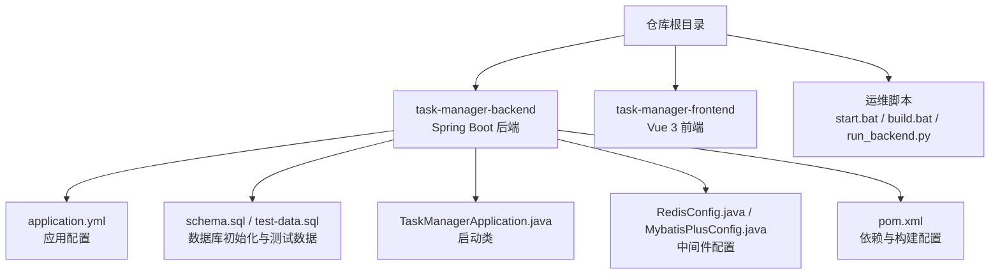
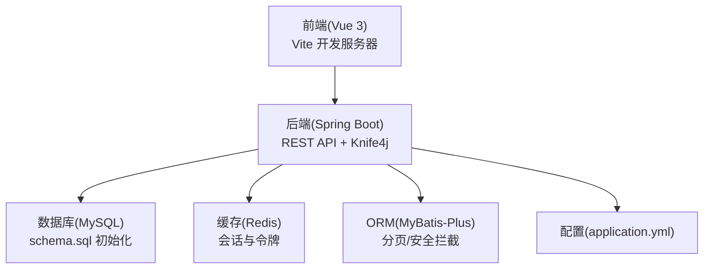
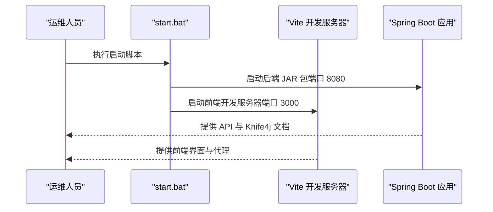
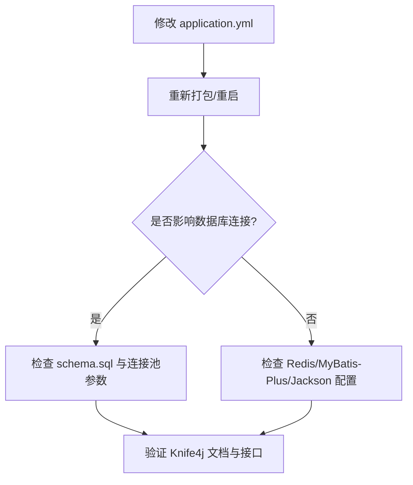
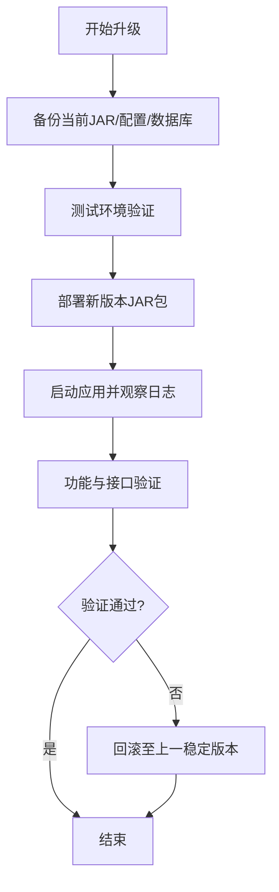
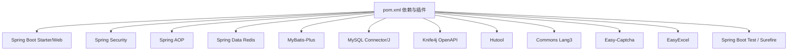

# 运维管理

<cite>
**本文引用的文件**   
- [application.yml](file://task-manager-backend/src/main/resources/application.yml)
- [pom.xml](file://task-manager-backend/pom.xml)
- [TaskManagerApplication.java](file://task-manager-backend/src/main/java/com/taskmanager/TaskManagerApplication.java)
- [RedisConfig.java](file://task-manager-backend/src/main/java/com/taskmanager/config/RedisConfig.java)
- [MybatisPlusConfig.java](file://task-manager-backend/src/main/java/com/taskmanager/config/MybatisPlusConfig.java)
- [schema.sql](file://task-manager-backend/src/main/resources/schema.sql)
- [test-data.sql](file://task-manager-backend/src/main/resources/test-data.sql)
- [CODEBUDDY.md](file://CODEBUDDY.md)
- [start.bat](file://start.bat)
- [build.bat](file://task-manager-backend/build.bat)
- [run_backend.py](file://run_backend.py)
- [application-test.yml](file://task-manager-backend/src/test/resources/application-test.yml)
</cite>

## 目录
1. [引言](#引言)
2. [项目结构](#项目结构)
3. [核心组件](#核心组件)
4. [架构总览](#架构总览)
5. [详细组件分析](#详细组件分析)
6. [依赖分析](#依赖分析)
7. [性能考虑](#性能考虑)
8. [故障排查指南](#故障排查指南)
9. [结论](#结论)
10. [附录](#附录)

## 引言
本指南面向CodeBuddy任务管理系统的运维团队，围绕日常运维操作、配置热更新、日志轮转与清理、备份与恢复、版本升级与滚动更新、运维工具使用以及文档维护等方面，提供可执行的操作步骤与最佳实践。系统采用Spring Boot + Vue 3 + MySQL + Redis + Knife4j的组合，具备清晰的分层架构与完善的日志审计能力。

## 项目结构
- 后端（Spring Boot）位于 task-manager-backend，包含配置、启动类、配置类、资源脚本与测试数据。
- 前端（Vue 3）位于 task-manager-frontend，开发与构建流程独立。
- 运维常用脚本位于仓库根目录，如启动批处理、构建批处理与Python脚本。

图表来源
- [application.yml:1-79](file://task-manager-backend/src/main/resources/application.yml#L1-L79)
- [schema.sql:1-608](file://task-manager-backend/src/main/resources/schema.sql#L1-L608)
- [TaskManagerApplication.java:1-18](file://task-manager-backend/src/main/java/com/taskmanager/TaskManagerApplication.java#L1-L18)
- [RedisConfig.java:1-32](file://task-manager-backend/src/main/java/com/taskmanager/config/RedisConfig.java#L1-L32)
- [MybatisPlusConfig.java:1-31](file://task-manager-backend/src/main/java/com/taskmanager/config/MybatisPlusConfig.java#L1-L31)
- [pom.xml:1-206](file://task-manager-backend/pom.xml#L1-L206)

章节来源
- [CODEBUDDY.md:1-115](file://CODEBUDDY.md#L1-L115)
- [application.yml:1-79](file://task-manager-backend/src/main/resources/application.yml#L1-L79)
- [schema.sql:1-608](file://task-manager-backend/src/main/resources/schema.sql#L1-L608)

## 核心组件
- 应用配置中心：application.yml集中管理数据库、Redis、MyBatis-Plus、Jackson、JWT、Server端口与Knife4j文档等。
- 启动入口：TaskManagerApplication.java负责Spring Boot启动。
- 中间件配置：RedisConfig.java统一Key/Value序列化；MybatisPlusConfig.java启用分页与安全拦截。
- 数据库脚本：schema.sql初始化核心业务表与字典、日志表；test-data.sql提供全场景测试数据。
- 构建与运行：pom.xml定义依赖与插件；build.bat与run_backend.py提供构建与启动辅助。

章节来源
- [application.yml:1-79](file://task-manager-backend/src/main/resources/application.yml#L1-L79)
- [TaskManagerApplication.java:1-18](file://task-manager-backend/src/main/java/com/taskmanager/TaskManagerApplication.java#L1-L18)
- [RedisConfig.java:1-32](file://task-manager-backend/src/main/java/com/taskmanager/config/RedisConfig.java#L1-L32)
- [MybatisPlusConfig.java:1-31](file://task-manager-backend/src/main/java/com/taskmanager/config/MybatisPlusConfig.java#L1-L31)
- [schema.sql:1-608](file://task-manager-backend/src/main/resources/schema.sql#L1-L608)
- [test-data.sql:1-558](file://task-manager-backend/src/main/resources/test-data.sql#L1-L558)
- [pom.xml:1-206](file://task-manager-backend/pom.xml#L1-L206)

## 架构总览
系统采用前后端分离架构，后端提供REST API与Knife4j文档，前端通过代理访问后端。认证采用JWT，会话信息存储于Redis，数据库使用MySQL，ORM为MyBatis-Plus。

图表来源
- [application.yml:1-79](file://task-manager-backend/src/main/resources/application.yml#L1-L79)
- [schema.sql:1-608](file://task-manager-backend/src/main/resources/schema.sql#L1-L608)
- [RedisConfig.java:1-32](file://task-manager-backend/src/main/java/com/taskmanager/config/RedisConfig.java#L1-L32)
- [MybatisPlusConfig.java:1-31](file://task-manager-backend/src/main/java/com/taskmanager/config/MybatisPlusConfig.java#L1-L31)

## 详细组件分析

### 启停管理与进程控制
- 启动后端：使用start.bat一键启动后端（Spring Boot）与前端（Vite），后端默认端口8080，前端默认端口3000。
- Python脚本：run_backend.py在Windows环境下编译并启动后端JAR包，设置Jansi输出以去除ANSI转义字符。
- 构建脚本：build.bat优先使用系统Maven，其次使用Maven Wrapper进行打包，跳过测试。

图表来源
- [start.bat:1-27](file://start.bat#L1-L27)
- [run_backend.py:1-30](file://run_backend.py#L1-L30)
- [build.bat:1-37](file://task-manager-backend/build.bat#L1-L37)

章节来源
- [start.bat:1-27](file://start.bat#L1-L27)
- [run_backend.py:1-30](file://run_backend.py#L1-L30)
- [build.bat:1-37](file://task-manager-backend/build.bat#L1-L37)

### 配置热更新与变更管理
- 应用配置：application.yml集中管理数据库、Redis、MyBatis-Plus、Jackson、JWT、Server端口与Knife4j文档。
- 构建配置：pom.xml定义依赖、仓库镜像与插件（编译、Spring Boot、测试）。
- 测试环境：application-test.yml禁用Redis自动配置，便于单元测试隔离。

图表来源
- [application.yml:1-79](file://task-manager-backend/src/main/resources/application.yml#L1-L79)
- [pom.xml:1-206](file://task-manager-backend/pom.xml#L1-L206)
- [application-test.yml:1-9](file://task-manager-backend/src/test/resources/application-test.yml#L1-L9)

章节来源
- [application.yml:1-79](file://task-manager-backend/src/main/resources/application.yml#L1-L79)
- [pom.xml:1-206](file://task-manager-backend/pom.xml#L1-L206)
- [application-test.yml:1-9](file://task-manager-backend/src/test/resources/application-test.yml#L1-L9)

### 日志轮转与清理
- 日志输出：后端默认使用标准输出打印日志（stdout），便于容器化与日志采集。
- 建议方案：结合系统日志守护进程（如logrotate）对 backend.log、frontend.log 进行轮转与压缩，保留7-30天历史，避免磁盘占满。
- 清理策略：定期清理超过保留期的日志文件，保留最近N份归档。

章节来源
- [application.yml:37-37](file://task-manager-backend/src/main/resources/application.yml#L37-L37)
- [CODEBUDDY.md:1-115](file://CODEBUDDY.md#L1-L115)

### 备份策略
- 数据库备份：使用mysqldump导出schema.sql与业务数据，建议每日增量+每周全量，存储于安全位置并校验恢复。
- 配置文件备份：application.yml与pom.xml纳入版本控制，同时在生产环境保留独立备份副本。
- 应用包备份：target目录下的JAR包与前端dist目录（如存在）应保留至少3个版本，便于快速回滚。
- 测试数据备份：test-data.sql可用于快速恢复测试环境，生产环境谨慎使用。

章节来源
- [schema.sql:1-608](file://task-manager-backend/src/main/resources/schema.sql#L1-L608)
- [test-data.sql:1-558](file://task-manager-backend/src/main/resources/test-data.sql#L1-L558)
- [application.yml:1-79](file://task-manager-backend/src/main/resources/application.yml#L1-L79)
- [pom.xml:1-206](file://task-manager-backend/pom.xml#L1-L206)

### 故障恢复流程与预案
- 系统故障（JVM/端口占用）：检查端口占用与JVM内存参数，必要时重启进程；使用start.bat或run_backend.py重新启动。
- 数据库故障（MySQL不可用）：确认连接串、账号密码与网络连通性；使用schema.sql重建基础表；检查连接池参数。
- Redis故障（会话丢失）：确认Redis服务状态与网络连通；检查RedisConfig序列化配置；必要时重建会话数据。
- 网络故障（跨服务调用失败）：检查防火墙与安全组规则；验证Knife4j文档与接口连通性。
- 回滚策略：优先回滚到上一个稳定版本的JAR包；如涉及数据库变更，先回滚代码再回滚数据库。

章节来源
- [application.yml:5-32](file://task-manager-backend/src/main/resources/application.yml#L5-L32)
- [RedisConfig.java:1-32](file://task-manager-backend/src/main/java/com/taskmanager/config/RedisConfig.java#L1-L32)
- [schema.sql:1-608](file://task-manager-backend/src/main/resources/schema.sql#L1-L608)
- [CODEBUDDY.md:1-115](file://CODEBUDDY.md#L1-L115)

### 版本升级流程
- 升级前准备：备份当前JAR包、数据库与配置文件；在测试环境验证升级包与数据库脚本。
- 升级过程：停止应用 -> 备份当前运行产物 -> 部署新版本JAR包 -> 启动应用 -> 观察日志与健康指标。
- 升级后验证：访问/doc.html确认API文档；调用关键接口验证鉴权、分页与日志记录功能；检查Redis会话是否正常续期。

图表来源
- [build.bat:1-37](file://task-manager-backend/build.bat#L1-L37)
- [application.yml:58-60](file://task-manager-backend/src/main/resources/application.yml#L58-L60)
- [CODEBUDDY.md:1-115](file://CODEBUDDY.md#L1-L115)

章节来源
- [build.bat:1-37](file://task-manager-backend/build.bat#L1-L37)
- [application.yml:58-60](file://task-manager-backend/src/main/resources/application.yml#L58-L60)

### 滚动更新实施方案
- 蓝绿部署：准备两套实例（蓝/绿），先部署新版本到备用实例，验证通过后再切换流量，最后关闭旧实例。
- 滚动重启：在多实例环境中逐批重启，每批之间留出健康检查间隔，避免全量中断。
- 流量切换：通过反向代理或负载均衡器进行灰度发布，逐步扩大新版本流量比例。

章节来源
- [CODEBUDDY.md:1-115](file://CODEBUDDY.md#L1-L115)

### 运维工具使用指南
- 数据库管理：使用MySQL客户端连接schema.sql初始化的数据库，执行DDL/DML与备份。
- 日志分析：结合系统日志轮转工具与日志聚合平台（如ELK）分析backend.log与frontend.log。
- 性能监控：关注应用端口8080的响应时间与错误率；结合数据库慢查询日志与Redis命中率进行优化。

章节来源
- [schema.sql:1-608](file://task-manager-backend/src/main/resources/schema.sql#L1-L608)
- [application.yml:58-60](file://task-manager-backend/src/main/resources/application.yml#L58-L60)
- [CODEBUDDY.md:1-115](file://CODEBUDDY.md#L1-L115)

### 运维文档维护与变更记录
- 操作手册：记录启停、备份、恢复、升级与故障处理的标准流程。
- 故障处理手册：按故障类型分类，提供快速处置步骤与回滚预案。
- 变更记录：每次变更（配置、数据库、代码）登记版本、时间、责任人与影响范围。

章节来源
- [CODEBUDDY.md:1-115](file://CODEBUDDY.md#L1-L115)

## 依赖分析
后端依赖Spring Boot Starter、Security、AOP、Redis、MyBatis-Plus、MySQL驱动、Knife4j、Hutool、Commons Lang3、Easy-Captcha、EasyExcel等；构建阶段包含编译、Spring Boot打包与测试插件。

图表来源
- [pom.xml:32-145](file://task-manager-backend/pom.xml#L32-L145)

章节来源
- [pom.xml:1-206](file://task-manager-backend/pom.xml#L1-L206)

## 性能考虑
- 连接池与超时：合理设置HikariCP最小空闲、最大连接、空闲超时与最大生存时间，避免连接泄漏与抖动。
- Redis序列化：使用JSON序列化支持复杂对象，注意序列化开销与字段一致性。
- 分页与安全：启用MyBatis-Plus分页与全表阻断保护，避免大事务与误操作。
- 日志输出：生产环境建议关闭stdout日志，改为文件或集中式日志收集。

章节来源
- [application.yml:10-16](file://task-manager-backend/src/main/resources/application.yml#L10-L16)
- [RedisConfig.java:26-31](file://task-manager-backend/src/main/java/com/taskmanager/config/RedisConfig.java#L26-L31)
- [MybatisPlusConfig.java:22-30](file://task-manager-backend/src/main/java/com/taskmanager/config/MybatisPlusConfig.java#L22-L30)

## 故障排查指南
- 启动失败：检查JDK版本（Java 17）、Maven可用性与Jansi设置；查看backend_err.log与IDE控制台输出。
- 数据库连接失败：核对application.yml中的数据库URL、账号与密码；确认MySQL服务状态与防火墙。
- Redis连接失败：核对host/port/password/database/timeout；确认Redis服务可达。
- 权限与日志：检查@PreAuthorize注解与操作日志表sys_oper_log，定位鉴权与异常原因。
- 测试环境：application-test.yml禁用Redis自动配置，避免测试污染。

章节来源
- [application.yml:5-32](file://task-manager-backend/src/main/resources/application.yml#L5-L32)
- [application-test.yml:1-9](file://task-manager-backend/src/test/resources/application-test.yml#L1-L9)
- [schema.sql:174-198](file://task-manager-backend/src/main/resources/schema.sql#L174-L198)

## 结论
通过规范的启停流程、严格的配置管理、完善的备份与恢复策略、可追溯的版本升级与滚动更新方案，以及高效的日志与监控工具，CodeBuddy任务管理系统可在生产环境中保持高可用与可维护性。建议持续完善运维文档与演练，提升团队整体运维效率与应急响应能力。

## 附录
- 关键端点与文档
  - API文档：/doc.html（Knife4j）
  - Swagger UI：/swagger-ui.html
  - API文档：/v3/api-docs
- 常用命令参考
  - 后端打包：./mvnw.cmd clean package -DskipTests
  - 后端运行：./mvnw.cmd spring-boot:run
  - 前端安装与开发：npm install / npm run dev
  - 前端构建与预览：npm run build / npm run preview

章节来源
- [CODEBUDDY.md:1-115](file://CODEBUDDY.md#L1-L115)
- [application.yml:62-79](file://task-manager-backend/src/main/resources/application.yml#L62-L79)