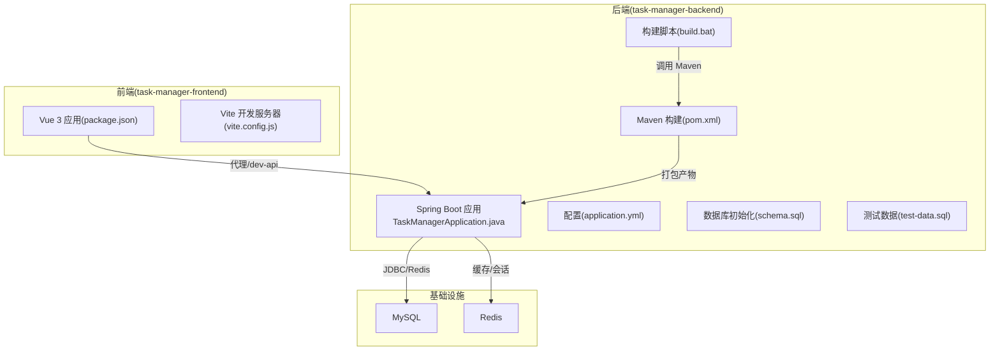
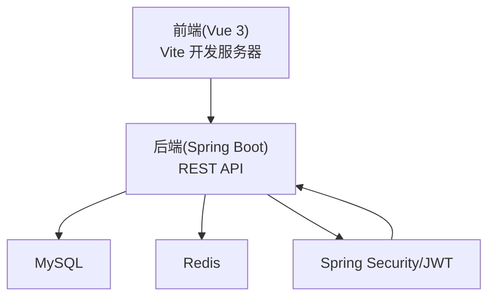
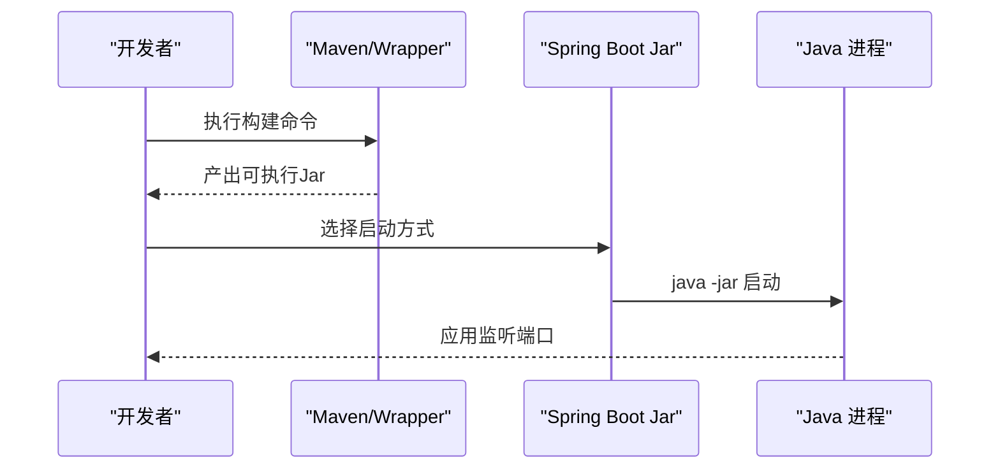
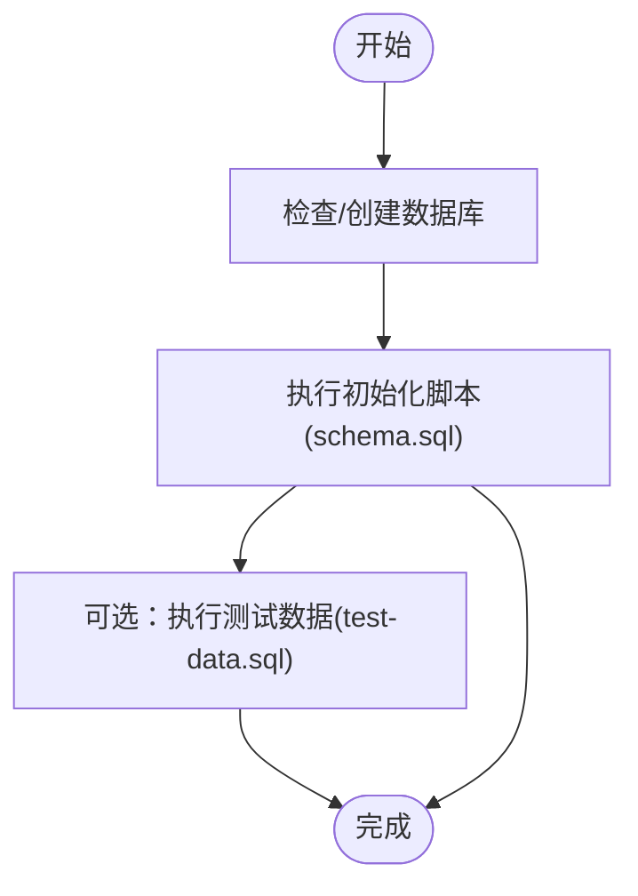
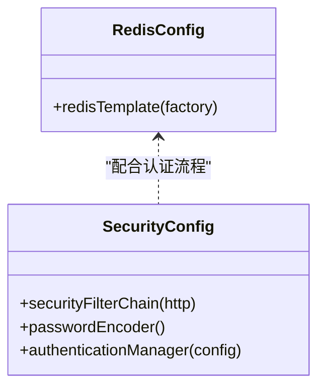
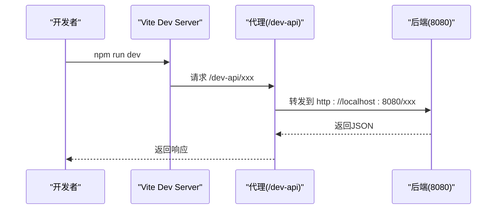
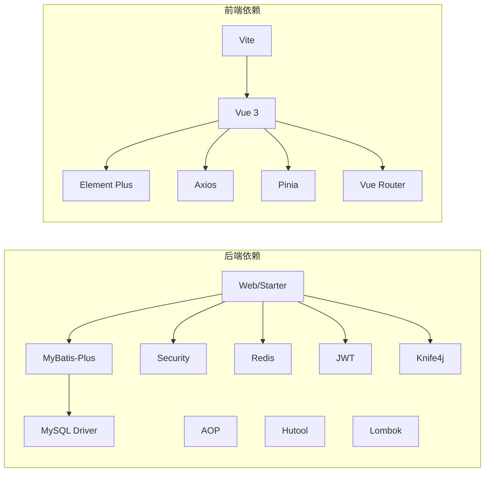

# 部署运维

<cite>
**本文引用的文件**
- [pom.xml](file://task-manager-backend/pom.xml)
- [application.yml](file://task-manager-backend/src/main/resources/application.yml)
- [schema.sql](file://task-manager-backend/src/main/resources/schema.sql)
- [test-data.sql](file://task-manager-backend/src/main/resources/test-data.sql)
- [build.bat](file://task-manager-backend/build.bat)
- [TaskManagerApplication.java](file://task-manager-backend/src/main/java/com/taskmanager/TaskManagerApplication.java)
- [RedisConfig.java](file://task-manager-backend/src/main/java/com/taskmanager/config/RedisConfig.java)
- [SecurityConfig.java](file://task-manager-backend/src/main/java/com/taskmanager/config/SecurityConfig.java)
- [package.json](file://task-manager-frontend/package.json)
- [vite.config.js](file://task-manager-frontend/vite.config.js)
- [CODEBUDDY.md](file://CODEBUDDY.md)
- [run_backend.py](file://run_backend.py)
- [start.bat](file://start.bat)
</cite>

## 目录
1. [引言](#引言)
2. [项目结构](#项目结构)
3. [核心组件](#核心组件)
4. [架构总览](#架构总览)
5. [详细组件分析](#详细组件分析)
6. [依赖分析](#依赖分析)
7. [性能考虑](#性能考虑)
8. [故障排查指南](#故障排查指南)
9. [结论](#结论)
10. [附录](#附录)

## 引言
本指南面向运维与开发团队，围绕 CodeBuddy 任务管理系统提供从开发环境到生产部署、容器化、监控告警、运维最佳实践与常见问题排查的完整方案。系统采用前后端分离架构：后端为 Spring Boot + MyBatis-Plus + Spring Security + Redis + MySQL；前端为 Vue 3 + Vite + Element Plus。

## 项目结构
- 后端模块：task-manager-backend（Spring Boot 应用）
- 前端模块：task-manager-frontend（Vue 3 应用）
- 运维辅助：CODEBUDDY.md（技术栈与命令说明）、批处理与脚本（build.bat、start.bat、run_backend.py）

图表来源
- [TaskManagerApplication.java](file://task-manager-backend/src/main/java/com/taskmanager/TaskManagerApplication.java)
- [application.yml](file://task-manager-backend/src/main/resources/application.yml)
- [schema.sql](file://task-manager-backend/src/main/resources/schema.sql)
- [pom.xml](file://task-manager-backend/pom.xml)
- [build.bat](file://task-manager-backend/build.bat)
- [package.json](file://task-manager-frontend/package.json)
- [vite.config.js](file://task-manager-frontend/vite.config.js)

章节来源
- [CODEBUDDY.md: 40-78:40-78](file://CODEBUDDY.md#L40-L78)

## 核心组件
- 后端应用：Spring Boot 主类负责启动，扫描 Mapper 包，加载配置与安全策略。
- 数据源与连接池：HikariCP，支持连接池参数调优。
- 缓存：Redis，配置了 Key/Value 序列化策略，保障复杂对象存储。
- 安全：基于 JWT 的无状态认证，全局异常与权限控制。
- 前端：Vite 开发服务器，代理后端接口，构建产物用于生产部署。

章节来源
- [TaskManagerApplication.java: 10-17:10-17](file://task-manager-backend/src/main/java/com/taskmanager/TaskManagerApplication.java#L10-L17)
- [application.yml: 1-79:1-79](file://task-manager-backend/src/main/resources/application.yml#L1-L79)
- [RedisConfig.java: 15-32:15-32](file://task-manager-backend/src/main/java/com/taskmanager/config/RedisConfig.java#L15-L32)
- [SecurityConfig.java: 31-115:31-115](file://task-manager-backend/src/main/java/com/taskmanager/config/SecurityConfig.java#L31-L115)
- [package.json: 1-30:1-30](file://task-manager-frontend/package.json#L1-L30)
- [vite.config.js: 1-28:1-28](file://task-manager-frontend/vite.config.js#L1-L28)

## 架构总览
系统采用前后端分离，后端提供 REST API，前端通过代理访问后端。认证采用 JWT，权限控制基于 RBAC。数据库与缓存分别承载持久化与会话/缓存需求。

图表来源
- [CODEBUDDY.md: 79-85:79-85](file://CODEBUDDY.md#L79-L85)
- [SecurityConfig.java: 47-97:47-97](file://task-manager-backend/src/main/java/com/taskmanager/config/SecurityConfig.java#L47-L97)
- [application.yml: 5-60:5-60](file://task-manager-backend/src/main/resources/application.yml#L5-L60)

## 详细组件分析

### 后端应用与构建
- 启动类：扫描 Mapper 包，启动 Spring Boot 应用。
- 构建：支持系统 Maven 与 Maven Wrapper，跳过测试打包。
- 运行：提供 Python 脚本与批处理脚本两种方式启动后端。

图表来源
- [build.bat: 6-26:6-26](file://task-manager-backend/build.bat#L6-L26)
- [run_backend.py: 15-29:15-29](file://run_backend.py#L15-L29)
- [TaskManagerApplication.java: 14-16:14-16](file://task-manager-backend/src/main/java/com/taskmanager/TaskManagerApplication.java#L14-L16)

章节来源
- [TaskManagerApplication.java: 10-17:10-17](file://task-manager-backend/src/main/java/com/taskmanager/TaskManagerApplication.java#L10-L17)
- [build.bat: 1-37:1-37](file://task-manager-backend/build.bat#L1-L37)
- [run_backend.py: 1-30:1-30](file://run_backend.py#L1-L30)

### 数据库与初始化
- 数据库：MySQL，使用 HikariCP 连接池。
- 初始化：提供 schema.sql 创建核心表与字典、菜单、用户、角色等基础数据；test-data.sql 提供全场景测试数据。
- 建议：生产环境使用独立数据库实例与账号，严格区分初始化脚本与增量迁移脚本。

图表来源
- [application.yml: 5-16:5-16](file://task-manager-backend/src/main/resources/application.yml#L5-L16)
- [schema.sql: 1-608:1-608](file://task-manager-backend/src/main/resources/schema.sql#L1-L608)
- [test-data.sql: 1-558:1-558](file://task-manager-backend/src/main/resources/test-data.sql#L1-L558)

章节来源
- [application.yml: 5-16:5-16](file://task-manager-backend/src/main/resources/application.yml#L5-L16)
- [schema.sql: 1-608:1-608](file://task-manager-backend/src/main/resources/schema.sql#L1-L608)
- [test-data.sql: 1-558:1-558](file://task-manager-backend/src/main/resources/test-data.sql#L1-L558)

### 缓存与会话
- Redis：配置 Key/HashKey 使用字符串序列化，Value 使用 JSON 序列化，便于存储复杂对象。
- 会话：基于 JWT 的无状态会话，结合 Redis 存储登录用户信息与续期。

图表来源
- [RedisConfig.java: 15-32:15-32](file://task-manager-backend/src/main/java/com/taskmanager/config/RedisConfig.java#L15-L32)
- [SecurityConfig.java: 31-115:31-115](file://task-manager-backend/src/main/java/com/taskmanager/config/SecurityConfig.java#L31-L115)

章节来源
- [RedisConfig.java: 15-32:15-32](file://task-manager-backend/src/main/java/com/taskmanager/config/RedisConfig.java#L15-L32)
- [SecurityConfig.java: 47-97:47-97](file://task-manager-backend/src/main/java/com/taskmanager/config/SecurityConfig.java#L47-L97)

### 前端开发与构建
- 开发：Vite 代理将 /dev-api 重写转发至后端 8080 端口。
- 构建：生成静态资源，用于生产部署。
- 依赖：Vue 3、Element Plus、Axios、Pinia、Vue Router 等。

图表来源
- [vite.config.js: 14-25:14-25](file://task-manager-frontend/vite.config.js#L14-L25)
- [CODEBUDDY.md: 104-107:104-107](file://CODEBUDDY.md#L104-L107)

章节来源
- [package.json: 6-10:6-10](file://task-manager-frontend/package.json#L6-L10)
- [vite.config.js: 1-28:1-28](file://task-manager-frontend/vite.config.js#L1-L28)
- [CODEBUDDY.md: 23-38:23-38](file://CODEBUDDY.md#L23-L38)

## 依赖分析
- 后端依赖：Spring Boot Starter Web、Security、AOP、Redis、MyBatis-Plus、MySQL Driver、JWT、Knife4j、Hutool、Commons Lang3、Easy-Captcha、EasyExcel、Lombok、测试依赖等。
- 前端依赖：Vue 3、Element Plus、Axios、Pinia、Vue Router、Vite 插件等。
- 构建工具：Maven（系统或 Wrapper），Windows 批处理脚本。

图表来源
- [pom.xml: 32-145:32-145](file://task-manager-backend/pom.xml#L32-L145)
- [package.json: 11-28:11-28](file://task-manager-frontend/package.json#L11-L28)

章节来源
- [pom.xml: 20-30:20-30](file://task-manager-backend/pom.xml#L20-L30)
- [package.json: 1-30:1-30](file://task-manager-frontend/package.json#L1-L30)

## 性能考虑
- 连接池：合理设置最小空闲、最大连接、空闲超时、最大生命周期与连接超时，避免连接泄漏与抖动。
- 缓存：Redis 连接池大小与等待时间需与并发请求匹配；Key/Value 序列化策略影响吞吐与内存占用。
- 日志：MyBatis 输出 SQL 日志仅在开发/调试阶段开启，生产关闭以降低 IO。
- 前端：构建产物启用压缩与缓存策略，减少首屏加载时间。
- 安全：JWT 过期时间与续期策略平衡用户体验与安全性。

章节来源
- [application.yml: 10-44:10-44](file://task-manager-backend/src/main/resources/application.yml#L10-L44)
- [RedisConfig.java: 22-31:22-31](file://task-manager-backend/src/main/java/com/taskmanager/config/RedisConfig.java#L22-L31)
- [CODEBUDDY.md: 61-68:61-68](file://CODEBUDDY.md#L61-L68)

## 故障排查指南
- 启动失败（Maven/Wrapper）
  - 现象：构建脚本报错或找不到 mvn。
  - 处理：确认系统已安装 Maven 或修复 mvnw.cmd；批处理脚本会自动回退到 mvnw.cmd。
- 启动失败（JAR 未生成）
  - 现象：构建成功判断失败。
  - 处理：检查依赖下载、编译阶段错误；确认目标目录存在可执行 Jar。
- 启动失败（端口占用）
  - 现象：8080/3000 端口被占用。
  - 处理：修改后端 server.port 或前端 server.port；释放端口。
- 数据库连接失败
  - 现象：应用无法连接 MySQL。
  - 处理：核对 application.yml 中的数据库 URL、用户名、密码；确认 MySQL 服务与防火墙；初始化 schema.sql。
- Redis 连接失败
  - 现象：应用无法连接 Redis。
  - 处理：核对 application.yml 中的 Redis host/port/password/database；确认 Redis 服务。
- 前端代理无效
  - 现象：访问 /dev-api 404 或跨域。
  - 处理：确认 vite.config.js 代理配置；确保后端已启动并监听 8080。
- 认证失败/401
  - 现象：未登录或 Token 失效。
  - 处理：确认登录接口返回 Token 并正确放入请求头；检查 SecurityConfig 放行规则与 JWT 续期逻辑。

章节来源
- [build.bat: 6-26:6-26](file://task-manager-backend/build.bat#L6-L26)
- [start.bat: 8-17:8-17](file://start.bat#L8-L17)
- [application.yml: 5-60:5-60](file://task-manager-backend/src/main/resources/application.yml#L5-L60)
- [vite.config.js: 18-24:18-24](file://task-manager-frontend/vite.config.js#L18-L24)
- [SecurityConfig.java: 58-94:58-94](file://task-manager-backend/src/main/java/com/taskmanager/config/SecurityConfig.java#L58-L94)

## 结论
本指南提供了从开发到生产的完整运维路径：明确环境要求、安装配置、初始化脚本、打包构建、前后端部署要点，并给出容器化、监控告警、备份恢复、版本升级与滚动更新的实施建议。建议在生产环境中严格区分配置与密钥，启用健康检查与日志聚合，定期演练故障恢复与升级流程。

## 附录

### 开发环境搭建步骤
- JDK 17：安装并配置 JAVA_HOME。
- Maven：安装或使用 Maven Wrapper（项目已内置）。
- MySQL：安装并创建数据库，执行初始化脚本。
- Redis：安装并启动服务。
- Node.js：安装并执行前端依赖安装。
- 启动顺序：先 MySQL/Redis，再后端（Maven/Wrapper 或批处理/Python 脚本），最后前端。

章节来源
- [pom.xml: 20-30:20-30](file://task-manager-backend/pom.xml#L20-L30)
- [application.yml: 5-60:5-60](file://task-manager-backend/src/main/resources/application.yml#L5-L60)
- [schema.sql: 1-608:1-608](file://task-manager-backend/src/main/resources/schema.sql#L1-L608)
- [CODEBUDDY.md: 3-21:3-21](file://CODEBUDDY.md#L3-L21)

### 生产环境部署流程
- 后端
  - 使用 Maven 清理并打包（跳过测试），生成可执行 Jar。
  - 准备独立数据库与 Redis 实例，调整 application.yml 中的连接参数。
  - 以无交互方式启动后端进程（守护进程/系统服务），配置开机自启与日志输出。
- 前端
  - 使用 npm run build 生成静态资源。
  - 将静态资源部署至 Nginx/Apache，配置反向代理与缓存策略。
  - 如需 API 代理，可在 Nginx 中配置 /api 前缀转发至后端。
- 健康检查
  - 后端：对外暴露健康端点（Spring Boot Actuator），Nginx/负载均衡探活。
  - 前端：静态资源 200/404 探活。

章节来源
- [build.bat: 6-11:6-11](file://task-manager-backend/build.bat#L6-L11)
- [CODEBUDDY.md: 3-21:3-21](file://CODEBUDDY.md#L3-L21)
- [package.json: 6-10:6-10](file://task-manager-frontend/package.json#L6-L10)

### 容器化部署（建议）
- Docker 镜像
  - 后端：基于 OpenJDK 17 镜像，复制可执行 Jar，暴露 8080，设置启动命令。
  - 前端：基于 Nginx 镜像，复制构建产物，配置静态站点与 /api 代理。
  - 数据库与缓存：使用官方镜像，挂载持久化卷。
- 编排
  - 使用 Docker Compose 或 Kubernetes，定义服务、网络、卷与环境变量。
  - 配置健康检查、重启策略与资源限制。
- 服务发现与负载均衡
  - 使用 Nginx/Kubernetes Service/Ingress 实现流量分发与灰度发布。

[本节为概念性指导，不直接映射具体源文件]

### 监控告警配置（建议）
- 应用健康检查
  - 启用 Actuator（后端），暴露 /actuator/health、/actuator/prometheus 等端点。
- 性能指标
  - 集成 Micrometer 与 Prometheus/Grafana，采集 JVM、数据库连接池、Redis、HTTP 请求指标。
- 日志收集与分析
  - 使用 Filebeat/Fluent Bit 收集容器/主机日志，集中到 ELK/Elastic Stack 或 Loki/Grafana。
- 告警
  - 基于阈值与趋势设置告警，通知到企业微信/钉钉/邮件。

[本节为概念性指导，不直接映射具体源文件]

### 运维最佳实践
- 备份策略
  - 数据库：定时全量+增量备份，校验恢复演练。
  - 配置与密钥：版本化管理，不落盘敏感信息。
- 故障恢复
  - 快速定位：日志、指标、链路追踪；隔离故障域。
  - 回滚：蓝绿/金丝雀发布，快速回滚。
- 版本升级与滚动更新
  - 后端：灰度发布，逐步替换实例，健康检查通过后再继续。
  - 前端：静态资源版本化，缓存失效策略。
- 运维工具
  - 日志：ELK/Loki、Kibana/Grafana、Sentry（前端错误）。
  - 监控：Prometheus/Grafana、Zabbix、CloudWatch。
  - 数据库：Navicat/DBeaver、Percona Toolkit、pt-online-schema-change。

[本节为概念性指导，不直接映射具体源文件]