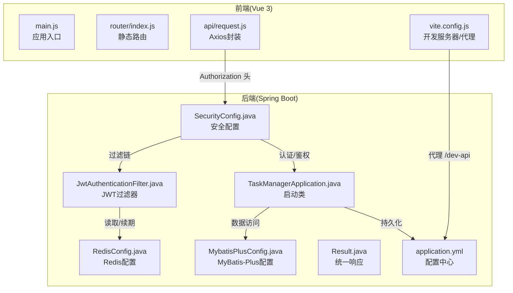
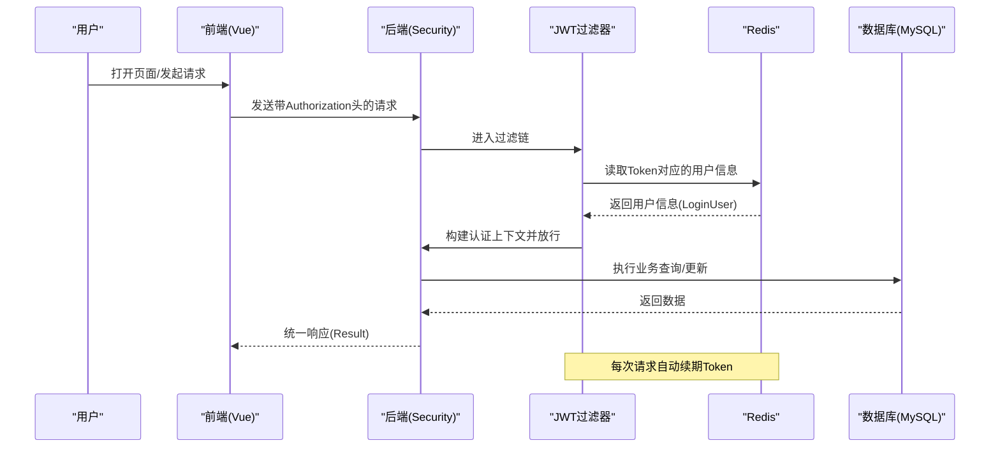
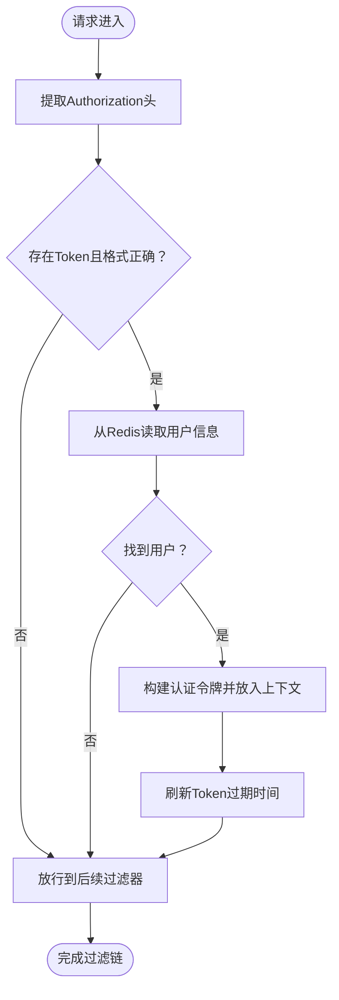
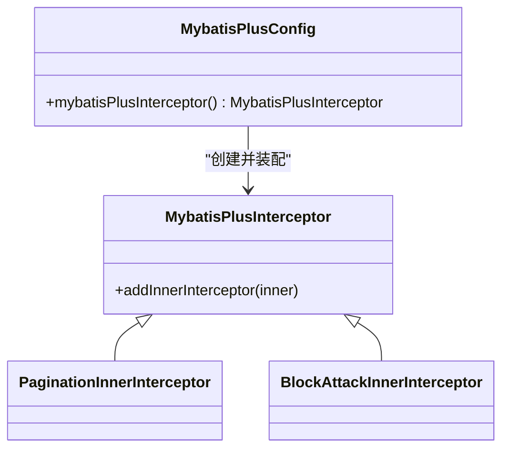
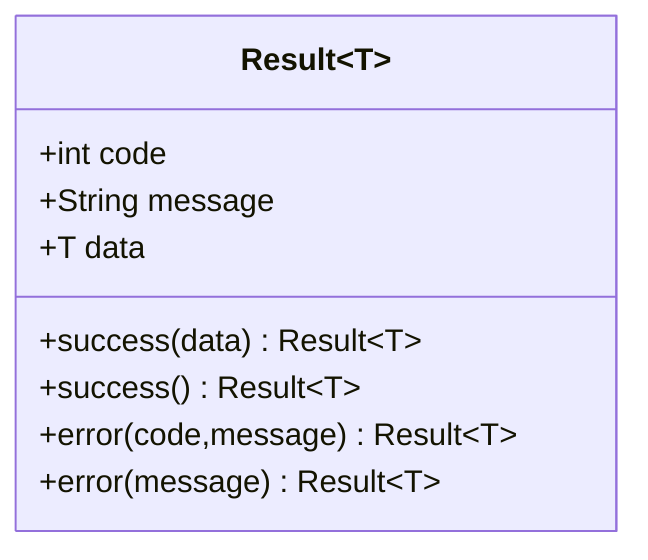
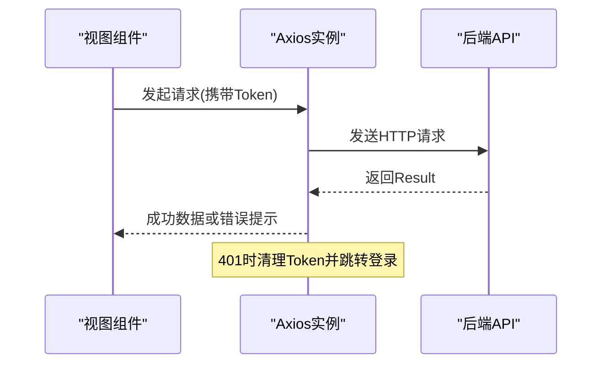
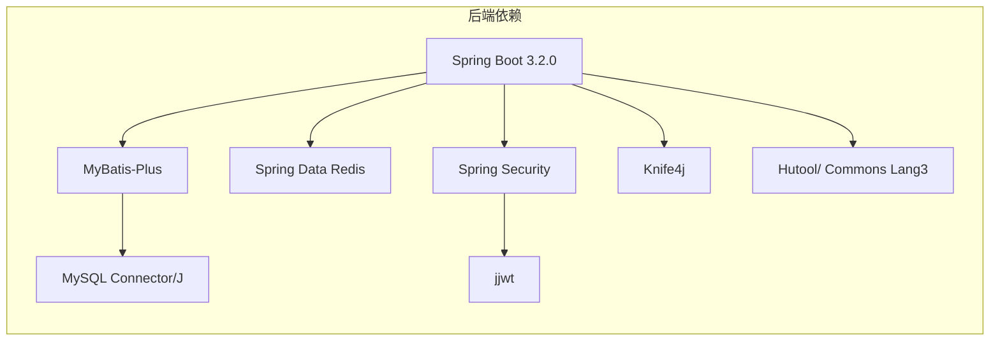

# 技术栈概览

<cite>
**本文引用的文件**
- [pom.xml](file://task-manager-backend/pom.xml)
- [application.yml](file://task-manager-backend/src/main/resources/application.yml)
- [TaskManagerApplication.java](file://task-manager-backend/src/main/java/com/taskmanager/TaskManagerApplication.java)
- [SecurityConfig.java](file://task-manager-backend/src/main/java/com/taskmanager/config/SecurityConfig.java)
- [RedisConfig.java](file://task-manager-backend/src/main/java/com/taskmanager/config/RedisConfig.java)
- [MybatisPlusConfig.java](file://task-manager-backend/src/main/java/com/taskmanager/config/MybatisPlusConfig.java)
- [JwtAuthenticationFilter.java](file://task-manager-backend/src/main/java/com/taskmanager/security/JwtAuthenticationFilter.java)
- [Result.java](file://task-manager-backend/src/main/java/com/taskmanager/common/Result.java)
- [package.json](file://task-manager-frontend/package.json)
- [vite.config.js](file://task-manager-frontend/vite.config.js)
- [main.js](file://task-manager-frontend/src/main.js)
- [router/index.js](file://task-manager-frontend/src/router/index.js)
- [api/request.js](file://task-manager-frontend/src/api/request.js)
- [CODEBUDDY.md](file://CODEBUDDY.md)
</cite>

## 目录
1. [简介](#简介)
2. [项目结构](#项目结构)
3. [核心组件](#核心组件)
4. [架构总览](#架构总览)
5. [详细组件分析](#详细组件分析)
6. [依赖分析](#依赖分析)
7. [性能考量](#性能考量)
8. [故障排查指南](#故障排查指南)
9. [结论](#结论)
10. [附录](#附录)

## 简介
本文件面向CodeBuddy任务管理系统，提供后端与前端技术栈的系统性概览。后端采用Spring Boot 3.2.0 + Java 17 + MyBatis-Plus + Spring Security + Redis + MySQL的组合；前端采用Vue 3 + Vite + Element Plus + Pinia + Vue Router 4。文档解释各组件的技术特点、协作关系、集成方式，并给出技术选型背景与权衡建议，帮助开发者快速建立整体认知。

## 项目结构
项目采用前后端分离架构，后端为独立的Spring Boot工程，前端为独立的Vue 3工程。两者通过HTTP API通信，开发阶段通过Vite代理将/dev-api转发至后端服务端口，实现跨域与联调便利。

**图表来源**
- [main.js:1-24](file://task-manager-frontend/src/main.js#L1-L24)
- [router/index.js:1-32](file://task-manager-frontend/src/router/index.js#L1-L32)
- [api/request.js:1-63](file://task-manager-frontend/src/api/request.js#L1-L63)
- [vite.config.js:1-28](file://task-manager-frontend/vite.config.js#L1-L28)
- [TaskManagerApplication.java:1-18](file://task-manager-backend/src/main/java/com/taskmanager/TaskManagerApplication.java#L1-L18)
- [SecurityConfig.java:1-116](file://task-manager-backend/src/main/java/com/taskmanager/config/SecurityConfig.java#L1-L116)
- [RedisConfig.java:1-33](file://task-manager-backend/src/main/java/com/taskmanager/config/RedisConfig.java#L1-L33)
- [MybatisPlusConfig.java:1-32](file://task-manager-backend/src/main/java/com/taskmanager/config/MybatisPlusConfig.java#L1-L32)
- [JwtAuthenticationFilter.java:1-70](file://task-manager-backend/src/main/java/com/taskmanager/security/JwtAuthenticationFilter.java#L1-L70)
- [Result.java:1-76](file://task-manager-backend/src/main/java/com/taskmanager/common/Result.java#L1-L76)
- [application.yml:1-79](file://task-manager-backend/src/main/resources/application.yml#L1-L79)

**章节来源**
- [CODEBUDDY.md:40-78](file://CODEBUDDY.md#L40-L78)
- [pom.xml:1-206](file://task-manager-backend/pom.xml#L1-L206)
- [package.json:1-30](file://task-manager-frontend/package.json#L1-L30)

## 核心组件
- 后端技术栈
  - Spring Boot 3.2.0：提供自动配置、Starter生态与生产就绪特性，简化依赖与部署。
  - Java 17：长期支持版本，具备稳定性能与安全性。
  - MyBatis-Plus 3.5.5：增强数据访问层，提供分页、逻辑删除、自动填充等能力。
  - Spring Security：提供认证、授权、CSRF防护与无状态会话策略。
  - Redis：缓存与会话存储，结合JWT实现用户状态管理与自动续期。
  - MySQL：关系型数据库，配合HikariCP连接池与MyBatis-Plus使用。
- 前端技术栈
  - Vue 3：组合式API与更好的TypeScript支持，提升开发体验。
  - Vite：快速冷启动与热更新，优化开发体验。
  - Element Plus：完善的UI组件库，适配中后台管理场景。
  - Pinia：轻量状态管理，替代Vuex，API简洁直观。
  - Vue Router 4：支持静态与动态路由，配合后端菜单树实现权限路由。

**章节来源**
- [CODEBUDDY.md:40-44](file://CODEBUDDY.md#L40-L44)
- [pom.xml:20-30](file://task-manager-backend/pom.xml#L20-L30)
- [application.yml:1-79](file://task-manager-backend/src/main/resources/application.yml#L1-L79)
- [package.json:11-21](file://task-manager-frontend/package.json#L11-L21)

## 架构总览
系统遵循“前后端分离 + RBAC权限控制”的三层架构风格。后端以REST API为中心，统一响应格式与权限注解；前端通过Axios拦截器注入Token，路由守卫与后端菜单树联动实现动态路由。

**图表来源**
- [SecurityConfig.java:47-97](file://task-manager-backend/src/main/java/com/taskmanager/config/SecurityConfig.java#L47-L97)
- [JwtAuthenticationFilter.java:37-57](file://task-manager-backend/src/main/java/com/taskmanager/security/JwtAuthenticationFilter.java#L37-L57)
- [RedisConfig.java:18-31](file://task-manager-backend/src/main/java/com/taskmanager/config/RedisConfig.java#L18-L31)
- [Result.java:15-31](file://task-manager-backend/src/main/java/com/taskmanager/common/Result.java#L15-L31)
- [api/request.js:10-20](file://task-manager-frontend/src/api/request.js#L10-L20)

## 详细组件分析

### 后端：Spring Security与JWT认证流程
- 安全过滤链禁用CSRF，启用无状态会话，基于请求匹配器放行公开接口，其余接口均需认证。
- JWT过滤器从请求头提取Token，从Redis恢复用户信息，构建认证令牌并设置到Security上下文，随后自动续期。
- 认证入口点与拒绝处理器统一返回JSON格式错误响应，便于前端处理。

**图表来源**
- [SecurityConfig.java:47-97](file://task-manager-backend/src/main/java/com/taskmanager/config/SecurityConfig.java#L47-L97)
- [JwtAuthenticationFilter.java:37-57](file://task-manager-backend/src/main/java/com/taskmanager/security/JwtAuthenticationFilter.java#L37-L57)
- [application.yml:51-57](file://task-manager-backend/src/main/resources/application.yml#L51-L57)

**章节来源**
- [SecurityConfig.java:1-116](file://task-manager-backend/src/main/java/com/taskmanager/config/SecurityConfig.java#L1-L116)
- [JwtAuthenticationFilter.java:1-70](file://task-manager-backend/src/main/java/com/taskmanager/security/JwtAuthenticationFilter.java#L1-L70)
- [application.yml:51-57](file://task-manager-backend/src/main/resources/application.yml#L51-L57)

### 后端：MyBatis-Plus配置与分页/防护
- 配置分页插件与防止全表更新/删除插件，适配MySQL数据库。
- MyBatis-Plus全局配置开启下划线转驼峰映射、逻辑删除字段与值、Mapper XML扫描路径等。

**图表来源**
- [MybatisPlusConfig.java:16-31](file://task-manager-backend/src/main/java/com/taskmanager/config/MybatisPlusConfig.java#L16-L31)
- [application.yml:33-45](file://task-manager-backend/src/main/resources/application.yml#L33-L45)

**章节来源**
- [MybatisPlusConfig.java:1-32](file://task-manager-backend/src/main/java/com/taskmanager/config/MybatisPlusConfig.java#L1-L32)
- [application.yml:33-45](file://task-manager-backend/src/main/resources/application.yml#L33-L45)

### 后端：统一响应与异常处理
- 统一响应Result包含状态码、消息与数据，Controller必须返回该格式。
- 全局异常处理器与方法级权限注解共同保证接口安全与一致的错误输出。

**图表来源**
- [Result.java:12-76](file://task-manager-backend/src/main/java/com/taskmanager/common/Result.java#L12-L76)

**章节来源**
- [Result.java:1-76](file://task-manager-backend/src/main/java/com/taskmanager/common/Result.java#L1-L76)
- [CODEBUDDY.md:63-67](file://CODEBUDDY.md#L63-L67)

### 前端：Axios拦截器与路由守卫
- Axios实例通过请求拦截器注入Authorization头，响应拦截器统一处理业务错误与401跳转。
- 路由采用静态基础路由与动态菜单树结合的方式，登录后根据后端返回的菜单树挂载动态路由。

**图表来源**
- [api/request.js:10-60](file://task-manager-frontend/src/api/request.js#L10-L60)
- [router/index.js:1-32](file://task-manager-frontend/src/router/index.js#L1-L32)

**章节来源**
- [api/request.js:1-63](file://task-manager-frontend/src/api/request.js#L1-L63)
- [router/index.js:1-32](file://task-manager-frontend/src/router/index.js#L1-L32)
- [main.js:1-24](file://task-manager-frontend/src/main.js#L1-L24)

### 前端：开发代理与构建
- Vite开发服务器将/dev-api代理到后端8080端口，前端无需关心BASE_URL。
- 依赖管理与脚本由package.json定义，构建产物用于生产环境部署。

**章节来源**
- [vite.config.js:1-28](file://task-manager-frontend/vite.config.js#L1-L28)
- [package.json:1-30](file://task-manager-frontend/package.json#L1-L30)

## 依赖分析
后端依赖通过Maven集中管理，核心模块包括Web、Security、AOP、Redis、MyBatis-Plus、MySQL驱动、JWT、Knife4j、工具库等。前端通过npm管理依赖，核心包括Vue 3、Element Plus、Pinia、Vue Router与Vite。

**图表来源**
- [pom.xml:32-145](file://task-manager-backend/pom.xml#L32-L145)

**章节来源**
- [pom.xml:1-206](file://task-manager-backend/pom.xml#L1-L206)

## 性能考量
- 连接池与数据库：HikariCP连接池参数合理，适合中小规模并发；建议结合压测调整最大连接数与超时。
- 缓存策略：Redis用于Token与会话缓存，注意Key过期策略与内存占用；对热点数据可增加本地缓存。
- ORM与分页：MyBatis-Plus分页插件避免一次性加载大结果集；逻辑删除减少物理删除带来的锁竞争。
- 前端性能：Vite热更新与按需加载组件；Element Plus按需引入与Tree Shaking降低包体。
- 安全与鉴权：无状态JWT减少会话存储压力；方法级权限注解避免重复校验逻辑。

## 故障排查指南
- 登录后401：检查前端是否正确注入Authorization头，后端JWT过滤器是否正确解析Token，Redis中是否存在对应键。
- 跨域问题：确认Vite代理配置与后端CORS配置一致，代理路径是否匹配。
- 接口返回业务错误：查看后端统一响应Result中的code与message，定位具体异常。
- 数据库连接失败：核对application.yml中的数据库URL、用户名、密码与驱动类名。
- Redis连接失败：核对host/port/password与连接超时配置。

**章节来源**
- [api/request.js:42-59](file://task-manager-frontend/src/api/request.js#L42-L59)
- [SecurityConfig.java:58-74](file://task-manager-backend/src/main/java/com/taskmanager/config/SecurityConfig.java#L58-L74)
- [application.yml:5-32](file://task-manager-backend/src/main/resources/application.yml#L5-L32)

## 结论
该技术栈在功能完备性、可维护性与开发效率之间取得良好平衡：后端以Spring Boot为核心，结合MyBatis-Plus与Spring Security实现高效的数据访问与安全控制；前端以Vue 3为基础，配合Vite与Element Plus构建现代化界面。通过统一响应、JWT认证与动态路由，系统具备清晰的边界与良好的扩展性。建议在后续迭代中持续关注性能指标与安全基线，逐步完善监控与可观测性体系。

## 附录
- 开发常用命令与技术要点可参考项目文档说明。

**章节来源**
- [CODEBUDDY.md:3-38](file://CODEBUDDY.md#L3-L38)