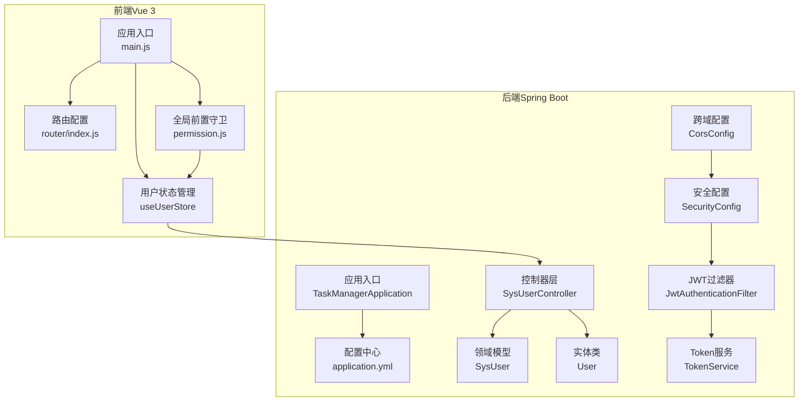
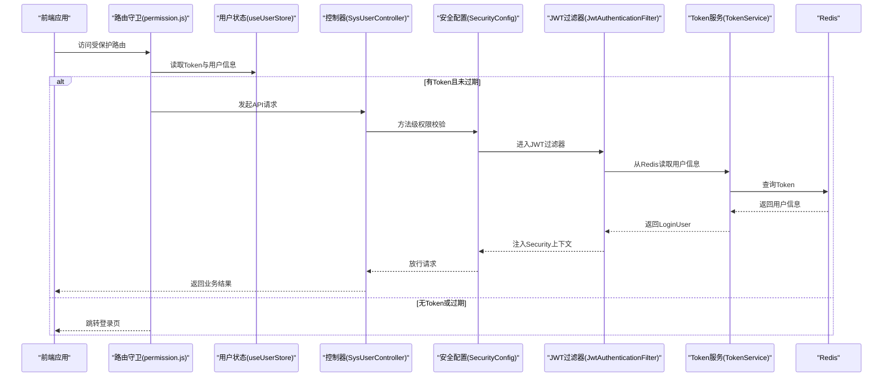
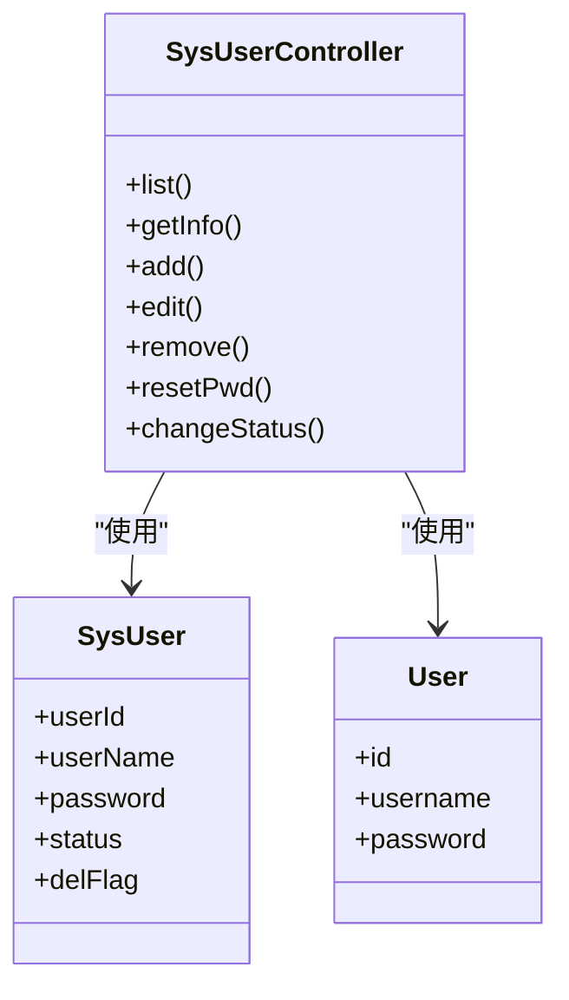
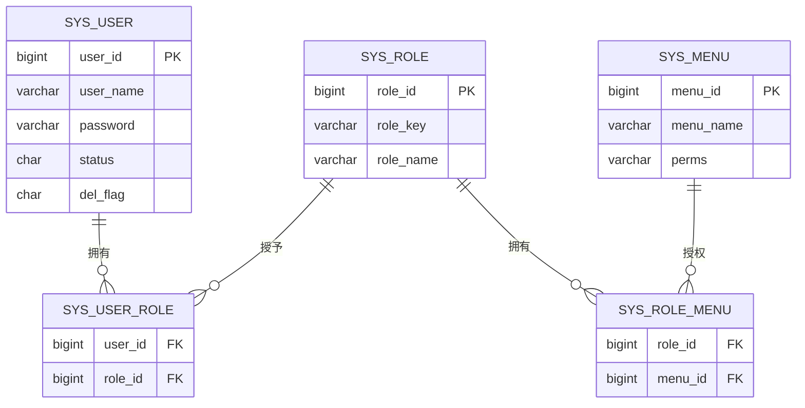
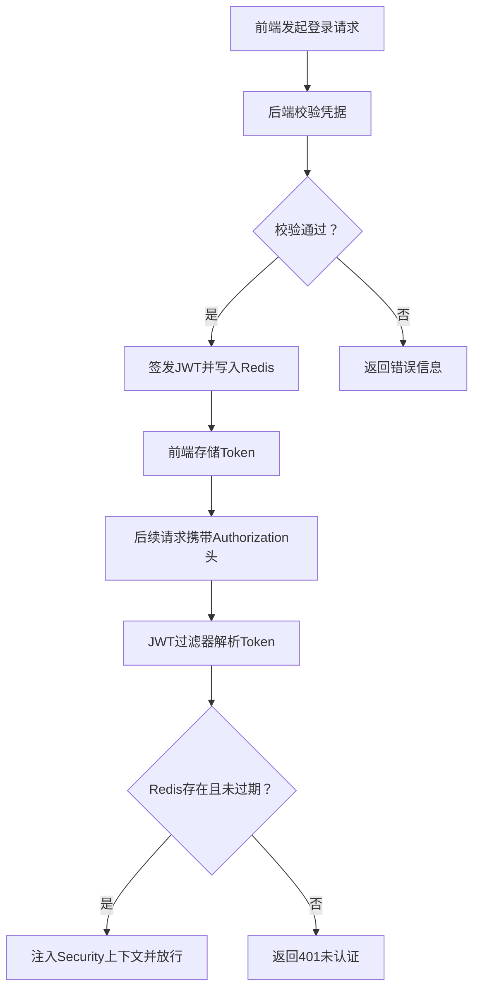
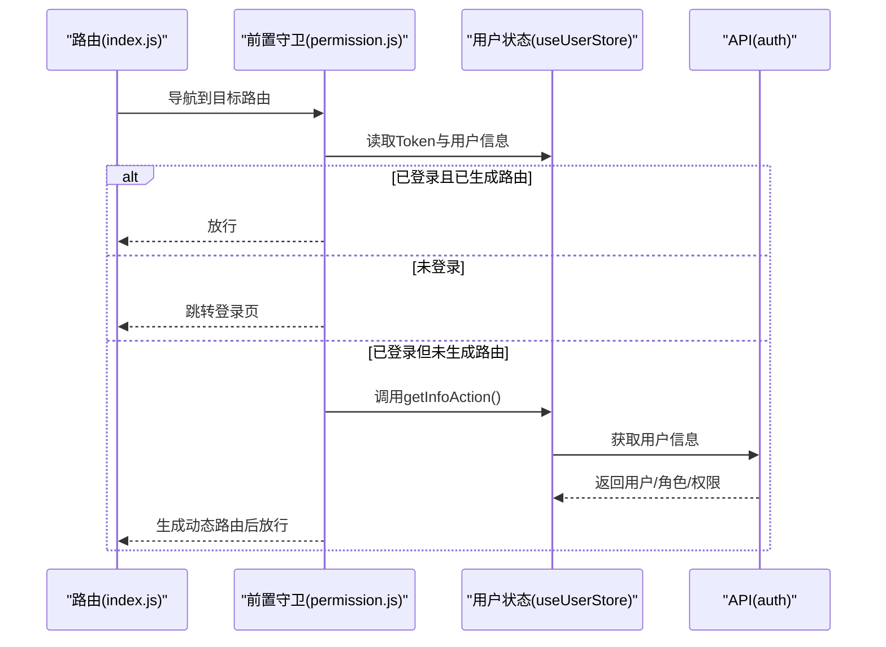
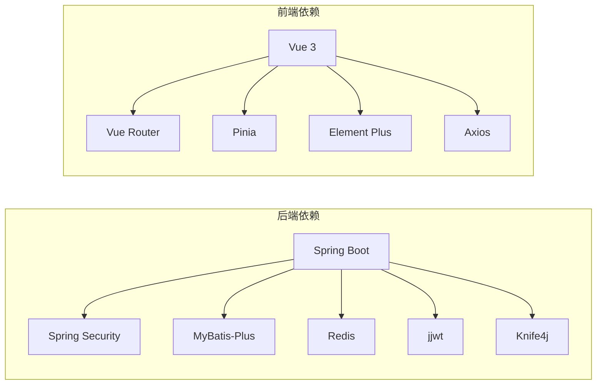

# 整体架构设计

<cite>
**本文引用的文件**
- [TaskManagerApplication.java](file://task-manager-backend/src/main/java/com/taskmanager/TaskManagerApplication.java)
- [application.yml](file://task-manager-backend/src/main/resources/application.yml)
- [SecurityConfig.java](file://task-manager-backend/src/main/java/com/taskmanager/config/SecurityConfig.java)
- [CorsConfig.java](file://task-manager-backend/src/main/java/com/taskmanager/config/CorsConfig.java)
- [JwtAuthenticationFilter.java](file://task-manager-backend/src/main/java/com/taskmanager/security/JwtAuthenticationFilter.java)
- [TokenService.java](file://task-manager-backend/src/main/java/com/taskmanager/security/TokenService.java)
- [SysUserController.java](file://task-manager-backend/src/main/java/com/taskmanager/controller/SysUserController.java)
- [SysUser.java](file://task-manager-backend/src/main/java/com/taskmanager/domain/SysUser.java)
- [User.java](file://task-manager-backend/src/main/java/com/taskmanager/entity/User.java)
- [main.js](file://task-manager-frontend/src/main.js)
- [package.json](file://task-manager-frontend/package.json)
- [index.js](file://task-manager-frontend/src/router/index.js)
- [permission.js](file://task-manager-frontend/src/permission.js)
- [useUserStore.js](file://task-manager-frontend/src/store/modules/useUserStore.js)
- [pom.xml](file://task-manager-backend/pom.xml)
</cite>

## 目录
1. [引言](#引言)
2. [项目结构](#项目结构)
3. [核心组件](#核心组件)
4. [架构总览](#架构总览)
5. [详细组件分析](#详细组件分析)
6. [依赖分析](#依赖分析)
7. [性能考虑](#性能考虑)
8. [故障排查指南](#故障排查指南)
9. [结论](#结论)
10. [附录](#附录)

## 引言
本文件面向CodeBuddy任务管理系统，提供基于“若依风格”的前后端分离架构设计文档。系统采用三层架构（表现层、业务层、数据访问层），结合RBAC权限控制模型与JWT无状态认证，实现高内聚、低耦合、可扩展且易维护的后台管理系统。文档重点阐述：
- 分层架构在后端的落地方式与职责边界
- RBAC权限模型的层次关系与鉴权实现
- 前后端分离的API设计、跨域处理与认证机制
- 系统架构图与组件交互图，展示模块间关系与数据流
- 技术选型与权衡，包括可扩展性、可维护性与性能

## 项目结构
系统分为两个子工程：
- 后端（Spring Boot + MyBatis-Plus + Spring Security + Redis + JWT）
- 前端（Vue 3 + Pinia + Vue Router + Element Plus）

图表来源
- [TaskManagerApplication.java:1-18](file://task-manager-backend/src/main/java/com/taskmanager/TaskManagerApplication.java#L1-L18)
- [application.yml:1-79](file://task-manager-backend/src/main/resources/application.yml#L1-L79)
- [SecurityConfig.java:1-116](file://task-manager-backend/src/main/java/com/taskmanager/config/SecurityConfig.java#L1-L116)
- [CorsConfig.java:1-47](file://task-manager-backend/src/main/java/com/taskmanager/config/CorsConfig.java#L1-L47)
- [JwtAuthenticationFilter.java:1-70](file://task-manager-backend/src/main/java/com/taskmanager/security/JwtAuthenticationFilter.java#L1-L70)
- [TokenService.java:1-89](file://task-manager-backend/src/main/java/com/taskmanager/security/TokenService.java#L1-L89)
- [SysUserController.java:1-132](file://task-manager-backend/src/main/java/com/taskmanager/controller/SysUserController.java#L1-L132)
- [SysUser.java:1-80](file://task-manager-backend/src/main/java/com/taskmanager/domain/SysUser.java#L1-L80)
- [User.java:1-31](file://task-manager-backend/src/main/java/com/taskmanager/entity/User.java#L1-L31)
- [main.js:1-24](file://task-manager-frontend/src/main.js#L1-L24)
- [index.js:1-32](file://task-manager-frontend/src/router/index.js#L1-L32)
- [permission.js:1-53](file://task-manager-frontend/src/permission.js#L1-L53)
- [useUserStore.js:1-52](file://task-manager-frontend/src/store/modules/useUserStore.js#L1-L52)

章节来源
- [TaskManagerApplication.java:1-18](file://task-manager-backend/src/main/java/com/taskmanager/TaskManagerApplication.java#L1-L18)
- [application.yml:1-79](file://task-manager-backend/src/main/resources/application.yml#L1-L79)
- [main.js:1-24](file://task-manager-frontend/src/main.js#L1-L24)

## 核心组件
- 应用入口与扫描配置：后端通过启动类启用自动扫描与MyBatis Mapper扫描，统一对外提供REST接口。
- 配置中心：集中管理数据库连接、Redis、MyBatis-Plus、Jackson、JWT、Knife4j等配置。
- 安全体系：基于Spring Security的无状态认证，禁用CSRF，开启方法级权限控制，统一异常处理。
- 跨域支持：允许本地开发环境多端口跨域访问，支持Cookie凭证。
- JWT认证链路：请求进入时由JWT过滤器解析Token，从Redis读取用户信息，注入Security上下文。
- 控制器与领域模型：以资源为中心的REST控制器，结合分页查询、条件筛选、日志注解与权限注解。
- 前端路由与状态：Vue Router负责页面导航，Pinia管理用户态与权限态，全局前置守卫拦截未登录与动态路由生成。

章节来源
- [TaskManagerApplication.java:1-18](file://task-manager-backend/src/main/java/com/taskmanager/TaskManagerApplication.java#L1-L18)
- [application.yml:1-79](file://task-manager-backend/src/main/resources/application.yml#L1-L79)
- [SecurityConfig.java:1-116](file://task-manager-backend/src/main/java/com/taskmanager/config/SecurityConfig.java#L1-L116)
- [CorsConfig.java:1-47](file://task-manager-backend/src/main/java/com/taskmanager/config/CorsConfig.java#L1-L47)
- [JwtAuthenticationFilter.java:1-70](file://task-manager-backend/src/main/java/com/taskmanager/security/JwtAuthenticationFilter.java#L1-L70)
- [TokenService.java:1-89](file://task-manager-backend/src/main/java/com/taskmanager/security/TokenService.java#L1-L89)
- [SysUserController.java:1-132](file://task-manager-backend/src/main/java/com/taskmanager/controller/SysUserController.java#L1-L132)
- [SysUser.java:1-80](file://task-manager-backend/src/main/java/com/taskmanager/domain/SysUser.java#L1-L80)
- [User.java:1-31](file://task-manager-backend/src/main/java/com/taskmanager/entity/User.java#L1-L31)
- [main.js:1-24](file://task-manager-frontend/src/main.js#L1-L24)
- [index.js:1-32](file://task-manager-frontend/src/router/index.js#L1-L32)
- [permission.js:1-53](file://task-manager-frontend/src/permission.js#L1-L53)
- [useUserStore.js:1-52](file://task-manager-frontend/src/store/modules/useUserStore.js#L1-L52)

## 架构总览
系统采用前后端分离模式，后端提供REST API，前端通过Axios调用接口，使用JWT进行无状态认证。核心流程如下：
- 前端登录成功后，后端签发JWT并写入Redis，前端将Token保存至本地存储。
- 后续请求由JWT过滤器从请求头读取Token，校验有效性并自动续期。
- 后端通过方法级权限注解与统一异常处理保障安全与一致性。

图表来源
- [permission.js:1-53](file://task-manager-frontend/src/permission.js#L1-L53)
- [useUserStore.js:1-52](file://task-manager-frontend/src/store/modules/useUserStore.js#L1-L52)
- [SysUserController.java:1-132](file://task-manager-backend/src/main/java/com/taskmanager/controller/SysUserController.java#L1-L132)
- [SecurityConfig.java:1-116](file://task-manager-backend/src/main/java/com/taskmanager/config/SecurityConfig.java#L1-L116)
- [JwtAuthenticationFilter.java:1-70](file://task-manager-backend/src/main/java/com/taskmanager/security/JwtAuthenticationFilter.java#L1-L70)
- [TokenService.java:1-89](file://task-manager-backend/src/main/java/com/taskmanager/security/TokenService.java#L1-L89)

## 详细组件分析

### 后端三层架构实现
- 表现层（Controller）：以资源为中心的REST控制器，负责接收请求、参数校验、调用业务并返回Result封装的结果。示例：用户管理控制器提供分页列表、新增、编辑、删除、重置密码、状态变更等接口。
- 业务层（Service）：当前代码中未显式定义独立Service类，业务逻辑集中在控制器中。建议后续拆分，将数据处理与权限校验逻辑下沉至Service，提升可测试性与复用性。
- 数据访问层（Mapper/Entity）：使用MyBatis-Plus简化CRUD，实体类映射数据库表，逻辑删除字段统一管理，Mapper XML定义复杂查询。

图表来源
- [SysUserController.java:1-132](file://task-manager-backend/src/main/java/com/taskmanager/controller/SysUserController.java#L1-L132)
- [SysUser.java:1-80](file://task-manager-backend/src/main/java/com/taskmanager/domain/SysUser.java#L1-L80)
- [User.java:1-31](file://task-manager-backend/src/main/java/com/taskmanager/entity/User.java#L1-L31)

章节来源
- [SysUserController.java:1-132](file://task-manager-backend/src/main/java/com/taskmanager/controller/SysUserController.java#L1-L132)
- [SysUser.java:1-80](file://task-manager-backend/src/main/java/com/taskmanager/domain/SysUser.java#L1-L80)
- [User.java:1-31](file://task-manager-backend/src/main/java/com/taskmanager/entity/User.java#L1-L31)

### RBAC权限控制模型
- 用户（User）、角色（Role）、权限（Permission）与菜单（Menu）构成RBAC模型。后端通过方法级注解与菜单权限关联，前端根据用户权限动态生成路由与按钮级权限指令。
- 当前后端通过权限注解与菜单/角色关联实现资源级授权；前端通过指令与路由守卫实现界面级权限控制。

图表来源
- [SysUserController.java:1-132](file://task-manager-backend/src/main/java/com/taskmanager/controller/SysUserController.java#L1-L132)
- [SysUser.java:1-80](file://task-manager-backend/src/main/java/com/taskmanager/domain/SysUser.java#L1-L80)

章节来源
- [SysUserController.java:1-132](file://task-manager-backend/src/main/java/com/taskmanager/controller/SysUserController.java#L1-L132)
- [SysUser.java:1-80](file://task-manager-backend/src/main/java/com/taskmanager/domain/SysUser.java#L1-L80)

### 前后端分离实现
- API接口设计：后端以"/api/{module}/{resource}"命名空间组织接口，如用户管理接口位于"/api/system/user"，遵循REST风格。
- 跨域处理：后端配置允许本地开发多端口跨域访问，并支持Cookie凭证，便于多环境联调。
- 认证机制：前端登录成功后保存Token，后续请求由JWT过滤器从请求头读取并校验，自动续期，保证无状态会话。

图表来源
- [permission.js:1-53](file://task-manager-frontend/src/permission.js#L1-L53)
- [JwtAuthenticationFilter.java:1-70](file://task-manager-backend/src/main/java/com/taskmanager/security/JwtAuthenticationFilter.java#L1-L70)
- [TokenService.java:1-89](file://task-manager-backend/src/main/java/com/taskmanager/security/TokenService.java#L1-L89)

章节来源
- [CorsConfig.java:1-47](file://task-manager-backend/src/main/java/com/taskmanager/config/CorsConfig.java#L1-L47)
- [JwtAuthenticationFilter.java:1-70](file://task-manager-backend/src/main/java/com/taskmanager/security/JwtAuthenticationFilter.java#L1-L70)
- [TokenService.java:1-89](file://task-manager-backend/src/main/java/com/taskmanager/security/TokenService.java#L1-L89)
- [permission.js:1-53](file://task-manager-frontend/src/permission.js#L1-L53)

### 前端路由与状态管理
- 路由守卫：在进入受保护路由前检查Token，若无Token则跳转登录页；若Token存在但路由未生成，则拉取用户信息并生成动态路由。
- 状态管理：Pinia Store保存Token、用户信息、角色与权限，登录/登出流程清晰，登出时清理状态并重定向至登录页。

图表来源
- [index.js:1-32](file://task-manager-frontend/src/router/index.js#L1-L32)
- [permission.js:1-53](file://task-manager-frontend/src/permission.js#L1-L53)
- [useUserStore.js:1-52](file://task-manager-frontend/src/store/modules/useUserStore.js#L1-L52)

章节来源
- [index.js:1-32](file://task-manager-frontend/src/router/index.js#L1-L32)
- [permission.js:1-53](file://task-manager-frontend/src/permission.js#L1-L53)
- [useUserStore.js:1-52](file://task-manager-frontend/src/store/modules/useUserStore.js#L1-L52)

## 依赖分析
- 后端依赖：Spring Boot Web、Security、AOP、Redis、MyBatis-Plus、MySQL驱动、JWT、Knife4j、Hutool、Commons Lang3、Easy-Captcha、EasyExcel、Lombok等。
- 前端依赖：Vue 3、Vue Router、Pinia、Element Plus、Axios、nprogress等。

图表来源
- [pom.xml:1-206](file://task-manager-backend/pom.xml#L1-L206)
- [package.json:1-30](file://task-manager-frontend/package.json#L1-L30)

章节来源
- [pom.xml:1-206](file://task-manager-backend/pom.xml#L1-L206)
- [package.json:1-30](file://task-manager-frontend/package.json#L1-L30)

## 性能考虑
- 无状态认证：JWT避免服务端会话存储开销，结合Redis仅存储Token与用户映射，降低内存压力。
- 自动续期：每次有效请求对Token进行续期，减少频繁登录带来的用户体验成本。
- 连接池与ORM：HikariCP连接池与MyBatis-Plus分页查询优化数据库访问性能。
- 缓存策略：Redis用于短期会话与临时数据，建议结合热点数据做进一步缓存优化。
- 前端懒加载：路由按需加载组件，减少首屏体积，提升加载速度。

## 故障排查指南
- 401未认证：检查请求头是否包含正确的Authorization头，确认Token未过期且Redis中存在对应记录。
- 403权限不足：检查用户角色与菜单权限是否正确配置，确认方法级权限注解使用是否正确。
- 跨域问题：确认后端CORS配置是否允许前端开发端口，Cookie凭证是否开启。
- 登录后无法进入受保护页面：检查路由守卫逻辑与用户状态Store初始化，确认动态路由生成流程是否执行。

章节来源
- [SecurityConfig.java:1-116](file://task-manager-backend/src/main/java/com/taskmanager/config/SecurityConfig.java#L1-L116)
- [CorsConfig.java:1-47](file://task-manager-backend/src/main/java/com/taskmanager/config/CorsConfig.java#L1-L47)
- [permission.js:1-53](file://task-manager-frontend/src/permission.js#L1-L53)

## 结论
本系统以“若依风格”为基础，采用前后端分离架构，结合RBAC权限模型与JWT无状态认证，实现了高内聚、低耦合的后台管理能力。通过统一的安全配置、跨域处理与状态管理，提升了系统的可维护性与扩展性。建议后续在后端引入独立Service层、完善鉴权与审计日志、优化缓存策略与数据库索引，持续提升性能与稳定性。

## 附录
- 配置要点：数据库连接、Redis、MyBatis-Plus、JWT、Knife4j等均在配置文件中集中管理，便于部署与运维。
- 开发建议：前端路由与权限解耦、后端业务与控制器分离、统一异常处理与日志输出，有助于长期演进。