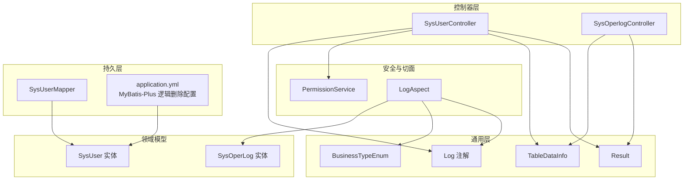
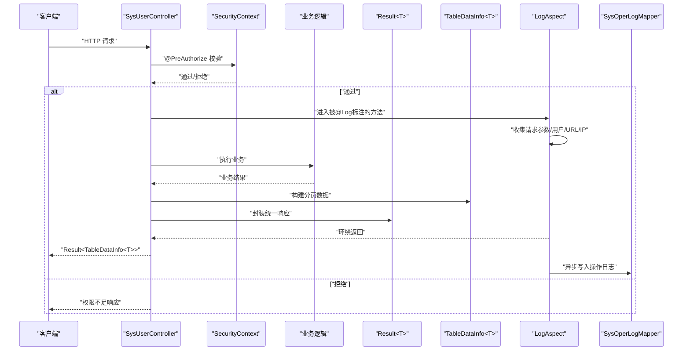
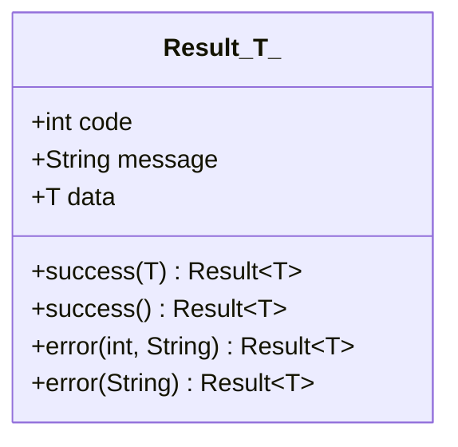
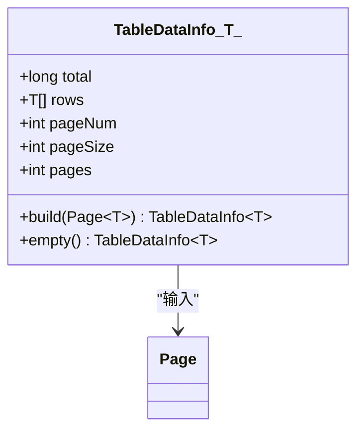
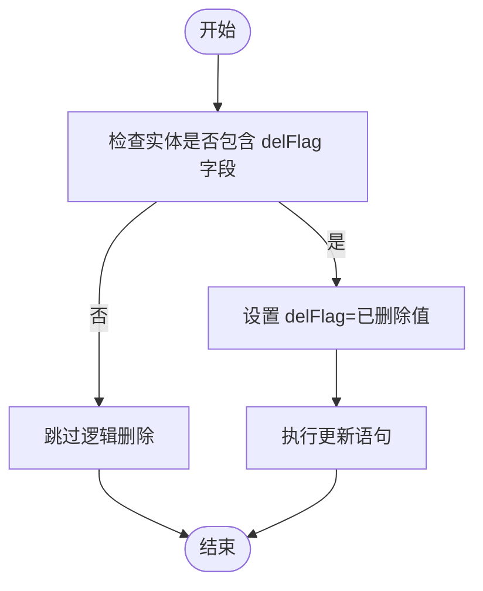
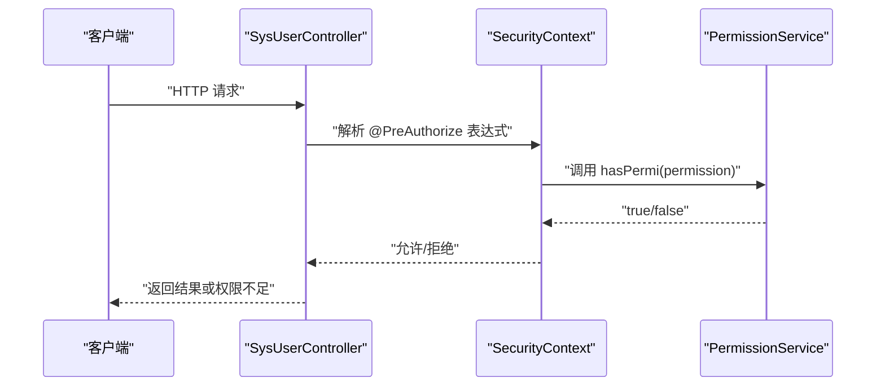
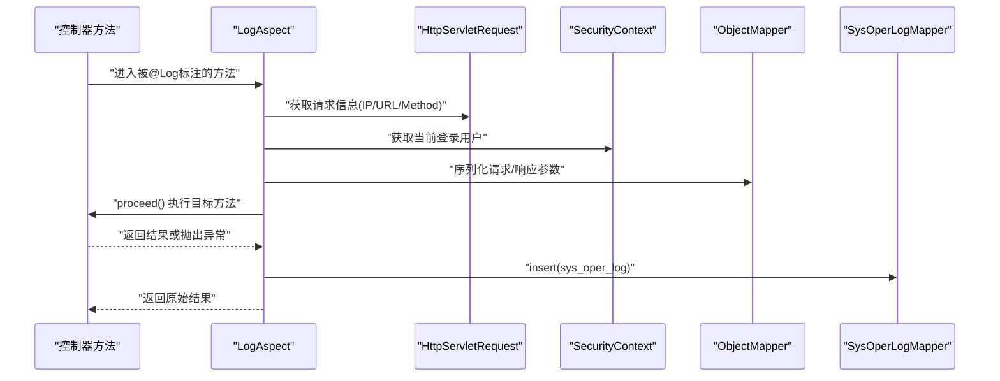
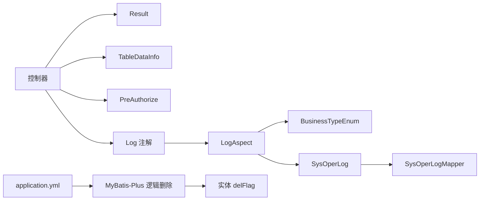

# 核心特性说明

<cite>
**本文引用的文件**
- [Result.java](file://task-manager-backend/src/main/java/com/taskmanager/common/Result.java)
- [TableDataInfo.java](file://task-manager-backend/src/main/java/com/taskmanager/common/utils/TableDataInfo.java)
- [Log.java](file://task-manager-backend/src/main/java/com/taskmanager/common/annotation/Log.java)
- [BusinessTypeEnum.java](file://task-manager-backend/src/main/java/com/taskmanager/common/enums/BusinessTypeEnum.java)
- [LogAspect.java](file://task-manager-backend/src/main/java/com/taskmanager/aspect/LogAspect.java)
- [SysOperLog.java](file://task-manager-backend/src/main/java/com/taskmanager/domain/SysOperLog.java)
- [SysOperlogController.java](file://task-manager-backend/src/main/java/com/taskmanager/controller/SysOperlogController.java)
- [PermissionService.java](file://task-manager-backend/src/main/java/com/taskmanager/security/PermissionService.java)
- [SysUserController.java](file://task-manager-backend/src/main/java/com/taskmanager/controller/SysUserController.java)
- [application.yml](file://task-manager-backend/src/main/resources/application.yml)
- [SysUserMapper.java](file://task-manager-backend/src/main/java/com/taskmanager/mapper/SysUserMapper.java)
</cite>

## 目录
1. [简介](#简介)
2. [项目结构](#项目结构)
3. [核心组件](#核心组件)
4. [架构总览](#架构总览)
5. [详细组件分析](#详细组件分析)
6. [依赖分析](#依赖分析)
7. [性能考虑](#性能考虑)
8. [故障排查指南](#故障排查指南)
9. [结论](#结论)

## 简介
本文件聚焦于CodeBuddy任务管理系统的五大核心特性：统一响应格式Result<T>、分页数据封装TableDataInfo<T>、逻辑删除机制、权限控制注解@PreAuthorize以及操作日志记录的自动化实现。通过对代码结构、数据流、处理逻辑与集成点的深入分析，帮助开发者理解这些特性的设计思想、使用场景与最佳实践，并说明它们如何提升开发效率、保证系统一致性与增强用户体验。

## 项目结构
后端采用Spring Boot + MyBatis-Plus架构，核心模块包括：
- common：通用工具与模型（Result、TableDataInfo、注解与枚举）
- aspect：面向切面的日志记录（LogAspect）
- security：权限校验（PermissionService）
- controller：REST接口层（含操作日志与用户管理等）
- domain/entity：领域模型与实体类（含逻辑删除字段）
- resources：配置文件（MyBatis-Plus逻辑删除配置）

**图表来源**
- [Result.java:1-76](file://task-manager-backend/src/main/java/com/taskmanager/common/Result.java#L1-L76)
- [TableDataInfo.java:1-60](file://task-manager-backend/src/main/java/com/taskmanager/common/utils/TableDataInfo.java#L1-L60)
- [Log.java:1-38](file://task-manager-backend/src/main/java/com/taskmanager/common/annotation/Log.java#L1-L38)
- [BusinessTypeEnum.java:1-56](file://task-manager-backend/src/main/java/com/taskmanager/common/enums/BusinessTypeEnum.java#L1-L56)
- [LogAspect.java:1-137](file://task-manager-backend/src/main/java/com/taskmanager/aspect/LogAspect.java#L1-L137)
- [SysOperLog.java:1-74](file://task-manager-backend/src/main/java/com/taskmanager/domain/SysOperLog.java#L1-L74)
- [SysUserController.java:1-132](file://task-manager-backend/src/main/java/com/taskmanager/controller/SysUserController.java#L1-L132)
- [SysOperlogController.java:1-80](file://task-manager-backend/src/main/java/com/taskmanager/controller/SysOperlogController.java#L1-L80)
- [application.yml:40-44](file://task-manager-backend/src/main/resources/application.yml#L40-L44)
- [SysUserMapper.java:1-39](file://task-manager-backend/src/main/java/com/taskmanager/mapper/SysUserMapper.java#L1-L39)

**章节来源**
- [application.yml:1-79](file://task-manager-backend/src/main/resources/application.yml#L1-L79)

## 核心组件
- 统一响应格式Result<T>：提供标准的响应结构（状态码、消息、数据），并提供静态工厂方法快速构造成功或错误响应。
- 分页数据封装TableDataInfo<T>：将MyBatis-Plus的Page对象转换为前端友好的分页结构（总数、当前页数据、页码、每页大小、总页数），并提供空数据构建器。
- 权限控制注解@PreAuthorize：结合Security上下文与PermissionService，以表达式方式在方法级别进行权限校验。
- 操作日志自动化：通过@Log注解与LogAspect切面，在方法执行前后自动采集请求/响应、异常信息并落库。
- 逻辑删除机制：基于MyBatis-Plus全局配置，对包含delFlag字段的实体执行软删除，避免物理删除带来的数据丢失风险。

**章节来源**
- [Result.java:1-76](file://task-manager-backend/src/main/java/com/taskmanager/common/Result.java#L1-L76)
- [TableDataInfo.java:1-60](file://task-manager-backend/src/main/java/com/taskmanager/common/utils/TableDataInfo.java#L1-L60)
- [Log.java:1-38](file://task-manager-backend/src/main/java/com/taskmanager/common/annotation/Log.java#L1-L38)
- [BusinessTypeEnum.java:1-56](file://task-manager-backend/src/main/java/com/taskmanager/common/enums/BusinessTypeEnum.java#L1-L56)
- [LogAspect.java:1-137](file://task-manager-backend/src/main/java/com/taskmanager/aspect/LogAspect.java#L1-L137)
- [PermissionService.java:1-64](file://task-manager-backend/src/main/java/com/taskmanager/security/PermissionService.java#L1-L64)
- [application.yml:40-44](file://task-manager-backend/src/main/resources/application.yml#L40-L44)

## 架构总览
以下序列图展示了典型控制器调用链路：控制器接收请求 -> 权限校验 -> 业务处理 -> 统一响应封装 -> 返回结果；同时，带@Log注解的方法会触发切面自动记录操作日志。

**图表来源**
- [SysUserController.java:33-106](file://task-manager-backend/src/main/java/com/taskmanager/controller/SysUserController.java#L33-L106)
- [PermissionService.java:25-38](file://task-manager-backend/src/main/java/com/taskmanager/security/PermissionService.java#L25-L38)
- [LogAspect.java:44-97](file://task-manager-backend/src/main/java/com/taskmanager/aspect/LogAspect.java#L44-L97)
- [TableDataInfo.java:37-45](file://task-manager-backend/src/main/java/com/taskmanager/common/utils/TableDataInfo.java#L37-L45)
- [Result.java:39-51](file://task-manager-backend/src/main/java/com/taskmanager/common/Result.java#L39-L51)

## 详细组件分析

### 统一响应格式 Result<T>
- 设计要点
  - 统一的三段式结构：code、message、data，便于前端一致化处理。
  - 泛型支持：任意数据类型，确保类型安全。
  - 工厂方法：success(data)/success()/error(code,message)/error(message)，简化调用。
- 使用场景
  - 控制器层统一返回结构，屏蔽内部异常细节。
  - 与分页封装配合，形成“分页+统一响应”的标准输出。
- 最佳实践
  - 成功路径优先使用Result.success(data)或Result.success()。
  - 错误路径使用Result.error(code,message)或Result.error(message)。
  - 避免直接抛出异常给前端，统一由全局异常处理器或调用方捕获并映射为Result.error。

**图表来源**
- [Result.java:15-75](file://task-manager-backend/src/main/java/com/taskmanager/common/Result.java#L15-L75)

**章节来源**
- [Result.java:1-76](file://task-manager-backend/src/main/java/com/taskmanager/common/Result.java#L1-L76)
- [SysUserController.java:44-53](file://task-manager-backend/src/main/java/com/taskmanager/controller/SysUserController.java#L44-L53)
- [SysOperlogController.java:44-53](file://task-manager-backend/src/main/java/com/taskmanager/controller/SysOperlogController.java#L44-L53)

### 分页数据封装 TableDataInfo<T>
- 设计要点
  - 从MyBatis-Plus Page对象构建，自动提取total、records、current、size、pages。
  - 提供empty()构建空分页，便于无数据场景的一致性处理。
  - 字段覆盖完整，满足前端分页组件展示需求。
- 使用场景
  - 列表查询接口的标准输出格式，结合Result统一响应。
  - 与LambdaQueryWrapper组合，实现条件筛选与排序。
- 最佳实践
  - 控制器中先构造Page，再调用Mapper查询，最后用TableDataInfo.build封装。
  - 注意pageNum/pageSize的默认值与边界校验，避免无效分页参数。

**图表来源**
- [TableDataInfo.java:14-59](file://task-manager-backend/src/main/java/com/taskmanager/common/utils/TableDataInfo.java#L14-L59)

**章节来源**
- [TableDataInfo.java:1-60](file://task-manager-backend/src/main/java/com/taskmanager/common/utils/TableDataInfo.java#L1-L60)
- [SysUserController.java:42-44](file://task-manager-backend/src/main/java/com/taskmanager/controller/SysUserController.java#L42-L44)
- [SysOperlogController.java:37-44](file://task-manager-backend/src/main/java/com/taskmanager/controller/SysOperlogController.java#L37-L44)

### 逻辑删除机制
- 技术实现
  - 在application.yml中配置MyBatis-Plus全局逻辑删除字段delFlag及取值规则。
  - 实体类（如SysUser）包含delFlag字段，删除操作更新该字段而非物理移除。
- 业务价值
  - 防止误删重要数据，支持审计与恢复。
  - 与查询拦截器配合，默认查询不包含已删除记录，降低误用风险。
- 使用示例
  - 删除用户时，将delFlag更新为“2”（已删除），前端仍可查询到历史记录但不影响默认展示。
  - 可在控制器中提供批量删除与清空功能，均通过更新delFlag实现。

**图表来源**
- [application.yml:42-44](file://task-manager-backend/src/main/resources/application.yml#L42-L44)
- [SysUserController.java:99-104](file://task-manager-backend/src/main/java/com/taskmanager/controller/SysUserController.java#L99-L104)

**章节来源**
- [application.yml:40-44](file://task-manager-backend/src/main/resources/application.yml#L40-L44)
- [SysUserController.java:99-104](file://task-manager-backend/src/main/java/com/taskmanager/controller/SysUserController.java#L99-L104)

### 权限控制注解 @PreAuthorize
- 使用方式
  - 在控制器方法上添加@PreAuthorize表达式，如"@ss.hasPermi('system:user:list')"。
  - PermissionService提供hasPermi/lacksPermi方法，支持通配符"*:*:*"超级权限。
- 工作流程
  - Spring Security在方法执行前解析表达式，从SecurityContext获取当前用户权限集合。
  - 若无权限，抛出AccessDeniedException，由全局异常处理器统一处理。
- 最佳实践
  - 将权限标识与菜单/按钮权限保持一致，避免权限不匹配。
  - 对敏感操作（新增、修改、删除、导出、导入）务必加@PreAuthorize保护。

**图表来源**
- [SysUserController.java:33-106](file://task-manager-backend/src/main/java/com/taskmanager/controller/SysUserController.java#L33-L106)
- [PermissionService.java:25-38](file://task-manager-backend/src/main/java/com/taskmanager/security/PermissionService.java#L25-L38)

**章节来源**
- [SysUserController.java:33-106](file://task-manager-backend/src/main/java/com/taskmanager/controller/SysUserController.java#L33-L106)
- [PermissionService.java:1-64](file://task-manager-backend/src/main/java/com/taskmanager/security/PermissionService.java#L1-L64)

### 操作日志记录自动化
- 注解与切面
  - @Log注解用于标记需要记录的操作（模块title、业务类型businessType、是否保存请求/响应数据）。
  - LogAspect通过@Around拦截标注@Log的方法，自动采集请求上下文、用户信息、IP、URL、方法名、耗时、状态与异常信息。
- 数据落库
  - SysOperLog实体对应sys_oper_log表，包含模块、业务类型、请求方式、操作人、请求参数、返回结果、状态、错误信息、时间与耗时。
  - 切面在finally中异步插入日志，即使异常也不会阻塞主流程。
- 使用场景
  - 新增、修改、删除、授权、导入导出等关键操作均建议开启@Log。
  - 可通过SysOperlogController对日志进行分页查询、详情查看、批量删除与清空。

**图表来源**
- [Log.java:16-37](file://task-manager-backend/src/main/java/com/taskmanager/common/annotation/Log.java#L16-L37)
- [LogAspect.java:44-97](file://task-manager-backend/src/main/java/com/taskmanager/aspect/LogAspect.java#L44-L97)
- [SysOperLog.java:17-73](file://task-manager-backend/src/main/java/com/taskmanager/domain/SysOperLog.java#L17-L73)
- [SysOperlogController.java:28-78](file://task-manager-backend/src/main/java/com/taskmanager/controller/SysOperlogController.java#L28-L78)

**章节来源**
- [Log.java:1-38](file://task-manager-backend/src/main/java/com/taskmanager/common/annotation/Log.java#L1-L38)
- [BusinessTypeEnum.java:1-56](file://task-manager-backend/src/main/java/com/taskmanager/common/enums/BusinessTypeEnum.java#L1-L56)
- [LogAspect.java:1-137](file://task-manager-backend/src/main/java/com/taskmanager/aspect/LogAspect.java#L1-L137)
- [SysOperLog.java:1-74](file://task-manager-backend/src/main/java/com/taskmanager/domain/SysOperLog.java#L1-L74)
- [SysOperlogController.java:1-80](file://task-manager-backend/src/main/java/com/taskmanager/controller/SysOperlogController.java#L1-L80)

## 依赖分析
- 组件耦合
  - 控制器依赖Result与TableDataInfo进行统一输出；依赖@PreAuthorize与PermissionService进行权限控制。
  - LogAspect依赖@Log注解、BusinessTypeEnum、SysOperLog实体与SysOperLogMapper实现日志落库。
  - 逻辑删除依赖application.yml中的MyBatis-Plus全局配置与实体类delFlag字段。
- 外部依赖
  - Spring Security（@PreAuthorize）、MyBatis-Plus（Page、逻辑删除）、Jackson（JSON序列化）。

**图表来源**
- [SysUserController.java:33-106](file://task-manager-backend/src/main/java/com/taskmanager/controller/SysUserController.java#L33-L106)
- [LogAspect.java:44-97](file://task-manager-backend/src/main/java/com/taskmanager/aspect/LogAspect.java#L44-L97)
- [application.yml:40-44](file://task-manager-backend/src/main/resources/application.yml#L40-L44)

**章节来源**
- [SysUserController.java:1-132](file://task-manager-backend/src/main/java/com/taskmanager/controller/SysUserController.java#L1-L132)
- [LogAspect.java:1-137](file://task-manager-backend/src/main/java/com/taskmanager/aspect/LogAspect.java#L1-L137)
- [application.yml:40-44](file://task-manager-backend/src/main/resources/application.yml#L40-L44)

## 性能考虑
- 统一响应与分页
  - Result与TableDataInfo均为轻量封装，对性能影响极小；建议在大数据量场景下合理设置pageSize并启用排序索引。
- 权限校验
  - @PreAuthorize在方法入口处进行表达式解析与权限判断，建议权限标识粒度适中，避免过于复杂的表达式。
- 操作日志
  - LogAspect采用异步写入（finally块），对主流程影响可控；建议对高频接口谨慎开启isSaveResponseData以减少序列化开销。
- 逻辑删除
  - 软删除避免全表扫描删除，但查询时需注意索引设计；建议对常用查询字段建立复合索引。

## 故障排查指南
- 权限不足
  - 现象：返回403或被拒绝。
  - 排查：确认用户权限集合是否包含所需标识；检查PermissionService的hasPermi实现与SecurityContext上下文。
- 日志未记录
  - 现象：sys_oper_log表无新增记录。
  - 排查：确认方法是否标注@Log；检查LogAspect是否生效；核对isSaveRequestData/isSaveResponseData配置；查看切面日志是否有写入失败警告。
- 分页数据异常
  - 现象：total或rows为空。
  - 排查：确认Page构建参数pageNum/pageSize；检查Mapper查询是否正确传入Page；核对TableDataInfo.build调用。
- 逻辑删除失效
  - 现象：删除后仍可见。
  - 排查：确认实体包含delFlag字段；检查application.yml逻辑删除配置；确认删除操作更新delFlag而非物理删除。

**章节来源**
- [PermissionService.java:25-38](file://task-manager-backend/src/main/java/com/taskmanager/security/PermissionService.java#L25-L38)
- [LogAspect.java:88-96](file://task-manager-backend/src/main/java/com/taskmanager/aspect/LogAspect.java#L88-L96)
- [TableDataInfo.java:37-45](file://task-manager-backend/src/main/java/com/taskmanager/common/utils/TableDataInfo.java#L37-L45)
- [application.yml:42-44](file://task-manager-backend/src/main/resources/application.yml#L42-L44)

## 结论
上述五大特性构成了CodeBuddy任务管理系统在“一致性、安全性与可观测性”方面的基础能力：
- 统一响应与分页封装提升了前后端协作效率与用户体验；
- 权限控制注解保障了关键操作的安全边界；
- 操作日志自动化增强了系统的可追溯性；
- 逻辑删除机制在保证数据完整性的同时降低了误删风险。
通过规范使用这些特性并遵循最佳实践，可以显著提升开发效率与系统稳定性。