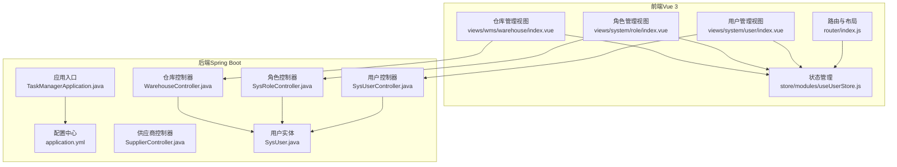
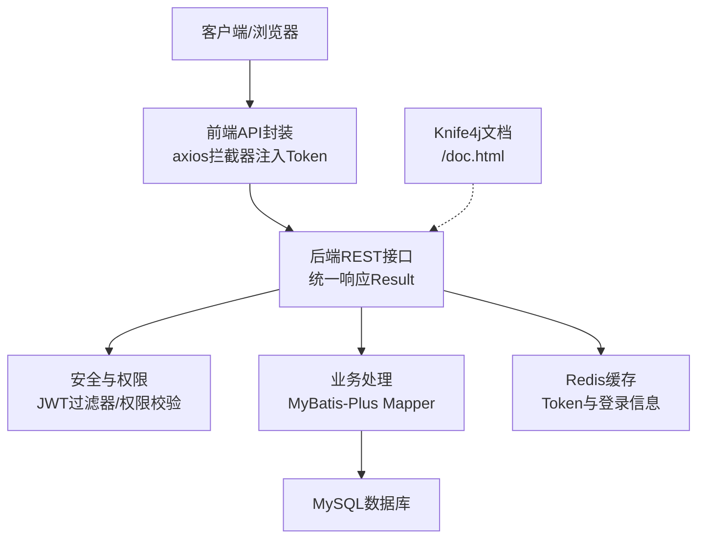
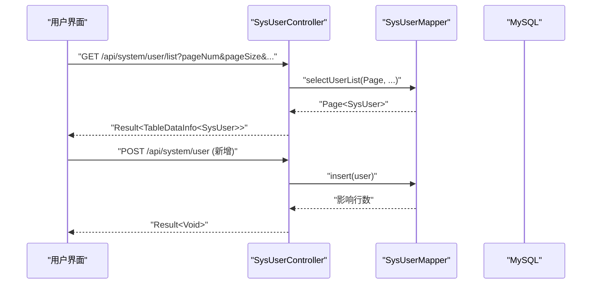
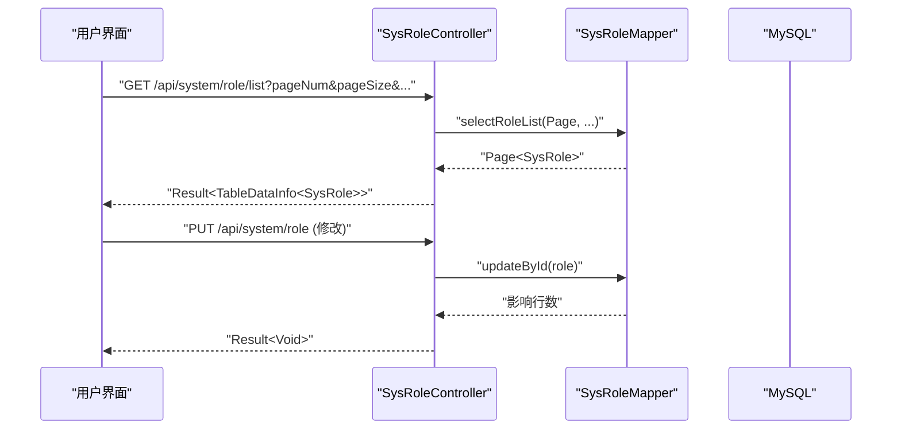
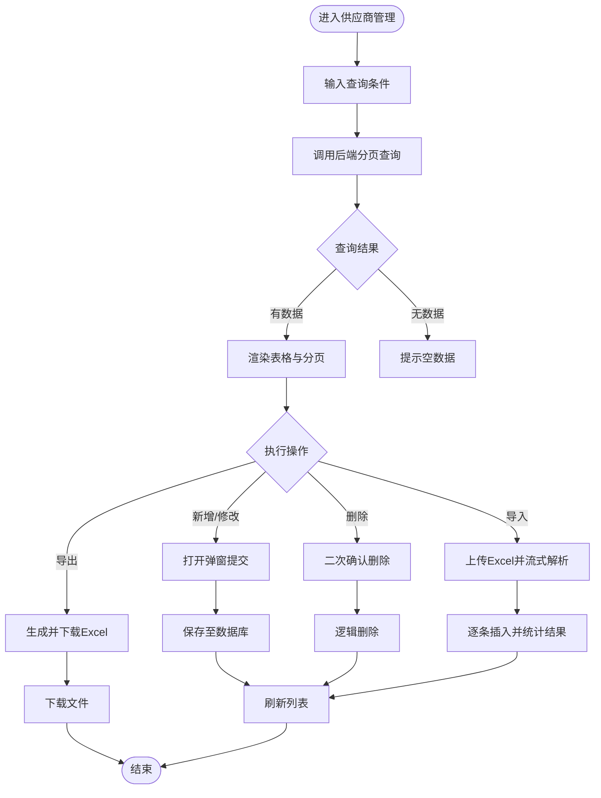
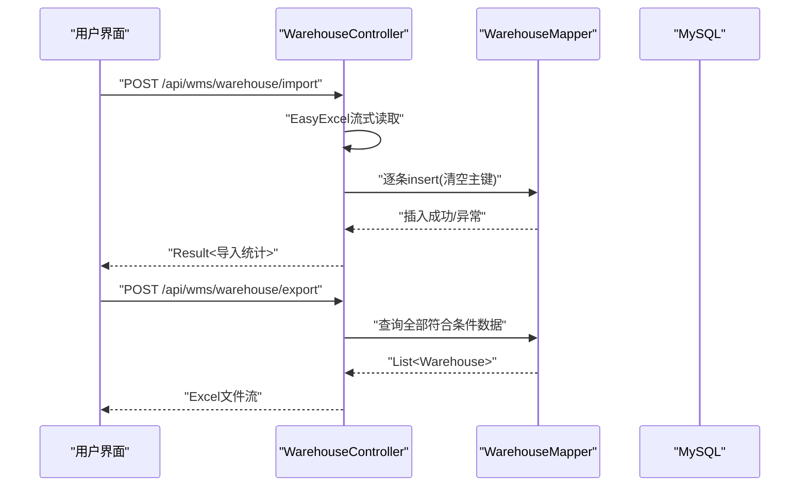
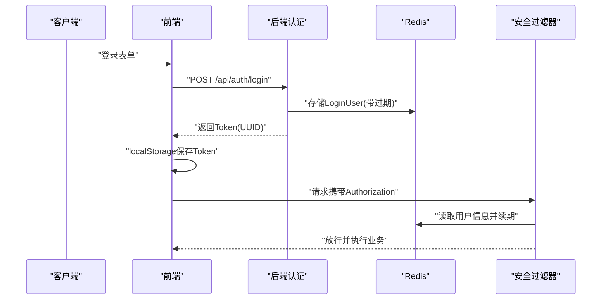
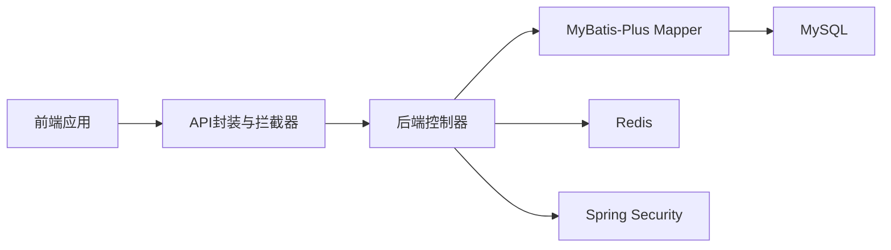

# 项目介绍与目标

<cite>
**本文引用的文件**
- [CODEBUDDY.md](file://CODEBUDDY.md)
- [TaskManagerApplication.java](file://task-manager-backend/src/main/java/com/taskmanager/TaskManagerApplication.java)
- [application.yml](file://task-manager-backend/src/main/resources/application.yml)
- [SysUserController.java](file://task-manager-backend/src/main/java/com/taskmanager/controller/SysUserController.java)
- [SysRoleController.java](file://task-manager-backend/src/main/java/com/taskmanager/controller/SysRoleController.java)
- [SupplierController.java](file://task-manager-backend/src/main/java/com/taskmanager/controller/SupplierController.java)
- [WarehouseController.java](file://task-manager-backend/src/main/java/com/taskmanager/controller/WarehouseController.java)
- [SysUser.java](file://task-manager-backend/src/main/java/com/taskmanager/domain/SysUser.java)
- [index.js](file://task-manager-frontend/src/router/index.js)
- [useUserStore.js](file://task-manager-frontend/src/store/modules/useUserStore.js)
- [index.vue（用户管理）](file://task-manager-frontend/src/views/system/user/index.vue)
- [index.vue（角色管理）](file://task-manager-frontend/src/views/system/role/index.vue)
- [index.vue（仓库管理）](file://task-manager-frontend/src/views/wms/warehouse/index.vue)
- [package.json（前端）](file://task-manager-frontend/package.json)
- [package.json（电商前端）](file://ecommerce-frontend/package.json)
</cite>

## 目录
1. [引言](#引言)
2. [项目结构](#项目结构)
3. [核心组件](#核心组件)
4. [架构总览](#架构总览)
5. [详细组件分析](#详细组件分析)
6. [依赖关系分析](#依赖关系分析)
7. [性能考虑](#性能考虑)
8. [故障排查指南](#故障排查指南)
9. [结论](#结论)
10. [附录](#附录)

## 引言
CodeBuddy任务管理系统是一个基于“若依（RuoYi）风格”的前后端分离后台管理系统，采用标准的三层架构与RBAC权限模型，面向企业级任务管理与后台运营需求。系统通过统一响应、分页封装、逻辑删除、方法级权限注解与操作日志切面等机制，提供稳定、可扩展且易于维护的管理平台。

本项目的核心目标与业务价值体现在：
- 统一的企业后台管理体验：以“系统管理”“监控”“仓储管理（WMS）”等模块覆盖日常运营高频场景。
- 明确的权限边界：通过RBAC模型与细粒度权限字符串，保障数据安全与合规。
- 高效的开发与运维：统一的响应格式、日志与异常处理、Swagger文档与JWT认证，降低集成与维护成本。
- 可扩展的模块化设计：前端按模块组织页面，后端按领域分层，便于横向扩展新模块。

## 项目结构
系统采用前后端分离架构，后端使用Spring Boot + MyBatis-Plus + Spring Security + Redis + MySQL，前端使用Vue 3 + Element Plus + Pinia + Vue Router 4。后端启动入口与配置集中于application.yml，前端路由与状态管理通过Pinia与路由守卫实现动态权限。

**图表来源**
- [TaskManagerApplication.java:1-18](file://task-manager-backend/src/main/java/com/taskmanager/TaskManagerApplication.java#L1-L18)
- [application.yml:1-79](file://task-manager-backend/src/main/resources/application.yml#L1-L79)
- [SysUserController.java:1-132](file://task-manager-backend/src/main/java/com/taskmanager/controller/SysUserController.java#L1-L132)
- [SysRoleController.java:1-83](file://task-manager-backend/src/main/java/com/taskmanager/controller/SysRoleController.java#L1-L83)
- [SupplierController.java:1-201](file://task-manager-backend/src/main/java/com/taskmanager/controller/SupplierController.java#L1-L201)
- [WarehouseController.java:1-190](file://task-manager-backend/src/main/java/com/taskmanager/controller/WarehouseController.java#L1-L190)
- [SysUser.java:1-80](file://task-manager-backend/src/main/java/com/taskmanager/domain/SysUser.java#L1-L80)
- [index.js:1-32](file://task-manager-frontend/src/router/index.js#L1-L32)
- [useUserStore.js:1-52](file://task-manager-frontend/src/store/modules/useUserStore.js#L1-L52)
- [index.vue（用户管理）:1-240](file://task-manager-frontend/src/views/system/user/index.vue#L1-L240)
- [index.vue（角色管理）:1-159](file://task-manager-frontend/src/views/system/role/index.vue#L1-L159)
- [index.vue（仓库管理）:1-428](file://task-manager-frontend/src/views/wms/warehouse/index.vue#L1-L428)

**章节来源**
- [CODEBUDDY.md:40-115](file://CODEBUDDY.md#L40-L115)
- [TaskManagerApplication.java:1-18](file://task-manager-backend/src/main/java/com/taskmanager/TaskManagerApplication.java#L1-L18)
- [application.yml:1-79](file://task-manager-backend/src/main/resources/application.yml#L1-L79)
- [index.js:1-32](file://task-manager-frontend/src/router/index.js#L1-L32)
- [useUserStore.js:1-52](file://task-manager-frontend/src/store/modules/useUserStore.js#L1-L52)

## 核心组件
- 后端核心组件
  - 应用入口与扫描：启动类负责包扫描与应用启动。
  - 配置中心：数据源、Redis、MyBatis-Plus、JWT、Knife4j文档等集中配置。
  - 控制器层：用户、角色、供应商、仓库等模块的REST接口，统一返回Result<T>，分页封装TableDataInfo<T>。
  - 实体与映射：领域对象与数据库表一一对应，支持逻辑删除与驼峰映射。
  - 安全与权限：JWT过滤器、Token管理、用户详情服务、权限校验服务、方法级权限注解。
  - 日志与异常：统一异常处理、AOP操作日志记录（@Log注解）。
- 前端核心组件
  - 路由与布局：静态路由与动态路由挂载，侧边栏与面包屑导航。
  - 状态管理：Pinia Store管理用户信息、角色与权限。
  - 视图组件：按模块组织的页面，包含查询、分页、新增/编辑/删除、导入/导出等典型CRUD流程。
  - 权限指令：基于权限字符串的指令，控制按钮显示与交互。

**章节来源**
- [CODEBUDDY.md:40-115](file://CODEBUDDY.md#L40-L115)
- [SysUserController.java:1-132](file://task-manager-backend/src/main/java/com/taskmanager/controller/SysUserController.java#L1-L132)
- [SysRoleController.java:1-83](file://task-manager-backend/src/main/java/com/taskmanager/controller/SysRoleController.java#L1-L83)
- [SupplierController.java:1-201](file://task-manager-backend/src/main/java/com/taskmanager/controller/SupplierController.java#L1-L201)
- [WarehouseController.java:1-190](file://task-manager-backend/src/main/java/com/taskmanager/controller/WarehouseController.java#L1-L190)
- [SysUser.java:1-80](file://task-manager-backend/src/main/java/com/taskmanager/domain/SysUser.java#L1-L80)
- [index.vue（用户管理）:1-240](file://task-manager-frontend/src/views/system/user/index.vue#L1-L240)
- [index.vue（角色管理）:1-159](file://task-manager-frontend/src/views/system/role/index.vue#L1-L159)
- [index.vue（仓库管理）:1-428](file://task-manager-frontend/src/views/wms/warehouse/index.vue#L1-L428)

## 架构总览
系统遵循“若依风格”的三层架构与RBAC权限模型，后端以控制器-领域-持久层分层，前端以页面-组件-状态管理分层。统一响应、分页、逻辑删除、权限注解与操作日志构成核心机制。

**图表来源**
- [CODEBUDDY.md:47-115](file://CODEBUDDY.md#L47-L115)
- [application.yml:1-79](file://task-manager-backend/src/main/resources/application.yml#L1-L79)
- [index.js:1-32](file://task-manager-frontend/src/router/index.js#L1-L32)
- [useUserStore.js:1-52](file://task-manager-frontend/src/store/modules/useUserStore.js#L1-L52)

**章节来源**
- [CODEBUDDY.md:47-115](file://CODEBUDDY.md#L47-L115)
- [application.yml:1-79](file://task-manager-backend/src/main/resources/application.yml#L1-L79)

## 详细组件分析

### 用户管理模块
- 功能要点
  - 列表查询：分页+条件筛选（用户名、手机号、状态、部门ID）。
  - 详情查看、新增、修改、删除（逻辑删除）、重置密码、状态变更。
  - 操作日志：新增/修改/删除均记录到sys_oper_log。
  - 权限控制：方法级权限注解保护各操作。
- 前端实现
  - 支持搜索、分页、批量选择、弹窗表单、状态切换、密码重置等。
  - 与后端统一响应格式对接，错误与成功消息提示。

**图表来源**
- [SysUserController.java:33-132](file://task-manager-backend/src/main/java/com/taskmanager/controller/SysUserController.java#L33-L132)
- [index.vue（用户管理）:157-239](file://task-manager-frontend/src/views/system/user/index.vue#L157-L239)

**章节来源**
- [SysUserController.java:1-132](file://task-manager-backend/src/main/java/com/taskmanager/controller/SysUserController.java#L1-L132)
- [index.vue（用户管理）:1-240](file://task-manager-frontend/src/views/system/user/index.vue#L1-L240)

### 角色管理模块
- 功能要点
  - 角色列表查询（角色名、权限字符、状态）。
  - 新增、修改、删除（逻辑删除）。
  - 数据范围默认值与逻辑删除字段设置。
- 前端实现
  - 搜索、分页、弹窗表单、状态标签展示、批量删除。

**图表来源**
- [SysRoleController.java:29-83](file://task-manager-backend/src/main/java/com/taskmanager/controller/SysRoleController.java#L29-L83)
- [index.vue（角色管理）:121-159](file://task-manager-frontend/src/views/system/role/index.vue#L121-L159)

**章节来源**
- [SysRoleController.java:1-83](file://task-manager-backend/src/main/java/com/taskmanager/controller/SysRoleController.java#L1-L83)
- [index.vue（角色管理）:1-159](file://task-manager-frontend/src/views/system/role/index.vue#L1-L159)

### 供应商管理模块
- 功能要点
  - 多条件查询（公司名、省份、联系人、品类、联系状态）。
  - 新增、修改、删除（逻辑删除）。
  - Excel导入/导出与模板下载，支持流式读取与批量插入。
- 前端实现
  - 多选省份数字典、品类多选、状态选择、分页与导入导出弹窗。

**图表来源**
- [SupplierController.java:48-201](file://task-manager-backend/src/main/java/com/taskmanager/controller/SupplierController.java#L48-L201)
- [index.vue（仓库管理）:283-428](file://task-manager-frontend/src/views/wms/warehouse/index.vue#L283-L428)

**章节来源**
- [SupplierController.java:1-201](file://task-manager-backend/src/main/java/com/taskmanager/controller/SupplierController.java#L1-L201)
- [index.vue（仓库管理）:1-428](file://task-manager-frontend/src/views/wms/warehouse/index.vue#L1-L428)

### 仓储管理模块（WMS）
- 功能要点
  - 仓库列表查询（名称、编码、省份、类型、状态）。
  - 新增、修改、删除（逻辑删除）。
  - Excel导入/导出与模板下载，支持多选省份参数传递。
- 前端实现
  - 字典联动（省份、仓库类型、状态）、分页、导入导出弹窗、批量操作。

**图表来源**
- [WarehouseController.java:116-190](file://task-manager-backend/src/main/java/com/taskmanager/controller/WarehouseController.java#L116-L190)
- [index.vue（仓库管理）:361-421](file://task-manager-frontend/src/views/wms/warehouse/index.vue#L361-L421)

**章节来源**
- [WarehouseController.java:1-190](file://task-manager-backend/src/main/java/com/taskmanager/controller/WarehouseController.java#L1-L190)
- [index.vue（仓库管理）:1-428](file://task-manager-frontend/src/views/wms/warehouse/index.vue#L1-L428)

### 认证与权限流程
- 认证流程
  - 前端登录获取Token并存储localStorage。
  - 请求携带Authorization: Bearer <token>。
  - JWT过滤器从Redis恢复用户信息并自动续期。
- 权限控制
  - 方法级权限注解@PreAuthorize保护接口。
  - 前端根据后端返回菜单树动态挂载路由与按钮权限。

**图表来源**
- [CODEBUDDY.md:79-85](file://CODEBUDDY.md#L79-L85)
- [useUserStore.js:17-49](file://task-manager-frontend/src/store/modules/useUserStore.js#L17-L49)

**章节来源**
- [CODEBUDDY.md:79-85](file://CODEBUDDY.md#L79-L85)
- [useUserStore.js:1-52](file://task-manager-frontend/src/store/modules/useUserStore.js#L1-L52)

## 依赖关系分析
- 后端技术栈
  - Spring Boot 3.2.0 + Java 17：稳定的企业级运行时。
  - MyBatis-Plus 3.5.5：简化数据访问与分页。
  - Spring Security + Redis：认证与授权、Token与登录信息缓存。
  - MySQL：关系型数据存储。
  - Knife4j：在线API文档。
- 前端技术栈
  - Vue 3 + Vite：现代化构建工具链。
  - Element Plus + Vue Router 4 + Pinia：UI与路由、状态管理。
- 模块间耦合
  - 前端视图组件通过API封装与后端控制器解耦。
  - 后端控制器直接依赖Mapper，减少Service层复杂度，符合“若依风格”。

**图表来源**
- [package.json（前端）:11-21](file://task-manager-frontend/package.json#L11-L21)
- [application.yml:5-79](file://task-manager-backend/src/main/resources/application.yml#L5-L79)

**章节来源**
- [package.json（前端）:1-30](file://task-manager-frontend/package.json#L1-L30)
- [package.json（电商前端）:1-25](file://ecommerce-frontend/package.json#L1-L25)
- [application.yml:1-79](file://task-manager-backend/src/main/resources/application.yml#L1-L79)

## 性能考虑
- 连接池与缓存
  - HikariCP连接池参数优化数据库连接性能。
  - Redis用于Token与登录信息缓存，降低数据库压力。
- 分页与查询
  - MyBatis-Plus分页插件提升大数据量查询效率。
  - 前端分页参数与后端分页结果一致，避免一次性加载过多数据。
- 导入导出
  - Excel导入采用EasyExcel流式读取，减少内存占用。
  - 导出限制最大导出条数，避免超大文件导致内存溢出。
- 日志与异常
  - 统一异常处理与操作日志，便于问题定位与性能分析。

**章节来源**
- [application.yml:11-31](file://task-manager-backend/src/main/resources/application.yml#L11-L31)
- [WarehouseController.java:116-190](file://task-manager-backend/src/main/java/com/taskmanager/controller/WarehouseController.java#L116-L190)
- [SupplierController.java:149-201](file://task-manager-backend/src/main/java/com/taskmanager/controller/SupplierController.java#L149-L201)

## 故障排查指南
- 登录与权限
  - 确认前端已正确携带Authorization头，后端JWT过滤器能从Redis恢复用户信息。
  - 若出现权限不足，检查方法级权限注解与后端菜单权限配置。
- 数据查询
  - 分页参数pageNum/pageSize与后端分页插件一致，避免查询超大结果集。
  - 多选字段（如省份、品类）需按逗号分隔传参。
- 导入导出
  - 导入文件格式必须为.xlsx/.xls，确保列与实体映射一致。
  - 导出时注意浏览器下载行为与跨域代理配置。
- 数据库与缓存
  - 检查MySQL连接参数与Redis连通性，确认逻辑删除字段与Knife4j文档可用。

**章节来源**
- [CODEBUDDY.md:79-115](file://CODEBUDDY.md#L79-L115)
- [WarehouseController.java:142-190](file://task-manager-backend/src/main/java/com/taskmanager/controller/WarehouseController.java#L142-L190)
- [SupplierController.java:149-201](file://task-manager-backend/src/main/java/com/taskmanager/controller/SupplierController.java#L149-L201)

## 结论
CodeBuddy任务管理系统以“若依风格”为基础，结合RBAC权限模型与前后端分离架构，为企业提供了统一、规范、可扩展的后台管理平台。通过统一响应、分页封装、逻辑删除、权限注解与操作日志等机制，系统在保证安全性的同时提升了开发与运维效率。适用于需要用户与角色管理、系统监控、供应商与仓储管理等场景的企业级组织。

## 附录
- 适用场景
  - 中小型企业后台管理与运营支撑。
  - 需要权限精细化控制与操作审计的组织。
  - 需要Excel导入导出与多条件查询的业务系统。
- 目标用户群体
  - IT管理员与系统管理员。
  - 运营与采购人员（受权限约束的业务用户）。
  - 开发与测试团队（基于Knife4j文档进行联调）。