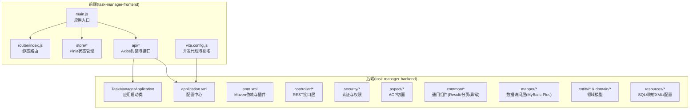
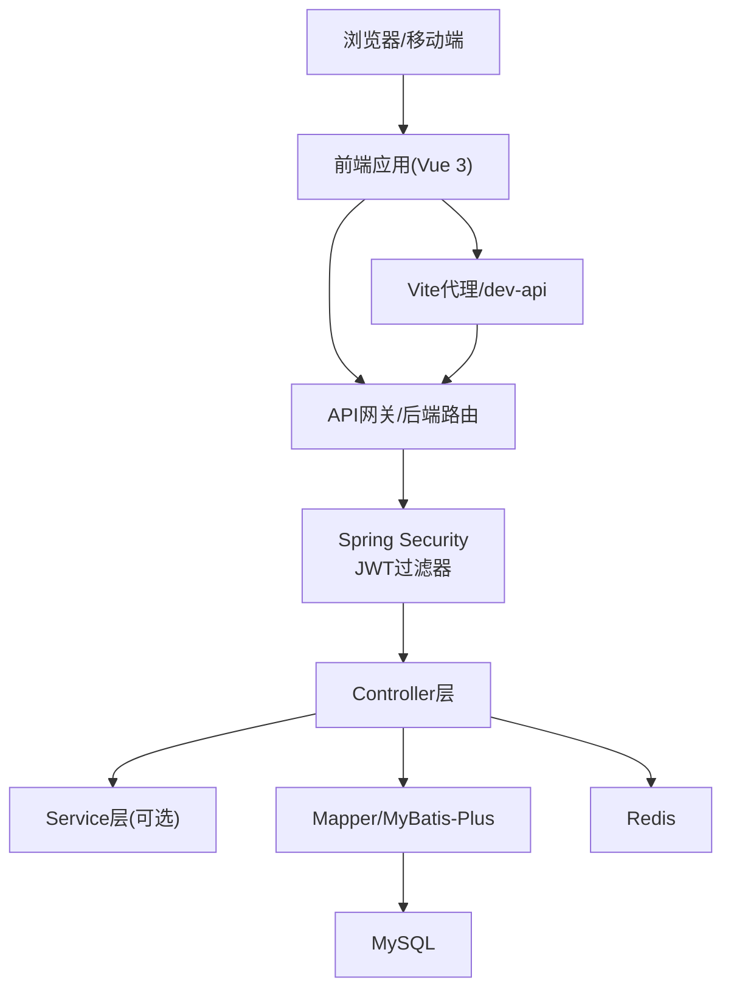
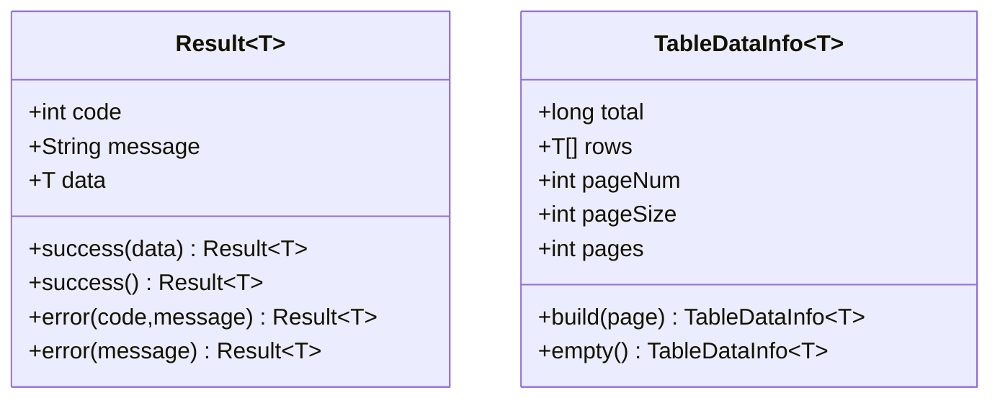
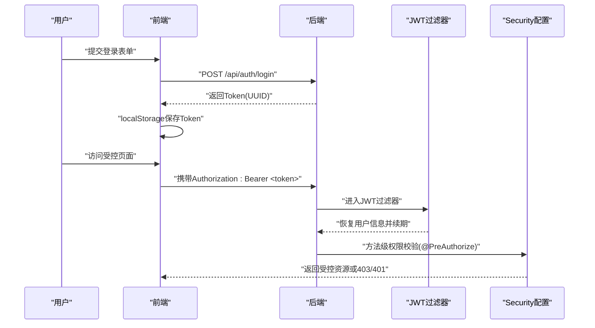
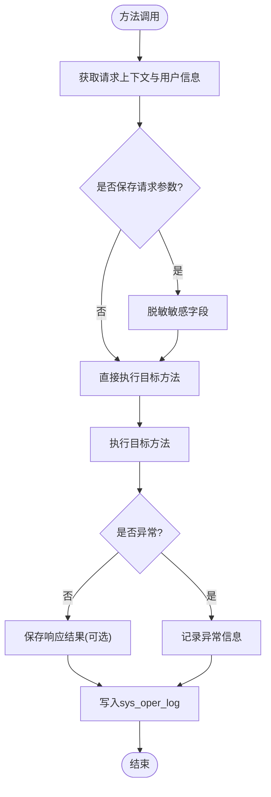
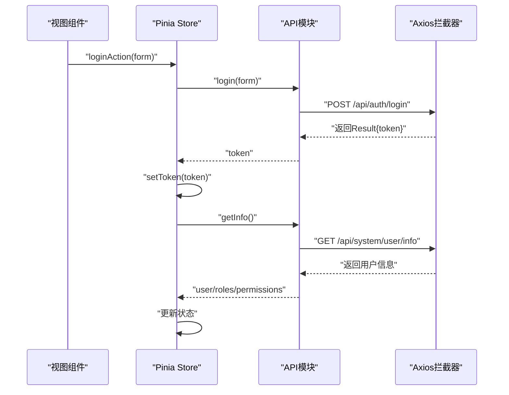
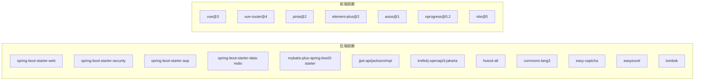

# 项目概述

<cite>
**本文引用的文件**
- [TaskManagerApplication.java](file://task-manager-backend/src/main/java/com/taskmanager/TaskManagerApplication.java)
- [pom.xml](file://task-manager-backend/pom.xml)
- [application.yml](file://task-manager-backend/src/main/resources/application.yml)
- [CODEBUDDY.md](file://CODEBUDDY.md)
- [Result.java](file://task-manager-backend/src/main/java/com/taskmanager/common/Result.java)
- [TableDataInfo.java](file://task-manager-backend/src/main/java/com/taskmanager/common/utils/TableDataInfo.java)
- [LogAspect.java](file://task-manager-backend/src/main/java/com/taskmanager/aspect/LogAspect.java)
- [JwtAuthenticationFilter.java](file://task-manager-backend/src/main/java/com/taskmanager/security/JwtAuthenticationFilter.java)
- [SecurityConfig.java](file://task-manager-backend/src/main/java/com/taskmanager/config/SecurityConfig.java)
- [main.js](file://task-manager-frontend/src/main.js)
- [router/index.js](file://task-manager-frontend/src/router/index.js)
- [store/modules/useUserStore.js](file://task-manager-frontend/src/store/modules/useUserStore.js)
- [api/request.js](file://task-manager-frontend/src/api/request.js)
- [vite.config.js](file://task-manager-frontend/vite.config.js)
</cite>

## 目录
1. [引言](#引言)
2. [项目结构](#项目结构)
3. [核心组件](#核心组件)
4. [架构总览](#架构总览)
5. [详细组件分析](#详细组件分析)
6. [依赖分析](#依赖分析)
7. [性能考虑](#性能考虑)
8. [故障排查指南](#故障排查指南)
9. [结论](#结论)
10. [附录](#附录)

## 引言
本项目为基于“若依(RuoYi)”风格的前后端分离后台管理系统，围绕任务管理与企业级权限控制展开。系统采用标准三层架构与RBAC权限模型，结合Spring Boot 3.2.0 + Java 17 + MyBatis-Plus + Spring Security + Redis + MySQL的后端技术栈，以及Vue 3 + Vite + Element Plus + Pinia + Vue Router 4的前端技术栈，提供统一响应格式、分页封装、逻辑删除、权限控制与操作日志等核心机制，满足企业级后台系统的高可用、可扩展与易维护需求。

## 项目结构
项目采用前后端分离架构，后端以Spring Boot为核心，前端以Vue 3为核心，配合统一的开发与运行命令，便于快速搭建与部署。

图表来源
- [TaskManagerApplication.java:1-18](file://task-manager-backend/src/main/java/com/taskmanager/TaskManagerApplication.java#L1-L18)
- [application.yml:1-79](file://task-manager-backend/src/main/resources/application.yml#L1-L79)
- [pom.xml:1-206](file://task-manager-backend/pom.xml#L1-L206)
- [main.js:1-24](file://task-manager-frontend/src/main.js#L1-L24)
- [router/index.js:1-32](file://task-manager-frontend/src/router/index.js#L1-L32)
- [store/modules/useUserStore.js:1-52](file://task-manager-frontend/src/store/modules/useUserStore.js#L1-L52)
- [api/request.js:1-63](file://task-manager-frontend/src/api/request.js#L1-L63)
- [vite.config.js:1-28](file://task-manager-frontend/vite.config.js#L1-L28)

章节来源
- [CODEBUDDY.md:40-78](file://CODEBUDDY.md#L40-L78)
- [pom.xml:1-206](file://task-manager-backend/pom.xml#L1-L206)
- [application.yml:1-79](file://task-manager-backend/src/main/resources/application.yml#L1-L79)
- [main.js:1-24](file://task-manager-frontend/src/main.js#L1-L24)
- [router/index.js:1-32](file://task-manager-frontend/src/router/index.js#L1-L32)
- [api/request.js:1-63](file://task-manager-frontend/src/api/request.js#L1-L63)
- [vite.config.js:1-28](file://task-manager-frontend/vite.config.js#L1-L28)

## 核心组件
- 统一响应格式：后端通过Result<T>统一输出code/message/data，前端Axios拦截器统一处理业务错误与401跳转。
- 分页数据封装：TableDataInfo<T>封装MyBatis-Plus分页结果，包含total/rows/pageNum/pageSize/pages。
- 逻辑删除：通过配置逻辑删除字段与值，实现软删除，避免物理删除带来的数据丢失风险。
- 权限控制：基于Spring Security与JWT，结合@PreAuthorize进行方法级权限校验；前端通过动态路由与权限指令控制界面元素显示。
- 操作日志：通过@Log注解与LogAspect切面自动记录请求参数、响应结果、耗时与异常信息至sys_oper_log。

章节来源
- [Result.java:1-76](file://task-manager-backend/src/main/java/com/taskmanager/common/Result.java#L1-L76)
- [TableDataInfo.java:1-60](file://task-manager-backend/src/main/java/com/taskmanager/common/utils/TableDataInfo.java#L1-L60)
- [application.yml:42-44](file://task-manager-backend/src/main/resources/application.yml#L42-L44)
- [SecurityConfig.java:31-116](file://task-manager-backend/src/main/java/com/taskmanager/config/SecurityConfig.java#L31-L116)
- [JwtAuthenticationFilter.java:1-70](file://task-manager-backend/src/main/java/com/taskmanager/security/JwtAuthenticationFilter.java#L1-L70)
- [LogAspect.java:1-137](file://task-manager-backend/src/main/java/com/taskmanager/aspect/LogAspect.java#L1-L137)
- [CODEBUDDY.md:61-68](file://CODEBUDDY.md#L61-L68)

## 架构总览
系统遵循“前后端分离 + 三层架构 + RBAC”的设计思路，后端以REST API为中心，前端通过Axios与后端交互，路由与权限由后端菜单树驱动前端动态挂载。

图表来源
- [SecurityConfig.java:47-97](file://task-manager-backend/src/main/java/com/taskmanager/config/SecurityConfig.java#L47-L97)
- [JwtAuthenticationFilter.java:37-57](file://task-manager-backend/src/main/java/com/taskmanager/security/JwtAuthenticationFilter.java#L37-L57)
- [api/request.js:5-20](file://task-manager-frontend/src/api/request.js#L5-L20)
- [vite.config.js:18-24](file://task-manager-frontend/vite.config.js#L18-L24)

## 详细组件分析

### 统一响应与分页机制
- 统一响应：Result<T>提供success/error静态方法，Controller必须返回该格式，保证前后端契约一致。
- 分页封装：TableDataInfo<T>从MyBatis-Plus Page构建，包含总数、当前页数据、页码与页大小等字段，简化前端表格渲染。

图表来源
- [Result.java:15-75](file://task-manager-backend/src/main/java/com/taskmanager/common/Result.java#L15-L75)
- [TableDataInfo.java:15-59](file://task-manager-backend/src/main/java/com/taskmanager/common/utils/TableDataInfo.java#L15-L59)

章节来源
- [Result.java:1-76](file://task-manager-backend/src/main/java/com/taskmanager/common/Result.java#L1-L76)
- [TableDataInfo.java:1-60](file://task-manager-backend/src/main/java/com/taskmanager/common/utils/TableDataInfo.java#L1-L60)

### 权限控制与认证流程
- 后端：Spring Security禁用CSRF，启用方法级权限(@PreAuthorize)，基于JWT的无状态会话，异常统一返回JSON。
- 前端：Axios请求注入Authorization头，响应拦截器处理401与业务错误；路由守卫与权限指令控制页面访问与按钮显隐。

图表来源
- [SecurityConfig.java:47-97](file://task-manager-backend/src/main/java/com/taskmanager/config/SecurityConfig.java#L47-L97)
- [JwtAuthenticationFilter.java:37-57](file://task-manager-backend/src/main/java/com/taskmanager/security/JwtAuthenticationFilter.java#L37-L57)
- [api/request.js:10-20](file://task-manager-frontend/src/api/request.js#L10-L20)
- [CODEBUDDY.md:79-85](file://CODEBUDDY.md#L79-L85)

章节来源
- [SecurityConfig.java:1-116](file://task-manager-backend/src/main/java/com/taskmanager/config/SecurityConfig.java#L1-L116)
- [JwtAuthenticationFilter.java:1-70](file://task-manager-backend/src/main/java/com/taskmanager/security/JwtAuthenticationFilter.java#L1-L70)
- [api/request.js:1-63](file://task-manager-frontend/src/api/request.js#L1-L63)

### 操作日志与审计
- 日志切面：通过@Log注解标记需要记录的方法，LogAspect环绕通知收集请求参数、响应结果、耗时与异常，并写入sys_oper_log。
- 敏感信息过滤：对请求参数中的password等字段进行脱敏处理，避免日志泄露。

图表来源
- [LogAspect.java:44-97](file://task-manager-backend/src/main/java/com/taskmanager/aspect/LogAspect.java#L44-L97)

章节来源
- [LogAspect.java:1-137](file://task-manager-backend/src/main/java/com/taskmanager/aspect/LogAspect.java#L1-L137)

### 前端路由与状态管理
- 路由：静态路由定义登录与404等页面，首页布局使用Layout组件；动态路由由后端菜单树生成。
- 状态：Pinia管理用户Token、角色与权限；登录后拉取用户信息并更新状态；登出清理状态并跳转登录页。
- 请求：Axios实例设置基础路径/dev-api，请求头注入Authorization，响应拦截器统一处理业务错误与401。

图表来源
- [store/modules/useUserStore.js:17-33](file://task-manager-frontend/src/store/modules/useUserStore.js#L17-L33)
- [api/request.js:10-20](file://task-manager-frontend/src/api/request.js#L10-L20)
- [router/index.js:5-24](file://task-manager-frontend/src/router/index.js#L5-L24)

章节来源
- [router/index.js:1-32](file://task-manager-frontend/src/router/index.js#L1-L32)
- [store/modules/useUserStore.js:1-52](file://task-manager-frontend/src/store/modules/useUserStore.js#L1-L52)
- [api/request.js:1-63](file://task-manager-frontend/src/api/request.js#L1-L63)
- [vite.config.js:1-28](file://task-manager-frontend/vite.config.js#L1-L28)

## 依赖分析
后端依赖以Spring Boot 3.2.0为核心，集成Web、Security、AOP、Redis、MyBatis-Plus、JWT、Knife4j等；前端依赖Vue 3、Element Plus、Pinia、Vue Router 4与Vite。

图表来源
- [pom.xml:32-145](file://task-manager-backend/pom.xml#L32-L145)
- [package.json:11-28](file://task-manager-frontend/package.json#L11-L28)

章节来源
- [pom.xml:1-206](file://task-manager-backend/pom.xml#L1-L206)
- [package.json:1-30](file://task-manager-frontend/package.json#L1-L30)

## 性能考虑
- 无状态会话：基于JWT的STATELESS策略减少Session占用，提升横向扩展能力。
- 连接池与缓存：HikariCP连接池与Redis缓存降低数据库压力，提高并发处理能力。
- 分页查询：合理设置pageSize与索引，避免一次性加载大量数据。
- 日志降噪：仅在必要时保存请求/响应数据，避免大对象写入影响性能。
- 前端代理：开发环境通过Vite代理避免跨域与重复域名解析，提升调试效率。

## 故障排查指南
- 认证失败/401：检查前端是否正确注入Authorization头，确认后端JWT过滤器是否生效，核对Redis中Token是否存在与过期时间。
- 权限不足/403：确认@PreAuthorize注解的权限字符串与用户角色绑定是否正确，检查后端菜单与角色权限映射。
- 分页异常：确认Mapper分页参数与TableDataInfo构建逻辑，检查MyBatis-Plus分页插件配置。
- 操作日志缺失：检查方法是否标注@Log注解，确认LogAspect是否启用，核对sys_oper_log表结构与字段。
- 前端404/路由不生效：确认动态路由是否由后端菜单树生成，检查前端路由守卫与权限指令。

章节来源
- [SecurityConfig.java:58-74](file://task-manager-backend/src/main/java/com/taskmanager/config/SecurityConfig.java#L58-L74)
- [JwtAuthenticationFilter.java:37-57](file://task-manager-backend/src/main/java/com/taskmanager/security/JwtAuthenticationFilter.java#L37-L57)
- [api/request.js:22-60](file://task-manager-frontend/src/api/request.js#L22-L60)
- [LogAspect.java:88-96](file://task-manager-backend/src/main/java/com/taskmanager/aspect/LogAspect.java#L88-L96)

## 结论
本项目以“若依风格”为基础，构建了标准化的前后端分离后台管理系统。通过统一响应、分页封装、逻辑删除、RBAC权限与操作日志等机制，系统在功能完整性与工程实践上形成闭环。后端采用Spring Security与JWT保障安全，前端以Vue生态实现高效开发与良好用户体验。该架构适合企业级任务管理与权限控制场景，具备良好的扩展性与维护性。

## 附录
- 开发常用命令与技术栈概览详见项目说明文档。
- 数据库核心表包括sys_user、sys_role、sys_menu、sys_user_role、sys_role_menu、sys_dept、sys_oper_log等。

章节来源
- [CODEBUDDY.md:3-115](file://CODEBUDDY.md#L3-L115)